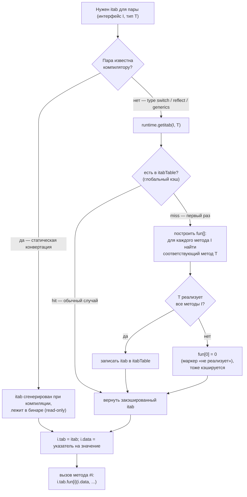

# Interfaces, Method Sets And Nil Pitfalls

Тема почти всегда всплывает на интервью, потому что касается и API design, и реальных production-багов. Senior-уровень — это не просто знать nil-ловушку, а понимать iface/eface layout, виртуальный dispatch и метод сеты.

## Содержание

- [Runtime представление интерфейса](#runtime-представление-интерфейса)
- [Как строится и кэшируется `itab`](#как-строится-и-кэшируется-itab)
- [Static vs dynamic dispatch: почему интерфейс медленнее](#static-vs-dynamic-dispatch-почему-интерфейс-медленнее)
- [Девиртуализация: когда компилятор убирает накладные расходы](#девиртуализация-когда-компилятор-убирает-накладные-расходы)
- [Что такое инлайнинг и почему он ускоряет](#что-такое-инлайнинг-и-почему-он-ускоряет)
- [Стоимость type assertion и type switch](#стоимость-type-assertion-и-type-switch)
- [Nil interface vs typed nil: как это работает](#nil-interface-vs-typed-nil-как-это-работает)
- [Где живёт тип: compile-time vs runtime](#где-живёт-тип-compile-time-vs-runtime)
- [Когда укладка значения в интерфейс аллоцирует (боксинг)](#когда-укладка-значения-в-интерфейс-аллоцирует-боксинг)
- [Method sets](#method-sets)
- [Addressability и interface satisfaction](#addressability-и-interface-satisfaction)
- [Приведение интерфейса к интерфейсу: что доступно](#приведение-интерфейса-к-интерфейсу-что-доступно)
- [Interface design: практические правила](#interface-design-практические-правила)
- [Production-антипаттерны](#production-антипаттерны)
- [Разбор примеров-загадок](#разбор-примеров-загадок)
- [Interview-ready answer](#interview-ready-answer)

## Runtime представление интерфейса

Интерфейс на низком уровне — это **реальная структура из рантайма** (определена в `runtime/runtime2.go`), а не абстракция. Интерфейсная переменная физически *и есть* такая структура из **двух машинных слов** (16 байт на 64-bit). Видов два — компилятор выбирает по тому, есть ли у интерфейса методы.

### eface — пустой интерфейс (`interface{}` / `any`)

```go
type eface struct {
    _type *_type          // дескриптор динамического типа значения
    data  unsafe.Pointer  // указатель на данные
}
```

Два поля:

- **`_type`** — указатель на **дескриптор типа** (см. ниже). Описывает, что за конкретный тип сейчас лежит внутри. `nil`, если интерфейс пустой.
- **`data`** — указатель на сами данные (или, для указателе-образных типов, само значение-указатель напрямую — см. раздел про боксинг).

У `any` нет методов → vtable не нужна → достаточно «голого» дескриптора типа.

> ⚠️ «vtable не хранится» ≠ «методы потеряны». `_type` знает про **все** методы конкретного типа (их метаданные). Поэтому из `any` можно привести к любому интерфейсу: `x.(Writer)` в момент assertion вызывает `getitab(Writer, _type)`, который строит `itab.fun` под `Writer` из этих метаданных и возвращает новое `iface`-значение (с кэшированием в `itabTable`). Assertion к **конкретному** типу (`x.(Cat)`) вообще обходится без vtable — это сравнение `_type`. Подробнее — [Приведение интерфейса к интерфейсу](#приведение-интерфейса-к-интерфейсу-что-доступно).

### iface — интерфейс с методами

```go
type iface struct {
    tab  *itab            // таблица для пары (интерфейс, конкретный тип)
    data unsafe.Pointer   // указатель на данные
}
```

Здесь вместо `_type` — указатель на `itab`. Именно `itab` несёт всю суть интерфейса с методами, разберём его поля.

### itab — сердце интерфейса с методами

```go
type itab struct {
    inter *interfacetype  // описание самого интерфейса (его методы и их порядок)
    _type *_type          // дескриптор конкретного типа, лежащего внутри
    hash  uint32          // копия _type.hash — для быстрого отсева в type switch
    _     [4]byte         // padding (выравнивание)
    fun   [1]uintptr      // vtable: fun[0], fun[1], … — адреса методов; [1] — трюк, реально длина = числу методов интерфейса
}
```

Поле за полем:

- **`inter`** (`*interfacetype`) — описание **интерфейса** как такового: список его методов (имена, сигнатуры) и их **порядок**. Один на тип интерфейса (`io.Writer`).
- **`_type`** (`*_type`) — дескриптор **конкретного типа** внутри (`*os.File`). Тот же самый дескриптор, что был бы в `eface`. Он **один на тип** и шарится между всеми `itab`-ами этого типа.
- **`hash`** — копия `_type.hash`; позволяет в `type switch` быстро отсеять неподходящие ветки, не разыменовывая `_type`.
- **`fun [1]uintptr`** — **vtable**: массив адресов методов конкретного типа, разложенных в порядке методов интерфейса. `[1]` в объявлении — приём из C: формально массив длины 1, но рантайм аллоцирует `itab` с «хвостом» нужной длины (= числу методов интерфейса) и обращается `fun[0]`, `fun[1]`, … За этим массивом — вся суть dispatch: вызвать метод №i = прыгнуть по `fun[i]`.

> `itab` кэшируется глобально: одна пара `(интерфейс, конкретный тип)` → один `itab`, создаётся при первом использовании и переиспользуется (детали — в разделе [Как строится и кэшируется itab](#как-строится-и-кэшируется-itab)).

### `_type` — дескриптор типа (общий для eface и iface)

`_type` (он же `rtype` в `reflect`) — рантайм-«паспорт» типа, **один на тип**, не привязан ни к какому интерфейсу:

```go
type _type struct {
    size       uintptr   // размер значения в байтах
    ptrdata    uintptr   // сколько байт в начале содержат указатели (для GC)
    hash       uint32    // хеш типа (для map/itab/type switch)
    tflag      tflag
    align      uint8     // выравнивание
    fieldAlign uint8
    kind       uint8     // категория: struct/slice/ptr/int/… (reflect.Kind)
    equal      func(unsafe.Pointer, unsafe.Pointer) bool // сравнение значений типа
    gcdata     *byte     // карта указателей для сборщика мусора
    str        nameOff   // имя типа (для reflection/ошибок)
    ptrToThis  typeOff
    // + uncommontype рядом: метаданные ВСЕХ методов типа (имя, сигнатура, адрес)
}
```

Здесь живёт всё, что нужно рантайму о типе: размер/выравнивание (как копировать), `gcdata` (где указатели — для GC), имя (для `reflect` и сообщений об ошибках), и метаданные **всех** методов типа. Именно сюда смотрит `reflect`, доставая тип из интерфейса.

### Важно: `_type` ≠ `itab.fun`

Частая путаница. Это **разные** вещи:

| | Что это | Сколько штук |
|---|---|---|
| **`_type`** | паспорт **типа**: размер, GC-инфо, имя, метаданные всех методов | **один на тип**, шарится между всеми интерфейсами |
| **`itab.fun`** | vtable: адреса методов **в порядке конкретного интерфейса** | **один на пару** (интерфейс, тип) |

Тот же `*os.File` под `io.Writer` и под `io.Closer` ссылается на **один** `_type`, но имеет **разные** `itab` с разными `fun[]` (разный набор/порядок методов). «Массив ссылок на методы под конкретный интерфейс» — это `itab.fun`, а не `_type`.

```
iface (io.Writer ← *os.File):
 ┌────────┬────────┐
 │  tab   │  data  │
 └───┬────┴───┬────┘
     ▼        ▼
   itab     данные (*os.File)
   ┌─────────────────────────────┐
   │ inter → interfacetype Writer │
   │ _type → ───────────────┐     │
   │ hash                    │     │
   │ fun[] = [&(*os.File).Write]   │  ← массив методов ПОД io.Writer (своя на пару)
   └─────────────────────────┼─────┘
                             ▼
                _type (*os.File)  ← ОДИН на тип, шарится со всеми itab-ами
                ┌──────────────────────────────┐
                │ size, align, kind, hash, gc…  │
                │ методы типа (ВСЕ): Read,Write… │
                └──────────────────────────────┘
```

### Вызов метода через интерфейс

```go
var w io.Writer = os.Stdout
w.Write(data)

// Компилируется примерно в:
// tab := w.tab           // 1) загрузить указатель на itab
// fn  := tab.fun[0]      // 2) загрузить адрес метода (Write — нулевой метод io.Writer)
// fn(w.data, data)       // 3) вызвать через указатель, receiver = w.data
```

Два indirect pointer load (`tab` → `fun[0]`) + непрямой `CALL` — вот почему interface-вызов чуть дороже прямого и почти не инлайнится (подробно — в разделе про dispatch).

## Как строится и кэшируется `itab`

`itab` — это «мостик» между **конкретным типом** и **интерфейсом**, который он реализует. Его задача — заранее ответить на вопрос «метод №i интерфейса — это какая физическая функция у данного типа?», чтобы в момент вызова не искать, а просто прыгнуть по готовому адресу.

Что внутри `itab` (напомним из layout выше):

- `inter` — описание интерфейса (`io.Writer`): список его методов и их порядок;
- `_type` — описание конкретного типа (`*os.File`);
- `hash` — копия `_type.hash`, нужна для быстрого отсева в type switch;
- `fun [N]uintptr` — **построенная vtable**: `fun[i]` = адрес метода конкретного типа, соответствующего `i`-му методу интерфейса. Это и есть «результат сопоставления».

**Построение `fun` = сопоставление двух списков методов.** Берём методы интерфейса по порядку и для каждого ищем одноимённый метод с подходящей сигнатурой в method set конкретного типа; найденный адрес кладём в `fun[i]`:

```
интерфейс io.Writer        конкретный тип *os.File
  методы:                    method set:
  [0] Write(p) (n, err)  ─┐    Read(...)
                          │    Write(...)  ←─────┐
                          │    Close()           │
                          └──► ищем "Write" ──────┘  адрес записываем в fun[0]

         itab{ inter: io.Writer, _type: *os.File, fun: [ &(*os.File).Write ] }
```

После этого вызов `w.Write(p)` — это `w.tab.fun[0](w.data, p)`: индекс метода известен на этапе компиляции (Write — нулевой метод `io.Writer`), а `fun[0]` уже указывает на нужную функцию.

### Откуда берётся `itab`: компиляция или рантайм

Есть два пути, и они сильно отличаются по цене.

**1. Пара (интерфейс, тип) известна компилятору** — например `var w io.Writer = os.Stdout` (тип `*os.File` виден прямо в коде). Тогда компилятор **сам строит `itab` на этапе компиляции** и кладёт его в бинарь как read-only данные. В рантайме строить нечего: конвертация = «положить адрес готового `itab` в `tab`, а указатель на значение — в `data`». Это почти бесплатно.

**2. Пара становится известна только в рантайме** — type switch, `reflect`, дженерики, присваивание `interface{}` → другому интерфейсу. Тогда `itab` достаётся лениво через `runtime.getitab`, которая использует **глобальный кэш `itabTable`** (хеш-таблица, ключ — пара «интерфейс + тип»):



Ключевое: **построение (miss-ветка) случается максимум один раз на пару типов** — дальше любой `getitab` для той же пары попадает в кэш. То есть стоимость сопоставления методов амортизируется до нуля; на горячем пути остаётся только дешёвый lookup, а чаще — вообще статический `itab` из бинаря.

### Когда тип не реализует интерфейс

Если при построении `fun` для какого-то метода интерфейса не нашлось соответствия в типе — `T` интерфейс **не реализует**. `getitab` помечает это, обнуляя `fun[0]` (маркер «нет реализации»), и тоже кэширует такой «пустой» `itab`, чтобы повторные проверки были быстрыми. Дальше поведение зависит от формы:

- `i.(I)` без второго значения → **паника** (`interface conversion`);
- `v, ok := i.(I)` → `ok == false`, без паники.

### Вывод

Резолв «какой метод вызвать» происходит **максимум один раз на пару (интерфейс, тип)**, а для статически известных пар — ещё на этапе компиляции. Поэтому стоимость интерфейса — **не** в построении таблицы (она амортизируется и кэшируется), а в **индирекции на каждом вызове**: два обращения к памяти (`tab` → `fun[i]`) и непрямой `CALL` (разбор — в следующем разделе).

## Static vs dynamic dispatch: почему интерфейс медленнее

```go
type Cat struct{}
func (Cat) Speak() string { return "meow" }

c := Cat{}
c.Speak()                 // (A) STATIC dispatch — прямой вызов
var a Animal = c
a.Speak()                 // (B) DYNAMIC dispatch — через itab
```

**(A) Прямой вызов (static dispatch).** Конкретный тип известен на этапе компиляции → компилятор знает точный адрес функции `Cat.Speak`. Он генерирует прямой `CALL` по фиксированному адресу — а чаще **вообще убирает вызов**, заинлайнив тело метода в место вызова.

**(B) Интерфейсный вызов (dynamic dispatch).** Какой именно метод звать, известно только в рантайме (в `a` мог лежать любой `Animal`). Компилятор генерирует: `tab := a.tab; fn := tab.fun[i]; fn(a.data, …)`.

Почему (B) дороже — по нарастанию важности:

| Фактор | Прямой вызов | Интерфейсный вызов |
|---|---|---|
| Адрес функции | известен в компиляции | 2 загрузки из памяти (`tab` → `fun[i]`) |
| Тип перехода | прямой `CALL` | **indirect call** через указатель |
| Предсказание ветвления | тривиально | indirect branch — может мисспредиктнуться (столл конвейера) |
| **Инлайнинг** | **возможен** | **невозможен** (тело неизвестно) |
| Следствия инлайнинга | BCE, constant folding, escape analysis | всё это теряется на границе вызова |

**Главная цена — не два лишних load и даже не indirect branch, а потерянный инлайнинг.** Прямой мелкий метод компилятор встраивает в caller, после чего применяет каскад оптимизаций: устранение проверок границ, свёртку констант, держание значений на стеке/в регистрах. Интерфейсный вызов — непрозрачная граница: компилятор не видит тело, инлайн невозможен, и все зависящие от него оптимизации не срабатывают. В горячем цикле это куда заметнее, чем сама индирекция.

Дополнительный эффект: укладывание значения в интерфейс часто заставляет его **escape в heap** (см. раздел [Когда укладка значения в интерфейс аллоцирует](#когда-укладка-значения-в-интерфейс-аллоцирует-боксинг)) — ещё и аллокация + нагрузка на GC, которой при работе с конкретным типом не было бы.

### Бенчмарк: реальные цифры

Замер на одном и том же методе (`func (Cat) Speak() int`), вызываемом по слайсу из 1024 элементов; per-call время. `go1.26`, `darwin/arm64`, Apple M3 Max, `-benchmem -count=5`:

```
BenchmarkDirect-16             0.56 ns/op    0 B/op   0 allocs/op   // конкретный тип, инлайн
BenchmarkInterfaceSameType-16  1.14 ns/op    0 B/op   0 allocs/op   // []Speaker, все Cat
BenchmarkInterfaceMixed-16     1.47 ns/op    0 B/op   0 allocs/op   // []Speaker, Cat+Dog вперемешку
BenchmarkBoxingBig-16          9.40 ns/op   32 B/op   1 allocs/op   // боксинг struct с escape в heap
```

Что показывают цифры:

- **Прямой vs интерфейсный — примерно ×2…×2.6** (0.56 → 1.14…1.47 ns). Разрыв здесь скромный, потому что метод тривиальный; основная его часть — потеря инлайнинга (прямой `Speak` встроился и почти исчез, интерфейсный — нет). На методах, которые сами инлайнились бы и тянули за собой BCE/свёртку констант, относительный разрыв в горячем цикле бывает больше.
- **SameType медленнее Direct, хотя тип везде один.** Без PGO компилятор не доказывает, что во всех ячейках `[]Speaker` лежит `Cat`, → devirtualization не срабатывает, идёт настоящий dynamic dispatch.
- **Mixed дороже SameType** (1.47 vs 1.14): при чередовании типов цель indirect call скачет → процессору труднее предсказывать переход (branch target misprediction).
- **Боксинг — отдельная и куда бóльшая статья**: `BoxingBig` это уже `9.4 ns` и **32 B + 1 аллокация** на операцию (значение-struct не влезает в слово и escape'ит в heap). Часто именно аллокация при укладывании значения в интерфейс, а не сам dispatch, доминирует в профиле.

> Сравни с первым простым бенчмарком, где интерфейсная переменная имела **доказуемо** конкретный тип (`var sp Speaker = Cat{}`): там компилятор девиртуализировал вызов, и интерфейс шёл вровень с прямым (≈0.25 ns, 0 allocs). Отсюда и вывод: «интерфейс медленнее» зависит от того, может ли компилятор доказать тип.

Бенчмарк целиком (положить в `bench_test.go`, запустить `go test -bench=. -benchmem`):

```go
type Speaker interface{ Speak() int }
type Cat struct{ n int }
func (c Cat) Speak() int { return c.n*3 + 1 }
type Dog struct{ n int }
func (d Dog) Speak() int { return d.n*5 + 2 }

const N = 1024
var cats [N]Cat
var sameType, mixed [N]Speaker
// init: cats[i]=Cat{i}; sameType[i]=Cat{i}; mixed[i]= чётные Cat, нечётные Dog

func BenchmarkDirect(b *testing.B) {
    s := 0
    for i := 0; i < b.N; i++ { s += cats[i%N].Speak() }      // static dispatch + инлайн
    sink = s
}
func BenchmarkInterfaceMixed(b *testing.B) {
    s := 0
    for i := 0; i < b.N; i++ { s += mixed[i%N].Speak() }     // dynamic dispatch
    sink = s
}
```

Практический смысл: интерфейсы — правильный инструмент для абстракции и тестируемости, и в обычном коде их стоимость незаметна (доли наносекунды на вызов). Думать об этом стоит **только на доказанно горячем пути** (профиль показал, что вызов в цикле — боттлнек), и тогда чаще выигрывает устранение **боксинга/аллокаций**, а не самого dispatch. Преждевременно менять интерфейсы на конкретные типы ради скорости — не нужно.

## Девиртуализация: когда компилятор убирает накладные расходы

Компилятор умеет превращать динамический вызов обратно в прямой (**девиртуализация**), когда может доказать конкретный тип:

```go
func count(r io.Reader) { ... }

var b bytes.Buffer
count(&b)   // если count заинлайнится, компилятор увидит конкретный *bytes.Buffer
            // и заменит интерфейсные вызовы на прямые (+ возможный инлайн)
```

Случаи девиртуализации:

- **локально доказуемый тип** — интерфейсная переменная присвоена из конкретного типа и не «убегает», компилятор подставляет прямой вызов;
- **PGO-девиртуализация (Go 1.20+)** — profile-guided optimization: по профилю компилятор видит, что в конкретной точке вызова в 99% случаев лежит один тип, и генерирует «быстрый путь» — проверку типа + прямой инлайнящийся вызов, с fallback на обычный интерфейсный для прочих типов:

```go
// концептуально, что вставляет PGO:
if a.tab == itabForCat {       // дешёвая проверка
    catSpeakInlined()          // прямой путь, заинлайнено
} else {
    a.tab.fun[i](a.data)       // общий путь
}
```

Поэтому «интерфейс всегда медленный» — неточно: часть вызовов компилятор девиртуализирует сам, а с PGO — и горячие мономорфные вызовы. Проверять, что именно произошло, — через `go build -gcflags="-m"` (инлайн-решения) и дизассемблер.

## Что такое инлайнинг и почему он ускоряет

Выше «потеря инлайнинга» названа главной ценой dynamic dispatch. Разберём подробно, что это и откуда берётся ускорение — так, чтобы можно было объяснить на собеседовании.

**Инлайнинг (встраивание)** — это оптимизация компилятора: вместо того чтобы генерировать **вызов** функции, компилятор берёт её тело и **вставляет (копирует) прямо в то место, где её вызывали**. Функция как отдельная подпрограмма исчезает, её код становится частью вызывающей функции.

Буквально, исходная картина:

```go
func add(a, b int) int { return a + b }

func sum() int {
    return add(1, 2) + add(3, 4)
}
```

После инлайна компилятор работает так, как будто написано:

```go
func sum() int {
    return (1 + 2) + (3 + 4)   // тела add подставлены на место вызовов
}
```

Дальше он замечает, что всё это константы, и сводит к `return 10`. Ни одного вызова не осталось. Это и есть суть: инлайн сам по себе убирает вызов, но **главное — он открывает дверь следующим оптимизациям**. Разберём обе части.

### 1. Прямая экономия — исчезает стоимость самого вызова

Вызов функции — это не «бесплатный переход к другому коду». У него есть машинная цена. Что реально происходит на каждый вызов (и что объясняют термины):

- **Передача аргументов.** Перед вызовом аргументы нужно разложить туда, откуда функция их прочитает — в регистры процессора или на стек (по «соглашению о вызовах», calling convention — это договорённость, где что лежит). На возврат — то же с результатом.
- **`CALL` и адрес возврата.** Инструкция `CALL` сохраняет «куда вернуться после функции» (адрес возврата) и прыгает на код функции. По завершении `RET` читает этот адрес и прыгает обратно.
- **Стековый фрейм (stack frame).** Это участок стека, который функция отводит под свои локальные переменные и служебные данные. **Пролог** — код в начале функции, который этот фрейм заводит; **эпилог** — код в конце, который его сворачивает.
- **Проверка роста стека (`morestack`).** У горутины маленький стек (от 2 KB), который растёт по мере надобности. В прологе почти каждой функции есть проверка: «хватает ли места на стеке для моего фрейма? если нет — увеличить стек». Это пара инструкций, но они есть на каждом не-инлайненном вызове.

Для крошечной функции вроде `return a + b` вся эта обвязка (аргументы + CALL/RET + пролог/эпилог + проверка стека) **дороже, чем само полезное действие** (одно сложение). Инлайн её полностью убирает: тело просто исполняется внутри вызывающей функции, без перехода, без своего фрейма.

### 2. Главное — открывается окно для остальных оптимизаций

Пока функция вызывается, для оптимизатора она **«чёрный ящик»**: на месте вызова он не знает, что внутри, и вынужден исходить из худшего (функция может сделать что угодно с аргументами). Граница вызова обрывает анализ. После инлайна тело видно **в контексте конкретного вызова** — с конкретными аргументами и тем, что происходит вокруг. Это включает каскад оптимизаций. Разберём каждую с примером и тем, **почему именно граница вызова её блокировала**.

**Свёртка и распространение констант (constant folding/propagation)** — вычислить на этапе компиляции то, что не зависит от рантайма. До инлайна `add(1, 2)` — это вызов, результат «неизвестен до выполнения». После инлайна это `1 + 2`, и компилятор сразу пишет `3`.

**Удаление мёртвого кода (dead code elimination)** — выкинуть ветки, которые при данных аргументах недостижимы:

```go
func scale(v int, enabled bool) int {
    if !enabled { return v }
    return v * 2
}
y := scale(x, false)   // после инлайна видно enabled==false → остаётся просто `y := x`,
                       // ветка `v * 2` выкидывается
```

Без инлайна `enabled` для компилятора неизвестен — обе ветки приходится оставлять.

**Устранение проверок границ (bounds-check elimination, BCE).** В Go каждое обращение `s[i]` сопровождается проверкой `0 <= i < len(s)` (защита от выхода за границы; иначе — паника). Если после инлайна компилятор видит, что `i` гарантированно в диапазоне, он убирает эту проверку — меньше инструкций в горячем цикле. Через границу вызова он этого доказать не мог.

**Escape analysis (анализ убегания).** Компилятор решает, где разместить значение: на **стеке** (дёшево, освобождается само при выходе из функции) или в **куче/heap** (дороже, потом убирает сборщик мусора). Если он докажет, что значение не «убегает» наружу (ссылка на него не переживёт функцию), оно остаётся на стеке. Вызов мешает доказательству: «а вдруг вызываемая функция где-то сохранит указатель?» После инлайна тело видно — видно, что не сохраняет, → значение остаётся на стеке, нет аллокации и нагрузки на GC. (Подробнее — в [memory-internals/03-escape-analysis](./memory-internals/03-escape-analysis.md).)

**Размещение в регистрах через бывшую границу вызова.** Регистры — самая быстрая память процессора. На границе вызова значения часто приходится «сбрасывать» из регистров в память (вызываемая функция сама пользуется регистрами). Когда вызова нет, компилятор свободно держит значения в регистрах на протяжении бывшего тела — без лишних обращений к памяти.

Сводный пример:

```go
func clamp(v, lo, hi int) int {
    if v < lo { return lo }
    if v > hi { return hi }
    return v
}

x := clamp(5, 0, 10)
```

Если `clamp` встроился, компилятор видит `clamp(5, 0, 10)` целиком: прогоняет оба `if` на этапе компиляции (5 не меньше 0, не больше 10) и сводит всё к `x := 5`. В рантайме не остаётся ни вызова, ни сравнений — ноль работы. Без инлайна это настоящий вызов с тремя аргументами и двумя сравнениями **на каждый прогон**.

Именно поэтому в бенчмарке выше прямой вызов «растворялся в нули»: дело не только в том, что его дешевле выполнить — его часто **вообще нет** в финальном коде. А интерфейсный вызов встроить нельзя: до рантайма неизвестно, какой конкретный метод вызовется (тело за `itab.fun[i]` выбирается динамически), компилятору нечего подставить. Значит, весь каскад выше не срабатывает — вот это и есть «потеря инлайнинга» как главная цена dynamic dispatch (а не два лишних обращения к памяти).

### Compile-time константы vs рантайм-значения

Важно не путать **инлайн** (подстановку тела) со **знанием значений аргументов** — это независимые вещи. Инлайн происходит на этапе компиляции и **не требует** знать, чем будут аргументы в рантайме. От того, известны ли значения, зависит лишь, какая часть каскада сработает.

- **Compile-time константы** — литералы и `const` (и выражения из них). Значение известно компилятору → работает всё, включая свёртку констант и выкидывание мёртвых веток (как `clamp(5, 0, 10) → 5`).
- **Рантайм-значения** — `os.Getenv`, флаги, конфиг, ввод, результаты функций. Компилятор их **не знает** до выполнения.

```go
v := os.Getenv("LEVEL")   // рантайм-значение
if v == "debug" { ... }   // нельзя ни свернуть, ни выкинуть — проверка останется в рантайме
```

Ключевой момент: **«куча env-параметров» инлайн НЕ отключает.** Встроенная функция с рантайм-аргументами всё равно даёт основную выгоду, потому что часть оптимизаций зависит от **структуры кода / потока данных**, а не от конкретных значений:

| | Аргумент — константа (литерал, `const`) | Аргумент — рантайм-значение (env, ввод) |
|---|:---:|:---:|
| Инлайн происходит | ✅ | ✅ |
| Убрана цена вызова (CALL/RET, фрейм, проверка стека) | ✅ | ✅ |
| escape analysis, размещение в регистрах | ✅ | ✅ |
| Свёртка констант, выкидывание веток | ✅ | ❌ значение неизвестно |

Теряется только «магия» вроде сведения функции к одной константе — она возможна лишь когда значения известны на этапе компиляции. В Go `const` — это именно compile-time константа; значение из `os.Getenv`/флага в `const` не положить, оно по определению рантайм.

### 3. Почему не встраивают всё подряд

Инлайн — не «всегда хорошо», у него есть обратная сторона:

- **Рост размера кода.** Тело копируется в **каждое** место вызова. Если встроить большую функцию, вызываемую из сотни мест, код раздувается. Это давит на **инструкционный кэш (i-cache)** — маленькую быструю память процессора под исполняемый код; если код не влезает, процессор чаще ходит в медленную память, и горячий цикл может стать *медленнее*. То есть бесконтрольный инлайн способен навредить.
- **Бюджет инлайна.** Чтобы не раздувать код, Go оценивает «стоимость» функции по внутренней метрике (примерно по числу операций, ориентир — порог около 80 единиц). Дороже бюджета — не встраивается. Исторически инлайн блокировали циклы, `defer`, `recover`, замыкания; часть ограничений со временем сняли, но крупные функции по-прежнему остаются вызовами.
- Вывод: инлайн выгоден для **мелких, часто вызываемых** функций — там экономия перевешивает рост кода. Поэтому геттеры, мелкие методы, `clamp`-подобные хелперы встраиваются, а большие функции — нет (и это нормально: на фоне их собственной работы цена вызова незаметна).

**Как посмотреть, что решил компилятор:** `go build -gcflags="-m"` печатает `can inline …` (функция-кандидат), `inlining call to …` (вызов встроен) и причины отказа — например `function too complex` или `… cannot inline … : unhandled op`. Флаг `-m=2` даёт подробности и оценку стоимости.

## Стоимость type assertion и type switch

Проверка динамического типа — тоже не бесплатна, хотя и дёшева:

```go
v, ok := x.(*Cat)   // сравнение itab/тип-указателя
switch v := x.(type) { ... }
```

- **`x.(*Concrete)`** — сравнить указатель `itab` (или `_type`) интерфейса с ожидаемым: фактически одно сравнение указателей. Очень дёшево.
- **`x.(Interface)`** (assert к другому интерфейсу) — дороже: нужен `itab` для пары (целевой интерфейс, конкретный тип), которого может ещё не быть → `getitab` (lookup/построение, потом кэш).
- **type switch** — сравнивает `itab.hash` (та самая `hash` в `itab`, копия `_type.hash`) для быстрого отсева, затем полное сравнение типа в совпавшей ветке. Линейно по числу веток, но каждое сравнение дешёвое; компилятор для больших switch может строить хеш-таблицу.

В горячем цикле многократный type switch / assert к интерфейсам лучше вынести наружу или закэшировать результат — но в обычном коде это пренебрежимо.

## Nil interface vs typed nil: как это работает

Это самая частая ошибка на Go-интервью.

**Nil interface** — оба поля (tab и data) равны nil:
```go
var err error // tab=nil, data=nil → interface == nil ✓
fmt.Println(err == nil) // true
```

**Typed nil** — tab не nil (тип задан), data = nil:
```go
func getError() error {
    var p *MyError = nil // *MyError, значение nil
    return p             // tab=*itab{MyError}, data=nil → interface != nil !
}

err := getError()
fmt.Println(err == nil) // false — ЛОВУШКА
```

Визуально в памяти:
```
nil interface:           typed nil interface:
┌──────────┐            ┌──────────────────┐
│ tab: nil │            │ tab: → itab{      │
│ data: nil│            │       MyError}    │
└──────────┘            │ data: nil         │
                        └──────────────────┘
```

Откуда у nil-указателя берётся непустой `tab` — разобрано ниже в разделе [Где живёт тип](#где-живёт-тип-compile-time-vs-runtime) (тип приклеивается из compile-time знания, не из значения).

**Классический баг:**
```go
type MyError struct{ msg string }
func (e *MyError) Error() string { return e.msg }

func fetchData() error {
    var err *MyError // typed nil
    if someFailed {
        err = &MyError{"something failed"}
    }
    return err // ВСЕГДА возвращает non-nil error, даже если err == nil!
}

// Правильно:
func fetchData() error {
    var err *MyError
    if someFailed {
        err = &MyError{"something failed"}
    }
    if err != nil {
        return err // возвращаем конкретный тип только если ненулевой
    }
    return nil // явный nil интерфейса
}
```

**Ещё один частый случай — логгирование:**
```go
// Плохо: logger принимает interface{}, typed nil логируется как не-nil
func maybeLog(err error) {
    if err != nil { // true если typed nil!
        log.Error(err)
    }
}

// Правильно: проверять конкретный тип ДО передачи в интерфейс
var dbErr *DBError
if dbErr != nil { // проверяем concrete type
    return dbErr
}
return nil
```

## Где живёт тип: compile-time vs runtime

Typed-nil-ловушка выше держится на одном факте: **тип переменной — это свойство кода (этап компиляции), а не значения (рантайм).** У обычной переменной в памяти лежит только её значение, без «ярлыка типа». Разберём, в каком виде тип существует на самом деле — это снимает большинство вопросов про интерфейсы.

### Тип существует в трёх формах

**1. В исходнике** — текст объявления (`var p *MyError`, или вывод типа при `:=`). Человекочитаемая форма.

**2. Во время компиляции** — объект-тип, привязанный к каждому выражению/переменной во внутренних таблицах компилятора:

```
p           ──► Type: *MyError      ┐
n           ──► Type: int           ├─ аннотации в памяти компилятора;
return p    ──► нужна конвертация    │   нужны для проверки кода, выбора метода,
                *MyError → error     ┘   расчёта размера, кодогенерации
```

Эта аннотация **нигде в программе не хранится** — она используется при компиляции и исчезает.

**3. В бинаре** — тип «материализуется» как отдельный read-only объект **только там, где его требует рантайм** (упаковка в интерфейс, reflection). У самой переменной тега типа нет.

### Конкретная переменная хранит только значение

```go
var n int         // 8 байт: 0x0000000000000000 — никакого тега типа
var p *MyError    // 8 байт указателя
var s []int       // 3 слова {ptr,len,cap} — тоже без тега типа
```

Спросить у этих байт «какой это тип?» в рантайме нельзя — тип не записан рядом. Он известен **только компилятору** и применяется при кодогенерации: например, `b.Len()` для `var b bytes.Buffer` компилируется в прямой `CALL bytes.(*Buffer).Len` — адрес метода зашит, потому что статический тип известен, и в рантайме тип искать не нужно.

### Тип «материализуется» только при упаковке в интерфейс

Вот что реально генерируется на конвертации значения в интерфейс — три разных случая (вывод `go build -gcflags=-S`, arm64):

**`*MyError → error`** (iface, указатель помещается в слово — без аллокации):

```asm
MOVD  R0, R1                                    ; data-слово = указатель (тут nil)
MOVD  $go:itab.*main.MyError,error(SB), R0      ; type-слово = АДРЕС готового itab
```

**`int → any`** (eface, значение боксируется в heap):

```asm
CALL  runtime.convT64(SB)        ; боксинг: положить int в кучу, вернуть указатель
MOVD  $type:int(SB), R0          ; type-слово = дескриптор типа int (не itab — у eface itab нет)
```

**`Celsius → fmt.Stringer`** (iface + боксинг value-типа):

```asm
CALL  runtime.convT64(SB)                          ; боксинг float64-значения
MOVD  $go:itab.main.Celsius,fmt.Stringer(SB), R0   ; type-слово = itab
```

Видно три вещи:

1. `eface` (`any`) несёт дескриптор типа `type:int`, а `iface` — `itab` `go:itab.I,T`.
2. Укладка значения (int, Celsius) вызывает боксинг (`convT64`), а укладка указателя — нет.
3. Тип в type-слово грузится как адрес символа, заранее сгенерированного компилятором.

### Что лежит в бинаре

Сами эти символы компилятор кладёт в секцию read-only данных (`SRODATA`), по одному на тип/пару:

```
type:main.Celsius                   SRODATA size=80   ← дескриптор типа (_type)
type:*main.Celsius                  SRODATA size=88
go:itab.main.Celsius,fmt.Stringer   SRODATA size=32   ← itab для пары (Stringer, Celsius)
go:itab.*main.MyError,error         SRODATA size=32
```

Дескриптор `_type` (то, что прячется за `type:…`) — это рантайм-описание типа: размер, выравнивание, информация о полях/указателях для GC, имя для reflection. Он один на тип и шарится. Именно сюда смотрит `reflect`, когда «достаёт тип» из `interface{}` — то есть **reflection работает только через интерфейс**, потому что лишь там тип доступен в рантайме.

### Почему отсюда следует typed-nil-ловушка

`var p *MyError = nil; return p` (функция возвращает `error`): на `return` компилятор знает статически, что `p` — это `*MyError`, и генерирует `MOVD $go:itab.*main.MyError,error(SB), R0` — кладёт **непустой** itab в type-слово, а data-слово = значение `p` = nil. Тип взят из знания компилятора, а не из значения. Результат — интерфейс `{itab≠nil, data=nil}` ≠ `nil`.

А `return nil` (литерал) компилируется просто в `RET` с нулевыми регистрами результата — type-слово пустое → интерфейс действительно `nil`. Разница — есть ли у компилятора в точке конвертации **статический конкретный тип**.

### Сводка

| Этап | В каком виде существует тип |
|---|---|
| Исходник | текст объявления (`*MyError`, `int`) |
| Компиляция | объект-тип на узле/символе во внутренних таблицах компилятора (потом исчезает) |
| Бинарь | `type:…` (дескриптор `_type`) и `go:itab.I,T` в rodata — **только** для типов, нужных рантайму |
| Конкретная переменная в рантайме | **только значение**, без тега типа |
| Интерфейсная переменная в рантайме | два слова: указатель на `_type`/`itab` **+** данные — единственный носитель типа в рантайме |

## Когда укладка значения в интерфейс аллоцирует (боксинг)

Укладка значения в интерфейс **иногда** вызывает heap-аллокацию, а иногда — нет. Это частый вопрос на собесе и реальный источник аллокаций в горячем коде. Чтобы не гадать, нужно понимать механику.

### Почему вообще возникает боксинг

`data`-слово интерфейса — это **всегда указатель** (с Go 1.4). Значит, чтобы интерфейс «держал» значение, на это значение должно быть на что указать. Дальше два сценария:

- **Тип уже «указателе-образный»** (сам шириной в одно слово-указатель) — он кладётся в `data` **напрямую**, копировать некуда, боксинга нет вообще. Аллокации нет никогда.
- **Тип — «значение»** (struct, string, int, array, float) — нужно место в памяти, на которое укажет `data`. Где это место:
  - компилятор доказал, что интерфейс **не убегает** за пределы функции → значение лежит на **стеке**, `data` указывает туда → аллокации нет;
  - доказать не смог (значение **escape**) → значение копируется в **heap** → **аллокация**.

Вывод: аллокацию определяют два фактора — (1) указателе-образный ли тип и (2) убегает ли значение. Не «значение vs указатель» само по себе, а именно escape value-типа.

### Что НЕ аллоцирует

- **Указателе-образные типы (directiface):** `*T`, `chan`, `map`, `func`, `unsafe.Pointer`, а также struct/массив с **единственным** полем такого типа (`struct{ p *T }`). Значение само — указатель, ложится в `data` напрямую.
- **Маленькие целые `0..255` и `bool`:** рантайм держит статический массив (`runtime.staticuint64s`); `data` указывает в него, новой памяти не выделяется.
- **Пустой `struct{}`:** указывает на общий `runtime.zerobase`.
- **Любое значение, которое не убегает:** даже большой struct остаётся на стеке, если интерфейс не вышел за пределы функции.

### Что аллоцирует

value-тип, который **не** попал под directiface/статические оптимизации **и убегает**: рантайм-`int` (≥256), `string` (это 2 слова — заголовок), `struct`, массив, `float64`. Боксинг = копия значения в heap (вызов `runtime.convT*`).

### Реальные цифры

Боксинг разных типов в `any` с escape (`go test -bench -benchmem`, arm64):

| Что кладём в интерфейс | Аллокация |
|---|---|
| `*int` (указатель) | `0 B, 0 allocs` — directiface |
| `struct{ p *int }` (одно ptr-поле) | `0 B, 0 allocs` — directiface |
| `int = 200` (0..255) | `0 B, 0 allocs` — staticuint64s |
| `true` | `0 B, 0 allocs` |
| `struct{}` пустой | `0 B, 0 allocs` — zerobase |
| `struct{a,b,c int}`, **не убегает** | `0 B, 0 allocs` — остаётся на стеке |
| `int = 1000` (рантайм, убегает) | `8 B, 1 alloc` |
| `string`, убегает | `16 B, 1 alloc` (заголовок строки) |
| `struct{a,b,c int}`, убегает | `24 B, 1 alloc` |

Видно: один и тот же `struct{a,b,c int}` даёт `0` или `1 alloc` — разница только в том, **убежал** ли он. А `*int` и `struct{p *int}` не аллоцируют никогда (directiface).

### Где это кусается на практике

```go
for _, x := range items {
    fmt.Println(x)        // x уходит в ...any → escape в недра fmt (reflection) → аллокация
    json.Marshal(x)       // то же: аргумент боксируется и убегает
}
```

Вариативные `...any` (`fmt`, `log`, старый `log`), `[]any`, `map[K]any`, `chan any` — везде значение боксируется и обычно убегает, поэтому в горячем цикле каждый не-directiface аргумент = аллокация + работа GC. Это одна из частых причин «неожиданных» allocs/op в профиле.

Что с этим делать на горячем пути:
- не заворачивать в `any` без нужды; передавать конкретные типы или **указатели** (directiface — без аллокации);
- для логов — типизированный API с ленивостью (`slog.Int(...)`, см. [log/slog](../02-go-stdlib-and-tools/03-slog.md)) вместо `...any`;
- переиспользовать боксы (`sync.Pool`), если уж нужен `any`.

### Как проверять

- `go build -gcflags="-m"` — покажет `... escapes to heap` / `... does not escape` для конкретной укладки;
- `go test -bench -benchmem` — `allocs/op` подтвердит цифрами.

```go
func box(s Big) any { return s }   // -m: "s escapes to heap" → 1 alloc на вызов
```

## Method sets

Правила для удовлетворения интерфейса:

| Receiver   | Реализован методами T | Реализован методами *T |
|------------|----------------------|------------------------|
| T value    | ✅ оба               | ❌ только *T           |
| *T pointer | ✅ оба               | ✅ оба                 |

```go
type Stringer interface {
    String() string
}

type MyType struct{ val int }

// Value receiver — доступен и для T, и для *T
func (m MyType) String() string {
    return fmt.Sprintf("%d", m.val)
}

var s Stringer
s = MyType{42}   // OK: value receiver доступен для T
s = &MyType{42}  // OK: value receiver доступен и для *T
```

```go
// Pointer receiver — только *T удовлетворяет интерфейсу
func (m *MyType) Reset() {
    m.val = 0
}

type Resetter interface {
    Reset()
}

var r Resetter
r = &MyType{42}  // OK
r = MyType{42}   // ОШИБКА КОМПИЛЯЦИИ: MyType не реализует Resetter
                 // (метод Reset имеет pointer receiver)
```

Почему так: если бы `T` мог удовлетворять интерфейсу с pointer receiver, это означало бы изменение **копии** — бессмысленно и confusing.

## Addressability и interface satisfaction

Интересный edge case:

```go
type Counter struct{ n int }
func (c *Counter) Inc() { c.n++ }

type Incer interface{ Inc() }

// Это работает:
c := Counter{}
var i Incer = &c  // OK: &c адресуема

// Это тоже работает (компилятор может взять адрес):
c := Counter{}
c.Inc()  // компилятор переписывает в (&c).Inc() — c адресуема

// Это НЕ работает (non-addressable):
var i Incer = Counter{}    // ОШИБКА: Counter{} — временное значение, не адресуемо
Counter{}.Inc()            // ОШИБКА: нельзя взять адрес временного значения
m := map[string]Counter{}
m["x"].Inc()               // ОШИБКА: элемент map не адресуем
```

### `c.Inc()` → `(&c).Inc()` — это правило спецификации, а не «догадка» компилятора

Перезапись `c.Inc()` в `(&c).Inc()` может выглядеть как самодеятельность компилятора, но это **зафиксированный в спецификации синтаксический сахар**, одинаковый во всех компиляторах Go. Дословно правило: *если `x` **адресуема** и метод-сет `&x` содержит `m`, то `x.m()` — это сокращение для `(&x).m()`*. Аналогично работает обратное направление: для указателя `p` вызов `p.Value()` — сокращение для `(*p).Value()` (авто-разыменование). Оба — просто способ не писать `&`/`*` руками.

Почему это безопасно: pointer-receiver методу физически нужен `*Counter` — адрес. Если `c` это переменная, она лежит в памяти → `&c` имеет смысл, и компилятор подставляет ровно тот адрес, который написал бы и сам разработчик. Никакого скрытого поведения в рантайме — это та же передача указателя.

Ключевой момент — **почему компилятор отказывается, а не «додумывает» в неадресуемых случаях.** Pointer-receiver метод меняет оригинал. Если бы компилятор молча завёл скрытую временную переменную для `Counter{}.Inc()` или `m["x"].Inc()`, мутация ушла бы в копию, которая тут же исчезнет, — незаметный баг. Поэтому вместо «догадки» Go выдаёт ошибку компиляции и заставляет выразить намерение явно (взять переменную или хранить `*Counter`/`map[K]*Counter`). Логика обратная импровизации: адрес берётся **только когда это безусловно корректно** (адрес стабилен), иначе — отказ.

> Адресуемы: переменные, элементы слайса (`s[i]`), поля адресуемой структуры, элементы адресуемого массива, результат разыменования (`*p`). Не адресуемы: временные значения (литерал `Counter{}`, результат функции `f()`), элементы map (`m[k]`) — отсюда и ошибки выше.

## Приведение интерфейса к интерфейсу: что доступно

Отдельный случай: структуру кладут в один (узкий) интерфейс, потом приводят к другому интерфейсу — будут ли доступны методы, которых **не было** в первом интерфейсе, но которые есть у исходной структуры? 
- Ответ: **да, через type assertion**.

### Что такое «динамический тип» внутри интерфейса

Интерфейсное значение — это два слова: дескриптор типа (`itab._type` / `eface._type`) и указатель на данные. Дескриптор описывает **динамический (конкретный) тип** — тот реальный тип, который положили в интерфейс (`File`, `*os.File`, …).

Ключевые свойства динамического типа:

- он фиксируется **в момент упаковки** значения в интерфейс и несёт **полный** method set этого типа — все его методы, а не только те, что объявлены в текущем интерфейсе;
- он **не меняется** при переприсваивании между интерфейсными переменными. Положили `File` в `Reader`, присвоили из `Reader` в `any`, потом достали — внутри всё ещё `File` со всеми методами;
- **статический тип** интерфейсной переменной (то, что написано в её объявлении, `Reader`) — это лишь «окно»: он ограничивает, какие методы можно вызвать **напрямую через эту переменную на этапе компиляции**. Он НЕ обрезает динамический тип и не выкидывает «лишние» методы из значения.

То есть `var r Reader = File{}` не превращает `File` в «объект с одним методом Read». Внутри лежит полноценный `File`; просто через `r` компилятор разрешает звать только `Read`.

### Assertion сверяется с динамическим типом, а не с промежуточным интерфейсом

`r.(Writer)` в рантайме делает следующее: берёт **динамический тип** из `r` (это `File`) и спрашивает «реализует ли `File` интерфейс `Writer`?» — то есть есть ли у `File` все методы, которые требует `Writer`. Проверка идёт по полному method set конкретного типа, а **не** по методам `Reader` (промежуточного интерфейса). Поэтому метод, которого не было в `Reader`, но который есть у `File`, прекрасно находится.

Механически это тот же `getitab`, что и при любой динамической упаковке: рантайм берёт/строит `itab(Writer, File)`; если все методы `Writer` нашлись у `File` — assertion успешен и возвращается новое интерфейсное значение (новый `itab`, **тот же** указатель на данные); если нет — провал (паника или `ok == false`).

```go
type Reader     interface { Read() string }
type Writer     interface { Write(s string) }

type File struct{}
func (File) Read() string   { return "data" }
func (File) Write(s string) {}

var r Reader = File{}    // динамический тип = File (со всеми методами)
// r.Write("x")          // ❌ compile error: у статического типа Reader нет Write

w, ok := r.(Writer)      // ✅ runtime сверяет File (не Reader) → File реализует Write
if ok { w.Write("x") }   // работает: метод "спрятан" окном Reader, но есть у File
```

```
r : ┌───────────────┐
    │ tab → itab(Reader, File) │     динамический тип = File
    │ data → File{}            │     (полный method set: Read, Write)
    └───────────────┘
            │  r.(Writer): «реализует ли File методы Writer?» → да
            ▼
w : ┌───────────────┐
    │ tab → itab(Writer, File) │     тот же File, новое «окно» Writer
    │ data → File{}            │     (теперь видно Write)
    └───────────────┘
```

Цепочка `A → B → C` работает так же: каждый assertion сверяется с **исходным конкретным типом**, а не с предыдущим интерфейсом. Можно переключиться на любой интерфейс, который этот тип реализует, — даже на никак не связанный с первым.

### Assertion vs неявное присваивание — где разница

Это два разных механизма с разными правилами:

| | Правило | Когда проверяется |
|---|---|---|
| **Присваивание** `var b B = a` (`a` статически типа `A`) | компилируется, только если **method set `A` ⊇ `B`** (`B` — «уже», чем `A`) | компиляция |
| **Assertion** `a.(B)` | успешно, если **динамический тип** реализует `B` (у `B` могут быть методы, которых нет в `A`) | рантайм |

```go
type ReadWriter interface { Read() string; Write(s string) }

var rw ReadWriter = File{}
var r  Reader     = rw       // ✅ неявно: ReadWriter шире Reader (содержит Read)
// var back ReadWriter = r   // ❌ compile error: Reader уже ReadWriter, неявно нельзя
back, ok := r.(ReadWriter)   // ✅ рантайм: File реализует и Read, и Write → ok == true
```

Правило для собеседования: **«расширить» интерфейс неявным присваиванием нельзя — только assertion'ом**, и он опирается на исходный конкретный тип. Всегда используйте `, ok`-форму, если не уверены, что динамический тип реализует целевой интерфейс, иначе `a.(B)` без `ok` паникует.

## Interface design: практические правила

**Интерфейс описывает поведение потребителя, а не поставщика:**

```go
// Плохо: интерфейс объявлен со стороны реализации
// package storage
type StorageService interface {
    Get(id string) (*Item, error)
    Set(id string, item *Item) error
    Delete(id string) error
    List(prefix string) ([]*Item, error)
    // ... 10 методов
}

// Хорошо: интерфейс объявлен со стороны потребителя,
// содержит только то, что нужно именно этому потребителю
// package handler
type ItemGetter interface {
    Get(id string) (*Item, error)
}

type OrderHandler struct {
    items ItemGetter // только один метод — легче тестировать
}
```

### Где физически объявлять интерфейс: в пакете потребителя

Это работает благодаря **неявной реализации** (structural typing): тип удовлетворяет интерфейсу автоматически, если у него есть нужные методы — никакого `implements`, и реализующему пакету **не нужно импортировать** интерфейс. Отсюда правило размещения:

**Интерфейс объявляет тот, кто его потребляет; реализующий пакет про интерфейс не знает и возвращает конкретный тип.**

```go
// package payment — ПОТРЕБИТЕЛЬ. Объявляет ровно тот интерфейс, что ему нужен.
package payment

type Charger interface {
    Charge(ctx context.Context, amount int64) error
}

type Service struct{ gw Charger } // зависит от абстракции
func NewService(gw Charger) *Service { return &Service{gw} }
```

```go
// package stripe — ПОСТАВЩИК. Про payment.Charger НЕ знает.
package stripe

type Client struct{ /* ... */ }
func (c *Client) Charge(ctx context.Context, amount int64) error { /* ... */ } // удовлетворяет неявно
func New(key string) *Client { return &Client{ /* ... */ } } // возвращает *Client, не интерфейс
```

```go
// main / composition root — связывает конкретную реализацию с потребителем
svc := payment.NewService(stripe.New(key)) // *stripe.Client подходит как payment.Charger
```

**Направление импортов** — ключевая проверка правильности:

- `payment` **не импортирует** `stripe`;
- `stripe` **не импортирует** `payment`;
- их соединяет только `main` (точка сборки).

Зависимости смотрят на абстракцию, а не друг на друга → нет циклов импорта, реализацию легко подменить (в т.ч. на мок в тесте), а пакет-поставщик переиспользуется кем угодно.

**Где в файле:** держи интерфейс **рядом с потребителем, который его использует** — в том же файле, что и `Service`/handler, обычно над ним. НЕ сваливай интерфейсы в общий `interfaces.go` или отдельный пакет `pkg/interfaces` — это магнит связности и признак mock-driven дизайна.

**Исключение — когда интерфейс правильно объявлять на стороне поставщика:** если интерфейс *сам по себе* публичный контракт пакета, под который сразу пишутся несколько реализаций / внешние плагины. Тогда он живёт в пакете-абстракции: `io.Reader`/`io.Writer`, `sort.Interface`, `http.Handler`, `database/sql/driver.Driver`, `encoding.TextMarshaler`. Признак: «смысл пакета — это и есть интерфейс, а реализаций много и они ожидаемы». Во всех остальных случаях — маленький интерфейс на стороне потребителя.

**Маленькие интерфейсы — это не компромисс, это дизайн:**

```go
// Стандартная библиотека как пример:
type Reader interface {
    Read(p []byte) (n int, err error)  // 1 метод
}
type Writer interface {
    Write(p []byte) (n int, err error) // 1 метод
}
type ReadWriter interface {  // композиция, не монолит
    Reader
    Writer
}
```

**Accept interfaces, return concrete types:**

```go
// Принимать интерфейс: позволяет любой реализации
func Process(r io.Reader) error { ... }

// Возвращать конкретный тип: caller сам решит, нужен ли интерфейс
func NewProcessor() *Processor { ... }  // а не ProcessorInterface

// Исключение: возвращать error (стандартный интерфейс ошибки)
func fetchData() (*Data, error) { ... }  // OK
```

## Production-антипаттерны

```go
// Антипаттерн 1: возврат typed nil через error интерфейс
func loadConfig() error {
    var err *ConfigError
    // ... если ошибки не было ...
    return err  // BUG: всегда non-nil!
}

// Антипаттерн 2: god object interface
type Service interface {
    DoA(); DoB(); DoC(); DoD(); DoE(); DoF() // 20+ методов
    // невозможно подменить в тестах без написания полного mock
}

// Антипаттерн 3: interface "на будущее" без второй реализации
type DB interface {
    Query(sql string) (*Rows, error)
}
// Если реализация одна — это преждевременная абстракция;
// добавить интерфейс всегда можно позже, когда появится вторая реализация

// Антипаттерн 4: копирование struct с embedded sync.Mutex
type Counter struct {
    sync.Mutex
    n int
}
c1 := Counter{}
c2 := c1  // BUG: копируем mutex → c2 работает с копией lock, не с оригиналом
```

## Разбор примеров-загадок

### Загадка 1: typed nil через error

```go
type MyError struct{ msg string }
func (e *MyError) Error() string { return e.msg }

func find() error {
    var e *MyError  // nil-указатель
    return e        // возвращаем конкретный тип
}

func main() {
    err := find()
    fmt.Println(err == nil)  // ?
}
```

<details>
<summary>Ответ</summary>

```
false
```

`err` — это interface value `{ tab: *MyError, data: nil }`. Поле типа **не nil** (тип известен — `*MyError`), поэтому весь интерфейс ≠ nil, хотя внутри лежит nil-указатель.

Это та самая «typed nil trap». Фикс — не возвращать typed nil: проверить `if e != nil { return e }; return nil`, либо вообще объявлять функцию с конкретным типом возврата, а интерфейс отдавать на самом верхнем уровне.

> Бонус: `fmt.Println(err)` тут не напечатает `<nil>`, а попробует вызвать `Error()` на nil-указателе → `e.msg` разыменует nil → panic. fmt перехватит её и выведет `%!v(PANIC=Error method: ...)`.
</details>

---

### Загадка 2: метод на nil-указателе не паникует

```go
type Node struct{ next *Node }
func (n *Node) Len() int {
    if n == nil {
        return 0
    }
    return 1 + n.next.Len()
}

func main() {
    var n *Node  // nil
    fmt.Println(n.Len())  // ?
}
```

<details>
<summary>Ответ</summary>

```
0
```

Вызов метода на nil-указателе **сам по себе не паника** — паникует только *разыменование* nil. Здесь receiver `n == nil`, метод это проверяет и возвращает 0, не трогая поля.

Это легально и даже используется в дизайне (рекурсивные структуры, nil как «пустой список»). `n.Len()` компилируется в `(*Node).Len(n)` — указатель просто передаётся аргументом, и пока его не разыменовали, всё ок.
</details>

---

### Загадка 3: сравнение интерфейсов с несравнимым типом

```go
func main() {
    var a interface{} = []int{1, 2}
    var b interface{} = []int{1, 2}
    fmt.Println(a == b)  // ?
}
```

<details>
<summary>Ответ</summary>

```
panic: runtime error: comparing uncomparable type []int
```

`==` на интерфейсах сравнивает (тип, значение). Компилируется без ошибок — статический тип `interface{}` сравним. Но **в рантайме**, если внутри лежит несравнимый тип (`slice`, `map`, `func`), Go паникует.

Поэтому `interface{}` с неизвестным содержимым опасно сравнивать через `==` — нужен `reflect.DeepEqual`. Та же ловушка взрывается неявно: такой тип как ключ map или в `==` внутри `switch` → рантайм-паника.
</details>

---

### Загадка 4: nil concrete-типа в интерфейсе

```go
func main() {
    var s []int           // nil slice
    var m map[string]int  // nil map
    var i interface{} = s
    var j interface{} = m

    fmt.Println(s == nil, m == nil)  // ?
    fmt.Println(i == nil, j == nil)  // ?
}
```

<details>
<summary>Ответ</summary>

```
true true
false false
```

Сам по себе nil slice/map/chan/func **равен nil**. Но как только его кладут в `interface{}`, у интерфейса появляется тип → интерфейс становится non-nil. Это обобщение typed-nil-ловушки не только на указатели: **любой** конкретный nil, завёрнутый в интерфейс, делает интерфейс ≠ nil.
</details>

---

### Загадка 5: method value захватывает копию receiver

```go
type Counter struct{ n int }
func (c Counter) Get() int { return c.n }  // value receiver

func main() {
    c := Counter{n: 1}
    f := c.Get        // method value
    c.n = 100
    fmt.Println(f())      // ?
    fmt.Println(c.Get())  // ?
}
```

<details>
<summary>Ответ</summary>

```
1
100
```

`f := c.Get` — это **method value**: receiver вычисляется и **сохраняется копией прямо сейчас**. Поскольку receiver — по значению, `f` держит снимок `Counter{n: 1}`. Последующее `c.n = 100` на снимок не влияет → `f()` == 1.

Если бы receiver был указателем (`func (c *Counter) Get()`), `c.Get` сохранил бы `&c`, и `f()` увидел бы 100. Различие «value receiver method value = снимок копии» — частый сюрприз с замыканиями и колбэками.
</details>

---

### Загадка 6: String() с бесконечной рекурсией

```go
type Celsius float64
func (c Celsius) String() string {
    return fmt.Sprintf("%v°C", c)  // ?
}

func main() {
    var c Celsius = 20
    fmt.Println(c)
}
```

<details>
<summary>Ответ</summary>

```
fatal error: stack overflow
```

`fmt.Println(c)` видит, что `Celsius` реализует `Stringer`, и зовёт `String()`. Внутри `%v` снова применяется к `Celsius` → снова `String()` → бесконечная рекурсия → переполнение стека.

Фикс — на время форматирования убрать метод, приведя к базовому типу: `fmt.Sprintf("%v°C", float64(c))`. Классический реальный баг при добавлении `String()`/`Error()` к типу.
</details>

---

### Загадка 7: nil embedded interface

```go
type Service struct {
    io.Reader  // встроенный интерфейс, по умолчанию nil
}

func main() {
    s := Service{}
    buf := make([]byte, 8)
    _, err := s.Read(buf)  // ?
    _ = err
}
```

<details>
<summary>Ответ</summary>

```
panic: runtime error: invalid memory address or nil pointer dereference
```

Встроенный в структуру **интерфейс** (`io.Reader`) по умолчанию `nil`. Метод `Read` промоутится в `Service`, но вызывается на nil-интерфейсе → паника. В отличие от Загадки 2 (nil *указатель* + receiver-метод), здесь нет конкретного типа вообще — звать нечего.

Поэтому встраивание интерфейса требует его инициализации: `Service{Reader: r}`. Приём встречается в декораторах (обернуть `io.Reader`, переопределив часть методов) — но забытая инициализация = nil-паника.
</details>

---

### Загадка 8: метод «спрятан» узким интерфейсом — доступен ли он?

```go
type Reader interface{ Read() string }
type Closer interface{ Close() error }

type File struct{}
func (File) Read() string { return "data" }
func (File) Close() error { return nil }

func main() {
    var r Reader = File{}   // кладём File в узкий Reader

    // r.Close()            // (1)
    c, ok := r.(Closer)     // (2)
    fmt.Println(ok)
    _ = c
}
```

Что со строкой (1) и что напечатает (2)?

<details>
<summary>Ответ</summary>

```
(1) — ошибка компиляции: type Reader has no field or method Close
(2) — true
```

Статический тип `r` — `Reader`, у него нет `Close`, поэтому **прямой вызов (1) не компилируется**: компилятор смотрит только на «окно» `Reader`.

Но **динамический тип** внутри `r` — это `File` со **всем** своим method set (`Read` и `Close`). Assertion `r.(Closer)` в рантайме сверяет не `Reader`, а именно `File` → `File` реализует `Close` → `ok == true`, и через `c` метод доступен: `c.Close()`.

Суть: интерфейс не «обрезает» значение — он лишь сужает видимое на этапе компиляции. Полный тип сохраняется и достаётся assertion'ом к любому интерфейсу, который этот тип реализует (хоть к совсем не связанному с `Reader`). Подробно — в разделе [Приведение интерфейса к интерфейсу](#приведение-интерфейса-к-интерфейсу-что-доступно).

> Контраст с **неявным присваиванием**: `var c Closer = r` не скомпилировалось бы (method set `Reader` не включает `Close`) — «расширить» интерфейс можно только assertion'ом, не присваиванием.
</details>

---

### Загадка 9: defer вычисляет receiver и аргументы сразу

```go
type Logger struct{ prefix string }
func (l Logger) Log(msg string) { fmt.Println(l.prefix + msg) }  // value receiver

func main() {
    l := Logger{prefix: "[v1] "}
    defer l.Log("done")     // ?
    l.prefix = "[v2] "
    l.Log("working")        // ?
}
```

<details>
<summary>Ответ</summary>

```
[v2] working
[v1] done
```

В семействе Загадки 5, но ловушка во **времени вычисления**. `defer l.Log("done")` откладывает только *выполнение* функции; **receiver `l` и аргумент `"done"` вычисляются прямо в момент `defer`** — копируется снимок `Logger{prefix: "[v1] "}`. Последующее `l.prefix = "[v2] "` на этот снимок не влияет, поэтому отложенный вызов печатает `[v1] done`. А обычный `l.Log("working")` идёт с текущим `prefix` → `[v2] working` (и раньше, чем defer).

Если бы receiver был указателем (`func (l *Logger) Log(...)`), `defer` захватил бы `&l`, и отложенный вызов увидел бы `[v2] done`. То же касается и аргументов: `defer f(expr)` вычисляет `expr` сейчас, а не при выходе из функции (частый баг с `defer cleanup(currentState)`).
</details>

---

## Interview-ready answer

Короткие ответы на реально частые вопросы про интерфейсы.

**1. Чем `iface` отличается от `eface`?**

- `eface` — пустой интерфейс (`any`): `{ *_type, data }`. `iface` — с методами: `{ *itab, data }`, где `itab` хранит конкретный тип и vtable методов (`fun`). Вызов метода — два pointer load (`tab → fun[i]`) + indirect call, потому не инлайнится.

**1a. Почему интерфейсный вызов медленнее прямого?**

- Прямой вызов — static dispatch: тип известен в компиляции, адрес метода фиксирован, тело часто инлайнится. Интерфейсный — dynamic dispatch: метод резолвится в рантайме через `itab.fun[i]` (2 загрузки + indirect call, который хуже предсказывается процессором). Но **главная цена — потеря инлайнинга** и зависящих от него оптимизаций (BCE, escape analysis, свёртка констант), а не сами лишние load. Плюс боксинг значения в интерфейс может дать heap-аллокацию. `itab` строится максимум один раз на пару типов и кэшируется, так что dispatch — не про построение таблицы, а про индирекцию. Компилятор местами девиртуализирует вызов (а с PGO, Go 1.20+, — и горячие мономорфные). Стоит оптимизировать только на доказанно горячем пути.

**1b. Чем хорош инлайнинг?**

- Компилятор подставляет тело функции в место вызова. Прямая выгода — исчезает стоимость самого вызова (настройка аргументов, `CALL`/`RET`, пролог/эпилог, проверка роста стека). Главная выгода — тело становится видно **в контексте**, и включается каскад оптимизаций: свёртка констант, dead code elimination, bounds-check elimination, escape analysis (значение остаётся на стеке), аллокация регистров через бывшую границу вызова. Поэтому мелкий метод после инлайна часто исчезает целиком. Цена — рост кода и давление на i-cache, поэтому Go инлайнит только функции в пределах бюджета (~80). Интерфейсный вызов инлайнить нельзя — отсюда его основная цена. Смотреть: `go build -gcflags=-m`.

**2. Когда interface value равен nil?**

- Только когда **оба** поля (тип и data) nil. Завёрнутый конкретный nil (`*T`, nil slice/map/chan) даёт non-nil интерфейс — это typed nil trap. Фикс: не возвращать typed nil, отдавать `nil` явно.

**3. Value receiver vs pointer receiver в method set?**

- Метод с value receiver входит в set и `T`, и `*T`. С pointer receiver — только `*T`. Значит интерфейс с pointer-receiver методами удовлетворяет только `*T`. Невозможность присвоить — частая ошибка компиляции (`T does not implement I`).

**4. Когда укладывание значения в интерфейс аллоцирует?**

- `data`-слово — всегда указатель. Указателе-образные типы (directiface: `*T`, `chan`, `map`, `func`, `struct` с единственным ptr-полем) ложатся в `data` напрямую → аллокации нет никогда. Value-типы (struct, string, int, array) боксируются: если значение **не убегает** — на стеке (0 allocs), если **escape** — копия в heap (`runtime.convT*`, 1 alloc). Плюс оптимизации без аллокации: малые int `0..255` и `bool` (`staticuint64s`), пустой `struct{}` (`zerobase`). Кусается на `fmt`/`json`/`...any` в горячем цикле; проверять `-gcflags=-m` и `-benchmem`.

**5. Можно ли вызвать метод на nil?**

- На nil-**указателе** — да, если метод не разыменовывает receiver (часто проверяют `if n == nil`). На nil-**интерфейсе** — нет, паника (нет ни типа, ни данных).

**6. Почему `interface{} == interface{}` может паниковать?**

- `==` сравнивает (тип, значение). Если внутри несравнимый тип (slice/map/func) — рантайм-паника `comparing uncomparable type`. Для произвольного содержимого — `reflect.DeepEqual`.

**7. Где объявлять интерфейс?**

- В **пакете потребителя**, рядом с тем, кто его использует (в том же файле, не в общем `interfaces.go`), маленьким (1–3 метода). Это возможно благодаря неявной реализации: поставщик про интерфейс не знает и возвращает конкретный тип, а соединяет их `main`. Проверка: `потребитель` не импортирует `поставщика` и наоборот → нет циклов, легко мокать. «Accept interfaces, return concrete types». Исключение — интерфейс как публичный контракт пакета с несколькими реализациями (`io.Reader`, `sort.Interface`, `driver.Driver`): он живёт на стороне поставщика. Интерфейс «на будущее» без второй реализации — преждевременная абстракция.

**8. Структуру положили в узкий интерфейс — доступны ли её остальные методы через другой интерфейс?**

- Да, через type assertion. Интерфейс хранит **полный динамический (конкретный) тип** — он не «обрезается», статический тип интерфейса лишь ограничивает, что видно на этапе компиляции. `a.(B)` в рантайме сверяет именно динамический тип (а не промежуточный интерфейс) с `B`; если конкретный тип реализует `B` — успех, даже если у `B` есть методы, которых не было в исходном интерфейсе. Цепочка `A→B→C` так же опирается на исходный тип. Нюанс: «расширить» интерфейс **неявным присваиванием** нельзя (нужно сужение method set) — только assertion'ом, и лучше в `, ok`-форме, иначе паника.
