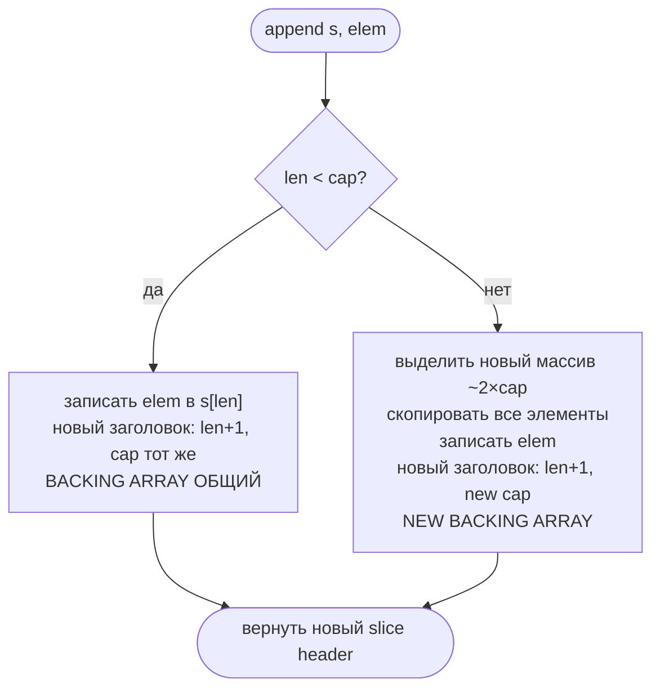

# Slices: внутреннее устройство и ловушки

Slice — одна из самых частых тем на Go-интервью. 90% вопросов связаны с одной вещью: **slice header — это значение**, а backing array — общий. Понимание этого объясняет все "странные" поведения.

## Содержание

- [Slice header: три поля](#slice-header-три-поля)
- [Shared backing array](#shared-backing-array)
- [append: когда копирует, когда нет](#append-когда-копирует-когда-нет)
- [Sub-slice: a[low:high] и a[low:high:max]](#sub-slice-alowhigh-и-alowhighmax)
- [copy: типичные ошибки](#copy-типичные-ошибки)
- [nil slice vs empty slice](#nil-slice-vs-empty-slice)
- [Передача slice в функцию](#передача-slice-в-функцию)
- [Memory retention: скрытая утечка](#memory-retention-скрытая-утечка)
- [make([]T, len) vs make([]T, 0, cap)](#maket-len-vs-maket-0-cap)
- [Индекс за len: panic (даже если cap больше)](#индекс-за-len-panic-даже-если-cap-больше)
- [Пакет slices: современные хелперы (Go 1.21+)](#пакет-slices-современные-хелперы-go-121)
- [Разбор примеров-загадок](#разбор-примеров-загадок)
- [Interview-ready answer](#interview-ready-answer)

---

## Slice header: три поля

Переменная типа `[]T` — это **не массив**. Это маленький заголовок (24 байта на 64-bit):

```
slice header (на стеке или в heap):
┌─────────────┐
│  ptr *T     │  ← указатель на backing array
│  len int    │  ← количество доступных элементов
│  cap int    │  ← максимальная длина без реаллокации
└─────────────┘
       │
       ↓
  backing array (в heap):
  [e0 | e1 | e2 | e3 | e4 | ...]
```

```go
s := []int{1, 2, 3, 4, 5}
// ptr → [1,2,3,4,5]
// len = 5
// cap = 5

fmt.Println(len(s), cap(s))  // 5 5
```

**Ключевые следствия:**
- присваивание `s2 := s` копирует только заголовок — оба указателя смотрят на **один** массив
- передача в функцию тоже копирует только заголовок
- `len` и `cap` — локальны для каждого заголовка; изменение через append в функции не видно снаружи

---

## Shared backing array

```go
s1 := []int{1, 2, 3, 4, 5}
s2 := s1        // копируем header, не данные

s2[0] = 99      // меняем через s2 — видно через s1!

fmt.Println(s1) // [99 2 3 4 5]
fmt.Println(s2) // [99 2 3 4 5]
```

Оба заголовка указывают на один массив:

```
s1: ptr─┐  len=5  cap=5
         ↓
        [99 | 2 | 3 | 4 | 5]
         ↑
s2: ptr─┘  len=5  cap=5
```

### Когда sharing ломается

Как только append вызывает реаллокацию — slice перестают делить память:

```go
s1 := []int{1, 2, 3, 4, 5}  // cap=5
s2 := s1

s2 = append(s2, 6)  // cap=5 не хватает → новый backing array
s2[0] = 99

fmt.Println(s1) // [1 2 3 4 5]  ← не изменился
fmt.Println(s2) // [99 2 3 4 5 6]
```

После append с реаллокацией s2 смотрит на новый массив. s1 остался на старом.

---

## append: когда копирует, когда нет

**Правило:** если `len < cap` — append пишет на месте, не копирует. Если `len == cap` — выделяет новый массив ~2× размера, копирует все элементы.

```go
s1 := []int{1, 2, 3, 4, 5}       // len=5, cap=5
s2 := append(s1, 6)               // cap=5, нет места → новый массив cap≈10
s2[0] = 11
fmt.Println(s1) // [1 2 3 4 5]    ← s1 не тронут
fmt.Println(s2) // [11 2 3 4 5 6]

// Теперь у s2 ещё есть место в cap:
s3 := append(s2, 7)               // len=6, cap=10 → пишет на месте
s3[0] = 12
fmt.Println(s2) // [12 2 3 4 5 6]    ← s2 тоже изменился!
fmt.Println(s3) // [12 2 3 4 5 6 7]
```



**Growth factor:** не всегда 2×. Маленькие slice растут в 2×, большие (≥1024 элементов до Go 1.18, ≥256 после) — медленнее, примерно 1.25×.

### Посмотреть рост глазами

Удобно один раз напечатать `len`/`cap` в цикле и увидеть «ступеньки» реаллокаций:

```go
var s []int
prevCap := -1
for i := 0; i < 10; i++ {
    if cap(s) != prevCap {
        fmt.Printf("len=%-2d cap=%-2d  ← реаллокация\n", len(s), cap(s))
        prevCap = cap(s)
    }
    s = append(s, i)
}
fmt.Printf("len=%-2d cap=%-2d\n", len(s), cap(s))
```

```
len=0  cap=0   ← реаллокация
len=1  cap=1   ← реаллокация
len=2  cap=2   ← реаллокация
len=4  cap=4   ← реаллокация
len=8  cap=8   ← реаллокация
len=10 cap=16
```

Видно главное: **cap после роста почти всегда больше len** — append выделяет «с запасом», чтобы следующие вставки шли без копирования. Между ступеньками append пишет на месте в общий backing array.

### Почему cap бывает «странным»: округление по size class

Классический сбивающий с толку пример:

```go
s := make([]int, 0)            // len=0, cap=0
s = append(s, 1, 2, 3, 4, 5)   // добавляем сразу 5 элементов
fmt.Println(len(s), cap(s))    // 5 6  ← откуда 6?!
```

`len=5` ожидаемо, а `cap=6` — нет. Шестёрка берётся **не из логики append, а из аллокатора памяти**. Разберём по шагам, что делает `runtime.growslice`:

**Шаг 1 — нужен новый массив.** Нужна длина 5, cap=0 не хватает → `growslice`.

**Шаг 2 — прикидка ёмкости в штуках** (`nextslicecap`). При добавлении сразу нескольких элементов работает ветка «нужно больше, чем 2×старого cap»:

```
oldCap = 0,  doublecap = 0
нужно (5) > doublecap (0)  →  newcap = 5
```

На этом шаге ёмкость = **5**. Если бы всё закончилось здесь, был бы `cap=5`.

**Шаг 3 — перевод в байты и округление до size class.** growslice считает, сколько это байт, и спрашивает у аллокатора реальный размер блока (`roundupsize`):

```
5 × 8 байт (int на 64-bit) = 40 байт
```

Аллокатор не выдаёт произвольные 40 байт — только фиксированные **size classes** (`… 24, 32, 48, 64 …`, см. [memory-internals/02-allocator](./memory-internals/02-allocator.md#size-classes)). Числа 40 среди них нет → округление вверх до **48 байт**.

**Шаг 4 — пересчёт байт обратно в элементы.** Раз уж выделили 48 байт, терять хвост незачем — growslice отдаёт его как capacity:

```
48 байт / 8 байт на int = 6  →  cap = 6
```

```
запрошено:  [1][2][3][4][5]            = 40 байт
size class: ──────── 48 байт ────────  (40 округлили вверх)
backing:    [1][2][3][4][5][·]          ← 6-й слот «бесплатный»
            └──── len=5 ────┘
            └──────── cap=6 ───────┘
```

Лишний слот — это та самая **внутренняя фрагментация** size class, только Go не выбрасывает её, а конвертирует в полезный cap.

Закономерность (cap = `округлить(N×8 байт)` до size class, потом `/8`):

| append N int | нужно байт | size class | cap |
|---:|---:|---:|---:|
| 3 | 24 | 24 | 3 (точно) |
| 4 | 32 | 32 | 4 (точно) |
| **5** | **40** | **48** | **6** |
| 6 | 48 | 48 | 6 |
| 7 | 56 | 64 | 8 |
| 9 | 72 | 80 | 10 |

> Вывод: **на конкретное значение cap полагаться нельзя** — это деталь реализации аллокатора, зависящая от размера элемента, платформы и версии Go. Нужна точная ёмкость — задавай явно: `make([]int, 0, 5)`.

### Почему нужно `s = append(s, elem)`, а не просто `append(s, elem)`

```go
s := []int{1, 2, 3}
append(s, 4)    // результат потерян! компилятор выдаст warning
s = append(s, 4) // правильно
```

append возвращает **новый** header. Если cap не хватало — исходный заголовок указывает на старый массив без нового элемента.

---

## Sub-slice: a[low:high] и a[low:high:max]

### Двухиндексный срез a[low:high]

```go
a := []int{0, 1, 2, 3, 4, 5, 6, 7, 8, 9}  // len=10, cap=10

b := a[3:6]
// b: ptr → &a[3], len=3, cap=7  (cap = len(a) - low = 10 - 3)
// b видит элементы [3, 4, 5], но его cap уходит до конца a
```

```
a:  [0 | 1 | 2 | 3 | 4 | 5 | 6 | 7 | 8 | 9]
                 ↑           ↑               ↑
              b.ptr       b[len]          b[cap]
     b: len=3, cap=7
```

**Ловушка:** append в b может перезаписать элементы a:

```go
b = append(b, 100)
fmt.Println(b) // [3 4 5 100]
fmt.Println(a) // [0 1 2 3 4 5 100 7 8 9]  ← a[6] изменился!
```

Это происходит потому что cap у b = 7 — места хватает, и append пишет на позицию a[6].

### Трёхиндексный срез a[low:high:max] — защита от перезаписи

```go
b := a[3:6:6]
// cap = max - low = 6 - 3 = 3  (ограничено!)
// теперь append вызовет реаллокацию и не затронет a

b = append(b, 100)  // cap=3, len=3 → новый backing array
fmt.Println(a)      // [0 1 2 3 4 5 6 7 8 9]  ← a не изменился
```

```go
// Паттерн: передать sub-slice в функцию без риска перезаписи родителя
safe := data[i:j:j]  // cap ограничен j-i
processItems(safe)
```

### cap sub-slice

```
s[low:high]   → len = high-low,  cap = cap(s)-low
s[low:high:max] → len = high-low,  cap = max-low   (max ≤ cap(s))
```

### Границы среза и ошибки

Допустимые индексы (для **слайса**):

```
s[low:high]      требует  0 ≤ low ≤ high ≤ cap(s)
s[low:high:max]  требует  0 ≤ low ≤ high ≤ max ≤ cap(s)
```

Два неинтуитивных момента:

- **верхняя граница — это `cap`, а не `len`.** Срезать можно за пределы длины, до ёмкости — так «достают» скрытые за `len` слоты:

  ```go
  s := make([]int, 5, 10)  // len=5, cap=10
  _ = s[0:8]               // OK! high=8 ≤ cap=10 (хотя 8 > len=5)
  ```
  (для **строк** и **массивов** верхняя граница — `len`, не cap.)

- **нельзя сделать `cap < len`.** Это и есть случай «ёмкость меньше длины»: `max` обязан быть `≥ high`, иначе результат имел бы `len > cap` — запрещено.

**Compile-time ошибки** — когда индексы **константы** и нарушают **порядок** `low ≤ high ≤ max` (компилятор проверяет это сразу):

```go
s := make([]int, 5, 10)
_ = s[3:2]      // ❌ invalid slice indices: 2 < 3   (low > high)
_ = s[0:5:3]    // ❌ invalid slice indices: 3 < 5   (max < high → cap<len)
_ = s[2:1:4]    // ❌ invalid slice indices: 1 < 2

arr := [3]int{}
_ = arr[0:5]    // ❌ invalid argument: index 5 out of bounds [0:4]  (массив, const > len)
```

**Runtime-паники** — когда индексы в **переменных** или выходят за `cap` (верхнюю границу против `cap` компилятор не проверяет: `cap` слайса не известна на этапе компиляции):

```go
s := make([]int, 5, 10)

hi := 12
_ = s[0:hi]     // panic: slice bounds out of range [:12] with capacity 10
_ = s[0:3:11]   // panic: slice bounds out of range [::11] with capacity 10  (max > cap, даже с константой)

lo, h := 3, 2
_ = s[lo:h]     // panic: slice bounds out of range [3:2]      (low > high в переменных)

m := 5
_ = s[0:m:3]    // panic: slice bounds out of range [:5:3]     (max < high в переменных)
```

> Закономерность: **нарушение порядка с константами** ловится компилятором (`invalid slice indices`); **выход за `cap`** и любые нарушения с **переменными** — рантайм-паника (`slice bounds out of range … with capacity N`). Случай `s[0:3:11]` показателен: ordering корректен (`0≤3≤11`), но `11 > cap` известно лишь в рантайме → паника, а не compile-ошибка.

---

## copy: типичные ошибки

`copy(dst, src)` копирует `min(len(dst), len(src))` элементов.

### Ошибка 1: dst с нулевым len

```go
var dst []int        // len=0, cap=0
copy(dst, src)       // скопирует 0 элементов!

// Правильно:
dst = make([]int, len(src))
copy(dst, src)
```

### Ошибка 2: думать что copy создаёт нужный размер

```go
src := []int{1, 2, 3, 4, 5}
dst := make([]int, 3)   // len=3, cap=3
n := copy(dst, src)     // скопирует только 3 элемента!
fmt.Println(n, dst)     // 3 [1 2 3]
```

### Ошибка 3: copy смотрит на len(dst), даже если cap большой

`copy` игнорирует cap — важен только `len`. Большой запас ёмкости не поможет:

```go
dst := make([]int, 1, 3)   // len=1, cap=3 — место под 3 есть
n := copy(dst, []int{2, 3})// но len(dst)=1 → скопируется 1 элемент
fmt.Println(n, dst)        // 1 [2]
```

Чтобы записать всё через свободный cap — сначала задай нужный len (через reslice или append):

```go
dst := make([]int, 1, 3)
dst = dst[:3]              // расширили len до cap
copy(dst, []int{2, 3, 4}) // теперь скопируется 3
fmt.Println(dst)          // [2 3 4]
```

### Правильный полный клон

```go
clone := make([]int, len(src))
copy(clone, src)

// Или короче (Go 1.21+):
clone := slices.Clone(src)
```

---

## nil slice vs empty slice

```go
var nilSlice []int           // nil slice:   ptr=nil, len=0, cap=0
emptySlice := []int{}        // empty slice: ptr≠nil, len=0, cap=0
emptySlice2 := make([]int, 0)// empty slice: ptr≠nil, len=0, cap=0
```

| Свойство | nil slice | empty slice |
|---|---|---|
| `== nil` | `true` | `false` |
| `len()` | 0 | 0 |
| `cap()` | 0 | 0 |
| `append` | работает | работает |
| `for range` | 0 итераций | 0 итераций |
| JSON marshal | `null` | `[]` |

**Главная практическая разница — JSON:**

```go
type Response struct {
    Items []int `json:"items"`
}

r1 := Response{Items: nil}
r2 := Response{Items: []int{}}

b1, _ := json.Marshal(r1)
b2, _ := json.Marshal(r2)

fmt.Println(string(b1)) // {"items":null}
fmt.Println(string(b2)) // {"items":[]}
```

Для API чаще нужен `[]` — используй `make([]T, 0)` или явную инициализацию.

**nil slice безопасен для чтения:**

```go
var s []string
fmt.Println(len(s))  // 0, не паника
for _, v := range s { // 0 итераций
    fmt.Println(v)
}
s = append(s, "ok")  // работает, возвращает новый slice
```

---

## Передача slice в функцию

Функция получает **копию header**: свой ptr, len, cap. Backing array — общий.

### Мутации элементов видны снаружи

```go
func zero(s []int) {
    s[0] = 0   // меняем через общий backing array
}

a := []int{1, 2, 3}
zero(a)
fmt.Println(a) // [0 2 3]  ← изменение видно
```

### append не виден снаружи

```go
func addElem(s []int) {
    s = append(s, 99)  // меняем локальную копию header
    fmt.Println(s)     // [1 2 3 99]
}

a := []int{1, 2, 3}
addElem(a)
fmt.Println(a)  // [1 2 3]  ← a не изменился
```

Даже если cap хватало (append не делал реаллокацию и элемент записался в backing array) — у вызывающего `len` остался старым, поэтому новый элемент невидим через `a`:

```go
func appendInFunc(s []int, val int) {
    s = append(s, val)   // len локального header стал len+1
    fmt.Println(s)       // [0 1024]
}

ints := make([]int, 1, 2)  // len=1, cap=2 — есть место
appendInFunc(ints, 1024)

fmt.Println(ints)          // [0]  ← len=1, не видим 1024
intsExp := ints[:2]        // но через reslice можно добраться!
fmt.Println(intsExp)       // [0 1024]  ← элемент там, просто len не знал
```

### Паттерн: передать указатель для изменения len/cap

```go
func appendPtr(s *[]int, val int) {
    *s = append(*s, val)  // меняем header через указатель
}

a := []int{1, 2, 3}
appendPtr(&a, 4)
fmt.Println(a)  // [1 2 3 4]
```

---

## Memory retention: скрытая утечка

Sub-slice держит **весь** backing array живым в памяти, даже если сам маленький:

```go
func getSubSlice() []int {
    big := make([]int, 1_000_000)  // 8 MB
    big[999996] = 6
    big[999997] = 7

    // ❌ ПЛОХО: возвращаем sub-slice — 8 MB останется в памяти
    return big[999996:]  // маленький slice, но держит весь big массив
}

// ❌ Каждый вызов getSubSlice() протечёт 8 MB
results := make([][]int, 0)
for i := 0; i < 100; i++ {
    results = append(results, getSubSlice())
}
// В памяти: 100 × 8 MB = 800 MB
```

```
big array (8 MB):
[0 | 0 | ... | 0 | 6 | 7]
                    ↑
               sub.ptr   sub.len=2, sub.cap=4
```

GC не может освободить `big` — на него ссылается sub-slice.

### Исправление: copy только нужных данных

```go
func getSubSlice() []int {
    big := make([]int, 1_000_000)
    big[999996] = 6
    big[999997] = 7

    // ✅ ХОРОШО: копируем только нужное, big можно освободить
    result := make([]int, 2)
    copy(result, big[999996:])
    return result  // теперь big не держится в памяти
}
```

После возврата `big` больше не имеет ссылок → GC освободит 8 MB.

### Другой пример: обработка строк

```go
// ❌ Подстрока держит исходную строку (строки immutable, но та же механика)
func extractCode(longLine string) string {
    return longLine[10:15]  // 5 БАЙТ держат всю строку
}

// ✅ Полная копия — исходная строка может быть GC
func extractCode(longLine string) string {
    code := longLine[10:15]
    return strings.Clone(code)  // Go 1.20+
}
```

> ⚠️ Срез строки идёт **по байтам**, не по символам: `longLine[10:15]` — это 5 байт по байтовым смещениям, а не «5 символов». На ASCII байт = символ, но на многобайтовых рунах (кириллица — 2 байта, эмодзи — 4) такой срез может **разрезать руну пополам** и дать невалидный UTF-8. Для резки по символам — `[]rune(s)` или `range`/`utf8`-границы. Детали — в [07-strings](./07-strings.md).

---

## make([]T, len) vs make([]T, 0, cap)

Частая ошибка: перепутать len и cap в make.

```go
// make([]T, len, cap)
s1 := make([]int, 3)     // len=3, cap=3: [0 0 0]
s1 = append(s1, 1)       // добавляет ПОСЛЕ нулей! [0 0 0 1]

s2 := make([]int, 0, 3)  // len=0, cap=3: []
s2 = append(s2, 1)       // добавляет с начала: [1]
```

**Правило:** если собираешь slice через append — используй `make([]T, 0, hint)`. Если нужен slice с готовыми нулями — `make([]T, n)`.

### Пред-аллокация экономит аллокации

Когда известна (хотя бы примерно) итоговая длина, `make([]T, 0, n)` убирает все промежуточные реаллокации. Бенчмарк сборки слайса из 1000 `int` (`go test -bench -benchmem`, arm64):

```
BenchmarkAppendNil-16        2238 ns/op    25208 B/op    12 allocs/op   // var s []int + append
BenchmarkAppendPrealloc-16    416 ns/op        0 B/op     0 allocs/op   // make([]int, 0, 1000)
BenchmarkGrow-16              925 ns/op     8192 B/op     1 allocs/op   // slices.Grow(nil, 1000)
```

Старт с `nil` проходит ~12 реаллокаций (0→1→2→4→…→1024) и копирует данные на каждой; пред-аллокация — **ноль** аллокаций в цикле. Если длина известна не точно, а как «не меньше N» — `slices.Grow` (ниже) добавляет ёмкость одним блоком.

---

## Индекс за len: panic (даже если cap больше)

Индексация `s[i]` проверяет **len**, а не cap. Свободная ёмкость недоступна по индексу — только через append или reslice:

```go
s := make([]int, 1, 3)   // len=1, cap=3
_ = s[0]                  // ok
_ = s[1]                  // panic: runtime error: index out of range [1] with length 1
```

Слоты `[1]` и `[2]` физически есть в backing array, но «логически» их нет, пока len=1. Дотянуться до них можно:

```go
s := make([]int, 1, 3)
s = append(s, 10)         // len стал 2 — теперь s[1] валиден
fmt.Println(s, s[:2])     // [0 10] [0 10]
```

### Пережить panic через recover

Выход за границу — это `runtime.Error`, его можно поймать через `recover` в defer и продолжить работу:

```go
func safeGet(s []int, i int) (v int, ok bool) {
    defer func() {
        if r := recover(); r != nil {
            ok = false   // вернём zero value и ok=false вместо падения
        }
    }()
    return s[i], true
}

func main() {
    s := make([]int, 1, 3) // len=1, cap=3
    fmt.Println(safeGet(s, 0)) // 0 true
    fmt.Println(safeGet(s, 1)) // 0 false  ← panic пойман, программа жива
    fmt.Println("дошли до конца")
}
```

> На практике границы проверяют явно (`if i < len(s)`), а не через recover — recover здесь для демонстрации, что index-out-of-range это именно panic, а не ошибка-значение.

---

## Пакет slices: современные хелперы (Go 1.21+)

Стандартный пакет `slices` (Go 1.21+) закрывает рутину, которую раньше писали руками, — и часть функций напрямую решает ловушки из этого файла. Дженерик-типизированы, без reflection.

```go
import "slices"

// Копия (полный клон header + данных) — fix memory retention и shared backing array
clone := slices.Clone(src)            // = make + copy, но короче

// Сравнение поэлементно (вместо reflect.DeepEqual для слайсов)
slices.Equal(a, b)                    // bool
slices.Index(s, v); slices.Contains(s, v)

// Вставка/удаление со сдвигом (сами правят len и двигают элементы)
s = slices.Insert(s, i, x, y)         // вставить перед индексом i
s = slices.Delete(s, i, j)            // удалить [i:j)
s = slices.Replace(s, i, j, vals...)

s = slices.Reverse(s)                 // на месте
s = slices.Compact(s)                 // убрать ПОДРЯД идущие дубли (после Sort = дедуп)
```

Две функции прямо относятся к внутреннему устройству — стоит знать отдельно.

### `slices.Clip` — обрезать cap до len (лечит memory retention)

`slices.Clip(s)` возвращает `s[:len(s):len(s)]` — ужимает `cap` до `len`. Это **тот самый three-index приём** из раздела про retention, но читаемо. После `Clip` следующий `append` обязан реаллоцировать → исходный большой массив больше не удерживается и не перезаписывается:

```go
big := make([]int, 1_000_000)
small := slices.Clip(big[:2])  // len=2, cap=2 (а не cap до конца big)
return small                   // держит ~16 байт, а не 8 MB; append безопасен
```

То есть `Clip` решает разом две ловушки: удержание большого backing array в памяти и случайную перезапись соседей через свободный cap.

### `slices.Grow` — пред-аллокация под будущий append

`slices.Grow(s, n)` гарантирует, что в `s` влезет ещё `n` элементов без реаллокации (увеличивает cap **одним** блоком, если нужно). Полезно, когда точную длину заранее не знаешь, но знаешь нижнюю границу:

```go
out := slices.Grow(out, len(items))   // одна аллокация вместо ~log(N) реаллокаций
for _, it := range items {
    out = append(out, transform(it))  // дальше append пишет на месте
}
```

> Дополнительно про сортировку/бинарный поиск (`slices.Sort`, `slices.BinarySearch`, `cmp`) — в [02-go-stdlib-and-tools/01-sort-and-slices](../02-go-stdlib-and-tools/01-sort-and-slices.md).

---

## Разбор примеров-загадок

### Загадка 1: append и общий массив

```go
s1 := []int{1, 2, 3, 4, 5}
s2 := append(s1, 6)  // реаллокация: новый массив
s2[0] = 11
fmt.Println(s1)  // ?
fmt.Println(s2)  // ?
```

<details>
<summary>Ответ</summary>

```
s1: [1 2 3 4 5]
s2: [11 2 3 4 5 6]
```

При `append(s1, 6)` cap=5 не хватает → новый backing array. s1 и s2 независимы. Изменение s2[0] не затрагивает s1.
</details>

---

### Загадка 2: append без реаллокации — скрытое sharing

```go
s1 := []int{1, 2, 3, 4, 5}
s2 := append(s1, 6)   // новый массив, cap≈10
s3 := append(s2, 7)   // cap хватает: s2 и s3 делят массив
s3[0] = 99

fmt.Println(s2)  // ?
fmt.Println(s3)  // ?
```

<details>
<summary>Ответ</summary>

```
s2: [99 2 3 4 5 6]
s3: [99 2 3 4 5 6 7]
```

`append(s2, 7)` не выделяет новый массив (cap достаточен), поэтому s2 и s3 смотрят на один backing array. Изменение s3[0] видно через s2.
</details>

---

### Загадка 3: sub-slice и append перезаписывает родителя

```go
a := []int{0, 1, 2, 3, 4, 5, 6, 7, 8, 9}
b := a[3:6]  // [3 4 5], len=3, cap=7

b = append(b, 100)
fmt.Println(a)  // ?
fmt.Println(b)  // ?
```

<details>
<summary>Ответ</summary>

```
a: [0 1 2 3 4 5 100 7 8 9]
b: [3 4 5 100]
```

b.cap=7, места хватает. append пишет на позицию a[6]. Это сюрприз: кажется, что изменяем только b, а меняем a.
</details>

---

### Загадка 4: copy без нужного len

```go
src := []int{1, 2, 3, 4, 5}
var dst []int
copy(dst, src)
fmt.Println(dst)  // ?
```

<details>
<summary>Ответ</summary>

```
[]
```

copy копирует `min(len(dst), len(src))` = min(0, 5) = 0 элементов. dst всё ещё nil.
</details>

---

### Загадка 5: append в функцию (частичная невидимость)

```go
func appendInFunc(s []int, val int) {
    s = append(s, val)
}

ints := make([]int, 1, 2)  // len=1, cap=2
appendInFunc(ints, 42)

fmt.Println(ints)      // ?
fmt.Println(ints[:2])  // ?
```

<details>
<summary>Ответ</summary>

```
[0]
[0 42]
```

Функция получает копию header. cap=2 хватило — 42 записался в backing array на позицию [1]. Но у вызывающего len остался равным 1. Через reslice `ints[:2]` можно увидеть "скрытый" элемент.

Это иллюстрирует принцип: backing array общий, len — локальный.
</details>

---

### Загадка 6: nil vs empty в JSON

```go
type Resp struct {
    IDs []int `json:"ids"`
}

r1 := Resp{}
r2 := Resp{IDs: []int{}}

b1, _ := json.Marshal(r1)
b2, _ := json.Marshal(r2)

fmt.Println(string(b1))  // ?
fmt.Println(string(b2))  // ?
```

<details>
<summary>Ответ</summary>

```
{"ids":null}
{"ids":[]}
```

nil slice сериализуется как JSON null. Для API, где клиент ждёт массив, нужна явная инициализация.
</details>

---

### Загадка 7: изменение через передачу

```go
a := []string{"a", "b", "c"}
b := a[1:2]  // ["b"], len=1, cap=2
b[0] = "q"
fmt.Println(a)  // ?
```

<details>
<summary>Ответ</summary>

```
[a q c]
```

b[0] и a[1] — это одна ячейка памяти. Запись через b меняет a.
</details>

---

### Загадка 8: append одного vs двух элементов в функции

```go
func addNum(nums []int)  { nums = append(nums, 4) }     // +1 элемент
func addNums(nums []int) { nums = append(nums, 5, 6) }  // +2 элемента

func main() {
    nums := []int{1, 2, 3}  // len=3, cap=3
    addNum(nums[0:2])       // передаём len=2, cap=3
    fmt.Println(nums)        // ?
    addNums(nums[0:2])      // снова len=2, cap=3
    fmt.Println(nums)        // ?
}
```

<details>
<summary>Ответ</summary>

```
[1 2 4]
[1 2 4]
```

`nums[0:2]` — это len=2, **cap=3** (cap считается до конца исходного массива).

- **`addNum` (+1):** новый len=3 ≤ cap=3 — место есть, append пишет **на месте** в `nums[2]`, затирая тройку четвёркой. Хотя локальный header функции снаружи не виден, **backing array общий** → `nums` стал `[1 2 4]`. Это и есть сюрприз.
- **`addNums` (+2):** новый len=4 > cap=3 — места нет, append выделяет **новый** массив. Изменения уходят в копию, `nums` остаётся `[1 2 4]`.

Один и тот же приём (append в функцию через sub-slice) то меняет родителя, то нет — всё решает, помещается ли результат в cap. Защита — three-index slice: `nums[0:2:2]` принудительно даст cap=2, и `addNum` тоже уйдёт в реаллокацию.
</details>

---

### Загадка 9: «соседи» — append в один slice ломает другой

```go
a := []int{1, 2, 3, 4}
b := a[:2]   // [1 2]
c := a[2:]   // [3 4]
b = append(b, 5)
fmt.Println(a)  // ?
fmt.Println(b)  // ?
fmt.Println(c)  // ?
```

<details>
<summary>Ответ</summary>

```
a: [1 2 5 4]
b: [1 2 5]
c: [5 4]
```

`b := a[:2]` имеет len=2, но **cap=4** (до конца `a`). `c := a[2:]` смотрит на `a[2]` и `a[3]`.

append к `b` видит свободный cap → пишет 5 в `a[2]`. А `a[2]` — это `c[0]`! Поэтому `c` стал `[5 4]`, хотя его никто не трогал.

Это коварнее перезаписи родителя (Загадка 3): здесь append в один sub-slice затирает данные **другого, соседнего** sub-slice. Классический баг при делении буфера на «голову» и «хвост». Защита — three-index: `b := a[:2:2]` ограничит cap=2 и заставит append реаллоцировать.
</details>

---

### Загадка 10: два slice от общего массива оба делают append

```go
var x []int
x = append(x, 1)
x = append(x, 2)
x = append(x, 3)  // len=3, cap=4
y := x            // делят backing array
x = append(x, 4)
y = append(y, 5)
x[0] = 0
fmt.Println(x)  // ?
fmt.Println(y)  // ?
```

<details>
<summary>Ответ</summary>

```
x: [0 2 3 5]
y: [0 2 3 5]
```

После трёх append у `x` len=3, **cap=4** (свободный слот есть). `y := x` делит тот же массив.

- `x = append(x, 4)` — cap хватает, пишет 4 в слот `[3]`: массив `[1 2 3 4]`.
- `y = append(y, 5)` — у `y` тоже len=3, cap=4, пишет 5 в **тот же** слот `[3]`: массив `[1 2 3 5]`. Четвёрка потеряна.

Оба «независимых» append'а целятся в один слот, потому что у обоих одинаковые len и cap. Затем `x[0] = 0` виден через оба заголовка. Результат идентичен и пятёрка «победила».
</details>

---

### Загадка 11: одинаковый код — разный результат

```go
a := []int{0}
a = append(a, 0)   // [0 0]
b := a[:]
a = append(a, 2)
b = append(b, 1)
fmt.Println(a[2])  // ?

c := []int{0, 0}
c = append(c, 0)   // [0 0 0]
d := c[:]
c = append(c, 2)
d = append(d, 1)
fmt.Println(c[3])  // ?
```

<details>
<summary>Ответ</summary>

```
2
1
```

Код двух блоков визуально одинаков, а результат разный — всё решает, **реаллоцировал ли первый append или нет**:

- **Блок 1:** после `[0 0]` len=2, cap=2 (заполнен). `a = append(a, 2)` → места нет → `a` уходит в **новый** массив. `b` остался на старом (тоже cap=2, заполнен), поэтому `b = append(b, 1)` **тоже** реаллоцирует в свой массив. Slice независимы, `a[2]` == `2`.
- **Блок 2:** после `[0 0 0]` len=3, но cap=4 (рост 2→4 на предыдущем append). `c = append(c, 2)` пишет **на месте** в общий массив; `d = append(d, 1)` тут же затирает тот же слот. `c[3]` == `1`.

> Мораль: нельзя смотреть на код с append и угадывать результат «в уме» — поведение зависит от текущего cap, который определяется историей роста и size class аллокатора. Если нужна предсказуемость — изолируй через `copy` или three-index slice.
</details>

---

## Interview-ready answer

**1. Что такое slice физически?**

- Заголовок из трёх машинных слов (24 байта на 64-bit): `ptr` на backing array, `len`, `cap`. Сам массив — в heap и может быть **общим** для нескольких slice. Присваивание/передача копируют только заголовок, не данные.

**2. Когда append копирует, а когда пишет на месте?**

- Если `len < cap` — пишет в существующий массив (на месте), `cap` тот же. Если `len == cap` — выделяет новый массив (~2×, для больших ~1.25×), копирует элементы. Поэтому два slice от общего массива то делят элементы (нет реаллокации), то расходятся (была реаллокация) — отсюда «непредсказуемость» append. На конкретный `cap` полагаться нельзя (округление по size class аллокатора).

**3. Почему append незаметно связывает или ломает соседние slice?**

- sub-slice `a[i:j]` наследует `cap` до конца исходного массива. Если в нём есть свободный cap, `append` пишет **поверх** элементов родителя или соседнего sub-slice. Изоляция — three-index `a[i:j:j]` (или `slices.Clip`), либо явный `copy`/`slices.Clone`.

**4. Почему `copy` ничего не скопировал?**

- `copy` берёт `min(len(dst), len(src))` и смотрит на **len**, не cap. `var dst []int; copy(dst, src)` → 0 элементов. Нужно `dst = make([]int, len(src))` (или `slices.Clone(src)`).

**5. Почему append внутри функции не виден снаружи?**

- Функция получает копию заголовка. Новый элемент может лечь в общий backing array (если cap хватило), но `len` у вызывающего не обновится — элемент «есть, но невидим». Чтобы менять `len`/`cap` снаружи — передавать `*[]T` или возвращать новый slice.

**6. Что такое memory retention у слайсов?**

- sub-slice удерживает **весь** backing array живым. `big[999996:]` — 2 элемента, но GC не освободит 8 MB. Fix: `slices.Clone` / `copy` в новый slice / `slices.Clip`.

**7. nil slice vs empty slice?**

- `var s []int` — nil (`ptr=nil`), `== nil` true, JSON → `null`. `[]int{}`/`make([]int,0)` — не nil, JSON → `[]`. Оба безопасны для `len`/`range`/`append`. Для API-ответов различие важно.

**8. `make([]T, n)` vs `make([]T, 0, n)`?**

- Первый — n готовых нулей, `append` добавит **после** них. Второй — пустой с запасом cap, `append` пишет с начала. Под сбор через append — всегда второй; пред-аллокация (или `slices.Grow`) убирает промежуточные реаллокации (в бенчмарке — 0 allocs против ~12).
