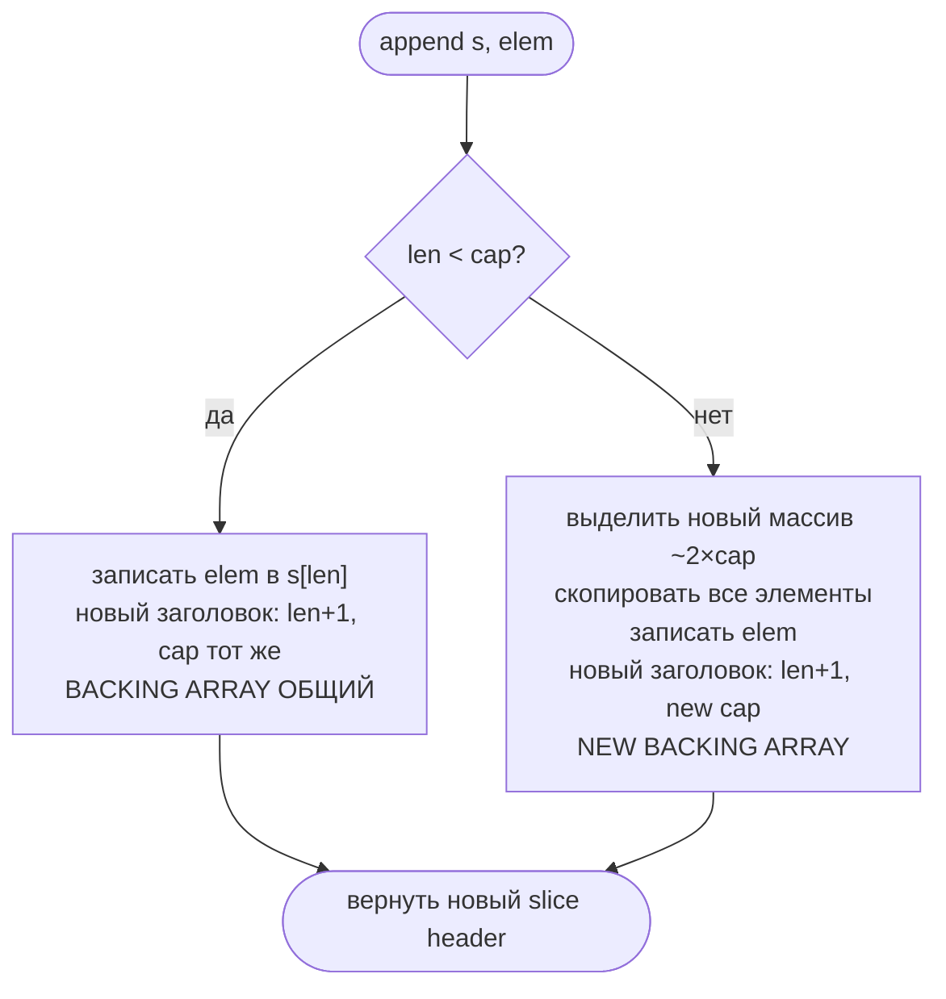

# Slices: внутреннее устройство и ловушки

Slice — одна из самых частых тем на Go-интервью. 90% вопросов связаны с одной вещью: **slice header — это значение**, а backing array — общий. Понимание этого объясняет все "странные" поведения.

## Содержание

- [Slice header: три поля](#slice-header-три-поля)
- [Shared backing array](#shared-backing-array)
- [append: когда копирует, когда нет](#append-когда-копирует-когда-нет)
- [Sub-slice: a[low:high] и a[low:high:max]](#sub-slice-alowhigh-и-alowhighmax)
- [copy: типичные ошибки](#copy-типичные-ошибки)
- [nil slice vs empty slice](#nil-slice-vs-empty-slice)
- [Передача slice в функцию](#передача-slice-в-функцию)
- [Memory retention: скрытая утечка](#memory-retention-скрытая-утечка)
- [make([]T, len) vs make([]T, 0, cap)](#maketlen-vs-maket-0-cap)
- [Разбор примеров-загадок](#разбор-примеров-загадок)
- [Interview-ready answer](#interview-ready-answer)

---

## Slice header: три поля

Переменная типа `[]T` — это **не массив**. Это маленький заголовок (24 байта на 64-bit):

```
slice header (на стеке или в heap):
┌─────────────┐
│  ptr *T     │  ← указатель на backing array
│  len int    │  ← количество доступных элементов
│  cap int    │  ← максимальная длина без реаллокации
└─────────────┘
       │
       ↓
  backing array (в heap):
  [e0 | e1 | e2 | e3 | e4 | ...]
```

```go
s := []int{1, 2, 3, 4, 5}
// ptr → [1,2,3,4,5]
// len = 5
// cap = 5

fmt.Println(len(s), cap(s))  // 5 5
```

**Ключевые следствия:**
- присваивание `s2 := s` копирует только заголовок — оба указателя смотрят на **один** массив
- передача в функцию тоже копирует только заголовок
- `len` и `cap` — локальны для каждого заголовка; изменение через append в функции не видно снаружи

---

## Shared backing array

```go
s1 := []int{1, 2, 3, 4, 5}
s2 := s1        // копируем header, не данные

s2[0] = 99      // меняем через s2 — видно через s1!

fmt.Println(s1) // [99 2 3 4 5]
fmt.Println(s2) // [99 2 3 4 5]
```

Оба заголовка указывают на один массив:

```
s1: ptr─┐  len=5  cap=5
         ↓
        [99 | 2 | 3 | 4 | 5]
         ↑
s2: ptr─┘  len=5  cap=5
```

### Когда sharing ломается

Как только append вызывает реаллокацию — slice перестают делить память:

```go
s1 := []int{1, 2, 3, 4, 5}  // cap=5
s2 := s1

s2 = append(s2, 6)  // cap=5 не хватает → новый backing array
s2[0] = 99

fmt.Println(s1) // [1 2 3 4 5]  ← не изменился
fmt.Println(s2) // [99 2 3 4 5 6]
```

После append с реаллокацией s2 смотрит на новый массив. s1 остался на старом.

---

## append: когда копирует, когда нет

**Правило:** если `len < cap` — append пишет на месте, не копирует. Если `len == cap` — выделяет новый массив ~2× размера, копирует все элементы.

```go
s1 := []int{1, 2, 3, 4, 5}       // len=5, cap=5
s2 := append(s1, 6)               // cap=5, нет места → новый массив cap≈10
s2[0] = 11
fmt.Println(s1) // [1 2 3 4 5]    ← s1 не тронут
fmt.Println(s2) // [11 2 3 4 5 6]

// Теперь у s2 ещё есть место в cap:
s3 := append(s2, 7)               // len=6, cap=10 → пишет на месте
s3[0] = 12
fmt.Println(s2) // [12 2 3 4 5 6]    ← s2 тоже изменился!
fmt.Println(s3) // [12 2 3 4 5 6 7]
```



**Growth factor:** не всегда 2×. Маленькие slice растут в 2×, большие (≥1024 элементов до Go 1.18, ≥256 после) — медленнее, примерно 1.25×.

### Почему нужно `s = append(s, elem)`, а не просто `append(s, elem)`

```go
s := []int{1, 2, 3}
append(s, 4)    // результат потерян! компилятор выдаст warning
s = append(s, 4) // правильно
```

append возвращает **новый** header. Если cap не хватало — исходный заголовок указывает на старый массив без нового элемента.

---

## Sub-slice: a[low:high] и a[low:high:max]

### Двухиндексный срез a[low:high]

```go
a := []int{0, 1, 2, 3, 4, 5, 6, 7, 8, 9}  // len=10, cap=10

b := a[3:6]
// b: ptr → &a[3], len=3, cap=7  (cap = len(a) - low = 10 - 3)
// b видит элементы [3, 4, 5], но его cap уходит до конца a
```

```
a:  [0 | 1 | 2 | 3 | 4 | 5 | 6 | 7 | 8 | 9]
                 ↑           ↑               ↑
              b.ptr       b[len]          b[cap]
     b: len=3, cap=7
```

**Ловушка:** append в b может перезаписать элементы a:

```go
b = append(b, 100)
fmt.Println(b) // [3 4 5 100]
fmt.Println(a) // [0 1 2 3 4 5 100 7 8 9]  ← a[6] изменился!
```

Это происходит потому что cap у b = 7 — места хватает, и append пишет на позицию a[6].

### Трёхиндексный срез a[low:high:max] — защита от перезаписи

```go
b := a[3:6:6]
// cap = max - low = 6 - 3 = 3  (ограничено!)
// теперь append вызовет реаллокацию и не затронет a

b = append(b, 100)  // cap=3, len=3 → новый backing array
fmt.Println(a)      // [0 1 2 3 4 5 6 7 8 9]  ← a не изменился
```

```go
// Паттерн: передать sub-slice в функцию без риска перезаписи родителя
safe := data[i:j:j]  // cap ограничен j-i
processItems(safe)
```

### cap sub-slice

```
s[low:high]   → len = high-low,  cap = cap(s)-low
s[low:high:max] → len = high-low,  cap = max-low   (max ≤ cap(s))
```

---

## copy: типичные ошибки

`copy(dst, src)` копирует `min(len(dst), len(src))` элементов.

### Ошибка 1: dst с нулевым len

```go
var dst []int        // len=0, cap=0
copy(dst, src)       // скопирует 0 элементов!

// Правильно:
dst = make([]int, len(src))
copy(dst, src)
```

```go
// Из кода Tupanul():
var sCopy []int
copy(sCopy, s2)  // ничего не скопировалось: len(sCopy) == 0
fmt.Println(sCopy) // []

sCopy2 := make([]int, len(s2))  // выделить нужный len
copy(sCopy2, s2)                // теперь скопируется всё
```

### Ошибка 2: думать что copy создаёт нужный размер

```go
src := []int{1, 2, 3, 4, 5}
dst := make([]int, 3)   // len=3, cap=3
n := copy(dst, src)     // скопирует только 3 элемента!
fmt.Println(n, dst)     // 3 [1 2 3]
```

### Правильный полный клон

```go
clone := make([]int, len(src))
copy(clone, src)

// Или короче (Go 1.21+):
clone := slices.Clone(src)
```

---

## nil slice vs empty slice

```go
var nilSlice []int           // nil slice:   ptr=nil, len=0, cap=0
emptySlice := []int{}        // empty slice: ptr≠nil, len=0, cap=0
emptySlice2 := make([]int, 0)// empty slice: ptr≠nil, len=0, cap=0
```

| Свойство | nil slice | empty slice |
|---|---|---|
| `== nil` | `true` | `false` |
| `len()` | 0 | 0 |
| `cap()` | 0 | 0 |
| `append` | работает | работает |
| `for range` | 0 итераций | 0 итераций |
| JSON marshal | `null` | `[]` |

**Главная практическая разница — JSON:**

```go
type Response struct {
    Items []int `json:"items"`
}

r1 := Response{Items: nil}
r2 := Response{Items: []int{}}

b1, _ := json.Marshal(r1)
b2, _ := json.Marshal(r2)

fmt.Println(string(b1)) // {"items":null}
fmt.Println(string(b2)) // {"items":[]}
```

Для API чаще нужен `[]` — используй `make([]T, 0)` или явную инициализацию.

**nil slice безопасен для чтения:**

```go
var s []string
fmt.Println(len(s))  // 0, не паника
for _, v := range s { // 0 итераций
    fmt.Println(v)
}
s = append(s, "ok")  // работает, возвращает новый slice
```

---

## Передача slice в функцию

Функция получает **копию header**: свой ptr, len, cap. Backing array — общий.

### Мутации элементов видны снаружи

```go
func zero(s []int) {
    s[0] = 0   // меняем через общий backing array
}

a := []int{1, 2, 3}
zero(a)
fmt.Println(a) // [0 2 3]  ← изменение видно
```

### append не виден снаружи

```go
func addElem(s []int) {
    s = append(s, 99)  // меняем локальную копию header
    fmt.Println(s)     // [1 2 3 99]
}

a := []int{1, 2, 3}
addElem(a)
fmt.Println(a)  // [1 2 3]  ← a не изменился
```

Даже если cap хватало (append не делал реаллокацию и элемент записался в backing array) — у вызывающего `len` остался старым, поэтому новый элемент невидим через `a`:

```go
func appendInFunc(s []int, val int) {
    s = append(s, val)   // len локального header стал len+1
    fmt.Println(s)       // [0 1024]
}

ints := make([]int, 1, 2)  // len=1, cap=2 — есть место
appendInFunc(ints, 1024)

fmt.Println(ints)          // [0]  ← len=1, не видим 1024
intsExp := ints[:2]        // но через reslice можно добраться!
fmt.Println(intsExp)       // [0 1024]  ← элемент там, просто len не знал
```

### Паттерн: передать указатель для изменения len/cap

```go
func appendPtr(s *[]int, val int) {
    *s = append(*s, val)  // меняем header через указатель
}

a := []int{1, 2, 3}
appendPtr(&a, 4)
fmt.Println(a)  // [1 2 3 4]
```

---

## Memory retention: скрытая утечка

Sub-slice держит **весь** backing array живым в памяти, даже если сам маленький:

```go
func getSubSlice() []int {
    big := make([]int, 1_000_000)  // 8 MB
    big[999996] = 6
    big[999997] = 7

    // ❌ ПЛОХО: возвращаем sub-slice — 8 MB останется в памяти
    return big[999996:]  // маленький slice, но держит весь big массив
}

// ❌ Каждый вызов getSubSlice() протечёт 8 MB
results := make([][]int, 0)
for i := 0; i < 100; i++ {
    results = append(results, getSubSlice())
}
// В памяти: 100 × 8 MB = 800 MB
```

```
big array (8 MB):
[0 | 0 | ... | 0 | 6 | 7]
                    ↑
               sub.ptr   sub.len=2, sub.cap=4
```

GC не может освободить `big` — на него ссылается sub-slice.

### Исправление: copy только нужных данных

```go
func getSubSlice() []int {
    big := make([]int, 1_000_000)
    big[999996] = 6
    big[999997] = 7

    // ✅ ХОРОШО: копируем только нужное, big можно освободить
    result := make([]int, 2)
    copy(result, big[999996:])
    return result  // теперь big не держится в памяти
}
```

После возврата `big` больше не имеет ссылок → GC освободит 8 MB.

### Другой пример: обработка строк

```go
// ❌ Подстрока держит исходную строку (строки immutable, но та же механика)
func extractCode(longLine string) string {
    return longLine[10:15]  // 5 символов держат всю строку
}

// ✅ Полная копия — исходная строка может быть GC
func extractCode(longLine string) string {
    code := longLine[10:15]
    return strings.Clone(code)  // Go 1.20+
}
```

---

## make([]T, len) vs make([]T, 0, cap)

Частая ошибка: перепутать len и cap в make.

```go
// make([]T, len, cap)
s1 := make([]int, 3)     // len=3, cap=3: [0 0 0]
s1 = append(s1, 1)       // добавляет ПОСЛЕ нулей! [0 0 0 1]

s2 := make([]int, 0, 3)  // len=0, cap=3: []
s2 = append(s2, 1)       // добавляет с начала: [1]
```

```go
// Из subSLice():
sl2 := make([]int, 3)
sl2 = append(sl2, 123)
fmt.Println(sl2) // [0 0 0 123]  ← 123 идёт после трёх нулей!

sl21 := make([]int, 0, 3)
sl21 = append(sl21, 123)
fmt.Println(sl21) // [123]  ← правильно
```

**Правило:** если собираешь slice через append — используй `make([]T, 0, hint)`. Если нужен slice с готовыми нулями — `make([]T, n)`.

---

## Разбор примеров-загадок

### Загадка 1: append и общий массив

```go
s1 := []int{1, 2, 3, 4, 5}
s2 := append(s1, 6)  // реаллокация: новый массив
s2[0] = 11
fmt.Println(s1)  // ?
fmt.Println(s2)  // ?
```

<details>
<summary>Ответ</summary>

```
s1: [1 2 3 4 5]
s2: [11 2 3 4 5 6]
```

При `append(s1, 6)` cap=5 не хватает → новый backing array. s1 и s2 независимы. Изменение s2[0] не затрагивает s1.
</details>

---

### Загадка 2: append без реаллокации — скрытое sharing

```go
s1 := []int{1, 2, 3, 4, 5}
s2 := append(s1, 6)   // новый массив, cap≈10
s3 := append(s2, 7)   // cap хватает: s2 и s3 делят массив
s3[0] = 99

fmt.Println(s2)  // ?
fmt.Println(s3)  // ?
```

<details>
<summary>Ответ</summary>

```
s2: [99 2 3 4 5 6]
s3: [99 2 3 4 5 6 7]
```

`append(s2, 7)` не выделяет новый массив (cap достаточен), поэтому s2 и s3 смотрят на один backing array. Изменение s3[0] видно через s2.
</details>

---

### Загадка 3: sub-slice и append перезаписывает родителя

```go
a := []int{0, 1, 2, 3, 4, 5, 6, 7, 8, 9}
b := a[3:6]  // [3 4 5], len=3, cap=7

b = append(b, 100)
fmt.Println(a)  // ?
fmt.Println(b)  // ?
```

<details>
<summary>Ответ</summary>

```
a: [0 1 2 3 4 5 100 7 8 9]
b: [3 4 5 100]
```

b.cap=7, места хватает. append пишет на позицию a[6]. Это сюрприз: кажется, что изменяем только b, а меняем a.
</details>

---

### Загадка 4: copy без нужного len

```go
src := []int{1, 2, 3, 4, 5}
var dst []int
copy(dst, src)
fmt.Println(dst)  // ?
```

<details>
<summary>Ответ</summary>

```
[]
```

copy копирует `min(len(dst), len(src))` = min(0, 5) = 0 элементов. dst всё ещё nil.
</details>

---

### Загадка 5: append в функцию (частичная невидимость)

```go
func appendInFunc(s []int, val int) {
    s = append(s, val)
}

ints := make([]int, 1, 2)  // len=1, cap=2
appendInFunc(ints, 42)

fmt.Println(ints)      // ?
fmt.Println(ints[:2])  // ?
```

<details>
<summary>Ответ</summary>

```
[0]
[0 42]
```

Функция получает копию header. cap=2 хватило — 42 записался в backing array на позицию [1]. Но у вызывающего len остался равным 1. Через reslice `ints[:2]` можно увидеть "скрытый" элемент.

Это иллюстрирует принцип: backing array общий, len — локальный.
</details>

---

### Загадка 6: nil vs empty в JSON

```go
type Resp struct {
    IDs []int `json:"ids"`
}

r1 := Resp{}
r2 := Resp{IDs: []int{}}

b1, _ := json.Marshal(r1)
b2, _ := json.Marshal(r2)

fmt.Println(string(b1))  // ?
fmt.Println(string(b2))  // ?
```

<details>
<summary>Ответ</summary>

```
{"ids":null}
{"ids":[]}
```

nil slice сериализуется как JSON null. Для API, где клиент ждёт массив, нужна явная инициализация.
</details>

---

### Загадка 7: изменение через передачу

```go
a := []string{"a", "b", "c"}
b := a[1:2]  // ["b"], len=1, cap=2
b[0] = "q"
fmt.Println(a)  // ?
```

<details>
<summary>Ответ</summary>

```
[a q c]
```

b[0] и a[1] — это одна ячейка памяти. Запись через b меняет a.
</details>

---

## Interview-ready answer

**"Что такое slice в Go и какие есть ловушки?"**

Slice — это заголовок из трёх полей: указатель на backing array, len и cap. Сам массив находится в heap и может быть **общим** для нескольких slice.

**Главные ловушки:**

1. **Shared backing array:** `s2 := s1` копирует только заголовок. `s2[0] = x` меняет `s1[0]` тоже.

2. **append незаметно связывает slice:** если `cap > len`, append пишет на месте — два slice начинают делить элемент. Безопасно только если после append есть реаллокация. Для изоляции — three-index slice `a[i:j:j]` или явный `copy`.

3. **copy смотрит на len(dst), не cap:** `var dst []int; copy(dst, src)` скопирует 0 элементов. Нужен `dst = make([]int, len(src))`.

4. **append в функции не виден снаружи:** функция получает копию заголовка. Новый элемент может записаться в backing array (если cap хватило), но len у вызывающего не обновится. Для изменения len — передавать `*[]T`.

5. **Memory retention:** sub-slice держит весь backing array. `big[999996:]` — 2 элемента, но 8 MB в памяти. Fix: `copy` в новый slice.

6. **nil vs empty slice:** `var s []int` — nil, сериализуется в JSON как `null`. `make([]int, 0)` — не nil, сериализуется как `[]`. При написании API важно различать.

7. **make([]T, n) vs make([]T, 0, n):** первый создаёт n нулей + append добавляет после них. Второй — пустой с capacity n + append с нуля.
