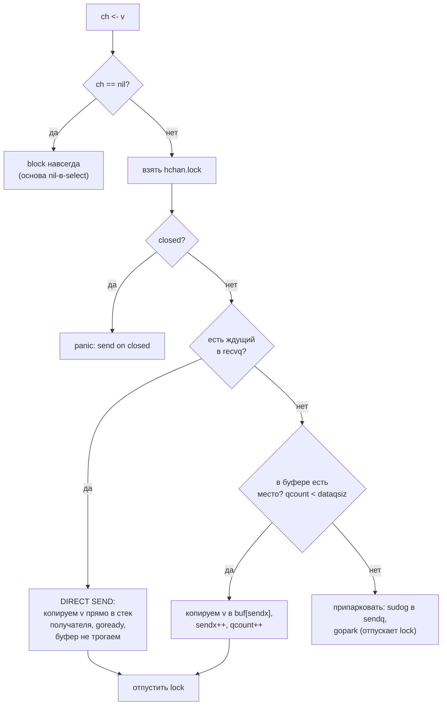

# Goroutines and Channels

Конкурентность в Go строится на двух примитивах: горутины (дешёвые потоки, управляемые рантаймом) и каналы (безопасная передача данных между горутинами). Плюс `select` для мультиплексирования.

## Содержание

- [Goroutine lifecycle](#goroutine-lifecycle)
- [Unbuffered vs buffered channel](#unbuffered-vs-buffered-channel)
- [Внутреннее устройство канала (hchan)](#внутреннее-устройство-канала-hchan)
- [Pipeline паттерн](#pipeline-паттерн)
- [Fan-out / Fan-in](#fan-out--fan-in)
- [Done-channel для отмены](#done-channel-для-отмены)
- [Goroutine leak](#goroutine-leak)
- [`context` для отмены](#context-для-отмены)
- [`select` — мультиплексирование каналов](#select--мультиплексирование-каналов)
- [nil-канал как выключатель ветки select](#nil-канал-как-выключатель-ветки-select)
- [Закрытие канала](#закрытие-канала)
- [Разбор примеров-загадок](#разбор-примеров-загадок)
- [Interview-ready answer](#interview-ready-answer)

---

## Goroutine lifecycle

### Запуск и стек

```go
go func() {
    // тело горутины
}()
```

- Стек горутины начинается с **~2 KB**
- Стек **растёт динамически** (до 1 GB по умолчанию). При нехватке места `runtime.morestack` выделяет **новый цельный стек в 2× больше и копирует старый целиком** (`copystack`), правя указатели на стек (contiguous stack)
- OS thread — 1–8 MB фиксированного стека; горутина — 2 KB, поэтому легко создать 100k горутин

> Внутреннее устройство — структура `g`, рост стека через `copystack` и состояния (`Grunnable`/`Grunning`/`Gwaiting`/`Gsyscall`/`Gdead`) с переходами — подробно в [01-scheduler-and-preemption](../runtime-scheduler/01-scheduler-and-preemption.md), раздел «Горутина: стек и состояния».

### Завершение горутины

Горутина завершается когда:
1. Тело функции возвращает (`return`)
2. Рантайм завершает программу (`os.Exit`, `main` вернулась)
3. Паника без recover внутри горутины **крашит всю программу**

```go
// Всегда обрабатывай панику в long-running горутинах
go func() {
    defer func() {
        if r := recover(); r != nil {
            log.Printf("goroutine panic: %v", r)
        }
    }()
    doWork()
}()
```

**`recover` работает только в своей горутине.** У каждой горутины свой стек, и паника разматывает **только его** — `defer`/`recover` в родительской горутине (даже в `main`) лежат на другом стеке и панику дочерней не ловят. Поэтому `recover` ставят первым `defer` **внутри** `go func(){...}`, а не снаружи. (`recover` ловит только панику; `os.Exit`, конкурентная запись в map, общий deadlock и переполнение стека не перехватываются ничем.)

Горутина **не имеет handle** — нельзя её "убить" снаружи, только попросить завершиться через channel или context.

---

## Unbuffered vs buffered channel

### Unbuffered (синхронный)

```go
ch := make(chan int) // capacity = 0
```

- Отправитель блокируется **до тех пор, пока получатель не готов принять**
- Получатель блокируется **до тех пор, пока отправитель не отправит**
- Это **гарантия синхронизации**: когда `ch <- v` вернулся, получатель уже получил `v`. На уровне модели памяти это happens-before edge (send HB receive) — все записи до отправки видны получателю; подробнее в [01-memory-model](./01-memory-model.md)

```go
done := make(chan struct{})
go func() {
    doWork()
    done <- struct{}{} // сигнализируем о завершении
}()
<-done // ждём
```

### Buffered (асинхронный)

```go
ch := make(chan int, 10) // capacity = 10
```

- Отправитель блокируется только когда буфер **полный**
- Получатель блокируется только когда буфер **пустой**
- Полезен для развязки producer и consumer по скорости

```go
// Semaphore через buffered channel
sem := make(chan struct{}, 5) // не более 5 параллельных операций

for _, item := range items {
    sem <- struct{}{}    // acquire
    go func(item Item) {
        defer func() { <-sem }() // release
        process(item)
    }(item)
}
// Ждём завершения всех (заполняем до capacity)
for i := 0; i < cap(sem); i++ {
    sem <- struct{}{}
}
```

### Когда что

| | Unbuffered | Buffered |
|---|---|---|
| Синхронизация | ✅ гарантирована | ❌ нет |
| Throughput | ниже (каждая передача — handshake) | выше (batch) |
| Обнаружение дедлоков | проще (блокировка сразу видна) | сложнее (маскируется буфером) |
| Use case | сигналы, done-channels, rendezvous | worker queues, rate limiting |

---

## Внутреннее устройство канала (`hchan`)

Канал — это **указатель на структуру `hchan`** в куче (поэтому `chan T` можно копировать, передавать в функции и сравнивать с `nil` — копируется указатель, не сам буфер). Под капотом это не lock-free магия, а **мьютекс + кольцевой буфер + две очереди заблокированных горутин** (`runtime/chan.go`):

```go
type hchan struct {
    qcount   uint           // сколько элементов сейчас в буфере
    dataqsiz uint           // размер кольцевого буфера (capacity)
    buf      unsafe.Pointer // сам кольцевой буфер (nil у unbuffered)
    elemsize uint16         // размер элемента — канал передаёт ПО КОПИИ
    closed   uint32         // флаг закрытия
    elemtype *_type         // тип элемента
    sendx    uint           // индекс записи в кольце
    recvx    uint           // индекс чтения из кольца
    recvq    waitq          // очередь горутин, ждущих приёма
    sendq    waitq          // очередь горутин, ждущих отправки
    lock     mutex          // защищает ВСЕ поля выше
}

// waitq — FIFO-очередь ждущих горутин (двусвязный список sudog)
type waitq struct {
    first *sudog
    last  *sudog
}

// sudog — «горутина, ждущая на конкретном канале» (runtime/runtime2.go).
// Нужна отдельная обёртка, потому что одна g в select ждёт на НЕСКОЛЬКИХ
// каналах сразу — на каждый вешается свой sudog.
type sudog struct {
    g        *g             // сама припаркованная горутина
    next     *sudog         // соседи по очереди waitq канала
    prev     *sudog
    elem     unsafe.Pointer // куда положить/откуда взять значение (стек ждущего!)
    c        *hchan         // на каком канале ждём
    isSelect bool           // этот sudog — часть select?
    success  bool           // получил значение (true) или канал закрыт (false)
    waitlink *sudog         // список ВСЕХ sudog этой горутины (g.waiting) — для select
    // ...
}
```

Поле `waitlink` — важное для `select`: пока `next/prev` связывают `sudog` в очередь *одного* канала, `waitlink` связывает **все** `sudog` *одной горутины* в список `g.waiting`. Благодаря ему проснувшаяся select-горутина знает все свои регистрации и снимает их, не обходя каналы (см. ниже pass 3).

Ключевое: у каждого канала **свой `lock`** (это `runtime.mutex` — низкоуровневый лок уровня OS-потока, не `sync.Mutex`; чем отличается — в [03-sync-primitives](./03-sync-primitives.md)), и **любая** операция — send, receive, close — сначала берёт этот лок. То есть канал — это потокобезопасная очередь под одним локом, а не lock-free структура. `sudog` аллоцируется не каждый раз, а берётся из пула (`acquireSudog`). Поле `elem` — то самое место, куда direct send копирует значение «стек→стек»: отправитель кладёт данные прямо по указателю из `sudog` получателя.

### Что происходит при отправке `ch <- v`



Приём `<-ch` зеркален: если в `sendq` кто-то ждёт — забираем у него напрямую (а для полного буфера ещё и перекладываем его значение в освободившуюся ячейку буфера); иначе берём из буфера; иначе паркуемся в `recvq`.

Важная деталь: **отдельного кода для unbuffered-канала в рантайме нет** — это вырожденный случай той же схемы. У него `dataqsiz == 0`, поэтому проверка «есть место в буфере» — это `0 < 0` → всегда false, ветка буфера недостижима. Остаются ровно два исхода: direct send (получатель уже ждёт) или парковка. Отсюда и семантика рандеву: передача случается только при одновременном наличии обеих сторон. По той же причине `make(chan T)` и `make(chan T, 0)` — буквально одно и то же.

### Главная оптимизация — direct send (передача мимо буфера)

Если на момент отправки уже есть **ждущий получатель**, рантайм копирует значение **прямо из стека отправителя в стек получателя** и будит его (`goready`) — буфер не задействуется вообще. Это экономит одну копию (не «в буфер, потом из буфера», а сразу адресату).

**Важно: direct send пропускает буфер, но НЕ лок.** Лок `hchan.lock` берётся в самом начале **любой** операции, и копия `стек→стек` происходит **под ним**. Порядок: `lock` → снять ждущего из `recvq` → `sendDirect` (копия в стек получателя) → `unlock` → `goready`. Иначе нельзя: под локом надо атомарно снять `sudog` из очереди и записать по его `elem` в чужой стек, пока получатель гарантированно запаркован. Так что «lock-free пути» у каналов нет — выгода direct send только в сэкономленной копии, не в отсутствии лока.

- **Unbuffered-канал** — это всегда такой путь: `buf == nil`, единственный способ передать — рандеву «отправитель↔получатель». Отсюда и гарантия синхронизации.
- **Buffered-канал** тоже использует direct send, когда получатель уже ждёт (буфер пуст, но кто-то на `recvq`).

### Что реально копируется: значение, а не данные за указателем

Копируется ровно `elemtype.size` байт — само **значение**. Для слайса/мапы/указателя значение *содержит* указатель, поэтому копия делит с оригиналом данные за ним:

| Что шлём | Что копируется | Данные общие? |
|---|---|---|
| `int`, `struct{...}` без указателей, `[N]T` | всё значение целиком | нет — независимо |
| `[]T` (слайс) | заголовок 24 байта (`ptr/len/cap`) | **да** — backing-массив общий |
| `map`, `chan` | указатель (8 байт) | **да** — структура общая |
| `*T` | сам указатель (8 байт) | **да** — pointee общий |

```go
ch := make(chan []int, 1)
s := []int{1, 2, 3}
ch <- s
r := <-ch
r[0] = 999                  // меняем у «копии»
fmt.Println(s)              // [999 2 3] — у отправителя тоже!
fmt.Println(&s[0] == &r[0]) // true — один backing-массив
```

Сам момент передачи безопасен (send даёт happens-before — получатель видит данные на момент отправки). Гонка возникает с мутациями **после** передачи: отправитель послал слайс и продолжил менять элементы, пока получатель читает → data race по общему массиву, канал его уже не защищает. `-race` ловит.

**Идиома — передача владения:** после `ch <- s` отправитель к `s` больше не прикасается («передал — забыл»). Если менять должны обе стороны — слать **глубокую копию** (`append([]int(nil), s...)`; для вложенных — поэлементно). Это и есть «share memory by communicating»: канал передаёт *право* на данные, а не сами данные.

### Почему это важно на практике

**1. Канал передаёт значение по копии (`elemsize`).** Большой `struct` через канал копируется целиком — дважды при буферизации (в буфер и из него). Для крупных payload'ов шлите **указатель** (но тогда сами отвечаете за happens-before на данные — впрочем, канал его и даёт).

**2. Один лок на канал = точка контеншена.** «Горячий» канал, в который ломятся десятки горутин, упирается в свой `lock`: операции сериализуются. Это видно в цифрах (go1.26, Apple M3 Max):

| Операция | ns/op | Почему |
|---|---|---|
| `atomic.Add` | ~1.7 | одна CPU-инструкция |
| `Mutex` Lock+Unlock | ~2.2 | atomic CAS без контеншена |
| Буферизированный `ch<-`/`<-ch` в одной горутине | ~18 | lock + копия, без парковки |
| Unbuffered ping-pong между 2 горутинами | ~123 | lock + парковка + переключение в планировщике |

Вывод: канал на порядок дороже atomic/mutex — за удобство и безопасную передачу владения платишь локом и (при блокировке) походом в планировщик. Для счётчика берите `atomic`, для защиты пары полей — `Mutex`; канал — когда нужна **передача данных/владения и синхронизация** между горутинами. При контеншене помогает шардирование (несколько каналов) или буфер (меньше парковок).

**3. `close` будит всех.** Закрытие выставляет `closed` и разом будит **все** горутины в обеих очередях: получатели получают `(zero, false)`, отправители — `panic`. Поэтому close — это и broadcast-сигнал ([done-channel](#done-channel-для-отмены)).

**4. «Копия» канала — алиас того же `hchan`.** Присваивание, передача параметром, поле структуры, захват замыканием — всюду копируется только указатель; независимой очереди не возникает. Проверка:

```go
ch1 := make(chan int, 1)
ch2 := ch1      // алиас, не копия

ch2 <- 42
fmt.Println(<-ch1)      // 42 — данные общие
fmt.Println(ch1 == ch2) // true — один hchan

close(ch1)
close(ch2)              // panic: close of closed channel
```

Отсюда продакшен-баг: канал раздали в два места, оба считают себя владельцем, оба делают `defer close(ch)` → паника (повторный `close` — неважно, через какое имя). Поэтому **закрывает ровно один владелец**, а остальным канал отдают направленным типом: `chan<- T` / `<-chan T` — это compile-time «срез прав» на тот же `hchan`, на receive-only канале `close` запрещён компилятором.

**5. `nil`-канал паркует навсегда.** `gopark` без того, кто сделает `goready` → горутина висит вечно. На этом построено [выключение ветки `select`](#nil-канал-как-выключатель-ветки-select).

**6. `select` берёт несколько локов** и реализован отдельной функцией `selectgo` — её алгоритм и пробуждение разобраны ниже.

### Алгоритм `selectgo`: pollorder / lockorder и три прохода

`select` компилируется не в набор `if`, а в вызов `runtime.selectgo` со списком case'ов (`scase`). Перед работой он строит **два разных порядка** обхода — это ключ к пониманию:

- **`lockorder`** — case'ы отсортированы по **адресу канала**. В этом порядке берутся и отпускаются локи. Зачем: если две горутины делают `select` по пересекающимся наборам каналов, единый порядок захвата исключает дедлок (классическое правило lock ordering).
- **`pollorder`** — **случайная перестановка** case'ов. В этом порядке проверяют, какой канал готов. **Отсюда и берётся «случайный выбор при нескольких готовых»** — это не псевдослучайность от планировщика, а явная рандомизация ради честности (иначе ранние case'ы всегда бы выигрывали и поздние голодали).

Дальше `selectgo` идёт в **три прохода**:

1. **Pass 1 — есть ли готовый прямо сейчас.** Лочим все каналы (по `lockorder`) и идём по case'ам в `pollorder`: нашли канал, где можно сразу принять/отправить (есть ждущий или место в буфере) — выполняем его, отпускаем локи, **без парковки**. Сюда же ложится `default`: если после прохода ничего не готово и есть `default` — выполняем его и выходим (вот почему `default` делает `select` неблокирующим).
2. **Pass 2 — встать в очередь и заснуть.** Готового нет, `default` нет → навешиваем `sudog` на `sendq`/`recvq` **каждого** канала и `gopark` (он же отпускает локи).
3. **Pass 3 — проснулись.** Один из каналов разбудил горутину → находим сработавший case, снимаем `sudog` со **всех** каналов. Детали этого шага (гонка пробуждения и очистка) — ниже.

### Как `select` просыпается на одном из каналов (pass 3)

В `select` на **одну** горутину навешано несколько `sudog` — по одному в `waitq` каждого канала. Когда канал A готов и будит горутину, её `sudog` всё ещё висят в очередях B, C… — их надо снять. Это два шага.

**Шаг 1 — будящий «столбит» горутину.** Два разных канала теоретически могут одновременно захотеть разбудить одну select-горутину. Поэтому тот, кто достаёт select-`sudog` из очереди, сначала делает CAS на `g.selectDone` (0→1):

```go
// runtime, waitq.dequeue()
if sgp.isSelect && !sgp.g.selectDone.CompareAndSwap(0, 1) {
    continue // проиграли гонку: эту g уже разбудил другой канал → пропускаем её sudog
}
return sgp
```

Победитель CAS кладёт значение в `sgp.elem`, ставит `g.param = sgp` (пометка «сработал вот этот case») и зовёт `goready`. Проигравший просто пропускает этот узел и идёт будить **другую** горутину (его значение не теряется — достанется следующему ждущему или останется в канале).

Важно, что **CAS стоит до передачи данных** (`return sgp` → и только потом `send`/`recv` копирует значение). Поэтому выиграть может ровно один канал, и значение в `sgp.elem` кладётся ровно один раз: select-горутина получает **ровно одно** значение из **ровно одного** канала — double-receipt невозможен, даже если два канала «созрели» одновременно.

**Шаг 2 — проснувшаяся горутина чистит за собой.** Вернувшись из `gopark`, она внутри `selectgo` **заново лочит все** каналы (`sellock`, в `lockorder`) и идёт по списку **всех своих** `sudog` — это `g.waiting`, связанный через `sudog.waitlink` (горутина не ищет их по каналам, а держит у себя; собрался список на pass 2). Для каждого `sudog`:

- **победитель** (== `g.param`) — из очереди своего канала уже снят будящим на Шаге 1; просто фиксируем «этот case сработал»;
- **холостой** (на B, C) — `c.recvq/sendq.dequeueSudog(sg)`: отцепить **этот** узел из двусвязной `waitq` за O(1) через `sg.prev/next` (**вот зачем `prev`** — узел в середине очереди, не в голове);
- любой — `releaseSudog(sg)` обратно в пул.

Каждый `sudog` помнит свой канал в `sudog.c`, так что по `g.waiting` понятно, из какой `waitq` его цеплять. Всё под локами всех каналов — параллельные операции в эти очереди в этот момент не лезут.

```
select { case <-A: ; case <-B: ; case C <- x: }

park:    A.recvq:[sgA]   B.recvq:[sgB]   C.sendq:[sgC]   (g спит)
         g.waiting: sgA → sgB → sgC          (через waitlink)

A готов ─► CAS g.selectDone 0→1 (win) → val в sgA.elem → goready, g.param=sgA
           (A.dequeue уже снял sgA из A.recvq)

wake:    g лочит A,B,C → идёт по g.waiting:
           sgA == g.param → это наш case (из очереди уже снят)
           sgB → B.recvq.dequeueSudog(sgB)   ┐ снять «холостые»
           sgC → C.sendq.dequeueSudog(sgC)   ┘ за O(1) через prev/next
         → все sudog в пул, выполняется ветка A
```

Контраст с обычным `<-ch`: там у горутины **один** `sudog` на одном канале — будящий снимает его с головы, без `selectDone`-гонки и без чистки. Вся эта машинерия — цена мультиплексирования в `select`.

> На уровне модели памяти лок и direct handoff и дают **send happens-before receive**: все записи до отправки видны получателю — см. [01-memory-model](./01-memory-model.md).

---

## Pipeline паттерн

Цепочка стадий: каждая стадия читает из входного канала, обрабатывает и пишет в выходной.

```go
// gen: []int → chan int
func gen(nums ...int) <-chan int {
    out := make(chan int)
    go func() {
        defer close(out) // всегда закрывай каналы на стороне отправителя
        for _, n := range nums {
            out <- n
        }
    }()
    return out
}

// square: chan int → chan int
func square(in <-chan int) <-chan int {
    out := make(chan int)
    go func() {
        defer close(out)
        for n := range in { // range по каналу — до close
            out <- n * n
        }
    }()
    return out
}

// Использование
c := gen(2, 3, 4)
out := square(c)
for n := range out {
    fmt.Println(n) // 4, 9, 16
}
```

**Правило pipeline**: каждая стадия закрывает свой выходной канал; никогда не закрывает входной.

---

## Fan-out / Fan-in

### Fan-out: один producer → несколько workers

```go
func fanOut(in <-chan int, workers int) []<-chan int {
    outs := make([]<-chan int, workers)
    for i := range workers {
        outs[i] = square(in) // несколько goroutines читают один канал
    }
    return outs
}
```

Все workers читают из **одного** входного канала — Go гарантирует, что каждое значение получит только одна горутина. Производственный вариант (фиксированный пул, сбор результатов, отмена) разобран в [04-worker-pool](../../12-interview-practice/coding-tasks/concurrency/07-worker-pool-debug.md).

### Fan-in: несколько producers → один consumer

```go
func merge(cs ...<-chan int) <-chan int {
    var wg sync.WaitGroup
    merged := make(chan int)
	
    wg.Add(len(cs))
    for _, c := range cs {
        go func() {
            defer wg.Done()
            for n := range c {
                merged <- n
            }
        }
    }

    // Закрываем merged когда все входы исчерпаны
    go func() {
        wg.Wait()
        close(merged)
    }()

    return merged
}
```

### Полный пример fan-out + fan-in с отменой

```go
func process(ctx context.Context, ids []int) <-chan Result {
    jobs := make(chan int)
    
    // Producer
    go func() {
        defer close(jobs)
        for _, id := range ids {
            select {
            case jobs <- id:
            case <-ctx.Done():
                return
            }
        }
    }()
    
    // Fan-out: 4 workers
    const numWorkers = 4
    results := make([]<-chan Result, numWorkers)
    for i := range numWorkers {
        results[i] = worker(ctx, jobs)
    }
    
    // Fan-in: merge results
    return merge(results...)
}
```

### errgroup: fan-out с ошибками и отменой

`merge` выше теряет ошибки воркеров. Когда нужно «запустить N задач, дождаться всех, **первая ошибка отменяет остальных**» — идиоматичный ответ не самописный `WaitGroup` + канал ошибок, а `golang.org/x/sync/errgroup`:

```go
func fetchAll(ctx context.Context, urls []string) ([]Result, error) {
    // gctx — ПОТОМОК входящего ctx: отменится при первой ошибке,
    // при g.Wait(), И при отмене самого входящего ctx (таймаут/cancel вызывающего)
    g, gctx := errgroup.WithContext(ctx)
    g.SetLimit(8) // не больше 8 горутин одновременно

    results := make([]Result, len(urls))
    for i, u := range urls {
        i, u := i, u // до Go 1.22
        g.Go(func() error {
            // быстрый выход, если отмена уже пришла (входящий ctx или сосед-ошибка)
            select {
            case <-gctx.Done():
                return gctx.Err()
            default:
            }
            r, err := fetch(gctx, u) // fetch ДОЛЖЕН слушать gctx (см. оговорку ниже)
            if err != nil {
                return err // → отменяет gctx, тормозит остальных
            }
            results[i] = r // каждый пишет в свой индекс — гонки нет
            return nil
        })
    }
    if err := g.Wait(); err != nil { // ждёт всех, возвращает первую ошибку
        return nil, err             // в т.ч. ctx.Canceled / ctx.DeadlineExceeded
    }
    return results, nil
}
```

Что даёт errgroup поверх ручного паттерна:
- `WithContext` — производный `gctx`, который **отменяется автоматически** в трёх случаях: первая ненулевая ошибка, `Wait()`, **или отмена входящего `ctx`** (он родитель — отмена распространяется вниз по дереву контекстов). Воркеры обязаны слушать `gctx.Done()`, чтобы это работало;
- поэтому отдельно ловить отмену входящего `ctx` не нужно — достаточно везде использовать `gctx` (передавать в `fetch`, проверять в `select`); если вызывающий отменился по таймауту, `g.Wait()` вернёт `context.DeadlineExceeded`;
- `Wait()` возвращает **первую** ошибку (остальные проглатываются);
- `SetLimit(n)` — встроенный семафор, замена `make(chan struct{}, n)`;
- результаты обычно собирают записью в **свой индекс среза** (как выше) — это безопаснее общего канала и не требует отдельного fan-in.

**Оговорка: отмена кооперативная.** `gctx.Done()` ничего не *прерывает* — он лишь сигнал. Если `fetch` блокирующий и ctx не слушает (сторонняя библиотека без `ctx`-параметра, голый `net.Conn.Read` без deadline и т.п.), воркер **всё равно зависнет в нём** до возврата — отмена не поможет. Варианты:

- **Правильный** — сделать вызов ctx-aware: `http.NewRequestWithContext`, `db.QueryContext`, `conn.SetReadDeadline` по `ctx`. Тогда блокирующее место само развяжется с `ctx.Err()`.
- **Если переписать нельзя** — вынести вызов в отдельную горутину и ждать через `select`, чтобы не зависнуть **самому**:
  ```go
  done := make(chan result, 1) // буфер 1 — чтобы орфан-горутина не залипла на send
  go func() { r, err := fetch(u); done <- result{r, err} }()
  select {
  case <-gctx.Done():
      return gctx.Err() // мы ушли; горутина с fetch ещё живёт, пока fetch не вернётся
  case res := <-done:
      // ...
  }
  ```
  Это развязывает **ожидание**, но не сам `fetch`: его горутина «протекает» до завершения вызова (убить её снаружи нельзя). Поэтому буфер `1` обязателен — иначе после нашего ухода `done <- …` заблокируется навсегда → уже настоящий leak.

Подробнее про сам `errgroup`, `WaitGroup` и семафоры — в [03-sync-primitives](./03-sync-primitives.md); очередь задач с воркерами — в [04-worker-pool](../../12-interview-practice/coding-tasks/concurrency/07-worker-pool-debug.md).

---

## Done-channel для отмены

```go
func generate(done <-chan struct{}, nums ...int) <-chan int {
    out := make(chan int)
    go func() {
        defer close(out)
        for _, n := range nums {
            select {
            case out <- n:       // отправить
            case <-done:         // или выйти при отмене
                return
            }
        }
    }()
    return out
}

done := make(chan struct{})
defer close(done) // сигнал отмены для всех downstream

nums := generate(done, 1, 2, 3, 4, 5)
```

**Done-channel vs context.Done()**:
- `context.Done()` предпочтительнее — стандарт, носит deadline и значения
- `done chan struct{}` — legacy паттерн, до context
- Всегда используй `close(done)` для broadcast, не `done <- struct{}{}` (send — только для одного получателя)

---

## Goroutine leak

### Причины

1. **Горутина заблокирована на receive**, а отправитель не отправит:
```go
// Leak: никто никогда не закроет ch
ch := make(chan int)
go func() {
    for v := range ch { // блокируется навсегда
        process(v)
    }
}()
```

2. **Горутина заблокирована на send**, а получатель не читает:
```go
out := make(chan Result) // unbuffered
go func() {
    out <- doWork() // блокируется если main уже вышла
}()
// main не читает из out
```

3. **Goroutine ждёт lock, который уже не будет released** — владелец вышел из функции по ошибке/панике, не сняв лок:
```go
func (s *Store) Update() error {
    s.mu.Lock()
    if err := validate(); err != nil {
        return err // BUG: вышли, не сделав Unlock → mu заперт навсегда
    }
    s.mu.Unlock()
    return nil
}
// Любая следующая горутина на s.mu.Lock() виснет вечно.
// Фикс: defer s.mu.Unlock() сразу после Lock.
```

4. **Горутина ждёт ctx.Done(), а cancel не вызывается**:
```go
ctx, cancel := context.WithCancel(parent)
// забыли defer cancel()
go longRunning(ctx)
```

### Как ловить

```go
// goleak (uber-go/goleak) — в тестах
func TestFetch(t *testing.T) {
    defer goleak.VerifyNone(t) // проверит, нет ли утечек после теста
    
    // ... тест
}
```

```go
// pprof goroutine profile
resp, _ := http.Get("http://localhost:6060/debug/pprof/goroutine?debug=2")
// или через go tool pprof
```

```go
// runtime — счётчик горутин
fmt.Println(runtime.NumGoroutine())
```

### Правила предотвращения

1. Всегда закрывай канал на стороне отправителя
2. Используй `context` + `defer cancel()` для любой долгой горутины
3. При buffered channel — убедись, что кто-то дочитает буфер
4. `select { case <-done: return }` в каждом цикле, блокирующемся на канале

---

## `context` для отмены

```go
// Правильная передача context через цепочку вызовов
func (s *Service) Handle(ctx context.Context, req *Request) (*Response, error) {
    // Передаём ctx в каждый I/O вызов
    user, err := s.repo.Get(ctx, req.UserID)
    if err != nil {
        return nil, err
    }
    
    // Создаём дочерний ctx с timeout для внешнего вызова
    extCtx, cancel := context.WithTimeout(ctx, 200*time.Millisecond)
    defer cancel()
    
    data, err := s.external.Fetch(extCtx, user.ExternalID)
    if err != nil {
        return nil, fmt.Errorf("external fetch: %w", err)
    }
    
    return &Response{Data: data}, nil
}
```

```go
// Горутина с ctx.Done()
go func() {
    ticker := time.NewTicker(5 * time.Second)
    defer ticker.Stop()
    for {
        select {
        case <-ticker.C:
            doPeriodicWork()
        case <-ctx.Done():
            return // чистое завершение
        }
    }
}()
```

---

## `select` — мультиплексирование каналов

```go
select {
case msg := <-ch1:
    handle(msg)
case msg := <-ch2:
    handle(msg)
case <-time.After(5 * time.Second):
    // timeout
case <-ctx.Done():
    return ctx.Err()
default:
    // non-blocking: если ни один канал не готов
}
```

**Важно:**
- Если несколько case готовы — выбирается **случайно** (не FIFO)
- `default` делает select **неблокирующим**
- `select {}` — блокировка навсегда (иногда нужна в main)
- `time.After` в `select` внутри цикла **раньше Go 1.23 копил таймеры** до их срабатывания (на каждой итерации новый): на высоком RPS — утечка. С Go 1.23 таймеры собираются GC, даже если не сработали и `Stop` не вызван. Детали и `time.Ticker`/`NewTimer`-паттерны — в [runtime-scheduler/04-timers](../runtime-scheduler/04-timers.md)

### Неблокирующая отправка/получение

```go
// Неблокирующая отправка
select {
case ch <- val:
    // отправлено
default:
    // канал заполнен/нет получателя — не блокируемся
}

// Неблокирующее получение
select {
case val, ok := <-ch:
    if !ok {
        // канал закрыт
    }
    // обработать val
default:
    // нет данных
}
```

---

## nil-канал как выключатель ветки select

Поскольку операции с `nil`-каналом блокируются вечно (см. Загадку 3), присваивание каналу `nil` **динамически отключает** соответствующую ветку `select` — она больше никогда не выбирается. Это идиоматичный способ управлять `select` без флагов и вложенных `if`. Два главных применения:

### 1. Fan-in: отключить закрытый канал, чтобы не крутить busy-loop

Закрытый канал в `select` «готов» всегда и отдаёт `(zero, false)` — если его не убрать, цикл жжёт CPU и плодит нули (Загадка 5). При слиянии нескольких источников зануляем переменную канала, как только он закрылся:

```go
func merge(c1, c2 <-chan int) <-chan int {
    out := make(chan int)
    go func() {
        defer close(out)
        for c1 != nil || c2 != nil {     // пока жив хоть один вход
            select {
            case v, ok := <-c1:
                if !ok {
                    c1 = nil             // вход закрыт → выключаем ветку
                    continue
                }
                out <- v
            case v, ok := <-c2:
                if !ok {
                    c2 = nil             // теперь select ждёт только живой канал
                    continue
                }
                out <- v
            }
        }
    }()
    return out
}
```

`nil`-ветки не выбираются, цикл аккуратно завершается, когда оба входа стали `nil`. Без зануления закрытый `c1` срабатывал бы на каждой итерации.

### 2. Гейт направления: отправка как выбираемое событие

Зачем это вообще нужно — на конкретной задаче. **Conflating-релей**: источник сыплет частые обновления (цена тикера, позиция курсора, прогресс), а consumer медленный. Нам не нужно доставить **все** значения — нужно доставить **самое свежее** и при этом (а) не блокировать источник, (б) реагировать на отмену.

Наивный вариант с блокирующей отправкой эту задачу не решает:

```go
for {
    select {
    case v, ok := <-in:
        if !ok { return }
        out <- v           // ← пока эта отправка висит (consumer тормозит):
    case <-ctx.Done():     //    ctx.Done() НЕ проверяется — отмена не сработает;
        return             //    in НЕ читается — источник блокируется (back-pressure).
    }
}
```

Пока `out <- v` блокирует, горутина заморожена целиком: ветка `ctx.Done()` мертва, новые значения из `in` не забираются. Отправка «съедает» весь `select`.

Гейт превращает отправку в **одну из выбираемых веток**. Канал отправки держим `nil`, пока слать нечего (`nil`-ветка не выбирается — см. Загадку 3):

```go
func relayLatest(ctx context.Context, in <-chan int, out chan<- int) {
    var pending int
    var outC chan<- int          // nil → ветка отправки выключена
    for {
        select {
        case <-ctx.Done():
            return                // отмена работает ВСЕГДА, даже когда есть pending

        case v, ok := <-in:
            if !ok {
                return
            }
            pending = v           // перезаписываем: промежуточные значения схлопываются
            outC = out            // есть что слать → включаем ветку отправки

        case outC <- pending:     // выберется, только когда outC != nil И consumer готов
            outC = nil            // отправили → выключаем, ждём следующее
        }
    }
}
```

Что это даёт, чего нет у блокирующего send:
- **отмена всегда жива** — `ctx.Done()` остаётся отдельной веткой параллельно с ожиданием отправки;
- **источник не блокируется** — пока `pending` не отправлен, ветка чтения `in` включена; приходит новое — `select` забирает его и перезаписывает `pending` (conflation, latest-wins), а не виснет на старом;
- **нет busy-loop** — в отличие от `default`, `select` спокойно спит ровно на тех каналах, что актуальны сейчас (нет `pending` → `outC == nil` → отправка просто не рассматривается).

Conflation видно на прогоне: быстрый producer шлёт `0..99` (каждую ~1 мс), долгий consumer обрабатывает раз в 25 мс:

```
producer прислал 100 значений (0..99)
consumer обработал только 6: [0 21 43 65 87 99]
```

94 промежуточных значения схлопнулись, доставлены свежайшие-на-момент-готовности, и последнее — `99`. Producer ни разу не заблокировался. (Когда `in` и ветка отправки готовы одновременно, `select` выбирает случайно — поэтому это «дропаем промежуточные», а не строгая гарантия последнего на каждый тик; но при медленном consumer ветка отправки почти всегда не готова, и `pending` успевает обновиться до нового.)

Если же тебе нужен **простой 1:1 forwarder** без отмены и без conflation — гейт избыточен, хватает `for { v, ok := <-in; if !ok { return }; out <- v }`. Гейт оправдан ровно тогда, когда в `select` есть **что-то ещё** кроме одной отправки.

> Тот же приём — в fan-in источников, закрывающихся в разное время, и в конвейерах с обратным давлением (выключаешь чтение, когда буфер полон; выключаешь запись, когда буфер пуст).

---

## Закрытие канала

```go
// Закрывать может только отправитель, не получатель
// Отправка в closed channel → panic
// Получение из closed channel → zero value + ok=false

ch := make(chan int, 3)
ch <- 1
ch <- 2
close(ch)

// Два способа читать закрытый канал:
for v := range ch {       // автоматически остановится при close
    fmt.Println(v)
}

v, ok := <-ch             // ok=false если канал закрыт
if !ok {
    fmt.Println("closed")
}
```

**Кто закрывает канал?**
- Закрывает тот, кто **пишет** (producer, не consumer)
- Если несколько producers — нужен WaitGroup + отдельная горутина-closer:

```go
var wg sync.WaitGroup
ch := make(chan int)

for i := 0; i < workers; i++ {
    wg.Add(1)
    go func() {
        defer wg.Done()
        ch <- produce()
    }()
}

go func() {
    wg.Wait()
    close(ch) // только когда все producers завершились
}()
```

> **Go 1.25:** у `sync.WaitGroup` появился метод `Go` — он сам делает `Add(1)` и `defer Done()`. Пара `wg.Add(1)` + `go func(){ defer wg.Done(); … }` сокращается до `wg.Go(func(){ … })`, что убирает классический баг «забыл `Done` / `Add` не в той точке». Closer (`wg.Wait()` + `close`) при этом не меняется.

---

## Разбор примеров-загадок

Каверзные задачи на каналы и горутины — частый формат «что выведет / где баг».

### Загадка 1: захват цикловой переменной в горутине

```go
var wg sync.WaitGroup
for i := 0; i < 3; i++ {
    wg.Add(1)
    go func() {
        defer wg.Done()
        fmt.Print(i, " ")
    }()
}
wg.Wait()  // ?
```

<details>
<summary>Ответ</summary>

```
Go ≤ 1.21:  3 3 3   (в каком-то порядке)
Go ≥ 1.22:  0 1 2   (в произвольном порядке)
```

До Go 1.22 `i` — **одна** переменная на весь цикл; к моменту запуска горутин цикл часто уже дошёл до `i == 3`. С Go 1.22 цикловая переменная — **новая на каждой итерации**, поэтому каждая горутина видит своё значение (но порядок вывода всё равно недетерминирован — планировщик).

Фикс под старые версии — передавать параметром: `go func(i int){...}(i)`.
</details>

---

### Загадка 2: send/receive на закрытом канале

```go
ch := make(chan int, 1)
ch <- 1
close(ch)

v1, ok1 := <-ch
v2, ok2 := <-ch
fmt.Println(v1, ok1, v2, ok2)  // ?
ch <- 2                        // ?
```

<details>
<summary>Ответ</summary>

```
1 true 0 false
panic: send on closed channel
```

Чтение из закрытого канала сначала отдаёт **оставшиеся в буфере** значения (`1, true`), затем — zero value + `ok=false` (`0, false`) сколько угодно раз. А вот **отправка** в закрытый канал — всегда `panic`. Поэтому закрывает канал только отправитель и только когда точно больше не пишет.
</details>

---

### Загадка 3: nil-канал выключает case в select

```go
var ch chan int  // nil
select {
case <-ch:
    fmt.Println("got")
case <-time.After(100 * time.Millisecond):
    fmt.Println("timeout")
}
```

<details>
<summary>Ответ</summary>

```
timeout
```

Операции с **nil-каналом блокируются вечно** — поэтому первый case никогда не готов, и select всегда уходит в timeout. Это не баг, а приём: присваивая каналу `nil`, можно **динамически отключать** ветку select (например, отключить чтение из канала, который исчерпан, не выходя из цикла).
</details>

---

### Загадка 4: range по каналу без close

```go
func main() {
    ch := make(chan int, 2)
    ch <- 1
    ch <- 2
    for v := range ch {
        fmt.Println(v)
    }
}
```

<details>
<summary>Ответ</summary>

```
1
2
fatal error: all goroutines are asleep - deadlock!
```

`range` по каналу читает **до close**, а не до опустошения буфера. После двух значений он блокируется, ожидая следующего или закрытия. Раз отправителей больше нет и канал не закрыт — рантайм видит, что все горутины спят → deadlock. Нужен `close(ch)` на стороне отправителя.
</details>

---

### Загадка 5: закрытый канал в select «срабатывает» всегда

```go
done := make(chan struct{})
close(done)

count := 0
for count < 1_000_000 {
    select {
    case <-done:
        count++          // срабатывает на каждой итерации
    default:
    }
}
fmt.Println("burned", count, "iterations")
```

<details>
<summary>Ответ</summary>

Цикл прокрутится мгновенно и сожжёт CPU: **закрытый канал в select готов всегда** (отдаёт zero value без блокировки). Частая ошибка — оставить уже закрытый `done` в `select` внутри `for`, превратив его в busy-loop на 100% CPU.

Правильно — после получения сигнала отмены **выходить** из цикла (`return`), а не продолжать опрашивать закрытый канал:
```go
case <-done:
    return
```
</details>

---

### Загадка 6: «первый результат wins» течёт горутинами

```go
func first(urls []string) string {
    ch := make(chan string)  // unbuffered!
    for _, u := range urls {
        go func(u string) {
            ch <- fetch(u)   // все пишут сюда
        }(u)
    }
    return <-ch              // берём только первый
}
```

<details>
<summary>Ответ</summary>

Берём один результат, а остальные `len(urls)-1` горутин **навсегда виснут** на `ch <- fetch(u)`: канал unbuffered, читатель ушёл после первого значения. Классический goroutine leak в паттерне «кто первый».

Фиксы: буферизировать канал под все ответы (`make(chan string, len(urls))`), либо отменять остальных через `context` (и в горутине `select { case ch<-v: case <-ctx.Done(): }`).
</details>

---

### Загадка 7: recover в родителе не ловит панику горутины

```go
func main() {
    defer func() {
        if r := recover(); r != nil {
            fmt.Println("recovered:", r)
        }
    }()

    go func() {
        panic("boom")
    }()

    time.Sleep(time.Second)
    fmt.Println("done")
}
```

<details>
<summary>Ответ</summary>

```
panic: boom
exit status 2
```

Ни `recovered:`, ни `done` не печатаются — программа падает. `recover` действует только в пределах **своей** горутины: паника дочерней горутины разматывает её собственный стек, а `defer` в `main` живёт на другом стеке и до него не доходит. Связи «родитель ловит потомка» у горутин нет.

Чтобы поймать — `recover` должен быть в **той же** горутине:
```go
go func() {
    defer func() { _ = recover() }() // вот здесь, не в main
    panic("boom")
}()
```
</details>

---

## Interview-ready answer

Концентрат по реально частым вопросам про горутины и каналы.

**1. Чем горутина отличается от OS-потока?**

- Поток — фиксированный стек (1–8 MB), создаёт ОС (дорого, ~1 мкс). Горутина — динамический стек от 2 KB (contiguous, растёт копированием), управляется рантаймом (дёшево, ~сотни нс, без syscall). Планировщик GMP мультиплексирует тысячи горутин на десятки потоков — устройство, work-stealing и преемпция в [runtime-scheduler/01-scheduler-and-preemption](../runtime-scheduler/01-scheduler-and-preemption.md).

**2. Buffered или unbuffered?**

- Unbuffered = синхронизация «отправил → точно получили» (done-сигналы, rendezvous). Buffered = развязка producer/consumer по скорости или семафор для ограничения параллелизма. Буфер маскирует дедлоки — для строгой синхронизации бери unbuffered.

**3. Кто и когда закрывает канал?**

- Только отправитель и только когда больше не пишет. Отправка в закрытый — паника; чтение — отдаёт остаток буфера, потом zero+`ok=false`. При нескольких отправителях — `WaitGroup` + отдельная горутина-closer.

**4. Что делает nil-канал?**

- Любая операция блокируется вечно. Применяется, чтобы отключить ветку `select` динамически. `close(nil)` — паника.

**5. Как ведёт себя select при нескольких готовых case?**

- Выбирает случайный (не FIFO). `default` делает неблокирующим. Закрытый канал «готов» всегда → не оставляй его в `select` внутри `for` без `return`.

**6. Как поймать goroutine leak?**

- `goleak.VerifyNone(t)` в тестах; в проде — метрика `runtime.NumGoroutine()` + `/debug/pprof/goroutine`. Причина — блокировка на канале/локе, который не разблокируется. Профилактика: `context` + `defer cancel()`, `select { case <-ctx.Done(): return }`, буфер под все ответы в «first-wins».
