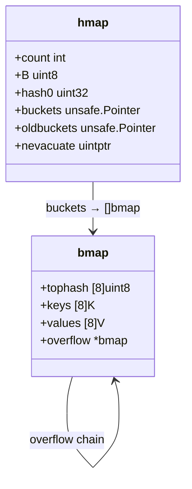
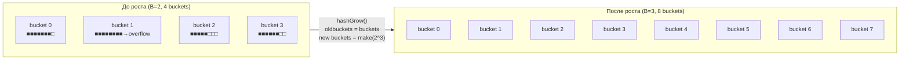

# Map internals до Go 1.24: hmap + bmap

Внутренности `map` до Go 1.24 — это hash table с chaining через overflow buckets. Понимание структуры объясняет почему порядок итерации случаен, почему нельзя брать адрес элемента, и как устроен рост.

## Содержание

- [Высокоуровневая схема](#высокоуровневая-схема)
- [hmap: заголовок map](#hmap-заголовок-map)
- [bmap: bucket](#bmap-bucket)
- [tophash: быстрый фильтр](#tophash-быстрый-фильтр)
- [Lookup: пошагово](#lookup-пошагово)
- [Insert](#insert)
- [Overflow buckets](#overflow-buckets)
- [Рост map: эвакуация](#рост-map-эвакуация)
- [Итерация: почему порядок случаен](#итерация-почему-порядок-случаен)
- [Nil map и zero value](#nil-map-и-zero-value)
- [Concurrent access: map не thread-safe](#concurrent-access-map-не-thread-safe)
- [Interview-ready answer](#interview-ready-answer)

---

## Высокоуровневая схема

```
m := make(map[string]int)

         hmap
    ┌────────────┐
    │ count  = 3 │
    │ B      = 2 │ ← 2^B = 4 buckets
    │ hash0      │ ← random seed
    │ buckets ───┼──→ [bmap0 | bmap1 | bmap2 | bmap3]
    │ oldbuckets │ ← nil (нет роста)
    └────────────┘

         bmap (bucket #1)
    ┌───────────────────┐
    │ tophash [8]uint8  │ ← top byte hash каждого из 8 слотов
    ├───────────────────┤
    │ key[0..7]         │ ← все ключи подряд
    ├───────────────────┤
    │ val[0..7]         │ ← все значения подряд
    ├───────────────────┤
    │ overflow *bmap    │ ← цепочка если bucket полон
    └───────────────────┘
```

---

## hmap: заголовок map

```go
// runtime/map.go (упрощённо)
type hmap struct {
    count     int            // количество элементов (len(m))
    flags     uint8          // итератор запущен? запись идёт?
    B         uint8          // log₂ числа buckets; buckets = 2^B
    noverflow uint16         // примерное число overflow buckets
    hash0     uint32         // случайный seed, задаётся при make()

    buckets    unsafe.Pointer // массив из 2^B bmap
    oldbuckets unsafe.Pointer // предыдущий массив во время роста
    nevacuate  uintptr        // счётчик прогресса эвакуации

    extra *mapextra           // overflow buckets для small maps
}
```



**Поле `B`**: число buckets всегда степень двойки. `B=3` → 8 buckets. Выбор bucket: `hash & (1<<B - 1)` — это быстро (bitwise AND вместо модуля).

**Поле `hash0`**: инициализируется при `make` из `runtime.fastrand()`. Один map → один seed. Именно он делает порядок итерации непредсказуемым между запусками и даже между разными экземплярами map.

---

## bmap: bucket

Один bucket хранит **ровно 8** пар ключ-значение. Ключи и значения хранятся **раздельными** блоками, не чередуясь:

```
bmap memory layout (map[string]int):

Offset   Content
───────────────────────────────────────
  0      tophash[0]  uint8     ←┐
  1      tophash[1]  uint8      │ 8 bytes: быстрый фильтр
  ...                           │
  7      tophash[7]  uint8     ←┘

  8      key[0]      string    ←┐  string = 16 bytes (ptr+len)
 24      key[1]      string     │
  ...                           │  8 × 16 = 128 bytes
120      key[7]      string    ←┘

128      val[0]      int       ←┐
136      val[1]      int        │  8 × 8 = 64 bytes
  ...                           │
184      val[7]      int       ←┘

192      overflow    *bmap     ←  8 bytes (указатель)
```

**Почему ключи отдельно от значений**, а не `[{key,val}, {key,val}, ...]`?

Рассмотрим `map[int8]int64`. Если чередовать: `int8(1 byte) + padding(7 bytes) + int64(8 bytes)` = 16 bytes на пару. Раздельно: 8 × int8 = 8 bytes ключей + 8 × int64 = 64 bytes значений → меньше padding.

---

## tophash: быстрый фильтр

`tophash[i]` хранит **старший байт** хэша i-го элемента в bucket.

```
hash("hello") = 0xA3F7_2B19_...
tophash       = 0xA3           ← старший байт
```

Специальные значения tophash:
```go
const (
    emptyRest      = 0 // слот пуст, дальше в bucket тоже пусто
    emptyOne       = 1 // слот пуст
    evacuatedX     = 2 // элемент эвакуирован в первую половину
    evacuatedY     = 3 // элемент эвакуирован во вторую половину
    evacuatedEmpty = 4 // слот пуст, bucket эвакуирован
    minTopHash     = 5 // минимальное значение для занятого слота
)
```

Если вычисленный tophash < 5 — runtime прибавляет 5, чтобы избежать коллизии со спецзначениями.

**Зачем tophash**: сначала сравниваем 1 байт (tophash), и только при совпадении — полный ключ. Это экономит сравнения на длинных ключах (string, struct).

---

## Lookup: пошагово

```go
v := m["hello"]
```

```mermaid
flowchart TD
    A([start: key = "hello"]) --> B["hash = hashfn(key, hash0)"]
    B --> C["bucket_idx = hash & (1<<B - 1)\n(выбрать bucket)"]
    C --> D["top = hash >> 56\n(старший байт)"]
    D --> E{oldbuckets != nil?}
    E -->|да, идёт рост| F["проверить в oldbuckets\nесли не эвакуирован"]
    E -->|нет| G["взять &buckets[bucket_idx]"]
    F --> G
    G --> H["for i = 0..7: tophash[i] == top?"]
    H -->|нет, emptyRest| I([return zero, false])
    H -->|совпало| J["сравнить key[i] == 'hello'?"]
    J -->|нет| H
    J -->|да| K([return val[i], true])
    H -->|весь bucket просмотрен| L{overflow != nil?}
    L -->|да| G
    L -->|нет| I
```

Ключевой момент: сначала проверяется `tophash` (1 байт), и только при совпадении — полный ключ. При 8 слотах в bucket это максимум 8 сравнений tophash + 1–2 полных сравнения ключа.

---

## Insert

```go
m["world"] = 42
```

1. Вычислить hash и bucket_idx
2. Пройтись по bucket, запомнить первый `emptyOne` слот
3. Если ключ уже есть — обновить val на месте
4. Если ключа нет — вставить в первый пустой слот
5. Если bucket полон — выделить overflow bucket и вставить туда
6. Проверить load factor → запустить рост если нужно

**Почему нельзя взять адрес элемента map:**
```go
v := &m["key"]  // ошибка компиляции: cannot take address of map element
```

При росте map переаллоцирует backing array и копирует элементы. Любой сохранённый указатель стал бы dangling pointer.

---

## Overflow buckets

Когда все 8 слотов в bucket заняты, создаётся **overflow bucket**:

```
bucket #2:
  [tophash|keys|vals] → overflow → [tophash|keys|vals] → overflow → nil
                         bucket        bucket
```

Overflow buckets аллоцируются из `mapextra.overflow` (pre-allocated pool) или через `newobject`. Поле `overflow *bmap` — последнее в структуре bmap (compile-time вычисляется offset).

Много overflow buckets — признак плохой хэш-функции или большого числа коллизий. Метрика для мониторинга: `hmap.noverflow`.

---

## Рост map: эвакуация

**Когда запускается рост:**
```
load factor = count / (2^B * 8)

Порог: load factor > 6.5
       ИЛИ слишком много overflow buckets
```



**Инкрементальная эвакуация** — ключевая особенность. Не всё сразу:

```
При каждом insert или delete:
  1. Эвакуировать 1 bucket из oldbuckets
  2. + ещё 1 bucket (для скорости)
  
  nevacuate отслеживает прогресс:
  if nevacuate == 2^(B-1): эвакуация завершена
  
При lookup:
  if oldbuckets != nil AND bucket ещё не эвакуирован:
    искать в oldbuckets
  else:
    искать в новых buckets
```

Эвакуация — O(1) на каждую операцию. Но во время роста map работает медленнее.

**Два вида роста:**
- **same size (B не меняется):** слишком много overflow buckets → перепаковать (уменьшить цепочки)
- **double size (B += 1):** load factor превышен → вдвое больше buckets

---

## Итерация: почему порядок случаен

```go
for k, v := range m { ... }
```

Go **намеренно** рандомизирует порядок итерации:

```
1. Выбрать случайный стартовый bucket (runtime.fastrand)
2. Выбрать случайный стартовый offset внутри bucket
3. Обойти все buckets по кругу начиная со случайного
```

Если идёт эвакуация — итератор смотрит в oldbuckets для ещё не эвакуированных элементов.

Рандомизация введена намеренно в **Go 1.0** (программы не должны полагаться на порядок). До этого порядок был детерминированным — и программисты на него полагались, что было багом.

---

## Nil map и zero value

```go
var m map[string]int  // m == nil

// Чтение из nil map — безопасно, возвращает zero value
v := m["key"]   // v == 0, нет паники
v, ok := m["key"]  // v == 0, ok == false

// Запись в nil map — паника
m["key"] = 1    // panic: assignment to entry in nil map

// Проверка:
if m == nil { m = make(map[string]int) }
```

Nil map — это `hmap` pointer == nil. Lookup проверяет это и возвращает zero value. Write сначала обращается к hmap полям → паника nil pointer dereference.

---

## Concurrent access: map не thread-safe

```go
// Детектор в runtime: hmap.flags & hashWriting
// При записи: flags |= hashWriting
// При чтении: if flags & hashWriting != 0 → throw "concurrent map read/write"
```

```go
// Плохо: concurrent read + write → паника или undefined behavior
go func() { m["a"] = 1 }()
go func() { _ = m["b"] }()

// Хорошо: sync.RWMutex
var mu sync.RWMutex
mu.Lock(); m["a"] = 1; mu.Unlock()
mu.RLock(); _ = m["b"]; mu.RUnlock()

// Хорошо: sync.Map для read-heavy с редкими writes
var sm sync.Map
sm.Store("a", 1)
v, _ := sm.Load("a")
```

Go runtime **detectирует** concurrent map access с Go 1.6: при записи выставляется флаг, при чтении или другой записи — проверяется. Это `throw` (не `panic`), то есть программа сразу падает без recover.

---

## Interview-ready answer

**"Как устроен map в Go (до 1.24)?"**

Переменная типа `map` — указатель на `hmap`. В `hmap` хранится: `count`, поле `B` (log₂ числа buckets), `hash0` (random seed), и указатели на массив buckets и oldbuckets (при росте).

Каждый bucket (`bmap`) хранит 8 пар ключ-значение. Ключи packed отдельно от значений — меньше padding. Первые 8 байт bucket — `tophash`: старший байт хэша каждого из 8 элементов для быстрого отсева при lookup.

Lookup: хэш → номер bucket (hash & mask) → scan tophash → при совпадении — полное сравнение ключа → если bucket полон — overflow bucket chain.

Рост запускается при load factor > 6.5 (6.5 элементов на bucket). Рост инкрементальный: при каждой записи/удалении эвакуируется 1-2 bucket из старого массива в новый. Во время эвакуации lookup проверяет оба массива.

Порядок итерации случаен намеренно — Go рандомизирует стартовый bucket. Map не thread-safe: runtime детектирует concurrent write + read/write через флаг в hmap.
