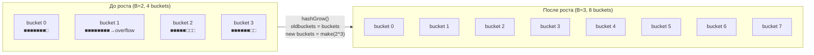

# Map internals до Go 1.24: hmap + bmap

Внутренности `map` до Go 1.24 — это hash table с chaining через overflow buckets. Понимание структуры объясняет почему порядок итерации случаен, почему нельзя брать адрес элемента, и как устроен рост.

## Содержание

- [Высокоуровневая схема](#высокоуровневая-схема)
- [Запись `m[key] = value`: алгоритм с высоты](#запись-mkey--value-алгоритм-с-высоты)
  - [Что внутри `scan(bucket, top, key)`](#что-внутри-scanbucket-top-key)
- [hmap: заголовок map](#hmap-заголовок-map)
- [bmap: bucket](#bmap-bucket)
- [tophash: быстрый фильтр](#tophash-быстрый-фильтр)
- [Что может быть ключом](#что-может-быть-ключом)
  - [Как работает интерфейс-ключ](#как-работает-интерфейс-ключ)
- [Lookup: пошагово](#lookup-пошагово)
- [Overflow buckets](#overflow-buckets)
  - [`mapextra`: зачем хранить указатели на overflow отдельно](#mapextra-зачем-хранить-указатели-на-overflow-отдельно)
- [Рост map: эвакуация](#рост-map-эвакуация)
  - [Зачем нужен same-size рост (перепаковка)](#зачем-нужен-same-size-рост-перепаковка)
  - [Что делает `growWork`: от нового bucket к старому](#что-делает-growwork-от-нового-bucket-к-старому)
  - [Что если новый рост нужен, пока старый не завершился?](#что-если-новый-рост-нужен-пока-старый-не-завершился)
- [Delete: удаление и почему map не сжимается](#delete-удаление-и-почему-map-не-сжимается)
- [Итерация: почему порядок случаен](#итерация-почему-порядок-случаен)
- [Nil map и zero value](#nil-map-и-zero-value)
- [Concurrent access: map не thread-safe](#concurrent-access-map-не-thread-safe)
  - [Почему это `throw`, а не `panic`](#почему-это-throw-а-не-panic)
- [Interview-ready answer](#interview-ready-answer)

---

## Высокоуровневая схема

```
m := make(map[string]int)

         hmap
    ┌────────────┐
    │ count  = 3 │
    │ B      = 2 │ ← 2^B = 4 buckets
    │ hash0      │ ← random seed
    │ buckets ───┼──→ [bmap0 | bmap1 | bmap2 | bmap3]
    │ oldbuckets │ ← nil (нет роста)
    └────────────┘

         bmap (bucket #1)
    ┌───────────────────┐
    │ tophash [8]uint8  │ ← top byte hash каждого из 8 слотов
    ├───────────────────┤
    │ key[0..7]         │ ← все ключи подряд
    ├───────────────────┤
    │ val[0..7]         │ ← все значения подряд
    ├───────────────────┤
    │ overflow *bmap    │ ← цепочка если bucket полон
    └───────────────────┘
```

---

## Запись `m[key] = value`: алгоритм с высоты

**Зачем вообще `hashfn`.** Ключ может быть чем угодно — строкой, структурой, числом. Чтобы за `O(1)` понять, *куда* класть пару и *где* её потом искать, нужен способ свести произвольный ключ к числу-адресу. Это и делает `hashfn`: `key → uint64`. Альтернатива без хэша — хранить пары списком/массивом и при каждом обращении линейно сравнивать ключи (`O(n)`); хэш заменяет этот перебор на арифметику.

От хэш-функции нужно два свойства, и оба критичны для скорости map:

- **Детерминированность**: один и тот же ключ всегда даёт один и тот же хэш — иначе значение нельзя было бы найти после записи.
- **Равномерность (хорошее распределение)**: близкие ключи (`"user1"`, `"user2"`) должны давать «разбросанные» хэши. Если хэши скучкуются — все пары попадут в один bucket, его overflow-цепочка вытянется в список, и `O(1)` выродится в `O(n)`. Поэтому Go использует быстрый перемешивающий хэш (на amd64 — с аппаратным AES, иначе memhash), а не наивную сумму байтов.

Сам по себе `hash` — это ещё не «адрес»: из него берутся **младшие `B` бит** → номер bucket, и **старший байт** → `tophash` (быстрый фильтр внутри bucket). То есть одно вычисление хэша обслуживает сразу два шага поиска.

Аргумент `m.hash0` — случайный seed (из `make()`): он подмешивается в хэш, чтобы (1) порядок итерации был непредсказуем между запусками и (2) атакующий не мог подобрать ключи, которые все лягут в один bucket (hash-flooding DoS). Подробнее про `hash0` — в разделе «hmap».

Прежде чем нырять в структуры — весь путь записи одним псевдокодом (это упрощённый `runtime.mapassign`). Термины (`bucket`, `tophash`, `overflow`, рост/эвакуация) расшифрованы в разделах ниже; здесь важна общая логика «куда вообще кладётся пара».

```
m[key] = value:

    hash := hashfn(key, m.hash0)        // 1. напр. "hello" → hash = 0xA3F7_2B19_C4D5_E6F9
    set hashWriting flag                //    детектор гонок: если флаг уже стоит → throw

again:
    bucket := hash & (1<<m.B - 1)       // 2. младшие B бит: B=2 → маска 0b11; …_1111_1001 & 0b11 = 0b01 → bucket 1
    if growing(m):                      //    идёт рост? сперва до-эвакуировать нужный
        growWork(bucket)                //    старый bucket (см. «Что делает growWork»)
    top := hash >> 56                   // 3. старший байт: 0xA3 → tophash (быстрый фильтр)

    // 4. идём по bucket и его overflow-цепочке: ищем либо сам ключ,
    //    либо первый свободный слот по пути
    found, freeSlot := scan(bucket, top, key)
    if found:
        found.value = value             // 5a. ключ уже есть → перезапись на месте
        goto done

    // 5b. ключа нет — нужно новое место. Но если порог нагрузки превышен
    //     и рост ещё не идёт — сначала растём и пересчитываем bucket.
    if !growing(m) && (overLoadFactor(m.count+1, m.B) || tooManyOverflow()):
        hashGrow()                       // oldbuckets = buckets; выделить вдвое больше
        goto again                       // bucket-индекс изменился → начать заново

    if freeSlot == nil:                  // в bucket и overflow мест нет
        freeSlot = newOverflowBucket(bucket)
    freeSlot.tophash, freeSlot.key, freeSlot.value = top, key, value
    m.count++                            // len(m) вырос

done:
    clear hashWriting flag
```

Здесь `B` — это **log₂ от числа buckets** (поле `hmap.B`): buckets всегда степень двойки, `2^B` штук. Чтобы адресовать `2^B` корзин, индекс должен занимать ровно `B` бит — поэтому и берут *младшие `B` бит* хэша: маска `2^B − 1` (это `B` единиц подряд) обрезает хэш до числа в диапазоне `[0, 2^B)`, то есть валидного номера bucket. Подробнее про `B` — в разделе «hmap».

**Может ли `B` стать больше длины хэша?** На практике — нет. `hash` это полное машинное слово (`uintptr`: 64 бита на amd64/arm64), а `B` растёт только вслед за числом buckets. Чтобы `B` дорос до 64, понадобилось бы `2^64` корзин — память кончится несоизмеримо раньше: даже map на миллиарды элементов это `B ≈ 30` (`2^30·6.5 ≈ 7 млрд`). Так что младшие `B` бит в хэше есть всегда, с огромным запасом. На случай гипотетического переполнения сдвига рантайм всё же маскирует его — `bucketShift` считает не `1<<B`, а `1 << (B & (PtrSize*8 − 1))`, но этот предохранитель в реальности не срабатывает. (Платформенная деталь: `top := hash >> 56` в псевдокоде подразумевает 64-битный хэш; в рантайме сдвиг зависит от разрядности — `hash >> (PtrSize*8 − 8)`, то есть на 32-битной платформе это `>> 24`.)

Разбор примера (`key="hello"`, `B=2` → `2²=4` bucket'а, маска `0b11`, `hash = 0xA3F7_2B19_C4D5_E6F9`): из **одного** 64-битного хэша (16 hex-цифр) берутся два разных куска. Старший байт `0xA3` уходит в `tophash` (фильтр внутри bucket). Для номера bucket нужны лишь **2 младших бита** (т.к. `B=2`): берём младший байт `0xF9 = 1111_1001`, маска `0b11` обнуляет всё, кроме двух последних бит → остаётся `01` → **bucket 1**. (Не путать hex-цифры с битами: `0xF9` — это 8 бит/один байт; «2 бита» — это хвостик `…01`.)

Три вещи, которые сразу видно из этого скелета:

- **Пара никогда не лежит «где попало»** — её bucket жёстко задан хэшем (`hash & (1<<B - 1)`), а внутри bucket порядок слотов — это порядок вставки, не сортировка.
- **`scan` сравнивает сначала 1 байт `tophash`**, и только при совпадении — полный ключ (см. «tophash»). Так перезапись существующего ключа и поиск пустого слота идут одним проходом.
- **Рост запускается записью**, которая пересекла порог, и происходит **до** вставки нового элемента (`goto again`) — поэтому новый элемент сразу попадает в новый, увеличенный массив buckets.

### Что внутри `scan(bucket, top, key)`

`scan` — это вложенный обход: внешний цикл идёт по bucket и его overflow-цепочке, внутренний — по 8 слотам каждого bucket. За один проход он решает обе задачи: найти существующий ключ (для перезаписи) **и** запомнить первый свободный слот (для вставки, если ключа нет).

```
scan(bucket, top, key) -> (found, freeSlot):
    var freeSlot = nil
    for b := &m.buckets[bucket]; b != nil; b = b.overflow:   // bucket + overflow-цепочка
        for i := 0; i < 8; i++:
            if b.tophash[i] != top:                  // быстрый фильтр: 1 байт не совпал
                if b.tophash[i] == emptyRest:        //   спецзначение: дальше всё пусто →
                    if freeSlot == nil: freeSlot = &b[i]
                    return nil, freeSlot             //   можно выходить совсем
                if isEmpty(b.tophash[i]):            //   слот пуст (emptyOne) — кандидат
                    if freeSlot == nil: freeSlot = &b[i]
                continue                             //   занятый слот с другим top — мимо
            if b.keys[i] == key:                     // top совпал → ПОЛНОЕ сравнение ключа
                return &b[i], freeSlot               //   нашли: вернуть слот на перезапись
            // top совпал, а ключ нет — коллизия по старшему байту, идём дальше
    return nil, freeSlot                             // ключа нет; freeSlot — куда вставить
```

Прогон для нашего примера (`top = 0xA3`, `key = "hello"`, попали в **bucket 1**). Пусть bucket 1 заполнен так:

```
slot:      0        1        2        3        4 ...
tophash: 0x5C     0xA3     0x11   emptyOne  emptyRest
key:    "foo"   "world"   "bar"     —         —
```

- **slot 0** (`0x5C`): `tophash != 0xA3` и слот занят → пропускаем, ключ даже не читаем.
- **slot 1** (`0xA3`): `tophash` совпал → читаем ключ: `"world" != "hello"` — это **коллизия по старшему байту** (у разных ключей совпал 1 байт хэша), идём дальше.
- **slot 2** (`0x11`): не совпал, занят → пропускаем.
- **slot 3** (`emptyOne`): пусто → запоминаем `freeSlot = slot 3` (первый свободный).
- **slot 4** (`emptyRest`): спецзначение «дальше до конца bucket пусто» → дальше идти бессмысленно, **выходим**.

Итог: `found = nil`, `freeSlot = slot 3`. Вернувшись в основной алгоритм, мы попадём в ветку 5b — и (если рост не нужен) запишем `"hello"` именно в slot 3. Если бы в slot 1 лежал реально `"hello"` — `scan` вернул бы этот слот, и значение перезаписалось бы на месте (ветка 5a).

Два спецзначения `tophash` дают важную оптимизацию: `emptyOne` помечает одиночный пустой слот (мог освободиться после `delete`), а `emptyRest` — что весь остаток bucket и его overflow пуст, позволяя оборвать скан досрочно. Полный список спецзначений — в разделе «tophash».

**Следствие: элемент map не адресуем.** Раз при росте `buckets` переаллоцируются и пары физически переезжают (см. «Рост map: эвакуация»), любой сохранённый указатель на элемент стал бы dangling. Поэтому компилятор запрещает брать адрес:

```go
v := &m["key"]   // ошибка компиляции: cannot take address of map element
m["k"].field = 1 // и менять поле структуры-значения на месте тоже нельзя
```

---

## hmap: заголовок map

```go
// runtime/map.go (упрощённо)
type hmap struct {
    count     int            // количество элементов (len(m))
    flags     uint8          // итератор запущен? запись идёт?
    B         uint8          // log₂ числа buckets; buckets = 2^B
    noverflow uint16         // примерное число overflow buckets
    hash0     uint32         // случайный seed, задаётся при make()

    buckets    unsafe.Pointer // массив из 2^B bmap
    oldbuckets unsafe.Pointer // предыдущий массив во время роста
    nevacuate  uintptr        // индекс-курсор: докуда дошёл последовательный sweep эвакуации

    extra *mapextra           // пул и keep-alive для overflow-buckets (см. ниже)
}
```

Связи между структурами: `hmap.buckets` указывает на массив `[]bmap` (а `oldbuckets` — на прежний массив во время роста); каждый `bmap` через поле `overflow *bmap` может ссылаться на следующий — так образуется overflow-цепочка. Сам `bmap` (8 слотов: `tophash [8]uint8`, ключи, значения, `overflow`) разбирается ниже, в разделе «bmap: bucket».

**Поле `B`**: число buckets всегда степень двойки. `B=3` → 8 buckets. Выбор bucket: `hash & (1<<B - 1)` — это быстро (bitwise AND вместо модуля).

**Поле `hash0`**: seed фиксируется **один раз** при `make` — прямо в `makemap`:

```go
// runtime/map.go (Go ≤1.23)
func makemap(t *maptype, hint int, h *hmap) *hmap {
    // ...проверка размера...
    if h == nil {
        h = new(hmap)
    }
    h.hash0 = uint32(rand())   // ← случайный seed, один на весь map
    // ...вычисление B и аллокация buckets...
    return h
}
```

Дальше этот seed подмешивается в **каждое** хэширование ключа — и при вставке, и при поиске:

```go
hash := t.hasher(key, uintptr(h.hash0))   // hasher — сгенерированная под тип ключа функция
```

Один map → один seed на всё время жизни (иначе ранее записанные ключи перестали бы находиться). Разные экземпляры map получают **разные** seed'ы — поэтому порядок итерации непредсказуем и между запусками программы, и между двумя map в одном запуске. (`rand()` — внутренний быстрый ГПСЧ рантайма; в Go ≤1.21 та же функция называлась `fastrand()`.)

---

## bmap: bucket

Один bucket хранит **ровно 8** пар ключ-значение. Но в исходниках рантайма структура `bmap` объявлена... только с одним полем:

```go
// runtime/map.go
const bucketCnt = 8           // (в коде: abi.OldMapBucketCount)

type bmap struct {
    tophash [bucketCnt]uint8  // и всё — больше полей нет!
}
```

Ключи, значения и указатель `overflow` в struct **не объявлены** — их нет в исходнике. Их раскладку компилятор достраивает сам под конкретные типы `K`/`V` (через `maptype`): сразу за `tophash` идут 8 ключей, потом 8 значений, потом `overflow *bmap`. Доступ к ним — арифметика по смещениям через `unsafe.Pointer`. Так сделано, потому что Go-дженериков на уровне рантайма нет: один код map должен работать с любыми `K`/`V`, а размеры полей известны только в compile-time.

Ключи и значения лежат **раздельными** блоками (все ключи, затем все значения), не чередуясь:

```
bmap memory layout (map[string]int):

Offset   Content
───────────────────────────────────────
  0      tophash[0]  uint8     ←┐
  1      tophash[1]  uint8      │ 8 bytes: быстрый фильтр
  ...                           │
  7      tophash[7]  uint8     ←┘

  8      key[0]      string    ←┐  string = 16 bytes (ptr+len)
 24      key[1]      string     │
  ...                           │  8 × 16 = 128 bytes
120      key[7]      string    ←┘

128      val[0]      int       ←┐
136      val[1]      int        │  8 × 8 = 64 bytes
  ...                           │
184      val[7]      int       ←┘

192      overflow    *bmap     ←  8 bytes (указатель)
```

**Почему ключи отдельно от значений**, а не `[{key,val}, {key,val}, ...]`?

Рассмотрим `map[int8]int64`. Если чередовать: `int8(1 byte) + padding(7 bytes) + int64(8 bytes)` = 16 bytes на пару. Раздельно: 8 × int8 = 8 bytes ключей + 8 × int64 = 64 bytes значений → меньше padding.

---

## tophash: быстрый фильтр

`tophash[i]` хранит **старший байт** хэша i-го элемента в bucket.

```
hash("hello") = 0xA3F7_2B19_...
tophash       = 0xA3           ← старший байт
```

Специальные значения tophash:
```go
const (
    emptyRest      = 0 // слот пуст, дальше в bucket тоже пусто
    emptyOne       = 1 // слот пуст
    evacuatedX     = 2 // элемент эвакуирован в первую половину
    evacuatedY     = 3 // элемент эвакуирован во вторую половину
    evacuatedEmpty = 4 // слот пуст, bucket эвакуирован
    minTopHash     = 5 // минимальное значение для занятого слота
)
```

Если вычисленный tophash < 5 — runtime прибавляет 5, чтобы избежать коллизии со спецзначениями.

**Зачем tophash**: сначала сравниваем 1 байт (tophash), и только при совпадении — полный ключ. Это экономит сравнения на длинных ключах (string, struct).

---

## Что может быть ключом

Требование одно: тип ключа должен быть **comparable** — поддерживать `==`/`!=`. Причина прямо из механики: при совпадении `tophash` рантайм сравнивает полный ключ (`t.key.equal`), а сам ключ хэширует (`t.hasher`); обе функции компилятор генерирует под конкретный тип, и для не-comparable типов их попросту не существует.

**Можно (comparable):**
- булевы, все числовые (`int`/`uint`/`float`/`complex`), строки;
- указатели (сравниваются по адресу, не по тому, на что указывают);
- каналы;
- интерфейсы;
- структуры — если **все** поля comparable;
- массивы фиксированной длины — если элемент comparable.

**Нельзя (не comparable) → ошибка компиляции:**
- срезы (`[]T`), `map`, функции;
- структуры/массивы, содержащие что-либо из перечисленного.

```go
_ = map[[2]int]string{}            // ок: массив из comparable
_ = map[struct{ X, Y int }]int{}   // ок: все поля comparable
_ = map[[]int]int{}                // ошибка компиляции: invalid map key type []int
```

**Почему `chan` можно, а `map`/`slice` — нет, ведь все они «ссылки»?** На уровне представления и правда: `chan`, `map`, `slice` — это указатели на рантайм-структуры (`hchan`, `hmap`, заголовок слайса). Технически сравнить их по идентичности было бы можно. Запрет на `map`/`slice` — **сознательное решение языка**, а не ограничение реализации, и дело в неоднозначности `==`:

- у **канала** одна осмысленная трактовка — идентичность: два канала равны, если созданы одним `make` (тот же `hchan`) или оба `nil`. «Содержимого» у канала для сравнения нет, поэтому `==` определён однозначно;
- у **map/slice** трактовок две, и обе ожидаемы: идентичность (тот же объект) **или** равенство содержимого (одинаковые элементы). Большинство интуитивно ждёт второе, но это `O(n)`, а не дешёвый `==`. Чтобы не навязывать сюрпризную семантику, Go запретил `==` совсем (для функций — нет вменяемого равенства в принципе).

Для сравнения содержимого есть явные инструменты: `maps.Equal` (Go 1.21+) или `reflect.DeepEqual`.

### Как работает интерфейс-ключ

Интерфейсное значение — это пара `(динамический тип, данные)`. Как ключ map участвуют **оба** компонента:

- **Хэш** = комбинация идентификатора динамического типа и `typehash(значение)`. Поэтому `any(1)` (тип `int`) и `any(int64(1))` хэшируются по-разному → это **разные** ключи:

```go
m := map[any]string{}
m[1] = "int"
m[int64(1)] = "int64"
m["1"] = "string"
len(m)        // 3 — три разных динамических типа = три ключа
m[1]          // "int" (int(1) ≠ int64(1) ≠ "1")
```

- **Равенство** (при совпадении tophash): `efaceeq`/`ifaceeq` — сначала сравнивают указатели на тип (тип должен быть **идентичным**), затем значения через `equal`-функцию этого типа. Разные динамические типы не равны никогда, даже если «выглядят» одинаково.
- **Не-comparable динамический тип — мина, срабатывает в рантайме.** Компилятор пропускает (статический тип ключа `any` — comparable), а падает уже на операции с map. Причём в map это происходит на **хэшировании** (оно идёт первым):

```go
m := map[any]int{}
m[[]int{1}] = 1   // panic: runtime error: hash of unhashable type []int
```

Это `panic` (ловится `recover`), а не fatal — см. [05-error-handling](../05-error-handling.md), раздел «Три уровня отказа». Нюанс сообщения: в map — `hash of unhashable type`, а прямое `a == b` двух интерфейсов с не-comparable динамикой даёт другое — `comparing uncomparable type` (там сравнение без предварительного хэша).

Остальные нюансы ключей:
- **Указатель — это адрес.** Два разных `*T`, указывающих на равные значения, — **разные** ключи.
- **float и NaN.** `NaN != NaN`, поэтому ключ-`NaN` нельзя достать обратно (вставка каждый раз создаёт новый ключ); `+0.0` и `−0.0` равны → один ключ. Подробнее — в [03-puzzles-and-gotchas](./03-puzzles-and-gotchas.md).
- **Структура-ключ** сравнивается по всем полям; padding на семантику `==` не влияет, но участвует в раскладке и хэше.

---

## Lookup: пошагово

Чтение — это **тот же `scan`**, что и при записи, только без флага `hashWriting`, без триггера роста и с другим финалом: вернуть значение или `zero value, false`.

```go
v := m["hello"]
```

```
v := m[key]:
    if m == nil || m.count == 0:
        return zero, false            // пустая/nil map — сразу промах

    hash := hashfn(key, m.hash0)
    bucket := hash & (1<<m.B - 1)     // корзина в НОВОМ массиве
    top := hash >> 56

    // во время роста корзина может быть ещё не эвакуирована —
    // тогда актуальные данные в oldbuckets
    if growing(m):                                 // growing(m) == (m.oldbuckets != nil)
        oldbucket := bucket & m.oldbucketmask()   // = hash & (1<<oldB - 1)
        ob := &m.oldbuckets[oldbucket]
        if !evacuated(ob):           // старая корзина ещё не переехала?
            b := ob                  //   → читаем из неё
        else:
            b := &m.buckets[bucket]  //   → уже переехала, читаем из нового
    else:
        b := &m.buckets[bucket]

    found, _ := scan(b, top, key)     // ← ядро общее с записью
    if found:
        return found.value, true
    return zero, false                // промах: zero value + ok=false (comma-ok)
```

Отличия чтения от записи только в обрамлении `scan`:

- **промах не аллоцирует** — просто `zero value, false` (поэтому чтение из nil map безопасно, см. «Nil map и zero value»);
- **рост не запускается** — чтение лишь смотрит в `oldbuckets`, если нужная корзина ещё не переехала, но эвакуацию не двигает (её двигают только записи/удаления);
- есть форма `v, ok := m[key]` (**comma-ok**) — тот же путь, просто возвращается ещё и флаг наличия.

---

## Overflow buckets

Когда все 8 слотов в bucket заняты, создаётся **overflow bucket**:

```
bucket #2:
  [tophash|keys|vals] → overflow → [tophash|keys|vals] → overflow → nil
                         bucket        bucket
```

Overflow buckets берутся из пула `mapextra.nextOverflow` (заранее до-аллоцированный кусок при `make`) или, когда пул кончился, через `newobject`. Поле `overflow *bmap` — последнее в структуре bmap (compile-time вычисляется offset).

Много overflow buckets — признак плохой хэш-функции или большого числа коллизий. Метрика для мониторинга: `hmap.noverflow`.

### `mapextra`: зачем хранить указатели на overflow отдельно

Поле `hmap.extra *mapextra` существует ради одной тонкости с GC. Вот структура (из исходников) с её смыслом:

```go
type mapextra struct {
    // Если ключ И значение НЕ содержат указателей, тип bucket помечается
    // как беспойнтерный — GC такие map не сканирует (экономия на больших map).
    // Но bmap.overflow — это сам по себе указатель (*bmap). Если bucket
    // беспойнтерный, GC не увидит overflow-указатель и соберёт overflow-bucket
    // как мусор. Чтобы этого не случилось, ВСЕ overflow-bucket'ы держатся
    // живыми через эти срезы:
    overflow    *[]*bmap   // overflow для hmap.buckets
    oldoverflow *[]*bmap   // overflow для hmap.oldbuckets (во время роста)

    nextOverflow *bmap     // указатель на свободный pre-allocated overflow-bucket
}
```

Парадокс: оптимизация (не сканировать map без указателей) ломает другую часть структуры (overflow-указатель), и `mapextra` — это «костыль», который её чинит. Когда `K`/`V` беспойнтерные, рантайм:

1. помечает bucket-тип как не содержащий указателей → GC пропускает сканирование самих корзин (быстрее GC на больших беспойнтерных map, вроде `map[int]int`);
2. но `bmap.overflow` теперь «невидим» для GC → отдельно складывает указатели на все overflow-bucket'ы в срезы `extra.overflow`/`oldoverflow`, и уже эти срезы держат их живыми.

Если же `K` или `V` **содержат указатели**, корзины и так сканируются GC — тогда `overflow`/`oldoverflow` не нужны, и в `extra` живёт по сути только `nextOverflow` (пул свободных overflow-корзин).

**Какой длины бывает цепочка?** Жёсткого предела на длину цепочки одного bucket в коде **нет** — теоретически она может тянуться, пока хватает памяти. Но на практике её держат короткой (обычно 0–1 overflow на bucket) два независимых триггера роста, оба проверяются при вставке:

- **`overLoadFactor` (> 6.5 элемента на bucket)** → double-size рост: корзин становится вдвое больше, средняя заполненность падает. Это ограничивает цепочки «в среднем».
- **`tooManyOverflowBuckets`** → same-size рост (перепаковка): срабатывает, когда overflow-корзин примерно столько же, сколько обычных (`noverflow ≈ 2^B`, но не больше `2^15`). Перепаковка раскидывает живые пары заново и схлопывает разросшиеся цепочки.

```go
// "слишком много overflow" ≈ их столько же, сколько обычных buckets
func tooManyOverflowBuckets(noverflow uint16, B uint8) bool {
    if B > 15 { B = 15 }              // кап: не больше 2^15 = 32768
    return noverflow >= uint16(1)<<(B&15)
}
```

Порог — это `2^min(B,15)`, то есть **столько же overflow-корзин, сколько обычных** (обычных как раз `2^B`), но с потолком `2^15`:

| `B` | обычных buckets (`2^B`) | порог `noverflow` | примечание |
|----:|------------------------:|------------------:|------------|
| 2   | 4                       | 4                 | `2^2` |
| 5   | 32                      | 32                | `2^5` |
| 10  | 1024                    | 1024              | `2^10` |
| 15  | 32 768                  | 32 768            | `2^15` |
| 20  | ~1 048 576              | **32 768**        | кап: не `2^20`, а `2^15` |

То есть для небольших map порог растёт вместе с числом корзин (≈ «по одной overflow на корзину»). А начиная с `B=15` он **замораживается** на 32 768: гигантской map с миллионом корзин не нужен миллион overflow, чтобы запустить перепаковку — хватит тех же 32 768. Так перепаковка для больших map срабатывает (относительно) раньше и не даёт overflow-мусору копиться бесконтрольно.

Длинная цепочка остаётся возможной только при **вырожденном хэшировании** — когда масса ключей реально попадает в один и тот же bucket (адресный bucket задаётся младшими `B` битами хэша). Этого почти не бывает: хэш Go хорошо распределяет значения, а случайный `hash0` не даёт атакующему подобрать ключи-коллизии (hash-flooding). Если же все ключи честно дают один bucket — перепаковка не спасёт (новый bucket тот же), и цепочка останется длинной; это уже патология хэша, а не нормальный режим.

Деталь про счётчик: `noverflow` — `uint16` и **приблизительный**. Для больших `B` рантайм увеличивает его не на каждый overflow, а вероятностно (`incrnoverflow`), чтобы 16-битный счётчик сам не переполнился — для триггера роста точное значение и не нужно.

---

## Рост map: эвакуация

**Когда запускается рост:**
```
load factor = count / (2^B * 8)

Порог: load factor > 6.5
       ИЛИ слишком много overflow buckets
```


```mermaid
flowchart LR
    subgraph before["До роста (B=2, 4 buckets)"]
        B0["bucket 0\n■■■■■■■□"] 
        B1["bucket 1\n■■■■■■■■→overflow"]
        B2["bucket 2\n■■■■■□□□"]
        B3["bucket 3\n■■■■■■□□"]
    end

    subgraph after["После роста (B=3, 8 buckets)"]
        N0["bucket 0"] 
        N1["bucket 1"]
        N2["bucket 2"]
        N3["bucket 3"]
        N4["bucket 4"]
        N5["bucket 5"]
        N6["bucket 6"]
        N7["bucket 7"]
    end

    before -->|"hashGrow()\noldbuckets = buckets\nnew buckets = make(2^3)"| after
```

**Инкрементальная эвакуация** — ключевая особенность. Не всё сразу:

```
При каждом insert или delete (это и есть growWork, разбор ниже):
  1. Эвакуировать bucket, соответствующий тому, в который пишем
     (bucket & oldbucketmask)
  2. + ещё 1 bucket по курсору nevacuate — для ГАРАНТИИ прогресса
     (в исходнике: "evacuate one more oldbucket to make progress on growing")

  nevacuate отслеживает прогресс (по порядку 0,1,2,…):
  когда nevacuate дошёл до конца старого массива → эвакуация завершена

При lookup:
  if oldbuckets != nil AND bucket ещё не эвакуирован:
    искать в oldbuckets
  else:
    искать в новых buckets
```

Второй шаг — это второй `evacuate(t, h, h.nevacuate)` в `growWork` (см. «Что делает `growWork`»). Он нужен **не для скорости, а для гарантии завершения**: если записи всё время бьют по уже эвакуированным корзинам, шаг 1 не двигал бы прогресс, и `oldbuckets` висел бы вечно. Курсор `nevacuate` же идёт строго по порядку, поэтому каждая операция продвигает рост ровно на один bucket к концу.

Важно про `nevacuate`: это **одно число** (индекс-курсор), а не список корзин на эвакуацию. Рабочий список — сам массив `oldbuckets`; `nevacuate` лишь помнит, докуда дошёл последовательный sweep. Какие корзины уже переехали, хранится **не** здесь, а метками `evacuatedX/Y/Empty` в самих корзинах (`evacuated(b)`). После эвакуации `advanceEvacuationMark` двигает `nevacuate` вперёд, перескакивая корзины, которые успели переехать вне очереди (через шаг 1, `bucket & oldbucketmask`).

Сам `advanceEvacuationMark` (вызывается в конце `evacuate`):

```go
func advanceEvacuationMark(h *hmap, t *maptype, newbit uintptr) {
    h.nevacuate++
    // проскочить уже эвакуированные корзины, но не более +1024 за раз —
    // чтобы вызов оставался O(1), а не сканировал весь хвост массива
    stop := h.nevacuate + 1024
    if stop > newbit { stop = newbit }
    for h.nevacuate != stop && bucketEvacuated(h, t, h.nevacuate) {
        h.nevacuate++
    }
    if h.nevacuate == newbit {   // newbit == число старых корзин → всё переехало
        h.oldbuckets = nil       // освободить старый массив (теперь это мусор для GC)
        if h.extra != nil {
            h.extra.oldoverflow = nil   // и старые overflow-keepalive больше не нужны
        }
        h.flags &^= sameSizeGrow // снять флаг роста
    }
}
```

Три момента: (1) курсор инкрементится на только что эвакуированную корзину; (2) затем проскакивает подряд идущие уже эвакуированные, но с капом **+1024** за вызов — чтобы не превратить продвижение в линейный скан хвоста (сохраняем `O(1)` на операцию); (3) когда `nevacuate` догнал число старых корзин — рост завершён: `oldbuckets` обнуляется (становится мусором для GC), сбрасывается `oldoverflow` и флаг `sameSizeGrow`.

Эвакуация — **амортизированно `O(1)`** на операцию, а не буквально константа. Почему: `growWork` трогает максимум 2 старых корзины (соответствующую + по `nevacuate`), а не весь map — это и отличает инкрементальный рост от stop-the-world рехеша на `O(n)`. Обход одной корзины — это проход по её overflow-цепочке, но цепочки удерживаются короткими самими триггерами роста (load factor 6.5 → ~1 overflow в среднем), поэтому в среднем это `O(1)`. В сумме за весь рост каждый элемент переезжает ровно один раз — `O(n)` работы на `O(n)` операций. В **вырожденном** случае (плохой хэш → длинная цепочка) эвакуация этой корзины станет `O(длины цепочки)`, но это та же патология, что ломает и обычный lookup. Во время роста map в любом случае работает медленнее (каждая операция тащит ещё и эвакуацию).

**Два вида роста:**
- **same size (B не меняется):** слишком много overflow buckets → перепаковать (уменьшить цепочки)
- **double size (B += 1):** load factor превышен → вдвое больше buckets

#### Зачем нужен same-size рост (перепаковка)

Звучит парадоксально: число корзин то же — что это вообще «уменьшает»? Дело в **фрагментации от churn** (циклы вставок и удалений).

Сценарий: bucket переполнился → завели overflow и положили туда пару. Потом из **основного** bucket удалили несколько ключей — на их месте остались дырки (`emptyOne`). Но пара в overflow-корзине **там и осталась**: `delete` чистит только свой слот и не «подтягивает» элементы из overflow обратно в основную корзину. Повтори это много раз — и получишь кучу overflow-корзин, в которых живых пар мало, а слотов занято много. Заполненность (`load factor`) низкая, double-size не нужен — но `noverflow` большой, lookup тащится по длинным разреженным цепочкам.

Same-size рост это чинит: аллоцируется **новый массив того же размера** `2^B`, и `evacuate` перекладывает в него только **живые** пары. Поскольку вставка идёт «с нуля», каждая пара садится в начало своей корзины, заполняя слоты плотно; overflow заводится только если основная корзина реально набила все 8. Разреженные цепочки схлопываются.

```
До (B=2, после churn):                   После same-size роста (B=2):
bucket 1: ■□□□□□□□ → ov:■□□□□□□□ → ov:■□□  bucket 1: ■■■□□□□□  (нет overflow)
          (3 живых, размазаны по 3 корзинам)        (те же 3 пары, 1 корзина)
```

Итог: тот же `B`, но overflow-корзин почти нет и цепочки короткие → lookup снова быстрый. Память при этом **не уменьшается** (`2^B` корзин как было) — речь только про дефрагментацию, не про shrink.

**А не зациклится ли «перепаковал → снова порог → перепаковал»?** В нормальном режиме — нет. Same-size выбирается, только когда load factor **не** превышен (иначе был бы double-size), а низкий load factor значит, что живых пар мало относительно слотов — при перепаковке «с нуля» они почти все умещаются в основные корзины, и `noverflow` после repack падает ~до нуля. То есть триггер сам гарантирует, что уплотнять есть куда, и порог больше не сработает. Зациклиться оно могло бы лишь в вырожденном случае — если бы `≥ 8·2^B` ключей честно давали один и тот же bucket: тогда repack бесполезен (bucket тот же) и порог пробивался бы снова. Но это та же патология хэша — хороший хэш + случайный `hash0` делают её недостижимой, а явного «не перепаковывай дважды» предохранителя в коде нет: защита статистическая.

### Что делает `growWork`: от нового bucket к старому

Вот точка, которая обычно путает. В псевдокоде записи `bucket` мы вычислили уже по **новому** числу корзин (`hash & (1<<B - 1)`, где `B` — увеличенный). Но реальные пары всё ещё лежат в `oldbuckets`. `growWork` связывает одно с другим:

```go
func growWork(t *maptype, h *hmap, bucket uintptr) {
    // 1. эвакуировать СТАРЫЙ bucket, соответствующий тому новому,
    //    который мы сейчас собираемся трогать
    evacuate(t, h, bucket & h.oldbucketmask())   // oldbucketmask = (1<<oldB) - 1

    // 2. + ещё один bucket по курсору nevacuate — чтобы рост
    //    гарантированно завершился, даже если записи неравномерны
    if h.growing() {
        evacuate(t, h, h.nevacuate)
    }
}
```

`oldbucketmask()` — это маска из `oldB` бит (на один меньше, чем новый `B`). Применив её к новому индексу bucket, мы отбрасываем старший (только что появившийся) бит и получаем номер **старой** корзины, где сейчас физически лежат нужные пары. То есть: «хочу писать в новый bucket → сначала эвакуирую старый, который его наполняет».

Пример (`oldB=2` → `B=3`). Хотим писать в **новый bucket 5**:

```
новый индекс:   5 = 0b101   (3 бита, т.к. новый B=3)
oldbucketmask:      0b011   ((1<<oldB) - 1 = (1<<2) - 1 = 3)
5 & 0b011    =      0b001   = старый bucket 1   ← отбросили старший бит
```

Значит, нужные пары сейчас лежат в **старом bucket 1**. `growWork` эвакуирует именно его. А старый bucket 1 при double-size делится на два новых по новому биту (бит #2): кто с `0` → в новый bucket `1` (это `1`, X-половина), кто с `1` → в новый bucket `1 + 2^oldB = 1 + 4 = 5` (Y-половина). Среди них — bucket 5, в который мы и хотели писать. После эвакуации он полностью заполнен и консистентен, можно вставлять.

Обратно тоже работает: новый bucket `1` (`0b001`) даёт `1 & 0b011 = 1` — тот же старый bucket 1. Логично: оба новых (`1` и `5`) — это две половины одной старой корзины, поэтому маска переводит их в один и тот же старый индекс.

**Как `evacuate` раскидывает одну старую корзину (double-size).** При `B += 1` каждый старый bucket делится **на два** новых:

```
oldB = 2 (4 корзины) → B = 3 (8 корзин)

         старый bucket 1
        ┌──────────────────┐
        │ ключи с hash&0b11 │
        │       == 01       │
        └─────────┬─────────┘
       новый бит (бит #2 хэша) решает, куда:
        ┌─────────┴──────────┐
   бит=0 ▼                    ▼ бит=1
   новый bucket 1        новый bucket 5
   (X: тот же индекс)    (Y: индекс + 2^oldB = 1+4)
```

Каждую пару из старого bucket кладут в новый по **новому значащему биту** хэша (бит номер `oldB`): `0` → половина **X** (тот же индекс, что и старый), `1` → половина **Y** (индекс + `2^oldB`). Поэтому эвакуация старого bucket `1` сразу наполняет оба новых — `1` и `5`; один из них — тот, в который мы и собирались писать.

И да — `evacuate` идёт **по всей цепочке** старой корзины: внешний цикл по самому bucket и его overflow-звеньям, внутренний — по 8 слотам каждого. То есть в X/Y переезжают пары не только из основного старого bucket, но и из всех его overflow:

```
evacuate(oldbucket):
    dstX := новый bucket[oldbucket]            // X-назначение
    dstY := новый bucket[oldbucket + 2^oldB]   // Y-назначение
    for b := старый bucket; b != nil; b = b.overflow:   // ← обход цепочки
        for i := 0; i < 8; i++:
            если слот пуст: continue
            dst := (hash & newbit == 0) ? dstX : dstY
            если dst полон → завести ему overflow, переключиться на него
            скопировать key/value в dst, продвинуть указатель
            старый слот = evacuatedX / evacuatedY
```

Важное следствие: новые X и Y тоже могут обзавестись собственными overflow-звеньями — если в одну половину попадёт больше 8 пар. Но обычно при double-size каждая половина получает примерно вдвое меньше пар, чем было в старой цепочке, поэтому цепочки в среднем **укорачиваются**.

При **same-size** росте новый бит не добавляется: `evacuate` просто перекладывает живые пары в один новый bucket того же индекса, схлопывая overflow-цепочки и дырки от `delete`.

**Чем помечается эвакуированное.** `evacuate` проходит все 8 слотов корзины: занятый слот переносит и метит `tophash` как `evacuatedX` / `evacuatedY` (куда ушла пара), а **пустой** слот (был `emptyOne`/`emptyRest` — никогда не использовался либо освобождён прежним `delete`) метит `evacuatedEmpty` (переносить нечего). То есть метку получают **все** слоты, не только занятые. По этим меткам lookup во время роста понимает: эта корзина уже переехала — искать в новых buckets, а не в `oldbuckets`.

Зачем метить и пустые слоты: ради той самой дешёвой проверки `evacuated(b)`, которая смотрит только `tophash[0]`. Если бы нулевой слот оказался пустым и остался `emptyOne`, проверка ошибочно сказала бы «не эвакуирована». А так статус корректен независимо от того, что лежало в слоте 0. Курсор `nevacuate` двигается по старому массиву по порядку; когда он дошёл до конца (`nevacuate == 2^oldB`), `oldbuckets` освобождается и рост завершён.

Сама проверка `evacuated(ob)` (та, что в псевдокоде lookup) — это чтение **одного байта**, `tophash[0]`. Три «эвакуированных» метки по числам лежат между `emptyOne` и `minTopHash`, поэтому одно диапазонное сравнение ловит их все:

```go
func evacuated(b *bmap) bool {
    h := b.tophash[0]                       // достаточно нулевого слота:
    return h > emptyOne && h < minTopHash   // evacuate переносит корзину целиком,
}                                           // значит [0] уже метка ∈ {2,3,4}
```

#### Что если новый рост нужен, пока старый не завершился?

Это и есть тот нюанс. В `hmap` поле `oldbuckets` **одно** — уровней «старый / ещё более старый» не предусмотрено. Поэтому новый рост нельзя начать, пока не доехал предыдущий. Гарантирует это сам триггер: рост запускается только при `!h.growing()` (а `growing()` == `oldbuckets != nil`):

```go
// в mapassign:
if !h.growing() && (overLoadFactor(h.count+1, h.B) || tooManyOverflow(...)):
    hashGrow()   // ← НЕ вызовется, пока идёт предыдущая эвакуация
```

Почему это безопасно и не приводит к застреванию: эвакуация **обгоняет** порог. Каждая запись/удаление эвакуирует 1–2 старых корзины (`growWork`), так что весь старый массив (`2^oldB` корзин) переезжает примерно за `2^(oldB-1)` операций. А чтобы снова пробить load factor после double-size, нужно добавить ещё ~`count` элементов (а `count ≈ 6.5·2^oldB`). Поскольку `6.5·2^oldB ≫ 2^(oldB-1)`, предыдущий рост гарантированно завершается задолго до того, как понадобится следующий. Так что ситуация «нужен новый рост, а старый не доехал» в норме просто **не возникает**.

Обратная сторона того же механизма: эвакуация **не фоновая** — она происходит только на записях/удалениях. Если map выросла, а потом стала read-only, она может остаться в состоянии «growing» с живым `oldbuckets` **надолго** — до следующей записи, которая продвинет `growWork`. То есть пока в map не пишут, старый массив не освобождается. (Чтение во время такого «зависшего» роста корректно — lookup просто проверяет и `oldbuckets`, и новый массив.)

---

## Delete: удаление и почему map не сжимается

`delete(m, key)` (`runtime.mapdelete`) не «вырезает» слот, а помечает его свободным:

```
delete(m, key):
    найти слот через scan(bucket, top, key)   // как при чтении
    если не нашли — выходим (no-op, паники нет)

    обнулить key и value в слоте              // важно: чтобы GC собрал то,
                                              // на что они ссылались (ptr/string/...)
    b.tophash[i] = emptyOne                   // слот теперь свободен
    оптимизация: если СЛЕДУЮЩИЙ слот == emptyRest (т.е. весь хвост уже пуст) —
        пометить i как emptyRest и пройтись НАЗАД,
        переводя предыдущие emptyOne → emptyRest, пока не упрёмся в занятый
    m.count--                                 // len(m) уменьшился
```

Почему проверяется только **следующий** слот, а не «весь хвост»: `emptyRest` — это инвариант «этот слот пуст **и всё после него** (в этом bucket и дальше по overflow) тоже пусто». Поэтому после `emptyRest` непустых слотов не бывает в принципе — увидеть его в следующем слоте достаточно, чтобы знать, что хвост пуст. А проход назад нужен, чтобы «дотянуть» эту пустую зону до удалённого слота: трейлинговые `emptyOne` становятся `emptyRest`, и будущие сканы будут обрываться раньше.

<details>
<summary>Реальный код этой оптимизации в <code>mapdelete</code> (runtime/map.go)</summary>

```go
b.tophash[i] = emptyOne
// Если bucket теперь заканчивается чередой emptyOne-слотов,
// перевести их в emptyRest.
if i == bucketCnt-1 {
    if b.overflow(t) != nil && b.overflow(t).tophash[0] != emptyRest {
        goto notLast
    }
} else {
    if b.tophash[i+1] != emptyRest {   // ← проверяем именно следующий слот
        goto notLast
    }
}
for {
    b.tophash[i] = emptyRest
    if i == 0 {
        if b == bOrig {
            break // дошли до начала исходного bucket — стоп
        }
        // найти предыдущий bucket в overflow-цепочке, продолжить с его последнего слота
        c := b
        for b = bOrig; b.overflow(t) != c; b = b.overflow(t) {
        }
        i = bucketCnt - 1
    } else {
        i--
    }
    if b.tophash[i] != emptyOne {
        break // упёрлись в занятый слот — стоп
    }
}
notLast:
h.count--
```

То же делают type-специализированные варианты `mapdelete_fast32` / `mapdelete_fast64` / `mapdelete_faststr`.

</details>

Три следствия, которые важно понимать:

- **Слот переиспользуется, а не исчезает.** `emptyOne` — это «здесь пусто», и следующий `scan` при вставке возьмёт его как `freeSlot`. Физически ячейка в bmap остаётся на месте.
- **Обнуление key/value обязательно.** Если бы рантайм просто менял `tophash`, ссылки из удалённого слота (указатели, строки, слайсы) держали бы объекты живыми — утечка. Поэтому память слота явно зануляется, и GC может собрать то, на что он ссылался.
- **Число bucket'ов (`2^B`) не уменьшается никогда.** В рантайме **нет** «shrink»: единственный same-size рост запускается избытком overflow-корзин, а не низкой заполненностью. Удалив хоть все элементы, map сохраняет массив buckets на **пиковом** размере.

```go
m := make(map[int]int)
for i := 0; i < 1_000_000; i++ { m[i] = i }   // B вырос под ~1M элементов
for i := 0; i < 1_000_000; i++ { delete(m, i) }
len(m)  // == 0, но buckets-массив всё ещё на миллион — RSS не вернулся
```

Это классическая «утечка» памяти в долгоживущих кэшах: счётчик `len` нулевой, а память держится. Вернуть её можно только пересозданием — `m = make(map[int]int)` (старый массив станет мусором для GC) или `m = nil`. Если кэш растёт и сжимается волнами — либо периодически пересоздавать map, либо хранить значения иначе (например, шардировать и выбрасывать целые шарды).

Удаление **во время `range`** безопасно, **если это та же горутина**: уже выданный ключ повторно не появится, а ещё не посещённый удалённый — не будет выдан (гарантия спецификации). Подробнее про гочи итерации/удаления — в [03-puzzles-and-gotchas](./03-puzzles-and-gotchas.md).

А вот **параллельное** удаление из другой горутины — это запись во время чтения, то есть гонка. `delete` — полноценная запись: в начале выставляет флаг `hashWriting`, в конце снимает. Если в этот момент кто-то ещё итерирует/читает/пишет, детектор бросает `throw` (не `panic`, `recover` не поможет): `concurrent map iteration and map write` (параллельно с `range`) либо `concurrent map read and map write` / `concurrent map writes`. То есть `delete` сам по себе не делает map потокобезопасным — защита та же, что для любой записи (см. «Concurrent access: map не thread-safe»).

---

## Итерация: почему порядок случаен

```go
for k, v := range m { ... }
```

Go **намеренно** рандомизирует порядок итерации:

```
1. Выбрать случайный стартовый bucket
2. Выбрать случайный стартовый offset внутри bucket
3. Обойти все buckets по кругу начиная со случайного
```

В исходниках это `mapiterinit`: берётся **одно** случайное число `r`, из которого нарезаются и стартовый bucket, и стартовый слот:

```go
// runtime/map.go, mapiterinit (упрощённо)
r := uintptr(rand())                            // один случайный uintptr
it.startBucket = r & bucketMask(h.B)            // младшие B бит → стартовый bucket
it.offset = uint8(r >> h.B & (bucketCnt - 1))   // следующие 3 бита → стартовый слот (0..7)

it.bucket = it.startBucket
// ... дальше mapiternext идёт по кругу: от startBucket до конца массива и снова к 0,
//     внутри каждого bucket — со смещением offset, тоже по кругу
```

То есть и точка входа в массив корзин, и точка входа внутри корзины — случайны. (`rand()` — внутренний ГПСЧ рантайма; в Go ≤1.21 назывался `fastrand`.)

**Важно: случаен не порядок, а старт обхода.** Это не перемешивание (shuffle) ключей, а «прокрутка» (rotation): рандомны только стартовые bucket и слот, а дальше обход строго детерминирован — корзины по порядку (`startBucket → … → конец → 0 → … → startBucket-1`), внутри корзины слоты по кругу от `offset`. Поэтому относительный порядок ключей в основном фиксирован (он задан их позициями bucket/slot, а те — хэшем), и случайный старт лишь сдвигает точку начала кольца. Этого достаточно, чтобы каждый `range` выглядел по-разному и код не закладывался на порядок, а стоит это **одного** случайного числа — против `O(n)` на настоящую перестановку. Так что «порядок случаен» — это упрощение: строго говоря, случайна точка входа.

Это хорошо видно на эксперименте — `map[int]int` с ключами `1..10`, печатаем порядок обхода:

```go
m := make(map[int]int)
for i := 1; i <= 10; i++ { m[i] = i }
for k := range m { /* собираем ключи */ }
```

**Разные запуски программы** — полная мешанина по значениям:
```
[2 3 4 8 10 1 5 6 7 9]
[10 3 4 6 7 9 1 2 5 8]
[1 3 4 7 10 2 5 6 8 9]
```

**Один и тот же map, три `range` подряд в одном запуске** — а тут чистая прокрутка одного кольца:
```
range 0 : [9 10 1 2 3 4 5 6 7 8]
range 1 : [7 8 9 10 1 2 3 4 5 6]
range 2 : [1 2 3 4 5 6 7 8 9 10]
```

Видно: внутри одного запуска это **одно и то же кольцо `1..10`, прокрученное** на разную стартовую позицию (rotation). А между запусками кольцо **само** другое — потому что `hash0` генерится заново при каждом `make`, и ключи ложатся в другие bucket/slot. То, что в этом запуске кольцо оказалось ровно `1..10` — везение конкретного seed; в другом оно было бы, скажем, `3 4 8 10 1 5 6 7 9 2`, и `range` крутил бы уже его. Итог «мешанины» = случайный seed скремблит само кольцо между запусками + случайный старт крутит его на каждый `range`.

Если идёт эвакуация — итератор смотрит в oldbuckets для ещё не эвакуированных элементов.

Рандомизация введена намеренно в **Go 1.0** (программы не должны полагаться на порядок). До этого порядок был детерминированным — и программисты на него полагались, что было багом.

---

## Nil map и zero value

```go
var m map[string]int  // m == nil

// Чтение из nil map — безопасно, возвращает zero value
v := m["key"]   // v == 0, нет паники
v, ok := m["key"]  // v == 0, ok == false

// Запись в nil map — паника
m["key"] = 1    // panic: assignment to entry in nil map

// Проверка:
if m == nil { m = make(map[string]int) }
```

Nil map — это `hmap` pointer == nil. Lookup проверяет это и возвращает zero value. Write сначала обращается к hmap полям → паника nil pointer dereference.

---

## Concurrent access: map не thread-safe

```go
// Детектор в runtime: hmap.flags & hashWriting
// При записи: flags |= hashWriting
// При чтении: if flags & hashWriting != 0 → throw "concurrent map read/write"
```

```go
// Плохо: concurrent read + write → fatal error
go func() { m["a"] = 1 }()
go func() { _ = m["b"] }()

// Хорошо: sync.RWMutex
var mu sync.RWMutex
mu.Lock(); m["a"] = 1; mu.Unlock()
mu.RLock(); _ = m["b"]; mu.RUnlock()

// Хорошо: sync.Map для read-heavy с редкими writes
var sm sync.Map
sm.Store("a", 1)
v, _ := sm.Load("a")
```

Go runtime **детектирует** concurrent map access с Go 1.6: при записи выставляется флаг `hashWriting`, при чтении или другой записи — проверяется.

### Почему это `throw`, а не `panic`

`concurrent map read and map write` — это `runtime.throw` (**фатальная ошибка рантайма**), а не `panic`: его **не ловит `recover()`**, `defer` не выполняются, процесс убивается сразу с дампом всех горутин. Подробный разбор `throw` vs `panic` и список других фатальных ошибок — в [05-error-handling](../05-error-handling.md), раздел «Три уровня отказа».

Почему гонку по map сделали именно фатальной: к моменту проверки она уже **повредила инварианты** структуры (счётчики, указатели на buckets могут быть в несогласованном состоянии). Продолжать опасно — можно тихо испортить данные или поймать segfault позже. Поэтому рантайм валит процесс жёстко, чтобы баг нельзя было «проглотить»:

```
fatal error: concurrent map read and map write

goroutine 7 [running]:
runtime.throw({0x10abcd, 0x21})
    .../runtime/panic.go:...
...
```

Детектор к тому же **не гарантирован** (ловит не каждую гонку — проверка дешёвая, без полноценной синхронизации), поэтому полагаться на него нельзя: защищай map через `sync.RWMutex` / `sync.Map`, а ищи гонки через `go test -race` (отдельный, надёжный детектор).

---

## Interview-ready answer

Практические задачки на поведение map — в [03-puzzles-and-gotchas](./03-puzzles-and-gotchas.md).

**1. Как устроен map в Go (до 1.24)?**

- Переменная `map` — указатель на `hmap`: `count`, `B` (log₂ числа buckets), `hash0` (random seed), указатели на массив `buckets` и `oldbuckets` (при росте). Каждый bucket (`bmap`) — 8 пар ключ-значение.

**2. Зачем tophash и почему ключи отдельно от значений?**

- `tophash` — старший байт хэша каждого слота: сначала сравниваем 1 байт, и только при совпадении — полный ключ (экономит сравнения на длинных ключах). Ключи и значения хранятся раздельными блоками (`[8]key`, потом `[8]val`), а не парами — меньше padding (например, `map[int8]int64`).

**3. Как работает lookup?**

- hash → номер bucket (`hash & (2^B - 1)`) → скан tophash 8 слотов → при совпадении полное сравнение ключа → если bucket полон, идём по цепочке overflow buckets.

**4. Когда и как растёт map?**

- При load factor > 6.5 (элементов на bucket) или избытке overflow buckets. Рост **инкрементальный**: при каждой записи/удалении эвакуируется 1–2 bucket из `oldbuckets` в новый массив; lookup во время роста проверяет оба. Бывает double-size (B+1) и same-size (перепаковка overflow).

**5. Почему порядок итерации случаен?**

- Намеренно с Go 1.0: рандомизация стартового bucket/слота через `hash0`, чтобы код не закладывался на порядок.

**6. Почему нельзя взять `&m["key"]` и менять `m["k"].field`?**

- Элемент не адресуем: при росте buckets переаллоцируются, указатель стал бы dangling. Для структур — доставать копию, менять, класть обратно, либо хранить `*T`.

**7. Thread-safe ли map?**

- Нет. Runtime детектирует concurrent write+read/write через флаг `hashWriting` в `hmap` → `fatal error` (throw, не ловится recover). Защита — `RWMutex` или `sync.Map`.
