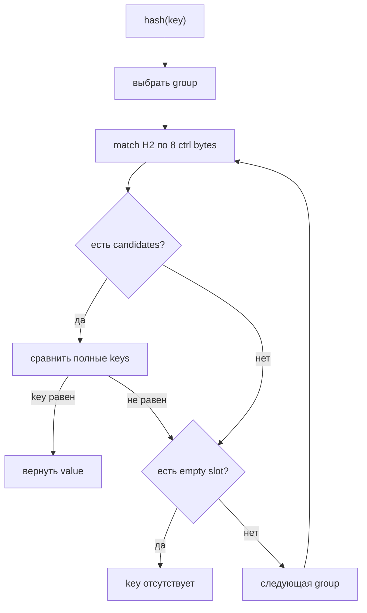

# Swiss Tables в Go 1.24+: актуальная map

## Содержание

- [Какую задачу решает hash table](#какую-задачу-решает-hash-table)
- [Ментальная модель](#ментальная-модель)
- [Словарь раздела](#словарь-раздела)
- [Group и control bytes](#group-и-control-bytes)
- [Как matchH2 проверяет восемь slots](#как-matchh2-проверяет-восемь-slots)
- [H1 и H2](#h1-и-h2)
- [Как вычисляются table и стартовая group](#как-вычисляются-table-и-стартовая-group)
- [Lookup пошагово](#lookup-пошагово)
- [Probe sequence: почему groups проверяются не подряд](#probe-sequence-почему-groups-проверяются-не-подряд)
- [Insert и update](#insert-и-update)
- [Delete и маркер удаления](#delete-и-маркер-удаления)
- [Small map, tables и directory](#small-map-tables-и-directory)
- [Рост](#рост)
- [Что происходит, если map растёт во время range](#что-происходит-если-map-растёт-во-время-range)
- [Concurrent access](#concurrent-access)
- [Чем Swiss Tables отличаются от прежней hmap](#чем-swiss-tables-отличаются-от-прежней-hmap)
- [Что видит Go-программист](#что-видит-go-программист)
- [Практические выводы](#практические-выводы)
- [Interview-ready answer](#interview-ready-answer)

Начиная с Go 1.24 встроенная `map` реализована через Swiss Table — хеш-таблицу с открытой адресацией (`open addressing`): пары «ключ/значение» лежат прямо в массиве ячеек, а при конфликте поиск переходит к следующему участку того же массива, а не по цепочке указателей.

Главная оптимизация: массив разбит на участки по восемь ячеек, и рядом с каждым участком лежат восемь однобайтовых меток. Runtime сначала сравнивает эти дешёвые метки, получает несколько кандидатов и только потом читает и сравнивает полные ключи.

Числовые константы и структуры ниже соответствуют реализации Go 1.26. Общая модель действует начиная с Go 1.24, но конкретная раскладка памяти не является частью API и может меняться.

---

## Какую задачу решает hash table

Нужна структура «ключ → значение», у которой время поиска не растёт вместе с числом записей. Перебор среза даёт `O(n)`, отсортированный массив — `O(log n)` и дорогую вставку в середину.

Хеш-таблица переводит ключ в число:

```text
hash("user:42", seed) = 0xA3F7_2B19_C4D5_E6F9
```

Часть bits этого числа работает как адрес: она сразу указывает, в каком месте массива искать. Поэтому поиск не просматривает остальные записи.

Плата за этот трюк и порождает всю дальнейшую механику:

| Проблема | Откуда берётся | Как решается в Swiss Table |
| --- | --- | --- |
| Два разных ключа дают один адрес | Hash сжимает произвольный ключ до нескольких bits | Проверяется несколько участков подряд, а равенство подтверждает полное сравнение ключей |
| Сравнивать полные ключи дорого | Ключом может быть длинная строка или большая структура | Рядом с ячейкой лежит однобайтовая метка-отпечаток hash |
| Записей становится больше, чем места | Массив выделен заранее | Таблица перестраивается в больший массив, ключи раскладываются заново |
| Удалённая ячейка рвёт цепочку поиска | Поиск останавливается на пустом месте | Вместо пустоты ставится специальный маркер удаления |

Ни на одном шаге hash не доказывает равенство ключей. Он только быстро сокращает число кандидатов, а решение всегда принимает сравнение самих ключей.

---

## Ментальная модель

Модель — парковка, разбитая на блоки по восемь мест:

- `hash(key)` подсказывает первый блок;
- короткий отпечаток `H2` записан на табличке каждого занятого места;
- runtime сравнивает восемь табличек одновременно;
- только совпавшие отпечатки требуют сравнения полного ключа;
- если блок не помог, probe sequence выбирает следующий.

```text
group
┌──────────────────────────────────────────────┐
│ ctrl: │ 12 │ empty │ 4A │ deleted │ ...     │
├──────────────────────────────────────────────┤
│ slot: │ K/V│   —   │ K/V│    —    │ ...     │
└──────────────────────────────────────────────┘
            8 control bytes + 8 key/value slots
```

Это всё ещё обычная hash table: средний lookup близок к `O(1)`, но коллизии, заполненность и стоимость вычисления hash и сравнения ключей влияют на реальное время.

---

## Словарь раздела

Дальше эти слова встречаются постоянно, поэтому их роли зафиксированы сразу. Похожие термины намеренно поставлены рядом — их чаще всего путают:

| Термин | Что это | Чем отличается от соседнего |
| --- | --- | --- |
| `slot` (ячейка) | Место ровно под одну пару «ключ/значение» | Наименьшая единица; собственных метаданных не хранит |
| `control byte` (метка) | Один байт состояния для одного slot | Лежит не внутри slot, а в общем блоке метаданных своей group |
| `group` (участок) | Восемь соседних slots и их восемь control bytes | Размер зафиксирован навсегда: group не растёт |
| `table` (таблица) | Массив groups с собственным probing и запасом на рост | Растёт и делится; groups внутри неё — нет |
| `directory` (каталог) | Массив указателей на tables | Появляется у больших map; выбирает table, а не slot |
| `H1` | Часть hash, выбирающая стартовую group | Отвечает на вопрос «где искать» |
| `H2` | Семь младших bits hash, лежащие в control byte | Отвечает на вопрос «что похоже»; номер slot не задаёт |

Главное различие, на котором спотыкаются чаще всего: **group имеет фиксированный размер, а table растёт**. Фраза «groups удваиваются» всегда означает «удваивается количество groups внутри одной table», а не «каждая group стала больше».

---

## Group и control bytes

Текущая реализация группирует по восемь slots. Каждому slot соответствует control byte:

| Состояние | Что означает |
| --- | --- |
| full + `H2` | slot занят; младшие 7 bits содержат fingerprint hash |
| empty | на этом месте probe chain может завершиться; lookup останавливается |
| deleted | slot освобождён, но lookup должен продолжить probing |

Control word позволяет проверить metadata всех восьми slots вместе. На некоторых architectures compiler/runtime использует optimized bit operations или intrinsic. Важно не название инструкции, а результат: full key equality вызывается только для небольшого bitset кандидатов.

### Раскладка group в памяти

В отличие от legacy `bmap`, Swiss Tables размещает key и value рядом внутри каждого slot:

```text
group for map[string]int

┌───────────────────────────────────────────┐
│ ctrl[0] ... ctrl[7]              8 bytes │
├───────────────────────────────────────────┤
│ slot 0: string key | int value            │
│ slot 1: string key | int value            │
│ ...                                       │
│ slot 7: string key | int value            │
└───────────────────────────────────────────┘
```

| Layout | Trade-off |
| --- | --- |
| `hmap`: восемь keys, затем восемь values | Меньше padding для некоторых пар типов |
| Swiss: `{key, value}` повторяется восемь раз | Key и его value ближе друг к другу в cache |

Для `map[uint8]uint64` interleaved layout может тратить padding на выравнивание `uint64`. Runtime осознанно принимает этот компромисс ради локальности обычного lookup.

<details>
<summary>Упрощённый layout из runtime source</summary>

```go
type group struct {
	ctrls [8]byte
	slots [8]slot
}

type slot struct {
	key  K
	elem V
}
```

В реальном runtime это type-specific layout через `unsafe` и compiler metadata, а не generic Go struct. Текущая encoding использует `0x80` для empty и `0xFE` для deleted; numeric constants являются implementation detail.

</details>

<details>
<summary>Как хранятся keys и values больше 128 bytes</summary>

Если размер key или value превышает `128` bytes, slot хранит pointer, а сами данные размещаются отдельно:

```text
обычный key: slot -> [ key bytes | value bytes ]
большой key: slot -> [ *key      | value bytes ]
                         |
                         +----> separate allocation
```

Runtime metadata отмечает такие случаи как `IndirectKey` и `IndirectElem`. Это не даёт одному большому типу раздуть каждую group, но добавляет allocation и dereference. Hashing и equality большого key также остаются пропорциональны количеству обрабатываемых данных.

Поэтому comparable struct на сотни bytes допустима как key, но компактный identifier или digest часто практичнее. Порог — implementation detail, а не ограничение языка.

</details>

---

## Как matchH2 проверяет восемь slots

Восемь control bytes хранятся как одно 64-bit control word. Portable алгоритм использует SWAR: одна арифметическая операция обрабатывает несколько bytes одного machine word.

Для поиска `H2=0x2A` идея выглядит так:

```text
ctrl word:       [2A][11][80][2A][FE][03][55][80]
H2 × 8:          [2A][2A][2A][2A][2A][2A][2A][2A]
XOR:             [00][3B][AA][00][D4][29][7F][AA]
zero-byte mask:    1   0   0   1   0   0   0   0
                    ^           ^
                 slots 0 и 3 — candidates
```

После этого runtime перебирает только установленные bits и вызывает equality для соответствующих keys. Совпадение H2 может оказаться false positive; корректность всегда подтверждает полное сравнение key.

<details>
<summary>Упрощённая SWAR-формула из runtime</summary>

```go
const (
	bitsetLSB = 0x0101010101010101
	bitsetMSB = 0x8080808080808080
)

func matchH2(ctrls uint64, h2 uint64) uint64 {
	v := ctrls ^ (bitsetLSB * h2)
	return (v - bitsetLSB) &^ v & bitsetMSB
}
```

Умножение размножает H2 по восьми bytes, XOR создаёт zero byte на совпадении, а последний expression оставляет старший bit совпавших bytes. Portable вариант может вернуть редкий лишний candidate из-за переноса между bytes, но последующее сравнение key отбрасывает его без потери корректности.

На amd64 эти операции заменяются compiler intrinsics с packed bitset. На других architectures portable SWAR всё равно избегает восьми независимых ветвлений.

</details>

---

## H1 и H2

Runtime вычисляет hash с random seed конкретной map и делит его логически:

```text
64-bit hash
┌───────────────────────────────┬─────────┐
│ H1: верхние 57 bits           │ H2: 7   │
└───────────────────────────────┴─────────┘
         placement/probing       fingerprint
```

- верхние bits полного hash выбирают directory entry и через неё table;
- `H1` выбирает стартовую group внутри этой table;
- `H2` хранится в control byte занятого slot;
- совпадение H2 даёт candidate, а не найденный key;
- разные keys иногда имеют одинаковый H2, поэтому полное сравнение обязательно.

Здесь легко решить, что hash делится на три непересекающихся поля. Это не так, и путаницу лучше снять сразу: **непересекающихся полей всего два** — `H2` (младшие семь bits) и `H1` (всё остальное). Выбор table берёт свои bits с верхнего края `H1`, а выбор group — с нижнего:

```text
64-bit hash
┌────┬──────────────────────────┬─────────┐
│ 10 │  ...                     │ 1111001 │
└────┴──────────────────────────┴─────────┘
  ^                          ^      ^
  │                          │      └─ H2: метка в control byte
  │                          └──────── младшие bits H1: номер group
  └─────────────────────────────────── верхние bits H1: номер записи directory

              └──────────── H1 = hash >> 7 ───────────┘
```

То есть верхние directory bits входят в `H1`, просто на противоположном его конце от тех bits, которые дают номер group. Пересечения не происходит, пока map не станет настолько большой, что directory и `groupMask` затребуют одни и те же bits.

Вероятность случайного совпадения семибитного H2 — примерно `1/128` для одного занятого slot при хорошем распределении hash.

---

## Как вычисляются table и стартовая group

Здесь работают два последовательных index:

```text
hash
  |
  | верхние globalDepth bits
  v
directory index -> table
                       |
                       | H1 & groupMask
                       v
                  стартовая group
```

### Шаг 1. Выбрать table

Есть три representation:

| Состояние map | Как выбирается storage |
| --- | --- |
| Small map, `dirLen == 0` | `dirPtr` указывает прямо на единственную group; table ещё нет |
| Одна table, `dirLen == 1` | Directory index всегда равен `0` |
| Несколько tables | Верхние `globalDepth` bits hash образуют directory index |

Для 64-bit hash и нескольких tables:

```text
globalShift   = 64 - globalDepth
directoryIdx  = hash >> globalShift
table         = directory[directoryIdx]
```

Например, при `globalDepth=2` используются два верхних bits, поэтому directory содержит четыре entries с indices `0..3`.

Важно: directory index — не обязательно уникальный «номер table». Несколько соседних directory entries могут указывать на один object `table`, если его `localDepth` меньше `globalDepth`.

### Шаг 2. Выбрать стартовую group внутри table

Каждая group содержит восемь slots. Поэтому:

```text
groupCount = table.capacity / 8
groupMask  = groupCount - 1
H1         = hash >> 7

startGroup = H1 & groupMask
```

Число groups является степенью двойки, поэтому `& groupMask` эквивалентен modulo `groupCount`, но вычисляется дешевле.

Это только **стартовая** group. Если key там не найден и empty slot отсутствует, quadratic probe sequence вычисляет номера следующих groups.

### Шаг 3. H2 фильтрует slots, но не выбирает один slot

```text
H2 = hash & 0x7F
```

Runtime сравнивает H2 с control bytes всех восьми slots выбранной group. Совпавшие slots становятся candidates для полного сравнения key. При insert свободный slot находится через `empty/deleted` metadata — формулы «номер slot = H2» нет.

### Полный числовой пример

Пусть runtime получает условный 64-bit hash:

```text
hash = 0xA3F7_2B19_C4D5_E6F9

globalDepth = 2
globalShift = 62

directoryIdx = hash >> 62
             = верхние bits 10₂
             = 2

directory[2] -> выбранная table

table.capacity = 32 slots
groupCount     = 32 / 8 = 4 groups
groupMask      = 4 - 1 = 3 = 0b11

H1         = hash >> 7
startGroup = H1 & 0b11
           = 1

H2 = hash & 0x7F
   = 0xF9 & 0x7F
   = 0x79
```

Итоговый путь:

```text
directory entry 2
    -> связанная с ней table
        -> начать с group 1
            -> найти slots с ctrl == 0x79
                -> сравнить полные keys candidates
```

Если group `1` не содержит key и в ней нет empty slot, для четырёх groups probe sequence проверяет:

```text
1 -> 2 -> 0 -> 3
```

Шаг растёт: `+1`, затем `+2`, затем `+3`. Поэтому третья проверяемая group — не `4`, которой не существует, а `0`:

```text
(1 + 1) & 3 = 2
(2 + 2) & 3 = 0     <- 4 не помещается в диапазон 0..3 и заворачивается в 0
(0 + 3) & 3 = 3
```

То есть `0` появляется не потому, что «после `3` идёт `0`», а потому, что маска `& 3` удерживает каждый вычисленный index в диапазоне `0..3`. Group `3` в этом обходе проверяется последней.

<details>
<summary>Пошаговый расчёт sequence через mask</summary>

Для четырёх groups `groupMask=3`, поэтому после каждого шага runtime оставляет только два младших bits:

```text
start:    offset = 1

step 1:  offset = (1 + 1) & 3
                  2       & 3 = 2

step 2:  offset = (2 + 2) & 3
                  4       & 3 = 0

                  binary:
                  100
                & 011
                -----
                  000

step 3:  offset = (0 + 3) & 3
                  3       & 3 = 3
```

Операция `& 3` здесь эквивалентна modulo `4`:

```text
4 % 4 = 0
```

То есть после последней group `3` indices зацикливаются обратно к `0`. Растущий шаг определяет порядок обхода, а mask удерживает каждый index в диапазоне `0..3`.

</details>

---

## Lookup пошагово

Для `value, ok := m[key]` mental model такой:

1. пустая/nil map сразу возвращает zero value и `ok=false`;
2. вычисляется `hash(key, seed)`;
3. верхние bits выбирают table, H1 — стартовую group;
4. metadata group сравниваются с H2;
5. для candidate slots выполняется полное `key == storedKey`;
6. key найден — возвращается value;
7. есть empty slot — key отсутствует;
8. empty нет — probe sequence переходит к следующей group.



<details>
<summary>Ручной lookup в одной group</summary>

Ищем key с `H2=0x2A`:

```text
slot:   0      1       2      3       4
ctrl:  11     2A      2A    deleted  empty
key:  "a"   "other" "target"
```

`matchH2` возвращает candidates 1 и 2. Runtime сравнивает:

```text
"other"  != "target"
"target" == "target"  -> найдено
```

Если оба comparisons не совпали, наличие `empty` в slot 4 завершило бы lookup. `deleted` не завершает probe chain.

</details>

<details>
<summary>Lookup в упрощённом runtime-псевдокоде</summary>

```text
get(m, key):
    if m == nil or m.used == 0:
        return zeroValue, false

    if m.writing != 0:
        fatal("concurrent map read and map write")

    hash = hash(key, m.seed)

    if m.dirLen == 0:
        group = m.dirPtr                 // small-map path
        for slot in group.matchH2(H2(hash)):
            if group.key[slot] == key:
                return group.value[slot], true
        return zeroValue, false

    table = m.directory[hash >> m.globalShift]
    sequence = probeSeq(H1(hash), table.groupMask)

    loop:
        group = table.groups[sequence.offset]

        for slot in group.matchH2(H2(hash)):
            if group.key[slot] == key:
                return group.value[slot], true

        if group.matchEmpty() is not empty:
            return zeroValue, false

        sequence = sequence.next()
```

`deleted` — это маркер удаления: он не входит ни в `matchH2`, ни в `matchEmpty`, поэтому не даёт ни candidate, ни основания остановиться.

</details>

---

## Probe sequence: почему groups проверяются не подряд

Collision может привести несколько keys в одну стартовую group. Тогда runtime посещает другие groups по quadratic/triangular sequence.

Самый очевидный вариант — **linear probing**, то есть идти подряд:

```text
start = 0:  0 -> 1 -> 2 -> 3 -> 4 -> ...
```

Но он быстро создаёт длинные непрерывные clusters. Например, после серии collisions groups `0`, `1` и `2` оказываются полностью заполнены:

```text
group:      0       1       2       3       4
state:    [full]  [full]  [full]  [empty] [empty]
cluster:  └───────────────┘
```

Теперь key, у которого **собственная** стартовая group равна `1`, тоже вынужден пройти `1 -> 2 -> 3`. Он присоединяется к cluster и удлиняет его. Чем длиннее cluster, тем больше unrelated keys в него попадает и тем дороже становятся lookup/insert. Это называется **primary clustering**.

Quadratic probing меняет размер шага: сначала `+1`, затем `+2`, потом `+3` и так далее. Для восьми groups sequence от `0` выглядит так:

```text
linear:     0 -> 1 -> 2 -> 3 -> 4 -> 5 -> 6 -> 7
quadratic:  0 -> 1 -> 3 -> 6 -> 2 -> 7 -> 5 -> 4
```

Поиск не ползёт по одному непрерывному участку, а быстрее рассеивается по table. Это не устраняет collisions полностью: keys с одинаковой стартовой group проходят одинаковую sequence. Но neighbouring clusters меньше склонны сливаться в один длинный линейный cluster.

Упрощённо для стартовой group `g`:

```text
g
g + 1
g + 1 + 2
g + 1 + 2 + 3
...
```

Название **quadratic** появляется потому, что суммарное смещение после шага `i` равно triangular number:

```text
1 + 2 + ... + i = i * (i + 1) / 2
```

В формуле присутствует `i²`, поэтому probing называют quadratic; `triangular` описывает ту же последовательность через triangular numbers.

Indices берутся modulo количества groups. При power-of-two размере такая sequence обходит все groups ровно по одному разу. Последовательность остаётся детерминированной: lookup повторяет тот же путь, по которому insert ищет место для key.

Runtime хранит текущий offset и номер шага:

```go
type probeSeq struct {
	mask   uint64
	offset uint64
	index  uint64
}

func (s probeSeq) next() probeSeq {
	s.index++
	s.offset = (s.offset + s.index) & s.mask
	return s
}
```

Если старт равен `3`, последовательность offsets до применения mask выглядит как:

```text
3
3 + 1 = 4
3 + 1 + 2 = 6
3 + 1 + 2 + 3 = 9
3 + 1 + 2 + 3 + 4 = 13
...
```

Здесь важны два инварианта:

- число groups является степенью двойки, поэтому `& mask` корректно замыкает indices;
- table не заполняется на 100%, поэтому probe sequence обязательно встречает group с empty slot и завершается.

Запоминать формулу для interview обычно не нужно. Достаточно объяснить три причины выбора:

1. растущие шаги уменьшают образование длинных непрерывных clusters;
2. sequence дёшево вычисляется и детерминирована;
3. при power-of-two числе groups она проверяет всю table, если раньше не встретит empty slot.

---

## Insert и update

`m[key] = value` использует почти тот же lookup:

1. найти existing key — тогда заменить value;
2. одновременно запомнить подходящий empty/deleted slot;
3. если свободного growth budget не осталось — попробовать очистить маркеры удаления или перестроить table;
4. записать key/value и H2 metadata;
5. увеличить `used`, только если key добавляется впервые.

Почему сначала ищут existing key: иначе повторная запись того же key могла бы создать duplicate entry.

`table.growthLeft` показывает, сколько новых empty slots ещё можно занять до обслуживания table. Он учитывает не только живые entries, но и маркеры удаления: deleted slot не завершает probing и поэтому продолжает расходовать полезную пустоту table.

В обычной table runtime держит среднюю загрузку не выше `7/8`, то есть 87.5%. Хотя отдельная group может заполниться полностью, в table остаются empty slots, гарантирующие завершение probe sequence.

<details>
<summary>Полный write path в упрощённом псевдокоде</summary>

```text
put(m, key, value):
    if m.writing != 0:
        fatal("concurrent map writes")

    hash = hash(key, m.seed)
    m.writing ^= 1

    if storage is not allocated:
        allocate one small group

    if m.dirLen == 0:
        search existing key in the single group
        if found:
            update value
            finish
        if group has room:
            write key/value and H2
            m.used++
            finish
        convert small map to table

again:
    table = m.directory[directoryIndex(hash)]
    sequence = probeSeq(H1(hash))
    firstDeleted = none

    loop:
        group = table.groups[sequence.offset]

        for candidate in group.matchH2(H2(hash)):
            if candidate.key == key:
                update candidate.value
                finish

        remember first deleted slot, if any

        if group contains empty:
            destination = firstDeleted or empty

            if destination is empty and table.growthLeft == 0:
                try pruneTombstones
                if budget appears:
                    goto again
                rehash table
                goto again                 // directory/table may change

            write key/value and H2 into destination
            table.used++
            m.used++
            consume growthLeft only for a real empty slot
            finish

        sequence = sequence.next()

finish:
    verify m.writing is still set
    m.writing ^= 1
```

Runtime method `PutSlot` фактически возвращает compiler pointer на место для value, а присваивание завершает compiler-generated code. Псевдокод объединяет эти части, чтобы показать алгоритм, а не точную границу runtime call.

</details>

Capacity hint в `make(map[K]V, hint)` — hint, а не limit. Runtime может округлить allocation и всё равно позже вырастить map.

---

## Delete и маркер удаления

Почему нельзя всегда заменить удалённый slot на empty:

```text
start group A          next group B
┌──────────────┐       ┌──────────────┐
│ key X ...    │ probe │ key Y ...    │
└──────────────┘ ----> └──────────────┘
```

Предположим, Y из-за collision попадает в B. Если delete X создаёт empty, lookup Y останавливается в A и ошибочно решает, что Y отсутствует.

Поэтому runtime выбирает:

- `empty`, если probe chain уже может безопасно закончиться в этой group;
- `deleted` — маркер удаления, если последующие entries должны остаться достижимыми.

Маркер удаления, или **tombstone** в англоязычной документации, означает: «slot уже свободен для новой вставки, но lookup пока не имеет права здесь остановиться». Он исчезает при reuse, best-effort pruning или rebuild table.

### Жизненный цикл маркера удаления

```text
full(H2)
   |
   | delete из полностью занятой group
   v
deleted
   |
   +-- новая вставка переиспользует slot --> full(new H2)
   |
   +-- prune/rebuild --------------------> empty
```

В Go 1.26 при исчерпании `growthLeft` runtime сначала вызывает `pruneTombstones`. Он выполняет эту работу только когда маркеров удаления достаточно много, и очищает те из них, которые больше не нужны для достижимости probe chains. Entries при этом не перемещаются — это важно для iterator semantics.

Если pruning не освобождает достаточный budget, table растёт или split. При полном rebuild копируются только живые entries, поэтому все оставшиеся маркеры удаления пропадают.

<details>
<summary>Мини-эксперимент с поведением delete</summary>

Внешне маркер удаления не виден:

```go
m := map[string]int{
	"first":  1,
	"second": 2,
}

delete(m, "first")

value, ok := m["second"]
fmt.Println(value, ok) // 2 true
```

Нельзя написать стабильный test, который заставит конкретные strings попасть в нужную probe chain: hash seed random и layout не является API. Маркер удаления объясняет внутреннюю корректность, но не виден через API.

</details>

---

## Small map, tables и directory

Go добавляет уровни постепенно:

```text
очень маленькая map
    -> одна group без directory

map выросла
    -> одна Swiss table из нескольких groups

большая map
    -> directory -> несколько независимых tables
```

Полная иерархия выглядит так:

```text
Map
├── used, seed
├── globalDepth/globalShift
└── directory[] ─┬─> table
                 ├─> table
                 └─> table
                       └── groups[]
                             ├── ctrl word: 8 bytes
                             └── 8 slots: {key, value}
```

`Map.used` считает entries всей map, а `table.used` — только конкретной table. Каждая table является самостоятельной Swiss Table со своим массивом groups, probe sequences и growth budget.

<details>
<summary>Упрощённые структуры Map и table</summary>

```go
type Map struct {
	used uint64
	seed uintptr

	dirPtr unsafe.Pointer
	dirLen int

	globalDepth uint8
	globalShift uint8

	writing           uint8
	tombstonePossible bool
	clearSeq          uint64
}

type table struct {
	used       uint16
	capacity   uint16
	growthLeft uint16

	localDepth uint8
	index      int
	groups     groupsReference
}
```

| Поле | Роль |
| --- | --- |
| `Map.used` | Общий `len(m)`; compiler ожидает это поле первым |
| `seed` | Индивидуальный random seed для hashing этой map |
| `dirPtr`, `dirLen` | Directory либо pointer прямо на small group |
| `globalDepth` | Число верхних hash bits для directory index |
| `globalShift` | Сдвиг, превращающий верхние bits в index |
| `writing` | Дешёвая runtime-диагностика concurrent access |
| `tombstonePossible` | Позволяет не искать маркеры удаления, когда их точно нет |
| `clearSeq` | Помогает iterator заметить `clear` |
| `table.growthLeft` | Budget новых empty slots до prune/rehash |
| `table.localDepth` | Сколько directory prefix bits различает эту table |

Это упрощённая модель Go 1.26, а не структуры для использования через `unsafe`.

</details>

### Small-map optimization

Пока map помещается в восемь entries, `dirLen == 0`, а `dirPtr` указывает прямо на одну group. Не нужны отдельные allocation для table и directory, нет probing между groups и нет маркеров удаления: после delete slot сразу становится empty.

Когда заполненная small map получает следующую запись, runtime преобразует representation в полноценную table. В Go 1.26 этот переход происходит до проверки, обновляет ли запись существующий key; в source отмечен TODO избегать grow для такого update. Это наглядный пример детали, которую нельзя превращать в application contract.

Для пустой map storage может выделяться лениво при первой записи. Поэтому `make(map[K]V)` не означает обязательную немедленную allocation всей таблицы.

Directory индексируется верхними bits hash. Несколько directory entries могут указывать на одну table. Это вариант extendible hashing: переполненная table может split, не перестраивая все остальные tables большой map.

### Global depth и local depth

`globalDepth` задаёт размер directory: `dirLen = 1 << globalDepth`. Но tables не обязаны иметь одинаковый `localDepth`, поэтому несколько соседних directory entries могут ссылаться на одну и ту же table:

```text
directory, globalDepth = 2

00 ─┐
    ├──> table A, localDepth = 1
01 ─┘

10 ────> table B, localDepth = 2
11 ────> table C, localDepth = 2
```

Table A обслуживает сразу два prefixes, потому что для неё достаточно одного значимого directory bit. Если split затрагивает table с `localDepth < globalDepth`, directory уже достаточно велик. Если `localDepth == globalDepth`, сначала требуется удвоить directory.

<details>
<summary>Как выглядит directory split</summary>

```text
before:
directory 00 ----> table A
directory 01 ----> table A

table A переполнена и split:
directory 00 ----> table A0
directory 01 ----> table A1
```

Если directory bits ещё недостаточно, directory удваивается, а pointers перераспределяются. В текущей implementation отдельная table растёт до ограниченного размера, после чего split создаёт две tables. Эти thresholds — runtime details, а не язык.

</details>

---

## Рост

Слово «рост» здесь объединяет несколько разных переходов. Полный lifecycle обычной map выглядит так:

```text
empty map
    |
    | первая вставка
    v
small map: одна group, до 8 entries
    |
    | small group больше не помещает новую entry
    v
одна table: 16 slots
    |
    | table исчерпывает growth budget
    v
double: 32 -> 64 -> 128 -> 256 -> 512 -> 1024 slots
    |
    | table на 1024 slots снова исчерпывает budget
    v
split: одна table -> две tables
    |
    | нужной table становится тесно
    v
растёт/split только эта table; при необходимости удваивается directory
```

`make(map[K]V, hint)` может сразу выделить более крупную структуру и пропустить ранние ступени. Схема показывает постепенный рост map без большого capacity hint.

Здесь `table.capacity` всегда измеряется в **slots**, а одна group содержит восемь slots:

```text
table capacity = 16 slots =   2 groups × 8 slots
table capacity = 32 slots =   4 groups × 8 slots
table capacity = 1024 slots = 128 groups × 8 slots
```

Один slot хранит одну пару `key/value`, а соответствующий ему control byte находится в metadata этой group. Поэтому фраза «table на 16 slots» означает «table из двух groups».

### Когда runtime вообще решает расти

Update существующего key не увеличивает `used` и сам по себе не требует новой capacity. Для новой entry table учитывает `growthLeft` — сколько настоящих empty slots ещё можно занять, не нарушая допустимую загрузку.

Для обычной table максимальная средняя загрузка равна `7/8`:

```text
capacity = 16 slots
max live entries + markers = 16 * 7 / 8 = 14

capacity = 32 slots
max live entries + markers = 32 * 7 / 8 = 28
```

Маркеры удаления тоже расходуют budget, потому что lookup не может остановиться на `deleted`. Но новая вставка может переиспользовать такой slot без дополнительного расхода `growthLeft`.

Когда insert доходит до настоящего empty slot при `growthLeft == 0`, Go 1.26 действует так:

```text
growthLeft == 0
    |
    v
попробовать pruneTombstones
    |
    +-- удалось освободить достаточно markers -> повторить insert
    |
    +-- не удалось --------------------------> rehash table
```

То есть заполненный budget не всегда означает увеличение памяти: сначала runtime пытается вернуть место, занятое ненужными маркерами удаления.

### Переход 1. Small map превращается в table

Small map хранит до восьми entries прямо в одной group без table и directory:

```text
Map.dirPtr -> group[8 slots]
Map.dirLen = 0
```

Когда заполненная small map получает следующую запись, runtime создаёт table на `16` slots, пересчитывает hash восьми существующих keys и вставляет их заново:

```text
before:
Map -> one group, 8 slots

after:
Map -> directory[0] -> table, 16 slots = 2 groups

dirLen      = 1
globalDepth = 0
localDepth  = 0
```

Directory уже существует, но содержит одну entry, поэтому table всегда выбирается через index `0`.

### Переход 2. Одна table удваивает capacity

Пока удвоенная capacity не превышает `1024` slots, runtime заменяет table одной table вдвое больше:

```text
old table, 16 slots
    |
    | allocate + rehash live entries
    v
new table, 32 slots
```

Здесь важно не перепутать уровни:

| Уровень | Может ли расти независимо? | Что происходит |
| --- | --- | --- |
| Отдельная group | **Нет** | Её размер фиксирован: всегда 8 slots |
| Число groups внутри одной table | Растёт только целиком вместе с table | `2 groups → 4 groups`, все живые entries этой table проходят rehash |
| Отдельная table внутри большой map | **Да, независимо от других tables** | Растёт или split только выбранная table; соседние tables не меняются |

Поэтому фразу «groups удваиваются» нужно читать как **«удваивается количество groups в конкретной table»**, а не «каждая group самостоятельно становится больше».

```text
не так:
group[8 slots] -> group[16 slots]

а так:
table[2 groups × 8 slots] -> table[4 groups × 8 slots]
```

Это не расширение старого slice «на месте». Runtime:

1. выделяет новый массив groups;
2. проходит все full slots старой table;
3. заново вычисляет hash key;
4. строит probe sequence уже с новым `groupMask`;
5. вставляет key/value в новую position;
6. пропускает empty/deleted slots;
7. заменяет directory pointers со старой table на новую.

`localDepth` и число directory entries при таком double не меняются: меняется только число groups внутри table.

```text
capacity:    16 -> 32 -> 64 -> 128 -> 256 -> 512 -> 1024
groupCount:   2 ->  4 ->  8 ->  16 ->  32 ->  64 ->  128
```

Почему нужен полный rehash: стартовая group зависит от `groupMask`. Например, при переходе с четырёх groups на восемь:

```text
old startGroup = H1 & 0b011
new startGroup = H1 & 0b111
```

Дополнительный bit меняет position части keys, поэтому простого копирования group `i` в group `i` недостаточно.

### Переход 3. Предельная table делится на две

В Go 1.26 одна table содержит максимум `1024` slots. Когда ей снова не хватает budget, runtime не создаёт table на `2048` slots, а выполняет split:

```text
old table, localDepth = d, 1024 slots
                |
                | проверить следующий верхний hash bit
                v
       ┌───────────────────┐
       |                   |
       v                   v
left table             right table
localDepth = d+1       localDepth = d+1
1024 slots             1024 slots
```

Обе новые tables получают capacity `1024`, но живые entries старой table распределяются между ними. При хорошем hash каждая получает примерно половину entries и большой новый growth budget.

Split использует очередной bit **с верхней стороны hash**, потому что directory также индексируется верхними bits:

```text
prefix ...0 -> left table
prefix ...1 -> right table
```

После redistribution старая table больше не используется для новых operations, а нужные directory entries переключаются на `left` и `right`.

### Когда удваивается directory

Split table и grow directory — не одно и то же.

Правило:

```text
localDepth < globalDepth
    -> directory уже содержит достаточно prefix bits
    -> split table без роста directory

localDepth == globalDepth
    -> нового prefix bit в directory ещё нет
    -> сначала удвоить directory
    -> затем подключить left/right tables
```

Числовой пример. Сначала есть две предельные tables:

```text
globalDepth = 1

0 -> table A, localDepth = 1
1 -> table B, localDepth = 1
```

Table B требует split. Поскольку `B.localDepth == globalDepth`, directory удваивается:

```text
globalDepth = 2

00 -> table A, localDepth = 1
01 -> table A, localDepth = 1
10 -> table B-left,  localDepth = 2
11 -> table B-right, localDepth = 2
```

Table A не split и не rehash. Две entries `00` и `01` продолжают указывать на один object A.

Если позже split требуется table A, её `localDepth=1`, а `globalDepth=2`. Directory уже умеет различать `00` и `01`, поэтому удваивать его не нужно:

```text
00 -> table A-left,  localDepth = 2
01 -> table A-right, localDepth = 2
10 -> table B-left,  localDepth = 2
11 -> table B-right, localDepth = 2
```

Именно поэтому большая map может расти локально: изменение одной части hash space не заставляет перестраивать остальные tables.

<details>
<summary>Что именно копируется при double и split</summary>

Runtime проходит groups старой table и обрабатывает только slots с full control byte:

```text
for each group in oldTable:
    for each slot in group:
        if ctrl is empty or deleted:
            continue

        hash = Hasher(key, map.seed)

        if double:
            insert into one larger replacement table

        if split:
            if nextDirectoryBit(hash) == 0:
                insert into left
            else:
                insert into right
```

Hash приходится вычислять снова: table не хранит полный hash, а control byte содержит только семибитный H2. Маркеры удаления не переносятся, поэтому replacement tables начинают без них.

Для indirect keys/values runtime может перенести pointers на уже выделенные objects вместо повторного копирования самих больших значений.

</details>

### Цена grow

Grow отдельной table завершается внутри operation, которая его запускает. Поэтому эта operation может получить latency порядка `O(number of slots in table)`:

```text
обычный insert             -> ожидаемый O(1)
insert, запустивший grow   -> rebuild одной table
```

Runtime ограничивает table `1024` slots, поэтому один rebuild не охватывает всю многомиллионную map. Но map не обещает constant worst-case latency.

Во время rebuild одновременно живут старая и replacement table/tables, поэтому возникает временный memory peak. Если active iterator держит ссылку на старую table, её освобождение откладывается до завершения iteration и последующего GC.

`delete` и `clear` не выполняют обратный split/merge и не уменьшают directory автоматически. Если map проходит большой peak и затем надолго уменьшается, для возврата backing storage обычно создают новую map и перекладывают нужные entries.

Порог `1024`, load `7/8` и конкретная pruning logic — параметры Go 1.26, а не language contract.

<details>
<summary>Почему table нельзя растить постепенно</summary>

Probe sequence зависит от mask числа groups:

```text
start = H1 & groupMask
next  = (previous + step) & groupMask
```

После удвоения groups меняется `groupMask`, а вместе с ним — допустимое положение каждого key и весь путь поиска. Если переносить slots частями, lookup пришлось бы одновременно учитывать две probe structures и состояние каждого перенесённого участка.

Runtime выбирает другой уровень инкрементальности:

```text
legacy hmap:
one large bucket array
    -> по частям эвакуируются buckets

Swiss map:
directory of bounded tables
    -> одна table rebuild/split целиком
    -> остальные tables не меняются
```

Одна операция всё ещё может выполнить `O(size of table)` work, но размер отдельной table ограничен. Это уменьшает максимальный объём одного rebuild по сравнению с перестройкой всей большой map.

</details>

---

## Что происходит, если map растёт во время range

Grow может начаться прямо внутри обычного `range`, если loop добавляет entries в ту же map:

```go
for key := range m {
	if needMoreData(key) {
		// Серия таких inserts может запустить grow текущей table.
		m[nextKey(key)] = loadValue(key)
	}
}
```

Это допустимо, если всё происходит в одном goroutine. Несинхронизированное изменение map из другого goroutine остаётся data race и может завершить process с `concurrent map iteration and map write`.

### В чём проблема для iterator

До grow iterator физически обходит slots некоторой table:

```text
old table:
slot position:  0  1  2  3  4  5
key:            A  B  .  C  .  D
                         ^ iterator уже дошёл сюда
```

Grow выполняет rehash, поэтому те же keys получают другие positions:

```text
new table:
slot position:  0  1  2  3  4  5  6  7
key:            .  C  A  .  D  B  .  .
```

Если iterator посреди обхода просто переключается со старой table на новую и продолжает с position `3`, возникают ошибки:

- `A` может попасть в уже пройденную часть новой table и потеряться;
- `C` может оказаться в ещё не пройденной части и вернуться второй раз;
- numeric position до и после rehash не обозначает один и тот же участок hash space.

### Решение: старая table задаёт маршрут, новая map хранит истину

Runtime разделяет две задачи:

```text
старая table -> какие исходные keys ещё нужно рассмотреть
актуальная map -> существует ли key сейчас и какое у него value
```

Iterator продолжает идти по старой table даже после её замены. Для каждого найденного там key он делает lookup в актуальной map:

```text
key из старой table
    |
    +-- key всё ещё существует -> вернуть актуальный key/value
    |
    +-- key удалён ------------> пропустить
```

Из-за этого старая table используется как стабильный **маршрут обхода**, но не как snapshot данных.

### Что видит application

Правила `range` при изменении map:

| Изменение во время range | Что происходит |
| --- | --- |
| Удаляется entry, которую iterator ещё не достиг | Она не возвращается |
| Меняется value существующего key | Iterator возвращает актуальное value, если достигает key |
| Добавляется новая entry | Она может попасть в этот range, а может не попасть |
| Table grow/split | Само по себе не должно привести к повторной выдаче старой entry |

Поэтому этот loop не является snapshot iteration:

```go
for key, value := range m {
	// Нельзя считать, что здесь обходится точная копия m
	// на момент входа в range.
	_, _ = key, value
}
```

Если application нужен стабильный snapshot, keys/entries копируют отдельно под подходящей synchronization.

<details>
<summary>Что происходит при split table и росте directory</summary>

Если старая table split на `left` и `right`, iterator всё равно заканчивает обход old table:

```text
directory before:
1 -> old table

directory after split:
10 -> left
11 -> right

iterator route:
old table -> прежние keys обеих новых tables
```

После завершения old table iterator должен пропустить directory entries, которые указывают на её replacements: их старые keys уже рассмотрены через old table. Новые entries в `left/right` разрешено не возвращать.

Если directory удваивается, порядок prefix ranges сохраняется, а iterator корректирует directory index под новую глубину. Это позволяет не начинать directory с начала и не выдавать table повторно.

</details>

<details>
<summary>Почему NaN требует отдельной логики</summary>

Обычно iterator берёт key из старой table и ищет его в актуальной map. Для `NaN` это не работает:

```go
nan := math.NaN()
fmt.Println(nan == nan) // false
```

Такой key нельзя найти обычным lookup даже по его собственному значению. Но его также нельзя адресно update/delete тем же key; удалить его можно через `clear` всей map.

Runtime хранит `clearSeq`. Если после начала iteration `clear` не происходит и key не равен самому себе, iterator может вернуть key/value из старой table. Если `clear` происходит, старая entry уже не считается живой.

</details>

<details>
<summary>Как выбирается начальная position range</summary>

Iterator использует random offsets:

- `dirOffset` — с какой части directory начинать;
- `entryOffset` — с какой position внутри table начинать.

Рандомизируется точка входа, а не выполняется равномерный shuffle всех keys. Поэтому первый key из `range` нельзя использовать как честный random choice.

</details>

---

## Concurrent access

Builtin map по-прежнему не поддерживает несинхронизированный concurrent read/write. В `Map` хранится byte `writing`, который write path переключает через XOR:

```text
before write: verify writing == 0
start write:  writing ^= 1
... mutate map ...
finish:       verify writing != 0
              writing ^= 1
```

Toggle повышает вероятность обнаружить двух concurrent writers, но не создаёт synchronization и не гарантирует detection каждой race. Runtime error вроде `concurrent map read and map write` является fatal throw, а не recoverable panic.

Практическое правило остаётся прежним: общий builtin map защищают `Mutex/RWMutex`, передают одному owner goroutine либо выбирают `sync.Map` для подходящего access pattern. Гонки ищут через `go test -race`; подробные примеры находятся в [gotchas](./03-puzzles-and-gotchas.md).

---

## Чем Swiss Tables отличаются от прежней hmap

До Go 1.24 встроенная map устроена иначе: hash выбирает bucket из восьми slots, а ключи, которым в нём не хватило места, уходят в отдельный overflow bucket по указателю. Чтение длинной цепочки прыгает по указателям, хуже использует кэш процессора и проверяет метки slots по одной.

| Legacy hmap (до Go 1.24) | Swiss Tables (с Go 1.24) |
| --- | --- |
| Основной bucket и связанные overflow buckets | Непрерывный массив groups внутри table |
| При коллизии — переход по указателю | Открытая адресация и probing по индексам |
| `tophash` проверяется slot за slot | Восемь control bytes сравниваются как одно машинное слово |
| Рост постепенно эвакуирует общий массив buckets | Небольшая table перестраивается целиком; большая map делится на tables |

Главный выигрыш даёт не «более умный hash», а организация памяти и уменьшение числа дорогих полных сравнений ключей. Особенно это заметно, когда ключ — строка или большая структура: сначала runtime работает с компактными метками и только потом обращается к самому ключу.

Подробный разбор прежней реализации — в [исторической главе](./02-hmap-before-1.24.md). Для современного собеседования её достаточно знать на уровне этой таблицы.

---

## Что видит Go-программист

Переход на Swiss Tables не меняет language semantics:

```go
m := make(map[string]int)
m["x"] = 1

value := m["missing"]
value, ok := m["missing"]

delete(m, "x")
clear(m)

for key, value := range m {
	_, _ = key, value
}
```

Сохранились:

- zero value lookup для отсутствующего key;
- panic при записи в nil map;
- unspecified iteration order;
- comparable requirement для keys;
- non-addressable map elements;
- отсутствие безопасного concurrent read/write без synchronization.

---

## Практические выводы

- Оптимизировать приложение по `ctrl` bytes бессмысленно: сначала измеряются стоимость hash и сравнения ключей, аллокации и общий профиль.
- Большой ключ-структуру или длинную строку дороже хэшировать и сравнивать; иногда полезен компактный стабильный идентификатор.
- Предварительный capacity hint уменьшает число ростов, если размер действительно известен.
- `delete` и `clear` не обещают уменьшить выделенную память; для её возврата map заменяют и измеряют эффект.
- Порядок `range` нельзя использовать как случайную перестановку — распределение не является гарантией случайности.
- Встроенное обнаружение одновременного доступа не заменяет `Mutex` и race detector.

---

## Interview-ready answer

**1. Как устроен lookup в современной Go map?**

- Runtime считает seeded hash, выбирает table и стартовую group. H2 fingerprint сравнивается с control bytes восьми slots, затем полные keys проверяются только у candidates. Empty завершает lookup, иначе probing продолжается.

**2. Зачем делить hash на H1 и H2?**

- H1 определяет placement/probe sequence, а семибитный H2 хранится рядом со slot как дешёвый fingerprint. H2 сокращает число дорогих key comparisons, но не заменяет equality.

**3. Как вычисляются table и стартовая group?**

- Для нескольких tables верхние `globalDepth` bits дают `directoryIdx = hash >> globalShift`, а `directory[directoryIdx]` хранит pointer на table. Внутри неё `groupMask = capacity/8 - 1`, поэтому `startGroup = (hash >> 7) & groupMask`. H2 не задаёт номер slot — он фильтрует candidates внутри group.

**4. Как `matchH2` проверяет восемь slots сразу?**

- Восемь control bytes образуют одно 64-bit word. SWAR или amd64 intrinsic сравнивает их с размноженным H2 и возвращает bitset candidates; runtime полностью сравнивает только их keys.

**5. Почему используется квадратичное зондирование (`quadratic probing`)?**

- Linear probing идёт по соседним groups и создаёт длинные непрерывные clusters: новые keys, стартующие внутри такого участка, дополнительно его удлиняют. Шаги `+1, +2, +3...` быстрее рассеивают поиск по table, но остаются дешёвыми и детерминированными. При power-of-two числе groups sequence обходит их все; название quadratic связано с суммарным offset `i*(i+1)/2`.

**6. Зачем нужен маркер удаления?**

- Настоящий empty завершает lookup. Если удалить slot посреди probe chain и поставить empty, keys дальше станут недостижимы. Маркер удаления разрешает reuse slot, но заставляет lookup продолжить probing.

**7. Что происходит с накопившимися маркерами удаления?**

- Новые inserts сначала переиспользуют deleted slots. В Go 1.26 runtime также пытается выполнить best-effort pruning; оставшиеся маркеры исчезают при rebuild table.

**8. Зачем нужны small-map optimization и directory?**

- До восьми entries map использует одну group без table/directory. Большая map хранит bounded independent tables, а directory выбирает table по верхним hash bits и позволяет split только перегруженную часть.

**9. Как растёт map?**

- Для новой entry runtime сначала учитывает `growthLeft`, reuse и pruning маркеров удаления. Small map превращается в table на 16 slots; затем целиком удваивается число groups конкретной table, но другие tables не меняются. На `1024` slots предельная table split на две независимые tables.

**10. Когда растёт directory?**

- Не при каждом grow table. Если `localDepth < globalDepth`, directory уже содержит нужный prefix bit и только переключает entries на left/right. Если depths равны, directory сначала удваивается, после чего split tables подключаются по новому верхнему hash bit.

**11. Зачем iterator продолжает обходить старую table после grow?**

- После rehash positions keys меняются, поэтому переключение на новую table посреди range приводит к пропускам или повторам. Старая table задаёт стабильный маршрут исходных keys, а lookup в актуальной map проверяет delete и получает текущее value. Это не snapshot: новые entries могут попасть в range, а могут не попасть.

**12. Что изменилось относительно hmap?**

- Overflow chaining заменён open addressing по groups; `tophash` buckets — control bytes; incremental evacuation всего массива — rebuild/split отдельных tables. API и семантика языка не изменились.

---

## Официальные источники

- [Faster Go maps with Swiss Tables](https://go.dev/blog/swisstable)
- [Go 1.24 release notes](https://go.dev/doc/go1.24)
- [Go specification: range over maps](https://go.dev/ref/spec#For_statements)
- [Runtime maps overview](https://go.dev/src/internal/runtime/maps/map.go)
- [Runtime table implementation](https://go.dev/src/internal/runtime/maps/table.go)
- [Runtime group/control implementation](https://go.dev/src/internal/runtime/maps/group.go)
