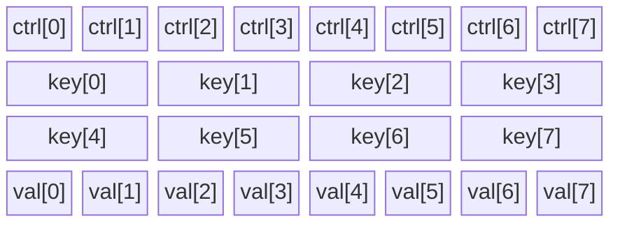
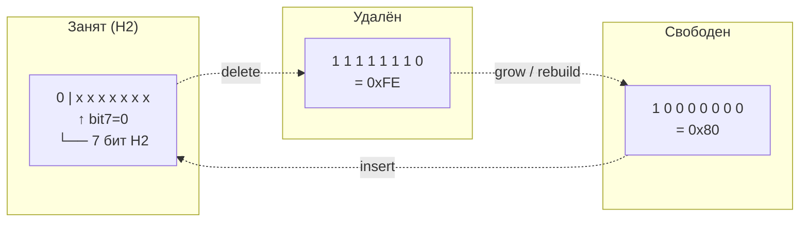
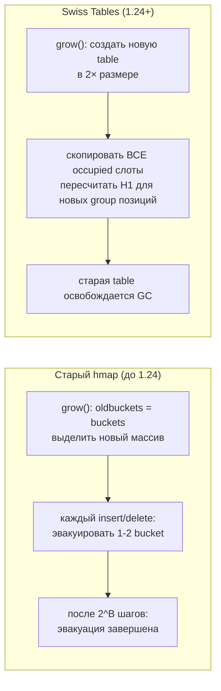
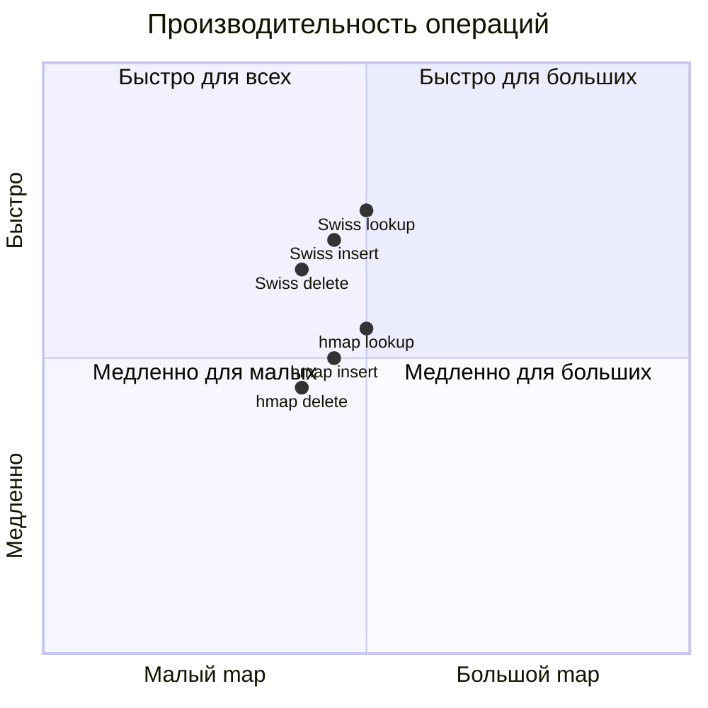

# Map internals начиная с Go 1.24: Swiss Tables

Go 1.24 (февраль 2025) заменил внутреннюю реализацию map на алгоритм **Swiss Tables** — open addressing с metadata-байтами для быстрого поиска. Для пользователя API не изменился, но производительность улучшилась.

## Содержание

- [Почему заменили hmap](#почему-заменили-hmap)
- [Swiss Tables: идея](#swiss-tables-идея)
- [Структура group](#структура-group)
- [ctrl-байт: три состояния](#ctrl-байт-три-состояния)
- [Lookup: пошагово](#lookup-пошагово)
- [matchH2: ключевая операция](#matchh2-ключевая-операция)
- [Insert и Delete](#insert-и-delete)
- [Рост: batch copy вместо инкрементальной эвакуации](#рост-batch-copy-вместо-инкрементальной-эвакуации)
- [Directory: шардирование для больших map](#directory-шардирование-для-больших-map)
- [Сравнение: hmap vs Swiss Tables](#сравнение-hmap-vs-swiss-tables)
- [Что не изменилось](#что-не-изменилось)
- [Interview-ready answer](#interview-ready-answer)

---

## Почему заменили hmap

Проблемы старой реализации:

| Проблема | Следствие |
|---|---|
| Overflow bucket chains | pointer chasing → cache miss |
| Инкрементальная эвакуация | сложность кода, latency spikes |
| tophash = 8 бит | 1 из 256 шанс ложного совпадения |
| Проверка по одному слоту | 8 итераций на bucket |
| Load factor 6.5/8 ≈ 81% | много overhead |

Swiss Tables (оригинал — Google Abseil C++ 2017, переосмыслен для Go) решают большинство проблем за счёт:
- Open addressing: нет pointer chasing
- Metadata bytes per slot: проверка сразу 8 слотов одной операцией
- Лучшая cache locality

---

## Swiss Tables: идея

Вместо bucket-цепочек — **линейное зондирование** по группам:

```
Старый подход (chaining):
bucket → [8 slots] → overflow → [8 slots] → overflow → ...

Новый подход (open addressing, group probing):
group0  group1  group2  group3  ...
[8 sl.] [8 sl.] [8 sl.] [8 sl.]
  ↑                 ↑
  здесь нет         пробуем сюда если group0 занята
```

При коллизии не создаётся новый bucket — ищется следующая группа в массиве. Это лучше для CPU cache: всё в непрерывной памяти.

---

## Структура group

Один group = 8 слотов. Структура в памяти:

```
group (map[string]int, 8 слотов):

 Offset   Content
─────────────────────────────────────────────────────
    0     ctrl[0]  uint8   ← metadata для слота 0
    1     ctrl[1]  uint8   ← metadata для слота 1
    2     ctrl[2]  uint8
    3     ctrl[3]  uint8
    4     ctrl[4]  uint8
    5     ctrl[5]  uint8
    6     ctrl[6]  uint8
    7     ctrl[7]  uint8   ← всего 8 байт ctrl
─────────────────────────────────────────────────────
    8     key[0]   string  (16 bytes: ptr + len)
   24     key[1]   string
   ...
  120     key[7]   string  ← 8 × 16 = 128 bytes keys
─────────────────────────────────────────────────────
  128     val[0]   int     (8 bytes)
  136     val[1]   int
  ...
  184     val[7]   int     ← 8 × 8 = 64 bytes values
─────────────────────────────────────────────────────
Total: 8 + 128 + 64 = 200 bytes
```



---

## ctrl-байт: три состояния

Каждый `ctrl[i]` — один байт, описывает состояние слота:

```
0b10000000  (0x80) = ctrlEmpty   — слот свободен
0b11111110  (0xFE) = ctrlDeleted — слот удалён (tombstone)
0b0xxxxxxx         = H2          — слот занят, хранит H2 (нижние 7 бит хэша)
```



**Ключевое свойство:** у занятых слотов bit 7 = 0 (значение < 0x80), у свободных/удалённых — bit 7 = 1 (≥ 0x80). Это позволяет одной операцией отличить занятые от незанятых.

**Разделение хэша:**
```
full hash(key) = 64 bits

H1 = hash >> 7           ← для выбора group (номер группы)
H2 = hash & 0x7F         ← для ctrl байта (нижние 7 бит)
```

H2 хранится в ctrl и используется для быстрого отсева. Шанс ложного совпадения: 1/128 (у старого tophash был 1/256, но это компенсируется скоростью проверки).

---

## Lookup: пошагово

```go
v := m["hello"]
```

```mermaid
flowchart TD
    A([start: key = "hello"]) --> B["hash = hashfn(key, seed)"]
    B --> C["H1 = hash >> 7\nH2 = hash & 0x7F"]
    C --> D["group_idx = H1 % num_groups"]
    D --> E["load ctrl[0..7] для group_idx"]
    E --> F["matchH2: найти слоты где ctrl[i] == H2"]
    F --> G{есть совпадения?}
    G -->|да| H["для каждого совпавшего i:\nkey[i] == 'hello'?"]
    H -->|да| I([return val[i], true])
    H -->|нет| G
    G -->|нет совпадений| J{"matchEmpty:\nесть ли\nctrl[i] == 0x80?"}
    J -->|да, нашли пустой слот| K([return zero, false])
    J -->|нет, вся group занята/deleted| L["group_idx = (group_idx+1) % num_groups\nлинейное зондирование"]
    L --> E
```

Если в группе нет пустого слота (`ctrlEmpty`) — зондирование продолжается в следующую группу. При нормальном load factor (< 87.5%) это редкость.

---

## matchH2: ключевая операция

Проверка сразу 8 ctrl-байт без цикла — через битовые операции:

```go
// Проверить все 8 ctrl-байт группы на равенство h2
// Возвращает bitset: бит i установлен если ctrl[i] == h2
func (g *group) matchH2(h2 uint8) bitset {
    // Трюк: создать слово из 8 повторяющихся байт h2
    //   h2 = 0x2B → word = 0x2B2B2B2B2B2B2B2B
    // XOR с 8 ctrl байтами → 0 там, где совпадает
    // Затем найти нулевые байты через bit manipulation

    const lsbs = 0x0101010101010101
    const msbs = 0x8080808080808080

    word := g.ctrl()                           // 8 байт как uint64
    cmp  := word ^ (lsbs * uint64(h2))         // 0x00 где ctrl==h2
    return bitset((cmp - lsbs) & ^cmp & msbs)  // bitmask совпадений
}
```

Результат — `bitset` с установленными битами на позициях, где `ctrl[i] == h2`. Итерация по нему:

```go
for b := matchResult; b != 0; b = b.removeFirst() {
    i := b.first()  // индекс следующего совпадения
    if equalfn(key, group.key(i)) {
        return group.val(i)
    }
}
```

Это быстрее цикла `for i := 0; i < 8; i++` потому что нет branch per slot — всё одной арифметической операцией.

---

## Insert и Delete

### Insert

```
1. hash → H1, H2
2. group_idx = H1 % num_groups
3. matchH2 → ищем обновление (ключ уже есть?)
4. если нашли — update val на месте, return
5. matchEmptyOrDeleted → найти свободный слот в текущей или следующей group
6. ctrl[i] = H2, key[i] = k, val[i] = v
7. table.used++; table.growthLeft--
8. if growthLeft == 0 → grow()
```

### Delete

```go
delete(m, "hello")
```

```
1. Найти слот (как lookup)
2. Проверить соседей:
   - если следующий ctrl == ctrlEmpty:
       ctrl[i] = ctrlEmpty    (можно сразу очистить)
   - иначе:
       ctrl[i] = ctrlDeleted  (tombstone, нельзя прерывать probe chain)
3. table.used--
```

**Tombstone важен:** при delete нельзя просто поставить `ctrlEmpty`, если probe chain продолжается дальше. Иначе lookup не найдёт элементы, которые были вставлены через эту позицию.

Tombstones накапливаются → при росте очищаются (копируются только occupied слоты).

---

## Рост: batch copy вместо инкрементальной эвакуации

**Главное отличие от старого hmap:** рост в Swiss Tables — это **полная перестройка**, не инкрементальная.



**Почему это быстрее при амортизации:**
- Нет дополнительного кода "check oldbuckets" при каждом lookup
- Один большой alloc вместо постепенного
- После роста таблица полностью чистая (без tombstones)

**Почему это не хуже по latency:**
- Рост редок (load factor threshold = 87.5%)
- Для малых map (несколько элементов) копирование мгновенное
- Для больших map — паузы редки и GC в любом случае делает аналогичную работу

---

## Directory: шардирование для больших map

Для больших map Go 1.24 использует **directory** — массив указателей на `table`:

```
directory:
┌───┬───┬───┬───┐
│ * │ * │ * │ * │   ← 2^depth table pointers
└─┬─┴─┬─┴─┬─┴─┬┘
  ↓   ↓   ↓   ↓
 tab tab tab tab    ← отдельные hash tables (Swiss Tables)
```

- Малые map (≤ 8 элементов): одна group, без directory
- Средние map: одна table, несколько groups
- Большие map: directory с несколькими tables

При росте отдельной table только она перестраивается — остальные таблицы не трогаются. Это ограничивает пик памяти и время одного grow.

Выбор table: `H1 >> (64 - depth)` — старшие биты H1 (за вычетом бит для выбора group внутри table).

---

## Сравнение: hmap vs Swiss Tables



| Характеристика | hmap (до 1.24) | Swiss Tables (1.24+) |
|---|---|---|
| Collision resolution | chaining (overflow buckets) | open addressing (group probing) |
| Slots per unit | 8 (bucket) | 8 (group) |
| Metadata | tophash (8 бит, top hash) | ctrl (7 бит H2, нижние биты) |
| Ложные совпадения | 1/256 | 1/128 |
| Slot check | последовательный (по одному) | bitset (все 8 сразу) |
| Cache behavior | pointer chasing при overflow | непрерывная память |
| Load factor | 6.5/8 ≈ 81% | ~87.5% (7/8) |
| Рост | инкрементальная эвакуация | full batch copy |
| Lookup при росте | проверять оба массива | нет, рост завершён до возврата |
| Tombstones | нет | есть (ctrlDeleted) |
| Memory overhead | hmap + bmap structs + overflow | group array + directory |

---

## Что не изменилось

С точки зрения пользователя в Go 1.24 **ничего не изменилось**:

```go
// API тот же
m := make(map[string]int)
m["key"] = 1
v := m["key"]
v, ok := m["key"]
delete(m, "key")
for k, v := range m { ... }

// Поведение то же
// - порядок итерации случаен
// - nil map: read OK, write паника
// - concurrent access: паника/throw
// - нельзя брать &m["key"]
// - zero value map (var m map[K]V) nil
```

**Нет breaking changes.** Единственное что изменилось — внутренняя реализация и производительность.

**Benchmark Go 1.23 vs 1.24** (официальные данные из release notes):
- lookup: ~10-30% быстрее в зависимости от размера map и типа ключа
- insert: ~10-20% быстрее
- delete: ~10-20% быстрее
- Особенно заметно на map с string ключами (дорогое сравнение)

---

## Interview-ready answer

**"Что изменилось в map в Go 1.24?"**

Go 1.24 заменил реализацию map со структуры `hmap + bmap` (chaining через overflow buckets) на **Swiss Tables** — open addressing с metadata байтами.

Ключевые изменения:

1. **Нет overflow buckets** — при коллизии переходим в следующую группу в непрерывном массиве, не по указателю. Лучше cache locality.

2. **ctrl-байты** вместо tophash. Каждый ctrl — 7 бит H2 (нижние биты хэша) или специальное значение (empty/deleted). Это позволяет проверить сразу 8 слотов одной битовой операцией (`matchH2`) без цикла.

3. **Рост через полное копирование** — не инкрементальная эвакуация. После роста таблица полностью чистая. Lookup не нужно проверять oldbuckets.

4. **Directory** для больших map — шардирование на несколько независимых table, каждая растёт отдельно.

API не изменился. Производительность улучшилась на 10-30%. Порядок итерации по-прежнему случаен, concurrent write по-прежнему паникует.
