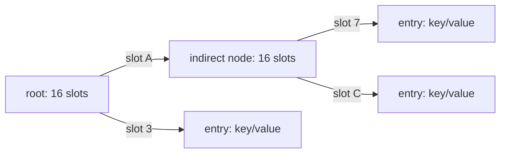

# `sync.Map`: когда использовать и как она устроена

`sync.Map` — потокобезопасная map из стандартной библиотеки Go. Она позволяет нескольким goroutines одновременно читать, добавлять, заменять и удалять значения без внешнего `Mutex`.

Но это не универсальная замена обычной `map`. У `sync.Map` нет статической типизации ключей и значений, `Len` и согласованного snapshot. Зато она предоставляет готовые атомарные операции над **одним ключом**: `LoadOrStore`, `Swap`, `CompareAndSwap`, `LoadAndDelete`.

Начиная с Go 1.24 внутри используется concurrent hash-trie. Объяснения через `read`, `dirty`, `misses` и promotion описывают реализацию Go 1.23 и ниже, поэтому эта модель вынесена в отдельный исторический раздел.

## Содержание

- [Зачем нужна sync.Map](#зачем-нужна-syncmap)
- [Когда выбирать sync.Map](#когда-выбирать-syncmap)
- [API: что делает каждая операция](#api-что-делает-каждая-операция)
- [Memory model и безопасная публикация](#memory-model-и-безопасная-публикация)
- [Как работает Range](#как-работает-range)
- [Ментальная модель hash-trie](#ментальная-модель-hash-trie)
- [Как hash выбирает путь](#как-hash-выбирает-путь)
- [Как выполняется Load](#как-выполняется-load)
- [Как выполняются Store и другие изменения](#как-выполняются-store-и-другие-изменения)
- [Как разрешаются коллизии](#как-разрешаются-коллизии)
- [Как работают Delete и Clear](#как-работают-delete-и-clear)
- [Историческая реализация read/dirty](#историческая-реализация-readdirty)
- [Практические patterns](#практические-patterns)
- [Как сравнивать с map и Mutex](#как-сравнивать-с-map-и-mutex)
- [Типичные ошибки](#типичные-ошибки)
- [Interview-ready answer](#interview-ready-answer)

## Зачем нужна sync.Map

Обычная Go map не поддерживает конкурентную запись и чтение. Такой код содержит data race и может завершиться panic:

```go
var users = map[string]int{}

go func() {
	users["alice"] = 1
}()

go func() {
	_ = users["alice"]
}()
```

Классическое решение — защищать map общим lock:

```go
type UserMap struct {
	mu    sync.RWMutex
	users map[string]int
}

func (m *UserMap) Load(name string) (int, bool) {
	m.mu.RLock()
	defer m.mu.RUnlock()

	value, ok := m.users[name]
	return value, ok
}

func (m *UserMap) Store(name string, value int) {
	m.mu.Lock()
	defer m.mu.Unlock()

	m.users[name] = value
}
```

Это хороший вариант по умолчанию:

- ключи и значения имеют compile-time types;
- под одним lock можно проверить или изменить несколько записей;
- легко добавить `Len`, snapshot и другие операции;
- поведение структуры очевидно из кода.

`sync.Map` полезна, когда внешний общий lock сам становится источником contention либо когда готовые атомарные операции точно совпадают с моделью задачи.

## Когда выбирать sync.Map

Официальная документация выделяет два основных сценария:

1. значение для ключа записывается один раз, затем много раз читается — например append-only cache или registry;
2. разные goroutines работают в основном с непересекающимися наборами ключей.

Практическая таблица выбора:

| Ситуация | Обычно выбрать | Почему |
| --- | --- | --- |
| Небольшая map, contention не измерен | `map + Mutex` | Проще API, меньше косвенности |
| Нужна строгая типизация | `map[K]V + Mutex` | Нет `any` и type assertions |
| Нужно атомарно поддерживать invariant нескольких ключей | `map + Mutex` | `sync.Map` атомарна только на уровне одной операции и одного ключа |
| Append-mostly registry/cache с большим числом readers | Измерить `sync.Map` | Lock-free read path хорошо подходит access pattern |
| Goroutines изменяют разные ключи | Измерить `sync.Map` или sharded map | Изменения могут блокировать разные ветви |
| Нужен `LoadOrStore`, `Swap` или CAS одного ключа | `sync.Map` | Операция уже атомарна и выражена одним method call |
| Нужен согласованный snapshot или точный `Len` | Другая структура под lock | `Range` не даёт snapshot, `Len` отсутствует |
| Один hot key постоянно перезаписывается | Отдельный `atomic`, lock или benchmark | Один ключ всё равно создаёт contention |

`RWMutex` также не является автоматическим ускорением по сравнению с `Mutex`: учёт readers имеет стоимость, а writer ждёт активных readers. Итоговый выбор подтверждается benchmark с реальным соотношением чтений и записей и реальным распределением ключей.

## API: что делает каждая операция

Нулевое значение `sync.Map` готово к использованию:

```go
var m sync.Map

m.Store("key", 1)
value, ok := m.Load("key")
```

После первого использования `sync.Map` нельзя копировать. Обычно её хранят как поле объекта и передают сам объект по pointer.

### Основные методы

| Method | Результат | Что атомарно |
| --- | --- | --- |
| `Load(key)` | Текущее значение и `ok` | Одно чтение ключа |
| `Store(key, value)` | Ничего | Установка значения ключа |
| `LoadOrStore(key, value)` | Existing/stored value и `loaded` | Прочитать существующее или сохранить переданное |
| `Swap(key, value)` | Предыдущее значение и `loaded` | Заменить и вернуть предыдущее |
| `CompareAndSwap(key, old, new)` | `swapped` | Заменить, только если текущее значение равно `old` |
| `LoadAndDelete(key)` | Удалённое значение и `loaded` | Прочитать и удалить |
| `CompareAndDelete(key, old)` | `deleted` | Удалить, только если значение равно `old` |
| `Delete(key)` | Ничего | Удалить ключ, если он существует |
| `Clear()` | Ничего | Сделать map пустой |
| `Range(f)` | Ничего | Обойти ключи без snapshot guarantee |

Для `Load`, `Store` и `Delete` документация заявляет амортизированную сложность `O(1)`. Это не означает одинаковую latency каждого вызова: коллизии, allocations, конкуренция за node lock и работа GC всё равно влияют на отдельные операции.

Пример различия между похожими методами:

```go
actual, loaded := m.LoadOrStore("worker-1", worker)
// loaded == true: actual уже находился в map.
// loaded == false: worker сохранён этим вызовом.

previous, loaded := m.Swap("worker-1", replacement)
// loaded == true: previous содержит заменённое значение.
// loaded == false: ключа не было, replacement просто добавлен.
```

Все methods принимают `any`. Поэтому публичный API не мешает случайно записать под одним ключом значения разных типов:

```go
m.Store("timeout", 5*time.Second)
m.Store("timeout", "five seconds")

timeout := value.(time.Duration) // panic, если прочитана string
```

### Ограничения key и value

Динамический тип ключа должен быть comparable, как и у обычной `map[any]any`. Slice, map и function нельзя использовать как ключ:

```go
m.Store([]int{1, 2, 3}, "value") // panic: hash of unhashable type []int
```

Значение само по себе может быть любого типа. Но `old`, переданный в `CompareAndSwap` или `CompareAndDelete`, должен иметь comparable dynamic type, потому что method сравнивает его с текущим значением.

```go
m.Store("ids", []int{1, 2, 3})

_ = m.CompareAndSwap("ids", []int{1, 2, 3}, []int{4, 5})
// panic: []int нельзя сравнивать через ==
```

### `nil` не означает отсутствие ключа

В `sync.Map` можно сохранить `nil`:

```go
m.Store("result", nil)

value, ok := m.Load("result")
fmt.Println(value, ok) // <nil> true
```

Поэтому отсутствие ключа определяют по `ok`, а не по `value == nil`.

## Memory model и безопасная публикация

Документация `sync.Map` формулирует гарантию через Go memory model: write operation **synchronizes before** read operation, которая наблюдает результат этой записи.

Простыми словами: объект можно полностью подготовить, сохранить в `sync.Map`, а другая goroutine, которая прочитает именно это значение, увидит завершённую инициализацию.

```go
type Config struct {
	Timeout time.Duration
	Hosts   []string
}

config := &Config{
	Timeout: 3 * time.Second,
	Hosts:   []string{"api-1", "api-2"},
}

m.Store("config", config)

value, _ := m.Load("config")
loaded := value.(*Config)
fmt.Println(loaded.Timeout, loaded.Hosts)
```

Гарантия относится к публикации ссылки и уже выполненной инициализации. Она **не превращает содержимое объекта в concurrent-safe структуру**.

```go
value, _ := m.Load("config")
config := value.(*Config)

// Если другая goroutine одновременно читает Hosts,
// эта запись создаёт data race.
config.Hosts = append(config.Hosts, "api-3")
```

Для дальнейших изменений объекта нужны собственный lock, atomics, copy-on-write или правило immutable-after-publication.

<details>
<summary>Какие методы считаются read и write operations</summary>

В терминах документации:

- read operations: `Load`, `LoadAndDelete`, `LoadOrStore`, `Swap`, `CompareAndSwap`, `CompareAndDelete`;
- write operations: `Delete`, `LoadAndDelete`, `Store`, `Swap`;
- `LoadOrStore` является write operation, когда возвращает `loaded == false`;
- `CompareAndSwap` является write operation, когда возвращает `swapped == true`;
- `CompareAndDelete` является write operation, когда возвращает `deleted == true`.

Некоторые методы одновременно читают старое состояние и записывают новое, поэтому находятся в обоих списках.

`Clear` не включён в этот перечень в public memory-model contract. Не стоит использовать его как неявный publication barrier для несвязанных данных.

</details>

### Атомарность ограничена одним вызовом

Два последовательных method calls не превращаются в транзакцию:

```go
if value, ok := m.Load("pending"); ok {
	m.Delete("pending")
	m.Store("running", value)
}
```

Между `Load`, `Delete` и `Store` может вмешаться другая goroutine. Если требуется invariant «value находится ровно в одном из двух ключей», нужен общий lock или другая state model.

## Как работает Range

```go
m.Range(func(key, value any) bool {
	fmt.Println(key, value)
	return true
})
```

`Range` последовательно вызывает callback, но при этом:

- не создаёт согласованный snapshot;
- не блокирует остальные methods на всё время обхода;
- посещает каждый key не более одного раза;
- для конкретного key может увидеть value из любого момента во время вызова `Range`;
- разрешает callback вызывать methods той же `sync.Map`;
- останавливается, когда callback возвращает `false`;
- по public contract может иметь стоимость `O(N)`, даже если callback быстро вернул `false`.

<details>
<summary>Почему Range нельзя использовать для согласованного отчёта</summary>

Пусть перед обходом map логически содержит:

```text
A = 10
B = 20
```

Во время `Range` другая goroutine выполняет:

```text
A = 11
delete(B)
C = 30
```

Обход может увидеть, например, `A = 10`, не увидеть `B` и увидеть `C = 30`. Такой набор не обязан совпадать с состоянием map в один конкретный момент времени.

Это нормально для best-effort метрик или очистки cache. Для billing report, consistent export или проверки invariant нужен snapshot под внешней синхронизацией либо другая структура.

</details>

## Ментальная модель hash-trie

С Go 1.24 публичная `sync.Map` делегирует операции internal concurrent hash-trie.

Trie здесь — дерево, путь в котором определяется не символами ключа, а частями его hash:

```text
hash(key):  [4 bits][4 bits][4 bits][4 bits] ...
                |       |       |
root ----------+       |       |
    child --------------+       |
         child -----------------+
              entry(key, value)
```

Каждый внутренний, или indirect, node содержит 16 child slots. Почему 16: четыре bits кодируют число от `0` до `15`.

Slot — это одна позиция в массиве `children[16]`. В ней находится atomic pointer на:

- `nil`, если ветвь пустая;
- `entry`, если здесь уже можно хранить key/value;
- следующий indirect node, если нескольким keys нужен более глубокий уровень.



Дерево создаётся лениво: не выделяется полный массив всех возможных путей. Новые уровни появляются только там, где hash prefixes разных keys совпадают.

<details>
<summary>Упрощённые internal structures</summary>

```go
type HashTrieMap[K comparable, V any] struct {
	root     atomic.Pointer[indirect[K, V]]
	keyHash  hashFunc
	valEqual equalFunc
	seed     uintptr
}

type indirect[K comparable, V any] struct {
	dead     atomic.Bool
	mu       Mutex
	parent   *indirect[K, V]
	children [16]atomic.Pointer[node[K, V]]
}

type entry[K comparable, V any] struct {
	overflow atomic.Pointer[entry[K, V]]
	key      K
	value    V
}
```

Реальный `HashTrieMap` также содержит состояние ленивой инициализации. Hash function и value equality function берутся из type metadata, а случайный `seed` создаётся отдельно для экземпляра map.

Public `sync.Map` хранит `HashTrieMap[any, any]`; generic types во фрагменте относятся к internal implementation, а не к публичному API.

</details>

## Как hash выбирает путь

На каждом уровне используются четыре bits hash. Для 64-bit hash получается не более 16 уровней, для 32-bit — не более 8:

```text
64 bits / 4 bits per level = 16 levels
32 bits / 4 bits per level = 8 levels
```

Текущая реализация начинает со старших bits. Номер child slot вычисляется так:

```go
index := (hash >> hashShift) & 0xF
```

`0xF` в binary выглядит как `1111`, поэтому операция `& 0xF` оставляет только нужные четыре bits. Получившееся число и есть номер slot на этом уровне.

Например, для условного hash:

```text
hash = 0xA37C...
       | ||
       | |+-- третий уровень выбирает slot 7
       | +--- второй уровень выбирает slot 3
       +----- root выбирает slot A, то есть 10
```

Путь имеет вид:

```text
root.children[10]
    -> children[3]
        -> children[7]
            -> ...
```

Обычно key встречает `entry` намного раньше, чем заканчиваются все hash bits. Глубина зависит от того, сколько начальных частей hash совпадает у keys в одной ветви.

Hash использует случайный seed, поэтому этот путь является implementation detail: нельзя рассчитывать, что один key всегда попадёт в один и тот же slot между разными map или запусками процесса.

## Как выполняется Load

Упрощённый read path:

1. Вычисляется `hash(key)` с seed конкретной map.
2. Через atomic load читается root.
3. Из очередных четырёх bits вычисляется child index.
4. Child pointer читается атомарно.
5. Если pointer равен `nil`, key отсутствует.
6. Если pointer ведёт на indirect node, поиск спускается на следующий уровень.
7. Если pointer ведёт на entry, сравнивается полный key.
8. При полной hash collision дополнительно просматривается overflow chain.

Главная особенность: обычный `Load` не берёт mutex узлов. Readers идут по атомарно опубликованным pointers.

```text
Load(key)
   |
   v
hash(key)
   |
   v
atomic root load
   |
   v
child by 4 hash bits
   |
   +-- nil ------> miss
   |
   +-- indirect -> next 4 bits
   |
   +-- entry ----> full key comparison -> value/miss
```

Это не означает «никакой синхронизации». Atomic loads и publication pointers и являются механизмом синхронизации read path.

## Как выполняются Store и другие изменения

`Store`, `Swap`, успешный `CompareAndSwap` и вставляющая ветка `LoadOrStore` изменяют дерево. В общих чертах mutation работает так:

1. Без node lock проходит trie и находит предполагаемый parent и slot.
2. Берёт mutex найденного parent indirect node.
3. Повторно читает slot и проверяет, что node не удалён.
4. Если состояние изменилось, отпускает lock и начинает поиск заново.
5. Создаёт новый entry или готовое subtree.
6. Атомарно публикует новый pointer в slot, то есть одним действием делает готовую структуру видимой readers.
7. Отпускает node mutex.

Перепроверка после взятия lock обязательна. Пока goroutine шла по дереву, другая goroutine могла заменить entry, расширить ветвь или удалить indirect node.

### Почему блокировка локальная

Mutex находится не один на всю map, а в каждом indirect node:

```text
root
  |
  +-- branch A -- node lock A -- keys A...
  |
  +-- branch B -- node lock B -- keys B...
```

Изменения в глубоких независимых ветвях могут выполняться под разными locks. Но из этого не следует, что любые два `Store` всегда независимы:

- новые или неглубокие keys могут встретиться на root lock;
- один hot key использует один и тот же parent;
- keys с общим hash prefix дольше идут по одной ветви;
- CAS одного значения всё равно сериализуется с конкурирующими изменениями этого значения.

### Почему entry заменяется целиком

При изменении существующего key реализация создаёт новый entry и публикует pointer на него, а не меняет поле `value` внутри уже видимого entry.

```text
reader 1 -> old entry(value=10)

writer builds new entry(value=11)
writer atomically replaces slot pointer

reader 2 -> new entry(value=11)
```

Reader видит старый целый entry либо новый целый entry. Он не видит частично изменённый node. Цена такого подхода — дополнительные allocations, pointers и последующая работа GC.

## Как разрешаются коллизии

Важно различать две ситуации.

### Совпал только hash prefix

У двух разных hashes совпадают bits, уже использованные на текущем пути:

```text
hash A: A B C 1 ...
hash B: A B C 9 ...
        -----
        общий prefix
```

В slot пока лежит `entry A`. При добавлении B реализация создаёт дополнительные indirect nodes, пока очередные четыре bits не начнут отличаться:

```text
slot A
  -> slot B
       -> slot C
            +-- slot 1 -> entry A
            +-- slot 9 -> entry B
```

Сначала полностью строится новое subtree, и только затем его верхний pointer публикуется в старом slot. Поэтому concurrent reader видит либо старый entry, либо уже завершённое subtree.

### Полностью совпал hash

Разные keys могут иметь одинаковый hash целиком. Углублять trie бессмысленно: доступных bits больше нет. Тогда entries связываются в overflow chain — цепочку записей с одинаковым hash:

```text
slot -> entry B -> entry A -> ...
```

При поиске hash приводит к этой chain, а точный key находится полным сравнением keys. В нормальном workload полные коллизии редки, но correctness от качества hash не зависит.

## Как работают Delete и Clear

### Delete

`Delete` использует ту же идею: находит parent, берёт его lock, перепроверяет состояние и убирает entry.

Если после удаления indirect node становится полностью пустым, реализация может удалить и его, двигаясь к root. Node помечается как `dead`, чтобы concurrent writer, который успел сохранить на него pointer, заметил устаревшую ветвь и начал операцию заново.

При этом дерево не обязано немедленно сжимать любой node с одним оставшимся child. Cleanup удаляет именно пустые ветви.

### Clear

В текущей реализации `Clear` создаёт новый пустой root и атомарно заменяет root pointer:

```text
old root -> всё старое дерево

root.Store(new empty root)

new loads -> пустое дерево
old readers -> могут завершить чтение старого дерева
```

Поэтому непосредственная работа `Clear` близка к `O(1)` для текущей реализации: она не удаляет entries по одному. Но память старого дерева освобождается GC только после того, как на него перестают ссылаться уже начавшиеся operations.

Это implementation detail Go 1.24+, а не причина строить API приложения вокруг сложности `Clear`.

## Историческая реализация read/dirty

До Go 1.24 `sync.Map` использует другую архитектуру. Она важна для чтения старых статей, анализа binary на Go 1.23 и ниже и interview-вопросов с явно указанной версией.

Упрощённо структура выглядит так:

```go
type Map struct {
	mu     Mutex
	read   atomic.Pointer[readOnly]
	dirty  map[any]*entry
	misses int
}

type readOnly struct {
	m       map[any]*entry
	amended bool
}

type entry struct {
	p atomic.Pointer[any]
}
```

Здесь существуют два индекса на entries:

- `read` — доступный через atomic pointer read-mostly индекс;
- `dirty` — индекс под общим `mu`, содержащий новые keys и актуальные entries;
- `misses` — число чтений, которым пришлось искать в `dirty`.

### Как выполняется Load

```text
Load(key)
  |
  +-- key есть в read -> прочитать entry без общего mutex
  |
  +-- key нет, read.amended=false -> miss
  |
  +-- key нет, read.amended=true
         -> lock mu
         -> повторно проверить read
         -> посмотреть dirty
         -> misses++
```

Повторная проверка после lock нужна по той же причине, что и в hash-trie: состояние могло измениться, пока goroutine ждала mutex.

### Что означает promotion

Если `misses >= len(dirty)`, происходит promotion — `dirty` становится новым `read`:

```text
before:
read  -> старый быстрый индекс
dirty -> более полный индекс под lock

promotion:
read  = dirty
dirty = nil
misses = 0

after:
read  -> актуальный быстрый индекс
```

Логика trade-off такая: каждый slow-path lookup уже платит за общий lock. После достаточного числа таких обращений выгоднее сделать `dirty` новым fast-path `read`.

Когда после promotion снова появляется первый новый key, создаётся новый `dirty` и в него копируются подходящие entries из `read`. Эта операция имеет стоимость `O(N)`.

### Состояния entry

Pointer внутри entry кодирует несколько состояний:

- pointer на value — key присутствует;
- `nil` — key логически удалён;
- специальный sentinel `expunged` — entry удалён и не включён в `dirty`.

Такая схема позволяет обновлять некоторые уже существующие entries через atomic CAS без изменения самого индекса. Но добавление новых keys, promotion и пересоздание `dirty` используют общий mutex.

### Почему hash-trie заменяет эту модель

Read/dirty хорошо обслуживает established keys, особенно write-once/read-many. Но поток новых keys и write churn чаще приводит к:

- общему `mu`;
- slow-path lookup в `dirty`;
- promotion;
- `O(N)` созданию нового `dirty`.

Hash-trie убирает глобальный read/dirty lifecycle и локализует изменения по tree nodes. Поэтому profile современной `sync.Map` нельзя объяснять через `misses` и promotion.

## Практические patterns

### Typed wrapper

Generic wrapper возвращает compile-time types, хотя внутри всё равно хранится `any`:

```go
type ConcurrentMap[K comparable, V any] struct {
	inner sync.Map
}

func (m *ConcurrentMap[K, V]) Load(key K) (V, bool) {
	value, ok := m.inner.Load(key)
	if !ok {
		var zero V
		return zero, false
	}
	return value.(V), true
}

func (m *ConcurrentMap[K, V]) Store(key K, value V) {
	m.inner.Store(key, value)
}

func (m *ConcurrentMap[K, V]) Delete(key K) {
	m.inner.Delete(key)
}
```

Wrapper предотвращает смешивание типов через собственный public API, но не добавляет snapshot, `Len` или транзакции над несколькими keys.

### Per-key counter

`sync.Map` отвечает за конкурентный доступ к набору counters, а каждый `atomic.Int64` — за значение отдельного counter:

```go
var counters sync.Map // map[string]*atomic.Int64

func increment(name string) int64 {
	candidate := &atomic.Int64{}
	actual, _ := counters.LoadOrStore(name, candidate)
	counter := actual.(*atomic.Int64)

	return counter.Add(1)
}
```

Несколько goroutines могут создать несколько `candidate`, но только один pointer сохраняется. Все goroutines изменяют именно `actual`, возвращённый `LoadOrStore`.

Для фиксированного заранее известного набора counters обычная структура с отдельными atomic fields проще. Pattern полезен именно для динамического набора keys.

### LoadOrStore и дорогая инициализация

Такой код не дедуплицирует работу:

```go
candidate := buildExpensiveValue()
actual, loaded := m.LoadOrStore(key, candidate)
```

Несколько goroutines могут одновременно выполнить `buildExpensiveValue`. `LoadOrStore` гарантирует только то, что в map сохранится один из candidates и все callers получат stored value.

<details>
<summary>Per-key lazy value через sync.Once</summary>

```go
type lazyValue[T any] struct {
	once  sync.Once
	value T
	err   error
}

var cache sync.Map // map[string]*lazyValue[Config]

func loadConfig(key string) (Config, error) {
	actual, _ := cache.LoadOrStore(key, &lazyValue[Config]{})
	lazy := actual.(*lazyValue[Config])

	lazy.once.Do(func() {
		lazy.value, lazy.err = fetchConfig(key)
	})
	return lazy.value, lazy.err
}
```

Теперь несколько goroutines могут создать дешёвые `lazyValue`, но `fetchConfig` выполняется один раз у сохранённого объекта.

Этот pattern кэширует и ошибку. Если failed initialization нужно повторять, `sync.Once` не подходит без дополнительной state machine. Для дедупликации только одновременных запросов часто лучше `singleflight`.

</details>

### CAS как state transition одного ключа

```go
const (
	Pending = "pending"
	Running = "running"
)

if jobs.CompareAndSwap(jobID, Pending, Running) {
	// Только goroutine, успешно сменившая состояние,
	// получает право запустить job.
}
```

Это удобно, пока всё состояние помещается в одно comparable value одного key. Если вместе нужно атомарно изменить owner, timestamp и несколько индексов, лучше хранить immutable comparable state, pointer с собственным protocol либо использовать общий lock.

## Как сравнивать с map и Mutex

У `sync.Map` есть lock-free read path и более локальные write locks, но также есть цена:

- keys и values проходят через interfaces;
- trie содержит дополнительные nodes и atomic pointers;
- замена values создаёт новые entries;
- освобождением старых объектов занимается GC;
- сложнее выразить операции над несколькими keys.

Поэтому benchmark должен отражать:

- реальное соотношение reads/writes/deletes;
- один hot key или равномерные/disjoint keys;
- число goroutines и доступных CPU cores;
- размер map;
- стоимость hash конкретного key type;
- lifetime и размер values;
- p95/p99 latency, allocations и GC, а не только средний throughput.

<details>
<summary>Минимальный parallel benchmark чтения</summary>

```go
type lockedMap struct {
	mu sync.RWMutex
	m  map[int]int
}

func (m *lockedMap) Load(key int) (int, bool) {
	m.mu.RLock()
	defer m.mu.RUnlock()
	value, ok := m.m[key]
	return value, ok
}

func BenchmarkConcurrentReads(b *testing.B) {
	const keys = 1024

	var concurrent sync.Map
	locked := lockedMap{m: make(map[int]int, keys)}
	for key := range keys {
		concurrent.Store(key, key)
		locked.m[key] = key
	}

	b.Run("sync.Map", func(b *testing.B) {
		b.RunParallel(func(pb *testing.PB) {
			key := 0
			for pb.Next() {
				_, _ = concurrent.Load(key & (keys - 1))
				key++
			}
		})
	})

	b.Run("map+RWMutex", func(b *testing.B) {
		b.RunParallel(func(pb *testing.PB) {
			key := 0
			for pb.Next() {
				_, _ = locked.Load(key & (keys - 1))
				key++
			}
		})
	})
}
```

```bash
go test -run='^$' -bench=ConcurrentReads -benchmem -cpu=1,4,8 -count=10
```

Добавьте отдельные benchmarks для hot-key writes, disjoint writes и production-like mixed workload. Сравнивайте несколько запусков через `benchstat`, иначе шум легко принять за закономерность.

</details>

## Типичные ошибки

1. **Использовать `sync.Map` по умолчанию.** Обычная typed map под lock часто проще и достаточно быстра.
2. **Копировать после первого использования.** Внутреннее состояние и locks нельзя безопасно разделить копированием struct.
3. **Считать `Range` snapshot.** Обход может смешивать состояния из разных моментов времени.
4. **Определять отсутствие по `value == nil`.** Сохранённый `nil` возвращается с `ok == true`.
5. **Смешивать value types.** Ошибка обнаруживается только при type assertion в runtime.
6. **Использовать non-comparable key.** Slice, map или function приводят к panic при hashing.
7. **Передавать non-comparable `old` в CAS methods.** Сравнение slice/map/function приводит к panic.
8. **Считать содержимое stored pointer потокобезопасным.** `sync.Map` защищает entry, но не поля объекта за pointer.
9. **Строить multi-key invariant из нескольких calls.** Между calls может вмешаться другая goroutine.
10. **Ожидать, что `LoadOrStore` выполнит constructor один раз.** Он дедуплицирует storage, но не предварительное вычисление.
11. **Ожидать отсутствие contention.** Hot key, общий prefix и неглубокие изменения всё равно конкурируют за node lock.
12. **Переносить чужой benchmark.** Результат зависит от версии Go, CPU, keys и access pattern.

## Interview-ready answer

**1. Что такое `sync.Map`?**

`sync.Map` — специализированная concurrent map из стандартной библиотеки. Она предоставляет lock-free read path и атомарные операции над одним ключом, но использует `any`, не имеет `Len` и не даёт consistent snapshot.

**2. Когда выбирать `sync.Map`?**

Когда key обычно записывается один раз и много читается, goroutines работают с disjoint key sets либо `LoadOrStore`/`Swap`/CAS точно выражает операцию одного ключа. В остальных случаях начинаю с typed `map + Mutex` и измеряю contention.

**3. Чем `sync.Map` не заменяет обычную map под lock?**

Она не позволяет одним атомарным блоком поддержать invariant нескольких keys, получить точный `Len` вместе со snapshot или добавить произвольную compound operation. Для этого внешний lock обычно проще.

**4. Как `sync.Map` устроена в Go 1.24+?**

Внутри находится concurrent 16-way hash-trie. На каждом уровне четыре bits hash выбирают один из 16 child slots. Slot содержит `nil`, entry или следующий indirect node.

**5. Как выполняется `Load`?**

Вычисляется hash, затем поиск идёт по atomic child pointers без node mutex. При достижении entry сравнивается полный key, а при полной hash collision просматривается overflow chain.

**6. Как выполняется `Store`?**

Сначала trie проходится без node lock, затем блокируется найденный parent node, состояние перепроверяется и новый entry или subtree публикуется атомарной заменой pointer. При конфликте операция начинает поиск заново.

**7. Почему новая реализация лучше масштабирует изменения?**

Вместо общего read/dirty lifecycle используются locks отдельных tree nodes, поэтому изменения разных глубоких ветвей могут идти независимо. Hot key, общий prefix и операции около root всё равно создают contention.

**8. Что гарантирует memory model `sync.Map`?**

Write operation synchronizes before read operation, которая наблюдает её результат. Это обеспечивает безопасную публикацию уже инициализированного значения, но не делает дальнейшие изменения объекта за pointer потокобезопасными.

**9. Что гарантирует `Range`?**

`Range` посещает key не более одного раза, но не является snapshot. Для key он может увидеть mapping из любого момента во время обхода, а concurrent modifications продолжают выполняться.

**10. Что гарантирует `LoadOrStore`?**

Он атомарно возвращает существующее значение либо сохраняет переданное. Но constructor переданного candidate может параллельно выполниться в нескольких goroutines; для дорогой инициализации нужен `sync.Once`, `singleflight` или другая lifecycle model.

**11. Как разрешаются hash collisions?**

Если совпал только prefix, trie добавляет уровни до различающихся четырёх bits. Если hash совпал полностью, entries связываются в overflow chain и различаются полным сравнением keys.

**12. Как устроена `sync.Map` до Go 1.24?**

Есть atomic `read`, защищённый общим mutex `dirty` и счётчик `misses`. После достаточного числа slow-path reads `dirty` promoted в `read`; при последующем появлении новых keys новый `dirty` строится из подходящих entries. Эта модель не описывает current implementation.

## Официальные источники

- [`sync.Map` documentation](https://pkg.go.dev/sync#Map)
- [Go memory model](https://go.dev/ref/mem)
- [Go 1.24 release notes](https://go.dev/doc/go1.24#sync)
- [Current `sync.Map` source](https://go.dev/src/sync/map.go)
- [Current `HashTrieMap` source](https://go.dev/src/internal/sync/hashtriemap.go)
