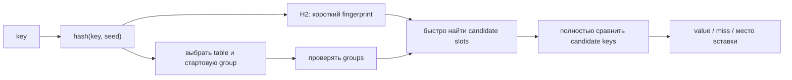

# Map internals без лишней магии

Раздел разделяет две вещи, которые часто смешивают:

1. **семантика языка** — что гарантируют lookup, `range`, `delete`, nil map и concurrent access;
2. **реализация runtime** — как Go размещает и ищет элементы внутри hash table.

Начиная с Go 1.24 builtin `map` использует реализацию на основе Swiss Tables. Старые статьи про `hmap`, `bmap`, overflow buckets и incremental evacuation описывают Go 1.23 и ниже.

## Как читать

| Шаг | Материал | Что нужно вынести |
| --- | --- | --- |
| 1 | [Swiss Tables с Go 1.24](./02-swiss-tables-since-1.24.md) | актуальная mental model lookup/insert/delete/grow |
| 2 | [Задачки и gotchas](./03-puzzles-and-gotchas.md) | наблюдаемое поведение, не зависящее от runtime layout |
| 3 | [sync.Map](./04-sync-map.md) | выбор concurrent map и актуальный hash-trie |
| 4 | [Историческая hmap до Go 1.24](./01-hmap-before-1.24.md) | понимать старые статьи и отличия прежней реализации |

Историческую главу не нужно учить первой. Для современного собеседования обычно достаточно сказать, что Go 1.24 заменил bucket chaining на Swiss Tables, и дальше объяснять актуальную модель.

## Одна схема на весь раздел

Hash не доказывает равенство ключей. Он только быстро приводит поиск к небольшому числу кандидатов; окончательное решение всегда делает сравнение ключей.

## Что действительно важно senior backend

- lookup в среднем близок к `O(1)`, но это не hard real-time guarantee;
- key должен быть comparable, а interface key проверяется по dynamic type;
- элемент map не addressable: структуру нужно достать, изменить и записать обратно;
- `range` не имеет стабильного порядка, а изменения во время обхода имеют специальную семантику;
- builtin map не поддерживает concurrent read/write без внешней синхронизации;
- массовый `delete` не обещает вернуть backing memory;
- `sync.Map` — специализированный инструмент, а не автоматическая замена `map + Mutex`.

## Практические эксперименты

Расширенные примеры находятся под `
` рядом с соответствующей темой:

- ручной lookup по H1/H2 и ctrl bytes;
- tombstone и продолжение probe sequence;
- задачки «что выведет»;
- typed wrapper и benchmark для `sync.Map`;
- сравнение Swiss Tables с исторической `hmap`.

## Официальные источники

- [Go 1.24 release notes](https://go.dev/doc/go1.24)
- [Faster Go maps with Swiss Tables](https://go.dev/blog/swisstable)
- [Go map specification](https://go.dev/ref/spec#Map_types)
- [Current runtime maps source](https://go.dev/src/internal/runtime/maps/)
- [sync.Map documentation](https://pkg.go.dev/sync#Map)
