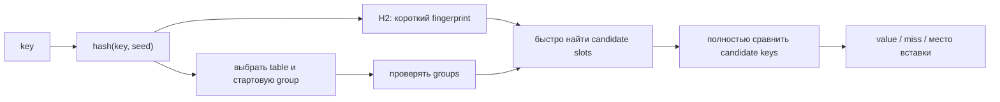

# Map internals без лишней магии

Раздел разделяет две вещи, которые часто смешивают:

1. **семантика языка** — что гарантируют lookup, `range`, `delete`, nil map и concurrent access;
2. **реализация runtime** — как Go размещает и ищет элементы внутри hash table.

Начиная с Go 1.24 builtin `map` использует реализацию на основе Swiss Tables. Старые статьи про `hmap`, `bmap`, overflow buckets и incremental evacuation описывают Go 1.23 и ниже.

---

## Как читать

Подпапка `sync-map` — отдельный маршрут по конкурентной map, поэтому она не участвует в нумерации верхнеуровневых файлов. Остальные главы читаются по порядку: актуальные Swiss Tables, историческая `hmap`, затем задачки на пользовательскую семантику.

| Шаг | Материал | Что нужно вынести |
| --- | --- | --- |
| Отдельно | [sync.Map](./sync-map/README.md) | публичный контракт, актуальный hash-trie, практические приёмы и прежняя read/dirty реализация |
| 1 | [Swiss Tables с Go 1.24](./01-swiss-tables-since-1.24.md) | актуальная mental model lookup/insert/delete/grow |
| 2 | [Историческая hmap до Go 1.24](./02-hmap-before-1.24.md) | buckets, tophash, overflow chains и incremental evacuation |
| 3 | [Задачки и gotchas](./03-puzzles-and-gotchas.md) | наблюдаемое поведение, не зависящее от runtime layout |

Первый файл начинается с раздела «Какую задачу решает hash table» и словаря терминов, поэтому предварительное знакомство с устройством хеш-таблиц не требуется.

Исторические главы не нужно учить первыми. Для современного собеседования обычно достаточно сказать, что Go 1.24 заменил bucket chaining на Swiss Tables, а read/dirty — на hash-trie, и дальше объяснять актуальные модели. Прежние реализации находятся рядом с соответствующей темой и пригодятся, когда вопрос задан с явной привязкой к версии или когда разбирается старая статья.

---

## Одна схема на весь раздел

Здесь `H2` — короткий отпечаток hash длиной семь bits, который лежит рядом со slot и позволяет отбросить большинство неподходящих ключей без их чтения. Полностью термины разобраны в словаре [первой главы](./01-swiss-tables-since-1.24.md).

Hash не доказывает равенство ключей. Он только быстро приводит поиск к небольшому числу кандидатов; окончательное решение всегда делает сравнение ключей.

---

## Что действительно важно senior backend

- lookup в среднем близок к `O(1)`, но это не hard real-time guarantee;
- key должен быть comparable, а interface key проверяется по dynamic type;
- элемент map не addressable: структуру нужно достать, изменить и записать обратно;
- `range` не имеет стабильного порядка, а изменения во время обхода имеют специальную семантику;
- builtin map не поддерживает concurrent read/write без внешней синхронизации;
- массовый `delete` не обещает вернуть backing memory;
- `sync.Map` — специализированный инструмент, а не автоматическая замена `map + Mutex`.

---

## Практические эксперименты

Расширенные примеры находятся рядом с соответствующей темой; длинные дополнительные эксперименты в главах про builtin map свёрнуты под `
`:

- ручной lookup по H1/H2 и ctrl bytes;
- пошаговый расчёт probe sequence через mask;
- поведение маркера удаления после `delete`;
- задачки «что выведет»;
- [типизированная оболочка, состояние отдельного ключа и benchmark для `sync.Map`](./sync-map/04-practical-patterns.md);
- пошаговый пример evacuation в исторической `hmap`.

Сравнение Swiss Tables с прежней `hmap` под `
` не спрятано: таблицы находятся в основном тексте обеих глав.

---

## Официальные источники

- [Go 1.24 release notes](https://go.dev/doc/go1.24)
- [Faster Go maps with Swiss Tables](https://go.dev/blog/swisstable)
- [Go map specification](https://go.dev/ref/spec#Map_types)
- [Current runtime maps source](https://go.dev/src/internal/runtime/maps/)
- [sync.Map documentation](https://pkg.go.dev/sync#Map)
