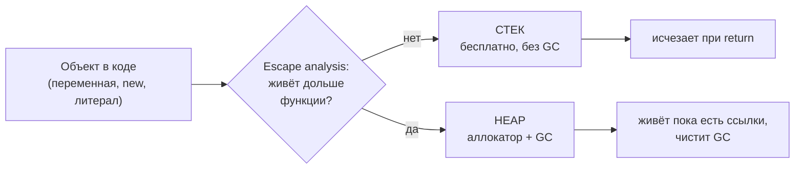
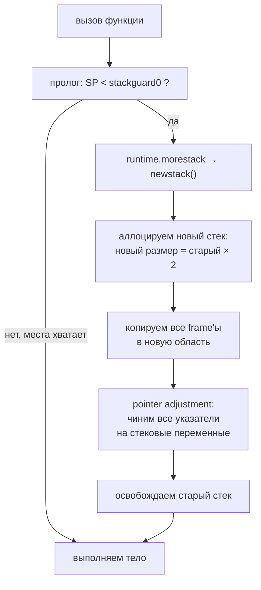
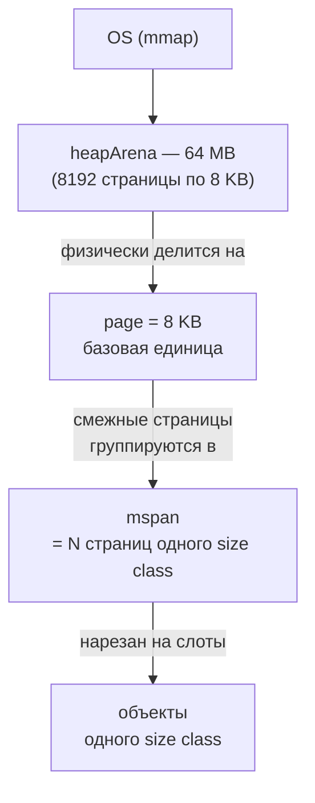

# Stack And Heap

Go управляет двумя видами памяти: стеком (быстро, без GC) и heap (медленнее, GC отслеживает). Понимание того, как они устроены на уровне runtime, объясняет почему горутины дешевле потоков и как Go возвращает память OS.

## Содержание

- [Ментальная модель: стек vs heap](#ментальная-модель-стек-vs-heap)
- [Что куда попадает](#что-куда-попадает)
- [Goroutine stack vs OS thread stack](#goroutine-stack-vs-os-thread-stack)
- [Устройство goroutine stack](#устройство-goroutine-stack)
- [Stack growth и shrink](#stack-growth-и-shrink)
- [Go heap: virtual memory и arenas](#go-heap-virtual-memory-и-arenas)
- [Возврат памяти OS: scavenger](#возврат-памяти-os-scavenger)
- [RSS vs VSZ: что видит Kubernetes](#rss-vs-vsz-что-видит-kubernetes)
- [Safe points и stack scanning](#safe-points-и-stack-scanning)
- [Interview-ready answer](#interview-ready-answer)

---

## Ментальная модель: стек vs heap

Прежде чем лезть в runtime, держи в голове простую картинку.

**Стек** — это стопка тарелок. Вызвали функцию — положили тарелку сверху (frame с локальными переменными). Функция вернулась — сняли тарелку. Всё. Никто не ищет "какие тарелки ещё нужны", не сканирует, не чистит — просто двигают один указатель (`SP`, stack pointer) вверх-вниз. Поэтому стек **бесплатный**: аллокация = вычесть число из регистра.

**Heap** — это общий склад. Положил коробку — она лежит, пока кто-то на неё ссылается. Когда ссылок не осталось — коробку надо найти и выкинуть, и этим занимается **GC** (отдельная работа, которая стоит CPU). Аллокация на heap дороже: надо найти свободное место, обновить метаданные, потом за объектом будет следить сборщик.

| | Стек | Heap |
|---|---|---|
| Кто владеет | одна горутина | весь процесс |
| Время жизни | до конца функции | пока есть ссылки |
| Аллокация | сдвиг указателя (наносекунды) | поиск span + bookkeeping |
| Освобождение | автоматом при return | GC находит и чистит |
| Стоит ли CPU GC | нет | да (scan + sweep) |
| Кто решает, куда класть | компилятор (escape analysis) | компилятор (escape analysis) |

Ключевая мысль: **в стек хочется как можно больше**, потому что это бесплатно и не нагружает GC. Именно поэтому escape analysis (см. [03-escape-analysis](./03-escape-analysis.md)) — это реальная оптимизация производительности, а не академия.



---

## Что куда попадает

Грубые правила (точные — в [03-escape-analysis](./03-escape-analysis.md), здесь только для интуиции):

```go
func example() {
    a := 42              // СТЕК: локальное число, не убегает
    b := [1024]int{}     // СТЕК: большой, но не убегает → ок (до 10 MB)
    c := make([]int, 10) // СТЕК: размер известен, не убегает

    u := &User{Name: "x"}    // зависит: если вернём/сохраним → HEAP
    return u                 // ← возврат указателя → u escapes → HEAP
}
```

Что почти всегда **уезжает в heap**:
- возврат указателя на локальную переменную (`return &x`);
- сохранение указателя в поле структуры, которая живёт дольше;
- значение, переданное в `interface{}` (нужен boxing);
- замыкание, захватывающее переменную по ссылке;
- слайс/мапа неизвестного на этапе компиляции размера;
- объект, на который ссылается что-то, отправленное в канал/глобал.

> `new(T)` и `&T{}` **не гарантируют** heap. Если объект не убегает — он на стеке. Решает компилятор, а не синтаксис.

---

## Goroutine stack vs OS thread stack

Главная причина, почему Go держит миллионы конкурентных задач, — дешёвый стек горутины.

```
OS thread stack:       фиксированный размер, обычно 8 MB (задаётся при создании)
Goroutine stack:       начинается с 2 KB, растёт по необходимости
```

Посчитаем на пальцах, во что обходится **1 000 000** конкурентных задач:

| Модель | На штуку | На 1M |
|---|---|---|
| OS thread (8 MB стек) | 8 MB | **8 TB** адресного пространства |
| Goroutine (2 KB старт) | 2 KB | **2 GB** адресного пространства |

Разница в **4000 раз**. 8 TB ты просто не сможешь зарезервировать, а 2 GB виртуального адресного пространства — норма (и физической памяти займётся ещё меньше, т.к. многие стеки реально не вырастут).

Почему OS-поток такой тяжёлый:
- ядро резервирует фиксированный диапазон адресов при создании (размер задан, не растёт);
- помимо стека есть kernel-структуры на поток, TLS, guard pages;
- переключение между потоками идёт через ядро (см. [context-switching](../../11-devops-and-observability/hardware-and-os/07-context-switching-and-scheduling.md)).

Горутина — это структура `runtime.g` в user-space. Её стек аллоцируется через `malg` и растёт копированием. Планировщик Go мультиплексирует горутины на потоки (модель M:N), не трогая ядро на каждом переключении.

---

## Устройство goroutine stack

Каждая горутина имеет объект `runtime.g`, в котором описаны границы её стека:

```
runtime.g {
    stack.lo    uintptr  // нижняя граница стека (минимальный адрес)
    stack.hi    uintptr  // верхняя граница стека (максимальный адрес)
    stackguard0 uintptr  // порог для проверки переполнения (≈ stack.lo + 928)
    ...
}
```

Стек растёт **вниз** (по убыванию адреса) — как на x86-64. То есть новый frame занимает адреса **меньше**, чем предыдущий, а свободное место всегда снизу:

```
stack.hi  ┌──────────────────────┐  ← высокий адрес (дно стопки)
          │  frame main()        │
          │   locals, args       │
          ├──────────────────────┤
          │  frame handler()     │
          ├──────────────────────┤
          │  frame parse()       │  ← здесь сейчас выполняемся
          ├──────────────────────┤  ← SP (stack pointer) показывает сюда
          │                      │
          │     (свободно)       │  ← новые вызовы растут вниз
          │                      │
stack.lo  ├──────────────────────┤  ← низкий адрес
          │  guard page (928 B)  │  ← если SP дошёл сюда → пора расти
          └──────────────────────┘
```

**Stack frame** одной функции содержит:
- локальные переменные функции;
- аргументы и возвращаемые значения (с Go 1.17 первые передаются через регистры, но frame нужен для spill — выгрузки регистров в память при нехватке);
- saved return address (куда вернуться после `RET`);
- saved base pointer (при `GOEXPERIMENT=framepointer` или сборке с `-msan`).

---

## Stack growth и shrink

### Проверка переполнения (stack check)

Откуда runtime вообще узнаёт, что пора расти? Компилятор вставляет **в начало каждой неинлайненной функции** маленький пролог-проверку:

```asm
; Псевдо-asm: что добавляется в начало функции
MOVQ (TLS), R14            ; R14 = *g (текущая горутина из thread-local storage)
CMPQ SP, stackguard0(R14)  ; стек-указатель упал ниже порога?
JBE  morestack             ; да → прыгнуть в runtime.morestack (нужен рост)
; ... тело функции ...
```

`stackguard0 = stack.lo + StackGuard` (StackGuard ≈ 928 байт — запас, чтобы сам `morestack` тоже успел отработать). Когда `SP` опустился до guard — стека не хватает, запускается рост.

> Эта проверка — несколько инструкций на каждый вызов функции. Поэтому её **нет** в листовых/инлайненных функциях, где компилятор доказал, что переполнения быть не может.

### Рост: contiguous copy (копирование целиком)

До Go 1.4 стек был **сегментированным** (linked list сегментов), но это давало "hot split problem": если функция в цикле прыгала туда-сюда через границу сегмента, постоянно происходили alloc/free сегмента. С Go 1.4 — **contiguous stack**: весь стек копируется в новый регион вдвое большего размера.



Пошагово, что происходит при `morestack`:

1. `runtime.morestack` вызывает `newstack()`;
2. аллоцируется новый стек: `новый_размер = старый_размер × 2`;
3. все frame'ы копируются в новую область (это `memmove`);
4. **pointer adjustment** — все указатели, которые ссылались на старый стек, переписываются на новые адреса;
5. старый стек освобождается;
6. функция перезапускается с того же места (теперь места хватает).

**Pointer adjustment** — самая хитрая часть. Если внутри стека был указатель `p := &localVar`, после переезда `localVar` лежит по новому адресу, и `p` надо обновить. Runtime знает, где в каждом frame лежат указатели, через **stack maps** (битовые карты, сгенерированные компилятором), и аккуратно их правит.

Конкретные числа роста (типичная картина для рекурсии):

```
2 KB  → переполнение → 4 KB  → переполнение → 8 KB → 16 KB → 32 KB → ...
```

### Разбор на числах: рекурсия `deep(n)`

```go
// Демонстрация: глубокая рекурсия заставляет стек расти
func deep(n int) int {
    var buf [256]byte // локальный буфер «съедает» стек
    if n == 0 {
        return 0
    }
    return int(buf[0]) + deep(n-1)
}
```

Посчитаем, что происходит при `deep(10000)`. Сначала прикинем размер **одного кадра** (frame) этой функции на amd64:

```
buf [256]byte                         256 B
saved return address                    8 B
n, возвращаемое значение, выравнивание ~24 B
────────────────────────────────────────────
один frame deep()                     ≈ 288 B   (приблизительно, зависит от версии/ABI)
```

Каждый рекурсивный вызов кладёт новый кадр ~288 B. Значит в стек размера `S` влезает примерно `S / 288` кадров. Стек стартует с 2 KB и удваивается при переполнении — вот как растёт глубина:

| Размер стека | Влезает кадров (≈ S/288) | Событие |
|---|---:|---|
| 2 KB (старт) | ~7 | стартовый стек |
| 4 KB | ~14 | 1-е удвоение (copy 2 KB) |
| 8 KB | ~28 | 2-е (copy 4 KB) |
| 64 KB | ~227 | 5-е |
| 256 KB | ~910 | 7-е |
| 1 MB | ~3 640 | 9-е |
| 2 MB | ~7 280 | 10-е |
| **4 MB** | **~14 560** | **11-е (хватает для 10 000)** |

`deep(10000)` требует ≈ `10000 × 288 B ≈ 2.75 MB` стека. Ближайший размер сверху по степени двойки от 2 KB — это **4 MB** (`2 KB × 2¹¹`). То есть до самого глубокого вызова стек переживёт **11 событий роста**, и каждое — это полное копирование текущего стека в новый регион + pointer adjustment.

**Сколько всего памяти скопировано?** На каждом росте копируется *старый* стек целиком:

```
copy 2 KB + 4 KB + 8 KB + … + 2 MB  =  4 MB − 2 KB  ≈  4 MB
```

Итого ~4 MB суммарного `memmove` ради финального стека в 4 MB — то есть **работа копирования ≈ размеру итогового стека**. Это и есть смысл удвоения: благодаря геометрической прогрессии амортизированная стоимость одного вызова остаётся O(1), несмотря на то что отдельные вызовы (те, что попали на момент роста) дорогие.

> Если поднять глубину так, что нужно > 1 GB стека (дефолтный максимум), получишь `runtime: goroutine stack exceeds 1000000000-byte limit` и `fatal error: stack overflow`. Бесконечная рекурсия падает именно так, а не тихо.

Когда `deep` начнёт разворачиваться обратно (кадры снимаются), стек 4 MB останется выделенным — Go не ужимает его на каждом `return`. Но при следующем **GC**, если горутина использует < 25% стека, он ужмётся вдвое (см. [Shrink](#shrink-уменьшение-стека)).

- начальный размер: `_StackMin = 2048` (2 KB);
- максимум по умолчанию: **1 GB** (64-bit), 250 MB (32-bit);
- при превышении максимума → `fatal error: stack overflow` (например, бесконечная рекурсия);
- изменить лимит: `debug.SetMaxStack(bytes)`.

### Shrink: уменьшение стека

Стек не только растёт, но и **уменьшается вдвое** — во время GC (в фазе concurrent mark):

- если горутина использует **< 25%** текущего стека → стек ужимается вдвое;
- механизм тот же, что при росте: копирование в меньший буфер + pointer adjustment.

Зачем: если горутина один раз вызвала глубокую функцию и стек раздулся до 1 MB, а потом «успокоилась» — нет смысла держать 1 MB занятым на спящей горутине. Shrink возвращает память.

---

## Go heap: virtual memory и arenas

Go **не использует** `malloc/free` из libc. Runtime сам менеджер памяти и запрашивает её у OS большими кусками через `mmap`:

```go
// runtime/mem_linux.go (упрощённо)
func sysAlloc(n uintptr, sysStat *sysMemStat) unsafe.Pointer {
    p, err := mmap(nil, n, _PROT_READ|_PROT_WRITE,
        _MAP_ANON|_MAP_PRIVATE, -1, 0)
    // ...
}
```

Память heap организована так: OS отдаёт **arena** (64 MB); arena физически нарезана на **pages** (по 8 KB); смежные страницы объединяются в **span**; span нарезан на слоты, в которых лежат **объекты** одного size class.

Важно, что это **не строгая линейная иерархия**: `page` — это базовая единица деления arena, а `span` стоит «сбоку» — он не лежит «между» arena и page, а **группирует** несколько подряд идущих страниц:



Иными словами: `arena ⊃ pages`, `span = группа смежных pages`, `объекты ⊂ span`. Один span может занимать одну страницу (для мелких объектов) или много подряд (для крупных).

### heapArena

Heap нарезан на **arenas** — регионы фиксированного размера:

```
64-bit Linux:  heapArenaBytes = 64 MB   (pagesPerArena = 64MB / 8KB = 8192 страниц)
32-bit:        heapArenaBytes = 4 MB
```

Сама `heapArena` — это не данные приложения, а **метаданные** о регионе: какие страницы заняты, где живые объекты, как по адресу найти span. Она лежит вне heap (`sys.NotInHeap`):

```go
type heapArena struct {
    // page → span: по индексу страницы внутри арены находим её mspan
    spans        [pagesPerArena]*mspan

    // bitmap'ы по 1 биту на страницу (pagesPerArena/8 байт):
    pageInUse    [pagesPerArena / 8]uint8  // какие страницы заняты (mSpanInUse)
    pageMarks    [pagesPerArena / 8]uint8  // на каких страницах есть marked-объекты (GC)
    pageSpecials [pagesPerArena / 8]uint8  // где есть specials (finalizers и т.п.)

    checkmarks   *checkmarksMap            // для debug-режима gccheckmark
    zeroedBase   uintptr                   // граница уже занулённой части арены
}
```

> До Go 1.22 в `heapArena` лежал ещё `bitmap` — карта «указатель/скаляр» для каждого слова арены (нужна GC, чтобы знать, где искать указатели). В Go 1.22 эти метаданные переехали в **заголовки рядом со span** (allocation headers), что улучшило локальность при сканировании. Идея Green Tea GC (см. [04-garbage-collector](./04-garbage-collector.md)) — продолжение той же борьбы за cache locality в mark-фазе.

Все арены индексируются через `mheap.arenas` — двумерный массив (L1 × L2). Это позволяет по **любому** адресу heap за O(1) найти метаданные: какой arena принадлежит, занята ли страница, какой это span.

### mspan: единица управления

Внутри arena память делится на **pages** (1 page = 8 KB). Соседние страницы группируются в **mspan**:

```
mspan {
    startAddr  uintptr   // начальный адрес span
    npages     uintptr   // сколько страниц занимает
    sizeclass  uint8     // size class (0 = large object > 32 KB)
    allocBits  *gcBits   // bitmap: какие слоты заняты
    gcmarkBits *gcBits   // bitmap: какие объекты живые (заполняется GC)
    ...
}
```

Ключевое свойство: **один mspan обслуживает объекты только одного size class**. Например, span для 32-байтных объектов нарезан ровно на слоты по 32 байта. Благодаря этому:

- нет **external fragmentation** внутри span (все слоты одинаковые);
- аллокация = найти свободный бит в `allocBits` и вернуть слот;
- освобождение = пометить бит свободным.

> Детали про size classes, mcache/mcentral/mheap и tiny-аллокатор — в [02-allocator](./02-allocator.md). Здесь важно только: heap — это не «один большой malloc», а строгая иерархия arena → span → slot.

---

## Возврат памяти OS: scavenger

Когда GC освобождает объекты, Go **не отдаёт память OS сразу** — держит у себя для быстрого переиспользования (повторный `mmap` дорогой). Но если память реально простаивает, её надо вернуть, иначе RSS будет только расти. Этим занимается **scavenger** — фоновая горутина.

```
madvise(addr, size, MADV_DONTNEED)  // Linux, default с Go 1.16
// или
madvise(addr, size, MADV_FREE)      // lazy decommit, быстрее, но RSS падает не сразу
```

Разница принципиальная для мониторинга:

| | `MADV_DONTNEED` | `MADV_FREE` |
|---|---|---|
| Когда ядро освобождает страницы | немедленно | при нехватке памяти |
| RSS в метриках | падает сразу | держится высоким, падает «потом» |
| Стоимость | дороже (page faults при повторном использовании) | дешевле |

`GODEBUG=madvdontneed=1` форсирует `MADV_DONTNEED`, если хочется, чтобы RSS честно падал (удобно для дашбордов и k8s).

Важные детали:
- scavenger **бюджетирует CPU**: тратит не более ~1% CPU, чтобы не мешать приложению;
- **GOMEMLIMIT** (Go 1.19) делает scavenger агрессивнее при приближении к лимиту — он активнее возвращает память и чаще запускает GC, чтобы не упереться в лимит.

---

## RSS vs VSZ: что видит Kubernetes

Это место, где «всё работало локально, а в k8s OOMKilled». Два разных числа:

```
VmSize (VSZ) = всё виртуальное адресное пространство (зарезервировано, может быть огромным)
VmRSS (RSS)  = реально отображённые в физическую RAM страницы (вот это и есть «память»)
```

```
┌─────────────────────────────────────────────┐
│  VSZ (виртуальное пространство, напр. 2 GB)   │
│  ┌───────────────┐                            │
│  │  RSS (300 MB) │   ← реально в физ. RAM      │
│  └───────────────┘                            │
│         остальное — зарезервировано,           │
│         но физических страниц нет              │
└─────────────────────────────────────────────┘
```

- после `MADV_DONTNEED`: RSS падает, VSZ остаётся прежним;
- после `MADV_FREE`: RSS не падает сразу (ядро решает само), VSZ остаётся.

Kubernetes / cgroup v2 для OOM-решений смотрят на **RSS** (`container_memory_working_set_bytes` ≈ RSS + часть kernel-памяти). Практические выводы:

- ставь `GOMEMLIMIT` ниже `cgroup memory.limit` (обычно ~90% лимита) — тогда Go начнёт агрессивно собирать мусор и возвращать память **до** того, как ядро убьёт процесс;
- без `GOMEMLIMIT` Go ориентируется только на `GOGC` и может разогнать RSS до OOM killer под нагрузкой со спайками;
- `MADV_FREE` может пугать дашборды: RSS «не падает», хотя память по факту свободна — для честных графиков форсируй `madvdontneed=1`.

```bash
# Посмотреть память процесса
cat /proc/$(pgrep myapp)/status | grep -E 'VmRSS|VmSize|VmPeak'

# В контейнере (cgroup v2) — что реально считает k8s
cat /sys/fs/cgroup/memory.current
cat /sys/fs/cgroup/memory.max
```

---

## Safe points и stack scanning

GC должен просканировать стеки всех горутин — найти указатели, которые служат **GC roots** (корни графа достижимости). Но сканировать стек можно только когда горутина стоит в **safe point** — в момент, где runtime точно знает, что лежит в каждом слоте стека (где указатели, а где просто числа).

**Safe points** в Go:
- **вызов функции** — пролог содержит stack map для текущей точки;
- `runtime.Gosched()` — явная уступка планировщику;
- **syscall** — горутина паркуется, её стек стабилен;
- **async preemption** (Go 1.14+) — runtime шлёт сигнал `SIGURG`, горутина доводится до ближайшего safe point и останавливается (так прерываются даже тугие циклы без вызовов функций).

Для каждой функции компилятор генерирует **stack map** — bitmap, в котором отмечено, какие слоты frame содержат указатели. GC по ней понимает, что класть в grey set:

```
stack frame функции:
  [0]: int64    → не указатель    → пропустить
  [1]: *User    → указатель       → добавить *User в grey set (живой root)
  [2]: string   → внутри есть ptr  → добавить data-указатель строки
  [3]: []int    → slice header     → добавить ptr на backing array
```

Тот же механизм stack maps используется при росте стека (pointer adjustment) — то есть runtime в обоих случаях полагается на точное знание расположения указателей в кадре.

---

## Interview-ready answer

**«Чем goroutine stack отличается от OS thread stack?»**

OS thread имеет фиксированный стек при создании (обычно 8 MB), который не уменьшается, и переключается через ядро. Goroutine начинается с 2 KB и использует **contiguous stack**: при переполнении (проверка в прологе каждой функции — `SP < stackguard0`) весь стек копируется в новый регион вдвое большего размера, а все указатели на стековые переменные чинятся через stack maps (pointer adjustment). При GC, если используется < 25% стека, он ужимается вдвое. Поэтому 1M горутин — это ~2 GB адресного пространства против ~8 TB у потоков.

**«Как Go управляет памятью heap?»**

Go сам менеджер памяти, не через libc malloc. Запрашивает память у OS большими кусками через `mmap`. Heap = иерархия: `heapArena` (64 MB на 64-bit, со своими bitmap для GC) → `mspan` (группа страниц одного size class, 1 page = 8 KB) → слоты под объекты. Один span обслуживает один size class — нет внутренней фрагментации. Освобождённую память возвращает OS scavenger-горутина через `madvise(MADV_DONTNEED/MADV_FREE)`, тратя ≤1% CPU.

**«Почему в проде OOMKilled, хотя памяти вроде хватает?»**

Kubernetes смотрит на **RSS** (working set), а не на VSZ. Без `GOMEMLIMIT` Go ориентируется только на `GOGC` и под спайками может разогнать RSS выше cgroup-лимита → OOM killer. Решение: `GOMEMLIMIT ≈ 90% от memory.limit`, тогда GC и scavenger начинают агрессивно работать до достижения лимита. Плюс при `MADV_FREE` RSS на графиках падает не сразу — для честных метрик `GODEBUG=madvdontneed=1`.
