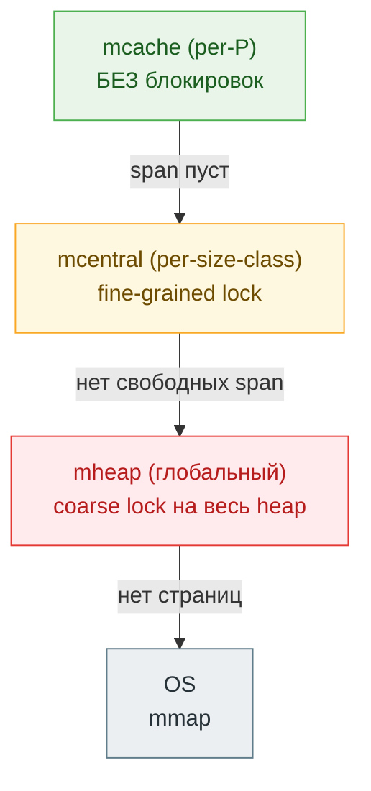

# Go Memory Allocator

Go использует собственный аллокатор поверх OS-страниц. Его архитектура — трёхуровневая иерархия — позволяет аллоцировать объекты почти без contention на многопроцессорной системе.

## Содержание

- [Трёхуровневая иерархия](#трёхуровневая-иерархия)
- [Size classes](#size-classes)
- [mcache — per-P кэш](#mcache--per-p-кэш)
- [mcentral — per-size-class список](#mcentral--per-size-class-список)
- [mheap — глобальный менеджер](#mheap--глобальный-менеджер)
- [Tiny allocator](#tiny-allocator)
- [Large objects (> 32 KB)](#large-objects--32-kb)
- [noscan: объекты без указателей](#noscan-объекты-без-указателей)
- [Путь аллокации: пошагово](#путь-аллокации-пошагово)
- [Zero initialization](#zero-initialization)
- [Инструменты диагностики](#инструменты-диагностики)
- [Interview-ready answer](#interview-ready-answer)

---

## Трёхуровневая иерархия

Аллокатор Go устроен по тому же принципу, что и кэши процессора (L1 → L2 → RAM) или TCMalloc, от которого он и произошёл: **горячий путь — локальный и без блокировок, а за общими ресурсами идём всё реже и всё дороже**. Чем выше уровень, тем больше contention.



| Уровень | Кто владеет | Блокировка | Как часто доходим |
|---|---|---|---|
| **mcache** | каждый P свой | нет (lock-free) | почти всегда |
| **mcentral** | один на size class | mutex на этот class | когда span в mcache кончился |
| **mheap** | один на процесс | глобальный mutex | когда у mcentral нет span |
| **OS (mmap)** | ядро | syscall | когда heap надо расширить |

Большинство аллокаций разрешается на уровне **mcache** — без блокировок, потому что каждый P владеет своим кэшем, и только один M (OS-поток) работает с P в каждый момент. Это и есть причина, почему аллокация в Go при `GOMAXPROCS=N` масштабируется почти линейно: N процессоров аллоцируют параллельно, не мешая друг другу, пока хватает локальных span.

---

## Size classes

Объекты размером ≤ 32 KB распределяются по **size classes** — заранее известным категориям размеров.

Go имеет **~70 size classes** (точное число меняется между версиями):

```
class  bytes     class  bytes     class  bytes
  1      8         11    128         21    1792
  2     16         12    144         22    2048
  3     24         13    160         23    2304
  4     32         14    176         24    2688
  5     48         15    192         25    3072
  6     64         16    208         26    3200
  7     80         17    224         27    3456
  8     96         18    240         28    4096
  9    112         19    256         ...
 10    128         20    288         67   32768
```

При аллокации запрос **округляется вверх** до ближайшего size class. Объект 100 байт попадёт в class 9 (112 байт) → 12 байт пропадают. Это **внутренняя фрагментация** (internal fragmentation) — плата за то, что не нужен заголовок перед каждым объектом и за O(1) аллокацию.

Несколько примеров, сколько теряется (значения классов — реальные из Go):

| Запрос | Округлено до | Потеря | % overhead |
|---:|---:|---:|---:|
| 8 B | 8 B | 0 B | 0% |
| 17 B | 24 B | 7 B | 41% |
| 100 B | 112 B | 12 B | 12% |
| 129 B | 144 B | 15 B | 12% |
| 769 B | 896 B | 127 B | 17% |
| 3100 B | 3200 B | 100 B | 3% |

Worst case — чуть-чуть «перевалить» за границу класса (как 17 B → 24 B, +41%). Поэтому если в hot path много объектов одного размера, иногда стоит подогнать структуру/буфер под границу size class. Проверить, в какой класс попадёт размер, можно по таблице в `runtime/sizeclasses.go` или экспериментом с `-benchmem`.

```go
// Структура весит 33 байта → округлится до 48 B, теряем 15 B на объект.
// Уберём/упакуем поля до 32 B → ровно в класс 32 B, потеря 0 B.
// На 10M объектов это ~150 MB сэкономленного heap.
```

**Зачем size classes:**
- Нет external fragmentation: span содержит объекты только одного размера, дырки заполняются объектами того же размера;
- Allocation = bump pointer внутри span (O(1));
- GC sweep: всю span можно переиспользовать или вернуть целиком.

```go
// runtime/sizeclasses.go (упрощённо)
var class_to_size = [_NumSizeClasses]uint16{
    0, 8, 16, 24, 32, 48, 64, 80, 96, 112, 128, ...
}
```

---

## mcache — per-P кэш

Каждый **P** (logical processor) имеет объект `mcache`:

```
mcache {
    alloc [numSpanClasses]*mspan   // по одному span на каждый size class
                                   // × 2: scan + noscan варианты
    tiny       uintptr             // tiny allocator: текущий блок
    tinyoffset uintptr
    tinyAllocs uintptr
}
```

`numSpanClasses = _NumSizeClasses × 2` — для каждого size class есть два span: один для объектов с указателями (scan), один без (noscan).

**Аллокация из mcache:**

```
1. Вычислить size class для запрошенного размера
2. Взять mspan из mcache.alloc[sizeclass]
3. Если span не пуст: взять следующий свободный слот (freeindex)
4. Обновить freeindex, вернуть указатель
```

Конкретно: пусть нужен объект 100 B (size class → 112 B). Span для этого класса — это, скажем, 8 KB страница, нарезанная на `8192 / 112 ≈ 73` слота. `freeindex` указывает на первый свободный слот:

```
span (112-байтные слоты),  freeindex = 3
┌──────┬──────┬──────┬──────┬──────┬─────┐
│ slot0│ slot1│ slot2│ slot3│ slot4│ ... │
│ заня│ заня│ заня│ ↑своб│ своб │     │
└──────┴──────┴──────┴──────┴──────┴─────┘
                       │
 аллокация: addr = span.base + freeindex×112
            freeindex++   (теперь 4)
```

Аллокация = арифметика над `freeindex` + возврат адреса. Никаких блокировок, никакого поиска — отсюда и скорость. Когда `freeindex` дойдёт до конца span (все 73 слота заняты), mcache идёт за новым span в mcentral.

> На самом деле freeindex работает в паре с `allocCache` — битовой маской свободных слотов (для переиспользования дырок после GC sweep), но идея та же: найти свободный слот почти бесплатно.

Это быстро: нет блокировок, нет обращений к общим структурам. При context switch P переходит к другому M, но mcache переносится вместе с P.

---

## mcentral — per-size-class список

Когда mcache span исчерпан, запрашивается новый span из `mcentral`:

```
mheap.central[sizeclass] = mcentral {
    lock   mutex
    partial [2]spanSet   // spans с свободными слотами
    full    [2]spanSet   // spans без свободных слотов
}
```

`[2]` — два набора: swept (после GC) и unswept (до GC). GC lazy sweep происходит при аллокации.

Взять span из mcentral = захватить lock, вернуть span в mcache (spin-free в большинстве случаев).

---

## mheap — глобальный менеджер

Если mcentral не может дать span — обращение к `mheap`:

```
mheap {
    lock      mutex
    pages     pageAlloc     // bitmap всех heap-страниц
    arenas    [arenaL1]*[arenaL2]*heapArena
    central   [numSpanClasses]mcentral
    ...
}
```

mheap находит подходящий contiguous range страниц через `pageAlloc` (radix tree), нарезает их в новый `mspan` и передаёт в mcentral.

Если heap-страниц не хватает — mheap запрашивает у OS через `mmap`.

---

## Tiny allocator

Отдельная оптимизация для очень маленьких объектов (≤ 16 bytes) **без указателей**:

```go
// runtime/malloc.go
if size <= maxTinySize && noscan {
    // Попытаться упаковать в текущий tiny block
    off := c.tinyoffset
    if off+size <= maxTinySize && c.tiny != 0 {
        x = unsafe.Pointer(c.tiny + off)
        c.tinyoffset = off + size
        return x
    }
    // Аллоцировать новый tiny block (16 bytes из size class 2)
    ...
}
```

**Tiny block = 16 байт** из size class 2 (16 bytes). В один такой блок может упасть несколько маленьких объектов:

```
Tiny block (16 bytes):
[  int32(4B)  ][  bool(1B)  ][  pad(3B)  ][  int64(8B)  ]
```

Типичные кандидаты: `bool`, `byte`, `int8/16/32`, `float32`, маленькие structs без pointer полей.

Если объект содержит указатели — tiny allocator не применяется (GC должен знать границы объектов для сканирования).

---

## Large objects (> 32 KB)

Объекты > 32 KB обходят mcache и mcentral, идут напрямую в mheap:

```go
if size > maxSmallSize {
    span = mheap_.allocLarge(npages)
    // каждый большой объект получает свой собственный span
}
```

Каждый большой объект = свой `mspan` с `sizeclass = 0`. GC сканирует его как единое целое.

**Важно:** большие аллокации всегда идут через global lock `mheap.lock`. Это дороже, чем small allocations. Паттерн частых больших аллокаций на hot path — потенциальная точка contention.

---

## noscan: объекты без указателей

Каждый size class существует в двух вариантах: scan и noscan.

Если объект не содержит указателей — он попадает в **noscan** span:

```go
type Point struct {
    X, Y float64  // нет указателей → noscan
}

type User struct {
    ID    int64
    Name  string  // string содержит указатель на данные → scan
}
```

GC **не сканирует** noscan объекты в phase mark — внутри них гарантированно нет указателей, обходить нечего. Это значительно ускоряет GC при большом количестве числовых объектов.

Span-тип кодируется в `spanClass` одним битом: `spanClass = sizeclass<<1 | noscanBit`. Поэтому span-классов вдвое больше, чем size-классов (`numSpanClasses = _NumSizeClasses × 2`).

Компилятор знает о наличии указателей статически (по типу) и выбирает span-тип при аллокации.

**Почему это важно — на практике.** Сравним два слайса по 10M элементов: один из значений без указателей, другой с указателем внутри.

```go
type NoPtr struct{ A, B, C int64 }   // 24 B, нет указателей → noscan
type WithPtr struct{ A int64; S *int } // есть указатель → scan

// держим 10M живых объектов и меряем паузу GC (runtime.GC())
a := make([]NoPtr, 10_000_000)    // noscan span: GC пройдёт мимо
b := make([]*WithPtr, 10_000_000) // scan: GC обойдёт каждый указатель
```

Для `NoPtr` mark-фаза почти не тратит времени на этот массив — span помечается целиком. Для слайса указателей GC обязан пройти по каждому из 10M указателей. Отсюда практическое правило: **в больших долгоживущих структурах избегай лишних указателей** — `[]Value` дешевле для GC, чем `[]*Value`; массив `int` дешевле, чем массив `interface{}`. Это один из главных способов снизить GC pause на больших heap.

---

## Путь аллокации: пошагово

```
new(T) или make([]T, n) или &T{...}
         ↓
escape analysis: стек или heap?
         ↓ (heap)
mallocgc(size, type, zero)
         ↓
[< 16B, noscan] → tiny allocator
         ↓ (miss)
[≤ 32KB]        → mcache.alloc[sizeclass]
         ↓ (span пуст)
                → mcentral.cacheSpan()
         ↓ (нет свободных spans)
                → mheap.alloc(npages)
         ↓ (нет страниц)
                → mmap(OS)
[> 32KB]        → mheap.allocLarge() → mmap если нужно
```

**Сквозной пример.** Пусть в HTTP-хендлере `buf := make([]byte, 100)`, и буфер не убегает (escape analysis оставил бы на стеке — но представим, что убегает в горутину):

```
make([]byte, 100), buf уходит в heap
  → mallocgc(100, []byte, zero=true)
  → []byte без указателей → noscan
  → 100 ≤ 32 KB → small object, size class = 112 B (потеря 12 B)
  → mcache.alloc[spanClass(112, noscan)]: span есть, freeindex=5
      addr = span.base + 5×112;  freeindex → 6
  → вернуть addr, память уже занулена
```

Весь горячий путь — **без единой блокировки**. К mcentral обратимся только когда этот span заполнится, к mheap — когда у mcentral кончатся span, к OS — когда heap надо физически расширить. Поэтому «дешёвая аллокация в Go» — это про попадание в mcache; всё остальное гораздо дороже.

---

## Zero initialization

В Go **каждый аллоцированный объект гарантированно zero-initialized**. Это реализовано на уровне аллокатора:

```go
// mallocgc обнуляет память если zero=true
// Это дешево для маленьких объектов (компилятор знает размер)
// Для больших объектов — memclr

// Страницы от OS через mmap уже нулевые (OS гарантирует)
// Переиспользованные страницы из span обнуляются при освобождении (sweep)
```

Именно поэтому zero values работают без явной инициализации.

---

## Инструменты диагностики

```bash
# Посмотреть аллокации в бенчмарке
go test -bench=. -benchmem
# BenchmarkFoo-8   1000000   1234 ns/op   256 B/op   3 allocs/op

# Escape analysis: что улетает в heap
go build -gcflags="-m=1" ./...
go build -gcflags="-m=2" ./...  # подробнее

# Heap profile через pprof
go tool pprof http://localhost:6060/debug/pprof/heap
# Команды внутри: top, list FuncName, web
# -alloc_space: все аллокации за всё время
# -inuse_space: живые объекты сейчас

# MemStats
var ms runtime.MemStats
runtime.ReadMemStats(&ms)
fmt.Printf("HeapAlloc:   %d MB\n", ms.HeapAlloc>>20)
fmt.Printf("HeapSys:     %d MB\n", ms.HeapSys>>20)
fmt.Printf("HeapIdle:    %d MB\n", ms.HeapIdle>>20)   // свободно, но не вернули OS
fmt.Printf("HeapReleased:%d MB\n", ms.HeapReleased>>20) // возвращено OS
fmt.Printf("Mallocs:     %d\n", ms.Mallocs)
fmt.Printf("Frees:       %d\n", ms.Frees)
fmt.Printf("NumGC:       %d\n", ms.NumGC)
```

**Важные поля MemStats:**

| Поле | Что значит |
|---|---|
| `HeapAlloc` | живые объекты на heap сейчас |
| `HeapSys` | зарезервировано у OS всего |
| `HeapIdle` | span-ы свободны, но не возвращены OS |
| `HeapReleased` | возвращено OS через madvise |
| `HeapInuse` | span-ы с живыми объектами |
| `StackInuse` | стеки горутин |
| `MCacheInuse` | mcache объекты |
| `TotalAlloc` | всё что было аллоцировано (cumulative) |
| `Mallocs - Frees` | живых объектов на heap |

---

## Interview-ready answer

**"Как устроен аллокатор памяти в Go?"**

Go использует трёхуровневый аллокатор, вдохновлённый TCMalloc. Объекты размером ≤ 32 KB классифицируются по ~70 size classes. Аллокация проходит через три уровня:

1. **mcache** (per-P, без блокировок) — каждый логический процессор имеет свой кэш `mspan` для каждого size class. Аллокация = bump pointer, O(1), без contention.

2. **mcentral** (per-size-class, fine-grained lock) — когда span в mcache исчерпан, берётся новый span из mcentral. Один lock на size class.

3. **mheap** (global lock) — когда в mcentral нет spans, mheap нарезает новые spans из страниц. Если страниц нет — запрашивает у OS через `mmap`.

Дополнительно: **tiny allocator** упаковывает несколько маленьких (≤ 16 B) noscan объектов в один 16-байтный блок. Объекты без указателей (noscan) не сканируются GC — это ускоряет mark-фазу. Большие объекты (> 32 KB) идут напрямую в mheap.

**Практические выводы для senior:**
- дешёвая аллокация = попадание в mcache (lock-free); всё, что дальше (mcentral/mheap/mmap), дороже и с блокировками;
- запрос округляется вверх до size class → есть внутренняя фрагментация; подгонка размера структуры под границу класса экономит heap на больших объёмах;
- `[]Value` дешевле для GC, чем `[]*Value`, а числовой массив — чем `[]interface{}`: меньше указателей → noscan → GC проходит мимо;
- частые большие (> 32 KB) аллокации на hot path бьют по `mheap.lock` — кандидат на `sync.Pool` или переиспользование буфера.
