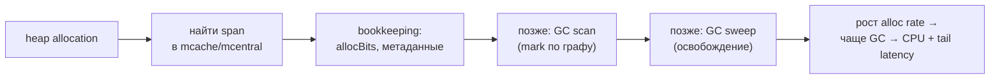
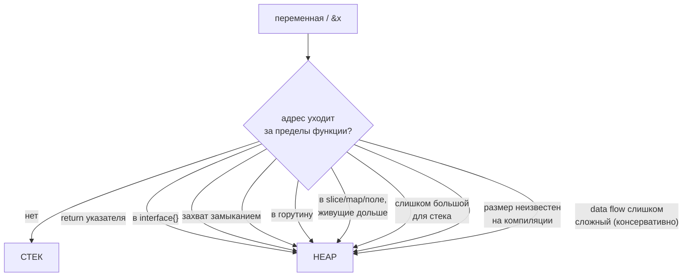

# Escape Analysis

Escape analysis — это как компилятор Go решает, где разместить значение: на стеке (дёшево, не нагружает GC) или в heap (дороже, GC должен его отслеживать). Это одна из главных причин, почему идиоматичный Go быстрый «из коробки» — компилятор бесплатно оставляет на стеке всё, что может.

## Содержание

- [Базовая идея](#базовая-идея)
- [Почему это важно: цена heap-аллокации](#почему-это-важно-цена-heap-аллокации)
- [Как компилятор это решает](#как-компилятор-это-решает)
- [Что вызывает escape](#что-вызывает-escape)
- [Что НЕ вызывает escape (мифы)](#что-не-вызывает-escape-мифы)
- [Interface boxing подробнее](#interface-boxing-подробнее)
- [Как читать вывод компилятора](#как-читать-вывод-компилятора)
- [Inlining и его эффект на escape](#inlining-и-его-эффект-на-escape)
- [Что реально даёт выигрыш](#что-реально-даёт-выигрыш)
- [Практический подход](#практический-подход)
- [Interview-ready answer](#interview-ready-answer)

## Базовая идея

```
Стек: аллокация и cleanup бесплатны (двигаем stack pointer)
Heap: аллокация + GC должен отслеживать объект → дороже
```

Компилятор выбирает стек, если может **доказать**, что значение не переживёт текущий stack frame (т.е. после `return` на него точно никто не сошлётся). Если доказать не может — на всякий случай переносит в heap. Это «escape»: значение «убегает» из своего кадра.

Ключевой момент, который ломает интуицию из C++: **в Go синтаксис не определяет, где лежит объект**. Ни `new(T)`, ни `&x` не гарантируют heap. И наоборот, `x := T{}` может оказаться в heap. Решает только анализ потока данных:

```go
func sum(a, b int) *int {
    result := a + b
    return &result // result ESCAPES: на него остаётся ссылка после return
}

func process() int {
    x := computeExpensive() // x НЕ escapes: значение возвращается копией
    return x
}
```

> Правило мышления: **escapes не "потому что взяли адрес", а "потому что адрес пережил функцию"**. Можно взять `&x` сто раз — пока этот адрес не утёк наружу (через return, поле, канал, горутину, интерфейс), `x` останется на стеке.

## Почему это важно: цена heap-аллокации

Стековая аллокация — это буквально `SUB $N, SP` (одна инструкция, ~1 нс). Heap-аллокация дороже на порядки и тянет за собой хвост:



Каждый лишний объект в heap — это не только сама аллокация, но и работа GC потом: его надо просканировать в mark-фазе и подмести в sweep. На высоком RPS снижение `allocs/op` напрямую снижает частоту GC и p99-латентность. Поэтому в горячих путях escape analysis — реальная оптимизация, а не микрооптимизаторство.

## Как компилятор это решает

Escape analysis работает на этапе компиляции (после построения SSA, до генерации кода) и строит **граф потока указателей**: куда «течёт» каждый адрес. Если адрес может дотечь до места, которое переживает функцию, — переменная помечается escaping.

Два ключевых понятия в подробном выводе компилятора (`go build -gcflags="-m=2" ./...`):

- **`escapes to heap` / `moved to heap`** — сама переменная уезжает в heap.
- **`leaking param`** — *параметр* функции «утекает»: переданный в него указатель сохраняется куда-то, что живёт дольше вызова. Это влияет на вызывающую сторону: если ты передаёшь `&x` в функцию с `leaking param`, твой `x` тоже может escape.

```go
// p НЕ утекает — функция только читает, escape анализ это видит
func length(p *string) int { return len(*p) }   // p does not escape

// p утекает — сохраняем указатель в глобал, переживающий вызов
var stash *string
func keep(p *string) { stash = p }               // leaking param: p
```

Анализ **межпроцедурный, но ограниченный**: компилятор учитывает уже проанализированные функции того же пакета и инлайнинг, но не может заглянуть во всё подряд. Если data flow слишком сложный или уходит через границу, которую не видно (например, через `interface{}` метод, вызванный динамически), компилятор делает консервативный вывод — escape. Лучше «перебдеть» (heap всегда корректен), чем оставить на стеке то, что переживёт кадр (это был бы dangling pointer).



## Что вызывает escape

### 1. Возврат указателя на локальную переменную

```go
func newVal() *int {
    x := 42
    return &x // x escapes: переживает stack frame функции
}
```

### 2. Сохранение в интерфейс

```go
func toInterface(x int) interface{} {
    return x // x escapes: значение боксится в heap
}

func toAny(s MyStruct) any {
    return s // s escapes: struct копируется в heap
}

// Но указатель остаётся указателем — дополнительного escape нет:
func ptrToInterface(p *int) interface{} {
    return p // p (pointer) уже указатель → кладётся в interface.data как есть
}
```

Подробнее — в разделе [Interface boxing](#interface-boxing-подробнее).

### 3. Closure захватывает переменную

```go
func makeCounter() func() int {
    count := 0         // count escapes: живёт в замыкании дольше функции
    return func() int {
        count++
        return count
    }
}
```

Замыкание захватывает `count` **по ссылке** (иначе `count++` не работал бы между вызовами), поэтому переменная переезжает в heap — её разделяет возвращённая функция.

### 4. Захват замыканием горутины

Само **замыкание горутины escapes всегда** — оно планируется на независимое исполнение и переживает кадр. А вот захваченная переменная уезжает в heap **только если замыкание её модифицирует или берёт её адрес**. Если оно лишь читает значение — компилятор копирует его по значению в heap-контекст замыкания, а оригинал остаётся на стеке.

```go
func spawn() {
    var wg sync.WaitGroup
    x, y := 1, 2

    wg.Add(1)
    go func() {
        defer wg.Done()
        sink = x * 2 // x только читается → x остаётся на стеке (копия в замыкании)
        y++          // y модифицируется → moved to heap: y
    }()
    wg.Wait()        // НЕ влияет на escape analysis (см. ниже)
}
```

Что покажет `go build -gcflags="-m"` для этого кода:

| Что | Где | Почему |
|---|---|---|
| `func literal` | **heap** | горутина живёт независимо от кадра |
| `wg` | **heap** | `wg.Done()` берёт `&wg` → адрес утёк в escaping-замыкание |
| `y` | **heap** | замыкание **модифицирует** `y` → захват по ссылке |
| `x` | **стек** | замыкание только **читает** `x` → копия по значению |

Реальный вывод `go build -gcflags="-m=2"` (выжимка) — обрати внимание на `capturing by value` vs `capturing by ref`:

```
spawn capturing by value: x  (addr=false assign=false width=8)   ← только чтение → копия
spawn capturing by ref:   y  (addr=false assign=true  width=8)   ← assign=true (y++) → по ссылке
spawn capturing by ref:   wg (addr=true  assign=false width=16)  ← addr=true (&wg) → по ссылке
func literal escapes to heap
moved to heap: wg
moved to heap: y
```

`assign=true` (переменную пишут) или `addr=true` (берут адрес) → захват по ссылке → `moved to heap`. Только чтение (`x`) → `capturing by value`, оригинал на стеке.

> **`wg.Wait()` не спасает.** Хотя по логике горутина завершится до выхода из `spawn`, escape analysis — статический и про `Wait()` ничего не знает. Он консервативно считает, что замыкание может пережить кадр, поэтому решение об escape от наличия `Wait()` не зависит.

> Отдельно: `fmt.Println(x)` внутри горутины тоже уведёт `x` в heap — но это из-за **boxing'а в `...any`** (см. п. 8), а не из-за самой горутины. Не путай две причины.

**Передача аргументом по значению вместо захвата.** Если значение **передать в горутину аргументом** (а не захватить замыканием), оно копируется — оригинал остаётся на стеке, даже если внутри горутины этот параметр модифицируют. А вот передача указателя уводит объект в heap:

```go
// аргумент по значению → x НЕ escapes, копия живёт на стеке горутины
go func(a int) { a++; sink = a }(x)   // даже a++ не уводит в heap — это локальная копия

// указатель аргументом → x escapes (moved to heap)
go func(p *int) { *p++ }(&x)          // &x утёк в горутину → x в heap
```

Подтверждено `-gcflags=-m`: для версии «по значению» в heap уезжают только `wg` и само замыкание, а `x` и параметр `a` остаются на стеке; для версии с `&x` — `moved to heap: x`.

Отсюда практический приём: `go func(v T){ ... }(val)` (передать по значению) escape-дружелюбнее, чем захват с модификацией или передача `&val`. Это же — классическая идиома против бага с переменной цикла до Go 1.22: `go func(i int){...}(i)`.

### 5. Слишком большой объект для стека

```go
func bigArray() {
    var arr [10 << 20]byte // 10 MB — больше лимита стекового объекта → heap
    _ = arr
}
```

Есть порог (`maxStackVarSize`, ~10 MB на объект и отдельный лимит на frame) — даже не-убегающий, но огромный объект кладётся в heap, чтобы не раздувать стек.

### 6. Slice/map неизвестного на компиляции размера

```go
func build(n int) []int {
    s := make([]int, n) // n не константа → backing array в heap
    return s
}

func fixed() {
    s := make([]int, 16) // размер — константа, не убегает → может остаться на стеке
    _ = s
}
```

> **А что при росте слайса?** Escape analysis решает только место **первоначального** backing array (на этапе компиляции). Как только `append` превысит capacity — в рантайме вызывается `growslice`, который **всегда аллоцирует новый массив в heap** (через `mallocgc`): массив динамического размера нельзя положить в фиксированный кадр стека. После роста слайс указывает на heap, а старый стековый массив заброшен.
>
> ```go
> s := make([]int, 0, 16) // начальный массив на стеке (если не убегает)
> s = append(s, 1, 2, 3)  // в пределах cap=16 → пишем в стековый массив
> s = append(s, more...)  // вышли за 16 → growslice → НОВЫЙ массив в heap
> ```
>
> Итог: «остаться на стеке» работает для слайсов с известным потолком, в который укладываешься. Слайс, растущий за пределы cap, окажется в heap независимо от escape analysis. Если компилятор заранее видит неограниченный рост — он может сразу положить слайс в heap.

### 7. Сохранение указателя на локальную переменную в долгоживущий контейнер

Если адрес локальной переменной попадает в слайс/мапу/структуру, которые живут **дольше** функции, локаль обязана пережить функцию → heap. Видно через контраст «храним указатель» vs «храним значение»:

```go
// []*int — храним УКАЗАТЕЛИ на локали → val escapes (heap)
func storeP(items *[]*int, val int) {
    *items = append(*items, &val) // &val (адрес локали) уходит в слайс снаружи
}

// []int — храним КОПИИ значений → указателя на локаль нет → val на стеке
func storeV(items *[]int, val int) {
    *items = append(*items, val)  // в слайс копируется само число
}
```

В `storeP` после возврата вызывающий код держит в своём слайсе указатель на `val`. Будь `val` на стеке — указатель стал бы висячим (смотрел бы на затёртый кадр), поэтому компилятор переносит `val` в heap. В `storeV` наружу уходит только копия значения — ни один адрес локали не утёк, escape нет.

(`*[]...` в обоих случаях — это указатель *на слайс*, нужный чтобы результат `append` записался обратно в переменную вызывающего; к escape самой `val` это отношения не имеет.)

### 8. Передача в `...interface{}` (классическая ловушка `fmt`)

```go
func log(id int) {
    fmt.Println(id) // id escapes: Println(a ...any) — аргументы боксятся в []any
}
```

`fmt.Println`, `fmt.Printf` и т.п. принимают `...any`, поэтому **любой** переданный аргумент уходит в heap. Это частая причина «неожиданных» аллокаций в горячем коде с логированием.

## Что НЕ вызывает escape (мифы)

Распространённые заблуждения — что из этого escapes:

```go
// МИФ: "взял адрес → значит heap". НЕТ.
func noEscape() int {
    x := 42
    p := &x      // взяли адрес
    *p = 43      // используем
    return *p    // p никуда не утёк → x остаётся на стеке
}

// МИФ: "new() всегда heap". НЕТ.
func newOnStack() int {
    p := new(int) // new, но не убегает → стек
    *p = 5
    return *p
}

// МИФ: "указатель в локальный слайс → heap". Зависит.
func localPtrSlice() {
    x := 10
    s := []*int{&x} // если s и &x не покидают функцию → стек
    _ = s[0]
}
```

Также не escapes (при прочих равных): передача указателя в функцию, которая его только **читает** (`does not escape`); pointer receiver метода, не сохраняющий `this`; небольшая структура, переданная и возвращённая по значению.

### Массивы `[N]T` — не всегда heap, но и не всегда стек

Массив подчиняется тем же правилам escape, но с двумя отличиями от слайса: размер массива — **всегда константа компиляции** (причина «неизвестный размер» к нему неприменима), и массив — **value type**, то есть при передаче/возврате он **копируется**, а не шарится по указателю. Поэтому массивы часто остаются на стеке — наружу уходит копия, а не адрес.

```go
// СТЕК — адрес не утёк
func sum() int             { var a [4]int; return a[0] + a[1] }
func pass(a [1024]int) int { return a[0] } // копия в кадре pass

// HEAP — адрес/значение переживает кадр
func leak1() *[4]int { var a [4]int; return &a }   // вернули &a
func leak2() []int   { var a [4]int; return a[:] } // слайс на a ушёл наружу
func leak3() any     { return [4]int{} }           // boxing в interface → копия
func big()           { var a [10_000_000]int; _ = a } // слишком большой → heap
```

| Массив | Где |
|---|---|
| маленький, по значению, адрес не уходит | стек |
| передан/возвращён по значению | стек (копия в нужном кадре) |
| `return &a` или `a[:]` уходит наружу | heap |
| положен в `interface{}` | heap (копия) |
| захвачен убегающим замыканием / отправлен в горутину | heap |
| очень большой (> ~10 MB / лимит кадра) | heap |

«Маленький» снимает только причину «слишком большой», для массива заодно снята «неизвестный размер» — всё остальное те же правила: на стек попадает то, чей адрес не переживает функцию.

## Interface boxing подробнее

Когда конкретное значение кладётся в `interface{}`/`any`, runtime упаковывает его в пару `(type, data)`. Поле `data` — это машинное слово (указатель). Что происходит дальше:

| Что кладём в interface | Что с памятью |
|---|---|
| указатель (`*T`) | кладётся в `data` как есть, **без аллокации** |
| значение размером больше слова (struct, большой int в некоторых случаях) | копируется в **heap**, в `data` кладётся адрес копии |
| маленькое значение | в общем случае тоже escapes в heap (компилятор консервативен) |

Спецоптимизация рантайма: для **маленьких целых** (`0..255`) Go использует таблицу `runtime.staticuint64s` — boxing такого `byte`/маленького `int` может не аллоцировать, отдавая указатель на готовую константу. Аналогично boxing пустой строки/нулевых значений может не аллоцировать. Но полагаться на это в коде не стоит — проверяй `-benchmem`.

```go
type Stringer interface{ String() string }

// value receiver + value в интерфейсе → копия в heap при каждом присваивании
type Val struct{ data [64]byte }
func (v Val) String() string { return "x" }
var s Stringer = Val{}    // Val{} копируется в heap

// pointer receiver → в interface кладётся указатель, без копии
var s2 Stringer = &Val{}  // &Val{} — указатель, но сам Val всё равно escapes
                          // (на него ссылается долгоживущий интерфейс)
```

## Как читать вывод компилятора

```bash
# Базовый вывод escape analysis
go build -gcflags="-m" ./...

# Детальный вывод с причинами и решениями по inlining (level 2)
go build -gcflags="-m=2" ./...

# Только конкретный пакет
go build -gcflags="-m" ./path/to/package

# Заодно отключить inlining, чтобы увидеть "чистый" escape без оптимизаций
go build -gcflags="-m -l" ./...
```

Пример:

```go
package main

import "fmt"

func newInt() *int {
    x := 42
    return &x
}

func printVal(v interface{}) {
    fmt.Println(v)
}

func main() {
    p := newInt()
    printVal(*p)
}
```

```bash
$ go build -gcflags="-m" .
./main.go:6:2: moved to heap: x                 ← x в newInt escapes (возврат &x)
./main.go:10:14: leaking param: v               ← v утекает в Println
./main.go:11:13: ... argument does not escape   ← сам []any для Println не убегает
```

Шпаргалка по сообщениям:

| Сообщение | Что значит |
|---|---|
| `moved to heap: x` | переменная `x` перемещена в heap |
| `x escapes to heap` | `x` уходит в heap (обычно с указанием причины) |
| `... does not escape` | хорошо — осталось на стеке |
| `leaking param: p` | параметр `p` утекает (его указатель сохраняется дольше вызова) |
| `leaking param: p to result ~r0` | `p` утекает именно в возвращаемое значение |
| `inlining call to f` | функция `f` заинлайнена (может убрать escape) |
| `can inline f` | `f` достаточно дешёвая для инлайна |
| `... argument does not escape` | аргументы вызова не убегают |

## Inlining и его эффект на escape

Когда функция инлайнится, её переменные анализируются **в контексте вызывающей функции** — и часто перестают escape, потому что компилятор видит, что адрес не покидает caller:

```go
func add(a, b int) *int {
    result := a + b
    return &result // БЕЗ inlining: result escapes (возврат указателя)
}

func main() {
    p := add(1, 2) // С inlining: тело add вставлено в main,
    fmt.Println(*p) // компилятор видит, что &result не покидает main → стек
}
```

```bash
$ go build -gcflags="-m=2" .
./main.go:3: can inline add
./main.go:7: inlining call to add
# → после инлайна result больше не escapes
```

Компилятор инлайнит «дешёвые» функции (бюджет ≈ 80 AST-нод; функции с `defer` в старых версиях, рекурсия и некоторые конструкции инлайн ломают). Вывод: дробление на мелкие функции обычно **не** вредит — инлайн их склеит и escape уберёт. Не пиши «один большой метод ради скорости».

## Что реально даёт выигрыш

Escape analysis важен в **горячих путях** с высоким RPS:

```go
// Плохо: возврат указателя + конкатенация → heap allocation на каждый вызов
func buildKey(userID, resource string) *string {
    key := userID + ":" + resource
    return &key
}

// Лучше: возвращаем значение (caller не хранит указатель)
func buildKey(userID, resource string) string {
    return userID + ":" + resource // может остаться на стеке у caller
}

// Ещё лучше для hot path: переиспользуемый буфер, ноль аллокаций
func buildKey(buf []byte, userID, resource string) []byte {
    buf = append(buf[:0], userID...)
    buf = append(buf, ':')
    buf = append(buf, resource...)
    return buf
}
```

Измеряем эффект бенчмарком:

```go
func BenchmarkKeyPtr(b *testing.B) {
    for i := 0; i < b.N; i++ {
        _ = buildKeyPtr("u123", "orders")
    }
}
```

```bash
$ go test -bench=. -benchmem
BenchmarkKeyPtr-8     20000000    62 ns/op    32 B/op   1 allocs/op   ← escapes
BenchmarkKeyVal-8     50000000    24 ns/op     0 B/op   0 allocs/op   ← стек
```

`1 allocs/op` → `0 allocs/op` — вот что ищем. На 100k RPS это десятки тысяч лишних аллокаций в секунду, которые перестают грузить GC.

Для объектов, которые **обязаны** жить в heap, но создаются часто, — `sync.Pool` (детали в [04-garbage-collector](./04-garbage-collector.md)).

## Практический подход

1. **Не оптимизируй вслепую** — сначала найди hot path через `pprof` (CPU / alloc profile).
2. **Измеряй аллокации** в benchmark до изменений:
   ```bash
   go test -bench=BenchmarkHandler -benchmem
   # BenchmarkHandler-8   100000   15234 ns/op   2048 B/op   8 allocs/op
   ```
3. **Читай `-gcflags=-m`** только для горячих функций.
4. **Проверяй эффект** — `allocs/op` должен уменьшиться, а бенч стать быстрее.
5. Если ради нулевой аллокации **вне** hot path код стал нечитаемым — откатывай.

Антипаттерны (не делай без измерений):
```go
// - замена interface на concrete type "везде"
// - *T вместо T повсюду "для оптимизации" (часто наоборот добавляет escape!)
// - sync.Pool для объектов вне горячего пути (усложняет, ловит баги с reuse)
// - один гигантский метод вместо мелких (инлайн и так склеит мелкие)
```

## Interview-ready answer

**1. «Что такое escape analysis и почему это важно?»**

Это статический анализ компилятора, который определяет, может ли значение безопасно жить на стеке или должно уйти в heap. Стек бесплатный (сдвиг SP), heap дороже — GC потом сканирует и подметает объект, что повышает alloc rate, частоту GC и tail latency. Компилятор строит граф потока указателей: если адрес переживает кадр функции — переменная escapes.

Значение escapes, если: возвращается по указателю, кладётся в `interface{}` (когда это не просто указатель), захватывается замыканием, передаётся в горутину, сохраняется в долгоживущий slice/map/поле, имеет неизвестный на компиляции размер или слишком большое. Классика — `fmt.Println(x)`: аргументы `...any` всегда боксятся в heap.

Главный нюанс: синтаксис не решает. `new(T)` и `&x` **не** гарантируют heap; `x := T{}` может уйти в heap. Решает только то, утёк ли адрес. Проверяю через `go build -gcflags=-m`, оптимизирую только hot path после `-benchmem`, цель — снизить `allocs/op`, в идеале до нуля (буфер / возврат по значению / `sync.Pool`).

**2. «Гарантирует ли `new(T)` аллокацию в heap?»**

Нет. `new(T)` и `&T{}` — это про получение указателя, а не про место. Если компилятор докажет, что указатель не переживает функцию, объект останется на стеке. И наоборот: `var x T` (без `new`) уедет в heap, если его адрес утечёт. Проверяется только через `-gcflags=-m`, не по синтаксису.

**3. «Если запустить горутину и подождать её через `WaitGroup` — захваченные переменные уйдут в heap?»**

Само замыкание горутины — да, всегда (живёт независимо от кадра). А захваченная переменная — **только если горутина её модифицирует или берёт её адрес**; если лишь читает — компилятор копирует значение в контекст замыкания, оригинал остаётся на стеке. `wg.Wait()` на это не влияет: escape analysis статический и про завершение горутины не знает. Лайфхак: передать значение в горутину **аргументом по значению** (`go func(v T){...}(val)`) — тогда это копия и оригинал не escapes.

**4. «Что быстрее — передать структуру по значению или указателем?»**

Зависит от размера. Маленькую (≈ ≤ 64 B) — по значению: копия дешёвая и остаётся на стеке. Указатель копирует 8 байт, но `&x` часто заставляет объект уехать в heap → аллокация + нагрузка на GC, плюс лишнее разыменование. Поэтому для мелких структур значение нередко **быстрее**. Большие — указателем (копия дорогая). Корректность (мутация / `sync.Mutex`) важнее перфа — там всегда указатель.

**5. «Почему `fmt.Println(x)` в горячем пути — это аллокация?»**

`Println(...any)` принимает variadic-интерфейс, поэтому каждый аргумент боксится в `any` и escapes в heap (плюс аллоцируется слайс `[]any`). На hot path вместо этого — типизированное логирование/`strconv.AppendInt` в переиспользуемый буфер, либо вынести логи из горячего участка.

**6. «Как на практике искать и убирать лишние escapes?»**

`go build -gcflags="-m"` для горячих функций (что ушло в heap и почему), `go test -bench -benchmem` смотрит `allocs/op` до/после. Типовые фиксы: возврат по значению вместо `*T`, переиспользуемый буфер + `buf[:0]`, `sync.Pool` для часто создаваемых обязательно-heap объектов, `[]T` вместо `[]*T`. Оптимизировать только подтверждённый профилем hot path.
