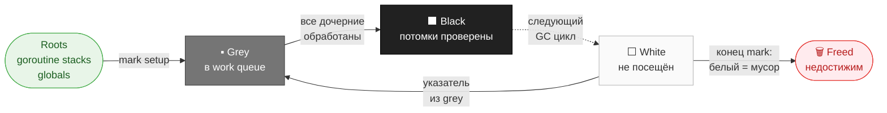
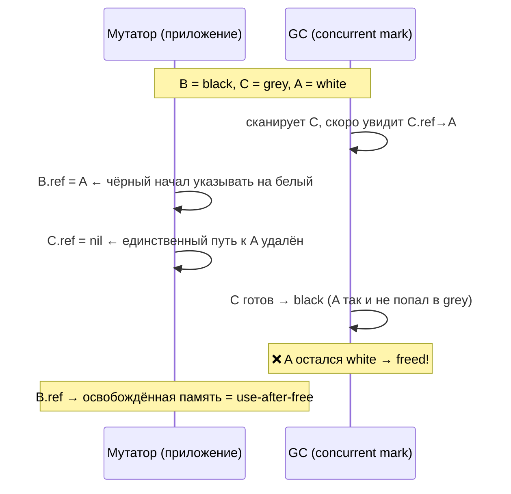
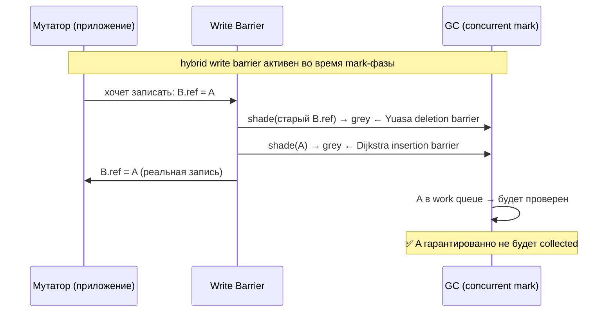

# Garbage Collector

GC освобождает разработчика от ручного управления памятью, но senior-уровень — это понимание алгоритма, write barrier, настроечных параметров и поведения в production под нагрузкой.

## Содержание

- [Tri-color mark-and-sweep](#tri-color-mark-and-sweep)
- [Проблема concurrent GC и write barrier](#проблема-concurrent-gc-и-write-barrier)
- [Фазы GC в Go](#фазы-gc-в-go)
- [GOGC: когда запускается GC](#gogc-когда-запускается-gc)
- [GOMEMLIMIT: защита от OOMKilled](#gomemlimit-защита-от-oomkilled)
- [sync.Pool](#syncpool)
- [Allocation churn: основной рычаг оптимизации](#allocation-churn-основной-рычаг-оптимизации)
- [Диагностика](#диагностика)
- [Типовые production-сценарии](#типовые-production-сценарии)
- [Interview-ready answer](#interview-ready-answer)

## Tri-color mark-and-sweep

GC делит объекты на три цвета:

```
Белые (white)  — не посещены; кандидаты на удаление по завершению mark-фазы
Серые (grey)   — посещены, но потомки ещё не проверены; находятся в work queue
Чёрные (black) — посещены, все потомки тоже посещены; точно живые
```

Алгоритм mark-фазы:

```
1. Всё переходит в white.
2. Root objects (goroutine stacks, globals, finalizers) → grey queue.
3. Пока grey queue не пуста:
   a. Взять объект из grey queue.
   b. Для каждого указателя внутри: если target белый → покрасить в grey.
   c. Текущий объект → black.
4. По завершении: все белые объекты недостижимы → sweep (освободить).
```

Sweep-фаза:
- Белые span-ы помечаются как свободные в heap арене.
- Происходит **конкурентно** с работой приложения.



## Проблема concurrent GC и write barrier

Если GC сканирует heap **одновременно** с мутатором (приложением), мутатор может нарушить инвариант:

```
Инвариант tri-color: чёрный объект не должен указывать на белый.

Что может сделать мутатор:
  1. black.ptr = white_obj   // чёрный начал указывать на белый
  2. grey.ptr = nil          // единственный путь до white_obj удалён

Результат: white_obj будет собран GC, хотя он ещё нужен → use-after-free.
```

**Write barrier** — код, который выполняется при каждой записи указателя и поддерживает инвариант.

Go 1.14+ использует **hybrid write barrier** (Dijkstra insertion + Yuasa deletion):

```go
// Псевдокод write barrier при записи: *slot = ptr
writeBarrier(*slot, ptr):
    shade(*slot)  // старое значение → grey (deletion barrier)
    shade(ptr)    // новое значение → grey (insertion barrier)
    *slot = ptr
```

Write barrier активен только во время mark-фазы. После mark termination он отключается.

Важное следствие: с hybrid write barrier стеки горутин нужно сканировать **только один раз** (в STW mark setup) — это сократило паузы.

**Без write barrier** — гонка между мутатором и GC:



**С hybrid write barrier** — оба значения красятся в grey:



## Фазы GC в Go

```
STW Mark Setup         (< 1 ms)
────────────────────────────────
• Stop The World (все горутины в safe point)
• Включить write barrier
• Сделать snapshot всех горутин-стеков как grey roots
• Включить GC assist (горутины помогают GC при аллокации)
• Start The World

Concurrent Mark        (сотни мс при большом heap)
────────────────────────────────
• GC worker goroutines сканируют heap конкурентно с приложением
• Write barrier поддерживает инвариант
• GC assist: при аллокации новой памяти goroutine обязана "помочь" GC
  пропорционально аллоцированному объёму (backpressure на allocation rate)

STW Mark Termination   (< 1 ms)
────────────────────────────────
• Stop The World
• Flush work queues
• Отключить write barrier
• Start The World

Concurrent Sweep       (параллельно с работой)
────────────────────────────────
• Вернуть белые spans в heap
• Происходит lazy — span возвращается когда из него нужна аллокация
```

**Паузы**: STW фазы обычно < 1 мс. Concurrent mark не является паузой — приложение работает.

```mermaid
gantt
    title Go GC Cycle (схематично, не в масштабе)
    dateFormat  X
    axisFormat  %%

    section Приложение
    Нормальная работа      : a1, 0,  10
    ⚡ STW pause            : crit, a2, 10, 11
    Работа  +  GC Assist   : a3, 11, 80
    ⚡ STW pause            : crit, a4, 80, 81
    Нормальная работа      : a5, 81, 100

    section GC Workers
    Mark Setup             : crit,   g1, 10, 11
    Concurrent Mark        : active, g2, 11, 80
    Mark Termination       : crit,   g3, 80, 81
    Concurrent Sweep       : done,   g4, 81, 100
```



## GOGC: когда запускается GC

`GOGC` (default = 100) определяет trigger:

```
Next GC target = live_heap_after_last_GC × (1 + GOGC/100)

GOGC=100 (default): если после GC осталось 50 MB → следующий GC при 100 MB
GOGC=50:            → следующий GC при 75 MB  (агрессивнее, меньше memory)
GOGC=200:           → следующий GC при 150 MB (реже, больше memory overhead)
GOGC=off:           GC не запускается вообще (только для тестов/бенчмарков)
```

```go
import "runtime/debug"

// Увеличить порог — реже GC, выше memory footprint
debug.SetGCPercent(200)

// Отключить для benchmark (не забудь включить обратно)
debug.SetGCPercent(-1)
defer debug.SetGCPercent(100)
```

Также GC запускается принудительно:
- каждые **2 минуты**, если не запускался (даже при малом allocation rate);
- при явном `runtime.GC()`.

## GOMEMLIMIT: защита от OOMKilled

Введен в **Go 1.19**. Устанавливает **мягкий** лимит памяти — GC будет агрессивно освобождать память перед его достижением.

**Проблема без GOMEMLIMIT в контейнере:**
```
Контейнер: memory.limit = 512 MB
Go GC:     запускается когда heap вырос на 100% от предыдущего live heap
           при 256 MB live heap → следующий GC при 512 MB (само по себе)
           но если live heap 300 MB → следующий GC при 600 MB → OOMKilled
```

**С GOMEMLIMIT:**
```go
import "runtime/debug"

// Рекомендуется: 90% от cgroup memory limit
// Если limit = 512 MB → GOMEMLIMIT = 460 MB
debug.SetMemoryLimit(460 * 1024 * 1024)
```

Или через переменную окружения:
```bash
GOMEMLIMIT=460MiB ./myapp
```

GC при приближении к GOMEMLIMIT переключается в режим "освобождать память любой ценой" — частые GC циклы, более агрессивный sweep. Это CPU overhead, но предотвращает OOMKilled.

GOMEMLIMIT не гарантирует, что программа не превысит лимит (это мягкий limit), но значительно снижает риск.

## sync.Pool

`sync.Pool` — пул переиспользуемых объектов для снижения allocation pressure.

```go
var bufPool = sync.Pool{
    New: func() any {
        return make([]byte, 0, 4096)
    },
}

func handler(w http.ResponseWriter, r *http.Request) {
    buf := bufPool.Get().([]byte)
    buf = buf[:0] // сбросить длину, сохранить capacity
    defer bufPool.Put(buf)

    // использование buf...
    json.NewDecoder(r.Body).Decode(&buf)
}
```

Ключевые свойства:
- Pool **очищается при каждом GC** — объекты не гарантированно переживают GC цикл;
- каждый P имеет свой локальный список в pool — минимальные конфликты;
- `Put` возвращает объект в **LIFO** порядке — горячие объекты остаются в cache;
- не замена cache с eviction policy; не для объектов с lifecycle (DB connections).

Когда sync.Pool полезен:
- частые аллокации одинакового размера на горячем пути (JSON decode/encode, HTTP тела);
- объект дорогой для инициализации (например, `bytes.Buffer`).

Когда sync.Pool не помогает:
- вне горячего пути;
- если аллокации разного размера (пул не поможет с fragmentation).

## Allocation churn: основной рычаг оптимизации

Allocation rate — главный фактор, влияющий на GC:

```
GC CPU overhead ∝ allocation_rate × average_object_lifetime
```

Типичные источники churn:
```go
// Плохо: аллокация на каждый request
func handleRequest(r *http.Request) {
    data := make([]byte, 0, 1024)  // аллокация
    json.Unmarshal(body, &data)    // ещё аллокации
    result := fmt.Sprintf("id=%d", id) // аллокация строки
}

// Лучше: переиспользование буфера
func handleRequest(r *http.Request) {
    buf := bufPool.Get().(*bytes.Buffer)
    defer bufPool.Put(buf)
    buf.Reset()
    // работаем с buf
}
```

Частые паттерны высокого churn:
- `fmt.Sprintf` в hot path (используй `strconv.AppendInt` или `strings.Builder`);
- мелкие объекты в slice через `append` в цикле без pre-allocation;
- `json.Marshal/Unmarshal` с многоуровневыми вложенными structs;
- temporary slices внутри heavily-called functions.

## Диагностика

```bash
# GC trace в stderr: показывает каждый GC цикл
GODEBUG=gctrace=1 ./myapp

# Пример строки gctrace:
# gc 14 @12.345s 1%: 0.021+2.3+0.14 ms clock, 0.085+1.2/4.5/0+0.56 ms cpu,
#    20->22->11 MB, 23 MB goal, 0 MB stacks, 0 MB globals, 8 P

# gc 14          — номер GC цикла
# @12.345s       — время с начала работы
# 1%             — процент CPU на GC (должен быть < 5-10%)
# 0.021+2.3+0.14 — время фаз: STW setup + concurrent mark + STW termination
# 20->22->11 MB  — heap до GC → heap в начале sweep → heap после sweep
# 23 MB goal     — цель следующего GC trigger
# 8 P            — GOMAXPROCS
```

```go
// runtime.MemStats для метрик
var ms runtime.MemStats
runtime.ReadMemStats(&ms)

fmt.Printf("Alloc: %v MB\n", ms.Alloc/1024/1024)
fmt.Printf("TotalAlloc: %v MB\n", ms.TotalAlloc/1024/1024) // cumulative
fmt.Printf("Sys: %v MB\n", ms.Sys/1024/1024)               // from OS
fmt.Printf("NumGC: %v\n", ms.NumGC)
fmt.Printf("GCCPUFraction: %.2f%%\n", ms.GCCPUFraction*100)
fmt.Printf("PauseNs (last): %v\n", ms.PauseNs[(ms.NumGC+255)%256])
```

```bash
# heap profile через pprof
go tool pprof http://localhost:6060/debug/pprof/heap

# allocation profile (inuse_objects, alloc_space)
go tool pprof -alloc_space http://localhost:6060/debug/pprof/heap

# benchmark с метриками аллокаций
go test -bench=. -benchmem ./...
# BenchmarkHandler-8   50000   24512 ns/op   4096 B/op   12 allocs/op
```

## Типовые production-сценарии

### Высокий GCCPUFraction (> 10%)

Причина: слишком высокий allocation rate.  
Что смотреть: `alloc_space` профиль в pprof — найти топ-аллокаторов.  
Что делать: sync.Pool на горячем пути, убрать fmt.Sprintf из hot path, pre-allocate slices.

### OOMKilled в Kubernetes

Причина: GOMEMLIMIT не установлен; GC не успевает освобождать memory перед лимитом.  
Что делать: `GOMEMLIMIT=90% × container memory limit` + automaxprocs.

### Высокие p99 latency при нормальном p50

Причина: GC assist — горутины принудительно помогают GC при аллокации, что добавляет latency.  
Что смотреть: `gctrace`, совпадение GC циклов со скачками latency.  
Что делать: снизить allocation rate на critical path; рассмотреть увеличение GOGC.

### RSS растет, но Alloc стабилен

Причина: Go держит освобожденную память у себя (не возвращает OS сразу).  
Go использует `MADV_DONTNEED` или `MADV_FREE` — страницы помечаются как можно переиспользовать, но виртуальная память не уменьшается.  
Что смотреть: `/proc/pid/status` — `VmRSS` vs `VmSize`.

## Interview-ready answer

**"Как работает GC в Go?"**

Go использует **tri-color concurrent mark-and-sweep**. Объекты делятся на белые (не посещены), серые (посещены, потомки не проверены) и чёрные (посещены, потомки проверены). GC начинает с корней (goroutine stacks, globals) → grey, потом последовательно красит потомков. Белые объекты в конце — мусор.

Проблема concurrent GC: мутатор может нарушить инвариант (черный→белый), поэтому есть **write barrier** — при записи указателя, оба (старое и новое значение) покрашиваются в серый. В Go 1.14+ **hybrid write barrier** позволяет сканировать стеки только один раз — отсюда STW паузы < 1 мс.

GC фазы: STW mark setup (< 1ms) → concurrent mark → STW mark termination (< 1ms) → concurrent sweep.

**GOGC** (default 100): GC запускается когда heap вырос на 100% от live heap предыдущего цикла. **GOMEMLIMIT** (Go 1.19): мягкий лимит памяти — при приближении к лимиту GC становится агрессивным; в контейнерах устанавливается в 90% от cgroup memory limit, защищает от OOMKilled.

Главный рычаг снижения GC давления — **allocation rate**: меньше коротоживущих аллокаций на hot path. Инструменты: `-benchmem`, `pprof -alloc_space`, `GODEBUG=gctrace=1`.
