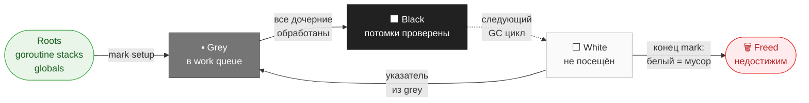
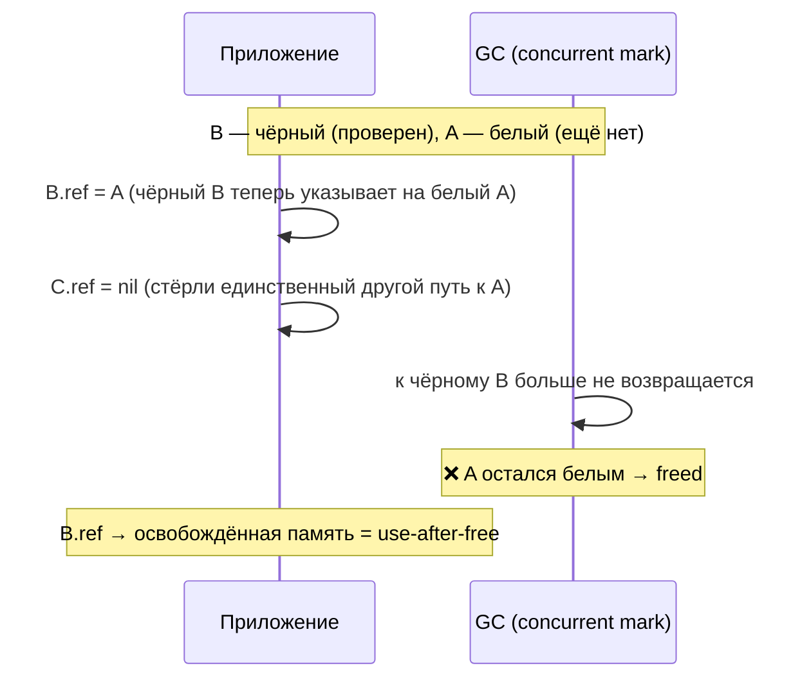
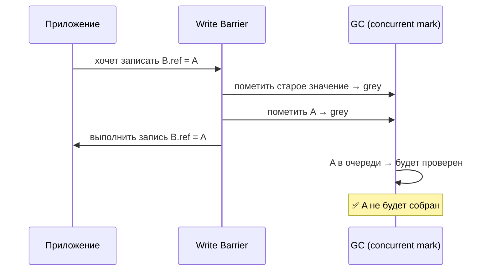
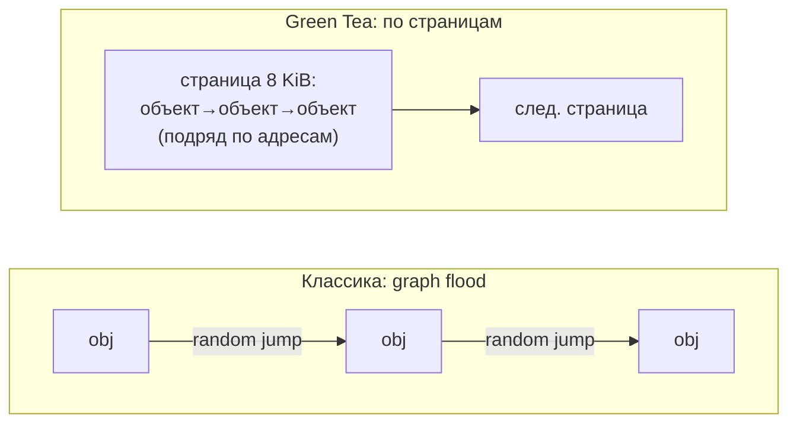

# Garbage Collector

GC освобождает разработчика от ручного управления памятью, но senior-уровень — это понимание алгоритма, write barrier, настроечных параметров и поведения в production под нагрузкой.

## Содержание

- [Tri-color mark-and-sweep](#tri-color-mark-and-sweep)
- [Проблема concurrent GC и write barrier](#проблема-concurrent-gc-и-write-barrier)
- [Фазы GC в Go](#фазы-gc-в-go)
- [Green Tea GC: новый алгоритм маркировки (Go 1.25+)](#green-tea-gc-новый-алгоритм-маркировки-go-125)
- [GOGC: когда запускается GC](#gogc-когда-запускается-gc)
- [GOMEMLIMIT: защита от OOMKilled](#gomemlimit-защита-от-oomkilled)
- [sync.Pool](#syncpool)
- [Allocation churn: основной рычаг оптимизации](#allocation-churn-основной-рычаг-оптимизации)
- [Диагностика](#диагностика)
- [Типовые production-сценарии](#типовые-production-сценарии)
- [Interview-ready answer](#interview-ready-answer)

## Tri-color mark-and-sweep

GC делит объекты на три цвета:

```
Белые (white)  — не посещены; кандидаты на удаление по завершению mark-фазы
Серые (grey)   — посещены, но потомки ещё не проверены; находятся в work queue
Чёрные (black) — посещены, все потомки тоже посещены; точно живые
```

Алгоритм mark-фазы:

```
1. Всё переходит в white.
2. Root objects (goroutine stacks, globals, finalizers) → grey queue.
3. Пока grey queue не пуста:
   a. Взять объект из grey queue.
   b. Для каждого указателя внутри: если target белый → покрасить в grey.
   c. Текущий объект → black.
4. По завершении: все белые объекты недостижимы → sweep (освободить).
```

Sweep-фаза:
- Белые span-ы помечаются как свободные в heap арене.
- Происходит **конкурентно** с работой приложения.


```mermaid
flowchart LR
    Root(["Roots\ngoroutine stacks\nglobals"])
    W["⬜ White\nне посещён"]
    G["▪ Grey\nв work queue"]
    B["⬛ Black\nпотомки проверены"]
    F(["🗑 Freed\nнедостижим"])

    Root -->|"mark setup"| G
    W   -->|"указатель\nиз grey"| G
    G   -->|"все дочерние\nобработаны"| B
    W   -->|"конец mark:\nбелый = мусор"| F
    B   -. "следующий\nGC цикл" .-> W

    style Root fill:#e8f5e8,stroke:#4caf50,color:#1b5e20
    style W    fill:#fafafa,stroke:#bbb,color:#333
    style G    fill:#757575,stroke:#424242,color:#fff
    style B    fill:#212121,stroke:#000,color:#fff
    style F    fill:#ffebee,stroke:#e53935,color:#b71c1c
```

## Проблема concurrent GC и write barrier

GC красит объекты **одновременно** с работой приложения. А приложение в это время свободно переставляет указатели — и может случайно «спрятать» живой объект от сборщика.

**В чём опасность.** Вспомни правило цветов: чёрный объект — это «уже проверен, GC к нему больше не вернётся». Теперь представь:

1. объект **B уже чёрный** (GC его обошёл и закрыл);
2. приложение пишет `B.ref = A`, где **A ещё белый** (GC до него не дошёл);
3. и одновременно стирает единственную другую ссылку на A: `C.ref = nil`.

Теперь на A ссылается только чёрный B — но к B сборщик уже не вернётся. Значит A так и останется белым → GC его освободит → приложение получит **use-after-free** через `B.ref`. Это и есть нарушение инварианта «чёрный не должен указывать на белый».

**Write barrier** — это крошечный кусочек кода, который компилятор вставляет **перед каждой записью указателя**. Его задача — чтобы такой объект не потерялся: при записи он помечает затронутые объекты как «надо проверить» (красит в grey), и они гарантированно попадут в обход GC.

```go
// что делает write barrier при `*slot = ptr` во время mark-фазы:
shade(*slot) // старое значение → grey (вдруг это была последняя ссылка на него)
shade(ptr)   // новое значение  → grey (вдруг оно ещё белое)
*slot = ptr  // и только теперь сама запись
```

Красит **и старое, и новое** значение — поэтому ни один из сценариев потери не проходит. Важные свойства:

- работает **только во время concurrent mark**; вне сборки записи указателей идут напрямую, без накладных расходов;
- благодаря покраске старого значения стеки горутин достаточно просканировать **один раз** (в STW mark setup), не пересканируя их в конце — это и держит паузы < 1 мс.

**Без write barrier** объект теряется (гонка приложения и GC):


```mermaid
sequenceDiagram
    participant M as Приложение
    participant GC as GC (concurrent mark)

    Note over M,GC: B — чёрный (проверен), A — белый (ещё нет)

    M   ->> M:  B.ref = A   (чёрный B теперь указывает на белый A)
    M   ->> M:  C.ref = nil (стёрли единственный другой путь к A)
    GC  ->> GC: к чёрному B больше не возвращается
    Note over GC: ❌ A остался белым → freed
    Note over M:  B.ref → освобождённая память = use-after-free
```

**С write barrier** запись перехватывается, A красится в grey и доживёт до проверки:


```mermaid
sequenceDiagram
    participant M  as Приложение
    participant WB as Write Barrier
    participant GC as GC (concurrent mark)

    M  ->> WB: хочет записать B.ref = A
    WB ->> GC: пометить старое значение → grey
    WB ->> GC: пометить A → grey
    WB ->> M:  выполнить запись B.ref = A
    GC ->> GC: A в очереди → будет проверен
    Note over GC: ✅ A не будет собран
```

> Формально это называется **hybrid write barrier** (с Go 1.14): «hybrid», потому что красит и удаляемое, и добавляемое значение. Знать термин полезно для собеса, но суть — выше: перед записью указателя пометить затронутые объекты, чтобы GC их не потерял.

## Фазы GC в Go

```
STW Sweep Termination  (< 1 ms, обычно нечего делать)
────────────────────────────────
• Stop The World
• finishsweep_m(): домести остатки sweep ПРОШЛОГО цикла, если есть
  (в норме уже подметено — см. proportional sweep ниже)
• нельзя начать новый mark, пока на span'ах висят старые mark-биты
• Start The World

STW Mark Setup         (< 1 ms)
────────────────────────────────
• Stop The World (все горутины в safe point)
• Включить write barrier
• Сделать snapshot всех горутин-стеков как grey roots
• Включить GC assist (горутины помогают GC при аллокации)
• Start The World

Concurrent Mark        (сотни мс при большом heap)
────────────────────────────────
• dedicated mark workers (~25% GOMAXPROCS) сканируют heap конкурентно
• Write barrier поддерживает инвариант
• GC assist: аллоцирующая goroutine сама "доплачивает" маркировкой
  пропорционально аллоцированному объёму (backpressure на allocation rate)

STW Mark Termination   (< 1 ms)
────────────────────────────────
• Stop The World
• Flush work queues (слить per-P gcWork/wbBuf, дочистить остаток серого)
• Отключить write barrier
• Start The World

Concurrent Sweep       (параллельно с работой)
────────────────────────────────
• Освободить мёртвые слоты в белых spans (в free-list Go, не OS)
• Происходит lazy + bgsweep + proportional sweep — размазано по времени
```

Цикл **закольцован**: Concurrent Sweep одного цикла должен завершиться до Sweep Termination следующего (детали ниже).

**Паузы**: STW фазы обычно < 1 мс. Concurrent mark не является паузой — приложение работает.


```mermaid
gantt
    title Go GC Cycle (схематично, не в масштабе)
    dateFormat  X
    axisFormat  %%

    section Приложение
    Нормальная работа      : a1, 0,  10
    ⚡ STW pause            : crit, a2, 10, 11
    Работа  +  GC Assist   : a3, 11, 80
    ⚡ STW pause            : crit, a4, 80, 81
    Нормальная работа      : a5, 81, 100

    section GC Workers
    Mark Setup             : crit,   g1, 10, 11
    Concurrent Mark        : active, g2, 11, 80
    Mark Termination       : crit,   g3, 80, 81
    Concurrent Sweep       : done,   g4, 81, 100

    section Write Barrier
    выключен               : done,   w1, 0, 10
    ВКЛЮЧЁН (всё mark-окно) : active, w2, 10, 81
    выключен               : done,   w3, 81, 100
```

Write barrier включается в STW Mark Setup и выключается в STW Mark Termination — он активен **всё время concurrent mark** (когда приложение работает одновременно с GC). Вне этого окна записи указателей идут напрямую, без накладных расходов. Короткие STW по краям нужны лишь чтобы согласованно включить/выключить барьер и снять/доделать корни — сам mark под паузой не держится.

### Кто делает работу маркировки: workers vs assist

Маркировку во время concurrent mark выполняют **две разные силы** — это часто путают:

**1. Dedicated mark workers — отдельные фоновые горутины GC.** Рантайм при старте сборки поднимает их примерно на **25% от `GOMAXPROCS`** (т.е. при 8 ядрах ~2 воркера). Они делают основную массу маркировки параллельно с приложением. Вот это — «системные горутины GC».

**2. GC assist — это НЕ отдельные горутины, а «налог» на твои же горутины.** Когда прикладная горутина аллоцирует во время mark-фазы, её заставляют тут же самой просканировать порцию объектов. Никакой новой горутины не создаётся — помогает та самая горутина, что вызвала `make`/`new`.

Зачем нужен assist: если приложение аллоцирует **быстрее**, чем воркеры успевают красить, heap рос бы быстрее, чем идёт mark, и сборка никогда не догнала бы цель → heap раздувается. Assist — это **backpressure на скорость аллокации**:

```
горутина аллоцирует N байт во время mark-фазы
  → у каждой горутины есть assist credit
  → аллокация списывает credit (пропорционально N)
  → если credit ушёл в минус → горутина ОБЯЗАНА просканировать
    порцию объектов (заработать credit) ПРЕЖДЕ чем продолжить аллокацию
```

Принцип **pay-as-you-go**: чем агрессивнее горутина плодит мусор, тем сильнее её притормаживают, заставляя платить маркировкой. Саморегуляция держит баланс «аллокация ↔ сборка».

| | Кто это | Новая горутина? |
|---|---|---|
| **Dedicated mark workers** | отдельные фоновые горутины GC (~25% GOMAXPROCS) | да, поднимает рантайм |
| **GC assist** | **твоя же** аллоцирующая горутина делает mark-работу | нет — «налог» на существующую |

> Практическое следствие: если в `gctrace`/профиле видно много времени в `runtime.gcAssistAlloc` — приложение аллоцирует быстрее, чем GC успевает. Лечится снижением allocation rate (см. ниже) или, иногда, увеличением `GOGC`/`GOMEMLIMIT`, чтобы у GC было больше «форы».

**Как горутина вообще понимает, что сейчас фаза GC?** Она ничего не опрашивает — проверка зашита в сам путь аллокации, через который и так проходит каждый `new`/`make`:

```
mallocgc(size, ...):                  // через эту функцию идёт ЛЮБАЯ heap-аллокация
    if gcBlackenEnabled != 0 {        // ← дешёвый if по глобальному флагу: мы в mark-фазе?
        g.gcAssistBytes -= size*ratio // списать кредит у ТЕКУЩЕЙ горутины
        if g.gcAssistBytes < 0 {      // ушли в долг?
            gcAssistAlloc(g)          // → просканировать порцию, вернуть кредит
        }
    }
    // ... собственно выделение памяти
```

Три детали:
- **`gcBlackenEnabled`** — глобальный флаг, который рантайм выставляет в `1` во время STW Mark Setup. Вне GC ветка не берётся — это один if, почти бесплатно.
- **`g.gcAssistBytes`** — кредит/долг хранится в самой горутине (поле в `runtime.g`), поэтому учёт per-goroutine и без блокировок.
- **STW гарантирует согласованность**: флаг переключается, когда все горутины в safe points, поэтому после рестарта мира все видят новое значение одинаково — нет гонки «одна уже считает assist, другая ещё нет».

Тот же приём у **write barrier**: компилятор вставляет код перед записью указателя, но барьер сначала проверяет глобальный `writeBarrier.enabled` и делает работу только если он включён (тоже выставляется в STW). Везде один паттерн: **дешёвая проверка глобального флага на горячем пути, согласованно переключаемого в STW**.

### Lazy sweep: освобождение «по требованию»

Когда mark закончился, все белые spans — это мусор. Но Go **не выметает их все сразу** (это была бы заметная работа на большом heap). Вместо этого sweep происходит **лениво и инкрементально**: конкретный span подметается (его мёртвые объекты помечаются как свободные слоты) **только когда из этого span реально понадобится аллокация**.

Как это выглядит на практике:

```
GC mark закончился → есть N «грязных» (unswept) spans
аллокатор хочет span под size class
   → берёт unswept span → СНАЧАЛА подметает его (освобождает мёртвые слоты)
   → отдаёт под аллокацию
```

Именно поэтому у `mcentral` два набора — **swept** и **unswept** (помнишь `[2]spanSet` из [02-allocator](./02-allocator.md#mcentral--per-size-class-список)): аллокатор, прежде чем выдать span, при необходимости домётает его на лету.

Зачем так:

- **нет большой паузы на sweep** — стоимость размазана по аллокациям (pay-as-you-go), вместо «остановиться и вымести весь heap»;
- span, к которому после GC никто не обращается, может вообще не подметаться какое-то время — лишней работы нет.

Гарантия корректности: **все spans прошлого цикла обязаны быть подметены до старта следующего GC**. Это жёсткий инвариант — на неподметённом span ещё висят mark-биты прошлого цикла (`gcmarkBits`/`allocBits` переиспользуются между циклами), и начать на нём новую маркировку нельзя: состояния двух циклов смешаются, живые/мёртвые перепутаются.

Поэтому новый цикл GC начинается **не с mark, а со sweep termination** — короткой STW-фазы, где `finishsweep_m()` форсированно домётает всё, что осталось unswept:

```
Новый GC триггернулся:
  1. STW Sweep Termination → finishsweep_m(): домести остатки прошлого цикла
  2. STW Mark Setup
  3. Concurrent Mark
  4. STW Mark Termination
  5. Concurrent Sweep (ленивый sweep этого цикла)
```

Но `finishsweep_m` — это **страховка**, а не основной путь. Обычно к старту следующего GC всё уже подметено тремя способами: on-demand (аллокатор метёт span при заборе памяти), фоновый **`bgsweep`** в простое, и **proportional sweep** — рантайм темпирует sweep пропорционально скорости аллокации, чтобы домести как раз к следующему циклу. Если приложение «успевает» (почти всегда так), на sweep termination мести нечего и эта STW почти мгновенна; `finishsweep_m` реально работает, только если аллокация обогнала sweep.

Важно не путать два разных «освобождения»:

| | Что делает | Куда уходит память |
|---|---|---|
| **sweep** | помечает мёртвые слоты в span свободными | обратно во free-list **Go** (переиспользование), не OS |
| **scavenger** | отдаёт простаивающие страницы OS-ядру | в **OS** (`madvise`) |

То есть sweep возвращает память для повторного использования внутри процесса, а до OS она доезжает уже через scavenger (см. раздел про возврат памяти в [01-stack-and-heap](./01-stack-and-heap.md#возврат-памяти-os-scavenger)).

### Work queues и «Flush» на mark termination

Шаг `Flush work queues` в STW Mark Termination — не формальность, а то, что гарантирует: mark действительно завершён и ни один живой объект не потерян. Чтобы понять его, надо знать, **как во время mark хранится список «что ещё просканировать»**.

Серые объекты лежат не в одной общей очереди, а **распределённо** (чтобы воркеры не толкались на блокировках — как run-queue у планировщика):

| Структура | Что это |
|---|---|
| **`gcWork`** (per-P) | локальные work-буферы (`wbuf`) с указателями на серые объекты; воркер берёт работу отсюда **без блокировок** |
| **`wbBuf`** (per-P) | буфер write barrier: погреенные при записи указатели **батчатся** локально и пачкой сбрасываются в `gcWork` (дешевле, чем красить по одному) |
| **глобальный пул** (`work.full`/`work.empty`) | переполнился локальный буфер → отдали в пул; опустел → взяли из пула |

К концу concurrent mark «работа» оказывается **размазана** по всем этим локальным буферам, и пока мутатор бежит, write barrier продолжает докидывать новые серые объекты. Объявить «mark закончен» нельзя, пока где-то в per-P буфере висит непросканированный серый объект.

Поэтому в STW (мир остановлен → новые объекты больше не греются) делается **flush**:

```
1. сбросить все per-P wbBuf  → в gcWork   (учесть последние записи указателей)
2. слить все локальные gcWork → в общий пул
3. дочистить остаток: просканировать всё ещё серое
   (на практике почти ноль — основное промаркировано конкурентно)
4. очередь пуста? → достижимый граф полностью помечен
   → можно отключить write barrier и идти в sweep
```

**Почему именно в STW:** будь мир не остановлен, write barrier продолжал бы добавлять серые объекты, и условие «очередь пуста» никогда бы стабильно не выполнилось (вечная гонка). Короткая остановка «замораживает» состояние, позволяет доскрести крошечный остаток и согласованно закрыть фазу — отсюда пауза < 1 мс.

Иначе говоря, **flush = собрать разбросанную по локальным буферам недоделанную работу в одно место и догнать её до нуля.**

## Green Tea GC: новый алгоритм маркировки (Go 1.25+)

**Green Tea** — экспериментальный сборщик, появившийся в **Go 1.25** (флаг сборки `GOEXPERIMENT=greenteagc`). Он планируется default'ом в **Go 1.26** (отключить можно через `GOEXPERIMENT=nogreenteagc`). Важно сразу понять, что это **не новый GC с нуля**: семантика та же — concurrent tri-color mark-and-sweep с тем же hybrid write barrier, GOGC и GOMEMLIMIT работают как раньше. Меняется только **как обходится heap в mark-фазе**.

### Какую проблему решает

Классический mark — это **graph flood**: обход графа объектов в глубину (DFS), идём по указателям от объекта к объекту. Проблема в том, что указатели ведут в случайные места heap:

```
Классический mark (graph flood):
  obj A → прыг на 0x4f00 → obj B → прыг на 0x0120 → obj C → прыг на 0x9a80 → ...
  ↑ каждый прыжок — почти гарантированный cache miss
```

На современном железе это упирается не в CPU, а в **память**: ~35% времени маркировки процессор простаивает, ожидая загрузку из RAM (cache miss). Причины:

- объекты редко лежат рядом со своими указателями → плохая cache locality;
- с ростом числа ядер на ядро приходится меньше memory bandwidth, плюс NUMA;
- общая work queue становится точкой контеншена при многих ядрах.

То есть mark стал **memory-latency-bound**, и просто добавить ядер не помогает.

### Как работает Green Tea: маркировка по страницам (span-based)

Идея: работать не с отдельными объектами, а со **страницами памяти (8 KiB)**. В work queue лежат не объекты, а страницы. Когда берём страницу — сканируем все «живые, но ещё не просканированные» объекты на ней **по порядку адресов**, последовательным проходом. Это и даёт spatial locality: процессор читает память линейно и эффективно префетчит.

```
Green Tea (page-based):
  взяли страницу 0x4000 → прошли все её объекты подряд (sequential read)
  → собрали указатели → добавили затронутые страницы в очередь
  ↑ последовательный доступ вместо случайных прыжков
```

Чтобы это работало, на каждый объект используется **два бита** метаданных вместо одного:

| Бит | Значение |
|---|---|
| **seen** | объект обнаружен (достижим) |
| **scanned** | указатели объекта уже обойдены |

Разница `seen \ scanned` для страницы = «что осталось просканировать на этом проходе». Отличия от классики:

- очередь — **FIFO**, а не LIFO-стек: объекты успевают «накопиться» на странице, прежде чем её начнут сканировать (больше работы за один последовательный проход);
- одну страницу можно посещать несколько раз (объекты на ней обнаруживаются постепенно).


```mermaid
flowchart LR
    subgraph GF["Классика: graph flood"]
      direction LR
      A1["obj"] -->|random jump| A2["obj"] -->|random jump| A3["obj"]
    end
    subgraph GT["Green Tea: по страницам"]
      direction LR
      P1["страница 8 KiB:<br/>объект→объект→объект<br/>(подряд по адресам)"] --> P2["след. страница"]
    end
```

### SIMD-ускорение

Раньше векторизовать mark было невозможно — обход слишком нерегулярный (объекты разного размера, непредсказуемые переходы). В Green Tea работа стала регулярной: метаданные страницы помещаются в пару 512-битных регистров, и сканирование делается на **AVX-512** (инструкция `VGF2P8AFFINEQB`) за единицы тактов на страницу. Векторное ускорение приезжает вместе с Go 1.26 и даёт ещё ~10% сверху на подходящем железе (Zen 4 / Ice Lake+).

### Цифры и применимость

- Медианно ~**10%** меньше времени в GC, на отдельных нагрузках до **40%**. Если приложение тратило 10% CPU на GC → экономия 1–4% общего CPU.
- Уже раскатан в проде у Google.
- Лучше всего на heap с **регулярной структурой** (много однотипных объектов, накапливающихся на странице). Хуже там, где на странице по одному объекту на проход (sparse layout) — но даже при заполнении ~2% страницы Green Tea уже выигрывает у graph flood.

### Как попробовать

```bash
# Go 1.25: собрать с Green Tea
GOEXPERIMENT=greenteagc go build ./...

# измерить эффект — сравнить GCCPUFraction / gctrace до и после
GOEXPERIMENT=greenteagc GODEBUG=gctrace=1 ./myapp

# Go 1.26: включён по умолчанию, отключить так
GOEXPERIMENT=nogreenteagc go build ./...
```

Эффект сильно зависит от профиля аллокаций, поэтому **меряй на своей нагрузке** (`-benchmem`, `gctrace`, `pprof`). Бывают отчёты, где разницы нет — это нормально для нагрузок с малым GC-overhead или нерегулярным heap.

## GOGC: когда запускается GC

`GOGC` (default = 100) определяет trigger:

```
Next GC target = live_heap_after_last_GC × (1 + GOGC/100)

GOGC=100 (default): если после GC осталось 50 MB → следующий GC при 100 MB
GOGC=50:            → следующий GC при 75 MB  (агрессивнее, меньше memory)
GOGC=200:           → следующий GC при 150 MB (реже, больше memory overhead)
GOGC=off:           GC не запускается вообще (только для тестов/бенчмарков)
```

```go
import "runtime/debug"

// Увеличить порог — реже GC, выше memory footprint
debug.SetGCPercent(200)

// Отключить для benchmark (не забудь включить обратно)
debug.SetGCPercent(-1)
defer debug.SetGCPercent(100)
```

Также GC запускается принудительно:
- каждые **2 минуты**, если не запускался (даже при малом allocation rate);
- при явном `runtime.GC()`.

## GOMEMLIMIT: защита от OOMKilled

Введен в **Go 1.19**. Устанавливает **мягкий** лимит памяти — GC будет агрессивно освобождать память перед его достижением.

**Проблема без GOMEMLIMIT — на числах.** Вспомним формулу trigger'а: `NextGC = live_heap × (1 + GOGC/100)`. При дефолтном `GOGC=100` это значит «следующий GC, когда heap удвоится относительно живого после прошлого прохода». А теперь представим VM/контейнер с лимитом RSS **10 GB**:

```
Лимит RSS:               10 GB
Live heap после GC:      5.1 GB     (для простоты считаем RSS ≈ heap)
GOGC = 100 (default)

NextGC = 5.1 GB × (1 + 100/100) = 10.2 GB   ← цель следующего GC

10.2 GB > 10 GB  →  процесс УБЬЁТ OOM Killer ДО того, как GC сработает!
```

Это контринтуитивно: 5.1 GB при лимите 10 GB кажется «ещё есть запас», но GC по умолчанию даже не планирует запускаться раньше 10.2 GB. Приложение спокойно дорастает до лимита и получает SIGKILL. Чем больше heap, тем опаснее: `GOGC=100` всегда целится в **×2**, не зная ни про какой RSS-лимит.

> Замечание про «RSS ≈ heap» — упрощение. Реально RSS ещё выше heap из-за метаданных аллокатора, фрагментации и стеков горутин, так что запас до OOM на практике **ещё меньше**, чем в расчёте.

**Решение — GOMEMLIMIT.** Он сообщает рантайму потолок памяти, и GC начинает запускаться раньше `NextGC`, не дожидаясь удвоения:

```
GOMEMLIMIT = 9 GB  (≈90% от 10 GB)

Теперь GC сработает не на 10.2 GB, а при приближении к 9 GB,
даже если по GOGC ещё «рано». OOM предотвращён.
```

**С GOMEMLIMIT в коде:**
```go
import "runtime/debug"

// Рекомендуется: 90% от cgroup memory limit
// Если limit = 512 MB → GOMEMLIMIT = 460 MB
debug.SetMemoryLimit(460 * 1024 * 1024)
```

Или через переменную окружения:
```bash
GOMEMLIMIT=460MiB ./myapp
```

GC при приближении к GOMEMLIMIT переключается в режим "освобождать память любой ценой" — частые GC циклы, более агрессивный sweep. Это CPU overhead, но предотвращает OOMKilled.

GOMEMLIMIT не гарантирует, что программа не превысит лимит (это мягкий limit), но значительно снижает риск.

### Обратная сторона: GC death spiral

GOMEMLIMIT спасает, только если **живых данных меньше лимита**. Если же `live heap` сам по себе подбирается к GOMEMLIMIT (например, реально держим 8.8 GB при лимите 9 GB), GC начинает запускаться почти непрерывно, пытаясь удержать память, — это **GC death spiral** (thrashing): процессор почти весь уходит на сборку, throughput падает в пол.

Чтобы это не превратилось в полный stall, рантайм ограничивает GC сверху **50% CPU**. Но цена — он перестаёт держать лимит: память «прорывает» GOMEMLIMIT (на то он и soft), и дальше уже OOM Killer. То есть упёршийся в лимит live set — это не проблема тюнинга GC, а сигнал, что данных физически много.

**Что делать, когда упёрлись:**

| Симптом | Действие |
|---|---|
| `GOGC` целится выше RSS-лимита (наш кейс 10.2 > 10 GB) | поставить `GOMEMLIMIT ≈ 90%` лимита — базовая защита |
| высокий `GCCPUFraction`, GC почти непрерывный | live set велик → **дать больше RAM** или уменьшить рабочий набор (стримить, а не держать всё в памяти; пагинация; внешний кэш/диск) |
| короткие всплески аллокаций ловят OOM | снизить allocation rate (sync.Pool, буферы), `GOMEMLIMIT` сгладит пики |
| хочется и защиты, и без thrashing | `GOMEMLIMIT` как «аварийный потолок» + `GOGC` оставить для нормального ритма; не выставлять `GOMEMLIMIT` впритык к live set |

Антипаттерн: ставить `GOMEMLIMIT` очень низко «чтобы экономить память» при большом live set — получишь death spiral вместо экономии. GOMEMLIMIT — это страховка от OOM, а не способ впихнуть приложение в недостаточную память.

> `GOGC=off` + `GOMEMLIMIT` — рабочая комбинация для batch/throughput-нагрузок: GC не дёргается по росту heap вообще и срабатывает **только** у лимита памяти. Но если live set приблизится к лимиту — тот же death spiral, так что только при заведомо достаточной памяти.

## sync.Pool

`sync.Pool` — пул переиспользуемых объектов для снижения allocation pressure.

```go
var bufPool = sync.Pool{
    New: func() any {
        return make([]byte, 0, 4096)
    },
}

func handler(w http.ResponseWriter, r *http.Request) {
    buf := bufPool.Get().([]byte)
    buf = buf[:0] // сбросить длину, сохранить capacity
    defer bufPool.Put(buf)

    // использование buf...
    json.NewDecoder(r.Body).Decode(&buf)
}
```

Ключевые свойства:
- Pool **очищается при каждом GC** — объекты не гарантированно переживают GC цикл;
- каждый P имеет свой локальный список в pool — минимальные конфликты;
- `Put` возвращает объект в **LIFO** порядке — горячие объекты остаются в cache;
- не замена cache с eviction policy; не для объектов с lifecycle (DB connections).

Когда sync.Pool полезен:
- частые аллокации одинакового размера на горячем пути (JSON decode/encode, HTTP тела);
- объект дорогой для инициализации (например, `bytes.Buffer`).

Когда sync.Pool не помогает:
- вне горячего пути;
- если аллокации разного размера (пул не поможет с fragmentation).

## Allocation churn: основной рычаг оптимизации

Allocation rate — главный фактор, влияющий на GC:

```
GC CPU overhead ∝ allocation_rate × average_object_lifetime
```

Типичные источники churn:
```go
// Плохо: аллокация на каждый request
func handleRequest(r *http.Request) {
    data := make([]byte, 0, 1024)  // аллокация
    json.Unmarshal(body, &data)    // ещё аллокации
    result := fmt.Sprintf("id=%d", id) // аллокация строки
}

// Лучше: переиспользование буфера
func handleRequest(r *http.Request) {
    buf := bufPool.Get().(*bytes.Buffer)
    defer bufPool.Put(buf)
    buf.Reset()
    // работаем с buf
}
```

Частые паттерны высокого churn:
- `fmt.Sprintf` в hot path (используй `strconv.AppendInt` или `strings.Builder`);
- мелкие объекты в slice через `append` в цикле без pre-allocation;
- `json.Marshal/Unmarshal` с многоуровневыми вложенными structs;
- temporary slices внутри heavily-called functions.

## Диагностика

> 🧪 **Запусти сам:** [examples/gctrace](./examples/gctrace/) — синтетическая программа, на которой видно срабатывание GC, формулу `NextGC ≈ 2×live`, влияние `GOGC`/`GOMEMLIMIT` и рост `GCCPUFraction` под нагрузкой. `GODEBUG=gctrace=1 go run . -live=50`

```bash
# GC trace в stderr: показывает каждый GC цикл
GODEBUG=gctrace=1 ./myapp

# Пример строки gctrace:
# gc 14 @12.345s 1%: 0.021+2.3+0.14 ms clock, 0.085+1.2/4.5/0+0.56 ms cpu,
#    20->22->11 MB, 23 MB goal, 0 MB stacks, 0 MB globals, 8 P

# gc 14          — номер GC цикла
# @12.345s       — время с начала работы
# 1%             — процент CPU на GC (должен быть < 5-10%)
# 0.021+2.3+0.14 — время фаз: STW setup + concurrent mark + STW termination
# 20->22->11 MB  — heap до GC → heap в начале sweep → heap после sweep
# 23 MB goal     — цель следующего GC trigger
# 8 P            — GOMAXPROCS
```

```go
// runtime.MemStats для метрик
var ms runtime.MemStats
runtime.ReadMemStats(&ms)

fmt.Printf("Alloc: %v MB\n", ms.Alloc/1024/1024)
fmt.Printf("TotalAlloc: %v MB\n", ms.TotalAlloc/1024/1024) // cumulative
fmt.Printf("Sys: %v MB\n", ms.Sys/1024/1024)               // from OS
fmt.Printf("NumGC: %v\n", ms.NumGC)
fmt.Printf("GCCPUFraction: %.2f%%\n", ms.GCCPUFraction*100)
fmt.Printf("PauseNs (last): %v\n", ms.PauseNs[(ms.NumGC+255)%256])
```

```bash
# heap profile через pprof
go tool pprof http://localhost:6060/debug/pprof/heap

# allocation profile (inuse_objects, alloc_space)
go tool pprof -alloc_space http://localhost:6060/debug/pprof/heap

# benchmark с метриками аллокаций
go test -bench=. -benchmem ./...
# BenchmarkHandler-8   50000   24512 ns/op   4096 B/op   12 allocs/op
```

## Типовые production-сценарии

### Высокий GCCPUFraction (> 10%)

Причина: слишком высокий allocation rate.  
Что смотреть: `alloc_space` профиль в pprof — найти топ-аллокаторов.  
Что делать: sync.Pool на горячем пути, убрать fmt.Sprintf из hot path, pre-allocate slices.

### OOMKilled в Kubernetes

Причина: GOMEMLIMIT не установлен; GC не успевает освобождать memory перед лимитом.  
Что делать: `GOMEMLIMIT=90% × container memory limit` + automaxprocs.

### Высокие p99 latency при нормальном p50

Причина: GC assist — горутины принудительно помогают GC при аллокации, что добавляет latency.  
Что смотреть: `gctrace`, совпадение GC циклов со скачками latency.  
Что делать: снизить allocation rate на critical path; рассмотреть увеличение GOGC.

### RSS растет, но Alloc стабилен

Причина: Go держит освобожденную память у себя (не возвращает OS сразу).  
Go использует `MADV_DONTNEED` или `MADV_FREE` — страницы помечаются как можно переиспользовать, но виртуальная память не уменьшается.  
Что смотреть: `/proc/pid/status` — `VmRSS` vs `VmSize`.

## Interview-ready answer

**1. «Как работает GC в Go?»**

- Go использует **tri-color concurrent mark-and-sweep**. Объекты делятся на белые (не посещены), серые (посещены, потомки не проверены) и чёрные (посещены, потомки проверены). GC начинает с корней (goroutine stacks, globals) → grey, потом последовательно красит потомков. Белые объекты в конце — мусор. Фазы: STW sweep termination → STW mark setup → concurrent mark → STW mark termination → concurrent sweep. Все STW < 1 мс, основная работа (mark, sweep) идёт конкурентно с приложением.

**2. «Зачем нужен write barrier, если есть Stop-the-World?»**

- Потому что STW в Go — это не весь GC, а лишь две короткие засечки по краям (< 1 мс). Основная маркировка идёт **конкурентно**, когда приложение работает и свободно переставляет указатели. Без защиты мутатор может «спрятать» живой объект (чёрный начал указывать на белый, а другой путь к белому стёрли) → use-after-free. **Write barrier** — код перед каждой записью указателя, который красит затронутые объекты в grey, чтобы GC их не потерял. Альтернатива — STW на всю фазу mark — давала бы паузы в сотни мс. Технически это `gcBlackenEnabled`-флаг + проверка на горячем пути.

**3. «Кто делает работу маркировки — отдельные горутины?»**

- Две силы. **Dedicated mark workers** — отдельные фоновые горутины GC (~25% GOMAXPROCS), делают основную маркировку. **GC assist** — это НЕ отдельные горутины, а «налог» на твои же аллоцирующие горутины: при `make`/`new` во время mark горутина обязана сама просканировать порцию объектов (per-G кредит `gcAssistBytes`). Это backpressure: аллоцируешь быстрее, чем GC успевает → сам же и доплачиваешь маркировкой.

**4. «Как GC триггерится и как его настраивать в контейнере?»**

- **GOGC** (default 100): GC запускается, когда heap вырос на 100% от live heap прошлого цикла (`NextGC = live × 2`). Проблема: при больших heap цель может оказаться выше cgroup-лимита → OOMKilled раньше, чем сработает GC. **GOMEMLIMIT** (Go 1.19): мягкий лимит — GC начинает собирать раньше, не дожидаясь удвоения. В контейнере ставят ~90% от memory.limit. Подвох: если live set сам близок к лимиту → GC death spiral (непрерывная сборка) — это сигнал, что нужно больше RAM, а не тюнинг.

**5. «Почему память не сразу возвращается, и куда?»**

- Два разных шага. **Sweep** освобождает мёртвые слоты обратно во free-list **Go** (для переиспользования), лениво — span метётся, когда из него нужна аллокация. До **OS** память доезжает отдельно — через **scavenger** (`madvise(MADV_DONTNEED/MADV_FREE)`). Поэтому RSS может держаться высоким даже после сборки. Главный рычаг снижения давления на GC — **allocation rate**: меньше короткоживущих аллокаций на hot path (буферы, `sync.Pool`, `[]T` вместо `[]*T`). Инструменты: `-benchmem`, `pprof -alloc_space`, `GODEBUG=gctrace=1`.

**6. «Что нового в GC последних версий Go?»**

- **Green Tea GC** (эксперимент в Go 1.25 через `GOEXPERIMENT=greenteagc`, default в Go 1.26). Семантика прежняя — tri-color concurrent mark-and-sweep, тот же write barrier, GOGC/GOMEMLIMIT без изменений. Меняется обход heap в mark-фазе: вместо graph flood (DFS по указателям со случайными прыжками по памяти и cache miss'ами — на это уходило ~35% времени маркировки) Green Tea маркирует **по страницам 8 KiB**, сканируя объекты подряд по адресам. Это даёт spatial locality, масштабируется по ядрам и позволяет SIMD-ускорение (AVX-512). Выигрыш ~10% времени GC медианно, до 40% на удачных нагрузках. Эффект зависит от регулярности heap — мерить надо на своей нагрузке.
