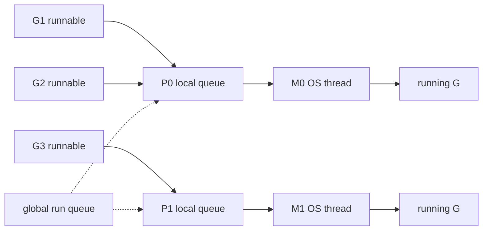

# Go Scheduler: G/M/P и preemption

Scheduler мультиплексирует goroutines на OS threads и ограничивает число одновременно исполняющих Go-код threads через `GOMAXPROCS`.

Материал ориентирован на Go 1.26. G/M/P, конкретные queues и runtime function names — implementation details, полезные для понимания и диагностики, но не гарантии языка.

## Содержание

- [Mental model G/M/P](#mental-model-gmp)
- [Как G, M и P связаны в runtime](#как-g-m-и-p-связаны-в-runtime)
- [Зачем нужен P](#зачем-нужен-p)
- [Состояния goroutine](#состояния-goroutine)
- [Run queues и work stealing](#run-queues-и-work-stealing)
- [Как scheduler ищет работу](#как-scheduler-ищет-работу)
- [Откуда берутся OS threads](#откуда-берутся-os-threads)
- [Preemption](#preemption)
- [sysmon](#sysmon)
- [GOMAXPROCS и containers](#gomaxprocs-и-containers)
- [Связь с syscall, netpoller и timers](#связь-с-syscall-netpoller-и-timers)
- [Диагностика](#диагностика)
- [Типичные ошибки](#типичные-ошибки)
- [Interview-ready answer](#interview-ready-answer)
- [Официальные источники](#официальные-источники)

## Mental model G/M/P

| Сущность | Простое объяснение | Что хранит/делает |
| --- | --- | --- |
| **G — goroutine** | задача | stack, execution state, причина ожидания |
| **M — machine** | OS thread | физически исполняет инструкции |
| **P — processor** | право и контекст для исполнения Go-кода | local run queue и per-P runtime state |



Основные правила:

- Go-код исполняет M, у которого есть P;
- количество P связано с `GOMAXPROCS`;
- M может временно существовать без P, например внутри blocking syscall;
- goroutine не привязана навсегда к thread и после park/resume может продолжить на другом M.

Аналогия: G — работа, M — worker, P — рабочее место с локальной очередью. Workers может быть больше, чем рабочих мест, но одновременно работать с Go-кодом могут только workers, получившие P.

## Как G, M и P связаны в runtime

Ссылки между сущностями объясняют, почему goroutine может мигрировать между threads:

```text
M
├── curg ──────────────> G, которую M исполняет сейчас
├── g0 ────────────────> системный stack scheduler/runtime
├── p ─────────────────> текущий P
└── oldp ──────────────> P до входа в syscall

P
├── m ─────────────────> текущий M
├── runq[256] ─────────> local runnable goroutines
├── runnext ───────────> приоритетная следующая G
└── timers/mcache/...  -> другой per-P runtime state

G
├── m ─────────────────> M только пока G исполняется
├── stack ─────────────> границы goroutine stack
├── sched ─────────────> сохранённые SP/PC/BP
└── atomicstatus ------> runnable/running/waiting/syscall/...
```

Когда G park или preempt, runtime сохраняет её execution context в `g.sched`. Позже другой M с P восстанавливает stack pointer и program counter и продолжает ту же G. Поэтому идентичность goroutine не равна идентичности OS thread.

<details>
<summary>Упрощённые структуры runtime</summary>

```go
type g struct {
	stack        stack
	stackguard0  uintptr
	m            *m
	sched        gobuf
	atomicstatus atomic.Uint32
	waitreason   waitReason
	goid         uint64
}

type gobuf struct {
	sp uintptr // stack pointer
	pc uintptr // program counter
	bp uintptr // base pointer
}

type m struct {
	g0       *g
	curg     *g
	p        puintptr
	oldp     puintptr
	spinning bool
	lockedg  guintptr
}

type p struct {
	m        muintptr
	runqhead uint32
	runqtail uint32
	runq     [256]guintptr
	runnext  guintptr
	mcache   *mcache
}

type schedt struct {
	lock     mutex
	runq     gQueue
	runqsize int32
	midle    muintptr
	pidle    puintptr
}
```

`g0` — специальная goroutine каждого M с системным stack. Scheduler, stack growth и часть runtime code исполняются на `g0`, а не на пользовательском растущем stack. `schedt` существует один на process и содержит global queues/pools под общим lock.

Поля сокращены, а types вроде `guintptr` являются внутренними pointer wrappers. Копировать этот layout в `unsafe`-код нельзя.

</details>

## Зачем нужен P

Если бы все M брали goroutines из одной global queue, они постоянно конкурировали бы за общий lock. P позволяет держать большую часть scheduling work локально:

- local run queue уменьшает contention;
- per-P state улучшает locality;
- число P ограничивает parallel execution;
- при блокировке M его P можно передать другому M;
- idle P может украсть часть работы у busy P.

`GOMAXPROCS=1` не запрещает concurrency: тысячи goroutines могут быть runnable/waiting, но Go-код в каждый момент исполняет только один P.

## Состояния goroutine

Для практической модели достаточно трёх состояний:

```text
runnable  → ждёт места на P
running   → сейчас исполняется на M + P
waiting   → ждёт channel, mutex, network I/O, timer, syscall result и т.п.
```

Переходы:

- `go f()` создаёт новую G и делает её runnable;
- scheduler выбирает runnable G и переводит её в running;
- channel receive, mutex, network wait или `time.Sleep` паркуют G;
- событие пробуждения снова делает G runnable;
- завершившаяся G больше не планируется, а её runtime object может переиспользоваться.

Goroutine stack начинается небольшим и растёт по необходимости. Точный initial size — implementation detail; важнее то, что goroutine значительно дешевле OS thread, но не бесплатна: stack, runtime metadata и ссылки из stack потребляют память и участвуют в GC.

<details>
<summary>Более точные runtime states</summary>

| Runtime state | Смысл |
| --- | --- |
| `_Grunnable` | G находится в run queue и ждёт P |
| `_Grunning` | G исполняет Go-код на M с P |
| `_Gwaiting` | G parked на channel, mutex, timer, netpoll и т.п. |
| `_Gsyscall` | G находится в syscall вместе с M, обычно без executing P |
| `_Gdead` | G не выполняется; runtime object может попасть в reuse pool |
| `_Gcopystack` | Runtime временно копирует растущий stack |
| `_Gpreempted` | G остановлена для preemption и ожидает дальнейшего scheduling |

У runtime есть дополнительные scan bits для GC, поэтому фактическое numeric status сложнее этой таблицы. Для чтения goroutine dump полезнее `waitreason`: `[chan receive]`, `[IO wait]`, `[syscall]`, `[semacquire]` и другие причины ожидания.

</details>

<details>
<summary>Как растёт goroutine stack</summary>

Большинство Go functions содержит stack check в prologue. Если места не хватает, runtime:

1. переходит на system stack;
2. выделяет больший contiguous stack;
3. копирует живую часть старого stack;
4. поправляет pointers, которые указывают внутрь stack;
5. возвращается и повторяет вызов function.

Stack может также уменьшаться во время GC. Из этого следуют два практических вывода:

- нельзя передавать в C pointer на Go stack без соблюдения cgo rules: stack способен перемещаться;
- миллион parked goroutines всё равно потребляет заметную память и увеличивает GC scan work, особенно если stacks удерживают большие object graphs.

</details>

## Run queues и work stealing

Готовая goroutine обычно попадает в local run queue текущего P. Global queue нужна как общий fallback: например, для fairness, overflow local queue и части внешних wakeups.

У P также есть fast path для только что разбуженной goroutine (`runnext` в текущей реализации). Это уменьшает latency и улучшает locality, но не является обещанием строгого порядка.

Если local queue пуста, P ищет работу в других источниках и может украсть часть runnable goroutines у другого P. Work stealing:

- балансирует load без центрального dispatcher;
- переносит goroutines, а не OS threads;
- не спасает от одного большого serial task;
- не гарантирует FIFO scheduling.

Не пишите код, который зависит от порядка запуска goroutines. Даже с `GOMAXPROCS=1` порядок определяется scheduler и точками park/preemption.

<details>
<summary>Эксперимент: порядок запуска не является FIFO</summary>

```go
package main

import (
	"fmt"
	"runtime"
)

func main() {
	runtime.GOMAXPROCS(1)

	const n = 8
	start := make(chan struct{})
	result := make(chan int, n)

	for i := 0; i < n; i++ {
		go func(i int) {
			<-start
			result <- i
		}(i)
	}

	close(start)
	for range n {
		fmt.Print(<-result, " ")
	}
	fmt.Println()
}
```

Запустите программу несколько раз, затем замените `GOMAXPROCS(1)` на `GOMAXPROCS(2)`. Конкретный порядок может выглядеть стабильным на отдельной версии Go, но это наблюдение за implementation, а не контракт. Для требуемого порядка нужны channel, mutex/condition или другая явная синхронизация.

</details>

<details>
<summary>Deep dive: текущая local queue</summary>

В Go 1.26 local run queue содержит 256 positions и работает как ring buffer:

```text
head                                      tail
  |                                         |
  v                                         v
[G7][G8][G9][ ... free positions ... ][   ][   ]

owner P: добавляет у tail
owner P: забирает у head
thief P: CAS-сдвигает head и крадёт примерно половину
```

Owner один пишет `runqtail`, поэтому обычный enqueue не требует общего mutex. Но `runqhead` меняют и owner, и thieves, поэтому dequeue/steal используют atomics и CAS:

```text
runqput(G):
    h = atomicLoad(head)
    t = tail
    if t - h < 256:
        runq[t % 256] = G
        releaseStore(tail, t + 1)
        return
    runqputslow(G)

runqget():
    h = atomicLoad(head)
    t = tail
    if h == t:
        return none
    G = runq[h % 256]
    if CAS(head, h, h + 1):
        return G
    retry

steal(victim):
    read victim head/tail
    copy about half of runnable Gs
    CAS victim.head forward
    retry on conflict
```

Когда LRQ заполнена, `runqputslow` переносит часть goroutines вместе с новой G в global queue. Это освобождает локальное место и делает работу доступной другим P, но требует global scheduler lock.

`runnext` находится отдельно от ring buffer. Обычно туда попадает goroutine, которую текущая G только что разблокировала; она наследует остаток текущего time slice. Это улучшает locality для ping-pong взаимодействия, но runtime ограничивает такой fast path, чтобы цепочка `runnext` не создавала starvation.

Эти размеры и алгоритмы менялись и могут измениться снова. Для senior-интервью важнее объяснить цель: fast local path, редкий global coordination и load balancing через stealing.

</details>

## Как scheduler ищет работу

Упрощённо M с P повторяет цикл:

1. проверить local runnable work;
2. периодически учитывать global queue для fairness;
3. проверить готовые network events и timers;
4. попытаться steal у других P;
5. если работы нет — освободить P и park M;
6. при появлении work разбудить или создать подходящий M.

Реальный `findRunnable` сложнее: в нём участвуют GC, safe points, tracing и platform-specific netpoll. Не стоит запоминать точный порядок проверок как API contract.

### Fairness и spinning threads

Если P всегда предпочитает свою LRQ, постоянный local producer способен надолго задержать работу из GRQ. Поэтому текущий scheduler периодически проверяет global queue даже при наличии local work. В Go 1.26 fast check выполняется раз в 61 scheduler tick — это heuristic, а не обещанная квота CPU.

Когда свободный M активно ищет work, он помечается `spinning`. Runtime ограничивает число таких M:

- слишком мало spinning M — wakeup новой работы получает лишнюю latency;
- слишком много — idle threads расходуют CPU и одновременно атакуют queues;
- перед park M повторно проверяет, не появилась ли работа, чтобы не потерять wakeup race.

`schedtrace` поле `spinningthreads` показывает именно такие M. Высокое значение вместе с idle P может означать короткий переходный момент; устойчивое значение требует сопоставления с runnable queues и CPU usage.

<details>
<summary>Почему stealing забирает пачку, а не одну G</summary>

Если thief забирает только одну goroutine, при большом дисбалансе он сразу снова обращается к victim и повторяет atomics/CAS. Кража примерно половины queue:

- быстрее выравнивает load;
- амортизирует synchronization;
- оставляет victim достаточно local work;
- не переносит всю locality на другой P.

Это heuristic. Если stolen G быстро блокируются, баланс снова меняется, и scheduler продолжает поиск по другим sources.

</details>

## Откуда берутся OS threads

Число M динамическое и не равно ни goroutine count, ни `GOMAXPROCS`.

Дополнительный M может понадобиться, когда existing threads:

- заблокированы в syscalls;
- находятся в cgo;
- закреплены через `runtime.LockOSThread`;
- должны обслужить runnable work на idle P.

Освободившиеся threads обычно паркуются и переиспользуются. Они не исполняют Go-код без P, но продолжают занимать OS resources и native stack memory.

Свободные resources учитываются раздельно:

```text
sched.pidle -> P, у которых сейчас нет M
sched.midle -> parked M, у которых сейчас нет P/work
```

Когда появляется runnable work и idle P, `startm` пытается взять M из idle pool, а при необходимости создаёт новый OS thread. Когда M возвращается из syscall, он пытается получить P; это может быть прежний `oldp` или другой idle P. Переходы сериализуются scheduler locks/atomics, поэтому один P не оказывается одновременно у двух M.

<details>
<summary>Какие runtime goroutines и threads видны рядом с application code</summary>

Даже минимальная программа содержит не только goroutine `main`. Runtime запускает служебную работу для GC, finalizers, cleanup, tracing и других подсистем. Часть работы выполняется обычными system goroutines на P, а `sysmon` работает на отдельном M без P.

Поэтому:

- `runtime.NumGoroutine()` не равно числу application requests;
- число OS threads обычно больше `GOMAXPROCS`;
- goroutine dump содержит runtime stacks, которые сами по себе не указывают на leak.

Диагностика начинается с группировки одинаковых application stacks и их динамики, а не с ожидания «чистых» чисел.

</details>

`runtime/debug.SetMaxThreads` ограничивает защитный максимум threads. Если программа бесконтрольно запускает blocking operations, она может прийти к thread exhaustion даже при небольшом `GOMAXPROCS`.

## Preemption

Preemption позволяет scheduler остановить долго исполняющуюся G и дать P другой работе.

Go сочетает несколько механизмов:

- **cooperative safe points** — функция, stack check, blocking operation или явный `runtime.Gosched` дают runtime удобную точку переключения;
- **asynchronous preemption** — начиная с Go 1.14 runtime может запросить остановку CPU-bound goroutine, даже если она долго не вызывает функций. На Unix implementation использует signals; детали platform-specific.

Зачем это нужно:

- fairness между goroutines;
- ограничение latency для timers и network work;
- возможность stop-the-world phases GC;
- защита от tight loop, монополизирующего P.

Preemption не означает real-time scheduling. Goroutine может получить CPU позже ожидаемого из-за load, GC, OS scheduling и длинных non-preemptible runtime sections.

### Cooperative и asynchronous preemption

До async preemption scheduler в основном зависит от safe points: function calls проверяют stack guard и могут перейти в runtime. Tight loop без calls способен слишком долго удерживать P.

На Unix текущий async path выглядит концептуально так:

```text
sysmon замечает долгую execution
    -> помечает G как требующую preemption
    -> runtime посылает M signal SIGURG
    -> signal handler проверяет, безопасна ли текущая instruction point
    -> подставляет asyncPreempt call
    -> G park/runnable, scheduler получает управление
```

Runtime не останавливает G в произвольной опасной точке. Он проверяет pointer maps, состояние stack и участки runtime, где asynchronous stop запрещён. Если точка небезопасна, request остаётся pending до подходящего места.

`SIGURG` — Unix implementation detail. Другие platforms используют свои mechanisms, а future runtime может изменить protocol.

<details>
<summary>Gosched, park и preemption — не одно и то же</summary>

| Механизм | Что происходит с G |
| --- | --- |
| `runtime.Gosched()` | G добровольно уступает CPU, но остаётся runnable |
| channel/mutex/netpoll/timer wait | G park и становится waiting до события |
| preemption | Runtime временно прекращает execution и возвращает runnable G scheduler |
| завершение function goroutine | G переходит в dead/reuse lifecycle |

Добавлять `Gosched` в обычные loops ради «помощи scheduler» обычно не нужно: async preemption решает fairness, а явный yield может ухудшить throughput. Он полезен в специальных runtime tests или алгоритмах, где уступка является осознанной частью design.

</details>

<details>
<summary>Эксперимент: async preemption при одном P</summary>

Существующий playground умеет запускать tight loop без blocking operations:

```bash
cd examples/schedtrace
go build -o ./sched .

GOMAXPROCS=1 \
GODEBUG=schedtrace=200 \
./sched -cpu=0 -io=0 -spin -dur=3s
```

Несмотря на один P и бесконечный loop, main goroutine завершает `time.Sleep`, а status goroutine получает CPU и печатает `NumGoroutine`. Это наблюдаемый эффект preemption, но точный момент и platform mechanism не являются API guarantee.

</details>

## sysmon

`sysmon` — runtime monitor, работающий вне обычного P scheduling. Среди его задач:

- помогать retake P у M, надолго ушедших в syscall;
- запрашивать preemption долгих executions;
- участвовать в timer/netpoll wakeups и runtime housekeeping.

Не стоит представлять `sysmon` как единственный scheduler thread: обычные M сами ищут work, проверяют queues, netpoll и timers.

<details>
<summary>Как sysmon принимает решения о retake/preemption</summary>

`sysmon` периодически смотрит на scheduler ticks каждого P:

- если `schedtick` долго не меняется, P продолжает один time slice, и runtime запрашивает preemption;
- если P остаётся связан с syscall и runnable work нуждается в capacity, runtime retake P и передаёт его другому M;
- если других runnable sources нет, слишком ранний retake может быть бесполезным, поэтому решение учитывает queues и idle/spinning state.

В Go 1.26 `forcePreemptNS` равен примерно 10 ms. Это scheduler heuristic, а не гарантированный quantum: signal delivery, safe-point availability и OS scheduling меняют фактическое время.

</details>

## GOMAXPROCS и containers

`GOMAXPROCS` ограничивает число OS threads, которые могут одновременно исполнять user-level Go code. Он не ограничивает общее число M, заблокированных в syscall/cgo.

Начиная с Go 1.25 runtime на Linux по умолчанию учитывает:

- logical CPUs;
- CPU affinity;
- cgroup CPU bandwidth limit.

Runtime также может обновлять default при изменении limit. CPU request Kubernetes при этом не является CPU bandwidth limit.

```go
fmt.Println(runtime.GOMAXPROCS(0))
```

Для Go до 1.25 часто использовали `automaxprocs`. После upgrade нельзя механически оставлять manual `GOMAXPROCS`: environment variable или вызов `runtime.GOMAXPROCS` отключают automatic default selection.

## Связь с syscall, netpoller и timers

| Событие | G | M | P |
| --- | --- | --- | --- |
| blocking syscall | ждёт return | blocked в kernel | может перейти другому M |
| network fd not ready | parked | свободен для другой G | продолжает работу |
| `time.Sleep` | parked до deadline | свободен | продолжает работу |
| channel/mutex wait | parked | свободен | продолжает работу |

Подробности: [syscall](./02-syscall.md), [netpoller](./03-netpoller.md), [timers](./04-timers.md).

## Диагностика

### schedtrace

```bash
GODEBUG=schedtrace=1000 ./service
GODEBUG=schedtrace=1000,scheddetail=1 ./service
```

Ключевые поля:

- `gomaxprocs` — число P;
- `idleprocs` — P без работы;
- `threads` — созданные OS threads;
- `spinningthreads` — M, активно ищущие work;
- `runqueue` — global runnable queue;
- массив в `[...]` — local queue lengths.

Одна строка — snapshot, а не диагноз. Смотрите динамику вместе с CPU, goroutine dump, block profile и execution trace.

### Другие инструменты

- `runtime/trace` и `go tool trace` — scheduling timeline, syscalls, network blocking;
- goroutine profile/dump — где parked goroutines;
- block/mutex profiles — contention;
- `runtime/metrics` — goroutines и scheduler-related metrics;
- [schedtrace demo](./examples/schedtrace/) — безопасный playground.

<details>
<summary>Минимальная запись execution trace</summary>

```go
package main

import (
	"os"
	"runtime/trace"
)

func withTrace(path string, work func()) error {
	f, err := os.Create(path)
	if err != nil {
		return err
	}
	defer f.Close()

	if err := trace.Start(f); err != nil {
		return err
	}
	defer trace.Stop()

	work()
	return nil
}
```

```bash
go tool trace trace.out
```

В viewer полезно начать с goroutine analysis и scheduler latency, а затем сопоставить CPU execution, syscalls и network blocking. Trace имеет заметный overhead и быстро растёт, поэтому production capture делают коротким.

</details>

## Типичные ошибки

- считать `GOMAXPROCS` лимитом goroutines или total threads;
- ожидать FIFO order от scheduler;
- создавать unbounded goroutines вокруг blocking file/cgo calls;
- использовать `LockOSThread` без необходимости или забывать `UnlockOSThread`;
- лечить I/O-bound workload увеличением `GOMAXPROCS`;
- делать вывод по одному `schedtrace` snapshot;
- применять советы про container `GOMAXPROCS` до Go 1.25 к новой версии без проверки.

<details>
<summary>Практический bounded fan-out</summary>

Semaphore захватывается **до** создания goroutine, поэтому одновременно существует не больше `limit` worker goroutines:

```go
func processAll(ctx context.Context, items []Item, limit int) error {
	if limit <= 0 {
		return fmt.Errorf("limit must be positive")
	}

	slots := make(chan struct{}, limit)
	var wg sync.WaitGroup

	for _, item := range items {
		select {
		case slots <- struct{}{}:
		case <-ctx.Done():
			wg.Wait()
			return ctx.Err()
		}

		wg.Add(1)
		go func(item Item) {
			defer wg.Done()
			defer func() { <-slots }()
			process(item)
		}(item)
	}

	wg.Wait()
	return nil
}
```

Для production обычно также нужны возврат первой ошибки, cancellation остальных jobs и метрика queue wait. Если задачи поступают бесконечным stream, фиксированный worker pool с bounded jobs channel выражает backpressure яснее.

В этом упрощённом варианте cancellation прекращает запуск новых jobs, но функция ждёт уже начатые: `process` не принимает context. Для prompt cancellation сама операция должна поддерживать `ctx` или другой реальный stop mechanism.

</details>

## Interview-ready answer

**1. Что такое G/M/P?**

- G — goroutine, M — OS thread, P — scheduler context и право исполнять Go-код. M физически запускает G только вместе с P. Число P определяется `GOMAXPROCS`, поэтому оно ограничивает parallel Go execution, но не total threads.

**2. Зачем нужен P?**

- P держит local queue и per-P state. Это уменьшает contention на global scheduler, улучшает locality, позволяет work stealing и даёт возможность передать execution capacity другому M, когда текущий M заблокирован.

**3. Как работает work stealing?**

- Idle P ищет work и может забрать часть runnable goroutines из queue busy P. Так load балансируется без центрального dispatcher. Это не FIFO guarantee и не решение для одного serial hot task.

**4. Как устроены local и global run queues?**

- У каждого P есть bounded LRQ и отдельный `runnext`; owner использует fast atomic path. При overflow часть работы попадает в GRQ. Scheduler периодически проверяет GRQ ради fairness, даже если local work не заканчивается.

**5. Почему goroutine может продолжить на другом thread?**

- При park/preemption runtime сохраняет stack pointer, program counter и другой context в G. Любой M с P может восстановить этот context; привязка к M существует только во время execution, если не используется `LockOSThread`.

**6. Как Go вытесняет tight loop?**

- Помимо cooperative safe points, Go 1.14+ поддерживает async preemption. Runtime просит остановить goroutine в безопасной точке, чтобы scheduler мог запустить другую работу и GC не ждал бесконечно.

**7. Почему threads может быть больше, чем GOMAXPROCS?**

- `GOMAXPROCS` ограничивает M, одновременно исполняющие Go-код с P. Дополнительные M могут блокироваться в syscall/cgo, обслуживать locked goroutines, sysmon или ждать в idle pool.

**8. Что делает sysmon?**

- Он следит за долгими executions и syscalls, запрашивает preemption, помогает retake P, участвует в timer/netpoll wakeups и housekeeping. Это monitor, а не единственный dispatcher goroutines.

**9. Что изменилось для containers в Go 1.25?**

- Default `GOMAXPROCS` на Linux учитывает cgroup CPU bandwidth limit и affinity, а также может обновляться при изменении limit. Manual `GOMAXPROCS` отключает automatic default.

## Официальные источники

- [runtime package](https://pkg.go.dev/runtime)
- [runtime/debug.SetMaxThreads](https://pkg.go.dev/runtime/debug#SetMaxThreads)
- [runtime scheduler source](https://go.dev/src/runtime/proc.go)
- [Go 1.14 release notes: asynchronous preemption](https://go.dev/doc/go1.14#runtime)
- [Go 1.25 release notes: container-aware GOMAXPROCS](https://go.dev/doc/go1.25#container-aware-gomaxprocs)
