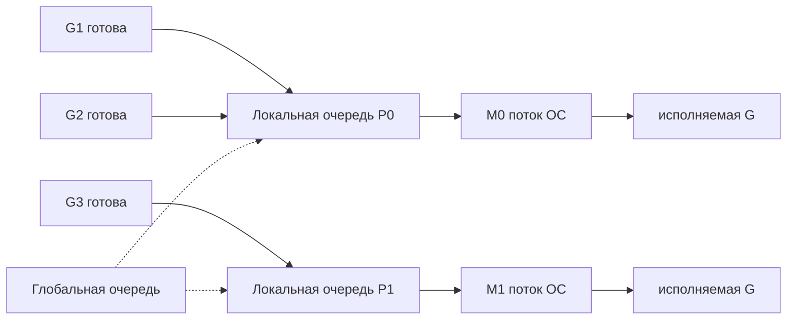

# Go Scheduler: G/M/P и вытеснение goroutines

## Содержание

- [Какую задачу решает планировщик Go](#какую-задачу-решает-планировщик-go)
- [Ментальная модель G/M/P](#ментальная-модель-gmp)
- [Как G, M и P связаны в runtime](#как-g-m-и-p-связаны-в-runtime)
- [Зачем нужен P](#зачем-нужен-p)
- [Состояния goroutine](#состояния-goroutine)
- [Когда происходит переключение goroutine](#когда-происходит-переключение-goroutine)
- [Какая у goroutines модель планирования](#какая-у-goroutines-модель-планирования)
- [Очереди готовых goroutines и work stealing](#очереди-готовых-goroutines-и-work-stealing)
- [Как планировщик ищет работу](#как-планировщик-ищет-работу)
- [Откуда берутся OS threads](#откуда-берутся-os-threads)
- [Вытеснение goroutines](#вытеснение-goroutines)
- [sysmon](#sysmon)
- [GOMAXPROCS и контейнеры](#gomaxprocs-и-контейнеры)
- [Связь с syscall, netpoller и timers](#связь-с-syscall-netpoller-и-timers)
- [Диагностика](#диагностика)
- [Типичные ошибки](#типичные-ошибки)
- [Interview-ready answer](#interview-ready-answer)
- [Официальные источники](#официальные-источники)

Планировщик Go распределяет goroutines по потокам операционной системы (`OS thread`) и ограничивает через `GOMAXPROCS` число потоков, одновременно исполняющих код на Go.

Материал ориентирован на Go 1.26. G/M/P, конкретные очереди и имена функций runtime — детали реализации, полезные для понимания и диагностики, но не гарантии языка.

---

## Какую задачу решает планировщик Go

Операционная система умеет планировать потоки сама, и отдельный планировщик в пользовательском пространстве нужен не всегда. Он появляется там, где параллельных задач заметно больше, чем разумного числа потоков.

| | Задача = поток операционной системы | Задача = goroutine |
| --- | --- | --- |
| Стартовая стоимость | 8 MiB виртуального стека по умолчанию на Linux плюс структуры ядра | 2 KiB стек, растёт по необходимости |
| Кто переключает | ядро, через прерывание и полный переход в режим ядра | runtime, сохраняя несколько регистров в пользовательском пространстве |
| Стоимость переключения | единицы микросекунд | сотни наносекунд |
| Разумный масштаб | тысячи | миллионы |

Планировщик Go мультиплексирует много дешёвых goroutines на немного дорогих потоков. Ядро продолжает планировать потоки, а runtime внутри них решает, какая goroutine исполняется сейчас. Отсюда все дальнейшие сущности: нужен способ хранить очередь готовых задач, ограничивать параллелизм и отбирать процессор у goroutine, которая слишком долго его удерживает.

Числа в таблице подробнее разобраны в [netpoller](./03-netpoller.md), где та же экономия рассматривается на примере сетевых соединений.

---

## Ментальная модель G/M/P

| Сущность | Простое объяснение | Что хранит и делает |
| --- | --- | --- |
| **G — goroutine** | задача | стек, состояние исполнения, причину ожидания |
| **M — machine** | поток операционной системы | физически исполняет инструкции |
| **P — processor** | право и контекст для исполнения кода на Go | локальную очередь и состояние runtime, привязанное к этому P |



Основные правила:

- код на Go исполняет M, у которого есть P;
- количество P связано с `GOMAXPROCS`;
- M может временно существовать без P, например внутри блокирующего системного вызова;
- goroutine не привязана навсегда к потоку и после парковки и пробуждения может продолжить на другом M.

Аналогия: G — работа, M — работник, P — рабочее место с локальной очередью заданий. Работников может быть больше, чем рабочих мест, но одновременно работать с кодом на Go могут только те, кто занял рабочее место.

---

## Как G, M и P связаны в runtime

Ссылки между сущностями объясняют, почему goroutine может мигрировать между потоками:

```text
M
├── curg ──────────────> G, которую M исполняет сейчас
├── g0 ────────────────> системный стек планировщика и runtime
├── p ─────────────────> текущий P
└── oldp ──────────────> P, с которым M вошёл в системный вызов

P
├── m ─────────────────> текущий M
├── runq[256] ─────────> локальная очередь готовых goroutines
├── runnext ───────────> приоритетная следующая G
└── timers/mcache/...  -> прочее состояние runtime, привязанное к P

G
├── m ─────────────────> M только пока G исполняется
├── stack ─────────────> границы стека goroutine
├── sched ─────────────> сохранённые SP/PC/BP
└── atomicstatus ------> runnable/running/waiting/syscall/...
```

Когда G паркуется или вытесняется, runtime сохраняет контекст её исполнения в `g.sched`. Позже другой M с P восстанавливает указатель стека и счётчик команд и продолжает ту же G. Поэтому идентичность goroutine не равна идентичности потока операционной системы.

<details>
<summary>Упрощённые структуры runtime</summary>

```go
type g struct {
	stack        stack
	stackguard0  uintptr
	m            *m
	sched        gobuf
	atomicstatus atomic.Uint32
	waitreason   waitReason
	goid         uint64
}

type gobuf struct {
	sp uintptr // указатель стека
	pc uintptr // счётчик команд
	bp uintptr // указатель базы кадра
}

type m struct {
	g0       *g
	curg     *g
	p        puintptr
	oldp     puintptr
	spinning bool
	lockedg  guintptr
}

type p struct {
	m        muintptr
	runqhead uint32
	runqtail uint32
	runq     [256]guintptr
	runnext  guintptr
	mcache   *mcache
}

type schedt struct {
	lock     mutex
	runq     gQueue
	runqsize int32
	midle    muintptr
	pidle    puintptr
}
```

`g0` — особая goroutine каждого M с системным стеком. Планировщик, рост стека и часть кода runtime исполняются на `g0`, а не на растущем пользовательском стеке. `schedt` существует один на процесс и содержит глобальные очереди и пулы под общей блокировкой.

Поля сокращены, а типы вроде `guintptr` являются внутренними обёртками над указателями. Копировать этот layout в код с `unsafe` нельзя.

</details>

<details>
<summary>Служебные стеки потока: g0 и gsignal, и почему g0 не растёт</summary>

У каждого M есть две служебные goroutines, которые обычными не являются:

- `g0` — стек для планировщика, роста стека и части работы сборщика мусора;
- `gsignal` — отдельный стек для обработчиков сигналов операционной системы.

Их ровно столько же, сколько потоков, и `runtime.NumGoroutine()` их не считает — по сути это собственные стеки потока, а не задачи.

Ключевая особенность: стек `g0` фиксированный, он не растёт. Обычная goroutine стартует с 2 KiB и удваивается по мере надобности, а `g0` получает системный стек потока — порядка 8 KiB у потоков, созданных runtime, и большой стек операционной системы у главного потока.

Причина запрета на рост простая: сам механизм роста стека (`morestack` и `newstack`) исполняется на самом `g0`. Если бы `g0` тоже требовалось растить, вышла бы бесконечная рекурсия. Поэтому код runtime, который гоняют на системном стеке, держат неглубоким и помечают директивой `//go:systemstack`, а переключение на него делают через `systemstack(fn)`.

</details>

---

## Зачем нужен P

Самое непонятное в модели — зачем нужна третья сущность, если «goroutine исполняется на потоке». Ответ лежит в истории: до Go 1.1 существовали только G и M, а очередь готовых goroutines была одна на всю программу и защищалась глобальной блокировкой. На машине с несколькими ядрами потоки толкались на этой блокировке, и планировщик переставал масштабироваться.

В Go 1.1 появился P — «право исполнять код на Go» плюс собственная локальная очередь. Если бы все M по-прежнему брали goroutines из одной глобальной очереди, они постоянно конкурировали бы за общую блокировку. P позволяет держать большую часть работы планировщика локально:

- локальная очередь уменьшает конкуренцию за блокировку;
- состояние, привязанное к P, улучшает локальность данных в кэше;
- число P ограничивает параллельное исполнение;
- при блокировке M его P можно передать другому M;
- простаивающий P может перехватить часть работы у загруженного.

`GOMAXPROCS=1` не запрещает конкурентность: тысячи goroutines могут быть готовыми или ждущими, но код на Go в каждый момент исполняет только один P.

---

## Состояния goroutine

Для практической модели достаточно трёх состояний:

```text
runnable  → готова, ждёт места на P
running   → исполняется сейчас на M + P
waiting   → ждёт канал, мьютекс, сетевой ввод-вывод, таймер, результат системного вызова
```

Полная таблица переходов:

| Переход | Когда происходит |
| --- | --- |
| появление → `runnable` | `go f()` создала goroutine |
| `runnable` → `running` | планировщик выбрал её на P |
| `running` → `runnable` | вытеснение или `runtime.Gosched()` |
| `running` → `waiting` | блокировка: канал, мьютекс, таймер, netpoll |
| `waiting` → `runnable` | событие произошло, goroutine разблокирована |
| `running` → `syscall` | `entersyscall` |
| `syscall` → `runnable` | `exitsyscall`, возврат из ядра |
| `running` → `dead` | функция goroutine завершилась |
| `dead` → `runnable` | структура переиспользована под новый `go f()` |

Последняя строка объясняет, почему запуск goroutine дешевле, чем кажется: завершившиеся G не уничтожаются сразу, а складываются в свободный список `gFree` и переиспользуются вместе со своими стеками.

Когда goroutine находится в ожидании, поле `waitreason` хранит причину, и она попадает в дампы стеков. По ней сразу понятно, из-за чего goroutine висит:

| Причина ожидания | Как выглядит в дампе | Когда возникает |
| --- | --- | --- |
| приём или отправка в канал | `[chan receive]`, `[chan send]` | блокировка на `<-ch` или `ch <- v` |
| выбор из нескольких каналов | `[select]` | ожидание в `select` |
| захват мьютекса или семафора | `[semacquire]` | `sync.Mutex.Lock`, `WaitGroup.Wait` |
| сон | `[sleep]` | `time.Sleep` |
| сетевой ввод-вывод | `[IO wait]` | ожидание готовности в netpoller |
| работа со сборщиком мусора | `[GC assist wait]` | goroutine помогает сборке или ждёт её |

Это первое, на что стоит смотреть в дампе: не число goroutines, а распределение причин ожидания.

Стек goroutine стартует с 2 KiB (`stackMin` в `runtime/stack.go`) и растёт по необходимости; верхний предел на 64-битных платформах по умолчанию равен 1 GB — ровно 10⁹ байт, то есть около 954 MiB, — и меняется через `runtime/debug.SetMaxStack`. Точный стартовый размер формально является деталью реализации, но порядок величины важен: goroutine примерно на три порядка дешевле потока операционной системы по стартовой памяти и всё же не бесплатна. Стек, метаданные runtime и ссылки из стека занимают память и участвуют в работе сборщика мусора.

<details>
<summary>Более точные состояния runtime</summary>

| Состояние runtime | Смысл |
| --- | --- |
| `_Grunnable` | G находится в очереди и ждёт P |
| `_Grunning` | G исполняет код на Go на M с P |
| `_Gwaiting` | G припаркована на канале, мьютексе, таймере, netpoll и подобном |
| `_Gsyscall` | G находится в системном вызове вместе с M; P при этом переходит в `_Psyscall` и остаётся зарезервированным за этим M, пока его не отберёт `sysmon` |
| `_Gdead` | G не выполняется; её структура может попасть в пул переиспользования |
| `_Gcopystack` | runtime временно копирует растущий стек |
| `_Gpreempted` | G остановлена вытеснением и ждёт дальнейшего планирования |

Важно не путать две вещи: в состоянии `_Gsyscall` P не исполняет код на Go, но и не свободен — он занят до перехвата. Механика перехвата разобрана в [syscall](./02-syscall.md).

У runtime есть дополнительные биты для сканирования сборщиком мусора, поэтому фактическое числовое значение статуса сложнее этой таблицы. Для чтения дампа goroutines полезнее причина ожидания: `[chan receive]`, `[IO wait]`, `[syscall]`, `[semacquire]` и другие.

</details>

<details>
<summary>Как растёт стек goroutine</summary>

Большинство функций Go содержит проверку стека в прологе. Если места не хватает, runtime:

1. переходит на системный стек;
2. выделяет больший непрерывный стек;
3. копирует живую часть старого стека;
4. поправляет указатели, которые указывают внутрь стека;
5. возвращается и повторяет вызов функции.

Стек может также уменьшаться во время сборки мусора. Из этого следуют два практических вывода:

- нельзя передавать в C указатель на стек Go без соблюдения правил cgo: стек способен переместиться;
- миллион припаркованных goroutines всё равно потребляет заметную память и увеличивает объём сканирования для сборщика мусора, особенно если стеки удерживают большие графы объектов.

</details>

---

## Когда происходит переключение goroutine

Естественный вопрос после списка состояний: кто и в какой момент решает сменить исполняемую goroutine. Ответ неочевидный: никто со стороны. Переключение происходит только тогда, когда сама исполняющаяся goroutine входит в runtime.

P здесь ничего не решает — это пассивная структура с очередью и счётчиками. Планировщик не является отдельным потоком, который наблюдает за остальными: его код физически исполняется тем же самым потоком, что и goroutine. Значит, чтобы планировщик получил управление, goroutine должна ему это управление отдать.

Это принципиальное отличие от планировщика ядра. Ядро может выбить поток посреди любой инструкции по таймерному прерыванию, потому что оно работает на другом уровне привилегий. У runtime такой возможности нет.

### Шесть поводов отдать управление

| Повод | Как попадает в runtime | Что происходит с текущей G |
| --- | --- | --- |
| блокировка: канал, мьютекс, сеть, `time.Sleep` | `gopark` | `_Gwaiting`, уходит в очередь ожидания события, а не в очередь готовых |
| явная уступка `runtime.Gosched()` | прямой вызов | `_Grunnable`, отправляется в глобальную очередь |
| функция goroutine завершилась | `goexit` | `_Gdead`, структура попадает в пул переиспользования |
| вход в системный вызов | `entersyscall` | G остаётся на своём M, но P может уйти другому |
| кооперативное вытеснение | проверка стека в прологе функции | `_Grunnable`, отправляется в глобальную очередь |
| асинхронное вытеснение | сигнал, подставляющий вызов `asyncPreempt` | то же |

Все шесть путей сходятся в одну точку:

```text
любой из поводов
    -> управление переходит на g0, системный стек этого M
    -> schedule()
    -> findRunnable()      выбирает следующую G
    -> execute(gp, inheritTime)
    -> gogo(&gp.sched)     восстанавливает SP и PC новой goroutine
```

Пока ни один из поводов не наступил, goroutine занимает P сколько угодно долго, и никакая внешняя сила её оттуда не убирает.

### Как вытеснение создаёт повод бесплатно

Кооперативное вытеснение не добавляет в горячий путь ни одной инструкции — оно переиспользует проверку, которая и так стоит в каждой нелистовой функции для роста стека:

```text
пролог функции:
    if SP < g.stackguard0 { morestack() }
```

`preemptone` выставляет `gp.stackguard0 = stackPreempt` — заведомо огромное значение. Ближайший вызов функции проваливает проверку и уходит в `morestack`, оттуда в `newstack`, а там уже смотрят, чем вызвано срабатывание:

```go
preempt := stackguard0 == stackPreempt
if preempt {
    ...
    gopreempt_m(gp) // ведёт себя так, будто goroutine вызвала Gosched
}
```

Если вытеснять прямо сейчас нельзя — удерживаются блокировки или идёт критический участок runtime, — `stackguard0` возвращается к нормальной границе, и goroutine продолжает работу. Флаг `gp.preempt` при этом остаётся, поэтому запрос сработает при следующей возможности.

Отсюда же видно ограничение: плотный цикл без вызовов функций пролог не исполняет, проверку не проходит и повода не создаёт никогда. Ровно поэтому понадобилось асинхронное вытеснение — оно создаёт повод извне, через сигнал. Подробности обоих механизмов разобраны в разделе [«Вытеснение goroutines»](#вытеснение-goroutines).

---

## Какая у goroutines модель планирования

Формулировка вопроса обычно дословная: «какая у goroutines модель — кооперативная, вытесняющая, какая?». Короткий ответ: M:N, в пользовательском пространстве, кооперативная с асинхронным вытеснением начиная с Go 1.14. Дальше по частям.

### Конкурентность, а не параллелизм

Goroutines — про конкурентность, то есть про способ структурировать программу как набор независимых задач. Параллелизм, то есть одновременное исполнение, появляется отдельно и только если `GOMAXPROCS` больше единицы и есть свободные ядра.

На одном ядре тысяча goroutines конкурентна, но не параллельна: они чередуются, а не бегут одновременно. Смешение этих двух понятий — источник ожиданий вида «добавлю goroutines и станет быстрее», которые не сбываются на нагрузке, упирающейся в процессор.

### M:N в пользовательском пространстве

Go мультиплексирует много goroutines на меньшее число потоков операционной системы — это и называется моделью M:N — силами собственного планировщика, работающего в пользовательском пространстве.

Важная деталь: параллелизм кода на Go ограничен числом P, а не числом потоков. Чтобы исполнять Go, потоку обязательно нужен P, а их ровно `GOMAXPROCS`. Потоков при этом может быть больше — лишние удерживают goroutines, застрявшие в системных вызовах и cgo.

Отсюда главное следствие: переключение между goroutines не проходит через ядро, в отличие от переключения потоков. Меняется лишь несколько регистров, сохранённых в `g.sched`, и всё остаётся в пользовательском пространстве. Ядро видит только потоки и о goroutines не знает ничего.

> **Пользовательское пространство и пространство ядра.** Пользовательское пространство (`user space`) — режим с ограниченными привилегиями, в котором исполняется обычный код: и приложение, и runtime Go. Прямого доступа к оборудованию и чужой памяти там нет. Пространство ядра (`kernel space`) — режим с полным доступом. Перейти из одного в другое можно только через системный вызов, и этот переход стоит заметных денег. Поэтому фраза «планировщик работает в пользовательском пространстве» означает ровно одно: переключение goroutines не требует захода в ядро. Подробно о режимах — в [процессы и потоки](../../10-devops-and-observability/hardware-and-os/06-processes-and-threads.md).

### Кооперативная модель с вытеснением как страховкой

| Модель | Кто и когда передаёт управление |
| --- | --- |
| кооперативная, Go до 1.14 | goroutine отдаёт P сама, в определённых точках; принудительно её не прерывают |
| плюс асинхронное вытеснение, Go 1.14 и новее | `sysmon` может вытеснить принудительно через сигнал, даже если goroutine не уступает |
| потоки операционной системы, для сравнения | вытесняющая: ядро снимает поток по таймеру, не спрашивая |

Точки, где goroutine уступает управление кооперативно, перечислены выше в разделе [«Когда происходит переключение goroutine»](#когда-происходит-переключение-goroutine). До Go 1.14 их было недостаточно: goroutine с плотным вычислительным циклом без вызовов функций могла удерживать P неограниченно долго, потому что прервать её было негде. Асинхронное вытеснение закрыло эту дыру. Поэтому сегодня модель правильно описывать так: в основе она кооперативная, а вытеснение работает страховкой от goroutines, которые не уступают сами.

### Что происходит при GOMAXPROCS=1

На одном ядре по умолчанию будет один P, значит одновременно исполняется одна goroutine, а остальные готовые чередуются на нём.

Но потоков всё равно несколько: `GOMAXPROCS` ограничивает P, а не M. Живут как минимум главный поток, `sysmon`, застрявшие в системных вызовах и простаивающие в пуле. Их раскладывает по единственному ядру уже планировщик ядра, который вытесняющий.

Именно поэтому механизмы продолжают работать даже в такой конфигурации:

- **асинхронное вытеснение работает.** Если goroutine зациклилась и держит единственный P, её вытеснит `sysmon`. А процессорное время он получает потому, что является отдельным потоком, и ядро само периодически снимает жадный рабочий поток, давая монитору тик;
- **блокирующий системный вызов не замораживает всё.** Поток завис в ядре, единственный P передаётся другому M, и тот крутит остальные goroutines на том же ядре;
- **сетевой ввод-вывод работает как обычно**: goroutine паркуется в netpoller, а единственный поток в простое спит в опросе сети.

> **Ловушка, которую любят на собеседованиях.** `GOMAXPROCS=1` не делает конкурентный код безопасным. Соблазнительное рассуждение «один P, значит всё последовательно, значит синхронизация не нужна» — ошибка. Вытеснение переключает goroutines почти в любой точке, модель памяти по-прежнему требует отношения happens-before, а гонка данных остаётся гонкой, и детектор гонок её найдёт. Мьютексы, каналы и атомарные операции нужны и на одном ядре.

---

## Очереди готовых goroutines и work stealing

Готовых goroutines хранят две структуры:

- **локальная очередь** (`LRQ`, local run queue) — своя у каждого P, ограничена 256 позициями;
- **глобальная очередь** (`GRQ`, global run queue) — одна на процесс, под общей блокировкой планировщика.

Готовая goroutine обычно попадает в локальную очередь текущего P. Глобальная нужна как общий запасной путь: для справедливости распределения, при переполнении локальной очереди и для части пробуждений извне.

У P также есть быстрый путь для только что разбуженной goroutine — поле `runnext` в текущей реализации. Туда же попадает и только что созданная через `go f()`. Если в `runnext` кто-то уже лежал, он выталкивается в хвост локальной очереди, а новый занимает слот. Замысел — локальность: только что созданную или разбуженную goroutine выгоднее запустить сразу, пока её данные горячие в кэше. Это уменьшает задержку, но обещанием строгого порядка не является.

Ёмкости у трёх хранилищ разные:

| Хранилище | Ёмкость | Что это |
| --- | --- | --- |
| `runnext` | 1 слот | приоритетная только что созданная или разбуженная goroutine |
| локальная очередь | ровно 256, фиксированный массив | своя у каждого P |
| глобальная очередь | не ограничена, связный список | одна на процесс, под общей блокировкой |

Когда `go f()` вызывается, а локальная очередь уже заполнена, `runqput` не ждёт освобождения места: он отправляет в глобальную половину локальной очереди, около 128 goroutines, вместе с новой. Так локальная очередь остаётся быстрой и ограниченной, а излишек становится доступен другим P.

Отсюда поведение под всплеском создания goroutines, которое хорошо видно в диагностике:

```text
тысячи go за раз -> локальная очередь каждого P добивается до 256
                 -> излишек половинами уходит в глобальную
                 -> в выводе schedtrace поле runqueue подскакивает до сотен
                 -> затем P разгребают обе очереди, и runqueue оседает
```

Если локальная очередь пуста, P ищет работу в других источниках и может перехватить часть готовых goroutines у другого P. Перехват берёт примерно половину чужой очереди с хвоста, тогда как владелец забирает свои goroutines с головы. Так двое реже претендуют на один и тот же элемент. Такой перехват (`work stealing`):

- балансирует нагрузку без центрального диспетчера;
- переносит goroutines, а не потоки операционной системы;
- не спасает от одной большой последовательной задачи;
- не гарантирует порядок «первым пришёл — первым обслужен».

Код не должен зависеть от порядка запуска goroutines. Даже при `GOMAXPROCS=1` порядок определяется планировщиком и точками парковки и вытеснения.

<details>
<summary>Эксперимент: порядок запуска не является FIFO</summary>

```go
package main

import (
	"fmt"
	"runtime"
)

func main() {
	runtime.GOMAXPROCS(1)

	const n = 8
	start := make(chan struct{})
	result := make(chan int, n)

	for i := 0; i < n; i++ {
		go func(i int) {
			<-start
			result <- i
		}(i)
	}

	close(start)
	for range n {
		fmt.Print(<-result, " ")
	}
	fmt.Println()
}
```

Программу стоит запустить несколько раз, затем заменить `GOMAXPROCS(1)` на `GOMAXPROCS(2)`. Конкретный порядок может выглядеть стабильным на отдельной версии Go, но это наблюдение за реализацией, а не контракт. Для гарантированного порядка нужны канал, мьютекс с условной переменной или другая явная синхронизация.

</details>

<details>
<summary>Почему порядок получается «4 0 1 2 3»: механика runnext на конкретном примере</summary>

```go
func main() {
	runtime.GOMAXPROCS(1) // один P: параллелизма нет, всё на одном потоке
	var wg sync.WaitGroup
	wg.Add(5)
	for i := 0; i < 5; i++ {
		go func(i int) {
			defer wg.Done()
			fmt.Println(i)
		}(i)
	}
	wg.Wait()
}
```

Вывод устойчиво выглядит так:

```text
4
0
1
2
3
```

Причина ровно в `runnext` и в выталкивании прежнего жильца в хвост. Каждый `go func(i)` кладёт новую goroutine в приоритетный слот, а ту, что там была, отправляет в конец локальной очереди:

```text
go g0  -> runnext=g0,  очередь=[]
go g1  -> runnext=g1,  очередь=[g0]              g0 вытолкнут в хвост
go g2  -> runnext=g2,  очередь=[g0,g1]
go g3  -> runnext=g3,  очередь=[g0,g1,g2]
go g4  -> runnext=g4,  очередь=[g0,g1,g2,g3]
```

Сама `main` всё это время держит P и крутит цикл; отдаёт его только на `wg.Wait()`, где блокируется. Тут планировщик выбирает следующую goroutine по приоритету: сперва `runnext`, то есть `g4`, которая печатает `4`; затем локальную очередь с головы по порядку — `g0, g1, g2, g3`. Между короткими вызовами `Println` вытеснения не происходит, каждая goroutine успевает отработать целиком. Отсюда и «последняя созданная исполняется первой».

Это иллюстрация механики, а не контракт: порядок исполнения goroutines спецификацией не определён. При `GOMAXPROCS` больше единицы появляются несколько P, перехват работы и настоящий параллелизм, и порядок разъезжается.

</details>

<details>
<summary>Подробно: устройство локальной очереди</summary>

Локальная очередь содержит 256 позиций и работает как кольцевой буфер (`runq [256]guintptr` в `runtime/runtime2.go`, значение одинаково от Go 1.19 до Go 1.26):

```text
head                                      tail
  |                                         |
  v                                         v
[G7][G8][G9][ ... свободные позиции ... ][   ][   ]

владелец P: добавляет с хвоста
владелец P: забирает с головы
перехватчик: сдвигает head через CAS и забирает примерно половину
```

Владелец единственный, кто пишет `runqtail`, поэтому обычное добавление не требует общей блокировки. Но `runqhead` меняют и владелец, и перехватчики, поэтому извлечение и перехват используют атомарные операции и CAS:

```text
runqput(G):
    h = atomicLoad(head)
    t = tail
    if t - h < 256:
        runq[t % 256] = G
        releaseStore(tail, t + 1)
        return
    runqputslow(G)

runqget():
    h = atomicLoad(head)
    t = tail
    if h == t:
        return none
    G = runq[h % 256]
    if CAS(head, h, h + 1):
        return G
    retry

steal(victim):
    прочитать head/tail жертвы
    скопировать примерно половину готовых G
    сдвинуть victim.head через CAS
    повторить при конфликте
```

Когда локальная очередь заполнена, `runqputslow` переносит часть goroutines вместе с новой G в глобальную. Это освобождает локальное место и делает работу доступной другим P, но требует общей блокировки планировщика.

`runnext` находится отдельно от кольцевого буфера. Обычно туда попадает goroutine, которую текущая G только что разблокировала; она наследует остаток текущего кванта времени. Это улучшает локальность при обмене «туда-сюда» между двумя goroutines, но runtime ограничивает такой быстрый путь, чтобы цепочка `runnext` не приводила к голоданию остальных.

Эти размеры и алгоритмы менялись и могут измениться снова. Для собеседования важнее объяснить цель: быстрый локальный путь, редкая глобальная координация и балансировка через перехват.

</details>

---

## Как планировщик ищет работу

Всё описанное выше — локальная и глобальная очереди, перехват у соседей, сетевые события, таймеры — это не отдельные механизмы, а пункты одного чеклиста, который поток проходит в функции `findRunnable`. Причём это не разовый код, а цикл: M крутится в нём, пока не найдёт следующую goroutine, и каждый раз идёт по одному и тому же порядку сверху. Когда M просыпается — из опроса сети или из сна на futex, — он не делает ничего особенного, а просто заходит в начало того же чеклиста.

В одну фразу порядок звучит так: от самых дешёвых и локальных источников к самым дорогим, и только исчерпав все, отдать P и заснуть.

### Фаза первая: ищем работу, не отдавая P

| # | Шаг | Что делает и на что смотрит | Существенная деталь |
| ---: | --- | --- | --- |
| 1 | остановка мира и безопасные точки | `sched.gcwaiting`, `pp.runSafePointFn` | если сборщик просит остановиться — отдать P и начать чеклист заново |
| 2 | таймеры своего P | `pp.timers.check(...)` | здесь отрабатывают созревшие таймеры, сюда же попадает пробуждение после `time.Sleep` |
| 3 | читатель трассировки | — | только если включён `runtime/trace` |
| 4 | воркер сборщика мусора | `gcBlackenEnabled` | только во время фазы разметки |
| 5 | глобальная очередь по тику | `pp.schedtick % 61`, `globrunqget()` | забирает одну goroutine, даже если локальная очередь полна |
| 6 | финализаторы и очистка | `fingStatus`, `gcCleanups` | разбудить служебные goroutines, если их ждут |
| 7 | локальная очередь | `runqget(pp)`: сначала `pp.runnext`, затем `pp.runq` | взятая из `runnext` наследует остаток кванта, и тик `schedtick` не растёт |
| 8 | глобальная очередь при пустой локальной | `globrunqgetbatch(len(pp.runq) / 2)` | забирает пачку до 128 сразу в локальную очередь |
| 9 | неблокирующий опрос сети | `netpoll(0)` под охраной `netpollAnyWaiters()`, `sched.lastpoll`, `sched.pollingNet` | два условия: есть ждущие дескрипторы и никто другой сейчас не опрашивает. Иначе на машине с многими ядрами все P разом били бы в ядро одним вызовом |
| 10 | перехват у соседей | `stealWork(now)` | берёт половину чужой локальной очереди и заодно проверяет таймеры жертвы; разрешён не всем — ищущих потоков не больше половины занятых P (`sched.nmspinning`) |

Главное, что стоит удержать из этой фазы: шаг 5 стоит раньше шага 7, и это не случайность. Если бы проверка глобальной очереди шла после локальной, механизм справедливости не работал бы вовсе — у загруженного P локальная очередь почти никогда не пустеет, и до глобальной дело не доходило бы никогда. Разбор двух разных поводов заглянуть в глобальную очередь — ниже, в подразделе про справедливость.

### Фаза вторая: работы нет, отдаём P и засыпаем

| # | Шаг | Что делает и на что смотрит | Существенная деталь |
| ---: | --- | --- | --- |
| 11 | разметка в простое | `gcMarkWorkerIdleMode` | если идёт фаза разметки, выгоднее занять P ею, чем отдавать |
| 12 | отдать P | `releasep()`, затем `pidleput(pp)` в `sched.pidle` | происходит раньше блокировки в опросе сети, поэтому ждущий поток не расходует один из `GOMAXPROCS` — см. [netpoller](./03-netpoller.md) |
| 13 | перепроверить все источники | сброс `mp.spinning` и `sched.nmspinning`, затем проход заново | защита от гонки: между «я всё проверил» и «я засыпаю» другой поток может добавить работу, и её никто не подхватит |
| 14 | блокирующий опрос сети | `netpoll(delay)`, где `delay` рассчитан по `pollUntil` | `delay` равен времени до ближайшего таймера, поэтому один вызов ждёт и сеть, и срок таймера |
| 15 | припарковать поток | `stopm()` | сон на futex, если не помогло и это |

### Три связки, которые видно только из этого порядка

**Таймеры исполняются на шаге 2, а не «внутри netpoll».** Это самое частое заблуждение. `netpoll(delay)` на шаге 14 нужен лишь для того, чтобы поспать ровно до срока ближайшего таймера и заодно ловить сеть. Проснулся по таймауту — петля возвращает в начало — шаг 2 отрабатывает созревший таймер и делает goroutine готовой. Именно поэтому отдельной goroutine или потока под таймеры не существует.

**Сеть проверяется дважды и с разной ценой.** На шаге 9 — дешёвая неблокирующая проверка, пока работа и так ищется. На шаге 14 — блокирующая, когда поток уже собрался спать. Один и тот же вызов `netpoll` играет две разные роли в зависимости от `delay`.

**Пробуждение не является отдельным механизмом.** Вышел из блокирующего опроса сети или из сна на futex — просто заходишь в `findRunnable` сверху и идёшь по списку заново. Никакого специального кода «обработать пробуждение» нет.

Отсюда же ответ на вопрос, почему один блокирующий `netpoll(delay)` обслуживает сразу и сеть, и таймеры: это не две подсистемы, которые кто-то согласовал, а два выхода из одного и того же ожидания в одном чеклисте.

Это порядок текущей реализации, а не контракт API: в `findRunnable` участвуют ещё сборщик мусора, безопасные точки и платформенные детали, а сами шаги между версиями переставляли. Полезно запомнить не последовательность, а принцип — от дешёвого и локального к дорогому и общему, с отдачей P в самом конце.

### Справедливость и потоки в состоянии поиска

Если P всегда предпочитает свою локальную очередь, постоянный локальный производитель задач способен надолго задержать работу из глобальной. Поэтому планировщик периодически проверяет глобальную очередь даже при наличии локальной работы: быстрая проверка выполняется раз в 61 тик планировщика.

**Тик планировщика** (`p.schedtick`) — не единица времени, а счётчик событий. Он увеличивается на единицу каждый раз, когда этот P ставит на исполнение очередную goroutine обычным путём:

```text
execute(gp, inheritTime):
    ...
    if !inheritTime:
        p.schedtick++     // обычное переключение: тик засчитан
                          // быстрый путь runnext наследует чужой квант:
                          // тик НЕ засчитан
```

Поэтому «раз в 61 тик» означает «на каждом 61-м переключении на новую goroutine у этого P», а не «раз в 61 миллисекунду». На загруженном P это доли миллисекунды, на почти простаивающем — сколь угодно долго.

Само число 61 — простое, чтобы проверка не попадала в резонанс с другими периодическими событиями планировщика. Это эвристика реализации, а не обещанная доля процессорного времени: константа находится в `runtime/proc.go` и одинакова как минимум от Go 1.19 до Go 1.26, но гарантией API не является.

#### Счётчик у каждого P свой

`schedtick` — поле структуры `p`, а не общая переменная. Значит, все P считают тики независимо, и моменты попадания на 61-й тик между собой никак не синхронизированы:

```text
P0: ..............61 ...................61 ......   частые короткие обработчики
P1: ....61 ...............................61 ...    смешанная нагрузка
P2: ..........................................      одна долгая вычислительная G,
                                                    тики почти не растут
```

Стартуют все P с нуля, но дальше каждый набирает тики со своей скоростью: она зависит от того, как часто именно этот P переключается на новые goroutines. Поэтому счётчики расходятся сами собой уже через доли секунды. Гарантии, что попадания никогда не совпадут, при этом нет — совпадение возможно по случайности.

Дорогой массовый заход на общую блокировку это не создаёт, потому что проверка двухэтапная:

```go
if pp.schedtick%61 == 0 && !sched.runq.empty() {
    lock(&sched.lock)
    gp := globrunqget()
    unlock(&sched.lock)
    ...
}
```

Первое условие — свой счётчик, второе — дешёвая проверка без блокировки. `lock(&sched.lock)` берётся, только если совпало и то и другое. Если несколько P случайно попали в фазу, а глобальная очередь пуста, к блокировке не пойдёт ни один.

Ещё одна деталь порядка: проверка глобальной очереди стоит в `findRunnable` раньше чтения локальной. На 61-м тике глобальная очередь имеет приоритет над своей собственной — иначе механизм справедливости не работал бы вовсе.

#### Глобальная очередь читается по двум разным поводам

Правило 61 тика — не единственный путь работы из глобальной очереди на P. В `findRunnable` она читается дважды и по разным причинам:

| Повод | Условие | Сколько забирает |
| --- | --- | --- |
| справедливость | `schedtick % 61 == 0`, локальная очередь при этом может быть полной | одну goroutine |
| локальная очередь опустела | `runqget` вернул пусто | пачку до `len(runq)/2`, то есть до 128 штук, сразу в локальную очередь |

Отсюда видно назначение правила 61: если локальная очередь пустеет, глобальная читается и без всяких тиков, причём сразу пачкой. Проверка по тику нужна ровно для противоположного случая — когда локальная очередь как раз не пустеет, потому что её постоянно наполняют. Без неё такой P не заглянул бы в глобальную никогда.

Всего работа из глобальной очереди попадает на P тремя путями: раз в 61 собственный тик, при опустевшей локальной очереди и через перехват у соседей.

#### Почему одной этой проверки мало

Из того, что `runnext` не увеличивает тик, следует неочевидное: пара goroutines, которые постоянно будят друг друга через быстрый путь, до 61-го тика не дойдёт никогда. `inheritTime` у них всегда `true`, счётчик стоит на месте.

Runtime закрывает этот вариант другим механизмом. Комментарий в `runqput` говорит прямо: такая пара делит один квант времени, и чтобы она не заморила остальных, планировщик полагается на вытеснение долгих goroutines в `sysmon`. Если `sysmon` в сборке нет, `runnext` отключается целиком, потому что иначе голодание неизбежно.

| Вариант монополизации P | Что защищает | Порог |
| --- | --- | --- |
| локальный производитель постоянно наполняет обычную очередь | проверка глобальной очереди | каждый 61-й тик этого P |
| пара goroutines перебрасывает управление через `runnext` | вытеснение из `sysmon` | `forcePreemptNS`, 10 мс |
| одна goroutine с длинным циклом без вызовов | асинхронное вытеснение из `sysmon` | `forcePreemptNS`, 10 мс |

Когда свободный M активно ищет работу, он помечается как `spinning`. Runtime ограничивает число таких M:

- слишком мало ищущих M — пробуждение новой работы получает лишнюю задержку;
- слишком много — простаивающие потоки расходуют процессор и одновременно нагружают очереди;
- перед парковкой M повторно проверяет, не появилась ли работа, чтобы не потерять гонку с пробуждением.

Поле `spinningthreads` в выводе `schedtrace` показывает именно такие M. Высокое значение вместе с простаивающими P может означать короткий переходный момент; устойчивое значение требует сопоставления с длиной очередей и загрузкой процессора.

<details>
<summary>Почему перехват забирает пачку, а не одну G</summary>

Если перехватчик забирает только одну goroutine, при большом дисбалансе он сразу снова обращается к жертве и повторяет атомарные операции. Перехват примерно половины очереди:

- быстрее выравнивает нагрузку;
- амортизирует стоимость синхронизации;
- оставляет жертве достаточно локальной работы;
- не переносит всю локальность на другой P.

Это эвристика. Если перехваченные G быстро блокируются, баланс снова меняется, и планировщик продолжает поиск по другим источникам.

</details>

---

## Откуда берутся OS threads

Число M динамическое и не равно ни числу goroutines, ни `GOMAXPROCS`.

Дополнительный M может понадобиться, когда существующие потоки:

- заблокированы в системных вызовах;
- находятся в коде на C через cgo;
- закреплены через `runtime.LockOSThread`;
- должны обслужить готовую работу на простаивающем P.

Освободившиеся потоки обычно паркуются и переиспользуются. Они не исполняют код на Go без P, но продолжают занимать ресурсы операционной системы и память под собственный стек.

Свободные ресурсы учитываются раздельно:

```text
sched.pidle -> P, у которых сейчас нет M
sched.midle -> припаркованные M, у которых сейчас нет P и работы
```

Когда появляется готовая работа и простаивающий P, `startm` пытается взять M из пула, а при необходимости создаёт новый поток операционной системы. Когда M возвращается из системного вызова, он пытается получить P: это может быть прежний `oldp` или другой простаивающий. Переходы сериализуются блокировками и атомарными операциями планировщика, поэтому один P не оказывается одновременно у двух M.

Обратный случай — когда P нужно отобрать у потока, который больше не исполняет код на Go, и отдать другому. Это называется передачей P (`handoff`) и подробно разобрано в [syscall](./02-syscall.md).

<details>
<summary>Какие служебные goroutines и потоки видны рядом с кодом приложения</summary>

Даже минимальная программа содержит не только goroutine `main`. Runtime запускает служебную работу для сборщика мусора, финализаторов, очистки, трассировки и других подсистем. Часть работы выполняется обычными системными goroutines на P, а `sysmon` работает на отдельном M без P.

| Служебная goroutine | Зачем нужна |
| --- | --- |
| `forcegchelper` | спит, пока `sysmon` не разбудит её для принудительной сборки мусора |
| `bgsweep` | фоновая уборка после предыдущего цикла сборки |
| `bgscavenge` | возврат неиспользуемой памяти операционной системе |
| `runfinq` | запуск финализаторов; создаётся при первом `SetFinalizer` |
| воркеры разметки | около `GOMAXPROCS` штук, живут только во время сборки мусора |

Эти goroutines помечены как системные и в `runtime.NumGoroutine()` не входят: счётчик вычитает `sched.ngsys`. Но в дампе стеков они видны. Поэтому у только что запущенной программы `NumGoroutine()` вернёт 1, хотя полный дамп покажет ещё несколько.

Поэтому:

- `runtime.NumGoroutine()` не равно числу запросов приложения;
- число потоков операционной системы обычно больше `GOMAXPROCS`;
- дамп goroutines содержит стеки runtime, которые сами по себе не указывают на утечку.

Диагностика начинается с группировки одинаковых стеков приложения и их динамики, а не с ожидания «чистых» чисел.

</details>

`runtime/debug.SetMaxThreads` задаёт защитный максимум числа потоков; по умолчанию он равен 10000. Если программа бесконтрольно запускает блокирующие операции, она может упереться в этот предел даже при небольшом `GOMAXPROCS`, и превышение завершает процесс аварийно.

---

## Вытеснение goroutines

Вытеснение (`preemption`) позволяет планировщику остановить долго исполняющуюся G и отдать P другой работе.

Go сочетает несколько механизмов:

- **кооперативные безопасные точки** (`safe points`) — вызов функции, проверка стека, блокирующая операция или явный `runtime.Gosched` дают runtime удобную точку переключения;
- **асинхронное вытеснение** — начиная с Go 1.14 runtime может запросить остановку goroutine, занятой вычислениями, даже если она долго не вызывает функций. На Unix реализация использует сигналы; детали зависят от платформы.

Зачем это нужно:

- справедливость между goroutines;
- ограничение задержки для таймеров и сетевой работы;
- возможность фаз «остановить мир» у сборщика мусора;
- защита от плотного цикла, монополизирующего P.

Вытеснение не означает планирование реального времени. Goroutine может получить процессор позже ожидаемого из-за нагрузки, сборки мусора, планирования в ядре и длинных участков runtime, где остановка запрещена.

### Кооперативное и асинхронное вытеснение

До появления асинхронного вытеснения планировщик в основном зависел от безопасных точек: вызовы функций проверяют границу стека и могут перейти в runtime. Плотный цикл без вызовов способен слишком долго удерживать P.

На Unix текущий асинхронный путь выглядит концептуально так:

```text
sysmon видит, что schedtick этого P не менялся дольше 10 мс
    -> помечает G как требующую вытеснения
    -> runtime посылает потоку сигнал SIGURG
    -> обработчик сигнала проверяет, безопасна ли текущая точка исполнения
    -> подставляет вызов asyncPreempt
    -> G паркуется или становится готовой, планировщик получает управление
```

Runtime не останавливает G в произвольной опасной точке. Он проверяет карты указателей, состояние стека и участки runtime, где асинхронная остановка запрещена. Если точка небезопасна, запрос остаётся отложенным до подходящего места.

`SIGURG` — деталь реализации на Unix. Другие платформы используют свои механизмы, а будущий runtime может изменить протокол.

### На основании чего sysmon считает исполнение долгим

Первый шаг схемы стоит развернуть, потому что «замечает» звучит так, будто монитор измеряет время работы goroutine. Он его не измеряет: ни таймера на goroutine, ни счётчика её процессорного времени у него нет. Единственный наблюдаемый признак — уже знакомый `p.schedtick`.

У каждого P есть поле `sysmontick`, личный блокнот монитора: что он видел в прошлый заход и когда.

```go
type sysmontick struct {
	schedtick   uint32 // какое значение p.schedtick я видел
	syscalltick uint32 // какое значение p.syscalltick я видел
	schedwhen   int64  // когда я это записал
	syscallwhen int64
}
```

Сама проверка в `retake` сводится к сравнению с этим снимком:

```go
schedt := int64(pp.schedtick)
if int64(pd.schedtick) != schedt {
    pd.schedtick = uint32(schedt) // тик сдвинулся: P переключался, всё нормально
    pd.schedwhen = now            // отсчёт начинается заново
} else if pd.schedwhen+forcePreemptNS <= now {
    preemptone(pp)                // тик стоит уже 10 мс: пора вытеснять
}
```

То есть «долгое исполнение» означает буквально: счётчик переключений этого P не изменился с прошлого захода монитора, и с момента, когда тот впервые увидел его стоящим, прошло больше `forcePreemptNS`. Простаивающие P монитор пропускает сразу — он смотрит только на те, что находятся в состоянии `_Prunning`.

Отсюда два следствия, которые полезно проговорить вслух.

**Монитор наблюдает P, а не goroutine.** Он ни разу не заглядывает в конкретную G. Комментарий в исходниках признаёт это прямо: за стоящим тиком может скрываться как одна долго работающая goroutine, так и последовательность goroutines, запущенных через `runnext` и делящих один квант. Отличить один случай от другого монитор не может — и не нуждается, потому что лечение одинаковое. Именно поэтому в таблице выше эти два варианта монополизации P стоят разными строками, но с одним и тем же порогом.

**10 мс — нижняя граница, а не точность.** Период самого монитора плавающий:

```text
есть активность      -> сон 20 мкс
после ~1 мс простоя  -> удвоение сна на каждом цикле
потолок              -> 10 мс
```

Плюс отсчёт стартует не с момента запуска goroutine, а с первого обхода, на котором тик уже стоял. Поэтому фактическое вытеснение приходит позже 10 мс, иногда заметно позже, и `forcePreemptNS` правильно понимать как эвристику, а не как гарантированный квант.

### sysmon не выбирает следующую goroutine

Частое заблуждение: будто `sysmon` указывает P, какую goroutine взять в работу. Он этого не делает и не может. Всё, что выполняет `preemptone`, — выставляет текущей goroutine два флага:

```go
gp.preempt = true
gp.stackguard0 = stackPreempt
```

Дальше goroutine сама спотыкается об это на ближайшей проверке стека либо об сигнал при асинхронном пути. Кто встанет на её место, решает `findRunnable` по своим обычным правилам. То есть `sysmon` и проверка раз в 61 тик — не альтернативы: монитор лишь вынуждает принять решение о планировании, а правило 61 тика работает уже внутри этого решения.

Отдельно стоит запомнить, что `preemptone` не трогает goroutine, находящуюся в системном вызове. Там применяется другой механизм — перехват P, разобранный в [syscall](./02-syscall.md).

### Куда попадает вытесненная goroutine

Здесь спрятан ещё один механизм справедливости, который по слову «вытеснение» не угадывается. В `goschedImpl` вытесненная goroutine возвращается в глобальную очередь, а не в локальную очередь своего P:

```text
casgstatus(gp, _Grunning, _Grunnable)
dropg()

если вытеснение ради остановки мира:
    runqput(pp, gp, next=true)   -> обратно в runnext, чтобы продолжить сразу после рестарта
иначе:
    globrunqput(gp)              -> в глобальную очередь, под общей блокировкой

schedule()                       -> и только теперь выбирается следующая G
```

Смысл в том, что захватчик процессора выселяется из быстрого локального пути в общий котёл, откуда его может забрать любой P. Если бы вытесненная goroutine возвращалась в свою локальную очередь, она через несколько переключений снова оказалась бы на том же P, и вытеснение почти ничего бы не давало.

Исключение одно: вытеснение ради остановки мира кладёт G обратно в `runnext`, чтобы после рестарта она продолжила немедленно и пауза не удлинялась лишним планированием.

<details>
<summary>Gosched, парковка и вытеснение — не одно и то же</summary>

| Механизм | Что происходит с G |
| --- | --- |
| `runtime.Gosched()` | G добровольно уступает процессор, но остаётся готовой |
| ожидание канала, мьютекса, netpoll или таймера | G паркуется и становится ждущей до события |
| вытеснение | runtime временно прекращает исполнение и возвращает готовую G планировщику |
| завершение функции goroutine | G переходит в мёртвое состояние и попадает в цикл переиспользования |

Добавлять `Gosched` в обычные циклы ради «помощи планировщику» обычно не нужно: асинхронное вытеснение решает вопрос справедливости, а явная уступка может ухудшить пропускную способность. Он полезен в специальных тестах runtime или алгоритмах, где уступка является осознанной частью замысла.

</details>

<details>
<summary>Эксперимент: асинхронное вытеснение при одном P</summary>

Существующий playground умеет запускать плотный цикл без блокирующих операций:

```bash
cd examples/schedtrace
go build -o ./sched .

GOMAXPROCS=1 \
GODEBUG=schedtrace=200 \
./sched -cpu=0 -io=0 -spin -dur=3s
```

Несмотря на один P и бесконечный цикл, goroutine `main` завершает `time.Sleep`, а служебная goroutine получает процессор и печатает `NumGoroutine`. Это наблюдаемый эффект вытеснения, но точный момент и механизм платформы не являются гарантией API.

</details>

---

## sysmon

`sysmon` — служебный монитор runtime. Это настоящий поток операционной системы, поднятый при старте, а не goroutine: он не лежит ни в одной очереди, исполняется прямо на своём системном стеке и не занимает P. Поэтому он всегда может работать и не конкурирует за P с прикладными goroutines, а в `GOMAXPROCS` не входит.

Смысл его существования в том, что занятые P целиком поглощены исполнением кода и «оглядываться по сторонам» не могут. Монитор делает то, что изнутри сделать некому:

| Задача | Зачем |
| --- | --- |
| перехват P у системного вызова | поток застрял в ядре — отобрать P и отдать другому, чтобы тот не простаивал |
| вытеснение | goroutine держит P дольше 10 мс — пометить её на вытеснение |
| опрос сети | забрать готовые сетевые события, если все P заняты вычислениями и до `findRunnable` дело не доходит |
| принудительная сборка мусора | если сборки не было дольше 2 минут — запустить её |
| возврат памяти | разбудить фоновую goroutine, отдающую неиспользуемые страницы операционной системе |
| обнаружение взаимной блокировки | если все goroutines спят и работать некому — завершить программу с `all goroutines are asleep - deadlock!` |

Не стоит представлять `sysmon` как единственный поток планировщика: обычные M сами ищут работу, проверяют очереди, сетевые события и таймеры. Монитор — отдельный глаз, замечающий застрявшее.

<details>
<summary>Как sysmon принимает решения о перехвате и вытеснении</summary>

Оба решения монитор принимает по одному и тому же принципу — сравнивая счётчики P со снимком, сделанным на прошлом обходе:

- `schedtick` не изменился дольше `forcePreemptNS` — значит P всё это время не переключался на новую goroutine, и runtime запрашивает вытеснение. Разбор этой проверки со структурой `sysmontick` — в разделе [«Вытеснение goroutines»](#вытеснение-goroutines);
- `syscalltick` не изменился, а готовая работа нуждается в мощности — runtime перехватывает P и передаёт его другому M;
- если других источников готовой работы нет, слишком ранний перехват бесполезен, поэтому решение учитывает очереди и число простаивающих и ищущих потоков.

Порог задаёт `forcePreemptNS` в `runtime/proc.go` — 10 мс, одинаково от Go 1.19 до Go 1.26. Это эвристика планировщика, а не гарантированный квант: собственный период монитора, доставка сигнала, наличие безопасной точки и планирование в ядре меняют фактическое время.

</details>

---

## GOMAXPROCS и контейнеры

`GOMAXPROCS` ограничивает число потоков операционной системы, которые могут одновременно исполнять код на Go уровня приложения. Он не ограничивает общее число M, заблокированных в системных вызовах или в cgo.

Начиная с Go 1.25 runtime на Linux по умолчанию учитывает:

- число логических процессоров;
- маску привязки к процессорам (`CPU affinity`);
- ограничение процессорного времени в cgroup (`CPU bandwidth limit`).

Runtime также может обновлять значение по умолчанию при изменении лимита. Запрос процессора (`CPU request`) в Kubernetes при этом не является ограничением процессорного времени: он влияет на вес при планировании, а не на квоту.

```go
fmt.Println(runtime.GOMAXPROCS(0))
```

Для Go до 1.25 часто использовали `automaxprocs`. После обновления нельзя механически оставлять ручную установку: переменная окружения или вызов `runtime.GOMAXPROCS` отключают автоматический выбор значения по умолчанию.

---

## Связь с syscall, netpoller и timers

| Событие | G | M | P |
| --- | --- | --- | --- |
| блокирующий системный вызов | ждёт возврата | заблокирован в ядре | может перейти другому M |
| сетевой дескриптор не готов | припаркована | свободен для другой G | продолжает работу |
| `time.Sleep` | припаркована до срока | свободен | продолжает работу |
| ожидание канала или мьютекса | припаркована | свободен | продолжает работу |

Подробности: [syscall](./02-syscall.md), [netpoller](./03-netpoller.md), [timers](./04-timers.md).

---

## Диагностика

### schedtrace

```bash
GODEBUG=schedtrace=1000 ./service
GODEBUG=schedtrace=1000,scheddetail=1 ./service
```

Строка вывода выглядит так:

```text
SCHED 1000ms: gomaxprocs=4 idleprocs=0 threads=6 spinningthreads=1
              idlethreads=1 runqueue=2 [3 1 0 2]
```

Как её читать:

| Поле | Что означает |
| --- | --- |
| `gomaxprocs=4` | число P |
| `idleprocs=0` | P без работы; ноль под нагрузкой — это хорошо |
| `threads=6` | всего потоков операционной системы, включая `sysmon` и служебные |
| `spinningthreads=1` | M, которые ищут работу перед парковкой и пытаются перехватить её у соседей |
| `idlethreads=1` | припаркованные M в пуле простаивающих |
| `runqueue=2` | длина глобальной очереди |
| `[3 1 0 2]` | длины локальных очередей каждого P; перекос означает, что вот-вот сработает перехват |

Сигналы, на которые стоит обратить внимание:

- устойчиво растущий `runqueue` — работа накапливается быстрее, чем разгребается;
- ненулевой `idleprocs` под нагрузкой — параллелизм не используется, goroutines чего-то ждут;
- стабильно высокий `spinningthreads` — потоки жгут процессор в поисках работы вместо того, чтобы её делать;
- растущий `threads` при неизменном `gomaxprocs` — накапливаются блокирующие вызовы, см. [syscall](./02-syscall.md).

Одна строка — моментальный снимок, а не диагноз. Смотреть надо динамику вместе с загрузкой процессора, дампом goroutines, профилем блокировок и трассировкой исполнения.

### Другие инструменты

- `runtime/trace` и `go tool trace` — временная шкала планирования, системные вызовы, блокировки на сети;
- профиль и дамп goroutines — где припаркованы goroutines;
- профили блокировок и мьютексов — конкуренция;
- `runtime/metrics` — число goroutines и метрики планировщика;
- [schedtrace demo](./examples/schedtrace/) — безопасный playground.

<details>
<summary>Минимальная запись трассировки исполнения</summary>

```go
package main

import (
	"os"
	"runtime/trace"
)

func withTrace(path string, work func()) error {
	f, err := os.Create(path)
	if err != nil {
		return err
	}
	defer f.Close()

	if err := trace.Start(f); err != nil {
		return err
	}
	defer trace.Stop()

	work()
	return nil
}
```

```bash
go tool trace trace.out
```

В просмотрщике полезно начать с анализа goroutines и задержек планировщика, а затем сопоставить исполнение на процессоре, системные вызовы и блокировки на сети. Трассировка имеет заметные накладные расходы и быстро растёт, поэтому в продуктивной среде её снимают короткими отрезками.

</details>

---

## Типичные ошибки

- считать `GOMAXPROCS` лимитом числа goroutines или общего числа потоков;
- ожидать от планировщика порядка «первым пришёл — первым обслужен»;
- создавать неограниченное число goroutines вокруг блокирующих файловых операций и вызовов cgo;
- использовать `LockOSThread` без необходимости или забывать `UnlockOSThread`;
- лечить нагрузку, упирающуюся в ввод-вывод, увеличением `GOMAXPROCS`;
- делать вывод по одному снимку `schedtrace`;
- применять советы про `GOMAXPROCS` в контейнере, написанные до Go 1.25, к новой версии без проверки.

<details>
<summary>Практический пример ограниченного параллелизма</summary>

Семафор захватывается раньше создания goroutine, поэтому одновременно существует не больше `limit` рабочих goroutines:

```go
func processAll(ctx context.Context, items []Item, limit int) error {
	if limit <= 0 {
		return fmt.Errorf("limit must be positive")
	}

	slots := make(chan struct{}, limit)
	var wg sync.WaitGroup

	for _, item := range items {
		select {
		case slots <- struct{}{}:
		case <-ctx.Done():
			wg.Wait()
			return ctx.Err()
		}

		wg.Add(1)
		go func(item Item) {
			defer wg.Done()
			defer func() { <-slots }()
			process(item)
		}(item)
	}

	wg.Wait()
	return nil
}
```

Для продуктивной среды обычно также нужны возврат первой ошибки, отмена остальных задач и метрика ожидания в очереди. Если задачи поступают бесконечным потоком, фиксированный пул воркеров с ограниченным каналом заданий выражает backpressure яснее.

В этом упрощённом варианте отмена прекращает запуск новых задач, но функция ждёт уже начатые: `process` не принимает `context`. Для быстрой отмены сама операция должна поддерживать `ctx` или другой реальный механизм остановки.

</details>

<details>
<summary>Семафор против пула воркеров: что именно ограничивает каждый</summary>

Разница неочевидная и на собеседовании её любят. Семафор ограничивает одновременность, но не общее число созданных goroutines:

```go
// Семафор: одновременно живых не больше 100, но создано будет всё равно 10k
slots := make(chan struct{}, 100)
for _, item := range items {
	slots <- struct{}{} // блокируется, когда 100 уже в полёте
	go func(item Item) {
		defer func() { <-slots }()
		process(item)
	}(item)
}
```

Пул воркеров создаёт ровно N goroutines и переиспользует их:

```go
const workers = 100
jobs := make(chan Item)
var wg sync.WaitGroup

for i := 0; i < workers; i++ {
	wg.Add(1)
	go func() {
		defer wg.Done()
		for item := range jobs { // воркер живёт, пока канал не закрыт
			process(item)
		}
	}()
}

for _, item := range items {
	jobs <- item
}
close(jobs)
wg.Wait()
```

| | Семафор | Пул воркеров |
| --- | --- | --- |
| Сколько goroutines создаётся | все 10 тысяч, живых не больше 100 | ровно N, дальше переиспользуются |
| Что ограничивает | только одновременность | и одновременность, и общее число |
| Когда выбирать | задач немного, они короткие, нужен минимум кода | задач очень много, горячий путь, нужно ровно N |

Goroutines дёшевы, поэтому десять тысяч короткоживущих — часто нормально, и семафор оказывается достаточным. Фиксированный пул выигрывает, когда задач очень много и стоимость создания начинает быть заметной на горячем пути.

</details>

<details>
<summary>Утечка goroutine: самая частая форма</summary>

```go
// Плохо: если в канал никто не напишет, goroutine останется навсегда
go func() {
	result := <-ch
	process(result)
}()

// Хорошо: у ожидания есть выход по отмене
go func(ctx context.Context) {
	select {
	case result := <-ch:
		process(result)
	case <-ctx.Done():
		return
	}
}(ctx)
```

Такая goroutine не потребляет процессор, но удерживает свой стек, всё, на что он ссылается, и место в дампе. Тысячи подобных утечек выглядят в диагностике как медленно растущее число goroutines при стабильной нагрузке — это первый признак, который стоит проверять по `runtime.NumGoroutine()` в метриках.

</details>

---

## Interview-ready answer

**1. Что такое G/M/P?**

- Сущности — G это goroutine, M это поток операционной системы, P это контекст планировщика и право исполнять код на Go.
- Связь — M физически запускает G только вместе с P.
- Ограничение — число P задаётся `GOMAXPROCS`, поэтому оно ограничивает параллельное исполнение кода на Go, но не общее число потоков.

**2. Зачем нужен P?**

- Основное — P держит локальную очередь и состояние, привязанное к нему, что снимает конкуренцию за общую блокировку планировщика.
- Локальность — работа остаётся рядом с уже прогретым кэшем.
- Гибкость — P позволяет перехват работы и передачу мощности исполнения другому M, когда текущий M заблокирован.

**3. Как работает work stealing?**

- Механизм — простаивающий P ищет работу и забирает примерно половину готовых goroutines из очереди загруженного P.
- Зачем — нагрузка балансируется без центрального диспетчера.
- Границы — это не гарантия порядка и не решение для одной тяжёлой последовательной задачи.

**4. Как устроены локальная и глобальная очереди?**

- Локальная — у каждого P своя, на 256 позиций, плюс отдельный слот `runnext`; владелец работает через быстрый атомарный путь без общей блокировки.
- Переполнение — часть работы уезжает в глобальную очередь под общей блокировкой.
- Справедливость — каждый P раз в 61 свой тик заглядывает в глобальную очередь, даже если локальная работа не заканчивается; тик это счётчик переключений на новую goroutine, а не единица времени.
- Расфазировка — счётчик у каждого P собственный, поэтому все P не идут на общую блокировку разом, а перед взятием блокировки ещё проверяется, что глобальная очередь непуста.
- Второй повод — при опустевшей локальной очереди глобальная читается и без тиков, сразу пачкой до 128 goroutines, поэтому правило 61 тика работает только против непустеющей локальной очереди.

**5. Почему goroutine может продолжить на другом потоке?**

- Сохранение — при парковке или вытеснении runtime складывает указатель стека, счётчик команд и остальной контекст в саму G.
- Восстановление — любой M с P может этот контекст восстановить.
- Исключение — привязка к конкретному M существует только во время исполнения либо при явном `LockOSThread`.

**6. В какой момент планировщик переключает goroutine?**

- Главное — только когда исполняющаяся goroutine сама входит в runtime; внешнего агента, способного выбить её посреди инструкции, нет, потому что код планировщика исполняется тем же потоком.
- Поводы — блокировка на канале, мьютексе, сети или таймере, явный `Gosched`, завершение функции, вход в системный вызов и вытеснение.
- Сходимость — все пути ведут в `schedule` на системном стеке `g0`, дальше `findRunnable` выбирает следующую G, а `execute` восстанавливает её SP и PC.
- Отличие от ядра — планировщик операционной системы вытесняет поток по таймерному прерыванию, runtime так не умеет и потому вынужден создавать повод сам.

**7. Как Go вытесняет плотный цикл?**

- Кооперативно — через безопасные точки: вызовы функций и проверки стека.
- Асинхронно — с Go 1.14 runtime посылает потоку сигнал и подставляет вызов `asyncPreempt` в безопасной точке.
- Роль `sysmon` — он только выставляет флаг вытеснения, а следующую goroutine выбирает `findRunnable`, а не монитор.
- Куда уходит вытесненная — в глобальную очередь, а не обратно в локальную, иначе она вернулась бы на тот же P и вытеснение почти ничего бы не давало; исключение — вытеснение ради остановки мира, там G кладётся в `runnext`.
- Зачем — чтобы планировщик мог отдать P другой работе, а сборщик мусора не ждал бесконечно.

**8. Почему потоков может быть больше, чем GOMAXPROCS?**

- Что ограничивает `GOMAXPROCS` — только число M, одновременно исполняющих код на Go с P.
- Что не ограничивает — M, заблокированные в системных вызовах и cgo, закреплённые за goroutines через `LockOSThread`, `sysmon` и потоки в пуле простаивающих.
- Предел — защитный максимум задаёт `SetMaxThreads`, по умолчанию 10000, и его превышение аварийно завершает процесс.

**9. Что делает sysmon?**

- Наблюдение — следит за долгими исполнениями и системными вызовами.
- Как именно — сравнивает `p.schedtick` со своим прошлым снимком в `p.sysmontick`; если счётчик не сдвинулся дольше 10 мс, исполнение считается долгим. Времени работы конкретной goroutine он не измеряет вовсе.
- Действия — запрашивает вытеснение, помогает перехватить P, участвует в пробуждениях по таймерам и сетевым событиям.
- Точность — период обхода плавает от 20 мкс до 10 мс, поэтому порог `forcePreemptNS` это нижняя граница, а не гарантированный квант.
- Чем не является — это монитор, а не единственный диспетчер goroutines: обычные M сами ищут работу.

**10. Что изменилось для контейнеров в Go 1.25?**

- Значение по умолчанию — `GOMAXPROCS` на Linux учитывает ограничение процессорного времени в cgroup и маску привязки к процессорам.
- Динамика — значение может обновляться при изменении лимита во время работы.
- Ловушка — ручная установка через переменную окружения или вызов функции отключает автоматический выбор, поэтому после обновления её надо убирать осознанно.

---

## Официальные источники

- [runtime package](https://pkg.go.dev/runtime)
- [runtime/debug.SetMaxThreads](https://pkg.go.dev/runtime/debug#SetMaxThreads)
- [runtime scheduler source](https://go.dev/src/runtime/proc.go)
- [Go 1.14 release notes: asynchronous preemption](https://go.dev/doc/go1.14#runtime)
- [Go 1.25 release notes: container-aware GOMAXPROCS](https://go.dev/doc/go1.25#container-aware-gomaxprocs)
