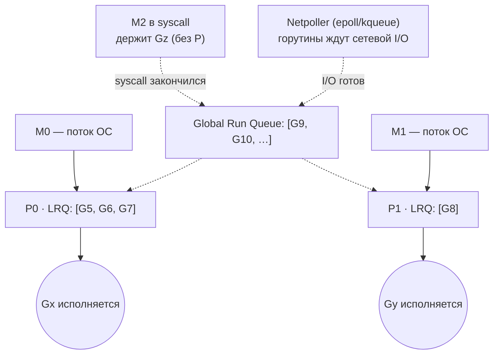

# Go Scheduler: GMP модель и preemption

Scheduler определяет, как горутины распределяются по OS threads и CPU. Senior-уровень — это не просто "есть горутины и они дешевые", а умение объяснить GMP механику, work stealing, preemption, поведение при syscall и почему GOMAXPROCS важен в контейнерах.

## Содержание

- [GMP модель](#gmp-модель)
- [Горутина: стек и состояния](#горутина-стек-и-состояния)
- [Очереди работы](#очереди-работы)
- [Work stealing](#work-stealing)
- [Цикл поиска работы: findRunnable](#цикл-поиска-работы-findrunnable)
- [Модель планирования горутин](#модель-планирования-горутин)
- [Preemption (вытеснение)](#preemption-вытеснение)
- [sysmon: фоновый смотритель](#sysmon-фоновый-смотритель)
- [Syscall: handoff механизм](#syscall-handoff-механизм)
- [Netpoller интеграция](#netpoller-интеграция)
- [Таймеры и time.Sleep](#таймеры-и-timesleep)
- [GOMAXPROCS в контейнерах](#gomaxprocs-в-контейнерах)
- [Типовые ошибки](#типовые-ошибки)
- [Диагностика](#диагностика)
- [Interview-ready answer](#interview-ready-answer)

## GMP модель

Три сущности runtime scheduler:

```
G — Goroutine      стек + program counter + состояние; дешевая (~2 KB начальный стек)
M — Machine        OS thread; выполняет Go код; нужен P для запуска горутин
P — Processor      виртуальный процессор; держит локальную очередь горутин (LRQ)
```

Схема взаимодействия:



Пунктирные стрелки `Global Run Queue → P` означают: **P добирает горутины из глобальной очереди, когда его LRQ пуста**.

Читается так: поток `M` берёт `P` (рабочее место с очередью LRQ) и исполняет из неё текущую `G`. Когда LRQ пуста — P добирает из глобальной очереди. Источники новых готовых горутин: глобальная очередь, разбуженные netpoller'ом (сетевой I/O готов) и вернувшиеся из syscall. Детали каждого — в разделах ниже.

Ключевые правила:
- число P = `GOMAXPROCS` (по умолчанию число логических CPU хоста);
- горутина выполняется только на M, у которого есть P;
- M может существовать без P — например, во время blocking syscall;
- M может быть больше P: при syscall M теряет P и появляется новый M.

### Зачем нужен P? (классический вопрос)

Самое непонятное в модели — зачем третья сущность, если «горутина исполняется на потоке». Ответ — в истории: до Go 1.1 было только **G и M** с одной **глобальной** очередью под глобальным локом. На многих ядрах M толкались на этом локе → планировщик не масштабировался.

В Go 1.1 ввели **P** — это «право исполнять Go-код» плюс своя локальная очередь горутин. Что это дало:

- **локальная очередь на каждый P → почти без локов** (ровно как per-P `mcache` в аллокаторе — тот же приём: локально без contention, к общему идём редко);
- **число P = GOMAXPROCS ограничивает реальный параллелизм** Go-кода: сколько бы ни было горутин и потоков, одновременно исполнять Go могут только `GOMAXPROCS` штук;
- **work stealing** между P-очередями;
- **P переживает блокировку M**: M ушёл в OS-ядро на syscall — P отцепляется и отдаётся другому M, исполнение Go продолжается (см. handoff ниже).

Аналогия (та же, что на схеме выше): **M — рабочий (поток ОС), P — рабочее место со станком и очередью задач, G — задача.** Рабочих может быть больше, чем мест (`M > P`, когда часть M застряла в syscall), но *работать* (исполнять Go) можно только заняв место. Свободных мест ровно `GOMAXPROCS`.

### Откуда берутся потоки (M) и куда деваются

M — это **настоящий поток ОС** (на Linux создаётся через `clone`). Их число не фиксировано и управляется рантаймом динамически:

- **Создаются по требованию (лениво).** Если есть готовая горутина, но нет свободного M, чтобы посадить её на простаивающий P, рантайм создаёт новый поток (`newm` → `clone`). Классический триггер: M ушёл в blocking syscall и «увёл» поток в OS-ядро, а работа есть — поднимается новый M, чтобы P не простаивал.
- **Переиспользуются, а не уничтожаются.** Освободившийся M не убивается, а **паркуется** в idle-пул (`sched.midle`, спит на futex — CPU не ест) и ждёт работы. Поэтому число потоков обычно растёт до пика и держится: Go в рантайме почти никогда не уменьшает количество потоков.
- **Почему потоков может быть больше GOMAXPROCS.** Одновременно исполнять Go-код могут только `GOMAXPROCS` штук (= число P). Лишние потоки нужны для: M, застрявших в **blocking syscall** (держат поток в OS-ядре, но без P), **cgo**-вызовов и `LockOSThread`. Такие потоки **не жрут CPU** (спят в OS-ядре/futex), но занимают память (стек потока).
- **Верхний предел.** `runtime.SetMaxThreads` (по умолчанию **10000**). Превышение → краш (`fatal error: thread exhaustion`). Поэтому тысячи параллельных blocking-операций (например, файловый I/O в цикле без ограничения) могут упереться в лимит — детали в [02-syscall](./02-syscall.md).

Итог: «появляется новый M» — это `clone` нового потока ОС (или переиспользование припаркованного). Потоки дешевле создавать редко и держать в пуле, чем плодить на каждую горутину — поэтому горутины мультиплексируются на небольшое, стабильное число M.

### M, P, G в коде

Все три сущности — это структуры рантайма (`runtime/runtime2.go`). Покажем их по порядку **M → P → G**, чтобы связь была видна сразу: поток `M` держит рабочее место `P`, в `P` лежит очередь горутин, а сама `G` хранит свой контекст.

```go
// runtime/runtime2.go (всё сильно упрощено)

// M — поток ОС
type m struct {
    g0       *g       // системная горутина планировщика (свой фикс. системный стек, не растёт)
    curg     *g       // текущая ПОЛЬЗОВАТЕЛЬСКАЯ горутина на этом M
    p        puintptr // привязанный P (nil, напр. в syscall)
    oldp     puintptr // P до syscall (вернуть на exitsyscall)
    spinning bool     // M ищет работу (work stealing)
    blocked  bool     // M спит в idle-пуле
    lockedg  guintptr // непусто при runtime.LockOSThread
    // …
}

// P — «рабочее место»: локальная очередь горутин + per-P кэш аллокатора
type p struct {
    runqhead uint32
    runqtail uint32
    runq     [256]guintptr // LRQ: кольцевой буфер (локально, почти без локов)
    runnext  guintptr      // приоритетный слот «только что разблокирована»
    mcache   *mcache       // тот же per-P кэш, что в аллокаторе (см. 02-allocator)
    // …
}

// G — горутина: стек + сохранённый контекст + состояние
type g struct {
    stack         stack         // границы стека: lo .. hi
    stackguard0   uintptr       // порог роста стека (+ флаг preemption)
    m             *m            // на каком M исполняется СЕЙЧАС (или nil)
    sched         gobuf         // СОХРАНЁННЫЙ контекст CPU — см. ниже
    atomicstatus  atomic.Uint32 // состояние (таблица в след. разделе)
    goid          uint64
    waitreason    waitReason    // почему в Gwaiting (видно в дампах)
    gopc, startpc uintptr       // где создана / функция горутины
    // …
}

// gobuf — «замороженный» контекст: позволяет продолжить G на ЛЮБОМ M.
// Это регистры CPU: sp = Stack Pointer (вершина стека),
// pc = Program Counter (адрес следующей инструкции), bp = Base Pointer (база кадра).
type gobuf struct { sp, pc, bp uintptr /* … */ }

// schedt — ГЛОБАЛЬНАЯ структура планировщика (одна на процесс)
var sched schedt
type schedt struct {
    lock     mutex
    runq     gQueue   // GRQ — глобальная очередь (под sched.lock)
    runqsize int32
    midle    muintptr // пул простаивающих M
    pidle    puintptr // пул простаивающих P
    // …
}
```

Как читать связи:

- **`m.curg ↔ g.m`** — пока горутина исполняется, M и G ссылаются друг на друга. `m.g0` — отдельная системная горутина с большим стеком, на которой работает **сам планировщик**; переключение «исполняем код ↔ исполняем планировщик» = смена `g0 ↔ curg`.
- **`p.runq` = LRQ** (локальная), **`sched.runq` = GRQ** (общая, под `sched.lock`). Та же логика, что в аллокаторе: локальное на каждый P, к глобальному — редко. Рядом в `p` лежит и `mcache` — тот же per-P приём. *Почему «почти без локов»:* мьютекса на горячем пути нет, но индексы `runqhead/runqtail` синхронизируются **атомарным CAS** (с этой же очереди параллельно крадут другие P), а при переполнении (`>256`) половина LRQ сбрасывается в GRQ уже под `sched.lock`.
- **`g.sched`** хранит `SP/PC/BP`. Когда горутину снимают с M (вытеснение, блок, syscall), её регистры сохраняются сюда; для возобновления планировщик грузит `g.sched` обратно — **на любом** свободном M. Поэтому горутина «переносима» между потоками (M:N), а переключение между горутинами дешевле, чем context switch потоков ОС: остаёмся в user-space, меняем несколько регистров, не идём в OS-ядро.

### Как LRQ работает без лока: runqhead/runqtail и CAS

`runq [256]guintptr` — это **кольцевой буфер**, а `runqhead`/`runqtail` — два монотонно растущих счётчика (`uint32`, никогда не сбрасываются). Реальный индекс в массиве = `счётчик % 256`, а длина очереди = `tail − head`. Это **lock-free SPMC-очередь** (один продюсер — владелец-P, несколько консьюмеров — владелец + воры). Хитрость в том, что **голова и хвост синхронизируются по-разному**:

```
ХВОСТ (tail) — пишет только ВЛАДЕЛЕЦ (один продюсер) → CAS не нужен:
  runqput(gp):            // владелец кладёт в свою очередь
    h := atomic.LoadAcq(&runqhead)   // прочитать голову (её двигают воры)
    t := runqtail
    if t - h < 256 {
        runq[t % 256] = gp
        atomic.StoreRel(&runqtail, t+1)  // release-store: слот виден ДО сдвига хвоста
        return
    }
    runqputslow(gp)        // полна → половину в GRQ (под sched.lock)

ГОЛОВА (head) — её трогают И владелец, И воры (несколько консьюмеров) → CAS:
  runqget():              // владелец берёт из своей очереди
    h := atomic.LoadAcq(&runqhead); t := runqtail
    if t == h { return nil }          // пусто
    gp := runq[h % 256]
    if atomic.CasRel(&runqhead, h, h+1) { return gp }  // CAS: вдруг вор уже забрал
    // CAS не прошёл → повторить

  runqgrab() (вор):       // другой P крадёт половину
    h := atomic.LoadAcq(&runqhead); t := atomic.LoadAcq(&runqtail)
    n := (t - h) / 2
    // скопировать n горутин начиная с h
    if atomic.CasRel(&runqhead, h, h+n) { return n }   // CAS на n вперёд
    // не прошёл → повторить
```

Почему так:
- **хвост — один писатель** (только владелец `runqput`), поэтому достаточно `StoreRel` (атомарная запись), без CAS. Воры хвост только **читают**;
- **голова — много писателей** (владелец в `runqget` + любой вор в `runqgrab`), поэтому её двигают через **CAS**: кто первый успел `head→head+1`, тот и забрал горутину; проигравший повторяет;
- `LoadAcq`/`StoreRel`/`CasRel` (acquire/release) дают нужный порядок памяти: тот, кто увидел новый `tail`, **гарантированно видит и записанную в слот горутину** (а не мусор).

Отсюда и «почти без локов»: на горячем пути — атомики (одна запись для put, один CAS для get/steal), а настоящий `sched.lock` берётся только при переполнении (спилл в GRQ).

### Сколько горутин «системных»? (тоже спрашивают)

Да, `g0` есть у **каждого** M — это служебная горутина, на стеке которой исполняется планировщик и почти весь runtime-код (не пользовательский). У каждого M их даже две служебные:

- **`g0`** — стек для планировщика / роста стека / GC-работы;
- **`gsignal`** — отдельный стек для обработчиков сигналов ОС.

Это **не «обычные» горутины**: их столько же, сколько M, и `runtime.NumGoroutine()` их **не считает** — это, по сути, собственные стеки потока.

> **g0-стек — фиксированный, он НЕ растёт.** В отличие от обычной горутины (2 KB → копирование ×2), стек `g0` — это системный стек потока: ~8 KB для потоков, созданных рантаймом; у `m0` (главный поток) g0 использует большой стек ОС (~8 MB). Почему не растёт: сам механизм роста стека (`morestack`/`newstack`) исполняется **на g0** — если бы g0 нужно было растить, вышла бы бесконечная рекурсия. Поэтому runtime-код, который гоняют на системном стеке (планировщик, GC, рост стека), держат «мелким» и помечают `//go:systemstack`. Переключение на g0 для таких операций — через `systemstack(fn)`.

Отдельно рантайм держит несколько **фоновых системных горутин** (это уже настоящие `g`, просто помечены как system):

| Горутина | Зачем |
|---|---|
| `forcegc` | спит, sysmon будит для форс-GC раз в 2 мин |
| `bgsweep` | фоновый sweep прошлого GC-цикла |
| `bgscavenge` | возврат простаивающей памяти OS |
| `runfinq` | запуск финализаторов (создаётся при первом `SetFinalizer`) |
| GC mark workers | ~`GOMAXPROCS` штук, только во время сборки |

Эти system-горутины **не входят** в `runtime.NumGoroutine()` (рантайм вычитает `sched.ngsys`), но **видны** в дампе стеков (`SIGQUIT` / `pprof goroutine`). Поэтому у только что запущенной программы `NumGoroutine() == 1` (один `main`), хотя в полном дампе увидишь ещё 3–5 системных.

## Горутина: стек и состояния

**Начальный размер стека: 2 KB** (с Go 1.4; до этого было 8 KB).

Стек горутины растет автоматически через **contiguous stack copy** (Go 1.3+):
- при переполнении runtime аллоцирует стек в 2× больше;
- копирует текущий стек;
- обновляет все указатели внутри;
- старый стек освобождается.

Максимум стека по умолчанию: **1 GB** на 64-bit системах.  
Для сравнения: OS thread stack — 1–8 MB и не растет автоматически.

```go
// Сравнение стоимости горутины и OS thread:
// goroutine:  ~2 KB стек + ~450 bytes struct = ~2.5 KB
// OS thread:  ~2–8 MB стек = 1000x дороже
// Именно поэтому 100k горутин нормально, 100k threads — нет
```

**Состояния горутины** (поле `g.atomicstatus` из структуры выше):

| Состояние   | Что происходит |
|-------------|----------------|
| `Grunnable` | готова к выполнению, ждет в очереди P |
| `Grunning`  | выполняется на M |
| `Gwaiting`  | заблокирована (channel, mutex, timer, select) |
| `Gsyscall`  | в системном вызове; M и G существуют без P |
| `Gdead`     | завершена, struct можно переиспользовать |

Когда горутина в `Gwaiting`, поле `g.waitreason` хранит причину блокировки — она видна в дампах как `goroutine N [<reason>]:`, поэтому по `pprof goroutine` сразу понятно, *почему* горутина висит:

| `waitReason` | дамп показывает | когда |
|---|---|---|
| chan receive / chan send | `[chan receive]` | блок на `<-ch` / `ch<-` |
| select | `[select]` | ждёт в `select` |
| sync.Mutex.Lock (semacquire) | `[semacquire]` | ждёт mutex/семафор |
| sleep | `[sleep]` | `time.Sleep` |
| IO wait | `[IO wait]` | сетевой I/O в netpoller |
| GC assist wait / GC ... | `[GC assist wait]` | помогает/ждёт GC |

Переходы между состояниями:

| Переход | Когда |
|---|---|
| → `Grunnable` | `go f()` создала горутину |
| `Grunnable` → `Grunning` | планировщик выбрал её на P |
| `Grunning` → `Grunnable` | вытеснение (preempt) или `runtime.Gosched()` |
| `Grunning` → `Gwaiting` | блокировка: chan / mutex / timer / netpoll |
| `Gwaiting` → `Grunnable` | событие готово (разблокирована) |
| `Grunning` → `Gsyscall` | `entersyscall` |
| `Gsyscall` → `Grunnable` | `exitsyscall` (вернулась из OS-ядра) |
| `Grunning` → `Gdead` | `return` из функции горутины |
| `Gdead` → `Grunnable` | переиспользование под новый `go f()` |

`Gdead`-горутины не уничтожаются сразу, а складываются в free-list (`gFree`) и **переиспользуются** под новые `go f()` — поэтому запуск горутины дешевле, чем кажется (структуру `g` и стек часто берут готовыми).

## Очереди работы

Каждый P имеет:

- **`runnext`** — один слот с наивысшим приоритетом для "только что unblocked" горутины (например, goroutine, которую мы только что разблокировали через channel send);
- **LRQ (Local Run Queue)** — кольцевой буфер до **256 горутин**; P берет горутины с головы (FIFO).

Глобальная очередь `sched.runq`:
- неограниченная; пополняется когда LRQ полна или горутина создается без привязки к P;
- каждый **61-й вызов планировщика** P обязательно заглядывает в глобальную очередь.

> «Такт» здесь — это **счётчик решений планировщика** (`schedtick`), а не CPU-такты и не время. Каждый раз, когда P выбирает следующую горутину, счётчик растёт; на каждом 61-м P берёт горутину из глобальной очереди, даже если своя LRQ не пуста. Зачем: иначе P, у которого в LRQ постоянно появляются новые горутины (например, цепочка `go`-вызовов), мог бы вечно крутить только свою очередь, и горутины в глобальной (или украденные у других) голодали бы. Число 61 — простое, не кратное типичным размерам, чтобы избегать резонансных паттернов.

В коде (структуры см. в [M, P, G в коде](#m-p-g-в-коде)): **LRQ — это `p.runq`** (локальная, почти без локов, как соседний с ней per-P `mcache`), а **GRQ — это `runtime.sched.runq`** (общая, под `sched.lock`). Поэтому к GRQ ходят редко (раз в 61 решение / когда LRQ пуста), а основная работа крутится в локальных очередях.

### Лимиты очередей и overflow в GRQ

| Очередь | Лимит | Что это |
|---|---|---|
| `runnext` | **1 слот** | приоритетная «только что разбуженная» горутина |
| **LRQ** (`p.runq`) | **ровно 256** (фикс. массив `[256]guintptr`) | локальная очередь P |
| **GRQ** (`sched.runq`) | **не ограничена** (связный список) | глобальная очередь |

Что происходит, когда спавнишь `go f()`, а LRQ этого P уже **полна (256)**: `runqput` не ждёт места, а **сбрасывает половину локальной очереди (~128 горутин) в GRQ** (`runqputslow` → `globrunqputbatch`). Так LRQ остаётся быстрой и ограниченной, а излишек уходит в общую очередь.

Отсюда поведение под бурстом создания горутин:

```
тысячи `go` за раз → LRQ каждого P добивается до 256
                   → излишек половинами уходит в GRQ
                   → в schedtrace runqueue (GRQ) подскакивает (сотни)
                   → потом P разгребают LRQ и GRQ → runqueue падает
```

Именно это видно в [examples/schedtrace](./examples/schedtrace/): `runqueue` скачет до сотен на старте, потом оседает.

```
P берет из:
1. runnext       (наивысший приоритет)
2. LRQ           (голова очереди)
3. global queue  (раз в 61 такт, даже если LRQ не пуста)
4. netpoll       (ready network I/O горутины)
5. steal from P  (если все выше пусто)
```

## Work stealing

Когда у P заканчивается работа (runnext, LRQ и global queue пусты):

1. Выбирает **случайный другой P**.
2. Крадет **половину** его LRQ — берет с **хвоста** (tail stealing).
3. Если никто не может отдать — паркует M.

```
До steal:   P[1].LRQ = [G1, G2, G3, G4]
После steal: P[0] получает [G3, G4]; P[1] остается с [G1, G2]
```

Почему с хвоста: P[1] берет горутины с головы (G1, G2), P[0] берет с хвоста (G4, G3). Это минимизирует конфликт на одни и те же элементы очереди.

## Цикл поиска работы: findRunnable

Всё выше (LRQ, GRQ, work stealing, netpoll, таймеры) — это **пункты одного чеклиста**, который планировщик проходит в функции **`findRunnable()`**. Это не разовый код, а **цикл**: M крутится в нём, ища следующую горутину, и каждый раз идёт по одному и тому же порядку сверху. Когда M просыпается (из `netpoll` или из futex-сна), он просто **снова заходит в начало `findRunnable`**.

Порядок проверок (упрощённо):

```
findRunnable() для текущего P:
  1. safepoint / GC          — нужно ли остановиться для GC, отдать P GC-воркеру
  2. checkTimers(P)          — отработать СОЗРЕВШИЕ таймеры этого P  ← сюда падает time.Sleep
  3. локальная очередь (LRQ) — runnext, затем p.runq
  4. раз в 61 тик            — заглянуть в глобальную очередь (анти-голодание GRQ)
  5. глобальная очередь (GRQ) — sched.runq под sched.lock
  6. netpoll(0)              — НЕблокирующе забрать готовые СЕТЕВЫЕ горутины
  7. work stealing           — украсть половину LRQ у случайного P (+ проверить ЕГО таймеры)
  ──────────── если на всех шагах пусто: ────────────
  8. отдать P, добавить M в idle-пул
  9. netpoll(delay)          — БЛОКИРУЮЩИЙ epoll_wait, delay = время до ближайшего таймера
                               (один syscall ждёт И сеть, И будит к сроку таймера)
 10. stopm()                — припарковать поток (futex-сон), если и это не помогло
```

Ключевые связки:

- **Таймеры** исполняются на **шаге 2 (`checkTimers`)**, а не «внутри netpoll». `netpoll(delay)` на шаге 9 нужен лишь чтобы **поспать ровно до срока** ближайшего таймера (и заодно ловить сеть). Проснулся по таймауту → петля → шаг 2 запускает callback → горутина `Grunnable`. Поэтому отдельной горутины-таймера нет.
- **Сеть**: на шаге 6 — дешёвая неблокирующая проверка, когда работа и так ищется; на шаге 9 — блокирующая, когда M собрался спать.
- **Пробуждение**: вышел из `netpoll`/futex → **не делает ничего особого**, просто заходит в `findRunnable` сверху и идёт по списку заново.

> Это объясняет, почему «выполнение таймера» и «доставка сетевой горутины» — не отдельные сущности, а **шаги цикла планировщика**. Тот же чеклист — причина, почему один блокирующий `netpoll(delay)` обслуживает сразу и сеть, и таймеры.

## Модель планирования горутин

Частый вопрос на собесе: «какая у горутин модель — кооперативная, вытесняющая, какая?». Короткий ответ: **M:N, в user-space, кооперативная с асинхронной преемпцией (с Go 1.14)**. Разложим по частям.

### Concurrency, а не parallelism

Горутины — это про **конкурентность** (структурируем программу как набор независимых задач), а не автоматически про **параллелизм** (одновременное исполнение). Реальный параллелизм случается, только если `GOMAXPROCS > 1` и есть свободные ядра. На одном ядре 1000 горутин **конкурентны, но не параллельны** — они чередуются, а не бегут одновременно. («Concurrency is not parallelism», Rob Pike.)

### M:N в user-space

Go мультиплексирует **множество горутин на меньшее число потоков ОС** (модель «M:N» — много горутин на несколько потоков) силами своего планировщика **в user-space**. Важно: параллелизм Go-кода ограничен **не числом потоков, а числом P** (= `GOMAXPROCS`) — чтобы исполнять Go, M обязан держать P, а их ровно `GOMAXPROCS`. Потоков при этом может быть и больше `GOMAXPROCS` (лишние держат заблокированные в syscall/cgo горутины), но *одновременно крутить Go-код* могут только `GOMAXPROCS` из них. Ключевое следствие: переключение между горутинами не идёт через OS-ядро (в отличие от переключения потоков ОС) — меняется лишь несколько регистров (`g.sched`), поэтому оно дёшево. ОС видит только потоки `M` и про горутины ничего не знает.

> **User-space vs kernel-space.** *User-space* — режим с ограниченными привилегиями, где исполняется обычный код (твоя программа, рантайм Go): нет прямого доступа к железу и чужой памяти. *Kernel-space* — режим OS-ядра с полным доступом. Перейти из user в kernel можно только через **syscall** — это контролируемый mode switch, и он относительно дорогой. Поэтому «планировщик в user-space» = переключение горутин **не требует входа в OS-ядро** (в отличие от переключения потоков ОС, которым занимается OS-ядро). Подробно про режимы и mode switch — в [hardware-and-os/06-processes-and-threads](../../10-devops-and-observability/hardware-and-os/06-processes-and-threads.md#kernel-mode-vs-user-mode).

### Кооперативная + асинхронно-преемптивная

| Модель | Кто и когда передаёт управление |
|---|---|
| **Кооперативная** (Go до 1.14) | горутина отдаёт P **сама**, в определённых точках; принудительно её не прерывают |
| **+ Асинхронная преемпция** (Go 1.14+) | sysmon может **принудительно** вытеснить горутину (SIGURG), даже если она не уступает |
| ОС-потоки (для сравнения) | вытесняющая: OS-ядро снимает поток по таймеру (time slice) |

Точки, где горутина **кооперативно** уступает управление:

- **блокирующие операции**: chan send/receive, mutex/`sync`, syscall, сетевой I/O, `time.Sleep`;
- **явный `runtime.Gosched()`** — «уступаю добровольно»;
- **пролог функции** — там вставлена проверка роста стека и флага preemption (кооперативный safe point).

До 1.14 этого было мало: CPU-bound горутина без вызовов функций (tight loop) могла **монополизировать P навсегда** — её просто негде было прервать. Go 1.14 добавил **асинхронную преемпцию** (sysmon шлёт `SIGURG`), которая вытесняет даже такой цикл. Поэтому сегодня модель — **в основном кооперативная, а преемпция работает как страховка** от «жадных» горутин (детали — в следующем разделе).

### Что происходит на 1 ядре (GOMAXPROCS=1)

На одном ядре по умолчанию `GOMAXPROCS = 1` → **один P** → одновременно исполняется **одна** горутина. Остальные runnable чередуются на этом P (concurrency, не parallelism) — все продвигаются, но по очереди.

Но потоков ОС (M) всё равно **несколько** (`GOMAXPROCS=1` ограничивает P, а не потоки): основной M, **sysmon**, застрявшие в syscall, idle-M. Их **ОС раскладывает на одно ядро по таймслайсам** (планировщик ОС вытесняющий).

Как это спасает механизмы:

- **Async preemption работает и на 1 ядре.** Если горутина зациклилась и держит единственный P — её вытеснит sysmon. А sysmon получает CPU потому, что он **отдельный OS-поток**, и сама ОС периодически снимает «жадный» рабочий поток с ядра, давая тик sysmon'у. sysmon видит «P держится > 10 мс» → `SIGURG` → вытеснение.
- **Blocking syscall не замораживает всё.** M завис в OS-ядре → единственный P через handoff уходит другому M, тот крутит остальные горутины на том же ядре.
- **Network I/O** — как обычно: park в netpoller, единственный M при простое спит в `netpoll`.

> **Ловушка (часто на собесе): `GOMAXPROCS=1` НЕ делает конкурентный код безопасным.** Соблазн «один P → всё последовательно → синхронизация не нужна» — ошибка: preemption переключает горутины почти в любой точке, memory model по-прежнему требует happens-before, data race остаётся багом (и `-race` его поймает). Mutex/каналы/atomic нужны и на одном ядре.

## Preemption (вытеснение)

**Preemption** — это когда планировщик **принудительно снимает** горутину с P, не дожидаясь, пока она сама уступит. Противоположность кооперативной модели (где горутина отдаёт управление только добровольно, в определённых точках). Нужно, чтобы одна «жадная» горутина не монополизировала процессор и не морила голодом остальные.

### До Go 1.14: кооперативная preemption

Горутина могла быть вытеснена только в **safe points** — точках, где компилятор вставил проверку `morestack` (при входе в каждую функцию).

**Проблема**: tight CPU loop без function calls мог занимать P вечно:

```go
// До Go 1.14: этот код блокировал scheduler на весь время работы
go func() {
    for {
        i++ // нет вызовов функций, нет safe point
    }
}()
```

### Go 1.14+: async preemption через SIGURG

Вытеснение запускает **sysmon** (фоновый смотритель, см. ниже):
- sysmon замечает, что горутина держит P дольше **10 мс** → помечает её на вытеснение и **посылает потоку сигнал `SIGURG`**;
- обработчик сигнала выполняется прямо в контексте этого потока. Если текущая точка исполнения — **async-safe** (рантайм по PC знает, где лежат указатели на стеке), он сохраняет состояние горутины и переводит её в `Grunnable`; M берёт следующую горутину;
- если точка не async-safe — горутину не трогают и пробуют позже.

Главное: для вытеснения **не нужен вызов функции** — сигнал прерывает даже tight loop с одной инструкцией.

```go
// После Go 1.14: scheduler вытеснит горутину через ~10ms, даже без function calls
go func() {
    for {
        i++
    }
}()
```

Исключение: функции с `//go:nosplit` не могут быть async-preempted.

```go
//go:nosplit
func criticalSection() {
    // не будет preem-ted, но нельзя вызывать функции, которые растут стек
}
```

## sysmon: фоновый смотритель

`sysmon` (system monitor) — это **настоящий OS-поток (отдельный `M`)**, а не горутина. Рантайм поднимает его при старте через `newm(sysmon, …)`, и этот M сразу уходит крутить функцию `sysmon()` в бесконечном цикле. Он несколько раз упоминается выше (preemption, retake P) — вот что это и зачем.

Ключевые свойства:
- это **M без P**, который **не планируется как обычная горутина**: его нет ни в одной run-queue, он исполняется прямо на своём `g0`-стеке. Поэтому он всегда может работать и не конкурирует за P с прикладными горутинами;
- **не считается в GOMAXPROCS** — это «надсмотрщик» вне обычного планирования;
- крутится в цикле с **адаптивным интервалом**: от ~20 мкс под нагрузкой до 10 мс, когда тихо (чтобы не жечь CPU на простое).

Что делает sysmon (по сути — то, что некому сделать «изнутри», потому что занятые P этим не займутся):

| Задача | Зачем                                                                                                                                                                                                              |
|---|--------------------------------------------------------------------------------------------------------------------------------------------------------------------------------------------------------------------|
| **retake P у syscall** | M застрял в долгом (> ~20 мкс) syscall → отобрать у него P и отдать другому M, чтобы P не простаивал                                                                                                               |
| **preemption** | горутина крутит P > 10 мс → пометить на вытеснение (послать SIGURG)                                                                                                                                                |
| **netpoll** | периодически спросить у OS-ядра, какие сетевые fd (file descriptor) **уже готовы** (`netpoll`/`epoll_wait` — не «опрос сети», а проверка флажков готовности), чтобы готовые I/O-горутины не висели, если все P заняты |
| **форс GC** | если GC не запускался > 2 мин — запустить принудительно                                                                                                                                                            |
| **возврат памяти** | будит scavenger, отдаёт простаивающие страницы OS                                                                                                                                                                  |
| **deadlock detection** | если все горутины спят и работать некому — `fatal error: all goroutines are asleep - deadlock!`                                                                                                                    |

Главная идея: занятые P целиком заняты исполнением Go-кода и не могут «оглядываться по сторонам». sysmon — это отдельный глаз, который замечает застрявшие syscall'ы, зажравшиеся CPU горутины и просроченный GC, и пинает систему.

## Syscall: handoff механизм

Когда горутина делает **blocking syscall** (например, file I/O):

```
До syscall:
  P[2] → M[2] → G[z] (running)

Syscall начинается:
  entersyscall() → G.status = Gsyscall
  P[2] отвязывается от M[2] (handoff)
  P[2] подхватывается idle M или создаётся новый M

Syscall завершается:
  exitsyscall() → пытается взять P обратно (fast path)
  если P нет → G[z] в global run queue (slow path)
```

**Handoff**: P не ждёт завершения syscall, а сразу отдаётся для других горутин. `sysmon` принудительно забирает P у M в syscall через ~20 мкс если есть горутины в очереди.

Для **сетевого I/O**: горутина паркуется через netpoller, M **не блокируется** вообще — это принципиальное отличие от файлового I/O.

→ Подробно: [02-syscall.md](./02-syscall.md) — `entersyscall`/`exitsyscall` механика, sysmon retake, CGo, `LockOSThread`, thread exhaustion.

## Netpoller интеграция

Сетевой I/O в Go работает через `epoll` (Linux) / `kqueue` (macOS):

```
conn.Read(buf):
  1. syscall.Read() с O_NONBLOCK → EAGAIN (нет данных)
  2. горутина регистрируется в pollDesc → gopark() → Gwaiting
  3. M освобождается, берёт другую горутину из LRQ

данные готовы:
  4. epoll_wait → уведомление по fd
  5. netpoll() → G переходит в Grunnable → в LRQ
  6. G продолжает, Read возвращает данные
```

Именно поэтому 100k concurrent TCP connections работают с 4–8 OS threads. Горутины в `Gwaiting` потребляют только память (~2 KB стека), не CPU.

→ Подробно: [03-netpoller.md](./03-netpoller.md) — pollDesc, epoll интеграция, SetDeadline через таймеры, DNS resolver, диагностика CLOSE_WAIT/TIME_WAIT.

## Таймеры и time.Sleep

`time.Sleep`, `Timer`, `Ticker` — это **не syscall на каждый таймер и не отдельный поток**. Горутина паркуется (`Gwaiting`/`[sleep]`), таймер кладётся в **per-P кучу**, M свободен и берёт другую работу. Истёкшие таймеры запускает сам планировщик (`findRunnable` → `checkTimers`); отдельной горутины-таймера с Go 1.14 нет. Единственный syscall ожидания — когда всё простаивает: один M спит в `netpoll(delay)` с таймаутом = ближайший дедлайн (один syscall на сеть И таймеры).

→ Подробно: [04-timers.md](./04-timers.md) — per-P timer heap, `runtime.timer`, почему это не syscall и что с M, Timer/Ticker/After и утечки, история `timerproc` до 1.14.

## GOMAXPROCS в контейнерах

По умолчанию `GOMAXPROCS = runtime.NumCPU()` — число логических CPU **хоста**, а не контейнера.

**Проблема**: контейнер с `cpu.limit = 0.5` на 64-ядерном хосте:
- Go создает 64 P и 64+ OS threads;
- CPU scheduler хоста throttle-ит их до 50%;
- высокий context switch overhead и starvation.

```go
// Вариант 1: библиотека automaxprocs
import _ "go.uber.org/automaxprocs"
// читает cgroup cpu.max при старте, устанавливает GOMAXPROCS правильно

// Вариант 2: вручную через переменную окружения
// GOMAXPROCS=2 ./myapp

// Вариант 3: из кода (редко нужен)
import "runtime"
runtime.GOMAXPROCS(runtime.NumCPU())
```

```yaml
# docker-compose: явное ограничение
resources:
  limits:
    cpus: '2.0'
# с automaxprocs: GOMAXPROCS будет установлен в 2
```

## Типовые ошибки

**Неограниченный fan-out:**
```go
// Плохо: 10k горутин живут ОДНОВРЕМЕННО (память, contention, перегруз БД/API)
for _, item := range items {
    go process(item)
}

// Вариант 1 — семафор: ограничивает ОДНОВРЕМЕННЫЕ горутины (≤100 живых)
sem := make(chan struct{}, 100)
for _, item := range items {
    sem <- struct{}{}            // блокируется, когда 100 уже в полёте
    go func(item Item) {
        defer func() { <-sem }()
        process(item)
    }(item)
}
// ⚠️ Горутин всё равно создаётся 10k суммарно — просто живых ≤100 в каждый момент.
//    Семафор бьёт по КОНКУРЕНТНОСТИ, а не по общему числу созданных горутин.

// Вариант 2 — настоящий worker pool: создаётся РОВНО N горутин (переиспользуются)
const workers = 100
jobs := make(chan Item)
var wg sync.WaitGroup
for i := 0; i < workers; i++ {
    wg.Add(1)
    go func() {
        defer wg.Done()
        for item := range jobs { // воркер живёт, пока канал не закрыт
            process(item)
        }
    }()
}
for _, item := range items {
    jobs <- item
}
close(jobs)
wg.Wait()
```

| | Семафор | Worker pool (jobs-канал) |
|---|---|---|
| Горутин создаётся | 10k (≤100 живых) | ровно N, переиспользуются |
| Ограничивает | конкурентность | и конкурентность, и число горутин |
| Когда | задач немного / горутины короткие, нужен минимум кода | очень много задач / hot path / нужен ровно N |

Горутины дёшевы, поэтому 10k короткоживущих часто нормально — семафор простой и хороший выбор. Фиксированный пул выигрывает, когда задач очень много или создание/уничтожение горутин на hot path начинает стоить.

**Goroutine leak:**
```go
// Плохо: горутина зависает навсегда
go func() {
    result := <-ch // если никто не пошлет в ch — утечка
    process(result)
}()

// Хорошо: всегда передавать context
go func(ctx context.Context) {
    select {
    case result := <-ch:
        process(result)
    case <-ctx.Done():
        return
    }
}(ctx)
```

**Завышенный GOMAXPROCS в контейнере** без automaxprocs — scheduler contention и CPU throttling.

## Диагностика

```bash
# Scheduler events трейс: выводит состояние каждые 1000ms
GODEBUG=schedtrace=1000 ./myapp

# Пример вывода:
# SCHED 1000ms: gomaxprocs=4 idleprocs=0 threads=6 spinningthreads=1
#               idlethreads=1 runqueue=2 [3 1 0 2]
#
# gomaxprocs=4       — число P
# idleprocs=0        — простаивающих P (0 = все заняты, хорошо под нагрузкой)
# threads=6          — всего OS threads (включая sysmon, netpoller)
# spinningthreads=1  — M (с привязанным P), что ищут работу перед парковкой (крадут из чужих LRQ).
#                      Считаются именно M, но steal двигает горутины между очередями P
# idlethreads=1      — припаркованные M (резерв в idle pool)
# runqueue=2         — горутин в глобальной очереди
# [3 1 0 2]          — длины LRQ каждого P (дисбаланс → work stealing)
```

> Сигналы тревоги в `schedtrace`: стабильно растущий `runqueue` или ненулевой `idleprocs` под нагрузкой → не хватает параллелизма или горутины голодают; много `spinningthreads` → потоки жгут CPU в поисках работы.

> 🧪 **Запусти сам:** [examples/schedtrace](./examples/schedtrace/) — синтетическая программа, на которой видно work stealing, рост GRQ, async preemption и поведение при `GOMAXPROCS=1`. `GODEBUG=schedtrace=1000 go run .`

```go
// Количество горутин прямо сейчас
n := runtime.NumGoroutine()

// goroutine pprof профиль — покажет stacktrace каждой горутины
// GET http://localhost:6060/debug/pprof/goroutine?debug=2

// Детальная трассировка scheduler (запись событий в файл)
import "runtime/trace"

f, _ := os.Create("trace.out")
trace.Start(f)
// ... работа сервиса ...
trace.Stop()
// go tool trace trace.out  — открывает в браузере
```

## Interview-ready answer

**1. «Объясни GMP модель Go scheduler»**

Три сущности: **G** (горутина — начальный стек 2 KB, намного дешевле OS thread), **M** (OS thread — исполняет Go-код) и **P** (виртуальный процессор — «право исполнять Go» + локальная очередь горутин LRQ до 256). Количество P = GOMAXPROCS. Горутина исполняется только на M, у которого есть P. Аналогия: M — рабочий, P — рабочее место, G — задача; рабочих может быть больше, чем мест.

**2. «Какая модель планирования у горутин — кооперативная, вытесняющая?»**

**M:N, в user-space, кооперативная с асинхронной преемпцией (с Go 1.14).** Множество горутин мультиплексируются на меньшее число потоков ОС силами планировщика Go без участия OS-ядра (переключение дёшево). Параллелизм Go-кода ограничен **числом P (= GOMAXPROCS)**, а не числом потоков: чтобы исполнять Go, нужен P, потоков может быть и больше. Горутина уступает P **сама** в точках: блокирующие операции (chan/mutex/syscall/netpoll/Sleep), `Gosched()`, пролог функции. С 1.14 sysmon может ещё и **принудительно** вытеснить (SIGURG) — страховка от tight loop. И помни: горутины — это про concurrency, а параллелизм будет только при `GOMAXPROCS > 1`.

**3. «Зачем нужен P, почему не просто G и M?»**

До Go 1.1 было только G и M с одной глобальной очередью под глобальным локом — на многих ядрах M толкались на этом локе и планировщик не масштабировался. P дал каждому потоку **локальную очередь без локов** (как per-P `mcache` в аллокаторе), ограничил реальный параллелизм Go-кода числом `GOMAXPROCS`, включил work stealing, и позволил P «пережить» блокировку M в syscall (P отдаётся другому M).

**4. «Что делает work stealing и handoff?»**

Когда у P кончилась работа, он крадёт **половину** LRQ у случайного другого P, забирая **с хвоста** (минимум конфликтов: владелец берёт с головы). Когда горутина уходит в blocking syscall, M отцепляется от P — это **handoff**: P подхватывает другой M, исполнение продолжается без блокировки.

**5. «Чем отличается обработка file I/O и network I/O планировщиком?»**

**Network I/O** не блокирует M: сокет в O_NONBLOCK, горутина паркуется в netpoller (`Gwaiting`), M сразу берёт другую — поэтому 100k соединений живут на 4–8 потоках. **File/blocking syscall** блокирует M в OS-ядре: P через handoff уходит другому M, а на застрявший syscall Go при необходимости поднимает новый поток — отсюда риск thread exhaustion при тысячах параллельных файловых операций.

**6. «Как работает preemption?»**

До Go 1.14 — только кооперативно, в safe points (вход в функцию), и tight loop без вызовов мог занять P навсегда. С 1.14 — **async preemption**: sysmon замечает, что горутина держит P > 10 мс, шлёт потоку `SIGURG`, обработчик в async-safe точке вытесняет горутину. Вызов функции не нужен.

**7. «Что такое sysmon?»**

Фоновый системный поток без P (не в GOMAXPROCS), крутится с адаптивным интервалом (20 мкс–10 мс). Делает то, на что у занятых P нет возможности «отвлечься»: отбирает P у застрявших в syscall M, инициирует preemption, дёргает netpoll (проверяет готовые сетевые fd), форсит GC раз в 2 мин, возвращает память OS, ловит deadlock.

**8. «GOMAXPROCS в контейнерах»**

По умолчанию = число CPU **хоста**, а не cpu.limit из cgroup. На 64-ядерном хосте с лимитом 2 CPU Go поднимет 64 P и кучу потоков → CPU throttling и scheduler contention. Лечится `go.uber.org/automaxprocs` (читает cgroup) или явным `GOMAXPROCS`. В Go 1.25+ рантайм частично учитывает cgroup-лимит сам.

**9. «`time.Sleep` — это syscall? что с потоком?»**

Нет, отдельного syscall на сон нет и поток не блокируется. Горутина паркуется (`Gwaiting`/`[sleep]`), таймер кладётся в **per-P кучу**, M свободен и берёт другую работу. Отдельной горутины-таймера с Go 1.14 нет — истёкшие таймеры запускает планировщик в `findRunnable`. Единственный syscall ожидания — когда всё простаивает: один M спит в `netpoll(delay)` (`epoll_wait` с таймаутом = ближайший дедлайн), и этот один syscall обслуживает и сеть, и таймеры. Проверка времени — `nanotime` через vDSO, тоже не syscall. Итог: миллион `Sleep` = миллион записей в кучах, но 0–1 ждущий поток.
