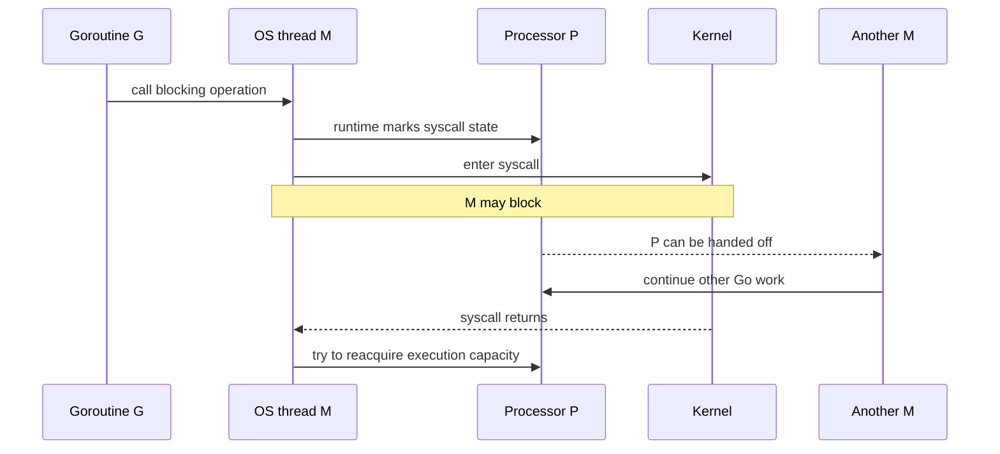

# Syscall: что блокируется и как scheduler сохраняет parallelism

Главный вопрос этого файла: что происходит с G, M и P, когда Go-код переходит в OS kernel или foreign code.

## Содержание

- [Три разных вида ожидания](#три-разных-вида-ожидания)
- [Какие системные вызовы скрывает Go API](#какие-системные-вызовы-скрывает-go-api)
- [Blocking syscall flow](#blocking-syscall-flow)
- [Короткий и долгий syscall](#короткий-и-долгий-syscall)
- [Возврат из syscall](#возврат-из-syscall)
- [Почему context не всегда отменяет syscall](#почему-context-не-всегда-отменяет-syscall)
- [syscall.Syscall и RawSyscall](#syscallsyscall-и-rawsyscall)
- [cgo](#cgo)
- [runtime.LockOSThread](#runtimelockosthread)
- [Thread exhaustion](#thread-exhaustion)
- [Диагностика](#диагностика)
- [Interview-ready answer](#interview-ready-answer)
- [Официальные источники](#официальные-источники)

## Три разных вида ожидания

Не всякая операция с именем `Read` ведёт себя одинаково:

| Операция | Типичный путь | Что ждёт |
| --- | --- | --- |
| regular file I/O, часть device calls, blocking syscall | OS syscall | M blocked в kernel |
| TCP/UDP/Unix socket, pipe и другой pollable descriptor | runtime netpoller | G parked, M свободен |
| `time.Sleep`, channel, mutex | runtime | G parked; syscall может не быть вообще |

Это platform- и descriptor-specific поведение. Например, `os.File` может представлять regular file, pipe или socket, и runtime path будет различаться.

Ключевой вопрос: **может ли runtime перевести fd в non-blocking mode и ждать readiness через netpoller?** Если да — thread обычно не блокируется на всё время ожидания. Если нет — kernel удерживает M до return.

### Конкретные примеры

| Go operation | Типичный механизм | Удерживает M во время ожидания? |
| --- | --- | --- |
| `net.Conn.Read/Write`, `Listener.Accept` | non-blocking fd + netpoller | Обычно нет: park G |
| `os.File.Read` для regular file | blocking file syscall | Может удерживать M |
| `exec.Cmd.Wait/Run` | process wait | Может удерживать M |
| blocking cgo function | foreign call | Да, пока C code не возвращается |
| `time.Sleep` | runtime timer | Нет: park G |
| channel/mutex wait | runtime synchronization | Нет: park G |
| `time.Now` на обычном Linux fast path | vDSO/user-space mapping | Обычно нет настоящего syscall |

Одинаковый method `Read` не определяет runtime path. Важен underlying descriptor: `*os.File` может оборачивать regular file, pipe, terminal или socket.

<details>
<summary>Мини-эксперимент: file reads против network waits</summary>

```go
// File operations могут занять несколько M, если storage реально блокирует.
for i := 0; i < 2_000; i++ {
	go func() {
		_, _ = os.ReadFile(path)
	}()
}

// Network connections без данных обычно park G через netpoller.
for _, conn := range conns {
	go func(conn net.Conn) {
		var one [1]byte
		_, _ = conn.Read(one[:])
	}(conn)
}
```

`/etc/hosts` часто находится в page cache и завершается слишком быстро, поэтому не является хорошей демонстрацией blocked disk I/O. Для наблюдения нужен контролируемый slow filesystem/device или trace реальной нагрузки.

Сравнивайте:

```bash
GODEBUG=schedtrace=500,scheddetail=1 ./demo
go tool trace trace.out
```

Смотрите не только goroutine count, но и `threads`, состояния `[syscall]`/`[IO wait]` и длительность operations.

</details>

## Какие системные вызовы скрывает Go API

Обычно Go-код обращается к переносимым пакетам `os`, `net`, `os/exec` и `time`, а не вызывает ядро напрямую. Стандартная библиотека и runtime преобразуют эти операции в системные вызовы конкретной платформы.

В таблице приведены **типичные вызовы Linux**, а не контракт функций Go. Точное имя и количество вызовов зависят от ОС, архитектуры, версии Go, типа файлового дескриптора и текущей реализации runtime.

**Файловый дескриптор** (`file descriptor`, или `fd`) — небольшое целое число, через которое процесс обращается к открытому файлу, сокету, каналу и некоторым другим объектам ядра.

| Задача | Пример Go API | Типичные вызовы Linux | Что просим сделать ядро |
| --- | --- | --- | --- |
| Открыть и закрыть файл | `os.Open`, `os.Create`, `File.Close` | `openat`, `close` | найти путь, проверить права и создать или закрыть `fd` |
| Читать и писать | `File.Read`, `File.Write`, `io.Copy` | `read`, `write`, иногда `pread64`, `pwrite64`, `copy_file_range` | перенести данные между памятью процесса и объектом ядра |
| Получить метаданные | `os.Stat`, `File.Stat` | `newfstatat`, `fstat`, иногда `statx` | вернуть размер, права, владельца и время изменения |
| Работать с каталогами и путями | `os.ReadDir`, `os.Mkdir`, `os.Rename`, `os.Remove` | `getdents64`, `mkdirat`, `renameat`, `unlinkat` | прочитать записи каталога или изменить дерево имён файлов |
| Синхронизировать данные с хранилищем | `File.Sync` | `fsync` | попросить ядро сбросить данные и метаданные на хранилище |
| Создать сетевое соединение | `net.Dial`, `net.Listen` | `socket`, `connect`, `bind`, `listen` | создать сокет и настроить его роль и адрес |
| Принимать и передавать сетевые данные | `Listener.Accept`, `Conn.Read`, `Conn.Write`, `UDPConn.ReadFrom` | `accept4`, `read`/`recvfrom`, `write`/`sendto` | принять соединение или передать данные через сетевой стек |
| Ждать готовности сети | скрыто внутри Go netpoller | `epoll_ctl`, `epoll_wait`/`epoll_pwait` | подписаться на события `fd` и ждать готовности без отдельного блокирующего потока на каждое соединение |
| Запустить и дождаться процесса | `exec.Command(...).Start`, `Cmd.Wait` | `clone` или `fork`, затем `execve`; `wait4`/`waitid` | создать процесс, заменить его программу и получить статус завершения |
| Работать с сигналами | `os/signal.Notify`, `Process.Signal` | `rt_sigaction`, `rt_sigprocmask`, `kill` | настроить обработку сигнала или отправить его процессу |
| Получить память у ОС | скрыто внутри Go runtime | `mmap`, `madvise`, `munmap` | создать, настроить или удалить отображение виртуальной памяти |
| Парковать и будить потоки | скрыто внутри runtime и `sync` | `futex` | усыпить поток при ожидании и разбудить его при изменении состояния |
| Управлять устройством или особым `fd` | функции `golang.org/x/sys/unix` | `ioctl`, `fcntl` | выполнить платформозависимую команду для объекта ядра |

Таблица отвечает на вопрос «какие системные вызовы могут находиться под Go API», но сама по себе не показывает, блокируется ли `M`. Например, `net.Conn.Read` в итоге читает данные через `read`, но ожидание готовности сокета обычно проходит через netpoller: `G` паркуется, а `M` продолжает другую работу.

Названия помогают читать `strace`, профили и документацию Linux, но запоминать весь список не требуется. Полезнее понимать группы: **файлы, сеть, процессы, память, сигналы и ожидание событий**. Базовая граница между приложением и ядром отдельно разобрана в [«Что такое ОС»](../../10-devops-and-observability/hardware-and-os/00-what-is-an-os.md#как-приложение-взаимодействует-с-ядром).

### Одна функция Go может выполнить несколько системных вызовов

Рассмотрим:

```go
data, err := os.ReadFile("/etc/hostname")
```

Упрощённая последовательность на Linux выглядит так:

```text
os.ReadFile("/etc/hostname")
    -> openat(...)       открыть файл и получить fd
    -> fstat(...)        узнать размер для начального буфера
    -> read(...)         прочитать данные; вызовов может быть несколько
    -> close(...)        освободить fd
```

Это не гарантированный навсегда набор. Стандартная библиотека может выбрать другой вызов или быстрый путь, а чтение большого файла потребует нескольких `read`. И наоборот, одна операция Go может не дойти до ядра: например, небольшая `make([]byte, 1024)` обычно обслуживается аллокатором Go из уже полученной памяти.

<details>
<summary>Как посмотреть системные вызовы Go-программы через strace</summary>

`strace` запускается на Linux и показывает переходы процесса к системным вызовам. Минимальная программа:

```go
package main

import (
    "fmt"
    "os"
)

func main() {
    data, err := os.ReadFile("/etc/hostname")
    if err != nil {
        panic(err)
    }
    fmt.Println(len(data))
}
```

Сборка и запуск:

```bash
go build -o syscall-demo .
strace -f -e trace=openat,fstat,newfstatat,read,write,close ./syscall-demo
```

В выводе будут строки примерно такого вида:

```text
openat(AT_FDCWD, "/etc/hostname", O_RDONLY|O_CLOEXEC) = 3
fstat(3, ...)                                           = 0
read(3, ..., 512)                                      = 13
read(3, ..., 499)                                      = 0
close(3)                                               = 0
write(1, "13\n", 3)                                   = 3
```

Здесь `3` — файловый дескриптор открытого файла, а `1` — стандартный вывод процесса. Точный trace отличается между версиями ядра и Go. Ключ `-f` также следует за созданными потоками и процессами; без фильтра вывод Go-программы обычно получается слишком большим для первого знакомства.

</details>

## Blocking syscall flow

Упрощённая последовательность:



В runtime этот переход связан с `entersyscall`/`exitsyscall`:

- G сохраняет execution state и помечается как находящаяся в syscall;
- M переходит в kernel и не считается исполняющим Go-код;
- P может быть retaken и использован другим M;
- после return M должен снова получить P либо сделать G runnable.

Поэтому один blocking syscall не обязан останавливать весь Go process. Цена — возможно появится дополнительный OS thread.

### Что именно сохраняет entersyscall

Перед переходом runtime фиксирует execution state G:

```text
g.syscallsp / g.syscallpc -> stack position для traceback и GC
G status                  -> _Gsyscall
P status                  -> syscall-related state
M.oldp                    -> P, с которым M входит в syscall
```

G больше не исполняет Go instructions, поэтому её stack стабилен для scan. GC знает сохранённые SP/PC и не ждёт, пока kernel operation вернётся. Это одна из причин, почему нельзя просто сделать raw transition в kernel, не уведомив runtime.

Во время syscall комбинация выглядит так:

```text
Gsyscall <--> M blocked in kernel

P больше не нужен этому M для Go-кода
P ----> другой M ----> другая runnable G
```

<details>
<summary>Как свободные M и P находят друг друга</summary>

Scheduler поддерживает два разных pool:

```text
sched.pidle -> P без M
sched.midle -> parked M без P
```

Инициатива возможна с обеих сторон:

| Ситуация | Действие |
| --- | --- |
| M возвращается из syscall без P | Пытается вернуть `oldp` или взять idle P |
| P освобождается и есть runnable work | `startm/handoffp` берёт idle M или создаёт новый |
| M не находит P/work | Park и попадает в idle lifecycle |

Связывание защищается scheduler synchronization: P извлекается из pool атомарно/под lock и принадлежит только одному M. `nmspinning` и похожие counters уменьшают лишние wakeups, но не заменяют эту ownership synchronization.

</details>

## Короткий и долгий syscall

Runtime старается не делать дорогой handoff на каждый очень короткий syscall. M и P некоторое время сохраняют возможность быстро воссоединиться. Если syscall затягивается и runnable work ждёт, runtime monitor может retake P и передать его другому M.

Для операций, про которые runtime заранее знает, что они могут блокироваться, существует path с более ранним handoff (`entersyscallblock` в текущей реализации).

Точные thresholds и условия — scheduler heuristics, а не API. Для interview достаточно trade-off:

- слишком ранний handoff создаёт лишние thread/scheduling transitions;
- слишком поздний handoff оставляет P idle, хотя runnable goroutines ждут.

<details>
<summary>Три syscall scenarios пошагово</summary>

**1. Syscall быстро возвращается**

```text
before: M1 + P1 execute G1
enter:  M1 + G1 enter kernel; P1 marked syscall/available for retake
return: nobody takes P1
exit:   M1 reacquires P1 and continues G1
```

Fast path избегает лишнего enqueue G и thread wakeup.

**2. Syscall задерживается, а работа ждёт**

```text
M1 + G1 blocked in kernel
P1 remains in syscall state
        |
        | sysmon retake
        v
M2 acquires P1 -> executes G2, G3, ...

later M1 returns:
    P unavailable -> G1 becomes runnable
```

В Go 1.26 sysmon замечает P минимум на следующем monitor tick; комментарий runtime упоминает минимум порядка 20 μs, но фактическое решение учитывает runnable/idle state и может произойти позже. Это не SLA syscall handoff.

**3. Runtime заранее ожидает blocking operation**

`entersyscallblock` немедленно подготавливает handoff P вместо оптимистического ожидания быстрого return. Этот path используется внутри runtime там, где блокировка известна заранее.

</details>

## Возврат из syscall

После kernel return возможны два пути:

1. M быстро получает подходящий P и продолжает ту же G.
2. P сейчас нет — G становится runnable, а M park/reuse; G позже продолжит на другом M.

Код после syscall не должен зависеть от того, что goroutine продолжит на том же OS thread. Если нужен thread-local OS state, используют `runtime.LockOSThread` осознанно.

### Fast и slow exit paths

```text
kernel completes syscall
    |
    v
OS scheduler wakes blocked M
    |
    v
runtime.exitsyscall
    |
    +-- fast: reacquire old P / another idle P -> G continues immediately
    |
    +-- slow: no P -> G becomes runnable -> M parks or finds other lifecycle
```

Go runtime не «проверяет, закончился ли blocking read», пока M находится внутри kernel. Completion и wakeup thread делает OS. Runtime снова получает управление только после return из syscall.

Slow path может продолжить G на другом M. Даже fast path не является обещанием thread affinity: это optimization, которую code не наблюдает напрямую.

## Почему context не всегда отменяет syscall

`context.Context` — сигнал cancellation, а не универсальная кнопка прерывания kernel operation.

Cancellation работает, когда API связывает context с реальным механизмом:

- устанавливает deadline;
- закрывает fd/connection;
- вызывает platform cancellation primitive;
- разбивает работу на interruptible chunks.

Обёртка вида «запустить file read в goroutine и сделать select по `ctx.Done()`» возвращает caller раньше, но **не останавливает underlying read**. Заблокированная goroutine и M могут остаться жить до завершения syscall.

```go
result := make(chan error, 1)
go func() {
    _, err := file.Read(buf) // может продолжить ждать после cancellation caller
    result <- err
}()

select {
case err := <-result:
    return err
case <-ctx.Done():
    return ctx.Err()
}
```

Для bounded latency выбирают API с настоящим deadline/cancellation или контролируют concurrency и lifecycle ресурса.

### Почему timeout regular-file read сложнее network timeout

Network fd обычно интегрирован с poller: deadline timer может разбудить G, а close выводит fd из poller. Regular file read часто уже исполняется внутри kernel на M, и portable Go API не имеет универсального способа безопасно отменить произвольную disk/NFS operation.

`os.File.SetDeadline` работает только для типов files, которые поддерживают deadline; обычный regular file часто возвращает error вроде `os.ErrNoDeadline`. Закрытие file из другой goroutine также не является универсальной гарантией немедленно прервать уже выполняющийся syscall на каждой platform/filesystem.

Поэтому timeout wrapper решает только одну из задач:

| Цель | Что требуется |
| --- | --- |
| Caller перестаёт ждать | `select` по result и `ctx.Done()` |
| Underlying operation реально прекращается | Cancelable OS/API mechanism |
| Process не создаёт unbounded blocked work | Semaphore/worker pool/backpressure |

<details>
<summary>Bounded wrapper для операции без настоящей cancellation</summary>

Такой wrapper позволяет caller перестать ждать, но сохраняет лимит ещё выполняющихся file reads:

```go
type FileReader struct {
	slots chan struct{}
}

func NewFileReader(limit int) *FileReader {
	if limit <= 0 {
		panic("file reader limit must be positive")
	}
	return &FileReader{slots: make(chan struct{}, limit)}
}

func (r *FileReader) ReadFile(ctx context.Context, path string) ([]byte, error) {
	select {
	case r.slots <- struct{}{}:
	case <-ctx.Done():
		return nil, ctx.Err()
	}

	type result struct {
		data []byte
		err  error
	}
	resultCh := make(chan result, 1)

	go func() {
		defer func() { <-r.slots }()
		data, err := os.ReadFile(path)
		resultCh <- result{data: data, err: err}
	}()

	select {
	case result := <-resultCh:
		return result.data, result.err
	case <-ctx.Done():
		// os.ReadFile может продолжаться, но удерживает один bounded slot.
		return nil, ctx.Err()
	}
}
```

Buffered result channel позволяет worker завершить send после ухода caller. Это не превращает file read в cancelable operation; wrapper лишь ограничивает ущерб и latency ожидания caller.

</details>

## syscall.Syscall и RawSyscall

На Unix исторический package `syscall` предоставляет два разных низкоуровневых пути:

- `syscall.Syscall` сообщает runtime о syscall transition, поэтому scheduler и GC корректно учитывают потенциальную блокировку;
- `syscall.RawSyscall` выполняет trap без обычного scheduler handoff и подходит только для calls, которые гарантированно не блокируют.

Использовать `RawSyscall` для `read`, `accept` или другой потенциально долгой operation опасно: M остаётся с execution capacity, а runtime не получает нормальную возможность handoff P.

Application code обычно предпочитает `os`, `net` или `golang.org/x/sys/unix`, а не прямые traps. Package `syscall` заморожен, и portable semantics через него получить трудно.

<details>
<summary>Когда raw path вообще оправдан</summary>

Raw path встречается в runtime или узком platform code для заведомо короткой operation, где автор контролирует OS contract и понимает scheduler consequences. Даже «обычно быстрый» syscall не автоматически безопасен: page faults, tracing, security hooks или kernel contention способны изменить duration.

Если call может ждать external event, используйте runtime-aware wrapper. Если нужен нестандартный fd API, сначала проверьте, можно ли интегрировать descriptor через `os.NewFile`/`internal pollable behavior` или готовую библиотеку, а не обходить scheduler.

</details>

## cgo

cgo call сообщает scheduler, что goroutine уходит во foreign code. Если C function блокируется, её M остаётся занятым, а P может обслуживаться другим M.

cgo дороже обычного Go call из-за:

- перехода между Go и C ABI;
- переключения runtime state/stack;
- правил передачи pointers;
- возможных callbacks из C в Go;
- блокировки OS thread на время foreign call.

Это не означает «cgo нельзя использовать». Измеряют call frequency и duration; мелкие вызовы часто выгодно batch, а потенциально blocking calls — ограничивать.

## runtime.LockOSThread

`runtime.LockOSThread` закрепляет calling goroutine за текущим M. Он нужен, если API зависит от thread-local state, например:

- GUI/event loop с thread affinity;
- некоторые graphics/OpenGL APIs;
- OS calls или foreign libraries с thread-local configuration.

```go
runtime.LockOSThread()
defer runtime.UnlockOSThread()
```

Пока G locked, scheduler не может свободно перенести её на другой M. Если goroutine завершится, не сделав matching unlock, runtime завершит связанный thread. Lock без необходимости уменьшает flexibility scheduler и может увеличить thread count.

## Thread exhaustion

`GOMAXPROCS` ограничивает parallel Go execution, но не blocked threads. Unbounded blocking syscalls, cgo и `LockOSThread` могут создать тысячи M.

Защитный предел задаёт `runtime/debug.SetMaxThreads`; initial limit — 10,000. Превышение приводит к crash, а не к обычной Go error.

Практические меры:

- bounded worker pool / semaphore вокруг file or cgo operations;
- deadlines и закрытие resources;
- backpressure вместо goroutine-per-item без лимита;
- наблюдение за thread count и goroutine states;
- переход на async/pollable API, если платформа его предоставляет.

`SetMaxThreads` — аварийный предохранитель: превышение завершает process. Это не замена backpressure и не способ возвращать клиенту контролируемую ошибку.

<details>
<summary>Как увидеть рост OS threads</summary>

На Linux:

```bash
pid=$(pgrep -n service)

grep '^Threads:' "/proc/$pid/status"
ps -L -p "$pid" -o pid,tid,stat,comm,wchan
```

Если подключён `net/http/pprof`:

```bash
curl -s http://127.0.0.1:6060/debug/pprof/threadcreate?debug=1
curl -s http://127.0.0.1:6060/debug/pprof/goroutine?debug=2 > goroutines.txt
```

`threadcreate` показывает stacks, приведшие к созданию OS threads, и является cumulative profile, а не точным списком текущих threads. Текущее число сверяют с OS metrics и `schedtrace`.

</details>

## Диагностика

```bash
GODEBUG=schedtrace=1000,scheddetail=1 ./service
kill -QUIT <pid> # goroutine dump
```

Ищите:

- рост `threads` при стабильном `gomaxprocs`;
- много goroutines в `[syscall]`;
- stacks внутри cgo or file/device operations;
- slow external storage;
- goroutines, которые caller уже считает cancelled, но syscall ещё жив.

`go tool trace` показывает syscall blocking и помогает связать его с scheduling gaps.

<details>
<summary>Как отличаются stack states</summary>

Типичный network wait проходит через poller:

```text
goroutine 42 [IO wait]:
internal/poll.runtime_pollWait(...)
internal/poll.(*FD).Read(...)
net.(*netFD).Read(...)
```

Blocking syscall или foreign call чаще виден как:

```text
goroutine 57 [syscall]:
syscall.Syscall6(...)
...
```

State label — отправная точка, а не окончательный диагноз. Нужно проверить duration, число одинаковых stacks, thread count и конкретный descriptor/library.

</details>

## Interview-ready answer

**1. Что происходит с P при blocking syscall?**

- G и M входят в syscall, M может заблокироваться в kernel. Чтобы P не простаивал при наличии runnable work, runtime передаёт его другому M. После return исходный M пытается получить P; иначе G становится runnable.

**2. Почему network Read часто не блокирует M, а file Read может блокировать?**

- Socket обычно переводится в non-blocking mode и интегрируется с netpoller: при `EAGAIN` паркуется G. Regular file readiness обычно не даёт полезной async модели, поэтому syscall может удерживать M.

**3. Чем короткий syscall отличается от долгого для scheduler?**

- При быстром return M часто reacquire прежний P. Если syscall задерживается и runnable work ждёт, sysmon retake P и отдаёт его другому M. Для заранее известных blocking paths runtime может handoff P немедленно.

**4. Что происходит, если syscall возвращается после retake P?**

- M пытается получить любой доступный P. Если P нет, G становится runnable и позже может продолжить на другом M, а исходный M park/reuse.

**5. Отменяет ли context произвольный syscall?**

- Нет. Context должен быть связан с deadline, close или platform cancellation. Select вокруг goroutine может отменить ожидание caller, но underlying syscall продолжит работать.

**6. Чем `Syscall` отличается от `RawSyscall`?**

- Обычный runtime-aware path сообщает scheduler о syscall transition. Raw path обходит handoff и допустим только для гарантированно non-blocking traps; для application code обычно используют higher-level packages.

**7. Почему cgo влияет на scheduler?**

- Foreign call занимает OS thread и требует runtime/ABI transition. Scheduler освобождает execution capacity P для другой работы, но большое число blocking C calls увеличивает thread count.

**8. Когда нужен LockOSThread?**

- Только для API с OS-thread affinity или thread-local state. Он закрепляет G за M и уменьшает свободу scheduler, поэтому lock должен иметь ясный lifecycle.

**9. Почему GOMAXPROCS не спасает от thread exhaustion?**

- Он ограничивает M, одновременно исполняющие Go code с P, но blocking syscalls/cgo могут удерживать дополнительные M. Нужны concurrency limits и backpressure, а `SetMaxThreads` остаётся аварийным предохранителем.

## Официальные источники

- [runtime package](https://pkg.go.dev/runtime)
- [runtime/debug.SetMaxThreads](https://pkg.go.dev/runtime/debug#SetMaxThreads)
- [runtime syscall transitions](https://go.dev/src/runtime/proc.go)
- [runtime cgo call path](https://go.dev/src/runtime/cgocall.go)
- [os package](https://pkg.go.dev/os)
- [net package](https://pkg.go.dev/net)
- [syscall package](https://pkg.go.dev/syscall)
- [golang.org/x/sys/unix](https://pkg.go.dev/golang.org/x/sys/unix)
