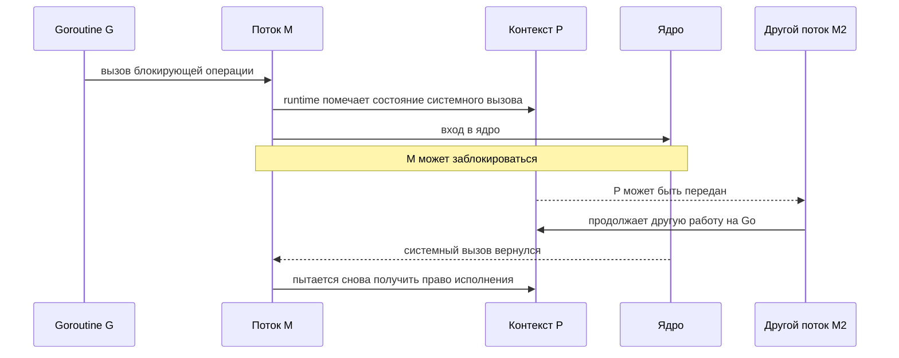

# Syscall: что блокируется и как планировщик сохраняет параллелизм

## Содержание

- [Три разных вида ожидания](#три-разных-вида-ожидания)
- [Какие системные вызовы скрывает Go API](#какие-системные-вызовы-скрывает-go-api)
- [Что происходит при блокирующем системном вызове](#что-происходит-при-блокирующем-системном-вызове)
- [Передача P другому потоку (handoff)](#передача-p-другому-потоку-handoff)
- [Короткий и долгий системный вызов](#короткий-и-долгий-системный-вызов)
- [Возврат из системного вызова](#возврат-из-системного-вызова)
- [Почему context не всегда отменяет системный вызов](#почему-context-не-всегда-отменяет-системный-вызов)
- [syscall.Syscall и RawSyscall](#syscallsyscall-и-rawsyscall)
- [cgo](#cgo)
- [runtime.LockOSThread](#runtimelockosthread)
- [Исчерпание потоков](#исчерпание-потоков)
- [Диагностика](#диагностика)
- [Типичные ошибки](#типичные-ошибки)
- [Interview-ready answer](#interview-ready-answer)
- [Официальные источники](#официальные-источники)

Главный вопрос этого файла: что происходит с G, M и P, когда код на Go переходит в ядро операционной системы или в чужой код на C.

Материал ориентирован на Go 1.26. Пороги, имена функций runtime и эвристики планировщика — детали реализации, а не гарантии языка.

---

## Три разных вида ожидания

Не всякая операция с именем `Read` ведёт себя одинаково:

| Операция | Типичный путь | Что ждёт |
| --- | --- | --- |
| обычный файл, часть операций с устройствами, блокирующий системный вызов | системный вызов | M заблокирован в ядре |
| сокет TCP/UDP/Unix, канал и другой наблюдаемый дескриптор | netpoller | G припаркована, M свободен |
| `time.Sleep`, канал, мьютекс | runtime | G припаркована; системного вызова может не быть вообще |

Поведение зависит от платформы и от типа дескриптора. Например, `os.File` может представлять обычный файл, канал или сокет, и путь внутри runtime будет разным.

Ключевой вопрос: может ли runtime перевести дескриптор в неблокирующий режим и ждать готовности через netpoller? Если да — поток обычно не блокируется на всё время ожидания. Если нет — ядро удерживает M до возврата.

### Конкретные примеры

| Операция Go | Типичный механизм | Удерживает M во время ожидания? |
| --- | --- | --- |
| `net.Conn.Read/Write`, `Listener.Accept` | неблокирующий дескриптор и netpoller | обычно нет: паркует G |
| `os.File.Read` для обычного файла | блокирующий файловый вызов | может удерживать M |
| `exec.Cmd.Wait/Run` | ожидание процесса | может удерживать M |
| блокирующая функция через cgo | вызов чужого кода | да, пока код на C не вернётся |
| `time.Sleep` | таймер runtime | нет: паркует G |
| ожидание канала или мьютекса | синхронизация runtime | нет: паркует G |
| `time.Now` на обычном Linux | vDSO, отображение в пользовательское пространство | обычно настоящего системного вызова нет |

Одинаковый метод `Read` не определяет путь внутри runtime. Важен нижележащий дескриптор: `*os.File` может оборачивать обычный файл, канал, терминал или сокет.

<details>
<summary>Мини-эксперимент: чтение файлов против ожидания сети</summary>

```go
// Файловые операции могут занять несколько M, если хранилище реально блокирует.
for i := 0; i < 2_000; i++ {
	go func() {
		_, _ = os.ReadFile(path)
	}()
}

// Сетевые соединения без данных обычно паркуют G через netpoller.
for _, conn := range conns {
	go func(conn net.Conn) {
		var one [1]byte
		_, _ = conn.Read(one[:])
	}(conn)
}
```

`/etc/hosts` часто находится в страничном кэше и читается слишком быстро, поэтому не годится для демонстрации блокировки на диске. Для наблюдения нужна контролируемо медленная файловая система или устройство либо трассировка реальной нагрузки.

Сравнивать стоит так:

```bash
GODEBUG=schedtrace=500,scheddetail=1 ./demo
go tool trace trace.out
```

Смотреть надо не только число goroutines, но и поле `threads`, состояния `[syscall]` и `[IO wait]` и длительность операций.

</details>

---

## Какие системные вызовы скрывает Go API

Обычно код на Go обращается к переносимым пакетам `os`, `net`, `os/exec` и `time`, а не вызывает ядро напрямую. Стандартная библиотека и runtime преобразуют эти операции в системные вызовы конкретной платформы.

В таблице приведены типичные вызовы Linux, а не контракт функций Go. Точное имя и количество вызовов зависят от операционной системы, архитектуры, версии Go, типа файлового дескриптора и текущей реализации runtime.

**Файловый дескриптор** (`file descriptor`, или `fd`) — небольшое целое число, через которое процесс обращается к открытому файлу, сокету, каналу и некоторым другим объектам ядра.

| Задача | Пример Go API | Типичные вызовы Linux | Что просим сделать ядро |
| --- | --- | --- | --- |
| Открыть и закрыть файл | `os.Open`, `os.Create`, `File.Close` | `openat`, `close` | найти путь, проверить права и создать или закрыть `fd` |
| Читать и писать | `File.Read`, `File.Write`, `io.Copy` | `read`, `write`, иногда `pread64`, `pwrite64`, `copy_file_range` | перенести данные между памятью процесса и объектом ядра |
| Получить метаданные | `os.Stat`, `File.Stat` | `newfstatat`, `fstat`, иногда `statx` | вернуть размер, права, владельца и время изменения |
| Работать с каталогами и путями | `os.ReadDir`, `os.Mkdir`, `os.Rename`, `os.Remove` | `getdents64`, `mkdirat`, `renameat`, `unlinkat` | прочитать записи каталога или изменить дерево имён файлов |
| Синхронизировать данные с хранилищем | `File.Sync` | `fsync` | попросить ядро сбросить данные и метаданные на хранилище |
| Создать сетевое соединение | `net.Dial`, `net.Listen` | `socket`, `connect`, `bind`, `listen` | создать сокет и настроить его роль и адрес |
| Принимать и передавать сетевые данные | `Listener.Accept`, `Conn.Read`, `Conn.Write`, `UDPConn.ReadFrom` | `accept4`, `read`/`recvfrom`, `write`/`sendto` | принять соединение или передать данные через сетевой стек |
| Ждать готовности сети | скрыто внутри netpoller | `epoll_ctl`, `epoll_wait`/`epoll_pwait` | подписаться на события `fd` и ждать готовности без отдельного блокирующего потока на каждое соединение |
| Запустить и дождаться процесса | `exec.Command(...).Start`, `Cmd.Wait` | `clone` или `fork`, затем `execve`; `wait4`/`waitid` | создать процесс, заменить его программу и получить статус завершения |
| Работать с сигналами | `os/signal.Notify`, `Process.Signal` | `rt_sigaction`, `rt_sigprocmask`, `kill` | настроить обработку сигнала или отправить его процессу |
| Получить память у операционной системы | скрыто внутри runtime | `mmap`, `madvise`, `munmap` | создать, настроить или удалить отображение виртуальной памяти |
| Парковать и будить потоки | скрыто внутри runtime и `sync` | `futex` | усыпить поток при ожидании и разбудить его при изменении состояния |
| Управлять устройством или особым `fd` | функции `golang.org/x/sys/unix` | `ioctl`, `fcntl` | выполнить платформозависимую команду для объекта ядра |

Таблица отвечает на вопрос «какие системные вызовы могут находиться под Go API», но сама по себе не показывает, блокируется ли `M`. Например, `net.Conn.Read` в итоге читает данные через `read`, но ожидание готовности сокета обычно проходит через netpoller: `G` паркуется, а `M` продолжает другую работу.

Названия помогают читать вывод `strace`, профили и документацию Linux, но запоминать весь список не требуется. Полезнее понимать группы: файлы, сеть, процессы, память, сигналы и ожидание событий. Базовая граница между приложением и ядром отдельно разобрана в [«Что такое ОС»](../../10-devops-and-observability/hardware-and-os/00-what-is-an-os.md).

### Одна функция Go может выполнить несколько системных вызовов

Например:

```go
data, err := os.ReadFile("/etc/hostname")
```

Упрощённая последовательность на Linux выглядит так:

```text
os.ReadFile("/etc/hostname")
    -> openat(...)       открыть файл и получить fd
    -> fstat(...)        узнать размер для начального буфера
    -> read(...)         прочитать данные; вызовов может быть несколько
    -> close(...)        освободить fd
```

Это не гарантированный навсегда набор. Стандартная библиотека может выбрать другой вызов или быстрый путь, а чтение большого файла потребует нескольких `read`. И наоборот, одна операция Go может не дойти до ядра: например, небольшая `make([]byte, 1024)` обычно обслуживается аллокатором Go из уже полученной памяти.

<details>
<summary>Как посмотреть системные вызовы программы через strace</summary>

`strace` запускается на Linux и показывает переходы процесса к системным вызовам. Минимальная программа:

```go
package main

import (
    "fmt"
    "os"
)

func main() {
    data, err := os.ReadFile("/etc/hostname")
    if err != nil {
        panic(err)
    }
    fmt.Println(len(data))
}
```

Сборка и запуск:

```bash
go build -o syscall-demo .
strace -f -e trace=openat,fstat,newfstatat,read,write,close ./syscall-demo
```

В выводе будут строки примерно такого вида:

```text
openat(AT_FDCWD, "/etc/hostname", O_RDONLY|O_CLOEXEC) = 3
fstat(3, ...)                                           = 0
read(3, ..., 512)                                      = 13
read(3, ..., 499)                                      = 0
close(3)                                               = 0
write(1, "13\n", 3)                                   = 3
```

Здесь `3` — файловый дескриптор открытого файла, а `1` — стандартный вывод процесса. Точный вывод отличается между версиями ядра и Go. Ключ `-f` также следует за созданными потоками и процессами; без фильтра вывод программы на Go обычно получается слишком большим для первого знакомства.

</details>

---

## Что происходит при блокирующем системном вызове

Упрощённая последовательность:



В runtime этот переход связан с парой `entersyscall` и `exitsyscall`:

- G сохраняет состояние исполнения и помечается как находящаяся в системном вызове;
- M переходит в ядро и не считается исполняющим код на Go;
- P может быть перехвачен и использован другим M;
- после возврата M должен снова получить P либо сделать G готовой.

Поэтому один блокирующий системный вызов не обязан останавливать весь процесс. Цена — возможно появится дополнительный поток операционной системы.

### Что именно сохраняет entersyscall

Перед переходом runtime фиксирует состояние исполнения G:

```text
g.syscallsp / g.syscallpc -> позиция в стеке для traceback и сборщика мусора
статус G                  -> _Gsyscall
статус P                  -> _Psyscall
M.oldp                    -> P, с которым M входит в системный вызов
```

G больше не исполняет инструкции Go, поэтому её стек стабилен для сканирования. Сборщик мусора знает сохранённые указатель стека и счётчик команд и не ждёт, пока операция ядра вернётся. Это одна из причин, почему нельзя просто перейти в ядро напрямую, не уведомив runtime.

Важная деталь: `_Psyscall` не означает «P свободен». P остаётся зарезервированным за этим M, чтобы после быстрого возврата тот подхватил его без лишних переходов. Свободным P становится только после перехвата, и решение о перехвате принимает `sysmon`.

```text
Gsyscall <--> M заблокирован в ядре

P пока никому не отдан, но кода на Go не исполняет
после перехвата: P ----> другой M ----> другая готовая G
```

<details>
<summary>Как свободные M и P находят друг друга</summary>

Планировщик поддерживает два разных пула:

```text
sched.pidle -> P без M
sched.midle -> припаркованные M без P
```

Инициатива возможна с обеих сторон:

| Ситуация | Действие |
| --- | --- |
| M возвращается из системного вызова без P | пытается вернуть `oldp` или взять простаивающий P |
| P освобождается и есть готовая работа | `startm`/`handoffp` берёт свободный M или создаёт новый |
| M не находит ни P, ни работы | паркуется и попадает в пул простаивающих |

Связывание защищается синхронизацией планировщика: P извлекается из пула атомарно либо под блокировкой и принадлежит только одному M. Счётчик `nmspinning` и подобные ему уменьшают лишние пробуждения, но не заменяют эту синхронизацию владения.

</details>

---

## Передача P другому потоку (handoff)

`handoff` буквально означает «передача из рук в руки». В планировщике так называют передачу P от одного M другому, когда текущий M больше не может исполнять код на Go.

Зачем это нужно, видно из ситуации: M ушёл в ядро и застрял там на чтении с медленного диска. Его P при этом полностью исправен — в локальной очереди могут лежать готовые goroutines, могут быть таймеры на подходе. Без передачи один медленный `read` забирает единицу параллелизма из `GOMAXPROCS` на всё время ожидания.

```text
до:       M1 (в ядре) --- P1 --- очередь: G2, G3
handoff:  M1 (в ядре)     P1 --- M2  -> исполняет G2, G3
после:    M1 вернулся, P1 занят -> G1 становится готовой и ждёт очереди
```

### Кто выполняет передачу

Работают две функции в паре:

| Функция | Роль |
| --- | --- |
| `handoffp(pp)` | решает судьбу осиротевшего P: отдать его потоку прямо сейчас или положить в пул простаивающих |
| `startm(pp, spinning)` | находит под этот P поток: берёт свободный M из `sched.midle`, а если пул пуст — создаёт новый через `newm`, то есть делает настоящий `clone` в ядре |

Важно, что `handoffp` не будит поток безусловно. Сначала он проверяет, есть ли ради чего платить за пробуждение или создание потока, и вызывает `startm` только если выполнено хотя бы одно условие:

- локальная очередь этого P непуста либо непуста глобальная;
- на этом P есть таймер, которому вот-вот срабатывать;
- есть работа для сборщика мусора или трассировки;
- сеть никто сейчас не опрашивает, а ждущие дескрипторы есть;
- это последний ищущий работу M и свободных P нет — иначе можно потерять пробуждение.

Если не подошло ничего, P просто кладётся в `sched.pidle`, и никакой поток не будится. Создание потока стоит дорого, поэтому будить его ради пустой очереди бессмысленно.

### Когда передача происходит, а когда нет

Здесь и находится главный компромисс механизма:

| Путь | Когда | Что происходит |
| --- | --- | --- |
| `entersyscall` | обычный системный вызов | передачи нет: P помечается `_Psyscall` и резервируется за этим M в расчёте на быстрый возврат |
| `retake` внутри `sysmon` | вызов затянулся | передача выполняется принудительно — это и есть перехват P |
| `entersyscallblock` | runtime заранее знает, что заблокируется | передача выполняется немедленно, без оптимистичного ожидания |

Условие в `sysmon` устроено от обратного: перехвата не будет, только если совпало всё сразу — локальная очередь пуста, есть свободные или ищущие потоки, и вызов длится меньше 10 мс. Достаточно нарушиться одному из трёх, и P уходит другому M уже на следующем тике монитора, то есть в пределах десятков микросекунд.

Отсюда обе крайности, о которых речь в следующем разделе: слишком ранняя передача — это лишний `clone` и лишние переходы на каждый быстрый `read`, слишком поздняя — простаивающий P при живой очереди.

Слово `handoff` встречается в Go и вне планировщика: у `sync.Mutex` в режиме голодания блокировка передаётся напрямую первому в очереди, в противоположность `barging`, когда её перехватывает уже исполняющаяся goroutine. Механика там совсем другая, общий только смысл «отдать напрямую, а не бросить в общий котёл».

---

## Короткий и долгий системный вызов

Runtime старается не делать дорогую передачу P на каждый очень короткий системный вызов. M и P некоторое время сохраняют возможность быстро воссоединиться. Если вызов затягивается и готовая работа ждёт, монитор runtime может перехватить P и передать его другому M.

Для операций, про которые runtime заранее знает, что они могут блокироваться, существует путь с более ранней передачей — `entersyscallblock` в текущей реализации.

Точные пороги и условия — эвристики планировщика, а не API. Для собеседования достаточно компромисса:

- слишком ранняя передача создаёт лишние переходы между потоками и лишнюю работу планировщика;
- слишком поздняя оставляет P простаивать, хотя готовые goroutines ждут.

<details>
<summary>Три сценария пошагово</summary>

**1. Системный вызов быстро возвращается**

```text
до:      M1 + P1 исполняют G1
вход:    M1 + G1 уходят в ядро; P1 помечен _Psyscall и доступен для перехвата
возврат: P1 никто не забрал
выход:   M1 снова берёт P1 и продолжает G1
```

Быстрый путь избегает лишней постановки G в очередь и пробуждения потока.

**2. Системный вызов задерживается, а работа ждёт**

```text
M1 + G1 заблокированы в ядре
P1 остаётся в состоянии _Psyscall
        |
        | перехват со стороны sysmon
        v
M2 берёт P1 -> исполняет G2, G3, ...

позже M1 возвращается:
    свободного P нет -> G1 становится готовой и ждёт очереди
```

`sysmon` замечает такой P не раньше следующего своего обхода; комментарий в исходниках runtime упоминает порядок 20 мкс, но фактическое решение учитывает наличие готовой работы и простаивающих P и может быть принято позже. Это не гарантированное время передачи.

Здесь речь именно об обходе `sysmon`, а не о тике планировщика: `p.schedtick` считает переключения goroutines на этом P, а застрявший в системном вызове P как раз ни на что не переключается. Что такое тик планировщика, разобрано в [scheduler и preemption](./01-scheduler-and-preemption.md).

**3. Runtime заранее ожидает блокирующую операцию**

`entersyscallblock` немедленно готовит передачу P вместо оптимистического ожидания быстрого возврата. Этот путь используется внутри runtime там, где блокировка известна заранее.

</details>

---

## Возврат из системного вызова

После возврата из ядра возможны два пути:

1. M быстро получает подходящий P и продолжает ту же G.
2. Свободного P сейчас нет — G становится готовой, а M паркуется или переиспользуется; G позже продолжит на другом M.

Код после системного вызова не должен зависеть от того, что goroutine продолжит на том же потоке. Если нужно состояние, привязанное к потоку операционной системы, используют `runtime.LockOSThread` осознанно.

### Быстрый и медленный пути выхода

```text
ядро завершает системный вызов
    |
    v
планировщик ОС будит заблокированный M
    |
    v
runtime.exitsyscall
    |
    +-- быстрый: вернуть прежний P или взять простаивающий -> G продолжает сразу
    |
    +-- медленный: свободного P нет -> G становится готовой -> M паркуется
```

Runtime не «проверяет, закончилось ли блокирующее чтение», пока M находится внутри ядра. Завершение операции и пробуждение потока делает операционная система. Runtime снова получает управление только после возврата.

Медленный путь может продолжить G на другом M. Даже быстрый путь не является обещанием привязки к потоку: это оптимизация, которую код не наблюдает напрямую.

---

## Почему context не всегда отменяет системный вызов

`context.Context` — сигнал отмены, а не универсальная кнопка прерывания операции ядра.

Отмена работает, когда API связывает `context` с реальным механизмом:

- устанавливает дедлайн;
- закрывает дескриптор или соединение;
- вызывает примитив отмены конкретной платформы;
- разбивает работу на прерываемые куски.

Обёртка вида «запустить чтение файла в goroutine и сделать `select` по `ctx.Done()`» возвращает управление вызывающему раньше, но само чтение при этом не останавливается. Заблокированная goroutine и её M могут остаться жить до завершения системного вызова.

```go
result := make(chan error, 1)
go func() {
    _, err := file.Read(buf) // может продолжить ждать после отмены у вызывающего
    result <- err
}()

select {
case err := <-result:
    return err
case <-ctx.Done():
    return ctx.Err()
}
```

Для ограниченной задержки выбирают API с настоящим дедлайном или отменой либо контролируют параллелизм и время жизни ресурса.

### Почему таймаут чтения обычного файла сложнее сетевого

Сетевой дескриптор обычно интегрирован с поллером: таймер дедлайна может разбудить G, а закрытие выводит дескриптор из поллера. Чтение обычного файла часто уже исполняется внутри ядра на M, и переносимый Go API не имеет универсального способа безопасно отменить произвольную операцию с диском или сетевой файловой системой.

`os.File.SetDeadline` работает только для тех типов файлов, которые поддерживают дедлайн; обычный файл чаще всего возвращает ошибку `os.ErrNoDeadline`. Закрытие файла из другой goroutine также не является универсальной гарантией немедленно прервать уже выполняющийся системный вызов на каждой платформе и файловой системе.

Поэтому обёртка с таймаутом решает только одну из задач:

| Цель | Что требуется |
| --- | --- |
| Вызывающий перестаёт ждать | `select` по результату и `ctx.Done()` |
| Нижележащая операция реально прекращается | механизм отмены на уровне операционной системы или API |
| Процесс не накапливает неограниченную заблокированную работу | семафор, пул воркеров, backpressure |

<details>
<summary>Ограниченная обёртка для операции без настоящей отмены</summary>

Такая обёртка позволяет вызывающему перестать ждать, но сохраняет лимит ещё выполняющихся чтений:

```go
type FileReader struct {
	slots chan struct{}
}

func NewFileReader(limit int) *FileReader {
	if limit <= 0 {
		panic("file reader limit must be positive")
	}
	return &FileReader{slots: make(chan struct{}, limit)}
}

func (r *FileReader) ReadFile(ctx context.Context, path string) ([]byte, error) {
	select {
	case r.slots <- struct{}{}:
	case <-ctx.Done():
		return nil, ctx.Err()
	}

	type result struct {
		data []byte
		err  error
	}
	resultCh := make(chan result, 1)

	go func() {
		defer func() { <-r.slots }()
		data, err := os.ReadFile(path)
		resultCh <- result{data: data, err: err}
	}()

	select {
	case result := <-resultCh:
		return result.data, result.err
	case <-ctx.Done():
		// os.ReadFile может продолжаться, но удерживает один ограниченный слот.
		return nil, ctx.Err()
	}
}
```

Буферизованный канал результата позволяет воркеру завершить отправку после ухода вызывающего. Это не превращает чтение файла в отменяемую операцию; обёртка лишь ограничивает ущерб и задержку ожидания.

</details>

---

## syscall.Syscall и RawSyscall

На Unix исторический пакет `syscall` предоставляет два разных низкоуровневых пути:

- `syscall.Syscall` сообщает runtime о переходе в ядро, поэтому планировщик и сборщик мусора корректно учитывают возможную блокировку;
- `syscall.RawSyscall` выполняет переход без обычной передачи P и подходит только для вызовов, которые гарантированно не блокируют.

Использовать `RawSyscall` для `read`, `accept` или другой потенциально долгой операции опасно: M остаётся с правом исполнения, а runtime не получает нормальной возможности передать P.

Код приложения обычно предпочитает `os`, `net` или `golang.org/x/sys/unix`, а не прямые переходы в ядро. Пакет `syscall` заморожен, и получить через него переносимую семантику трудно.

<details>
<summary>Когда прямой путь вообще оправдан</summary>

Прямой путь встречается в runtime или в узком платформенном коде для заведомо короткой операции, где автор контролирует контракт операционной системы и понимает последствия для планировщика. Даже «обычно быстрый» системный вызов не автоматически безопасен: отказы страниц, трассировка, обработчики безопасности или конкуренция внутри ядра способны изменить длительность.

Если вызов может ждать внешнего события, нужна обёртка, о которой знает runtime. Если нужен нестандартный API для дескриптора, стоит сначала проверить, можно ли интегрировать дескриптор через `os.NewFile` или готовую библиотеку, а не обходить планировщик.

</details>

---

## cgo

Вызов через cgo сообщает планировщику, что goroutine уходит в чужой код. Если функция на C блокируется, её M остаётся занятым, а P может быть передан другому M.

cgo дороже обычного вызова из-за:

- перехода между соглашениями о вызовах Go и C;
- переключения состояния runtime и стека;
- правил передачи указателей;
- возможных обратных вызовов из C в Go;
- блокировки потока операционной системы на время чужого вызова.

Это не означает «cgo нельзя использовать». Измеряют частоту и длительность вызовов; мелкие вызовы часто выгодно объединять в пакеты, а потенциально блокирующие — ограничивать.

---

## runtime.LockOSThread

`runtime.LockOSThread` закрепляет вызвавшую goroutine за текущим M. Он нужен, если API зависит от состояния, привязанного к потоку, например:

- графический интерфейс или цикл событий с привязкой к потоку;
- некоторые графические API вроде OpenGL;
- вызовы операционной системы или чужие библиотеки с настройками, привязанными к потоку.

```go
runtime.LockOSThread()
defer runtime.UnlockOSThread()
```

Пока G закреплена, планировщик не может свободно перенести её на другой M. Если goroutine завершится, не сделав парный вызов разблокировки, runtime завершит связанный поток. Закрепление без необходимости уменьшает свободу планировщика и может увеличить число потоков.

---

## Исчерпание потоков

`GOMAXPROCS` ограничивает параллельное исполнение кода на Go, но не число заблокированных потоков. Неограниченные блокирующие системные вызовы, cgo и `LockOSThread` могут создать тысячи M.

Защитный предел задаёт `runtime/debug.SetMaxThreads`; начальное значение равно 10000. Превышение приводит к аварийному завершению процесса, а не к обычной ошибке Go.

Практические меры:

- ограниченный пул воркеров или семафор вокруг файловых операций и вызовов cgo;
- дедлайны и закрытие ресурсов;
- backpressure вместо запуска goroutine на каждый элемент без лимита;
- наблюдение за числом потоков и состояниями goroutines;
- переход на асинхронный или наблюдаемый поллером API, если платформа его предоставляет.

`SetMaxThreads` — аварийный предохранитель: превышение завершает процесс. Это не замена backpressure и не способ возвращать клиенту контролируемую ошибку.

<details>
<summary>Как увидеть рост числа потоков</summary>

На Linux:

```bash
pid=$(pgrep -n service)

grep '^Threads:' "/proc/$pid/status"
ps -L -p "$pid" -o pid,tid,stat,comm,wchan
```

Если подключён `net/http/pprof`:

```bash
curl -s http://127.0.0.1:6060/debug/pprof/threadcreate?debug=1
curl -s http://127.0.0.1:6060/debug/pprof/goroutine?debug=2 > goroutines.txt
```

Профиль `threadcreate` показывает стеки, приведшие к созданию потоков, и является накопительным, а не точным списком текущих потоков. Текущее число сверяют с метриками операционной системы и выводом `schedtrace`.

</details>

---

## Диагностика

```bash
GODEBUG=schedtrace=1000,scheddetail=1 ./service
kill -QUIT <pid> # дамп goroutines
```

Искать надо:

- рост поля `threads` при стабильном `gomaxprocs`;
- много goroutines в состоянии `[syscall]`;
- стеки внутри cgo или файловых операций;
- медленное внешнее хранилище;
- goroutines, которые вызывающий уже считает отменёнными, хотя системный вызов ещё жив.

`go tool trace` показывает блокировки на системных вызовах и помогает связать их с провалами в планировании.

<details>
<summary>Как отличаются состояния в стеках</summary>

Типичное ожидание сети проходит через поллер:

```text
goroutine 42 [IO wait]:
internal/poll.runtime_pollWait(...)
internal/poll.(*FD).Read(...)
net.(*netFD).Read(...)
```

Блокирующий системный вызов или чужой код чаще виден так:

```text
goroutine 57 [syscall]:
syscall.Syscall6(...)
...
```

Метка состояния — отправная точка, а не окончательный диагноз. Нужно проверить длительность, число одинаковых стеков, число потоков и конкретный дескриптор или библиотеку.

</details>

---

## Типичные ошибки

- считать, что `context` сам прервёт любой системный вызов;
- считать, что после возврата из ядра goroutine продолжит на том же потоке;
- запускать goroutine на каждую файловую операцию или вызов cgo без ограничения;
- использовать `RawSyscall` для потенциально блокирующей операции;
- считать `SetMaxThreads` средством управления нагрузкой, а не аварийным предохранителем;
- закреплять goroutine через `LockOSThread` без явной необходимости и без парной разблокировки;
- объяснять рост числа потоков через `GOMAXPROCS`, который его не ограничивает.

---

## Interview-ready answer

**1. Что происходит с P при блокирующем системном вызове?**

- Вход — G и M уходят в ядро, статус G становится `_Gsyscall`, статус P — `_Psyscall`.
- Ключевой момент — P при этом не свободен, он зарезервирован за этим M ради быстрого возврата.
- Перехват — если вызов затягивается и есть готовая работа, `sysmon` отбирает P и отдаёт другому M.
- Возврат — исходный M пытается получить любой P; если не выходит, G становится готовой и ждёт очереди.

**2. Что такое handoff и когда он происходит?**

- Определение — передача P от M, который больше не исполняет код на Go, другому M; в runtime это пара `handoffp` и `startm`.
- Зачем — иначе застрявший в ядре поток удерживал бы исправный P с непустой очередью и съедал единицу параллелизма.
- Когда — при обычном входе в системный вызов передачи нет, её выполняет `sysmon` при перехвате; `entersyscallblock` делает её сразу, когда блокировка известна заранее.
- Тонкость — `handoffp` не всегда будит поток: если очереди пусты и таймеров нет, P просто кладётся в пул простаивающих, потому что создание потока дороже ожидания.

**3. Почему сетевой Read часто не блокирует M, а файловый может?**

- Сеть — сокет переводится в неблокирующий режим и интегрируется с netpoller: при `EAGAIN` паркуется только G.
- Файл — модель готовности для обычного файла бесполезна, `epoll` всегда отвечает «готов», поэтому системный вызов удерживает M.
- Следствие — рост числа потоков обычно приходит от файловых операций и cgo, а не от сети.

**4. Чем короткий системный вызов отличается от долгого?**

- Короткий — при быстром возврате M снова берёт прежний P, лишних переходов не происходит.
- Долгий — `sysmon` перехватывает P и отдаёт его другому M, чтобы готовая работа не ждала.
- Известный заранее — для таких путей runtime использует `entersyscallblock` и передаёт P немедленно.

**5. Отменяет ли context произвольный системный вызов?**

- Ответ — нет, `context` это сигнал, а не прерывание операции ядра.
- Что нужно — привязка к реальному механизму: дедлайн, закрытие дескриптора или примитив отмены платформы.
- Ловушка — `select` вокруг goroutine освобождает вызывающего, но операция продолжает удерживать goroutine и поток.

**6. Чем Syscall отличается от RawSyscall?**

- `Syscall` — сообщает runtime о переходе, поэтому планировщик может передать P, а сборщик мусора корректно видит стек.
- `RawSyscall` — обходит эту разметку и допустим только для гарантированно неблокирующих вызовов.
- Практика — коду приложения нужны `os`, `net` или `golang.org/x/sys/unix`, а не прямые переходы в ядро.

**7. Почему cgo влияет на планировщик?**

- Стоимость — чужой вызов занимает поток целиком и требует перехода между соглашениями о вызовах и сменой стека.
- Компенсация — P освобождается для другой работы, поэтому процесс не встаёт.
- Риск — большое число блокирующих вызовов на C увеличивает число потоков.

**8. Когда нужен LockOSThread?**

- Когда — только для API с привязкой к потоку операционной системы или с состоянием, привязанным к потоку.
- Цена — закрепление лишает планировщик свободы переносить goroutine и может увеличить число потоков.
- Правило — вызов должен иметь ясный жизненный цикл и парную разблокировку.

**9. Почему GOMAXPROCS не спасает от исчерпания потоков?**

- Что ограничивает — только число M, одновременно исполняющих код на Go вместе с P.
- Что не ограничивает — M, заблокированные в системных вызовах и cgo или закреплённые за goroutines.
- Что нужно — лимиты параллелизма и backpressure; `SetMaxThreads` с пределом 10000 остаётся аварийным предохранителем.

---

## Официальные источники

- [runtime package](https://pkg.go.dev/runtime)
- [runtime/debug.SetMaxThreads](https://pkg.go.dev/runtime/debug#SetMaxThreads)
- [runtime syscall transitions](https://go.dev/src/runtime/proc.go)
- [runtime cgo call path](https://go.dev/src/runtime/cgocall.go)
- [os package](https://pkg.go.dev/os)
- [net package](https://pkg.go.dev/net)
- [syscall package](https://pkg.go.dev/syscall)
- [golang.org/x/sys/unix](https://pkg.go.dev/golang.org/x/sys/unix)
