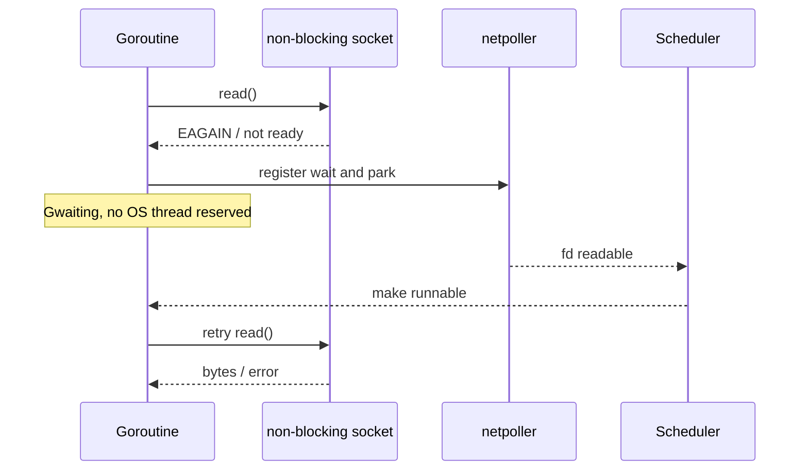

# Netpoller: network I/O без blocked thread на каждое соединение

Netpoller связывает blocking-looking APIs пакета `net` с OS event mechanisms: readiness-based epoll на Linux и kqueue на BSD/macOS, completion-oriented backend на Windows и другими platform implementations.

## Содержание

- [Mental model](#mental-model)
- [Socket, fd и platform poller](#socket-fd-и-platform-poller)
- [Что происходит при Read](#что-происходит-при-read)
- [Где находятся bytes и buffers](#где-находятся-bytes-и-buffers)
- [Readiness не равно сообщению](#readiness-не-равно-сообщению)
- [Lifecycle соединения](#lifecycle-соединения)
- [Accept, Write и Close](#accept-write-и-close)
- [pollDesc и scheduler](#polldesc-и-scheduler)
- [Когда runtime вызывает netpoll](#когда-runtime-вызывает-netpoll)
- [Deadlines и context cancellation](#deadlines-и-context-cancellation)
- [Какие операции используют netpoller](#какие-операции-используют-netpoller)
- [DNS resolver](#dns-resolver)
- [Backpressure и server timeouts](#backpressure-и-server-timeouts)
- [Диагностика](#диагностика)
- [Типичные ошибки](#типичные-ошибки)
- [Interview-ready answer](#interview-ready-answer)
- [Официальные источники](#официальные-источники)

## Mental model

`conn.Read` выглядит blocking, но waiting goroutine не обязана удерживать M:



Это позволяет обслуживать много mostly-idle connections небольшим числом OS threads. Цена всё равно есть: socket buffers, fd, goroutine stack/metadata, application buffers и GC roots.

## Socket, fd и platform poller

На Unix socket является kernel object, а file descriptor — небольшое integer handle процесса для доступа к нему:

```text
Go net.Conn
    -> internal/poll.FD
        -> fd = 42
            -> kernel socket
                ├── TCP state
                ├── local/remote addresses
                ├── receive buffer
                └── send buffer
```

`fd` не содержит данные и не является глобально уникальным. После `close(42)` OS может быстро выдать число `42` другому resource, поэтому runtime защищается от stale readiness events через lifecycle sequence внутри poll state.

| Platform | Backend idea |
| --- | --- |
| Linux | `epoll`: readiness set для registered fd |
| macOS/BSD | `kqueue`: readiness/events через kernel queue |
| Windows | IOCP: completion-oriented notifications |
| Другие systems | Свой backend с общим runtime contract |

Platform poller знает о descriptors/events, но ничего не знает о goroutines. Go netpoller выполняет перевод:

```text
fd ready/completed
    -> найти pollDesc
    -> извлечь waiting reader/writer G
    -> сделать G runnable
    -> scheduler позже запускает G на M + P
```

<details>
<summary>Что именно делает OS, а что Go runtime</summary>

| Слой | Ответственность |
| --- | --- |
| NIC + kernel network stack | Принимает packets, обрабатывает TCP, кладёт bytes в socket receive buffer |
| epoll/kqueue/IOCP | Сообщает process о readiness/completion registered operations |
| Go netpoller | Связывает OS event с `pollDesc` и waiting G |
| Scheduler | Ставит awakened G в runnable queues и даёт CPU |
| Application protocol | Читает bytes, восстанавливает frames/messages и применяет business logic |

Netpoller не принимает packets, не хранит HTTP requests и не выполняет handler. Он является adapter между OS I/O event и scheduler.

</details>

## Что происходит при Read

Упрощённый flow для readiness-based poller на Unix:

1. `net.Conn.Read` доходит до `internal/poll`.
2. Runtime делает non-blocking read attempt.
3. Если bytes доступны — call возвращается сразу.
4. Если fd пока не ready — goroutine регистрируется как reader waiter и park.
5. M и P исполняют другую runnable goroutine.
6. OS poller сообщает readiness.
7. Runtime делает waiting G runnable.
8. G повторяет syscall и получает bytes или новую ошибку.

Readiness означает «операция сейчас, вероятно, не заблокируется», а не «runtime уже скопировал payload в goroutine». До повторного read состояние может снова измениться, поэтому implementation обязана корректно повторять попытку.

Пока G parked, network packets принимают NIC и kernel network stack. Bytes лежат в kernel socket receive buffer, а не в goroutine и не в netpoller.

## Где находятся bytes и buffers

Обычно одновременно существуют минимум два разных buffer layers:

```text
peer writes bytes
    -> network
    -> kernel socket receive buffer
    -> read(fd, userBuf)
    -> Go []byte supplied by application
    -> optional bufio/protocol buffer
```

| Buffer | Кто владеет | Когда занимает память |
| --- | --- | --- |
| Kernel receive/send buffer | OS socket | Пока connection открыт и данные queued |
| Slice, переданный в `Read` | Go application | Пока на slice есть ссылки |
| `bufio.Reader`, HTTP/gRPC/parser buffers | Library/application | Зависит от pooling и lifecycle request/connection |

Readiness обычно означает, что kernel receive buffer содержит данные либо fd находится в terminal/error state. Payload не копируется в Go heap до выполнения `read`/completion path.

Практическое следствие: mostly-idle connection не удерживает отдельный thread, но всё равно удерживает fd, kernel buffers, goroutine и часто application buffers. «100k connections» никогда не означает нулевую стоимость.

## Readiness не равно сообщению

TCP — byte stream. Один `Read` может вернуть:

- часть application message;
- несколько messages сразу;
- заголовок без полного body;
- `n > 0` вместе с non-nil error.

Message boundaries задаёт protocol framing:

- fixed size;
- delimiter (`\n`);
- length prefix;
- protocol parser, например HTTP.

```go
header := make([]byte, 4)
if _, err := io.ReadFull(conn, header); err != nil {
    return err
}

n := binary.BigEndian.Uint32(header)
if n > maxFrameSize {
    return ErrFrameTooLarge
}
body := make([]byte, n)
_, err := io.ReadFull(conn, body)
return err
```

`io.ReadFull` может вызвать несколько `Read`; между ними goroutine будет park/resume через netpoller.

<details>
<summary>Полный пример length-prefixed framing</summary>

```go
const maxFrameSize = 1 << 20 // 1 MiB

func readFrame(r io.Reader) ([]byte, error) {
	var header [4]byte
	if _, err := io.ReadFull(r, header[:]); err != nil {
		return nil, err
	}

	size := binary.BigEndian.Uint32(header[:])
	if size > maxFrameSize {
		return nil, fmt.Errorf("frame too large: %d", size)
	}

	body := make([]byte, int(size))
	if _, err := io.ReadFull(r, body); err != nil {
		return nil, err
	}
	return body, nil
}

func writeFrame(w io.Writer, body []byte) error {
	if len(body) > maxFrameSize {
		return fmt.Errorf("frame too large: %d", len(body))
	}

	var header [4]byte
	binary.BigEndian.PutUint32(header[:], uint32(len(body)))
	if err := writeFull(w, header[:]); err != nil {
		return err
	}
	return writeFull(w, body)
}

func writeFull(w io.Writer, data []byte) error {
	for len(data) > 0 {
		n, err := w.Write(data)
		if n > 0 {
			data = data[n:]
		}
		if err != nil {
			return err
		}
		if n == 0 {
			return io.ErrShortWrite
		}
	}
	return nil
}
```

Проверка максимального размера выполняется **до** allocation body. `writeFull` учитывает, что произвольный `io.Writer` может принять только часть buffer за один вызов.

</details>

## Lifecycle соединения

### Server side: Listen и Accept

```text
net.Listen("tcp", ":8080")
    -> socket
    -> bind
    -> listen
    -> non-blocking listening fd registered with poller

listener.Accept()
    -> try accept
    -> EAGAIN: park acceptor G
    -> listening fd becomes readable
    -> wake G and retry accept
    -> new connected fd / net.Conn
```

Listening socket и accepted connection — разные kernel sockets с разными fd. Один listener живёт долго, а каждый successful `Accept` создаёт отдельный connected socket.

```go
listener, err := net.Listen("tcp", ":8080")
if err != nil {
	return err
}
defer listener.Close()

for {
	conn, err := listener.Accept()
	if err != nil {
		return err
	}
	go handleConn(conn)
}
```

### Client side: Dial

`net.Dialer.DialContext` создаёт socket и выполняет non-blocking connect flow. Пока handshake не завершается, goroutine ждёт readiness через poller; context/deadline ограничивает ожидание.

После `Accept` или `Dial` один `net.Conn` обычно переживает множество `Read`/`Write`. Для HTTP/1 keep-alive через одно connection последовательно проходят разные requests; HTTP/2 и multiplexed protocols допускают несколько logical streams одновременно.

```text
connections != requests != goroutines
```

Их соотношение задаёт protocol и library. Поэтому метрики active connections недостаточно для оценки handler concurrency или request load.

## Accept, Write и Close

- `Accept` listener также может park goroutine до появления connection.
- `Write` может park, если send buffer заполнен и fd пока не writable.
- `Close` выводит descriptor из poller и будит goroutines, ожидающие read/write, с error.

На одном `net.Conn` несколько goroutines могут одновременно вызывать methods; package contract это допускает. Но application protocol всё равно должен синхронизировать framing и ownership writes, чтобы bytes разных messages не смешивались логически.

`Write` не обещает, что peer уже читает bytes. Успех означает, что local stack принимает данные; они могут оставаться в kernel send buffer. Если buffer заполнен из-за slow peer, write получает would-block и G park до writability либо deadline.

`Close` концептуально выполняет несколько связанных действий:

1. запрещает новые operations через `internal/poll.FD` lifecycle lock;
2. удаляет/закрывает descriptor в platform poller;
3. будит reader/writer waiters с error;
4. освобождает OS fd, когда references/in-flight operations позволяют.

TCP half-close (`CloseWrite`/`CloseRead` у `*net.TCPConn`) отличается от полного `Close`: одна direction может завершиться, пока другая продолжает работать. Это protocol decision и не отменяет необходимость окончательно закрыть connection.

## pollDesc и scheduler

Runtime связывает pollable fd с `pollDesc`. Для mental model достаточно знать, что он хранит:

- fd identity/lifecycle state;
- отдельное ожидание reader и writer;
- read/write deadlines;
- защиту от stale events после close/reuse descriptor.

Reader и writer ожидания независимы. Упрощённо каждое direction state может означать:

```text
nil/no waiter
waiting G
ready event already arrived
```

Это требуется из-за race между park и OS event:

```text
G проверяет fd -> EAGAIN
                     OS event может прийти здесь
G регистрирует wait
G park
```

Если event приходит до фактического park, state запоминает readiness, и G не засыпает навсегда. Если G уже parked, event извлекает её и делает runnable. Close/deadline используют тот же synchronization path, но пробуждают с error.

Netpoller возвращает scheduler список goroutines, для которых I/O ready. Они становятся runnable и попадают в scheduling flow; netpoller сам не выполняет application handler.

Scheduler проверяет netpoll без blocking, когда ищет work, и может сделать blocking poll, когда runnable work нет. Timeout blocking poll согласуется с ближайшими runtime timers.

<details>
<summary>Упрощённый pollDesc</summary>

```go
type pollDesc struct {
	fd    uintptr
	fdseq atomic.Uintptr

	rg atomic.Uintptr // reader wait state
	wg atomic.Uintptr // writer wait state

	rd int64 // read deadline
	wd int64 // write deadline

	closing bool
}
```

Реальная структура содержит locks, timer sequences и error state. `fdseq` помогает отличить event старой жизни descriptor от нового resource, которому OS переиспользует тот же fd number.

</details>

## Когда runtime вызывает netpoll

`netpoll(delay)` поддерживает три режима:

| `delay` | Поведение |
| ---: | --- |
| `0` | Проверить events и сразу вернуть |
| `> 0` | Block максимум до указанного timeout |
| `< 0` | Block без timer deadline до внешнего event/break |

Runtime вызывает poller из нескольких мест, потому что scheduler бывает в разных состояниях:

1. `findRunnable` делает non-blocking poll, чтобы быстро подобрать готовый network work;
2. когда runnable work отсутствует, один M может block в poller до I/O или ближайшего timer;
3. `sysmon` периодически делает non-blocking poll, если scheduler давно не забирает events;
4. новый earlier timer или runnable work может вызвать `netpollBreak`, чтобы разбудить blocked poller и пересчитать timeout.

Такой design не требует отдельного permanent «network thread» на каждое connection. В отдельный момент один M может ждать внутри epoll/kqueue/IOCP, но он обслуживает events множества descriptors.

## Deadlines и context cancellation

`SetDeadline` задаёт absolute deadline для текущих и будущих I/O operations:

```go
if err := conn.SetReadDeadline(time.Now().Add(5 * time.Second)); err != nil {
    return err
}
```

Runtime связывает deadline с timer. Если fd не становится ready вовремя, timer будит waiting G, и `Read`/`Write` возвращает error, wrapping `os.ErrDeadlineExceeded`.

Deadline — не «таймаут одного следующего Read». Он действует, пока его не изменить или не сбросить zero value. Idle timeout обычно реализуют продлением deadline после успешной активности.

Внутри `pollDesc` read и write deadline имеют отдельные timers и sequence counters. Когда application меняет deadline, sequence позволяет старому timer callback не отменить более новую operation. На каждое connection не создаётся sleeping goroutine: deadlines используют общую runtime timer machinery.

| Причина wakeup | Что видит operation |
| --- | --- |
| fd ready | Повторяет read/write и получает bytes/result |
| deadline timer | Timeout error (`errors.Is(err, os.ErrDeadlineExceeded)`) |
| `Close` | Closed-network-connection style error |
| Context-aware higher-level API | Library переводит cancellation в close/deadline/protocol abort |

Сам `context.Context` не является частью `net.Conn`. Higher-level APIs (`DialContext`, `http.NewRequestWithContext`) связывают cancellation с закрытием, deadline или protocol-specific abort. В собственном protocol обычно делают одно из двух:

- при `ctx.Done()` закрывают connection;
- вычисляют deadline из context и вызывают `SetDeadline`.

<details>
<summary>Cancellation через Close: connection после этого непригоден</summary>

```go
func readWithCancel(ctx context.Context, conn net.Conn, buf []byte) (int, error) {
	stop := context.AfterFunc(ctx, func() {
		_ = conn.Close() // будит blocked Read с error
	})
	defer stop()

	n, err := conn.Read(buf)
	if ctx.Err() != nil {
		return n, ctx.Err()
	}
	return n, err
}
```

Этот pattern означает ownership: cancellation уничтожает connection. Он подходит для одноразового соединения, но не для shared/pool connection. В HTTP, gRPC и database drivers предпочтительнее использовать context-aware API самой библиотеки.

</details>

<details>
<summary>Idle deadline в простом framed protocol</summary>

```go
func serveConn(conn net.Conn) error {
	defer conn.Close()

	for {
		if err := conn.SetReadDeadline(time.Now().Add(30 * time.Second)); err != nil {
			return err
		}

		request, err := readFrame(conn)
		if err != nil {
			if errors.Is(err, os.ErrDeadlineExceeded) {
				return nil // idle client
			}
			return err
		}

		response := handle(request)
		if err := conn.SetWriteDeadline(time.Now().Add(5 * time.Second)); err != nil {
			return err
		}
		if err := writeFrame(conn, response); err != nil {
			return err
		}
	}
}
```

Read deadline продлевается после каждого успешно полученного frame, поэтому это idle timeout. Write deadline защищает handler от peer, который перестал читать response.

</details>

## Какие операции используют netpoller

Обычно интегрируются:

- TCP/UDP sockets;
- Unix domain sockets;
- listeners;
- pipes и другие pollable descriptors, если platform/runtime может настроить их non-blocking.

Regular files обычно не получают полезной readiness-модели и могут блокировать M. Детали — в [syscall](./02-syscall.md).

Kafka, Redis, PostgreSQL и RabbitMQ clients поверх TCP косвенно используют тот же network path, если driver не уходит в cgo/native blocking API. Но batching, protocol parsing и connection pools находятся уже в client library, не в netpoller.

## DNS resolver

На Unix package `net` может использовать:

- pure Go resolver — DNS через Go networking, ожидание обычно паркует G;
- cgo resolver — вызов system resolver, blocked lookup занимает OS thread.

Go обычно предпочитает pure Go resolver, но platform configuration и функции NSS могут потребовать cgo path. Диагностика:

```bash
GODEBUG=netdns=1 ./service
GODEBUG=netdns=go+1 ./service
GODEBUG=netdns=cgo+1 ./service
```

Не форсируйте resolver без причины: system resolver может быть нужен для corporate NSS/mDNS behavior.

## Backpressure и server timeouts

Netpoller решает проблему blocked threads, но не защищает application от unbounded work.

Один connection может породить много requests, а один request — expensive handler. Нужны:

- connection/request limits;
- bounded queues и worker concurrency;
- request body limits;
- deadlines;
- cancellation propagation;
- ограничение per-connection buffering.

Минимальная защита HTTP server:

```go
srv := &http.Server{
    Addr:              ":8080",
    ReadHeaderTimeout: 5 * time.Second,
    IdleTimeout:       60 * time.Second,
    WriteTimeout:      30 * time.Second,
}
```

Конкретные timeouts зависят от streaming, uploads и reverse proxy. Нельзя копировать значения без понимания request lifecycle.

<details>
<summary>Ограничение одновременно обслуживаемых raw connections</summary>

```go
func serve(listener net.Listener, maxHandlers int) error {
	if maxHandlers <= 0 {
		return fmt.Errorf("maxHandlers must be positive")
	}
	slots := make(chan struct{}, maxHandlers)

	for {
		conn, err := listener.Accept()
		if err != nil {
			return err
		}

		select {
		case slots <- struct{}{}:
			go func() {
				defer func() { <-slots }()
				_ = serveConn(conn)
			}()
		default:
			_ = conn.Close() // overload policy: reject immediately
		}
	}
}
```

Это демонстрация backpressure, а не универсальная overload policy. Production server может ограничивать connections на load balancer, ждать bounded время, возвращать protocol error или применять per-tenant limits.

</details>

## Диагностика

Goroutine dump для network wait обычно содержит:

```text
goroutine 42 [IO wait]:
internal/poll.runtime_pollWait(...)
internal/poll.(*FD).Read(...)
net.(*netFD).Read(...)
```

Полезные инструменты:

- goroutine profile/dump — количество и stacks `[IO wait]`;
- `go tool trace` — network blocking и wakeups;
- `runtime/metrics` — goroutine count;
- socket metrics (`ss`, platform tools) — states и queue sizes;
- application metrics — active connections, request latency, timeouts, pool wait.

<details>
<summary>Команды для совместной диагностики goroutines и sockets</summary>

```bash
curl -s http://127.0.0.1:6060/debug/pprof/goroutine?debug=2 \
  > goroutines.txt

go tool pprof -http=:0 \
  http://127.0.0.1:6060/debug/pprof/goroutine

ss -s
ss -tn state established
ss -tn state close-wait
```

Много `[IO wait]` может быть нормой для mostly-idle connections. Ищите динамику: растут ли одновременно goroutines, open fd, `CLOSE_WAIT`, memory и request latency.

</details>

`CLOSE_WAIT` означает, что peer закрыл свою сторону, а local application ещё не закрыл socket. Короткое присутствие нормально; устойчивое накопление часто указывает на leak/lifecycle bug.

## Типичные ошибки

- считать один `Read` одним message;
- не задавать deadlines для внешних peers;
- создавать unbounded goroutine per message без backpressure;
- удерживать большие buffers на каждое idle connection;
- полагать, что context сам отменит raw `net.Conn.Read`;
- забывать `Close` connection/body;
- считать «много goroutines в IO wait» проблемой без проверки memory и latency;
- путать netpoll readiness с async completion application operation.

## Interview-ready answer

**1. Почему 100k connections не требуют 100k blocked threads?**

- Sockets non-blocking. Если fd не ready, runtime park только G и регистрирует wait в OS poller. M продолжает другую goroutine. Когда readiness приходит, G снова становится runnable.

**2. Где находятся bytes, пока G спит?**

- В kernel socket buffer. Netpoller хранит readiness/wait state, а не application payload. Проснувшаяся G повторяет read и копирует bytes в user buffer.

**3. Что связывает fd с waiting goroutine?**

- Runtime `pollDesc` хранит lifecycle descriptor, отдельные reader/writer wait states и deadlines. OS event находит `pollDesc`, извлекает нужную G и передаёт её scheduler как runnable.

**4. Когда вызывается netpoll?**

- Scheduler делает non-blocking checks при поиске work, может block в poller при отсутствии runnable G, а sysmon периодически подбирает events, если poll давно не выполняется. Timer/work может разбудить blocked poll через `netpollBreak`.

**5. Чем readiness отличается от message completion?**

- Readiness говорит, что fd можно попробовать читать. TCP не хранит application boundaries: один read может вернуть partial или multiple messages. Framing реализует protocol/parser.

**6. Как работает SetDeadline?**

- Runtime добавляет deadline timer к poll descriptor. I/O readiness, close или timer могут разбудить G. При expiry operation возвращает timeout error; отдельный OS thread на deadline не создаётся.

**7. Чем connection отличается от request?**

- Connection — один socket/fd, который часто живёт долго. Через него могут идти многие sequential requests или multiplexed streams, поэтому connection count не равен request concurrency.

**8. Использует ли database client netpoller?**

- Если driver написан на Go и общается через pollable TCP socket — обычно да, через package `net`. Если он уходит в cgo/native blocking library, ожидание может занимать M.

**9. Решает ли netpoller проблему overload?**

- Нет. Он экономит threads во время I/O wait, но connections, buffers, goroutines и handlers всё равно потребляют resources. Нужны deadlines, limits, bounded queues и backpressure.

## Официальные источники

- [net package](https://pkg.go.dev/net)
- [internal/poll source](https://go.dev/src/internal/poll/)
- [runtime netpoll source](https://go.dev/src/runtime/netpoll.go)
- [Linux epoll](https://man7.org/linux/man-pages/man7/epoll.7.html)
- [net/http Server](https://pkg.go.dev/net/http#Server)
