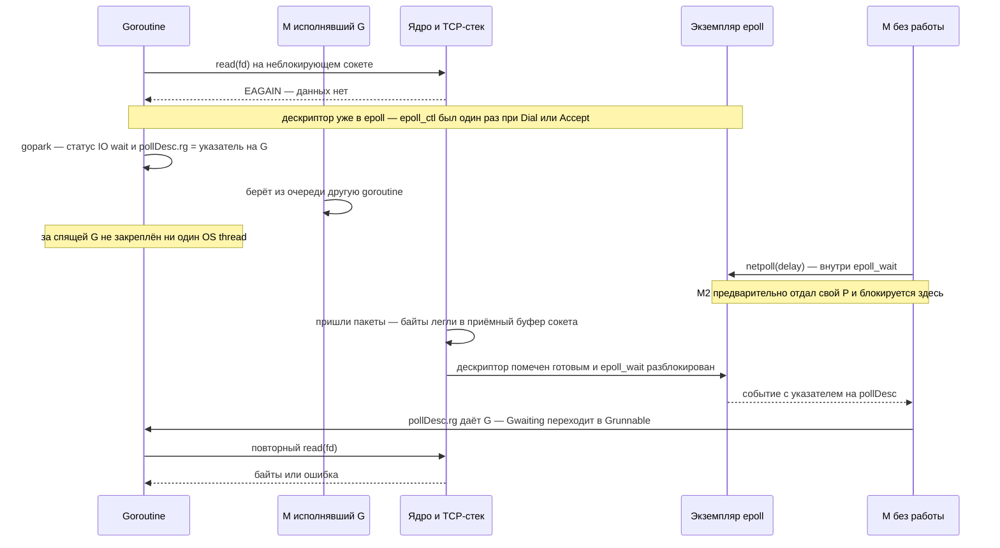

# Netpoller: сетевой ввод-вывод без отдельного OS thread на каждое соединение

## Содержание

- [Зачем понадобился netpoller](#зачем-понадобился-netpoller)
- [Ментальная модель](#ментальная-модель)
- [Термины и сущности](#термины-и-сущности)
- [Сокет, дескриптор и системный поллер](#сокет-дескриптор-и-системный-поллер)
- [Что происходит при Read](#что-происходит-при-read)
- [Кто и когда вызывает netpoll](#кто-и-когда-вызывает-netpoll)
- [pollDesc и планировщик](#polldesc-и-планировщик)
- [Где находятся байты и буферы](#где-находятся-байты-и-буферы)
- [Readiness не равно сообщению](#readiness-не-равно-сообщению)
- [Жизненный цикл соединения](#жизненный-цикл-соединения)
- [Дедлайны и отмена через context](#дедлайны-и-отмена-через-context)
- [Какие операции используют netpoller](#какие-операции-используют-netpoller)
- [DNS resolver](#dns-resolver)
- [Backpressure и таймауты сервера](#backpressure-и-таймауты-сервера)
- [Диагностика](#диагностика)
- [Типичные ошибки](#типичные-ошибки)
- [Interview-ready answer](#interview-ready-answer)
- [Официальные источники](#официальные-источники)

Главный вопрос этого файла: `conn.Read` выглядит как блокирующий вызов, но тысячи таких вызовов обслуживаются несколькими потоками операционной системы. За счёт чего это работает и в какой конкретно момент спящая goroutine узнаёт, что данные пришли.

Описание ориентировано на Go 1.26 и на Linux с `epoll`. Устройство netpoller — деталь реализации runtime, а не часть спецификации языка: имена функций и эвристики меняются между версиями.

---

## Зачем понадобился netpoller

Исторически сервер обслуживал соединение отдельным потоком операционной системы (`OS thread`): поток звал блокирующий `read(fd)`, ядро усыпляло его до прихода данных, поток просыпался и обрабатывал запрос. Модель простая и до сих пор верная для сотен соединений. На десятках тысяч она упирается в стоимость самого потока.

| Ресурс на одно соединение | Поток на соединение | Goroutine + netpoller |
| --- | --- | --- |
| Стек | 8 MiB виртуальной памяти по умолчанию на Linux (`ulimit -s` = 8192 KiB); физически расходуются только затронутые страницы | 2 KiB стартовый стек goroutine, растёт по необходимости |
| Структуры ядра | `task_struct` плюс стек ядра (обычно 16 KiB) на каждый поток, эта память не вытесняется на диск | нет: goroutine ядру не видна |
| Переключение | переключение контекста между потоками — единицы микросекунд, с уходом в ядро и промахами по кэшу процессора | переключение goroutine — сотни наносекунд, целиком в пользовательском пространстве |
| Планирование | планировщик ядра перебирает все готовые к исполнению потоки | планировщик Go работает с `GOMAXPROCS` потоками |

Ключевая идея: ждать должна goroutine, а не поток. Для этого сокет переводится в неблокирующий режим, а ожидание готовности отдаётся механизму ядра, который умеет следить за многими дескрипторами сразу — `epoll` на Linux, `kqueue` на BSD/macOS, IOCP на Windows.

Netpoller — прослойка runtime между таким механизмом и планировщиком goroutines. Он не принимает пакеты, не хранит HTTP-запросы и не выполняет обработчик; он переводит «дескриптор 42 готов» в «goroutine №17 можно ставить в очередь на исполнение».

Экономия касается только потоков. Соединение всё равно удерживает дескриптор, буферы ядра, goroutine и часто буферы приложения — подробности в разделе [Где находятся байты и буферы](#где-находятся-байты-и-буферы).

---

## Ментальная модель

Главное, что стоит удержать: ядро никого не «уведомляет», Go сам ходит и спрашивает.

Нет фонового потока с обработчиком события, нет сигнала, нет прерывания, которое разбудит goroutine. Есть обычный синхронный системный вызов `epoll_wait`, и кто-то из потоков Go должен его выполнить. Всё остальное — вопрос о том, кто и в какой момент это делает.

На схеме ниже `EAGAIN` — это ответ ядра «сейчас данных нет, попробуй позже». Неблокирующий дескриптор возвращает его вместо того, чтобы усыпить поток.



Две модели доставки событий, которые легко перепутать:

| | Push, чего в Go нет | Pull, как на самом деле |
| --- | --- | --- |
| Кто начинает | ядро вызывает обработчик в процессе | процесс вызывает `epoll_wait` |
| Что происходит, пока процесс занят | обработчик всё равно исполнится | событие лежит в списке готовых внутри ядра, пока его не заберут |
| От чего зависит задержка пробуждения | от ядра | от того, как скоро планировщик Go дойдёт до `netpoll` |

Поэтому вопрос «в какой момент goroutine узнаёт о данных» сводится к вопросу «в какой момент runtime вызывает `netpoll`» — этому посвящён [отдельный раздел](#кто-и-когда-вызывает-netpoll).

Такой подход позволяет обслуживать много почти простаивающих соединений небольшим числом потоков. Цена всё равно есть: буферы сокета, дескрипторы, стек и метаданные goroutine, буферы приложения и корни для сборщика мусора.

---

## Термины и сущности

Дальше эти понятия используются постоянно, поэтому стоит развести их явно.

| Термин | Что означает |
| --- | --- |
| дескриптор (`fd`, file descriptor) | небольшое целое число — идентификатор, по которому процесс обращается к объекту ядра: сокету, файлу, каналу. Сам по себе данных не содержит |
| неблокирующий режим | режим дескриптора, в котором вызов не усыпляет поток: если данных нет, он немедленно возвращает ошибку `EAGAIN` |
| `EAGAIN` / `EWOULDBLOCK` | «сейчас данных нет, попробуй позже». Не ошибка соединения, а штатный ответ неблокирующего дескриптора |
| готовность (`readiness`) | «операция, вероятно, не заблокируется прямо сейчас». Модель `epoll` и `kqueue` |
| завершение (`completion`) | «операция уже выполнена, результат готов». Модель IOCP на Windows |
| `epoll` | подсистема ядра Linux, следящая за готовностью набора дескрипторов. Состоит из трёх системных вызовов: `epoll_create1` — создать, `epoll_ctl` — добавить или убрать дескриптор, `epoll_wait` — спросить, кто готов |
| edge-triggered (`EPOLLET`) | режим, в котором событие приходит на *переход* состояния — данных не было, появились, — а не всё время, пока данные лежат в буфере. Позволяет зарегистрировать дескриптор один раз на всю жизнь соединения |
| G, M, P | goroutine, поток операционной системы, контекст исполнения — слот планировщика, их `GOMAXPROCS`. Подробно в [scheduler и preemption](./01-scheduler-and-preemption.md) |
| park | перевести goroutine в ожидание и отдать поток другой работе. В стеках видно как `[IO wait]` |
| `pollDesc` | структура runtime, связывающая конкретный дескриптор с ждущими его goroutines и дедлайнами |
| `netpoll(delay)` | функция runtime, внутри которой и происходит `epoll_wait`. Точка, где события из ядра попадают в Go |

Отдельно стоит различать две пары понятий, которые в разговоре часто смешивают:

- **готовность и завершение.** Готовность — разрешение попробовать, данные ещё надо забрать своим `read`. Завершение — данные уже скопированы, забирать нечего. Go на Linux работает по первой модели, на Windows — по второй, и общий контракт netpoller скрывает эту разницу;
- **соединение и запрос.** Соединение — один сокет и один дескриптор, который живёт долго. Запросов через него может пройти много, последовательно или параллельно.

---

## Сокет, дескриптор и системный поллер

На Unix сокет является объектом ядра, а дескриптор — небольшим целым числом, по которому процесс к нему обращается:

```text
Go net.Conn
    -> internal/poll.FD
        -> fd = 42
            -> сокет в ядре
                ├── состояние TCP
                ├── локальный и удалённый адреса
                ├── приёмный буфер
                └── буфер отправки
```

Дескриптор не содержит данные и не уникален глобально. После `close(42)` операционная система может быстро выдать число `42` другому ресурсу, поэтому runtime защищается от событий, относящихся к прошлой жизни дескриптора, через счётчик поколений внутри своей структуры.

| Платформа | Механизм |
| --- | --- |
| Linux | `epoll`: набор готовых дескрипторов среди зарегистрированных |
| macOS/BSD | `kqueue`: готовность и события через очередь ядра |
| Windows | IOCP: уведомления о завершении операции |
| Прочие системы | свой механизм с общим контрактом для runtime |

Системный поллер знает о дескрипторах и событиях, но ничего не знает о goroutines. Перевод выполняет netpoller:

```text
дескриптор готов или операция завершена
    -> найти pollDesc
    -> извлечь ждущую G для чтения или записи
    -> сделать G готовой к исполнению
    -> планировщик позже запускает G на M + P
```

<details>
<summary>Что именно делает операционная система, а что runtime</summary>

| Слой | Ответственность |
| --- | --- |
| Сетевая карта (`NIC`) и сетевой стек ядра | принимает пакеты, обрабатывает TCP, кладёт байты в приёмный буфер сокета |
| `epoll`/`kqueue`/IOCP | хранит набор наблюдаемых дескрипторов и список готовых; отдаёт его по запросу процесса |
| Netpoller | связывает событие операционной системы с `pollDesc` и ждущей G |
| Планировщик | ставит разбуженную G в очереди готовых и выделяет ей процессорное время |
| Протокол приложения | читает байты, восстанавливает сообщения и применяет бизнес-логику |

Netpoller не принимает пакеты, не хранит HTTP-запросы и не выполняет обработчик. Он является переходником между событием ввода-вывода и планировщиком.

</details>

### Регистрация дескриптора происходит один раз

Когда `net.Dial` или `Accept` создаёт соединение, runtime переводит дескриптор в неблокирующий режим и регистрирует его в `epoll`:

```text
epoll_create1(EPOLL_CLOEXEC)          // один раз на процесс, лениво при первом сетевом дескрипторе
epoll_ctl(epfd, EPOLL_CTL_ADD, fd, {
    events = EPOLLIN | EPOLLOUT | EPOLLRDHUP | EPOLLET,
    data   = указатель на pollDesc вместе со счётчиком поколения fdseq
})
```

Два следствия:

- в поле `data` лежит не номер дескриптора, а указатель на `pollDesc`. Поэтому по событию из ядра runtime сразу получает нужную структуру, без поиска по таблице;
- флаг `EPOLLET` означает, что подписка ставится один раз на всю жизнь соединения. В горячем пути `Read` и `Write` вызовов `epoll_ctl` нет — только сам `read`/`write` и, при необходимости, park.

---

## Что происходит при Read

Пошаговый разбор для модели готовности на Unix. Во второй колонке — кто именно выполняет шаг.

| # | Кто | Что происходит |
| ---: | --- | --- |
| 1 | goroutine | `net.Conn.Read` доходит до `internal/poll.FD.Read` |
| 2 | goroutine | выполняет неблокирующий `read(fd, buf)` |
| 3 | goroutine | если байты есть — вызов вернулся, дальше ничего из этого списка не нужно |
| 4 | goroutine | если получен `EAGAIN` — записывает себя в `pollDesc.rg` и вызывает `gopark` |
| 5 | M + P | поток берёт из очереди другую goroutine и исполняет её |
| — | — | *здесь G спит, за ней не закреплён ни один поток* |
| 6 | ядро | сетевая карта получает пакеты, стек TCP собирает поток байт, байты ложатся в приёмный буфер сокета |
| 7 | ядро | помечает дескриптор готовым и кладёт его в список готовых внутри `epoll`; если кто-то заблокирован в `epoll_wait` — он разблокируется |
| 8 | какой-то M | вызывает `netpoll(delay)`, внутри — `epoll_wait`, и забирает готовые события |
| 9 | runtime | по полю `data` события находит `pollDesc`, достаёт из `rg` спящую G, переводит `_Gwaiting` в `_Grunnable` |
| 10 | планировщик | ставит G в очередь; какой-то P её подхватывает |
| 11 | goroutine | повторяет `read(fd)` и получает байты или новую ошибку |

Три вещи, которые важно прочитать в этой таблице:

- **шаг 7 не будит goroutine.** Он только помечает дескриптор готовым внутри ядра. Между шагами 7 и 8 может пройти заметное время — см. следующий раздел;
- **шаг 11 обязателен.** Готовность означает «операция сейчас, вероятно, не заблокируется», а не «runtime уже скопировал данные». К моменту повторного `read` состояние может снова измениться, например данные успела забрать другая goroutine того же соединения. Поэтому реализация обязана корректно повторять попытку и снова обрабатывать `EAGAIN`;
- **пока G спит, байты живут в буфере ядра**, а не в goroutine и не в netpoller.

---

## Кто и когда вызывает netpoll

Раз ядро ничего не присылает само, вся задержка пробуждения определяется тем, кто вызовет `netpoll`. Претендентов ровно несколько, и они закрывают разные состояния планировщика.

Сама функция поддерживает три режима:

| `delay` | Поведение |
| ---: | --- |
| `0` | проверить готовые события и сразу вернуть управление |
| `> 0` | заблокироваться максимум на указанное время |
| `< 0` | заблокироваться без ограничения по времени, до события или до `netpollBreak` |

Точки вызова:

| Кто вызывает | Режим | Когда срабатывает | Что это даёт |
| --- | --- | --- | --- |
| `findRunnable`, начало поиска работы | `netpoll(0)` | практически на каждом цикле планировщика, если есть ждущие дескрипторы | дешёвая проверка: готовая сетевая работа подбирается почти сразу |
| `findRunnable`, перед усыплением M | `netpoll(delay)` | когда готовой работы нет вообще; `delay` равен времени до ближайшего таймера runtime либо `-1` | поток не крутит процессор впустую, а спит прямо в ядре на `epoll_wait` |
| `sysmon` | `netpoll(0)` | если с прошлого вызова прошло больше 10 мс | страховка: верхняя граница задержки, если планировщик почему-то не опрашивает поллер |
| `netpollBreak` | — | появился таймер раньше текущего `delay` или появилась новая работа | не читает события, а *будит* заблокированный `epoll_wait`, записав байт в `eventfd`, который тоже зарегистрирован в этом экземпляре `epoll` |

Отсюда два практических сценария.

**Есть свободный поток.** Он уже заблокирован внутри `epoll_wait`. Ядро на шаге 7 разблокирует его немедленно, из того же кода, который пометил сокет готовым. Задержка между «данные в буфере» и «G готова к исполнению» — микросекунды. Это нормальный режим сервера с запасом по процессору.

**Все потоки заняты.** Событие просто лежит в списке готовых внутри ядра, и его никто не забирает. G проснётся, когда первый освободившийся M дойдёт до `findRunnable`, либо когда `sysmon` не позже чем через 10 мс сделает контрольный `netpoll(0)`. Готовность здесь работает как почта до востребования, а не как прерывание. Практический вывод: под насыщением процессора сетевые задержки растут не из-за сети, а из-за очереди к планировщику, и искать их надо в execution trace, а не в `tcpdump`.

Ещё одна деталь, которая часто удивляет: M, уходящий блокироваться в `epoll_wait`, сначала отдаёт свой P. В `findRunnable` на этот случай стоит явная проверка `throw("findRunnable: netpoll with p")`. То есть опрашивающий поток не занимает слот планировщика и не расходует один из `GOMAXPROCS`. Отдельного постоянного «сетевого потока» на соединение не существует вовсе: в каждый момент внутри `epoll_wait` может стоять один M, но обслуживает он события всех дескрипторов сразу.

<details>
<summary>Как увидеть pull-модель своими глазами</summary>

Утверждение «Go сам спрашивает» проверяется без чтения исходников runtime. На Linux:

```bash
strace -f -tt -e trace=epoll_create1,epoll_ctl,epoll_pwait,accept4,read,write ./server
```

Что будет видно в выводе:

- `epoll_create1(EPOLL_CLOEXEC)` — ровно один раз, при первом сетевом дескрипторе;
- `epoll_ctl(..., EPOLL_CTL_ADD, ...)` — по одному на каждое новое соединение, и больше для него не повторяется;
- `epoll_pwait(...)` — повторяющиеся вызовы из разных потоков. Это и есть `netpoll`. Go на amd64/Linux использует `epoll_pwait`, поэтому фильтровать надо по нему, а не по `epoll_wait`;
- `read(...)` с `EAGAIN`, а позже — успешный `read` того же дескриптора.

Ключевое наблюдение: между `epoll_pwait` и пробуждением goroutine нет никакого другого системного вызова. Данные становятся доступны приложению ровно в момент возврата из `epoll_pwait`.

За один вызов runtime забирает до 128 событий — таков размер буфера в `runtime/netpoll_epoll.go`. Поэтому под нагрузкой на тысячи готовых сокетов приходится небольшое число системных вызовов.

На macOS аналог — `sudo dtruss` с `kevent`, но защита целостности системы (`SIP`, System Integrity Protection) обычно мешает трассировке, поэтому эксперимент удобнее ставить в контейнере с Linux.

</details>

---

## pollDesc и планировщик

Runtime связывает наблюдаемый дескриптор со структурой `pollDesc`. Для ментальной модели достаточно знать, что она хранит:

- идентичность дескриптора и стадию его жизненного цикла;
- отдельное ожидание для чтения и для записи;
- дедлайны чтения и записи;
- защиту от событий, пришедших после закрытия или переиспользования дескриптора.

Ожидания чтения и записи независимы. Упрощённо состояние каждого направления может означать одно из трёх:

```text
ждущих нет
здесь лежит указатель на припаркованную G
событие готовности уже пришло
```

Третье состояние обязательно из-за гонки между park и событием ядра:

```text
G проверяет дескриптор -> EAGAIN
                            событие может прийти здесь
G регистрирует ожидание
G паркуется
```

Если событие приходит до фактического park, состояние запоминает готовность, и G не засыпает навсегда. Если G уже припаркована, событие извлекает её и делает готовой к исполнению. Закрытие и дедлайн используют тот же путь синхронизации, но будят с ошибкой.

Netpoller возвращает планировщику список goroutines, для которых ввод-вывод готов. Они становятся готовыми к исполнению и попадают в обычный цикл планирования; сам netpoller обработчик приложения не выполняет.

<details>
<summary>Упрощённый pollDesc</summary>

```go
type pollDesc struct {
	fd    uintptr
	fdseq atomic.Uintptr

	rg atomic.Uintptr // состояние ожидания читателя
	wg atomic.Uintptr // состояние ожидания писателя

	rd int64 // дедлайн чтения
	wd int64 // дедлайн записи

	closing bool
}
```

Реальная структура содержит блокировки, счётчики таймеров и состояние ошибки. Поле `fdseq` помогает отличить событие прошлой жизни дескриптора от нового ресурса, которому операционная система переиспользовала тот же номер: этот же счётчик упакован в поле `data` события `epoll`, поэтому событие от закрытого соединения отбрасывается, а не будит чужую goroutine.

</details>

---

## Где находятся байты и буферы

Одновременно существуют минимум два разных слоя буферов:

```text
удалённая сторона пишет байты
    -> сеть
    -> приёмный буфер сокета в ядре
    -> read(fd, userBuf)
    -> []byte, который передало приложение
    -> необязательный буфер bufio или парсера протокола
```

| Буфер | Кто владеет | Когда занимает память |
| --- | --- | --- |
| Приёмный буфер и буфер отправки в ядре | сокет операционной системы | пока соединение открыто и данные стоят в очереди |
| Срез, переданный в `Read` | приложение | пока на срез есть ссылки |
| `bufio.Reader`, буферы HTTP/gRPC и парсеров | библиотека или приложение | зависит от переиспользования и от времени жизни запроса или соединения |

Готовность обычно означает, что приёмный буфер ядра содержит данные либо дескриптор находится в конечном состоянии или состоянии ошибки. В кучу Go данные не копируются до выполнения самого `read`.

Размеры буферов ядра на Linux видны в настройках и подстраиваются автоматически в пределах диапазона:

```bash
cat /proc/sys/net/ipv4/tcp_rmem   # min default max для приёмного буфера
cat /proc/sys/net/ipv4/tcp_wmem   # min default max для буфера отправки
```

Типичные значения на современных дистрибутивах — `4096 131072 6291456` для чтения и `4096 16384 4194304` для записи. Ядро выделяет память под фактически принятые данные, а не значение `default` на каждый простаивающий сокет, но на соединении с активным трафиком и медленным читателем счёт идёт на сотни килобайт.

Практическое следствие: почти простаивающее соединение не удерживает отдельный поток, но всё равно удерживает дескриптор, буферы ядра, goroutine со стеком от 2 KiB и часто буферы приложения. Если на каждое соединение висит пара `bufio.Reader` и `bufio.Writer` с буфером по 4 KiB, то на 100 тысячах соединений это уже около 800 MiB только на буферах библиотеки. «100k соединений» никогда не означает нулевую стоимость — netpoller экономит потоки, а не память.

---

## Readiness не равно сообщению

TCP передаёт поток байт, а не сообщения. Один `Read` может вернуть:

- часть сообщения приложения;
- несколько сообщений сразу;
- заголовок без полного тела;
- `n > 0` вместе с ненулевой ошибкой.

Границы сообщений задаёт разбиение на кадры (`framing`) на уровне протокола:

- фиксированный размер;
- разделитель (`\n`);
- префикс длины;
- парсер протокола, например HTTP.

```go
header := make([]byte, 4)
if _, err := io.ReadFull(conn, header); err != nil {
    return err
}

n := binary.BigEndian.Uint32(header)
if n > maxFrameSize {
    return ErrFrameTooLarge
}
body := make([]byte, n)
_, err := io.ReadFull(conn, body)
return err
```

`io.ReadFull` может вызвать несколько `Read`; между ними goroutine паркуется и просыпается через netpoller. То есть один логический кадр может пережить несколько полных циклов из раздела [Что происходит при Read](#что-происходит-при-read).

<details>
<summary>Полный пример разбиения на кадры по префиксу длины</summary>

```go
const maxFrameSize = 1 << 20 // 1 MiB

func readFrame(r io.Reader) ([]byte, error) {
	var header [4]byte
	if _, err := io.ReadFull(r, header[:]); err != nil {
		return nil, err
	}

	size := binary.BigEndian.Uint32(header[:])
	if size > maxFrameSize {
		return nil, fmt.Errorf("frame too large: %d", size)
	}

	body := make([]byte, int(size))
	if _, err := io.ReadFull(r, body); err != nil {
		return nil, err
	}
	return body, nil
}

func writeFrame(w io.Writer, body []byte) error {
	if len(body) > maxFrameSize {
		return fmt.Errorf("frame too large: %d", len(body))
	}

	var header [4]byte
	binary.BigEndian.PutUint32(header[:], uint32(len(body)))
	if err := writeFull(w, header[:]); err != nil {
		return err
	}
	return writeFull(w, body)
}

func writeFull(w io.Writer, data []byte) error {
	for len(data) > 0 {
		n, err := w.Write(data)
		if n > 0 {
			data = data[n:]
		}
		if err != nil {
			return err
		}
		if n == 0 {
			return io.ErrShortWrite
		}
	}
	return nil
}
```

Проверка максимального размера выполняется раньше выделения памяти под тело. Иначе удалённая сторона одним четырёхбайтовым заголовком заказывает выделение до 4 GiB. `writeFull` учитывает, что произвольный `io.Writer` может принять только часть буфера за один вызов.

</details>

---

## Жизненный цикл соединения

### Сторона сервера: Listen и Accept

```text
net.Listen("tcp", ":8080")
    -> сокет
    -> bind
    -> listen
    -> слушающий дескриптор в неблокирующем режиме регистрируется в поллере

listener.Accept()
    -> пробует принять соединение
    -> EAGAIN: паркует принимающую G
    -> слушающий дескриптор становится читаемым
    -> будит G и повторяет попытку
    -> получается новый дескриптор соединения и net.Conn
```

Слушающий сокет и принятое соединение — разные сокеты ядра с разными дескрипторами. Один listener живёт долго, а каждый успешный `Accept` создаёт отдельный сокет соединения, который тут же регистрируется в `epoll` своим `epoll_ctl`.

```go
listener, err := net.Listen("tcp", ":8080")
if err != nil {
	return err
}
defer listener.Close()

for {
	conn, err := listener.Accept()
	if err != nil {
		return err
	}
	go handleConn(conn)
}
```

Механизм ожидания у `Accept` тот же самый: goroutine, вызвавшая `Accept`, паркуется на слушающем дескрипторе и просыпается по готовности ровно так же, как читатель на обычном соединении.

### Сторона клиента: Dial

`net.Dialer.DialContext` создаёт сокет и выполняет неблокирующее установление соединения. Пока рукопожатие не завершилось, goroutine ждёт готовности через поллер; `context` или дедлайн ограничивает ожидание.

После `Accept` или `Dial` один `net.Conn` обычно переживает множество вызовов `Read` и `Write`. Для HTTP/1 с keep-alive через одно соединение последовательно проходят разные запросы; HTTP/2 и другие мультиплексирующие протоколы допускают несколько логических потоков одновременно.

```text
соединения != запросы != goroutines
```

Их соотношение задаёт протокол и библиотека. Поэтому метрики активных соединений недостаточно, чтобы оценить параллелизм обработчиков или нагрузку по запросам.

### Write

`Write` может припарковать goroutine так же, как `Read`, — если буфер отправки заполнен и дескриптор пока не готов к записи. Направления независимы: одна goroutine может спать на чтении, другая на записи того же соединения, потому что `pollDesc` хранит `rg` и `wg` раздельно.

Успех `Write` не обещает, что удалённая сторона уже прочитала байты. Он означает, что локальный сетевой стек принял данные; они могут оставаться в буфере отправки ядра. Если буфер заполнен из-за медленного читателя, запись получает отказ «сейчас нельзя», и G паркуется до готовности к записи либо до дедлайна.

На одном `net.Conn` несколько goroutines могут одновременно вызывать методы, контракт пакета это допускает. Но протокол приложения всё равно должен синхронизировать разбиение на кадры и владение записью, чтобы байты разных сообщений не смешивались логически.

### Close

`Close` концептуально выполняет несколько связанных действий:

1. запрещает новые операции через блокировку жизненного цикла в `internal/poll.FD`;
2. удаляет и закрывает дескриптор в системном поллере;
3. будит ждущих читателей и писателей с ошибкой — через тот же путь, что и готовность, но с другим результатом;
4. освобождает дескриптор операционной системы, когда это позволяют ссылки и незавершённые операции.

Полузакрытие TCP через `CloseWrite` и `CloseRead` у `*net.TCPConn` отличается от полного `Close`: одно направление может завершиться, пока другое продолжает работать. Это решение уровня протокола, и оно не отменяет необходимость в итоге закрыть соединение.

---

## Дедлайны и отмена через context

`SetDeadline` задаёт абсолютный момент времени, до которого должны уложиться текущие и будущие операции ввода-вывода:

```go
if err := conn.SetReadDeadline(time.Now().Add(5 * time.Second)); err != nil {
    return err
}
```

Runtime связывает дедлайн с таймером. Если дескриптор не становится готовым вовремя, таймер будит ждущую G, и `Read` или `Write` возвращает ошибку, оборачивающую `os.ErrDeadlineExceeded`.

Дедлайн — не «таймаут одного следующего `Read`». Он действует, пока его не изменить или не сбросить нулевым значением. Таймаут простоя обычно реализуют продлением дедлайна после каждой успешной активности.

Внутри `pollDesc` дедлайны чтения и записи имеют отдельные таймеры и счётчики версий. Когда приложение меняет дедлайн, счётчик позволяет старому срабатыванию таймера не отменить более новую операцию. На каждое соединение не создаётся спящая goroutine: дедлайны используют общий механизм таймеров runtime, описанный в [timers](./04-timers.md). Тот же таймер участвует в расчёте `delay` для блокирующего `netpoll`, поэтому истечение дедлайна не ждёт сетевого события.

| Причина пробуждения | Что видит операция |
| --- | --- |
| дескриптор готов | повторяет чтение или запись и получает байты или результат |
| сработал таймер дедлайна | ошибку таймаута, `errors.Is(err, os.ErrDeadlineExceeded)` |
| `Close` | ошибку вида «соединение закрыто» |
| API верхнего уровня с поддержкой `context` | библиотека переводит отмену в закрытие, дедлайн или прерывание на уровне протокола |

Сам `context.Context` не является частью `net.Conn`. API верхнего уровня — `DialContext`, `http.NewRequestWithContext` — связывают отмену с закрытием, дедлайном или прерыванием протокола. В собственном протоколе обычно делают одно из двух:

- при `ctx.Done()` закрывают соединение;
- вычисляют дедлайн из `context` и вызывают `SetDeadline`.

<details>
<summary>Отмена через Close: соединение после этого непригодно</summary>

```go
func readWithCancel(ctx context.Context, conn net.Conn, buf []byte) (int, error) {
	stop := context.AfterFunc(ctx, func() {
		_ = conn.Close() // будит заблокированный Read с ошибкой
	})
	defer stop()

	n, err := conn.Read(buf)
	if ctx.Err() != nil {
		return n, ctx.Err()
	}
	return n, err
}
```

Этот приём означает владение: отмена уничтожает соединение. Он подходит для одноразового соединения, но не для общего или взятого из пула. В HTTP, gRPC и драйверах баз данных предпочтительнее использовать API самой библиотеки, работающий с `context`.

</details>

<details>
<summary>Таймаут простоя в простом протоколе с кадрами</summary>

```go
func serveConn(conn net.Conn) error {
	defer conn.Close()

	for {
		if err := conn.SetReadDeadline(time.Now().Add(30 * time.Second)); err != nil {
			return err
		}

		request, err := readFrame(conn)
		if err != nil {
			if errors.Is(err, os.ErrDeadlineExceeded) {
				return nil // клиент простаивает
			}
			return err
		}

		response := handle(request)
		if err := conn.SetWriteDeadline(time.Now().Add(5 * time.Second)); err != nil {
			return err
		}
		if err := writeFrame(conn, response); err != nil {
			return err
		}
	}
}
```

Дедлайн чтения продлевается после каждого успешно полученного кадра, поэтому это именно таймаут простоя, а не общий лимит на соединение. Дедлайн записи защищает обработчик от удалённой стороны, которая перестала читать ответ.

</details>

---

## Какие операции используют netpoller

Обычно интегрируются:

- сокеты TCP и UDP;
- сокеты домена Unix;
- слушающие сокеты;
- каналы (`pipe`) и другие дескрипторы, для которых платформа и runtime могут включить неблокирующий режим.

Обычные файлы полезной модели готовности не получают и могут заблокировать M: `epoll` на обычном файле всегда отвечает «готов», поэтому ожидание диска он не описывает. Детали — в [syscall](./02-syscall.md).

Клиенты Kafka, Redis, PostgreSQL и RabbitMQ поверх TCP косвенно используют тот же сетевой путь, если драйвер не уходит в cgo или в блокирующую библиотеку на C. Но пакетирование запросов, разбор протокола и пулы соединений находятся уже в клиентской библиотеке, а не в netpoller.

---

## DNS resolver

На Unix пакет `net` может использовать:

- resolver на чистом Go — DNS-запросы идут через сетевой стек Go, ожидание паркует G обычным образом;
- resolver через cgo — вызов системного, заблокированный поиск занимает поток операционной системы.

Go обычно предпочитает вариант на чистом Go, но настройки платформы и функции подсистемы разрешения имён (`NSS`, Name Service Switch) могут потребовать пути через cgo. Диагностика:

```bash
GODEBUG=netdns=1 ./service
GODEBUG=netdns=go+1 ./service
GODEBUG=netdns=cgo+1 ./service
```

Форсировать resolver без причины не стоит: системный может быть нужен для корпоративной конфигурации `NSS` или для локального обнаружения имён (`mDNS`, multicast DNS).

---

## Backpressure и таймауты сервера

Netpoller решает проблему заблокированных потоков, но не защищает приложение от неограниченного объёма работы.

Одно соединение может породить много запросов, а один запрос — дорогой обработчик. Нужны:

- лимиты на соединения и запросы;
- ограниченные очереди и ограниченный параллелизм обработчиков;
- лимит на размер тела запроса;
- дедлайны;
- проброс отмены вниз по стеку;
- ограничение буферизации на соединение.

Минимальная защита HTTP-сервера:

```go
srv := &http.Server{
    Addr:              ":8080",
    ReadHeaderTimeout: 5 * time.Second,
    IdleTimeout:       60 * time.Second,
    WriteTimeout:      30 * time.Second,
}
```

Конкретные значения зависят от потоковой передачи, загрузки файлов и обратного прокси. Копировать их без понимания жизненного цикла запроса нельзя: `WriteTimeout` в 30 секунд ломает выдачу длинных потоковых ответов, а отсутствие `ReadHeaderTimeout` оставляет сервер открытым для соединений, которые держат ресурсы и не присылают заголовки.

<details>
<summary>Ограничение числа одновременно обслуживаемых соединений</summary>

```go
func serve(listener net.Listener, maxHandlers int) error {
	if maxHandlers <= 0 {
		return fmt.Errorf("maxHandlers must be positive")
	}
	slots := make(chan struct{}, maxHandlers)

	for {
		conn, err := listener.Accept()
		if err != nil {
			return err
		}

		select {
		case slots <- struct{}{}:
			go func() {
				defer func() { <-slots }()
				_ = serveConn(conn)
			}()
		default:
			_ = conn.Close() // политика перегрузки: отказать сразу
		}
	}
}
```

Это демонстрация backpressure, а не универсальная политика перегрузки. Продуктивный сервер может ограничивать соединения на балансировщике, ждать ограниченное время, возвращать ошибку протокола или применять лимиты на каждого клиента.

</details>

---

## Диагностика

Дамп goroutines для ожидания сети обычно содержит:

```text
goroutine 42 [IO wait]:
internal/poll.runtime_pollWait(...)
internal/poll.(*FD).Read(...)
net.(*netFD).Read(...)
```

`runtime_pollWait` в стеке — это и есть шаг 4 из таблицы выше: goroutine припаркована в `pollDesc` и ждёт, пока кто-нибудь вызовет `netpoll`.

Полезные инструменты:

- профиль и дамп goroutines — количество и стеки в состоянии `[IO wait]`;
- `go tool trace` — блокировки на сети и пробуждения; здесь же видно, если между готовностью и стартом goroutine стоит очередь планировщика;
- `runtime/metrics` — число goroutines;
- метрики сокетов (`ss` и платформенные инструменты) — состояния и размеры очередей;
- `strace -c -f -e trace=epoll_pwait` — сколько времени процесс проводит в самом поллере;
- метрики приложения — активные соединения, задержка запросов, таймауты, ожидание в пуле.

<details>
<summary>Команды для совместной диагностики goroutines и сокетов</summary>

```bash
curl -s http://127.0.0.1:6060/debug/pprof/goroutine?debug=2 \
  > goroutines.txt

go tool pprof -http=:0 \
  http://127.0.0.1:6060/debug/pprof/goroutine

ss -s
ss -tn state established
ss -tn state close-wait
```

Много goroutines в `[IO wait]` может быть нормой для почти простаивающих соединений. Искать надо динамику: растут ли одновременно число goroutines, открытых дескрипторов, соединений в `CLOSE_WAIT`, потребление памяти и задержка запросов.

</details>

Состояние `CLOSE_WAIT` означает, что удалённая сторона закрыла свою половину, а локальное приложение ещё не закрыло сокет. Короткое присутствие нормально; устойчивое накопление обычно указывает на утечку или ошибку в управлении жизненным циклом соединения.

---

## Типичные ошибки

- считать, что ядро само будит goroutine: готовность забирается вызовом `netpoll`, а не приходит как обработчик события;
- считать один `Read` одним сообщением;
- не повторять операцию после пробуждения, считая готовность гарантией наличия данных;
- не задавать дедлайны для внешних собеседников;
- порождать goroutine на каждое сообщение без ограничения и без backpressure;
- удерживать большие буферы на каждом простаивающем соединении;
- полагать, что `context` сам отменит вызов `net.Conn.Read` на голом соединении;
- забывать закрывать соединение или тело ответа;
- считать «много goroutines в IO wait» проблемой без проверки памяти и задержек;
- путать готовность в netpoll с завершением асинхронной операции приложения.

---

## Interview-ready answer

**1. Почему 100k соединений не требуют 100k заблокированных потоков?**

- Суть — ждёт goroutine, а не поток: сокет неблокирующий, при `EAGAIN` runtime паркует только G и регистрирует ожидание в системном поллере.
- Цена потока — 8 MiB виртуального стека по умолчанию плюс структуры ядра; goroutine стартует с 2 KiB и ядру не видна.
- Возврат — когда готовность приходит, G снова становится готовой к исполнению, а M всё это время исполнял другую работу.

**2. Как goroutine узнаёт, что данные пришли?**

- Суть — никакого уведомления из ядра нет: ядро только помечает дескриптор готовым в своём списке.
- Момент — данные попадают в Go при возврате из `epoll_wait`, который runtime вызывает сам внутри `netpoll(delay)`.
- Связь — событие несёт указатель на `pollDesc`, оттуда достаётся ждущая G и переводится в готовые.

**3. Кто и когда вызывает netpoll?**

- Быстрая проверка — `findRunnable` делает неблокирующий `netpoll(0)` при поиске работы.
- Простой — при отсутствии готовой работы M отдаёт свой P и блокируется в `netpoll(delay)`, где `delay` рассчитан по ближайшему таймеру.
- Страховка — `sysmon` подбирает события неблокирующим вызовом, если опроса не было дольше 10 мс; это верхняя граница задержки.
- Прерывание ожидания — более ранний таймер или появившаяся работа будят заблокированный поллер через `netpollBreak`, записывая байт в `eventfd`.

**4. Где находятся байты, пока G спит?**

- Место — в приёмном буфере сокета внутри ядра.
- Роль netpoller — хранит состояние готовности и ожидания, а не данные приложения.
- Копирование — проснувшаяся G повторяет `read` и переносит байты в буфер приложения.

**5. Что связывает дескриптор с ждущей goroutine?**

- Структура — `pollDesc` хранит жизненный цикл дескриптора, раздельные состояния ожидания чтения и записи, дедлайны.
- Скорость поиска — указатель на `pollDesc` вместе со счётчиком `fdseq` лежит прямо в поле `data` события `epoll`, поэтому поиск по таблице не нужен.
- Защита — тот же счётчик отбрасывает события от закрытого дескриптора, номер которого переиспользовала операционная система.

**6. Чем готовность отличается от готового сообщения?**

- Готовность — разрешение попробовать прочитать, а не признак того, что данные уже в Go.
- TCP — поток байт без границ сообщений: один `read` может вернуть часть сообщения или несколько сразу.
- Следствие — границы задаёт разбиение на кадры в протоколе, а операцию после пробуждения всегда надо повторять.

**7. Как работает SetDeadline?**

- Механизм — runtime добавляет таймер дедлайна к структуре поллинга; отдельный поток или goroutine на каждый дедлайн не создаётся.
- Пробуждение — разбудить G могут готовность дескриптора, `Close` или таймер; при истечении операция возвращает `os.ErrDeadlineExceeded`.
- Семантика — дедлайн абсолютный и действует до изменения, поэтому таймаут простоя делают продлением после каждой активности.

**8. Чем соединение отличается от запроса?**

- Соединение — один сокет и дескриптор, который часто живёт долго.
- Запросы — через одно соединение идут последовательные запросы при keep-alive или мультиплексированные потоки в HTTP/2.
- Следствие — число соединений не равно параллелизму запросов, по нему нельзя оценивать нагрузку на обработчики.

**9. Использует ли клиент базы данных netpoller?**

- Обычный случай — если драйвер написан на Go и работает через сокет TCP, то да, через пакет `net`.
- Исключение — если драйвер уходит в cgo или блокирующую библиотеку на C, ожидание занимает поток операционной системы.
- Проверка — видно по стекам: `internal/poll.runtime_pollWait` против кадров cgo.

**10. Решает ли netpoller проблему перегрузки?**

- Ответ — нет, он экономит потоки во время ожидания ввода-вывода, а не ограничивает объём работы.
- Что остаётся — соединения, буферы, goroutines и обработчики продолжают потреблять ресурсы.
- Под насыщением — задержка растёт именно на участке «событие готово, но `netpoll` ещё никто не вызвал», поэтому нужны дедлайны, лимиты, ограниченные очереди и backpressure.

---

## Официальные источники

- [net package](https://pkg.go.dev/net)
- [internal/poll source](https://go.dev/src/internal/poll/)
- [runtime netpoll source](https://go.dev/src/runtime/netpoll.go)
- [runtime epoll backend source](https://go.dev/src/runtime/netpoll_epoll.go)
- [Linux epoll](https://man7.org/linux/man-pages/man7/epoll.7.html)
- [net/http Server](https://pkg.go.dev/net/http#Server)
