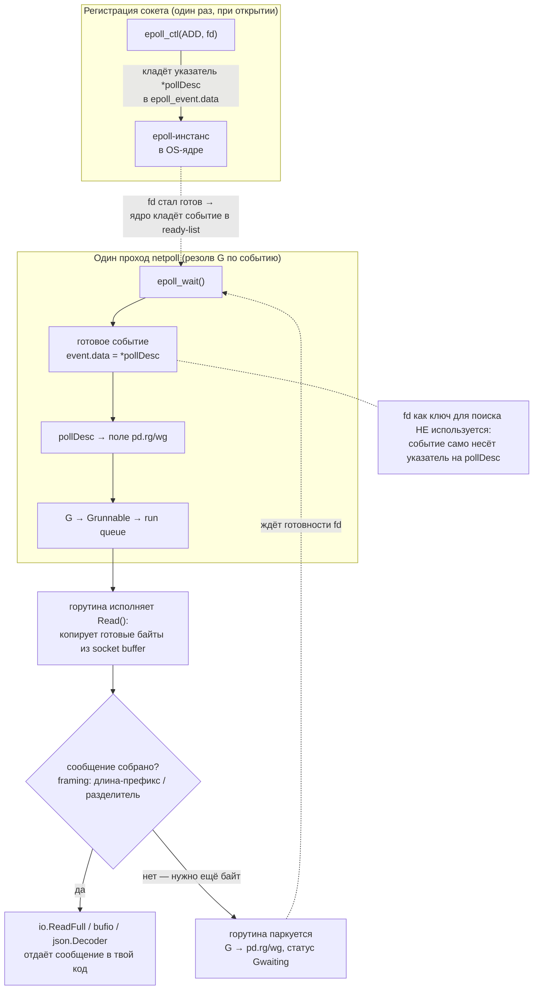

# Netpoller: сетевой I/O без blocking threads

Как Go позволяет тысячам горутин ждать сетевых событий, не блокируя OS-потоки, — и почему именно это делает Go эффективным для высоконагруженных сетевых сервисов. Короткое определение — в разделе [«В двух словах»](#в-двух-словах-что-такое-netpoller) ниже, дальше — детализация.

## Содержание

- [В двух словах: что такое netpoller](#в-двух-словах-что-такое-netpoller)
- [Проблема: blocking I/O vs threads](#проблема-blocking-io-vs-threads)
- [Решение: epoll/kqueue/IOCP](#решение-epollkqueueiocp)
- [Откуда берётся соединение: что происходит до первого `Read`](#откуда-берётся-соединение-что-происходит-до-первого-read)
- [Как понять, что сообщение пришло целиком (framing)](#как-понять-что-сообщение-пришло-целиком-framing)
- [Сколько соединений на сервере: conn ≠ число запросов](#сколько-соединений-на-сервере-conn--число-запросов)
- [А чтения из Kafka, Redis, RabbitMQ — тоже через netpoller?](#а-чтения-из-kafka-redis-rabbitmq--тоже-через-netpoller)
- [Архитектура netpoller в Go](#архитектура-netpoller-в-go)
- [Куда приходят данные, пока горутина спит](#куда-приходят-данные-пока-горутина-спит)
- [Жизненный цикл сетевого соединения](#жизненный-цикл-сетевого-соединения)
- [pollDesc: связь fd и горутины](#polldesc-связь-fd-и-горутины)
- [Когда netpoll() вызывается](#когда-netpoll-вызывается)
- [Deadlines: SetDeadline через таймеры](#deadlines-setdeadline-через-таймеры)
- [Что происходит с состоянием netpoller при отмене](#что-происходит-с-состоянием-netpoller-при-отмене)
- [DNS resolver: Go vs platform](#dns-resolver-go-vs-platform)
- [Типичные паттерны и ошибки](#типичные-паттерны-и-ошибки)
- [Диагностика](#диагностика)
- [Interview-ready answer](#interview-ready-answer)

---

## В двух словах: что такое netpoller

**netpoller — это тонкий слой Go-рантайма поверх механизма готовности I/O самой ОС** (`epoll` на Linux, `kqueue` на macOS/BSD, IOCP на Windows). Сам он сеть «не опрашивает» — реальную работу (принять пакеты, сложить данные, пометить сокет готовым) делает **OS-ядро**. Задача netpoller — **использовать** готовый механизм ОС и связать его с горутинами.

Главное, что он делает: **превращает «готовность fd» в «готовность горутины».** ОС умеет сказать «вот эти сокеты готовы к чтению», но про горутины она ничего не знает. netpoller берёт этот список готовых fd и переводит его в список горутин, которые можно разбудить и поставить в очередь планировщика.

> **Что такое сокет?** Сокет — это объект в **OS-ядре**, «точка подключения» для сетевого обмена (само слово socket = «розетка/гнездо»). Через него программа шлёт и принимает данные по сети. Сокет хранит всё состояние общения: протокол (TCP/UDP), локальный и удалённый адрес:порт, буферы приёма/отправки, для TCP — состояние соединения (`ESTABLISHED`, `CLOSE_WAIT`…). Сам он живёт в ядре, а программа обращается к нему по номеру — **fd** (см. ниже). Подключённый TCP-сокет однозначно определяется **4-кортежем** (`IP:порт клиента` ↔ `IP:порт сервера`) и протоколом. Аналогия: сокет = телефонный аппарат, fd = бирка с номером, по которой ты к нему обращаешься.

> **Что такое fd (file descriptor)?** Это просто **целое число** — «ручка», которую OS-ядро выдаёт процессу на открытый ресурс: сокет, файл, pipe и т.п. В Unix «всё есть файл», поэтому соединение, файл и канал — всё это fd (например, `3`, `4`, `5`…). Когда ты пишешь `conn.Read`, внутри это `read(fd, …)` — операция над числом-дескриптором. Само OS-ядро по этому числу находит свою структуру (буферы, состояние TCP и пр.). `socket()`/`accept()`/`open()` возвращают новый fd; `close()` его освобождает. fd уникальны **в пределах процесса** и выдаются по возрастанию (0/1/2 заняты под stdin/stdout/stderr).

```
┌─ Go runtime: NETPOLLER ──────────────────────────┐
│  • регистрирует сокеты в epoll ОС  (epoll_ctl)   │
│  • спрашивает «кто готов?»         (epoll_wait)  │
│  • готовый fd  →  готовая горутина  ← ВОТ суть   │
└──────────────────────┬───────────────────────────┘
                       │ syscalls
                       ▼
┌─ OS kernel: epoll/kqueue/IOCP ───────────────────┐
│  • принимает данные из сети в socket buffer      │
│  • помечает готовые fd в ready-list              │
│  • отдаёт список готовых по epoll_wait           │
└──────────────────────────────────────────────────┘
```

Разделение ответственности:

| Кто | Что делает |
|---|---|
| **OS-ядро** (epoll/kqueue) | принимает пакеты, складывает в socket buffer, помечает fd готовым — вся «настоящая» работа с сетью |
| **netpoller** (Go runtime) | регистрирует сокеты в epoll, дёргает `epoll_wait`, и **готовый fd → готовая горутина** (через `pollDesc`) для планировщика |

Зачем это нужно: без netpoller каждое `conn.Read` блокировало бы целый OS-поток в ожидании данных (один поток на соединение). С netpoller горутина просто **паркуется** (~2 KB памяти, без потока и CPU), пока ОС не скажет «данные пришли». Поэтому Go держит сотни тысяч соединений на горстке потоков. Всё, что ниже в этом файле, — детализация этой одной идеи.

---

## Проблема: blocking I/O vs threads

**Наивный подход: один поток на соединение**

```
10 000 соединений
= 10 000 OS threads
= ~80 GB стека (8 MB × 10 000)
= огромный context switch overhead
```

**Классический async подход: event loop**

```
1 поток + event loop (Node.js, nginx worker)
= O(1) memory
= но: всё в одном потоке, CPU-bound блокирует всех
```

**Go подход: goroutine per connection + netpoller**

```
10 000 соединений
= 10 000 горутин × 2–8 KB стека = 20–80 MB
= 4–8 OS threads (GOMAXPROCS)
= код пишется синхронно, выполняется асинхронно
```

Горутины пишут `conn.Read()` как блокирующий вызов, но под капотом горутина **паркуется** и OS thread освобождается для других горутин.

---

## Решение: epoll/kqueue/IOCP

Go использует платформенный механизм асинхронного уведомления о готовности I/O:

| Платформа | Механизм | Сложность |
|---|---|---|
| Linux | `epoll` | O(1) на событие, O(log n) на добавление |
| macOS/BSD | `kqueue` | аналогично epoll |
| Windows | `IOCP` (I/O Completion Ports) | completion model, не readiness |
| Solaris | `event ports` | |

**epoll (Linux) — как работает:**

```c
// Создать epoll instance
epfd = epoll_create1(0);

// Зарегистрировать fd для мониторинга
epoll_ctl(epfd, EPOLL_CTL_ADD, sockfd, &event);

// Ждать событий (блокирующий вызов на отдельном потоке)
n = epoll_wait(epfd, events, MAX_EVENTS, timeout_ms);
// events[0..n-1] содержат готовые fd
```

**Ключевое преимущество epoll**: возвращает только **готовые** fd, не перебирает все. При 10 000 соединений и 100 активных — epoll_wait вернёт 100, а не перебирает 10 000.

---

## Откуда берётся соединение: что происходит до первого `Read`

Прежде чем кто-то вызовет `conn.Read(buf)`, соединение надо **установить**. `net.Conn` — это **интерфейс одного уже открытого соединения** (потока байт). Под TCP внутри лежит `*net.TCPConn`, а в нём — один сокет = один **fd**. Соединение создаётся **один раз** и потом переиспользуется на много `Read`/`Write`.

**Серверная сторона** (`net.Listen` → `Accept` → горутина на соединение):

```
net.Listen("tcp", ":8080")
    ↓  под капотом: socket() → bind() → listen()  — слушающий сокет (свой fd, O_NONBLOCK,
    ↓                                                зарегистрирован в epoll)
listener.Accept()                  ← БЛОКИРУЕТСЯ, пока не придёт новое соединение
    ↓  TCP handshake (SYN/SYN-ACK/ACK) делает OS-ядро само
    ↓  accept() возвращает НОВЫЙ fd на КАЖДОЕ принятое соединение
conn (net.Conn)  ←─ отдельный сокет/fd под это соединение
    ↓
go handleConn(conn)                ← обычно ОДНА горутина на ОДНО соединение
                                      └→ внутри: for { conn.Read(buf); ... }
```

Тот же netpoller обслуживает и `Accept`: если новых соединений нет, `accept()` вернёт `EAGAIN`, и горутина-акцептор **паркуется** на слушающем fd ровно так же, как `Read` паркуется на fd соединения. Пришёл SYN → OS-ядро завершило handshake → слушающий fd помечен готовым → netpoll будит акцептора.

> Syscall-уровень каждого шага (`socket`/`bind`/`listen`/`accept`/`epoll_ctl`/`close`) расписан ниже в разделе [Жизненный цикл сетевого соединения](#жизненный-цикл-сетевого-соединения). Здесь — общая картина «откуда взялся `conn`».

**Клиентская сторона** — соединение создаёт `net.Dial`:

```
conn, _ := net.Dial("tcp", "host:443")   // socket() + connect() + handshake → готовый fd
```

После того как `conn` получен (через `Accept` или `Dial`), он **живёт долго**, и `Read`/`Write` на нём вызываются **многократно**:

```go
func handleConn(conn net.Conn) {   // ОДНО соединение = один fd на всё время
    defer conn.Close()             // закрыть fd, иначе утечка дескрипторов
    buf := make([]byte, 4096)
    for {
        n, err := conn.Read(buf)   // вызывается МНОГО раз на том же conn
        if err != nil {            // io.EOF = peer закрыл соединение
            return
        }
        process(buf[:n])           // обработать первые n байт
    }
}
```

> **TCP — это поток байт, а не сообщения.** Один `Read` возвращает `n` байт — **столько, сколько прямо сейчас лежит** в socket receive buffer OS-ядра. Это может быть меньше `len(buf)`; данные двух `Write` с другой стороны могут «склеиться» в один `Read`, а одно большое сообщение — прийти за несколько `Read`. Поэтому границы сообщений ты задаёшь сам (длина-префикс, разделитель, `bufio.Scanner` и т.п.). `n < len(buf)` — это норма, а не ошибка.

Итог: соединение устанавливается один раз (`Accept`/`Dial` → новый fd), а схема ниже — это трасса **одного** `conn.Read(buf)` на **уже существующем** соединении. Она показывает не «как создаётся соединение», а что происходит **внутри каждого вызова чтения**: попытка прочитать → если данных нет, park → netpoll будит → повтор чтения.

## Как понять, что сообщение пришло целиком (framing)

Частое заблуждение: «горутина ждёт, пока придёт всё сообщение целиком». На уровне **одного `Read` это не так** — но на уровне библиотек, которыми ты пользуешься, **так и есть**. Разберём оба уровня, потому что путаница именно здесь.

### Голый `Read` про «сообщения» не знает

На уровне TCP/сокета понятия «сообщение» **не существует** — есть только поток байт. Поэтому `read()` не ждёт «целое сообщение» и не может понять, что «частей больше не будет». Он возвращается, как только в socket buffer есть **хоть 1 байт**, и отдаёт столько, сколько там сейчас лежит:

- `n > 0` — какие-то байты: может быть **полсообщения**, ровно одно, полтора или **несколько склеенных**;
- `n == 0, io.EOF` — peer **закрыл соединение** (FIN). Это единственный «конец» на уровне потока — и он про **всё соединение**, а не про сообщение;
- сигнал готовности из netpoller («сокет готов к чтению») значит **«появился ≥1 байт»**, а не «накопилось целое сообщение». Ядро тоже не знает, где границы твоих сообщений.

### Границы задаёт приложение (framing)

Раз TCP границ не хранит, их определяет **прикладной протокол**. Три классических способа:

```go
// 1. Длина-префикс (gRPC, Kafka): [4 байта длины N][N байт тела]
var lenBuf [4]byte
io.ReadFull(conn, lenBuf[:])               // ровно 4 байта
n := binary.BigEndian.Uint32(lenBuf[:])
body := make([]byte, n)
io.ReadFull(conn, body)                     // ровно n байт → теперь сообщение целое

// 2. Разделитель (HTTP-заголовки \r\n\r\n, Redis RESP, построчные)
scanner := bufio.NewScanner(conn)           // по умолчанию режет по '\n'
for scanner.Scan() { use(scanner.Bytes()) } // одна «строка» = одно сообщение

// 3. Закрытие соединения = конец (HTTP/1.0 без Content-Length): копить до io.EOF
```

### Кто же «ждёт всё сообщение»: обёртка, а не один `Read`

Вот здесь твоя интуиция верна — но **на уровне обёртки**. `io.ReadFull`/`bufio`/`json.Decoder`/парсер протокола внутри **зовут `Read` в цикле**, пока framing не скажет «собрано». С точки зрения твоего кода вызов возвращается, когда сообщение **целиком получено** — но реализовано это как много `Read`, между которыми горутина паркуется.

Пример: сообщение 10 KB пришло тремя TCP-сегментами.

```
io.ReadFull(conn, body[:10KB]):
   Read → 4KB   → буфер пуст → park в netpoller → wake (пришёл сегмент)
   Read → 4KB   → park → wake
   Read → 2KB   → набрали 10KB
   → возврат в ТВОЙ код: всё сообщение здесь
```

Горутина за это время **запарковалась/проснулась 2–3 раза**, но ты видишь один `ReadFull`, вернувший целое тело. Всё это время она в `Gwaiting` — поток (M) свободен, ожидание «бесплатное».

| Уровень | Что значит «готово» | Кто ждёт всё сообщение |
|---|---|---|
| голый `conn.Read` | появился ≥1 байт | никто — отдаёт что есть, границы решаешь ты |
| `io.ReadFull` / `bufio` / `json.Decoder` | framing собрал кадр целиком | **обёртка** — циклом `Read` + park, пока не наберёт |

**Итог:** «горутина ждёт всё сообщение» — это свойство **обёртки** (`io.ReadFull`/`bufio`/парсер), а не одного `Read`. Один `Read` просыпается на первых же байтах; собирает сообщение и решает «полное ли оно» — твой код или библиотека.

## Сколько соединений на сервере: conn ≠ число запросов

Частый вопрос: «если 1000 пользователей отправили форму — будет 1000 conn?» Ответ: **на уровне TCP — да, одно соединение на клиента**, но считать надо **одновременно живые** соединения, а не число запросов или пользователей.

Соединение однозначно определяется **4-кортежем** `(IP клиента, порт клиента, IP сервера, порт сервера)`. Каждое живое соединение — это отдельный сокет = отдельный **fd** = отдельный `net.Conn`. Поэтому **1000 клиентов, держащих соединение в один момент → до 1000 conn / 1000 fd / 1000 горутин**. Это ровно та ситуация, ради которой и нужен netpoller: 1000 горутин спят «бесплатно» в `Gwaiting`, а не висят на 1000 потоках.

Но «1000 отправили форму» обычно ≠ «1000 одновременных conn»:

- **Считается одновременность, не сумма.** Если запросы размазаны во времени, в пике открыто столько, сколько live прямо сейчас (часто десятки–сотни) — остальные уже закрылись или ещё не пришли.
- **Keep-alive: один клиент → одно соединение на много запросов.** HTTP/1.1 по умолчанию держит TCP-соединение открытым (`Connection: keep-alive`) и переиспользует его под последовательные запросы — форма, потом картинка, потом ещё запрос идут по **одному** conn, а не открывают новое соединение на каждый HTTP-запрос.
- **HTTP/2: много запросов в ОДНОМ соединении.** Один TCP-conn несёт много параллельных «стримов» — 1000 запросов от клиента могут идти по одному соединению. (Браузер на HTTP/1.1, наоборот, открывает ~6 соединений на домен ради параллелизма.)
- **За reverse proxy / LB** — прокси **пулит** соединения к бэкенду, их обычно сильно меньше, чем клиентских.

| Сценарий | conn на сервере |
|---|---|
| 1000 клиентов держат соединения одновременно (HTTP/1.1) | ~1000 conn / 1000 fd / 1000 горутин |
| 1000 запросов размазаны во времени | столько, сколько live в пике (десятки–сотни) |
| Один клиент, 1000 запросов по keep-alive (HTTP/1.1) | 1 conn |
| Один клиент, 1000 запросов по HTTP/2 | 1 conn, 1000 стримов |
| Сервис за reverse proxy / LB | пул к бэкенду — заметно меньше клиентских |

**В Go этим занимается сам `net/http`** — руками «горутину на соединение» писать не нужно:

```
listener.Accept()  → новый conn (fd) на каждое ПРИНЯТОЕ TCP-соединение
    ↓
go c.serve(...)    → net/http сам поднимает ОДНУ горутину на соединение
    ↓
for {              // keep-alive: цикл по запросам в рамках ОДНОГО conn
    req := readRequest(conn)   // ← park в netpoller, если данных ещё нет
    handler.ServeHTTP(w, req)
}
```

Для HTTP/2 поверх одного conn добавляются ещё горутины на стримы. Ключевое: **conn считается на одновременно живые соединения**, и именно поэтому 100k соединений в Go живут на горстке потоков — netpoller паркует горутины, а не блокирует потоки.

## А чтения из Kafka, Redis, RabbitMQ — тоже через netpoller?

Да. Kafka, Redis, RabbitMQ, Postgres и т.п. — это всё **сетевые соединения по TCP**. Если Go-клиент открывает соединение через стандартный пакет `net` (`net.Dial` → `net.Conn`), сокет автоматически ставится в `O_NONBLOCK`, и **всё чтение/запись идёт через netpoller** — ровно как `conn.Read`, который мы разбирали. Планировщику без разницы, какой протокол сверху.

```
go-redis / kafka-go / amqp091 / pgx
    ↓  внутри: net.Dial("tcp", "broker:9092") → conn (fd, O_NONBLOCK)
client.Get(ctx, key)         // или ReadMessage / Consume / pool.Query
    ↓
conn.Write(команда)          // отправить запрос (RESP / Kafka protocol / AMQP frame)
    ↓
conn.Read(ответ)             // ← ответа ещё нет → park в netpoller, M свободен
    ↓
ответ пришёл → netpoll будит → парсим протокол в user-space
```

То есть «прочитать сообщение из Kafka» с точки зрения рантайма = тот же park на fd + пробуждение через netpoll. Разбор протокола (RESP у Redis, фреймы у Kafka/AMQP) происходит **в user-space уже после** того, как `Read` вернул байты.

**Connection pooling.** Клиенты БД/брокеров держат **пул долгоживущих соединений** (как `pgxpool`). Одно обращение к Redis = взять conn из пула → `Write` команды → `Read` ответа (park в netpoller) → вернуть conn в пул. Каждое соединение в пуле — отдельный fd, переиспользуется. Поэтому тысячи параллельных запросов к Redis не создают тысячи соединений — они мультиплексируются через пул из десятков conn.

**TLS** (Redis/Kafka over TLS): `crypto/tls` оборачивает `net.Conn`, но под капотом тот же сокет → **тоже netpoller**. И сам TLS-хендшейк — это сетевой I/O, который точно так же паркуется.

> Единственное исключение — клиенты, которые через **cgo** оборачивают C-библиотеку с собственными сокетами (например, `confluent-kafka-go` поверх `librdkafka`): там I/O идёт мимо netpoller и блокирует поток M, как файловый. Pure-Go клиенты (`go-redis`, `kafka-go`, `amqp091-go`, `pgx`) этой проблемы не имеют.

## Архитектура netpoller в Go

Трасса одного `conn.Read(buf)` на уже открытом соединении:

```
net.Conn.Read(buf)                 ← conn уже получен из Accept/Dial (см. выше)
    ↓
internal/poll.FD.Read()
    ↓
poll.FD.readLock() → syscall.Read() (O_NONBLOCK)
    ↓ если EAGAIN (данных нет)
pollDesc.waitRead()
    ↓
gopark() — горутина паркуется (Gwaiting), M освобождается
    ↓
[данные появились в OS-ядре]
netpoll(delay) → возвращает список готовых горутин
    ↓
горутина → Grunnable → LRQ любого P
    ↓
горутина продолжает, syscall.Read() возвращает данные
```

**Ключевые компоненты:**

```
runtime.pollDesc    — один на каждый fd, хранит заблокированные горутины
runtime.netpollGenericInit() — инициализация epoll fd при старте
runtime.netpoll(delay) — вызов epoll_wait, возврат готовых горутин
runtime.netpollready() — разбудить горутину для конкретного fd
```

> **«Возвращает горутины» — не магия.** `netpoll` буквально отдаёт `gList` (список горутин), но fd сам по себе как ключ для поиска **не используется**. При регистрации сокета (`epoll_ctl ADD`) Go кладёт в `epoll_event.data` **указатель на `pollDesc`**, поэтому `epoll_wait` отдаёт события, каждое из которых уже несёт указатель на нужный `pollDesc`. Внутри `netpoll` из `pollDesc.rg`/`pollDesc.wg` достаётся припаркованная читающая/пишущая горутина и добавляется в список. Цепочка: `epoll_wait` → событие с `*pollDesc` → `pd.rg/wg` → горутина. Подробнее про поля pollDesc — в разделе [pollDesc: связь fd и горутины](#polldesc-связь-fd-и-горутины) ниже.



То есть указатель на горутину «прицеплен» к сокету ещё на этапе регистрации (через `pollDesc`), поэтому по готовому событию рантайм сразу знает, кого будить — без поиска по fd. А петля `Q → PARK` показывает ту самую цикличность: пока framing не собрал сообщение, горутина проходит `park → netpoll → Read` снова и снова.

> **Это цикл, а не один проход.** Схема выше — **одна** итерация park → wake. Для одного логического сообщения горутина может пройти её **много раз**: `io.ReadFull`/`bufio`/`json.Decoder` вызывают `Read` в цикле, и на каждом неполном чтении горутина снова паркуется (`pd.rg`) и снова будится этим же механизмом, пока framing не соберёт сообщение целиком. То есть одну «прочитанную обёрткой» структуру может обслужить несколько срабатываний netpoll. Подробнее — в разделе [Как понять, что сообщение пришло целиком](#как-понять-что-сообщение-пришло-целиком-framing).

### Что за `delay` в `netpoll(delay)`

`delay` (в наносекундах) говорит, **насколько `netpoll` имеет право заблокироваться** в `epoll_wait`/`kevent`, ожидая готовности fd:

| `delay` | Поведение `epoll_wait` | Когда вызывается |
|---|---|---|
| `< 0` | блокироваться **бесконечно**, пока хоть один fd не станет готов | P нечего делать и **нет таймеров** — можно спать сколько угодно |
| `0` | **не блокироваться**, вернуть готовые прямо сейчас (poll) | быстрая неблокирующая проверка в `findRunnable` и в `sysmon` |
| `> 0` | блокироваться **не дольше** `delay` нс (таймаут) | P засыпает, но **есть таймер** — проснуться не позже ближайшего дедлайна |

Главное здесь — **`delay > 0` объединяет сеть и таймеры в один syscall**. Когда P готовится заснуть, планировщик смотрит на ближайший таймер (`time.Sleep`, `time.After`, дедлайны соединений) и передаёт время до него как `delay`. Тогда **один** `epoll_wait` одновременно: (а) проснётся, если пришли сетевые данные, и (б) проснётся не позже, чем сработает ближайший таймер. Не нужны ни отдельный поток для таймеров, ни busy-wait. Подробно про эту связку — в [04-timers](./04-timers.md).

> На уровне ОС `delay` в нс конвертируется в таймаут `epoll_wait` (мс) или в `timespec` для `kevent`. `delay < 0` → таймаут `-1` (ждать вечно), `delay == 0` → таймаут `0` (вернуться сразу).

---

## Куда приходят данные, пока горутина спит

Частый вопрос: если горутина, ждущая `conn.Read`, **снята с потока и не исполняется**, то куда вообще приходят данные? Ответ: **приём данных делает OS-ядро, а не горутина** — асинхронно, независимо от того, исполняется ли сейчас твоя горутина (и даже твой процесс).

Когда `read()` вернул `EAGAIN` (данных нет), горутина паркуется, а её fd зарегистрирован в epoll. Дальше всё происходит **в OS-ядре**:

```
1. Пакет приходит на сетевую карту (NIC — Network Interface Card)
   → NIC по DMA (Direct Memory Access — запись в RAM напрямую,
     минуя CPU) кладёт пакет в буферы OS-ядра → аппаратное прерывание

2. OS-ядро (в контексте прерывания/softirq, БЕЗ участия твоего кода):
   → сетевой стек: драйвер → IP → TCP (проверка, сборка, отправка ACK)
   → копирует payload в RECEIVE-БУФЕР СОКЕТА (память OS-ЯДРА, привязана к fd)
   → помечает fd как "readable" и кладёт его в ready-list epoll-инстанса

3. Данные лежат в socket buffer OS-ядра, fd помечен готовым.
   Горутина всё ещё СПИТ — для приёма она не нужна.

4. Go-рантайм вызывает netpoll() = epoll_wait()
   → OS-ядро отдаёт готовые fd → рантайм по fd находит pollDesc
   → припаркованную горутину → Grunnable

5. Горутина просыпается, ПОВТОРЯЕТ read():
   → копирует байты из socket buffer OS-ЯДРА → в твой buf (user-space)
```

Горутина нужна **только на шаге 5** — скопировать уже пришедшие данные. Само ожидание и приём её не занимают: данные хранит OS-ядро (в socket buffer), готовность запоминает epoll (тоже в OS-ядре).

### Два разных буфера (частая путаница)

| Буфер | Где живёт | Кто пишет | Кто читает |
|---|---|---|---|
| **socket receive buffer** | память **OS-ядра**, на каждый fd (размер ~ `SO_RCVBUF`) | OS-ядро при приёме пакетов | `read()` при вызове |
| **user buffer** (`buf` в `conn.Read(buf)`) | память **процесса** (стек/heap горутины) | `read()` копирует сюда | твой код |

`read()` — это операция «перелей из буфера OS-ядра в мой буфер». Пусто в буфере OS-ядра → `EAGAIN` → паркуемся; есть данные → копируем и возвращаем `n`.

> Аналогия: ты заказал посылку и ушёл. Курьер (OS-ядро) принимает её и кладёт в почтовый ящик (socket buffer) — стоять у двери не нужно. Ты (горутина) подходишь к ящику (`read`), только когда удобно, и забираешь доставленное. epoll — это «лампочка на ящике: есть ли что забрать».

Именно поэтому асинхронный I/O масштабируется: при **блокирующем** чтении поток сидел бы внутри `read()` в OS-ядре, ожидая данные — один поток на соединение. В Go ожиданием и приёмом занимается OS-ядро, а горутина спит «бесплатно» (запись в pollDesc + ~2 KB стека) и просыпается лишь скопировать готовое.

---

## Жизненный цикл сетевого соединения

### Создание сервера

```go
ln, err := net.Listen("tcp", ":8080")
// 1. socket(AF_INET6, SOCK_STREAM, 0)    — создать fd
// 2. setsockopt(fd, SO_REUSEADDR, ...)   — опции
// 3. bind(fd, :8080)
// 4. listen(fd, backlog)
// 5. setNonblock(fd)                     — O_NONBLOCK
// 6. epoll_ctl(epfd, ADD, fd, EPOLLIN)   — зарегистрировать в epoll
```

### Accept нового соединения

```go
conn, err := ln.Accept()
// 1. Горутина вызывает accept()
// 2. Если нет соединений → EAGAIN → parkGoRoutine
// 3. epoll уведомляет: новое соединение готово
// 4. Горутина разбужена → accept() снова → получает conn fd
// 5. conn fd выставляется в O_NONBLOCK
// 6. epoll_ctl(epfd, ADD, connfd, EPOLLIN|EPOLLOUT)
```

### Read данных

```go
n, err := conn.Read(buf)
// 1. syscall.Read(fd, buf) — O_NONBLOCK
// 2. Если EAGAIN → pollDesc.waitRead()
//    → gopark(netpollblockcommit)
//    → горутина Gwaiting, M берёт другую горутину
// 3. Данные пришли: epoll_wait → EPOLLIN на connfd
//    → netpollready(pd, 'r') → горутина → Grunnable
// 4. Горутина продолжает, Read возвращает данные

// Write аналогично через EPOLLOUT
```

### Close соединения

```go
conn.Close()
// 1. epoll_ctl(epfd, DEL, fd, 0) — убрать из epoll
// 2. close(fd)
// 3. pollDesc помечается как closed
// 4. Если горутина паркована на этом fd — она разбуждается с ошибкой ErrNetClosing
```

---

## pollDesc: связь fd и горутины

Каждый сетевой fd имеет связанный `pollDesc`:

```go
// runtime/netpoll.go (упрощённо)
type pollDesc struct {
    link *pollDesc  // free list

    fd      uintptr // файловый дескриптор
    closing bool

    rg  atomic.Uintptr  // goroutine waiting for read, or flags
    wg  atomic.Uintptr  // goroutine waiting for write, or flags
    rd  int64           // read deadline (unix nano)
    wd  int64           // write deadline (unix nano)
    rt  timer           // read deadline timer
    wt  timer           // write deadline timer
}
```

Горутина, ждущая `Read`, хранится в `rg`. Горутина, ждущая `Write`, в `wg`. По одной горутине на каждое направление на каждый fd.

**Что это значит на практике:** нельзя делать concurrent `Read` из нескольких горутин на один `conn` — второй `Read` заменит `rg` первого, и первая горутина потеряет уведомление. Все официальные клиенты (HTTP, etc.) это учитывают.

---

## Когда netpoll() вызывается

`netpoll(delay)` вызывается из нескольких мест в scheduler:

```
1. findRunnable() — каждый раз когда P ищет новую горутину
   если LRQ, global queue, work steal все пусты → netpoll(0) (non-blocking)

2. sysmon — периодически
   netpoll(delay) с timeout → проверить готовые fd

3. startTheWorld (после GC STW) — разбудить всех waiting goroutines

4. Явный вызов runtime.Gosched() → может триггернуть netpoll
```

**Важно**: netpoll не крутится в выделенном потоке. Он вызывается как часть scheduler loop:

```
findRunnable():
  1. runnext
  2. LRQ
  3. global queue (1 раз в 61 тик)
  4. netpoll(0)   ← проверить готовые сетевые события
  5. work steal
  6. netpoll(-1)  ← если нечего делать — ждать с timeout
```

### netpoll дёргается постоянно или по событию?

Это **событийная модель, а не периодический опрос**. Как именно вызывается netpoll, зависит от того, есть ли работа.

**Есть работа → быстрый неблокирующий чек `netpoll(0)`.** Пока в очередях есть готовые горутины, M крутит обычный `schedule → findRunnable → run`. netpoll внутри `findRunnable` вызывается **неблокирующе** (`delay = 0`) и **не на каждой итерации**, а оппортунистически — когда есть сетевые waiters (`netpollWaiters > 0`). Это «забежал, забрал готовые fd, побежал дальше»: `epoll_wait` с таймаутом 0 возвращается сразу. Под нагрузкой щупается часто, но это копеечные мгновенные проверки.

**Работы нет → ОДИН M блокируется в `netpoll(delay)`.** Когда M обошёл всё (LRQ/GRQ пусты, красть не у кого) и собирается уснуть (`stopm`), вместо busy-wait он вызывает **блокирующий** netpoll. Делает это **только один** M (guard через CAS `sched.lastpoll → 0`):

```
delay = время до ближайшего таймера   (или -1, если таймеров нет)
netpoll(delay):
   epoll_wait(..., timeout=delay)   ← M СПИТ ЗДЕСЬ, в ядре, CPU не ест
```

Он спит внутри `epoll_wait`, пока не случится одно из: **готов fd** (вернёт список горутин → `Grunnable`), **истёк `delay`** (вернёт пусто → планировщик идёт запускать подошедшие таймеры), либо его разбудили досрочно через `netpollBreak`. Никакого опроса по кругу — ядро само будит M по событию или таймауту.

**`netpollBreak` — досрочное пробуждение.** Если M залёг в `epoll_wait` с `delay = 2ms`, а в это время добавили таймер на `100µs` или появилась работа, которую надо разобрать сейчас, — рантайм пишет в служебный wake-fd (eventfd/pipe), и это **прерывает `epoll_wait` досрочно**. Так пересчитывается ближайший дедлайн, не дожидаясь старого `delay`.

| Состояние планировщика | Как вызывается netpoll | Частота |
|---|---|---|
| Есть работа | `netpoll(0)` неблокирующе в `findRunnable` | оппортунистически, когда есть сетевые waiters (дёшево) |
| Работы нет | `netpoll(delay)` **блокирующе**, один M спит в `epoll_wait` | не «дёргается» — ядро будит по событию / таймауту / `netpollBreak` |
| Все P заняты CPU | `netpoll(0)` из sysmon (бэкстоп, см. ниже) | ~раз в 10мс |

### Зачем netpoll вызывают из ДВУХ мест (findRunnable и sysmon)

Это частый источник непонимания. Путь через `findRunnable` работает, **только когда хотя бы один P простаивает** и заходит искать новую горутину. А если **все P заняты** — крутят CPU-bound горутины и не заглядывают за новой работой?

Тогда netpoll из планировщика **никто не вызовет**. В это время по сети пришли данные, fd готовы, горутины, ждавшие `conn.Read`, уже могут продолжить — но **сидят незамеченными**: их некому перевести в `Grunnable`, потому что ни один P не «оглядывается».

Вот для этого и нужен **`sysmon`** — он работает **независимо, без P**, и периодически проверяет, давно ли вызывался netpoll (по таймстампу `sched.lastpoll`). Если давно — вызывает netpoll сам, забирает готовые I/O-горутины и кладёт в очередь.

```
Все P простаивают  → netpoll зовётся из findRunnable          ✓ (основной путь)
Все P заняты CPU    → findRunnable никто не зовёт
                    → netpoll сам по себе не сработал бы
                    → sysmon периодически зовёт netpoll        ✓ (страховка)
```

Итог: **`findRunnable` проверяет готовность сетевых fd (вызывает netpoll), когда планировщик и так ищет работу; `sysmon` — страховка на случай, когда все P заняты вычислениями и искать работу некому.** Поэтому сетевые горутины не «висят» даже под полной CPU-нагрузкой.

> Уточнение по словам: netpoll (`epoll_wait`) **не «опрашивает сеть»** — данные OS-ядро уже приняло в socket buffer. netpoll лишь спрашивает у OS-ядра, **какие fd уже помечены готовыми** (проверяет ready-list epoll — те самые «флажки на почтовых ящиках»).

---

## Deadlines: SetDeadline через таймеры

`conn.SetDeadline(t)` не делает syscall. Это чисто Go runtime механизм через timer heap:

```go
conn.SetDeadline(time.Now().Add(5 * time.Second))
// Устанавливает pollDesc.rd = deadline unix nano
// runtime timer: через 5s вызвать netpollDeadline(pd, 'r')
// netpollDeadline → pollDesc пометить как expired
//                → разбудить горутину с ошибкой timeout
```

**Что происходит при истечении дедлайна:**

```go
n, err := conn.Read(buf)
// err = &net.OpError{Err: poll.ErrDeadlineExceeded}
// errors.Is(err, os.ErrDeadlineExceeded) → true
```

**SetDeadline vs SetReadDeadline:**

```go
// SetDeadline — для обоих направлений
conn.SetDeadline(time.Now().Add(30 * time.Second))

// SetReadDeadline — только для Read
conn.SetReadDeadline(time.Now().Add(10 * time.Second))

// SetWriteDeadline — только для Write
conn.SetWriteDeadline(time.Now().Add(5 * time.Second))

// Сбросить дедлайн (без ограничения)
conn.SetDeadline(time.Time{})
```

**Паттерн для idle connections (keep-alive servers):**

```go
func handleConn(conn net.Conn) {
    defer conn.Close()
    buf := make([]byte, 4096)

    for {
        // Сдвигать дедлайн на каждой итерации
        conn.SetDeadline(time.Now().Add(30 * time.Second))

        n, err := conn.Read(buf)
        if err != nil {
            if errors.Is(err, os.ErrDeadlineExceeded) {
                // Клиент молчал 30s — закрыть
                return
            }
            return
        }
        handleRequest(buf[:n])
    }
}
```

### А почему я не вижу `SetDeadline` в реальном коде?

Потому что в прикладном коде ты почти никогда не работаешь с `net.Conn` напрямую — `SetReadDeadline` в цикле это паттерн уровня **библиотек и низкоуровневых серверов**. Таймауты ты задаёшь **декларативно**, а перевод в `SetDeadline` + netpoller делает библиотека:

```go
// HTTP-сервер: дедлайны на conn выставляет сам net/http в цикле обслуживания
srv := &http.Server{
    ReadTimeout:       5 * time.Second,
    WriteTimeout:      10 * time.Second,
    IdleTimeout:       120 * time.Second,
    ReadHeaderTimeout: 2 * time.Second,
}

// HTTP-клиент: транспорт переведёт в дедлайны / закроет fd по ctx
client := &http.Client{Timeout: 3 * time.Second}

// БД / gRPC: таймаут через context, драйвер сам рулит дедлайном и отменой
ctx, cancel := context.WithTimeout(ctx, 2*time.Second)
defer cancel()
rows, err := pool.Query(ctx, "SELECT ...")
```

| Уровень | Чем задаёшь таймаут | Кто зовёт `SetDeadline` |
|---|---|---|
| Прикладной (99% кода) | `http.Server{ReadTimeout}`, `http.Client{Timeout}`, `context.WithTimeout` | библиотека (`net/http`, драйвер БД) |
| Низкоуровневый | `conn.SetReadDeadline(...)` руками | ты сам |

Руками `SetReadDeadline` пишут авторы сырых TCP-серверов/клиентов, connection pool'ов, клиентов Redis/Kafka/gRPC и сам stdlib (`net/http` `server.go`, функция `conn.serve` — там этот цикл прямо есть). Подвох с «залипающим timed-out» актуален ровно для них (переиспользование conn после таймаута); в прикладном коде после ошибки обычно просто `return` + `defer conn.Close()`.

**Вывод:** ты этим уже пользовался — через `http.Server{ReadTimeout}` и `context.WithTimeout`, — просто `SetDeadline` под капотом звала библиотека, а не твой код.

---

## Что происходит с состоянием netpoller при отмене

Важно понять: **сам netpoller про `context` ничего не знает.** Припаркованная горутина не «слушает» `ctx.Done()` — она просто лежит в `pollDesc` и ждёт, пока её кто-то активно разбудит. Пока горутина спит на `conn.Read`, её указатель сохранён в `pollDesc.rg` (чтение) или `pollDesc.wg` (запись), статус — `Gwaiting`, M свободен.

Разбудить её и «вычистить» это состояние могут только два механизма — и они дают **разный** результат. Разберём оба.

### Кейс 1: истёк дедлайн (`SetDeadline` / таймаут)

Состояние **не теряется и соединение остаётся живым** — просто текущий `Read`/`Write` прерывается ошибкой.

```
SetReadDeadline(t)  →  pollDesc.rd = t,  заведён runtime-таймер
   ↓ таймер сработал
netpollDeadline(pd, 'r')  →  netpollunblock(pd, 'r'):
   • достать G из pd.rg
   • обнулить pd.rg (sentinel)
   • вернуть G → Grunnable
   ↓
Read возвращает os.ErrDeadlineExceeded   (errors.Is(err, os.ErrDeadlineExceeded) == true)
   ↓
fd ОСТАЁТСЯ открытым и в epoll; pollDesc живёт
   → можно сбросить/обновить дедлайн (SetReadDeadline(...)) и читать дальше по тому же conn
```

Что с состоянием netpoller: из `pollDesc` вынули только горутину; **сам fd из epoll не убирается, pollDesc не освобождается**. Соединение пригодно для дальнейших операций — это и есть основа keep-alive-паттерна (сдвигать дедлайн на каждой итерации).

### Кейс 2: отменён `context` (закрытие fd)

`net.Conn.Read` **не принимает `context`** напрямую. Обёртки, завязанные на ctx (например, http-транспорт), на `ctx.Done()` запускают сторожевую горутину, которая зовёт `conn.Close()`. Здесь состояние **уничтожается** — соединение становится непригодным.

```
ctx отменён  →  сторожевая горутина вызывает conn.Close()
   ↓
netpollclose(fd):
   • epoll_ctl(epfd, DEL, fd)         — fd УБИРАЕТСЯ из epoll
   • pollDesc помечается closing
   • netpollunblock будит ВСЕ горутины на pd (и rg, и wg) с ошибкой
   ↓
Read/Write возвращает net.ErrClosed ("use of closed network connection")
   ↓
fd закрыт; pollDesc → возвращается в пул (pollcache)
   → conn больше использовать нельзя
```

Что с состоянием netpoller: fd снят с epoll, `pollDesc` помечен closing и уходит в `pollcache` для переиспользования, **все** припаркованные на этом fd горутины (и читатель, и писатель) будятся с `ErrClosed`.

> `(*net.Dialer).DialContext` — гибрид: пока соединение ещё устанавливается, на `ctx.Done()` он прерывает попытку (через дедлайн/закрытие сокета в процессе `connect`).

### Сводка

| | Дедлайн (`SetDeadline`) | Отмена ctx (через `Close`) |
|---|---|---|
| Что будит горутину | runtime-таймер → `netpollDeadline` | сторожевая горутина → `conn.Close()` |
| Кого будит | только текущее направление (`rg` **или** `wg`) | **все** горутины на fd (`rg` **и** `wg`) |
| fd в epoll | **остаётся** | **снимается** (`epoll_ctl DEL`) |
| pollDesc | живёт | closing → в `pollcache` |
| Ошибка из Read | `os.ErrDeadlineExceeded` | `net.ErrClosed` |
| conn после | **пригоден** (сбросить дедлайн и дальше) | **мёртв** |

### Почему это вообще работает (в отличие от файлов)

Оба моста — таймер и `Close` — будят горутину **из user-space**, потому что она сидит не в ядре, а **в netpoller**. Это ровно причина, по которой отмена `ctx` работает для сети, но **не** для блокирующего файлового/cgo I/O (см. [02-syscall](./02-syscall.md)): M, застрявший в блокирующем `read()` по обычному файлу, сидит **в OS-ядре**, и ни таймер, ни `Close` его оттуда не достанут — отмена `ctx` лишь перестанет ждать результат, но поток останется заблокированным.

---

## DNS resolver: Go vs platform

DNS — частая неочевидная точка, где Go может использовать либо netpoller, либо blocking syscalls.

```go
// По умолчанию Go выбирает сам (зависит от платформы и конфигурации):
addr, err := net.LookupHost("example.com")
```

**Pure Go resolver** (default на Linux при CGO_ENABLED=0):
- Читает `/etc/resolv.conf`, `/etc/hosts`
- Открывает UDP сокет, ставит в O_NONBLOCK
- DNS запрос через netpoller → горутина паркуется, M свободен
- Хорошо масштабируется

**CGo resolver** (default на Linux при CGO_ENABLED=1, всегда на macOS):
- Вызывает `getaddrinfo()` из libc через CGo
- Blocking CGo call → M заблокирован на время DNS запроса
- При 1000 concurrent DNS lookup → 1000 OS threads

```bash
# Принудить Go resolver
export GODEBUG=netdns=go

# Принудить CGo resolver  
export GODEBUG=netdns=cgo

# Посмотреть какой используется
export GODEBUG=netdns=go+1  # +1 добавляет логирование
```

**Для production**: если много concurrent DNS запросов — использовать `GODEBUG=netdns=go` или DNS caching прокси (CoreDNS с caching).

---

## Типичные паттерны и ошибки

### Правильный timeout на каждый запрос

```go
// Плохо: нет timeout → горутина висит вечно при зависшем клиенте
func handle(conn net.Conn) {
    buf := make([]byte, 4096)
    conn.Read(buf)  // висим если клиент не пишет
}

// Хорошо: дедлайн на операцию
func handle(conn net.Conn) {
    conn.SetReadDeadline(time.Now().Add(10 * time.Second))
    buf := make([]byte, 4096)
    n, err := conn.Read(buf)
    if errors.Is(err, os.ErrDeadlineExceeded) {
        // клиент молчал 10s → закрыть
    }
}
```

### Concurrent Read/Write на одном conn

```go
// Можно: Read и Write из разных горутин (pollDesc.rg и wg независимы)
go func() { conn.Read(buf) }()
go func() { conn.Write(data) }()

// Нельзя: concurrent Read из двух горутин
go func() { conn.Read(buf1) }()  // записывает pollDesc.rg
go func() { conn.Read(buf2) }()  // перезапишет pollDesc.rg → первый теряет уведомление
```

### Накопление горутин при отсутствии дедлайнов

```go
// При 10k соединений без дедлайна — 10k горутин в Gwaiting
// Они занимают память (~2KB минимум каждая) но не CPU
// Проверить: runtime.NumGoroutine() в метриках
// Смотреть: /debug/pprof/goroutine?debug=2
```

### http.Server и автоматические дедлайны

```go
server := &http.Server{
    Addr:         ":8080",
    Handler:      mux,
    ReadTimeout:  5 * time.Second,   // time to read request headers + body
    WriteTimeout: 10 * time.Second,  // time to write response
    IdleTimeout:  120 * time.Second, // keep-alive idle time
}
// http.Server устанавливает conn.SetDeadline автоматически
// Без этих значений — потенциальные goroutine leaks при slow clients
```

---

## Диагностика

```bash
# Goroutine dump — посмотреть где горутины заблокированы
curl http://localhost:6060/debug/pprof/goroutine?debug=2 | head -100

# Типичный вид заблокированной в netpoller горутины:
# goroutine 42 [IO wait]:
# internal/poll.runtime_pollWait(0xc000134000, 0x72)
#     /usr/local/go/src/runtime/netpoll.go:351 +0x85
# internal/poll.(*pollDesc).waitRead(...)
# net.(*conn).Read(0xc000124120, ...)

# Количество горутин в метриках
runtime.NumGoroutine()  // общее число
// Экспортировать в Prometheus:
// go_goroutines gauge

# netstat для диагностики соединений
ss -s           # сводка по TCP состояниям
ss -tn | wc -l  # количество TCP соединений
ss -tn state ESTABLISHED | wc -l

# TIME_WAIT — нормально при большом трафике
ss -tn state TIME-WAIT | wc -l

# CLOSE_WAIT — всегда баг (приложение не закрыло соединение)
ss -tn state CLOSE-WAIT | wc -l
```

```go
// Кастомный net.Listener для метрик
type instrumentedListener struct {
    net.Listener
    accepts prometheus.Counter
    active  prometheus.Gauge
}

func (l *instrumentedListener) Accept() (net.Conn, error) {
    conn, err := l.Listener.Accept()
    if err == nil {
        l.accepts.Inc()
        l.active.Inc()
    }
    return &instrumentedConn{conn, l.active}, err
}
```

---

## Interview-ready answer

На собесах про netpoller спрашивают **концептуально**, а не про внутренние поля рантайма. Вот реальные вопросы и короткие ответы; глубину (`pollDesc`, `netpollBreak`, CAS `sched.lastpoll`) держи «в запасе» на случай, если копнут.

**1. «Как Go держит 100k TCP-соединений без 100k потоков?»**

- Через **netpoller** — обёртку над `epoll` (Linux) / `kqueue` (macOS) / IOCP (Windows). Сетевые сокеты неблокирующие (`O_NONBLOCK`) и зарегистрированы в epoll. Горутина, ждущая I/O, **паркуется** (`Gwaiting`) и стоит только ~2 KB стека — не занимает ни поток, ни CPU. Поэтому 100k соединений живут на горстке потоков (≈ `GOMAXPROCS`).

**2. «Что происходит, когда горутина вызывает `conn.Read`, а данных нет?»**

- `read()` возвращает `EAGAIN` → горутина паркуется, её fd уже в epoll, а M (поток) освобождается и берёт другую работу. Когда данные пришли, OS-ядро помечает fd готовым, `netpoll` это видит и переводит горутину в `Grunnable` — она досчитывает `Read`.

**3. «Чем сетевой I/O отличается от файлового / блокирующего syscall?»** (любимый сравнительный вопрос)
Сеть идёт через netpoller — M **не блокируется**. А чтение **обычного файла**, `exec`, cgo — это блокирующий syscall: M реально висит в OS-ядре, P через handoff уходит другому M, и под нагрузкой Go поднимает новые потоки (риск thread exhaustion). Отсюда же следствие: `context` отменяет сетевую операцию, но **не** вытащит M из блокирующего файлового `read()`.

**4. «netpoller — это отдельный поток-поллер?»**

- Нет. `netpoll` вызывается **из планировщика**: неблокирующе в `findRunnable`, когда P ищет работу, а когда работы нет — один M блокируется в `epoll_wait` (спит в ядре, не busy-wait). Плюс `sysmon` периодически опрашивает как страховку, когда все P заняты CPU.

**5. «Как работают таймауты на соединении?»**

- `SetDeadline` — это runtime timer heap, **без syscall**. По истечении таймера горутину будят с `os.ErrDeadlineExceeded` (fd при этом остаётся живым). В прикладном коде ты это задаёшь не руками, а через `http.Server{ReadTimeout/WriteTimeout/IdleTimeout}`, `http.Client{Timeout}` или `context.WithTimeout` — `SetDeadline` зовёт библиотека.

**6. «Дорого ли goroutine-per-connection?»**

- Дёшево, и это идиоматично: запаркованная горутина = ~2 KB памяти, без потока и CPU. Именно поэтому в Go нормально писать `go handleConn(conn)` на каждое соединение, а `net/http` так и делает сам.

**Важная деталь:** только сетевой I/O идёт через netpoller. Файловый I/O на Linux — blocking syscall, M блокируется, P отдаётся через scheduler handoff механизм.
