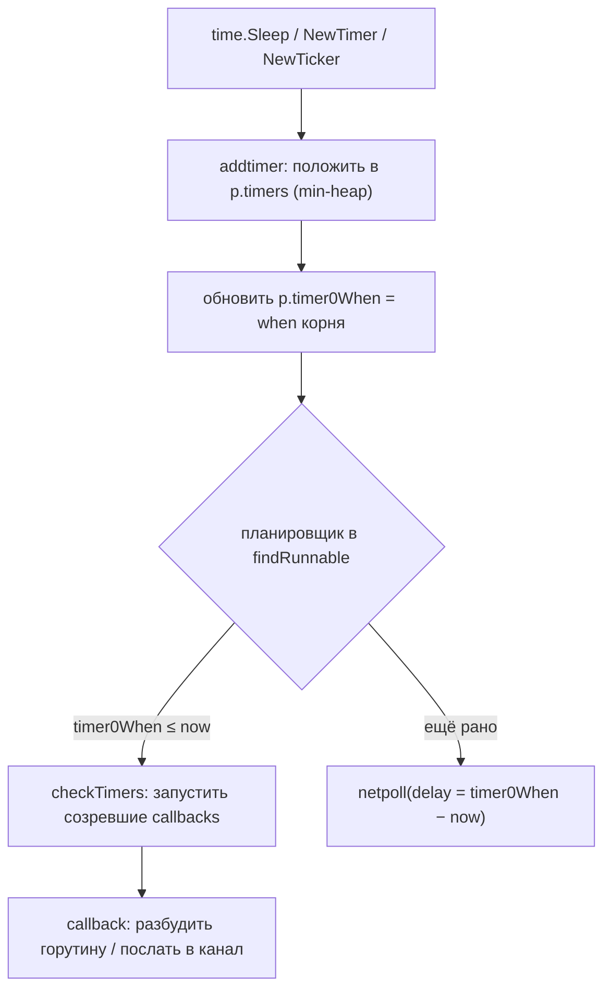

# Timers: time.Sleep, Timer, Ticker

Таймеры — отдельная механика рантайма, тесно связанная с планировщиком и netpoller'ом. Понимание того, что `time.Sleep` не блокирует поток и не делает syscall на каждый сон, объясняет, почему Go держит миллионы «спящих» горутин дёшево.

## Содержание

- [Что делает time.Sleep](#что-делает-timesleep)
- [Где живут таймеры: per-P heap](#где-живут-таймеры-per-p-heap)
- [Кто запускает истёкшие таймеры](#кто-запускает-истёкшие-таймеры)
- [Syscall ли это и что с M](#syscall-ли-это-и-что-с-m)
- [runtime.timer: структура](#runtimetimer-структура)
- [Timer / Ticker / After / AfterFunc](#timer--ticker--after--afterfunc)
- [Ловушки и утечки](#ловушки-и-утечки)
- [История: timerproc до 1.14](#история-timerproc-до-114)
- [Interview-ready answer](#interview-ready-answer)

---

## Что делает time.Sleep

`time.Sleep` не крутит busy-loop и не занимает поток ОС:

```
1. горутина регистрирует таймер (addtimer) и ПАРКУЕТСЯ:
   gopark → состояние Gwaiting, waitReason "sleep" (виден как [sleep] в дампах)
2. M освобождается и берёт другую горутину — поток НЕ висит на сне
3. таймер «созрел» → его callback (goroutineReady) переводит горутину в Grunnable
4. горутина попадает в очередь и продолжает выполнение после Sleep
```

Стоимость сна ≈ одна запись в куче таймеров + припаркованная горутина (~2 KB стека). **Никакого `nanosleep` на каждую горутину** — иначе миллион спящих горутин потребовал бы миллион потоков или syscall'ов.

---

## Где живут таймеры: per-P heap

Начиная с **Go 1.14**, таймеры интегрированы в планировщик и хранятся **по одному heap на каждый P**:

```
p struct {
    timers       []*timer  // min-heap по времени срабатывания (when)
    timer0When   atomic.Int64 // when ближайшего таймера (быстрый peek без лока)
    numTimers    atomic.Uint32
    deletedTimers atomic.Uint32
    // …
}
```

- это **min-куча** (binary heap): в корне — таймер с наименьшим `when`;
- `timer0When` кэширует время корня, чтобы планировщик мог **дёшево** (атомарным чтением, без лока) узнать «когда ближайший дедлайн»;
- каждый P обслуживает свои таймеры → меньше contention, лучше локальность.

Таймеры **переезжают вместе с work stealing**: если P засыпает или его забирают, его таймеры могут перейти на другой P (`adoptTimers`), чтобы не «зависли».



---

## Кто запускает истёкшие таймеры

**Отдельной горутины-таймера НЕТ** (с 1.14). Истёкшие таймеры обрабатывает сам планировщик в нескольких точках:

- **`findRunnable`** на каждом обороте вызывает `checkTimers(p)` — прежде чем искать горутину, P отрабатывает свои созревшие таймеры;
- **`netpoll(delay)`**: если P собирается заснуть (работы нет), он засыпает в netpoll с таймаутом, равным времени до ближайшего таймера — и просыпается ровно к сроку;
- **`sysmon`** периодически пингует netpoll как страховку (вдруг все P спят).

> **Важно: netpoll опрашивает только сеть, таймеры он не «обрабатывает».** `netpoll` под капотом — это `epoll_wait` (Linux) / `kevent` (BSD), и он ждёт готовности **сетевых fd**. Но у `epoll_wait` есть аргумент **timeout** — «сколько максимум блокироваться». Go переиспользует именно его: `delay` — это **не таймер внутри netpoll**, а просто таймаут блокировки, равный времени до ближайшего таймера. Поэтому **один** `epoll_wait` убивает двух зайцев: проснуться (а) если пришли сетевые данные, либо (б) когда истёк timeout. Во втором случае netpoll возвращает **пусто**, а уже сам планировщик (`checkTimers`) запускает созревшие таймеры. Сам callback таймера выполняет **планировщик**, а не netpoll — netpoll лишь «будильник», через который P досыпает до ближайшего срока. Подробнее про `delay` — в [03-netpoller](./03-netpoller.md#что-за-delay-в-netpolldelay).

Таким образом, выполнение callback'а таймера — это часть работы планировщика, а не отдельная сущность.

### Где таймеры в чеклисте планировщика

Все эти точки — пункты одного цикла `findRunnable()`, который M проходит сверху вниз на каждом обороте (и сразу после пробуждения). Таймеры падают на **шаг 2**, а блокирующий сон «до срока» — это **шаг 9**:

```
findRunnable() для текущего P:
  1. safepoint / GC
▶ 2. checkTimers(P)          — отработать СОЗРЕВШИЕ таймеры этого P  ← ВОТ ЗДЕСЬ time.Sleep/Timer/Ticker
  3. локальная очередь (LRQ)
  4. раз в 61 тик            — глобальная очередь (анти-голодание)
  5. глобальная очередь (GRQ)
  6. netpoll(0)              — неблокирующая проверка сетевых горутин
  7. work stealing           — украсть у другого P (+ проверить ЕГО таймеры)
  ──────────── если всё пусто: ────────────
  8. отдать P, M → idle-пул
▶ 9. netpoll(delay)          — БЛОКИРУЮЩИЙ epoll_wait, delay = время до ближайшего таймера
                               (поспать ровно до срока, заодно ловя сеть)
 10. stopm()                — futex-сон, если и это не помогло
```

Связка двух подсвеченных шагов: **шаг 9** заставляет M проспать ровно до ближайшего дедлайна (через таймаут `epoll_wait`), а проснувшись, M возвращается в начало цикла, и **шаг 2** (`checkTimers`) запускает созревший таймер → горутина `time.Sleep` становится `Grunnable`. Полный разбор чеклиста — в [01-scheduler-and-preemption](./01-scheduler-and-preemption.md#цикл-поиска-работы-findrunnable).

---

## Syscall ли это и что с M

Частый вопрос на собесе. Ответ: **нет, отдельного syscall на таймер нет, и поток не блокируется**.

- **Проверка «пора ли»** — это сравнение `when` с `runtime.nanotime()`. На Linux `nanotime` читается через **vDSO** — специальную область, отображённую в адресное пространство процесса, — то есть **в user-space, без перехода в OS-ядро**. Это не syscall. На занятой системе таймеры отрабатываются инлайн в `findRunnable` вообще без syscall'ов.
- **Когда работать нечего и все P простаивают** — один M паркуется в `netpoll(delay)`, где `delay = timer0When − now`. Вот этот `epoll_wait` (Linux) / `kevent` (BSD) с таймаутом — **единственный syscall ожидания**, и он один обслуживает **сразу сеть И таймеры**: проснётся либо по готовности I/O, либо к дедлайну ближайшего таймера. После пробуждения M запускает созревшие таймеры.

**Что с M:**

| Сценарий | Что с потоком |
|---|---|
| горутина в `Sleep`, есть другая работа | M **свободен**, исполняет другие горутины |
| все P простаивают | **один** M спит в `netpoll(delay)` (kernel), остальные припаркованы |
| таймер сработал | M просыпается из netpoll, `checkTimers` будит горутину |

> **А что делают остальные M, пока один дежурит в netpoll?** Спят на **futex** в idle-пуле потоков (`sched.midle`), **не держа P** и не потребляя CPU. Роль «дежурного» в `epoll_wait` берёт ровно один M (захват через CAS `sched.lastpoll → 0`) — остальным дублировать блокирующий `epoll_wait` незачем, они уходят в `stopm()` → futex-сон. Сами P при этом отвязаны и лежат в `sched.pidle`. Появилась работа → дежурный (или `wakep` → `futexwakeup` будит idle-M) просыпается, **сначала берёт P**, потом горутину. Потоки не уничтожаются, а копятся припаркованными и переиспользуются — в простое почти все спят на futex.

Итог: **миллион `time.Sleep` = миллион записей в per-P кучах, но 0–1 реально ожидающий поток** (один M в netpoll на ближайший дедлайн), а не миллион потоков и не миллион syscall'ов. В этом всё отличие от наивного «поток на таймер».

---

## runtime.timer: структура

Все высокоуровневые таймеры (`Timer`, `Ticker`, `time.After`, `context` с дедлайном) — обёртки над одним рантайм-типом:

```go
// runtime/time.go (упрощённо)
type timer struct {
    when   int64        // когда сработать (наносекунды, монотонные часы)
    period int64        // > 0 → периодический (Ticker): после срабатывания when += period
    f      func(any, uintptr) // callback при срабатывании
    arg    any          // аргумент callback (напр. канал или *g горутины)
    // … статус (atomic), поля для heap
}
```

- `when` — абсолютное время по **монотонным** часам (не зависит от перевода системного времени);
- `period == 0` → одноразовый таймер (`Timer`); `period > 0` → периодический (`Ticker`), рантайм сам перепланирует;
- `f(arg, …)` — что сделать: разбудить горутину (`Sleep`), послать время в канал (`Timer`/`Ticker`), вызвать функцию (`AfterFunc`).

Управляющие функции рантайма: `addtimer` (добавить), `deltimer` (удалить), `modtimer` (изменить `when` — это и есть `Reset`), `adjusttimers`/`checkTimers` (обслуживание кучи).

---

## Timer / Ticker / After / AfterFunc

| API | Что делает | period |
|---|---|---|
| `time.NewTimer(d)` | один раз пошлёт время в `t.C` через `d` | 0 |
| `time.After(d)` | то же, но возвращает только канал (таймер не остановить) | 0 |
| `time.AfterFunc(d, f)` | через `d` вызовет `f` в **отдельной горутине** | 0 |
| `time.NewTicker(d)` | шлёт время в `t.C` каждые `d` | `d` |
| `time.Tick(d)` | то же, но без возможности остановить | `d` |

```go
// одноразовый — с возможностью отмены
t := time.NewTimer(5 * time.Second)
select {
case <-t.C:
    // сработал
case <-ctx.Done():
    t.Stop() // отменили — освобождаем таймер
}

// периодический — ОБЯЗАТЕЛЬНО Stop
tk := time.NewTicker(time.Second)
defer tk.Stop()
for {
    select {
    case <-tk.C:
        tick()
    case <-ctx.Done():
        return
    }
}
```

---

## Ловушки и утечки

**1. `time.Tick` / `time.After` без остановки — утечка.** Таймер живёт в рантайм-куче, и пока он не сработал/не остановлен, на него есть ссылка — GC его не соберёт.

```go
// ПЛОХО: тикер не остановить никогда → утечка на весь lifetime процесса
for range time.Tick(time.Second) { ... } // нельзя Stop

// ХОРОШО
tk := time.NewTicker(time.Second)
defer tk.Stop()
for range tk.C { ... }
```

**2. `time.After` в цикле `select` создаёт новый таймер на каждой итерации.**

```go
// ПЛОХО на горячем пути: каждый виток — новый таймер в кучу
for {
    select {
    case v := <-in:
        handle(v)
    case <-time.After(time.Second): // НОВЫЙ таймер каждую итерацию
        timeout()
    }
}

// ЛУЧШЕ: один переиспользуемый Timer + Reset

// --- Go 1.23+ (рекомендуется): без ручного осушения ---
t := time.NewTimer(time.Second)
defer t.Stop()
for {
    select {
    case v := <-in:
        handle(v)
        t.Reset(time.Second)   // 1.23+ гарантирует: стейл-значения не будет
    case <-t.C:
        timeout()
        t.Reset(time.Second)
    }
}

// --- Go ≤ 1.22 (старый идиом с осушением канала) ---
t := time.NewTimer(time.Second)
defer t.Stop()
for {
    select {
    case v := <-in:
        handle(v)
        if !t.Stop() { <-t.C } // осушить буфер, ЕСЛИ таймер уже сработал и значение не прочитано
        t.Reset(time.Second)
    case <-t.C:
        timeout()
        t.Reset(time.Second)
    }
}
```

> **Зачем осушение `if !t.Stop() { <-t.C }` (до 1.23).** До Go 1.23 канал `t.C` **буферизован (cap 1)**: сработавший таймер кладёт туда значение. `Stop()` вернёт `false`, если таймер **уже сработал** — тогда в буфере лежит непрочитанное «старое» срабатывание, и его надо забрать (`<-t.C`), иначе следующий `Reset` + чтение поймают этот устаревший тик.
>
> **Ловушка:** `<-t.C` в этом идиоме **заблокируется**, если значение из канала **уже вычитано** (несколько читателей `t.C`, или ты прочитал его раньше в этой же итерации). В примере выше это безопасно — одна горутина, ветки `select` взаимоисключающие, так что непрочитанный тик максимум один. Но как общий приём идиом корректен только при «я единственный читатель и ещё не читал».
>
> **Go 1.23+:** каналы таймеров сделали **небуферизованными**, и после `Stop`/`Reset` гарантированно **не придёт старое значение**. Осушать стало нечего — идиом `if !t.Stop() { <-t.C }` **не нужен и может сам зависнуть** (значения в канале нет → `<-t.C` блокируется). Просто вызывай `Reset` (или `Stop` + `Reset`). Плюс с 1.23 GC собирает неостановленные таймеры, так что забытый `Stop` уже не «течёт» так, как раньше (но `defer Stop()` для тикеров — по-прежнему хороший тон).

**3. `AfterFunc` запускает `f` в новой горутине** — если `f` обращается к разделяемому состоянию, нужна синхронизация.

---

## История: timerproc до 1.14

То, что многие помнят по старым статьям:

- **до Go 1.10**: одна глобальная куча таймеров + **одна выделенная горутина `timerproc`**, которая спала до ближайшего дедлайна и будила таймеры. Один лок на всё → узкое место под нагрузкой (много `Sleep`/таймеров со всех горутин толкались на одном мьютексе).
- **Go 1.10–1.13**: глобальную кучу пошардили на **64 корзины** (по `P mod 64`) со своими локами — снизили contention, но всё ещё отдельные структуры.
- **Go 1.14**: таймеры **встроили в per-P планировщик** (`p.timers`), убрали `timerproc` совсем. Обработка слилась с `findRunnable`/`netpoll`. Результат: нет лишней горутины, нет глобального лока, лучше локальность, таймеры едут с work stealing.

Поэтому «есть отдельная горутина для таймеров» — **верно только для Go < 1.14**.

---

## Interview-ready answer

**1. «`time.Sleep` — это syscall? что происходит с потоком (M)?»**
Нет. Горутина регистрирует таймер и паркуется (`Gwaiting`, reason `sleep`), а M освобождается и берёт другие горутины — поток не висит. Таймер лежит в per-P min-куче. Проверка «пора ли» — `nanotime` через vDSO (не syscall). Единственный syscall ожидания возникает, только когда всё простаивает: один M спит в `netpoll(delay)`. Поэтому миллион спящих горутин — миллион записей в кучах, но 0–1 ожидающий поток.

**2. «Есть ли отдельная горутина для таймеров?»**
С Go 1.14 — нет. Истёкшие таймеры запускает сам планировщик: на каждом обороте `findRunnable` зовёт `checkTimers(p)`. Отдельная горутина `timerproc` была до 1.14 (глобальная, позже шардированная куча) и была узким местом — её убрали, перенеся таймеры в per-P heaps (едут даже с work stealing).

**3. «Таймеры работают через netpoll? netpoll же про сеть.»**
netpoll и правда опрашивает только **сетевые** fd. Но `netpoll(delay)` — это `epoll_wait` с **аргументом-таймаутом**, и Go ставит этот таймаут = время до ближайшего таймера. Так **один** `epoll_wait` будит M либо по сетевому событию, либо к сроку таймера. Сам callback таймера выполняет потом планировщик (`checkTimers`), а не netpoll — netpoll лишь «будильник».

**4. «Когда всё простаивает — что с потоками?»**
**Один** M — «дежурный»: спит в `netpoll(delay)` (`epoll_wait`, в OS-ядре). **Остальные** M спят на **futex** в idle-пуле (`sched.midle`), не держа P. P отвязаны и лежат в `sched.pidle`. Появилась работа → дежурный или разбуженный `futexwakeup` idle-M **сначала берёт P**, потом горутину.

**5. «Чем `time.After` опасен в цикле?»**
Каждая итерация `select` с `time.After` создаёт **новый** таймер в куче — на горячем пути лишний мусор. Лучше один `time.NewTimer` + `Reset`. А `time.Tick` без `Stop` — утечка; для периодики `NewTicker` + `defer Stop()`.

**6. «Что вернёт `Timer.Stop()` и зачем `if !t.Stop() { <-t.C }`?»**
`Stop()` → `false`, если таймер **уже сработал**. До Go 1.23 канал буферизован (cap 1), поэтому после `Stop()==false` в нём может лежать «старый» тик — его осушают `<-t.C` перед `Reset`. Ловушка: `<-t.C` **зависнет**, если значение уже вычитано. **В Go 1.23+** каналы небуферизованные, стейл-значений после `Stop`/`Reset` нет — идиом осушения **не нужен и может сам зависнуть**, просто вызывай `Reset`.

## Подборка

- [runtime/time.go (source)](https://github.com/golang/go/blob/master/src/runtime/time.go)
- [Go 1.14 release notes — runtime timers](https://go.dev/doc/go1.14#runtime)
- [pkg time](https://pkg.go.dev/time)
