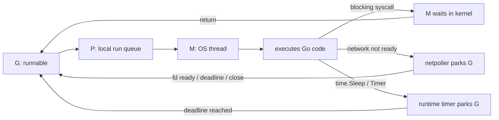

# Runtime Scheduler

Раздел объясняет, как Go runtime исполняет множество goroutines поверх меньшего числа OS threads и что происходит, когда goroutine ждёт syscall, network I/O или timer.

Описание ориентировано на Go 1.25. Детали `runtime` — implementation details, а не часть language specification: названия функций, очереди и эвристики могут меняться между версиями.

## Материалы

1. [Scheduler и preemption](./01-scheduler-and-preemption.md) — mental model G/M/P, run queues, work stealing, preemption, `sysmon`, `GOMAXPROCS`.
2. [Syscall](./02-syscall.md) — почему blocking syscall удерживает OS thread, как runtime передаёт P и откуда берётся thread exhaustion.
3. [Netpoller](./03-netpoller.md) — как network I/O паркует goroutine без отдельного blocked thread на каждое соединение.
4. [Timers](./04-timers.md) — почему `time.Sleep` не блокирует M, где хранятся timers и что изменилось в Go 1.23.
5. 🧪 [schedtrace demo](./examples/schedtrace/) — наблюдаем `GOMAXPROCS`, run queues, waiting goroutines и async preemption.

## Одна схема на весь раздел

Ключевая разница:

| Ожидание | Что ждёт | Что происходит с P |
| --- | --- | --- |
| regular blocking syscall / cgo | OS thread M | P может перейти к другому M |
| network I/O через netpoller | только goroutine G | M и P исполняют другую работу |
| timer / `time.Sleep` | goroutine G | M и P исполняют другую работу |

## Что нужно уметь объяснить на интервью

- зачем в модели нужен P, если код физически исполняет M;
- почему `GOMAXPROCS` ограничивает parallel Go execution, но не число threads;
- как local queues и work stealing уменьшают contention;
- почему долгий blocking syscall может увеличить число M;
- почему тысячи network connections не требуют тысячи blocked threads;
- чем readiness notification отличается от готового application message;
- почему `time.Sleep` паркует G, а не M;
- как preemption не даёт CPU-bound goroutine монополизировать P;
- как `schedtrace`, goroutine dump и execution trace помогают диагностике.

## Практические эксперименты

| Что проверить | Где |
| --- | --- |
| concurrency без FIFO и async preemption | [scheduler examples](./01-scheduler-and-preemption.md#run-queues-и-work-stealing) |
| bounded file I/O и рост OS threads | [syscall examples](./02-syscall.md#почему-context-не-всегда-отменяет-syscall) |
| TCP framing, deadlines и backpressure | [netpoller examples](./03-netpoller.md#readiness-не-равно-сообщению) |
| Reset, debounce и dropped ticker events | [timer examples](./04-timers.md#что-изменилось-в-go-123) |
| live scheduler queues и execution trace | [schedtrace playground](./examples/schedtrace/) |

Расширенные листинги спрятаны под `
`, чтобы теория читалась последовательно, а experiments оставались рядом с объясняемым механизмом.

## Официальные источники

- [runtime package](https://pkg.go.dev/runtime)
- [runtime scheduler source](https://go.dev/src/runtime/proc.go)
- [runtime netpoll source](https://go.dev/src/runtime/netpoll.go)
- [runtime timers source](https://go.dev/src/runtime/time.go)
- [Go 1.25: container-aware GOMAXPROCS](https://go.dev/doc/go1.25#container-aware-gomaxprocs)
