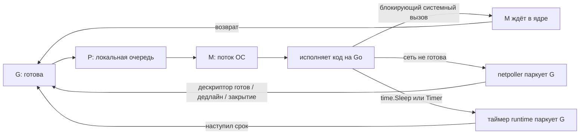

# Runtime Scheduler

Раздел объясняет, как runtime Go исполняет множество goroutines поверх меньшего числа потоков операционной системы и что происходит, когда goroutine ждёт системный вызов, сетевой ввод-вывод или таймер.

Описание ориентировано на Go 1.26. Детали `runtime` — реализация, а не часть спецификации языка: названия функций, очереди и эвристики могут меняться между версиями.

---

## Материалы

1. [Scheduler и preemption](./01-scheduler-and-preemption.md) — ментальная модель G/M/P, очереди готовых goroutines, work stealing, вытеснение, `sysmon`, `GOMAXPROCS`.
2. [Syscall](./02-syscall.md) — почему блокирующий системный вызов удерживает поток, как runtime передаёт P и откуда берётся исчерпание потоков.
3. [Netpoller](./03-netpoller.md) — как сетевой ввод-вывод паркует goroutine без отдельного заблокированного потока на каждое соединение.
4. [Timers](./04-timers.md) — почему `time.Sleep` не блокирует M, где хранятся таймеры и что изменилось в Go 1.23.
5. 🧪 [schedtrace demo](./examples/schedtrace/) — наблюдаем `GOMAXPROCS`, очереди, ждущие goroutines и асинхронное вытеснение.

---

## Одна схема на весь раздел

Ключевая разница:

| Ожидание | Что ждёт | Что происходит с P |
| --- | --- | --- |
| обычный блокирующий системный вызов или cgo | поток M | P зарезервирован за M, а после перехвата уходит другому M |
| сетевой ввод-вывод через netpoller | только goroutine | M и P сразу исполняют другую работу |
| таймер или `time.Sleep` | только goroutine | M и P сразу исполняют другую работу |

---

## Что нужно уметь объяснить на интервью

- зачем в модели нужен P, если код физически исполняет M;
- почему `GOMAXPROCS` ограничивает параллельное исполнение кода на Go, но не число потоков;
- как локальные очереди и work stealing уменьшают конкуренцию за блокировку;
- почему долгий блокирующий системный вызов может увеличить число потоков;
- почему тысячи сетевых соединений не требуют тысячи заблокированных потоков;
- почему ядро не будит goroutine само и в какой момент runtime забирает готовые события из поллера;
- чем уведомление о готовности отличается от готового сообщения приложения;
- почему `time.Sleep` паркует goroutine, а не поток;
- как вытеснение не даёт goroutine с тяжёлыми вычислениями монополизировать P;
- как `schedtrace`, дамп goroutines и трассировка исполнения помогают диагностике.

---

## Практические эксперименты

| Что проверить | Где |
| --- | --- |
| конкурентность без FIFO и асинхронное вытеснение | [scheduler examples](./01-scheduler-and-preemption.md) |
| ограниченный файловый ввод-вывод и рост числа потоков | [syscall examples](./02-syscall.md) |
| разбиение на кадры в TCP, дедлайны и backpressure | [netpoller examples](./03-netpoller.md) |
| Reset, debounce и пропущенные события тикера | [timer examples](./04-timers.md) |
| очереди планировщика вживую и трассировка исполнения | [schedtrace playground](./examples/schedtrace/) |

Расширенные листинги спрятаны под `
`, чтобы теория читалась последовательно, а эксперименты оставались рядом с объясняемым механизмом.

---

## Официальные источники

- [runtime package](https://pkg.go.dev/runtime)
- [runtime scheduler source](https://go.dev/src/runtime/proc.go)
- [runtime netpoll source](https://go.dev/src/runtime/netpoll.go)
- [runtime timers source](https://go.dev/src/runtime/time.go)
- [Go 1.25: container-aware GOMAXPROCS](https://go.dev/doc/go1.25#container-aware-gomaxprocs)
