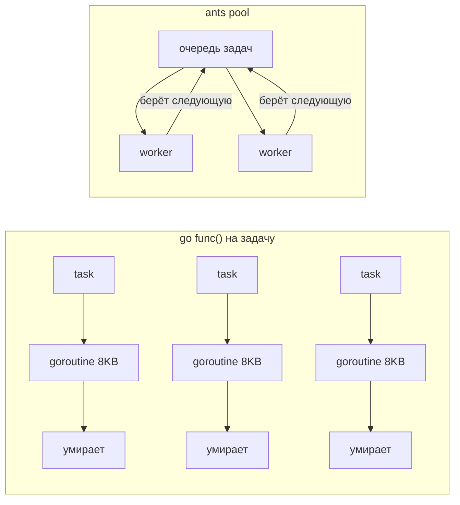

# panjf2000/ants

`github.com/panjf2000/ants/v2` — высокопроизводительный пул горутин с **фиксированной ёмкостью** и **переиспользованием горутин**. Цель — обрабатывать миллионы коротких задач, не создавая миллион горутин: пул держит ограниченный набор воркеров и переиспользует их, экономя память и нагрузку на планировщик.

Требует Go 1.19+ (generic-варианты — 1.18+). Лицензия MIT.

## Содержание

- [Зачем](#зачем)
- [Базовый пул](#базовый-пул)
- [Пул под конкретную функцию](#пул-под-конкретную-функцию)
- [Опции](#опции)
- [Управление пулом](#управление-пулом)
- [Дефолтный пул и MultiPool](#дефолтный-пул-и-multipool)
- [Почему это экономит память (механика)](#почему-это-экономит-память-механика)
- [Типичные ошибки](#типичные-ошибки)
- [Когда использовать](#когда-использовать)
- [ants vs pond vs «просто горутины»](#ants-vs-pond-vs-просто-горутины)
- [Interview-ready answer](#interview-ready-answer)

## Зачем

Идиоматичный Go говорит «просто запусти горутину». Это отлично работает до определённого масштаба, но у `go func()` есть цена:

- каждая горутина — стек минимум **8 KB** (растёт по мере надобности); миллион горутин = гигабайты только под стеки;
- много живых горутин нагружают планировщик и GC (стеки сканируются при сборке мусора);
- нет естественного ограничителя — взрыв числа горутин под пиком приводит к OOM.

```go
// Наивно: горутина на задачу. На миллионах коротких задач — взрыв памяти.
for i := 0; i < 1_000_000; i++ {
    go process(i) // 1M стеков × ~8KB ≈ несколько GB
}

// С ants: фиксированный пул из N воркеров, горутины переиспользуются.
pool, _ := ants.NewPool(10_000)
defer pool.Release()
for i := 0; i < 1_000_000; i++ {
    pool.Submit(func() { process(i) })
}
```

Суть `ants` — **«amortize» создание горутин**: вместо «создать → отработать → умереть» воркер живёт и берёт следующую задачу. На потоке коротких задач это убирает аллокации стеков и снижает нагрузку на планировщик; авторы заявляют меньшее потребление памяти и иногда более высокий throughput, чем у неограниченных горутин.

## Базовый пул

```go
import "github.com/panjf2000/ants/v2"

// Ёмкость = 10000: одновременно не более 10000 активных воркеров.
pool, err := ants.NewPool(10_000)
if err != nil {
    log.Fatal(err)
}
defer pool.Release() // graceful shutdown — освобождает воркеров

// Submit ставит задачу; по умолчанию блокирует, если все воркеры заняты
// и достигнут лимит блокирующих задач (см. WithMaxBlockingTasks).
err = pool.Submit(func() {
    process(item)
})
```

## Пул под конкретную функцию

```go
// NewPoolWithFunc — воркеры заранее «привязаны» к одной функции.
// Invoke передаёт только аргумент. Экономит аллокацию замыкания на каждую задачу.
pool, _ := ants.NewPoolWithFunc(1000, func(arg interface{}) {
    n := arg.(int)
    process(n)
})
defer pool.Release()

pool.Invoke(42)

// Generic-вариант без interface{} и приведения типов (Go 1.18+):
pool, _ := ants.NewPoolWithFuncGeneric(1000, func(n int) {
    process(n)
})
pool.Invoke(42)
```

`NewPoolWithFunc` — оптимизация для горячего пути: когда все задачи прогоняют одну и ту же функцию (например, обработка элементов очереди), не аллоцируется новое замыкание на каждый `Submit`.

## Опции

```go
pool, _ := ants.NewPool(100_000,
    // Pre-malloc всей ёмкости сразу. Имеет смысл для огромных пулов
    // с долгоживущими задачами; для коротких задач обычно НЕ нужно
    // (зря держит память).
    ants.WithPreAlloc(true),

    // Ограничить число задач, ждущих свободного воркера. При превышении
    // Submit вернёт ErrPoolOverload (backpressure вместо роста очереди).
    ants.WithMaxBlockingTasks(1000),

    // Non-blocking: если воркеров нет — Submit сразу вернёт ErrPoolOverload,
    // не блокируя producer'а.
    ants.WithNonblocking(true),

    // Простаивающие воркеры старше этого срока вычищаются (по умолчанию ~1s).
    ants.WithExpiryDuration(10*time.Second),

    // Recover паники в задаче, чтобы воркер не умер и пул не деградировал.
    ants.WithPanicHandler(func(p interface{}) {
        log.Printf("recovered: %v", p)
    }),
)
```

`WithMaxBlockingTasks` + `WithNonblocking` — два рычага backpressure. Без них при заполнении пула `Submit` блокирует producer'а бесконечно.

## Управление пулом

```go
pool.Running()  // активных воркеров сейчас
pool.Free()     // свободных слотов (Cap - Running); <0 если есть блокирующие
pool.Cap()      // ёмкость пула
pool.Waiting()  // задач, ждущих воркера

// Динамически менять ёмкость на лету (goroutine-safe).
pool.Tune(20_000) // увеличить
pool.Tune(5_000)  // уменьшить

pool.Release()         // graceful shutdown
pool.ReleaseTimeout(5*time.Second) // с таймаутом ожидания
pool.Reboot()          // перезапустить освобождённый пул
```

`Tune` меняет лимит параллелизма без пересоздания пула — полезно для адаптивной нагрузки.

## Дефолтный пул и MultiPool

```go
// Глобальный пул с ёмкостью math.MaxInt32 — для разовых задач без своего пула.
ants.Submit(func() { work() })
defer ants.Release()

// MultiPool — несколько пулов с балансировкой (round-robin / least-tasks),
// снижает contention на одной общей блокировке при экстремальной нагрузке.
mp, _ := ants.NewMultiPool(10, 10_000, ants.LeastTasks)
mp.Submit(func() { work() })
defer mp.ReleaseTimeout(5 * time.Second)
```

## Почему это экономит память (механика)



В наивной модели на каждую задачу аллоцируется стек, который после завершения собирает GC. В `ants` воркер после задачи **паркуется и ждёт следующую** (через `sync.Cond` / канал), стек переиспользуется. На потоке из миллионов коротких задач это убирает основную часть аллокаций и работы GC.

## Типичные ошибки

```go
// 1. Забыть Release() → воркеры и фоновая чистка живут до конца процесса (утечка).
pool, _ := ants.NewPool(1000)
// defer pool.Release()  ← забыли

// 2. WithPreAlloc(true) для коротких задач → держит всю ёмкость в памяти зря.
//    PreAlloc оправдан для огромных пулов с долгоживущими воркерами.

// 3. Игнорировать err от Submit при Nonblocking/MaxBlockingTasks.
//    При перегрузе вернётся ErrPoolOverload — это нормальный сигнал backpressure,
//    его надо обработать (ретрай/деградация), а не молча терять задачу.
if err := pool.Submit(task); errors.Is(err, ants.ErrPoolOverload) {
    // пул перегружен
}

// 4. Нет WithPanicHandler → паника в задаче всплывает и роняет воркер.
//    ants по умолчанию НЕ глотает панику (в отличие от pond).
```

## Когда использовать

- **миллионы коротких задач**, где число горутин нужно жёстко ограничить (краулеры, обработка событий, batch-конвейеры)
- горячий путь с **одной функцией** на все задачи → `NewPoolWithFunc` (экономия аллокаций замыканий)
- нужен максимальный **throughput и минимум памяти** под пиковой нагрузкой
- нужен динамический `Tune` ёмкости

**Не использовать:**
- когда задач немного или они долгоживущие — выигрыш от переиспользования горутин не окупает сложность; идиоматичные `go func()` + `errgroup` проще
- когда нужен типизированный сбор результатов — у `ants` его нет из коробки, удобнее [alitto/pond](./05-alitto-pond.md) (`ResultPool[T]`)

## ants vs pond vs «просто горутины»

| | `panjf2000/ants` | `alitto/pond` | `go func()` + `errgroup` |
|---|---|---|---|
| Модель | фиксированный пул, переиспользование горутин | динамический лимит параллелизма | горутина на задачу |
| Главный плюс | throughput, экономия памяти на масштабе | результаты + backpressure + метрики | простота, идиоматичность |
| Результаты | руками | `ResultPool[T]` | руками |
| Panic recovery | `WithPanicHandler` (по умолчанию НЕТ) | по умолчанию есть | паника всплывает |
| Когда брать | миллионы коротких задач | удобный пул с результатами | обычный fan-out |

## Interview-ready answer

**1. Какую проблему решает `ants`?**

- Проблему «горутина на задачу» на масштабе. Наивный `go func()` на миллионах коротких задач аллоцирует миллионы стеков (минимум ~8 KB каждый → гигабайты), нагружает планировщик и GC (стеки сканируются при сборке мусора) и не имеет ограничителя — под пиком взрыв горутин ведёт к OOM. `ants` держит фиксированный набор воркеров.

**2. За счёт чего экономится память?**

- Переиспользование горутин: воркер после задачи не умирает, а **паркуется и берёт следующую** — стек переиспользуется. Это убирает основную часть аллокаций стеков и работы GC на потоке коротких задач. Авторы заявляют меньшее потребление памяти и иногда более высокий throughput, чем у неограниченных горутин.

**3. Что такое `NewPoolWithFunc` и зачем он?**

- Пул, где все воркеры заранее привязаны к одной функции; `Invoke(arg)` передаёт только аргумент. Экономит аллокацию замыкания на каждую задачу — оптимизация для горячего пути, где все задачи прогоняют одну и ту же функцию. Есть generic-вариант `NewPoolWithFuncGeneric` без `interface{}`.

**4. Как устроен backpressure?**

- `WithMaxBlockingTasks(n)` ограничивает число ждущих задач, `WithNonblocking(true)` отключает блокировку. При перегрузе `Submit` возвращает `ErrPoolOverload` — это нормальный сигнал backpressure, его нужно обработать (ретрай/деградация), а не терять задачу молча. Без этих опций `Submit` блокирует producer'а.

**5. Что с паникой?**

- По умолчанию паника **НЕ** ловится и роняет воркер (в отличие от `pond`). Нужен `WithPanicHandler(fn)`, чтобы изолировать падение задачи и не деградировать пул.

**6. Когда `ants`, а когда нет?**

- Брать ради throughput и экономии памяти на миллионах коротких задач (краулеры, обработка событий, batch). Не брать, когда задач немного или они долгоживущие — выигрыш не окупает сложность, проще `go func()` + `errgroup`. Нужен типизированный сбор результатов и метрики — удобнее [alitto/pond](./05-alitto-pond.md). Главные грабли — забыть `Release()` (утечка воркеров и фоновой чистки) и игнорировать `ErrPoolOverload`.
