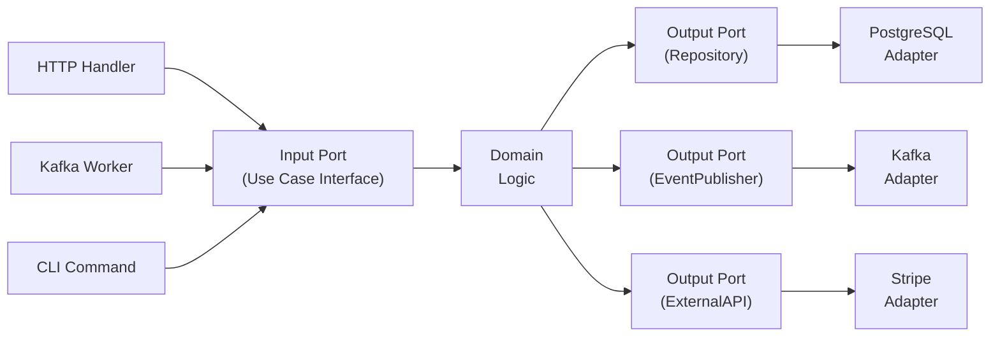
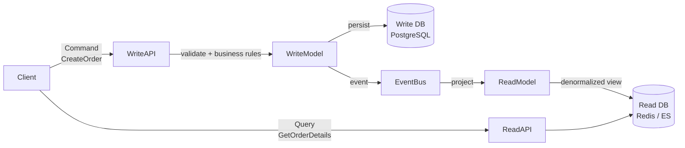
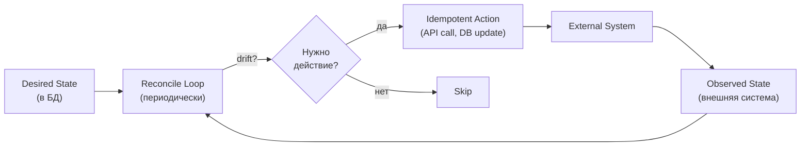

# Architecture Patterns

Архитектурный паттерн отвечает не на вопрос "как назвать папки", а на вопрос "как система будет меняться, тестироваться, масштабироваться и переживать отказы".

## Содержание

- [Обзор и когда применять](#обзор-и-когда-применять)
- [Layered architecture](#layered-architecture)
- [Hexagonal architecture](#hexagonal-architecture)
- [Clean architecture](#clean-architecture)
- [DDD lite](#ddd-lite)
- [Modular monolith](#modular-monolith)
- [CQRS](#cqrs)
- [Outbox](#outbox)
- [Saga / process manager](#saga--process-manager)
- [Idempotency](#idempotency)
- [Level-triggered reconciliation](#level-triggered-reconciliation)
- [Anti-corruption layer](#anti-corruption-layer)
- [Strangler fig](#strangler-fig)
- [Decision guide](#decision-guide)
- [Typical mistakes](#typical-mistakes)
- [Interview-ready answer](#interview-ready-answer)

---

## Обзор и когда применять

| Паттерн | Проблема | Цена |
|---|---|---|
| Layered | Бизнес-логика смешалась с HTTP/DB | Минимальная — просто слои |
| Hexagonal | Внешние framework'и проникают в домен | Больше интерфейсов |
| Clean | Строгие границы зависимостей | Больше файлов и слоёв |
| DDD lite | Сложная предметная область, много правил | Время на моделирование |
| CQRS | Read и write требуют разных моделей | Eventual consistency, 2 модели |
| Outbox | Надёжный publish event после DB commit | Publisher процесс, cleanup |
| Saga | Длинный процесс через несколько сервисов | Compensation logic, state machine |
| Idempotency | Дублирующиеся запросы создают side effects | Хранение ключей, TTL |
| Reconciliation | Состояние может разъехаться при сбоях | Eventual consistency, loop |
| ACL | Чужая модель протекает в домен | Mapping слой |
| Strangler fig | Нельзя переписать legacy сразу | Временно 2 системы |

---

## Layered architecture

Разделить код на слои с однонаправленными зависимостями.

```
┌───────────────────────────────┐
│  Transport (HTTP/gRPC/CLI)    │  ← protocol mapping, validation
├───────────────────────────────┤
│  Service / Use Case           │  ← бизнес-логика, orchestration
├───────────────────────────────┤
│  Repository / Client          │  ← storage, external APIs
├───────────────────────────────┤
│  Database / Message Broker    │
└───────────────────────────────┘

Зависимости: только вниз. Transport не знает о DB.
```

**Правила слоёв:**

| Слой | Отвечает за | Не должен |
|---|---|---|
| Transport | Decode request, encode response, validation | Содержать бизнес-правила |
| Service | Бизнес-решение, orchestration | Знать HTTP коды или SQL |
| Repository | SQL/Redis/API запросы | Знать о бизнес-правилах |

**Где использовать:** большинство CRUD/backend-сервисов, небольшие сервисы, команды которым нужна предсказуемая структура.

**Слабое место:** без дисциплины business logic утекает в handlers или repositories.

---

## Hexagonal architecture

Бизнес-ядро не зависит от транспорта, базы и внешних SDK. Внешний мир подключается через ports/adapters.



**Ports vs Adapters:**

| | Port | Adapter |
|---|---|---|
| Что это | Интерфейс (Go interface) | Реализация интерфейса |
| Где живёт | В пакете domain/core | В пакете infrastructure |
| Пример | `OrderRepository` | `PostgresOrderRepository` |
| Тип | Input port (UseCase) или Output port | Driven (DB) или Driving (HTTP) |

**Где использовать:** есть важная domain logic, несколько входов в один use case, внешние providers могут меняться.

**Когда не выбирать:** простой CRUD, MVP, нет боли от coupling.

---

## Clean architecture

Похожа на Hexagonal, но сильнее акцентирует направление зависимостей: внутренние слои не знают о внешних.

```
          ┌──────────────────────────────────┐
          │         Frameworks & Drivers      │  ← HTTP, DB drivers, CLI
          │  ┌────────────────────────────┐   │
          │  │  Interface Adapters        │   │  ← Controllers, Presenters, Gateways
          │  │  ┌──────────────────────┐  │   │
          │  │  │  Application Rules   │  │   │  ← Use Cases
          │  │  │  ┌────────────────┐  │  │   │
          │  │  │  │ Enterprise     │  │  │   │  ← Entities, Domain
          │  │  │  │ Business Rules │  │  │   │
          │  │  │  └────────────────┘  │  │   │
          │  │  └──────────────────────┘  │   │
          │  └────────────────────────────┘   │
          └──────────────────────────────────┘

Зависимости: только внутрь. Внешний слой знает о внутреннем, не наоборот.
```

**Практичная Go-структура:**

```
internal/
  domain/          ← модели, интерфейсы, domain errors (ни от кого не зависит)
  usecase/         ← сценарии (зависит только от domain)
  transport/
    http/          ← handlers (зависит от usecase)
    grpc/
  storage/
    postgres/      ← реализации repo (зависит от domain)
  clients/
    stripe/        ← внешние API адаптеры
```

**Trade-off:** чем меньше доменной сложности, тем меньше пользы от строгих границ.

---

## DDD lite

Использовать DDD-идеи без тяжёлого enterprise-ритуала.

**Что обычно полезно:**

| Концепция | Когда использовать |
|---|---|
| Ubiquitous language | Всегда — имена типов и методов из предметной области |
| Aggregate boundaries | Есть invariants, которые нужно защищать |
| Domain events | Важные факты бизнеса (OrderPlaced, PaymentFailed) |
| Bounded contexts | Разные команды/сервисы используют разные понятия |
| Value objects | Когда тождество по значению, а не по id |

**Что часто лишнее:**

| Концепция | Когда избыточно |
|---|---|
| Фабрики для каждой мелочи | Простое создание без invariants |
| Repository на каждую таблицу | Нет domain-причины изолировать |
| Богатые иерархии агрегатов | CRUD без реальных бизнес-правил |

---

## Modular monolith

Один deployable artifact, но код разделён на модули с контролируемыми границами.

```
┌─────────────────────────────────────────────────────┐
│                   Monolith Process                   │
│                                                     │
│  ┌─────────────┐  ┌─────────────┐  ┌─────────────┐  │
│  │   Orders    │  │  Payments   │  │    Users    │  │
│  │   Module    │  │   Module    │  │   Module    │  │
│  │             │  │             │  │             │  │
│  │ - service   │  │ - service   │  │ - service   │  │
│  │ - repo      │  │ - repo      │  │ - repo      │  │
│  │ - models    │  │ - models    │  │ - models    │  │
│  └──────┬──────┘  └──────┬──────┘  └──────┬──────┘  │
│         │                │                │         │
│  ┌──────▼────────────────▼────────────────▼──────┐  │
│  │              Shared Infrastructure             │  │
│  │         (DB pool, logger, metrics)             │  │
│  └───────────────────────────────────────────────┘  │
└─────────────────────────────────────────────────────┘
```

**Правила модульных границ:**
- Модуль А не импортирует внутренние пакеты модуля Б — только публичный API
- Взаимодействие через Go interfaces, не прямые зависимости на struct
- Shared schema отдельно от модульных таблиц

**Признак зрелости модуля:** его можно удалить, заменить или выделить в сервис с понятным списком зависимостей.

---

## CQRS

Разделить write model (команды) и read model (запросы).



**CQRS vs Simple layered:**

| | Simple layered | CQRS |
|---|---|---|
| Модели | Одна | Write model + Read model |
| Consistency | Strong | Eventual (read lag) |
| Read queries | Из write DB | Из denormalized read DB |
| Сложность | Низкая | Высокая |
| Когда | CRUD, стандартный доступ | Сложные read projections, разные access patterns |

**Когда не выбирать:** обычный CRUD, данные должны быть видны сразу после записи, команда не готова поддерживать две модели.

---

## Outbox

Атомарно сохранить изменение и событие в одной DB transaction, отдельный publisher доставляет в broker.

```
Сервис A
  │
  │  BEGIN TRANSACTION
  ├─── UPDATE orders SET status='completed'
  ├─── INSERT INTO outbox(event='order.completed', payload='{...}')
  │  COMMIT
  │
  ▼
Outbox Publisher (background)
  │
  ├─── SELECT * FROM outbox WHERE published = false LIMIT 100
  ├─── Publish to Kafka
  └─── UPDATE outbox SET published = true

Kafka → Сервис B (consumer)
```

**Почему outbox решает dual-write:**

```
Без outbox (проблема):               С outbox (решение):
  1. UPDATE DB        ← commit OK      1. UPDATE DB         ┐
  2. Publish Kafka    ← crash!         2. INSERT outbox     ┘ одна транзакция
                                       3. Publisher → Kafka  ← retry safe
  → Событие потеряно                  → At-least-once delivery
```

**Важно:** outbox гарантирует at-least-once, не exactly-once. Consumer должен быть idempotent.

**Операционные требования:**
- Cleanup job для старых записей
- Monitoring lag (сколько неопубликованных записей)
- Retry с backoff для transient broker errors

---

## Saga / process manager

Длинный бизнес-процесс разбивается на шаги, каждый имеет compensating action при failure.

**Choreography saga** (через события):
```
OrderService          PaymentService         InventoryService
      │                     │                      │
      │── OrderCreated ─────►│                      │
      │                     │── PaymentProcessed ──►│
      │                     │                      │── InventoryReserved
      │◄────────────────────────────────────────────│
      │
  При ошибке:
      │                     │◄─── PaymentFailed ───│
      │◄── OrderCancelled ──│
```

**Orchestration saga** (центральный координатор):
```
Saga Orchestrator
  │
  ├── Step 1: charge payment    → success/failure
  ├── Step 2: reserve inventory → success/failure
  ├── Step 3: schedule delivery → success/failure
  │
  При failure на шаге N:
  ├── Compensate Step N-1
  ├── Compensate Step N-2
  └── Compensate Step 1
```

| | Choreography | Orchestration |
|---|---|---|
| Координация | Через события | Центральный orchestrator |
| Наблюдаемость | Сложнее отследить flow | Явный state в одном месте |
| Coupling | Меньше | Больше (все знают orchestrator) |
| Debugging | Сложнее | Проще |
| Когда | Простые 2-3 шага | Сложный многошаговый процесс |

**Компенсация ≠ rollback.** Иногда компенсация — бизнес-действие (вернуть деньги, уведомить пользователя), а не техническая отмена.

---

## Idempotency

Повторный вызов той же операции не создаёт повторный side effect.

```
Клиент                Server                  DB/External
  │                      │                        │
  ├── POST /orders ──────►│                        │
  │   Idempotency-Key: X  │                        │
  │                       ├── check key X ────────►│
  │                       │◄── not found ──────────│
  │                       ├── process order        │
  │                       ├── INSERT + save key X ─►│
  │◄── 200 order_id ──────│                        │
  │                       │                        │
  │   (network error)     │                        │
  ├── POST /orders ──────►│  (retry same key X)    │
  │   Idempotency-Key: X  │                        │
  │                       ├── check key X ────────►│
  │                       │◄── found: cached resp ─│
  │◄── 200 order_id ──────│  (не обрабатывает!)    │
```

**Техники:**

| Техника | Когда |
|---|---|
| Idempotency key в заголовке | HTTP API, payment |
| Unique constraint в БД | Создание ресурсов |
| State machine (допустимые переходы) | Order lifecycle |
| Таблица processed_messages | Message consumers |
| Deterministic ID из данных запроса | Batch operations |

---

## Level-triggered reconciliation

Система хранит desired state, периодически сравнивает с observed state и приводит реальный мир к желаемому.



**Level-triggered vs Edge-triggered:**

| | Edge-triggered | Level-triggered |
|---|---|---|
| Логика | "Произошло событие → выполни действие" | "Есть desired state → приведи к нему" |
| Устойчивость | Потеря события = сломанное состояние | Следующий reconcile исправит |
| Идемпотентность | Требует особой заботы | Встроена в подход |
| Сложность | Проще при надёжной доставке | Нужен reconcile loop |
| Применение | Queue consumer, webhook | K8s controllers, sync jobs |

**Практические правила:**
- Reconcile-функция обязательно идемпотентна
- Сначала читать observed state, потом решать нужно ли действие
- Хранить `status`, `last_error`, `next_retry` — для observability
- Различать transient error (retry) и permanent failure (alert)
- Backoff + jitter для retry, не сразу снова

---

## Anti-corruption layer

Изолировать свой домен от чужой модели данных.

```
Наша система             ACL                 Внешняя система
─────────────────        ──────────────────  ─────────────────
Order.Status        ←──  StatusMapper    ←── LegacyOrderState
Payment.Currency    ←──  CurrencyMapper  ←── MoneyDTO
Customer            ←──  CustomerMapper  ←── UserRecord (legacy schema)
```

**Где нужен ACL:**
- Интеграция с legacy-системой
- Внешний provider с неудобной моделью
- Два bounded contexts с разными терминами для одного понятия
- Миграция со старой системы на новую

---

## Strangler fig

Постепенно заменять старую систему новой, перехватывая отдельные flows.

```
Phase 1: Only legacy
  Request → Legacy System

Phase 2: Strangler proxy
  Request → Proxy → legacy (most)
                  → new service (feature X)

Phase 3: Legacy replaced
  Request → New System
  (legacy removed)
```

**Ключевые шаги:**
1. Поставить proxy перед legacy
2. Выделять функциональность по маршрутам/событиям/модулям
3. Синхронизировать данные bidirectionally во время переходного периода
4. Удалить legacy когда весь трафик переключён

---

## Decision guide

| Проблема | Паттерн | Главный trade-off |
|---|---|---|
| Бизнес-логика смешалась с HTTP/DB | Layered / Hexagonal | Больше структуры, но чище границы |
| Внешний SDK протек в домен | Adapter / ACL | Mapping code вместо прямого вызова |
| Несколько входов в один use case | Hexagonal | Интерфейсы для каждого порта |
| Надёжно публиковать события | Outbox | Publisher процесс + cleanup |
| Длинный процесс между сервисами | Saga | Compensation logic + state machine |
| Повторы создают дубли | Idempotency | Хранение ключей + состояния |
| Состояние разъезжается при сбоях | Reconciliation | Eventual consistency + loop |
| Разные access patterns read/write | CQRS | Eventual consistency + 2 модели |
| Монолит растёт, микросервисы рано | Modular monolith | Дисциплина модульных границ |
| Legacy нельзя переписать сразу | Strangler fig | Временная двойная система |

---

## Typical mistakes

- **Паттерн по названию, не по проблеме.** "Нам нужен hexagonal" без понимания где боль.
- **Clean architecture для CRUD.** 5 слоёв для `GET /users` — это ceremony, не архитектура.
- **Папка `domain` без domain-логики.** Просто переложить structs — не DDD.
- **Repository = обёртка над таблицей.** `GetAll`, `UpdateById` — это не repository, это DAO.
- **CQRS без разных access patterns.** Eventual consistency за просто так.
- **Saga без state machine и idempotency.** Partial failure → непредсказуемое состояние.
- **Outbox = exactly-once.** Нет, это at-least-once. Consumer должен быть idempotent.
- **Reconciler как event handler.** Не проверять observed state перед side effect.
- **Микросервисы раньше понятых границ.** Потом склеить обратно дороже, чем разделить.

---

## Interview-ready answer

> "Я выбираю паттерн от проблемы. Если сервис простой — layered достаточно. Если есть сложная domain-логика или несколько входных каналов — hexagonal. Если нужно надёжно связать DB update с event publish — outbox. Если процесс распределённый — saga с явным state machine и idempotency.
>
> Два паттерна которые часто недооценивают: level-triggered reconciliation — когда нужна устойчивость к потере событий и partial failures, и strangler fig — когда нельзя переписать legacy сразу.
>
> Ключевой принцип: паттерн должен снижать стоимость изменений и эксплуатации, а не добавлять церемонию ради правильного названия."
