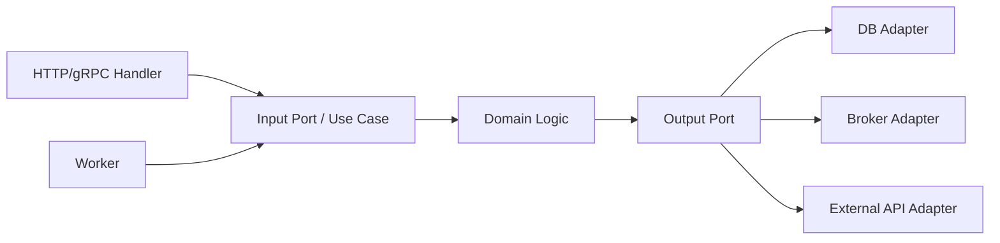
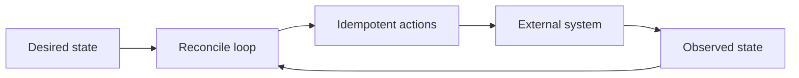

# Architecture Patterns

Архитектурный паттерн отвечает не на вопрос "как назвать папки", а на вопрос "как система будет меняться, тестироваться, масштабироваться и переживать отказы".

## Содержание

- [Layered architecture](#layered-architecture)
- [Hexagonal architecture](#hexagonal-architecture)
- [Clean architecture](#clean-architecture)
- [DDD lite](#ddd-lite)
- [Modular monolith](#modular-monolith)
- [CQRS](#cqrs)
- [Outbox](#outbox)
- [Saga / process manager](#saga--process-manager)
- [Idempotency](#idempotency)
- [Level-triggered reconciliation](#level-triggered-reconciliation)
- [Anti-corruption layer](#anti-corruption-layer)
- [Strangler fig](#strangler-fig)
- [Decision guide](#decision-guide)
- [Typical mistakes](#typical-mistakes)
- [Interview-ready answer](#interview-ready-answer)

## Layered architecture

Идея: разделить код на слои с направлением зависимостей.

Типичный вариант:

```text
transport -> service/usecase -> repository/client -> database/external API
```

Где использовать:
- большинство CRUD/backend-сервисов;
- сервисы с понятной бизнес-логикой;
- команды, которым нужна простая и предсказуемая структура.

Сильные стороны:
- легко объяснить;
- быстро стартовать;
- удобно тестировать service layer;
- хорошо подходит для монолита и небольшого сервиса.

Слабые стороны:
- при плохой дисциплине business logic утекает в handlers или repositories;
- слои могут стать формальными и не нести смысла;
- общие utils/helpers могут превратиться в скрытую связность.

Практичное правило: handler отвечает за protocol mapping, service/usecase - за бизнес-решение, repository/client - за внешний мир.

## Hexagonal architecture

Идея: бизнес-ядро не зависит от транспорта, базы и внешних SDK. Внешний мир подключается через ports/adapters.



Где использовать:
- важная domain logic;
- несколько входов в один use case: HTTP, worker, CLI;
- внешние providers могут меняться;
- нужны хорошие unit tests без инфраструктуры.

Сильные стороны:
- domain logic не зависит от framework;
- удобно тестировать;
- проще менять storage/provider;
- лучше видны system boundaries.

Слабые стороны:
- больше интерфейсов и файлов;
- легко переусложнить простой CRUD;
- команда должна одинаково понимать границы.

Когда не выбирать:
- маленький сервис с тонким CRUD;
- MVP, где домен еще неизвестен;
- нет боли от coupling.

## Clean architecture

Clean architecture близка к hexagonal, но сильнее акцентирует направление зависимостей: внутренняя бизнес-логика не знает о внешних слоях.

Практичная Go-версия обычно выглядит проще, чем схемы из книг:
- `internal/app` или `internal/usecase` - сценарии;
- `internal/domain` - модели и правила;
- `internal/transport/http` - handlers;
- `internal/storage/postgres` - database adapter;
- `internal/clients/...` - внешние API.

Главный trade-off: чистота границ против скорости разработки. Чем меньше доменной сложности, тем меньше пользы от строгой clean architecture.

## DDD lite

Идея: использовать DDD-подходы без тяжелого enterprise-ритуала.

Что обычно полезно:
- language of domain в именах типов и методов;
- aggregate boundaries там, где есть invariants;
- domain events для важных фактов;
- bounded contexts на уровне модулей или сервисов.

Что часто лишнее:
- фабрики и value objects для каждой мелочи;
- сложные иерархии ради "правильного DDD";
- repository на каждую таблицу без доменной причины.

Где использовать:
- продукт с реальной бизнес-логикой;
- много правил и исключений;
- несколько команд обсуждают один домен.

## Modular monolith

Идея: один deployable artifact, но код разделен на модули с контролируемыми границами.

Где использовать:
- продукт уже вырос из простого монолита;
- микросервисы пока слишком дорогие;
- хочется сохранить простой deployment;
- доменные границы уже частично понятны.

Сильные стороны:
- меньше operational complexity, чем у микросервисов;
- проще локальная разработка;
- легче потом выделять сервисы;
- можно ограничивать зависимости между модулями.

Слабые стороны:
- нужна дисциплина импорта;
- база данных часто остается общей;
- без ownership модулей все снова превращается в большой монолит.

Практичный сигнал зрелости: модуль можно удалить, заменить или выделить в сервис с понятным списком зависимостей.

## CQRS

Идея: разделить write model и read model.

Где использовать:
- чтение и запись имеют разные access patterns;
- read side требует денормализации;
- много сложных списков, поисков, агрегатов;
- write model должна защищать invariants.

Сильные стороны:
- read side можно оптимизировать отдельно;
- write side остается чище;
- удобно строить projections.

Слабые стороны:
- eventual consistency;
- больше кода и operational complexity;
- нужно думать о rebuild projections.

Когда не выбирать:
- обычный CRUD;
- данные должны быть строго консистентны сразу после записи;
- команда не готова поддерживать две модели.

## Outbox

Идея: изменение данных и запись сообщения происходят в одной database transaction, а отдельный publisher потом доставляет сообщение в broker.

Где использовать:
- нужно надежно публиковать events после изменения состояния;
- нельзя потерять сообщение между DB commit и broker publish;
- есть интеграция с другими сервисами.

Сильные стороны:
- убирает dual-write проблему;
- retry можно делать безопаснее;
- хорошо работает с idempotent consumers.

Слабые стороны:
- нужен publisher process;
- нужно чистить или архивировать outbox table;
- delivery обычно at-least-once, значит consumers должны быть идемпотентны.

Типичная ошибка: считать outbox exactly-once механизмом. Он снижает риск потери события, но дубликаты все равно возможны.

## Saga / process manager

Идея: длинный бизнес-процесс разбивается на шаги, каждый шаг имеет compensating action или обработку failure state.

Где использовать:
- distributed transaction невозможна или слишком дорогая;
- заказ, платеж, доставка, резервация идут через разные сервисы;
- процесс может длиться секунды, минуты или часы.

Сильные стороны:
- явное управление workflow;
- система переживает частичные отказы;
- проще наблюдать состояние процесса.

Слабые стороны:
- сложнее reasoning;
- компенсация не всегда равна rollback;
- нужны retries, idempotency и state machine discipline.

## Idempotency

Идея: повторный вызов той же операции не создает повторный side effect.

Где использовать:
- payments;
- order creation;
- webhook handlers;
- message consumers;
- retryable HTTP APIs.

Техники:
- idempotency key от клиента;
- unique constraint в базе;
- таблица processed messages;
- state machine с допустимыми переходами;
- deterministic operation ID.

Trade-off: idempotency требует хранения состояния и политики TTL/cleanup, но без нее retries становятся опасными.

## Level-triggered reconciliation

Идея: система не пытается идеально обработать каждое событие как единственный источник правды. Вместо этого она хранит desired state, периодически читает observed state и приводит реальный мир к желаемому состоянию.

Это часто называют reconciliation loop или control loop.



Пример:
- в базе написано: `subscription.status = active`;
- во внешнем billing provider подписка должна быть активна;
- reconciliation job периодически сравнивает локальное состояние с provider state;
- если provider еще не активирован, job повторяет activation call или создает repair task;
- если уже активирован, job ничего не делает.

Level-triggered отличается от edge-triggered:

| Подход | Как мыслит система | Главный риск |
| --- | --- | --- |
| Edge-triggered | "Произошло событие, надо выполнить действие" | потерянное событие ломает состояние |
| Level-triggered | "Есть желаемое состояние, надо довести реальность до него" | нужен аккуратный reconcile loop |

Где использовать:
- Kubernetes controllers/operators;
- синхронизация с внешними providers;
- repair jobs после partial failures;
- обработка webhooks, которые могут потеряться или прийти несколько раз;
- delivery systems, где состояние важнее факта конкретного event;
- фоновые воркеры, которые должны восстанавливаться после падения.

Сильные стороны:
- устойчивее к потерянным, повторным и out-of-order events;
- хорошо переживает рестарты воркеров;
- проще делать self-healing;
- удобно наблюдать drift между desired и observed state.

Слабые стороны:
- появляется eventual consistency;
- нужно хранить desired state и status;
- reconcile loop может создавать лишнюю нагрузку;
- нужны backoff, rate limit, leases и защита от параллельных reconciler-ов.

Практические правила:
- reconcile-функция должна быть идемпотентной;
- не полагаться на "это событие точно придет один раз";
- хранить status/last error/next retry, чтобы видеть прогресс;
- делать действия маленькими и повторяемыми;
- различать transient error и permanent failure;
- добавлять метрики: reconcile duration, retries, failures, drift count, queue depth.

Типичная ошибка: писать reconciler как event handler, который слепо выполняет side effect на каждое сообщение. Правильный reconciler сначала читает текущее состояние, потом решает, нужно ли что-то делать.

## Anti-corruption layer

Идея: изолировать свой домен от чужой модели данных или чужого API.

Где использовать:
- интеграция с legacy-системой;
- внешний provider имеет неудобную модель;
- миграция со старой системы;
- разные bounded contexts используют разные понятия.

Сильные стороны:
- чужая модель не протекает в core;
- проще заменить внешний источник;
- mapping ошибок и edge cases собран в одном месте.

Слабые стороны:
- дополнительный слой mapping;
- риск потерять важные детали внешней системы;
- нужно поддерживать translation logic.

## Strangler fig

Идея: постепенно заменять старую систему новой, перехватывая отдельные flows.

Где использовать:
- большой legacy-монолит;
- нельзя переписать все сразу;
- нужно снижать migration risk;
- можно выделять функциональность по маршрутам, модулям или событиям.

Сильные стороны:
- постепенная миграция;
- меньше big bang risk;
- можно получать пользу частями.

Слабые стороны:
- временно существуют две системы;
- сложнее data synchronization;
- нужен routing и rollback plan.

## Decision guide

| Проблема | Паттерн-кандидат | Главный trade-off |
| --- | --- | --- |
| Бизнес-логика смешалась с HTTP/DB | layered или hexagonal | больше структуры, но чище границы |
| Внешний SDK протек в домен | adapter / anti-corruption layer | mapping code вместо прямого вызова |
| Нужно надежно публиковать события после записи | outbox | publisher, cleanup, idempotent consumers |
| Длинный процесс между сервисами | saga / process manager | явный workflow вместо простой транзакции |
| Повторы создают дубли | idempotency | хранение ключей и состояние операций |
| Состояние может разъехаться после потери события или partial failure | level-triggered reconciliation | eventual consistency и постоянный reconcile loop |
| Чтение и запись требуют разных моделей | CQRS | eventual consistency и больше кода |
| Монолит растет, но микросервисы еще рано | modular monolith | discipline boundaries внутри одного deploy |
| Legacy нельзя переписать сразу | strangler fig | временная сложность миграции |

## Typical mistakes

- Выбирать паттерн по названию, а не по проблеме.
- Делать clean architecture для простого CRUD и терять скорость.
- Называть любую папку `domain`, хотя бизнес-правил там нет.
- Использовать repository как механическую обертку над каждой таблицей.
- Внедрять CQRS без реального различия read/write access patterns.
- Делать saga без явной state machine и idempotency.
- Считать outbox заменой idempotent consumers.
- Писать reconciler как обычный event handler и не проверять observed state перед side effect.
- Разделять сервисы раньше, чем понятны ownership и data boundaries.

## Interview-ready answer

Я выбираю архитектурный паттерн от проблемы. Если сервис простой, layered architecture обычно достаточно. Если есть сложная domain logic и несколько внешних входов или providers, я смотрю в сторону hexagonal/clean architecture, но без лишнего boilerplate. Если нужно надежно связать DB update и event publish, использую outbox. Если процесс распределенный и транзакция невозможна, нужна saga или process manager. Если есть retries, webhooks или broker consumers, обязательно проектирую idempotency. Если события могут теряться или состояние внешней системы может разъехаться с нашим desired state, использую level-triggered reconciliation: периодически сравниваю desired и observed state и выполняю только идемпотентные repair-действия. Для растущего продукта часто предпочту modular monolith перед ранними микросервисами, потому что он дешевле в эксплуатации и оставляет путь к выделению сервисов позже.
