# Architecture Patterns

## Содержание

- [Обзор и когда применять](#обзор-и-когда-применять)
- [Layered architecture](#layered-architecture)
- [Hexagonal architecture](#hexagonal-architecture)
- [Clean architecture](#clean-architecture)
- [DDD lite](#ddd-lite)
- [Modular monolith](#modular-monolith)
- [CQRS](#cqrs)
- [Outbox](#outbox)
- [Saga / process manager](#saga--process-manager)
- [Idempotency](#idempotency)
- [Level-triggered reconciliation](#level-triggered-reconciliation)
- [Anti-corruption layer](#anti-corruption-layer)
- [Strangler fig](#strangler-fig)
- [Как выбирать паттерн](#как-выбирать-паттерн)
- [Типичные ошибки](#типичные-ошибки)
- [Interview-ready answer](#interview-ready-answer)

Архитектурный паттерн отвечает не на вопрос «как назвать папки», а на вопрос «как система будет меняться, тестироваться, масштабироваться и переживать отказы». Поэтому у каждого паттерна ниже указаны три вещи: какую проблему он снимает, чем за это приходится платить и в каком случае он лишний.

Статья работает как каталог: она даёт модель каждого паттерна и критерий выбора, а разбор внутренней механики вынесен в отдельные материалы — [DDD в Go](./05-ddd-in-go.md), [Saga и Outbox](./09-saga-and-outbox.md), [фоновые воркеры](./04-background-workers.md).

---

## Обзор и когда применять

| Паттерн | Проблема | Цена |
|---|---|---|
| Layered | Бизнес-логика смешалась с HTTP/DB | Минимальная — просто слои |
| Hexagonal | Внешние framework'и проникают в домен | Больше интерфейсов |
| Clean | Строгие границы зависимостей | Больше файлов и слоёв |
| DDD lite | Сложная предметная область, много правил | Время на моделирование |
| CQRS | Read и write требуют разных моделей | Eventual consistency, 2 модели |
| Outbox | Надёжный publish event после DB commit | Publisher процесс, cleanup |
| Saga | Длинный процесс через несколько сервисов | Compensation logic, state machine |
| Idempotency | Дублирующиеся запросы создают side effects | Хранение ключей, TTL |
| Reconciliation | Состояние может разъехаться при сбоях | Eventual consistency, loop |
| ACL | Чужая модель протекает в домен | Mapping слой |
| Strangler fig | Нельзя переписать legacy сразу | Временно 2 системы |

---

## Layered architecture

Слоистая архитектура разделяет код на слои с однонаправленными зависимостями. Смысл однонаправленности в том, что менять можно один слой, не читая остальные: замена HTTP на gRPC не трогает бизнес-правила, а переезд с PostgreSQL на другое хранилище не трогает транспорт.

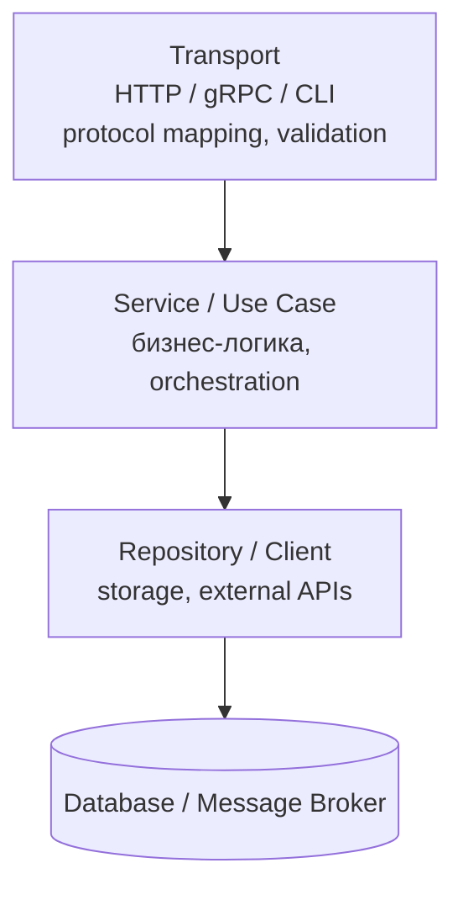
```mermaid
flowchart TB
    L1[Transport<br/>HTTP / gRPC / CLI<br/>protocol mapping, validation]
    L2[Service / Use Case<br/>бизнес-логика, orchestration]
    L3[Repository / Client<br/>storage, external APIs]
    L4[(Database / Message Broker)]

    L1 --> L2 --> L3 --> L4
```

Зависимости — только вниз. Transport не знает о DB.

**Правила слоёв:**

| Слой | Отвечает за | Не должен |
|---|---|---|
| Transport | Decode request, encode response, validation | Содержать бизнес-правила |
| Service | Бизнес-решение, orchestration | Знать HTTP коды или SQL |
| Repository | SQL/Redis/API запросы | Знать о бизнес-правилах |

**Где использовать:** большинство CRUD/backend-сервисов, небольшие сервисы, команды которым нужна предсказуемая структура.

**Слабое место:** без дисциплины business logic утекает в handlers или repositories.

---

## Hexagonal architecture

Гексагональная архитектура (она же ports and adapters) строится вокруг одного требования: бизнес-ядро не зависит от транспорта, базы и внешних SDK. Внешний мир подключается через порты (`port` — интерфейс, объявленный доменом) и адаптеры (`adapter` — их реализация в инфраструктуре).

Отличие от слоистой архитектуры в направлении стрелки к хранилищу. В слоистой сервис зависит от репозитория, то есть от инфраструктуры. В гексагональной домен объявляет интерфейс сам, а инфраструктура его реализует — зависимость инвертирована, и домен можно собрать и протестировать без базы вообще.

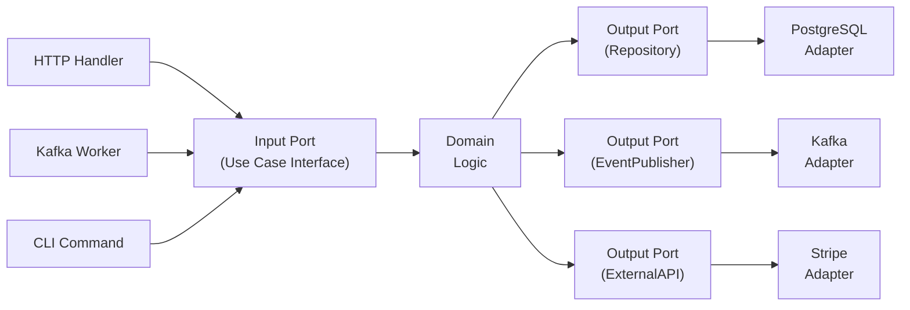
```mermaid
flowchart LR
    HTTP["HTTP Handler"] --> InPort["Input Port<br/>(Use Case Interface)"]
    Worker["Kafka Worker"] --> InPort
    CLI["CLI Command"] --> InPort

    InPort --> Core["Domain<br/>Logic"]

    Core --> OutPort1["Output Port<br/>(Repository)"]
    Core --> OutPort2["Output Port<br/>(EventPublisher)"]
    Core --> OutPort3["Output Port<br/>(ExternalAPI)"]

    OutPort1 --> DB["PostgreSQL<br/>Adapter"]
    OutPort2 --> Broker["Kafka<br/>Adapter"]
    OutPort3 --> Stripe["Stripe<br/>Adapter"]
```

**Ports vs Adapters:**

| | Port | Adapter |
|---|---|---|
| Что это | Интерфейс (Go interface) | Реализация интерфейса |
| Где живёт | В пакете domain/core | В пакете infrastructure |
| Пример | `OrderRepository` | `PostgresOrderRepository` |
| Тип | Input port (UseCase) или Output port | Driven (DB) или Driving (HTTP) |

**Где использовать:** есть важная domain logic, несколько входов в один use case, внешние providers могут меняться.

**Когда не выбирать:** простой CRUD, MVP, нет боли от coupling.

---

## Clean architecture

Похожа на Hexagonal, но сильнее акцентирует направление зависимостей: внутренние слои не знают о внешних.

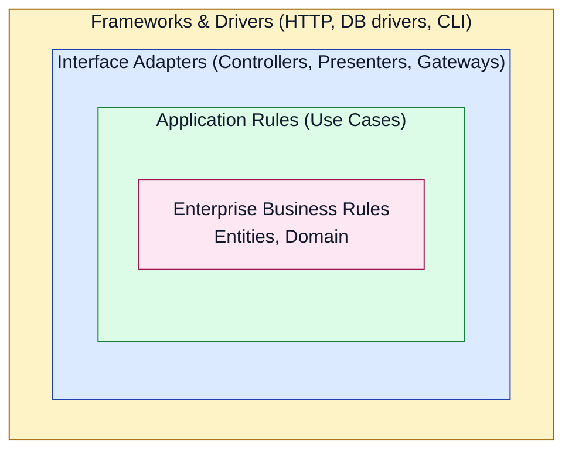
```mermaid
flowchart TB
    subgraph L1["Frameworks & Drivers (HTTP, DB drivers, CLI)"]
        subgraph L2["Interface Adapters (Controllers, Presenters, Gateways)"]
            subgraph L3["Application Rules (Use Cases)"]
                L4["Enterprise Business Rules<br/>Entities, Domain"]
            end
        end
    end

    style L1 fill:#fef3c7,stroke:#a16207,color:#0f172a
    style L2 fill:#dbeafe,stroke:#1e40af,color:#0f172a
    style L3 fill:#dcfce7,stroke:#15803d,color:#0f172a
    style L4 fill:#fce7f3,stroke:#9d174d,color:#0f172a
```

Зависимости — только внутрь. Внешний слой знает о внутреннем, не наоборот.

**Практичная Go-структура:**

```
internal/
  domain/          ← модели, интерфейсы, domain errors (ни от кого не зависит)
  usecase/         ← сценарии (зависит только от domain)
  transport/
    http/          ← handlers (зависит от usecase)
    grpc/
  storage/
    postgres/      ← реализации repo (зависит от domain)
  clients/
    stripe/        ← внешние API адаптеры
```

**Trade-off:** чем меньше доменной сложности, тем меньше пользы от строгих границ.

---

## DDD lite

DDD lite — это выборочное применение идей Domain-Driven Design: берутся те, что окупаются сразу (общий язык с бизнесом, границы согласованности, события домена), и не берутся те, что дают эффект только на большой модели (иерархии агрегатов, фабрики на каждый тип, слой спецификаций).

Критерий отбора простой: концепция остаётся, если её отсутствие приводит к конкретной ошибке. Без границ агрегата две транзакции ломают инвариант; без общего языка бизнес и код называют одну сущность по-разному, и расхождение всплывает в требованиях. Фабрика же без инвариантов не защищает ничего, и её отсутствие ничего не ломает.

Подробный разбор тактических блоков — в [DDD в Go](./05-ddd-in-go.md).

**Что обычно полезно:**

| Концепция | Когда использовать |
|---|---|
| Ubiquitous language | Всегда — имена типов и методов из предметной области |
| Aggregate boundaries | Есть invariants, которые нужно защищать |
| Domain events | Важные факты бизнеса (OrderPlaced, PaymentFailed) |
| Bounded contexts | Разные команды/сервисы используют разные понятия |
| Value objects | Когда тождество по значению, а не по id |

**Что часто лишнее:**

| Концепция | Когда избыточно |
|---|---|
| Фабрики для каждой мелочи | Простое создание без invariants |
| Repository на каждую таблицу | Нет domain-причины изолировать |
| Богатые иерархии агрегатов | CRUD без реальных бизнес-правил |

---

## Modular monolith

Один deployable artifact, но код разделён на модули с контролируемыми границами.

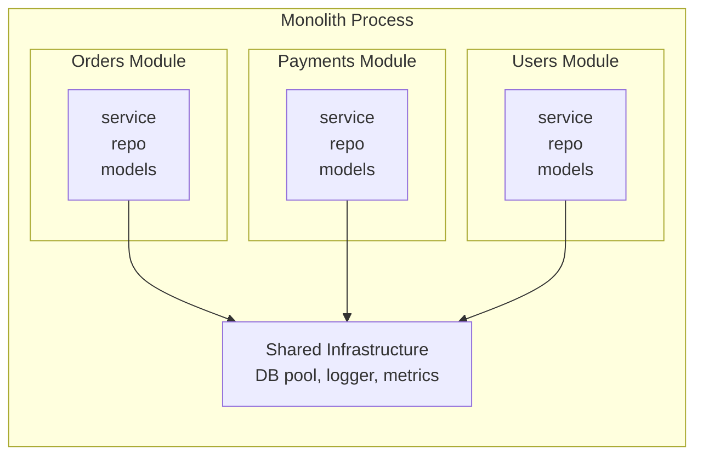
```mermaid
flowchart TB
    subgraph Mono[Monolith Process]
        direction TB

        subgraph Orders[Orders Module]
            O[service<br/>repo<br/>models]
        end
        subgraph Payments[Payments Module]
            P[service<br/>repo<br/>models]
        end
        subgraph Users[Users Module]
            U[service<br/>repo<br/>models]
        end

        Shared[Shared Infrastructure<br/>DB pool, logger, metrics]

        O --> Shared
        P --> Shared
        U --> Shared
    end
```

**Правила модульных границ:**
- Модуль А не импортирует внутренние пакеты модуля Б — только публичный API
- Взаимодействие через Go interfaces, не прямые зависимости на struct
- Shared schema отдельно от модульных таблиц

**Признак зрелости модуля:** его можно удалить, заменить или выделить в сервис с понятным списком зависимостей.

---

## CQRS

Разделить write model (команды) и read model (запросы).

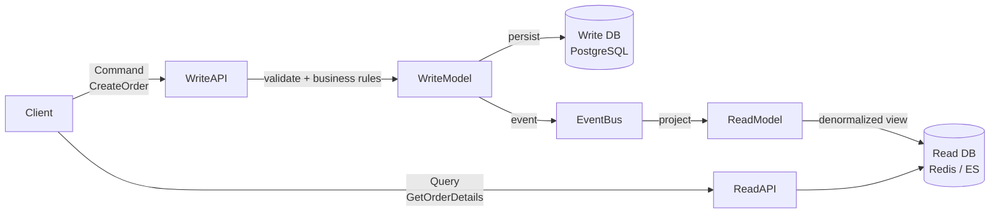
```mermaid
flowchart LR
    Client --> |Command<br/>CreateOrder| WriteAPI
    Client --> |Query<br/>GetOrderDetails| ReadAPI

    WriteAPI --> |validate + business rules| WriteModel
    WriteModel --> |persist| WriteDB[(Write DB<br/>PostgreSQL)]
    WriteModel --> |event| EventBus

    EventBus --> |project| ReadModel
    ReadModel --> |denormalized view| ReadDB[(Read DB<br/>Redis / ES)]

    ReadAPI --> ReadDB
```

**CQRS vs Simple layered:**

| | Simple layered | CQRS |
|---|---|---|
| Модели | Одна | Write model + Read model |
| Consistency | Strong | Eventual (read lag) |
| Read queries | Из write DB | Из denormalized read DB |
| Сложность | Низкая | Высокая |
| Когда | CRUD, стандартный доступ | Сложные read projections, разные access patterns |

**Когда не выбирать:** обычный CRUD, данные должны быть видны сразу после записи, команда не готова поддерживать две модели.

---

## Outbox

Изменение данных и событие о нём сохраняются в одной транзакции БД, а доставкой события в брокер занимается отдельный процесс. Так исчезает двойная запись: без общей транзакции возможен исход, когда заказ в базе есть, а события о нём никто не получил.

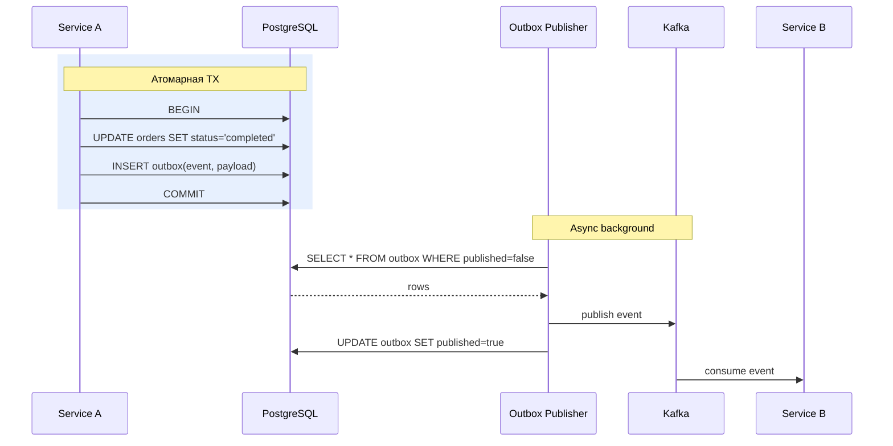
```mermaid
sequenceDiagram
    participant A as Service A
    participant DB as PostgreSQL
    participant Pub as Outbox Publisher
    participant K as Kafka
    participant B as Service B

    rect rgba(59, 130, 246, 0.12)
        Note over A,DB: Атомарная TX
        A->>DB: BEGIN
        A->>DB: UPDATE orders SET status='completed'
        A->>DB: INSERT outbox(event, payload)
        A->>DB: COMMIT
    end

    Note over Pub,K: Async background
    Pub->>DB: SELECT * FROM outbox WHERE published=false
    DB-->>Pub: rows
    Pub->>K: publish event
    Pub->>DB: UPDATE outbox SET published=true

    K->>B: consume event
```

**Почему outbox решает dual-write:**

```
Без outbox (проблема):               С outbox (решение):
  1. UPDATE DB        ← commit OK      1. UPDATE DB         ┐
  2. Publish Kafka    ← crash!         2. INSERT outbox     ┘ одна транзакция
                                       3. Publisher → Kafka  ← retry safe
  → Событие потеряно                  → At-least-once delivery
```

**Важно:** outbox гарантирует at-least-once, не exactly-once. Consumer должен быть idempotent.

**Операционные требования:**
- Cleanup job для старых записей
- Monitoring lag (сколько неопубликованных записей)
- Retry с backoff для transient broker errors

---

## Saga / process manager

Длинный бизнес-процесс разбивается на шаги, каждый имеет compensating action при failure.

**Choreography saga** (через события):

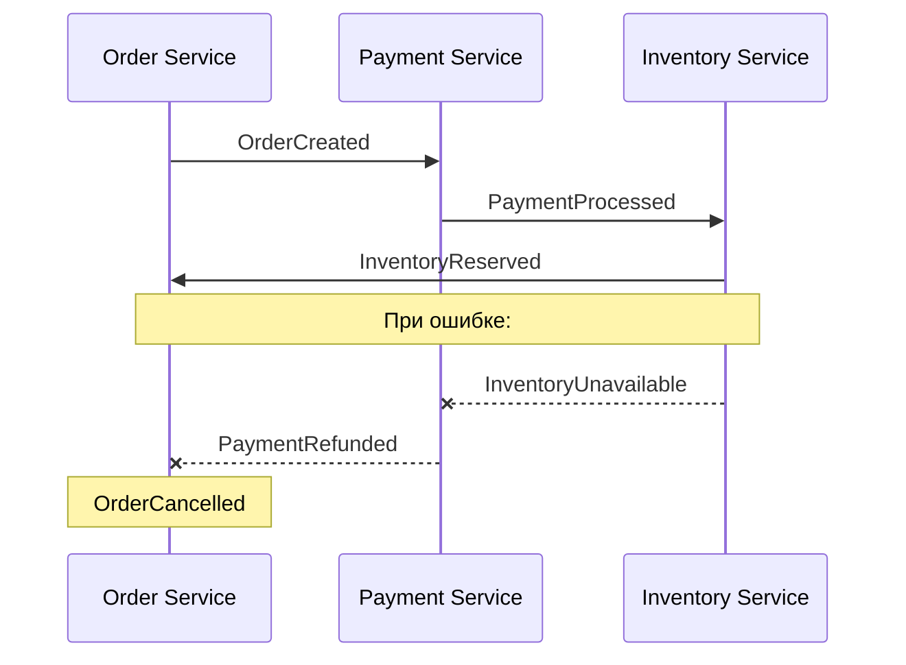
```mermaid
sequenceDiagram
    participant O as Order Service
    participant P as Payment Service
    participant I as Inventory Service

    O->>P: OrderCreated
    P->>I: PaymentProcessed
    I->>O: InventoryReserved

    Note over O,I: При ошибке:
    I--xP: InventoryUnavailable
    P--xO: PaymentRefunded
    Note over O: OrderCancelled
```

**Orchestration saga** (центральный координатор):

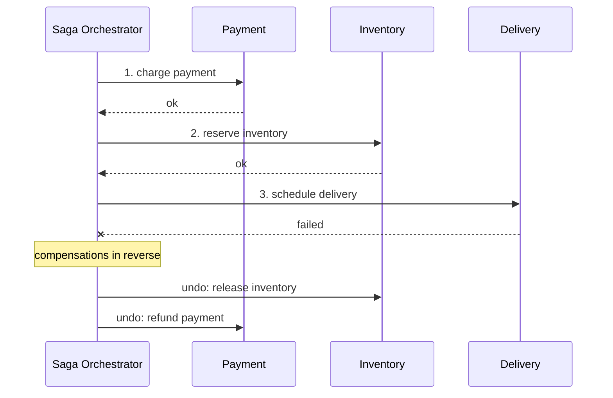
```mermaid
sequenceDiagram
    participant Saga as Saga Orchestrator
    participant P as Payment
    participant I as Inventory
    participant D as Delivery

    Saga->>P: 1. charge payment
    P-->>Saga: ok

    Saga->>I: 2. reserve inventory
    I-->>Saga: ok

    Saga->>D: 3. schedule delivery
    D--xSaga: failed

    Note over Saga: compensations in reverse
    Saga->>I: undo: release inventory
    Saga->>P: undo: refund payment
```

| | Choreography | Orchestration |
|---|---|---|
| Координация | Через события | Центральный orchestrator |
| Наблюдаемость | Сложнее отследить flow | Явный state в одном месте |
| Coupling | Меньше | Больше (все знают orchestrator) |
| Debugging | Сложнее | Проще |
| Когда | Простые 2-3 шага | Сложный многошаговый процесс |

**Компенсация ≠ rollback.** Иногда компенсация — бизнес-действие (вернуть деньги, уведомить пользователя), а не техническая отмена.

---

## Idempotency

Идемпотентность означает, что повторный вызов той же операции не создаёт повторный побочный эффект: второй `POST /orders` с тем же ключом не создаёт второй заказ и не списывает деньги дважды.

Требование появляется из устройства сети, а не из желания перестраховаться. Клиент, получивший таймаут, не знает, что случилось с запросом: он мог не дойти до сервера, мог быть выполнен и потерять ответ на обратном пути. Ретрай в такой ситуации неизбежен, поэтому защита переносится на сервер.

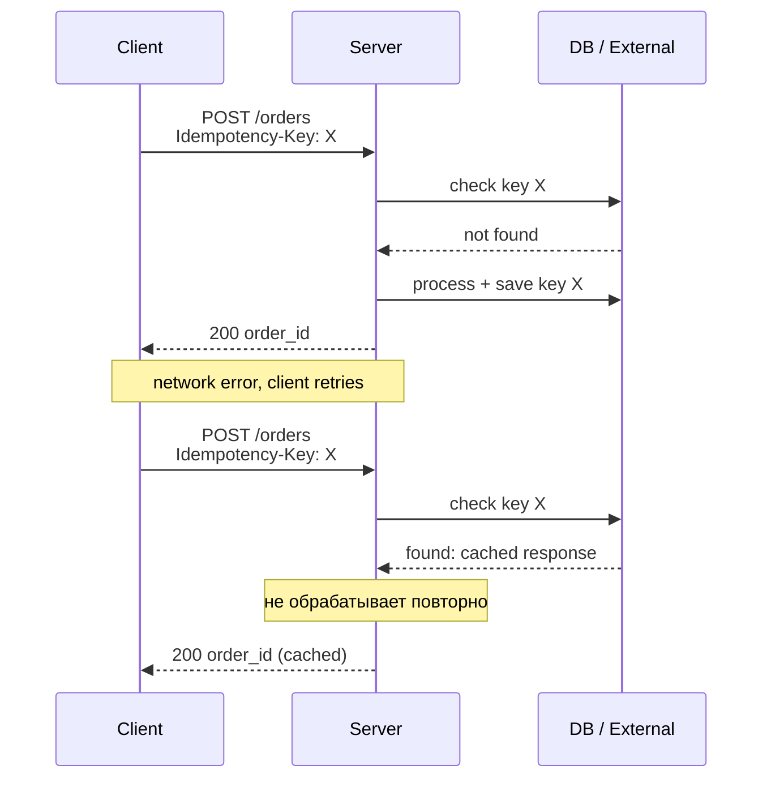
```mermaid
sequenceDiagram
    participant C as Client
    participant S as Server
    participant DB as DB / External

    C->>S: POST /orders<br/>Idempotency-Key: X
    S->>DB: check key X
    DB-->>S: not found
    S->>DB: process + save key X
    S-->>C: 200 order_id

    Note over C,S: network error, client retries

    C->>S: POST /orders<br/>Idempotency-Key: X
    S->>DB: check key X
    DB-->>S: found: cached response
    Note over S: не обрабатывает повторно
    S-->>C: 200 order_id (cached)
```

**Техники:**

| Техника | Когда |
|---|---|
| Idempotency key в заголовке | HTTP API, payment |
| Unique constraint в БД | Создание ресурсов |
| State machine (допустимые переходы) | Order lifecycle |
| Таблица processed_messages | Message consumers |
| Deterministic ID из данных запроса | Batch operations |

---

## Level-triggered reconciliation

Система хранит desired state, периодически сравнивает с observed state и приводит реальный мир к желаемому.

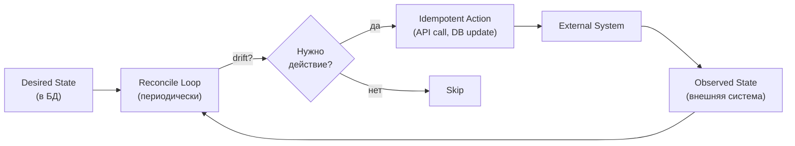
```mermaid
flowchart LR
    Desired["Desired State<br/>(в БД)"] --> Reconcile["Reconcile Loop<br/>(периодически)"]
    Observed["Observed State<br/>(внешняя система)"] --> Reconcile
    Reconcile --> |"drift?"| Decision{Нужно<br/>действие?}
    Decision --> |да| Action["Idempotent Action<br/>(API call, DB update)"]
    Decision --> |нет| Skip["Skip"]
    Action --> External["External System"]
    External --> Observed
```

**Level-triggered vs Edge-triggered:**

| | Edge-triggered | Level-triggered |
|---|---|---|
| Логика | "Произошло событие → выполни действие" | "Есть desired state → приведи к нему" |
| Устойчивость | Потеря события = сломанное состояние | Следующий reconcile исправит |
| Идемпотентность | Требует особой заботы | Встроена в подход |
| Сложность | Проще при надёжной доставке | Нужен reconcile loop |
| Применение | Queue consumer, webhook | K8s controllers, sync jobs |

**Практические правила:**
- Reconcile-функция обязательно идемпотентна
- Сначала читать observed state, потом решать нужно ли действие
- Хранить `status`, `last_error`, `next_retry` — для observability
- Различать transient error (retry) и permanent failure (alert)
- Backoff + jitter для retry, не сразу снова

---

## Anti-corruption layer

Anti-corruption layer (ACL, слой защиты от чужой модели) изолирует домен от структур данных внешней системы: между ними ставится набор преобразователей, и внутрь попадают только собственные типы.

Без такого слоя чужая модель распространяется вглубь кода незаметно. Достаточно один раз положить `UserRecord` из legacy-системы в поле доменной структуры, и дальше её поля начинают использоваться в бизнес-правилах — а вместе с ними наследуются чужие соглашения: статус строкой `"ACT"`, деньги числом с плавающей точкой, отсутствие значения как пустая строка. Смена внешнего поставщика после этого перестаёт быть локальной правкой.

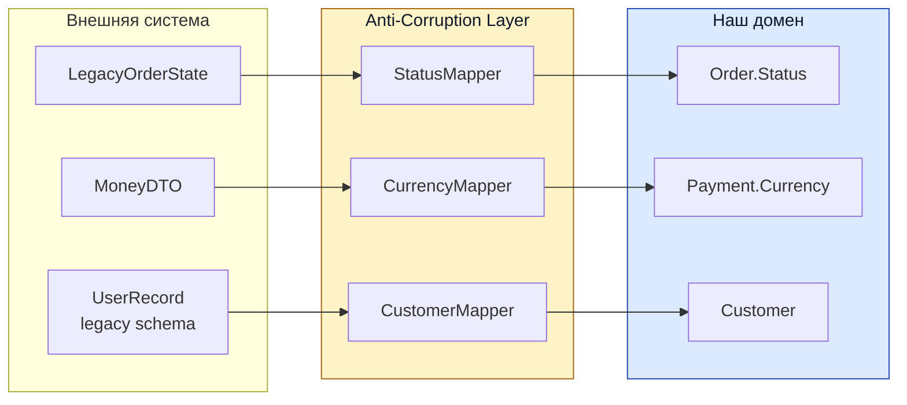
```mermaid
flowchart LR
    subgraph Domain[Наш домен]
        OS[Order.Status]
        PC[Payment.Currency]
        Cust[Customer]
    end

    subgraph ACL[Anti-Corruption Layer]
        SM[StatusMapper]
        CM[CurrencyMapper]
        UM[CustomerMapper]
    end

    subgraph Ext[Внешняя система]
        LOS[LegacyOrderState]
        MDTO[MoneyDTO]
        UR[UserRecord<br/>legacy schema]
    end

    LOS --> SM --> OS
    MDTO --> CM --> PC
    UR --> UM --> Cust

    style Domain fill:#dbeafe,stroke:#1e40af,color:#0f172a
    style ACL fill:#fef3c7,stroke:#a16207,color:#0f172a
```

**Где нужен ACL:**
- Интеграция с legacy-системой
- Внешний provider с неудобной моделью
- Два bounded contexts с разными терминами для одного понятия
- Миграция со старой системы на новую

---

## Strangler fig

Strangler fig («душащий фикус») — постепенная замена старой системы новой: перед legacy ставится прокси, и маршруты по одному переключаются на новый сервис. Название взято у растения, которое обвивает дерево-хозяина и занимает его место, пока то не исчезнет.

Альтернатива — переписать всё и переключиться одним днём — плоха не объёмом работы, а тем, что до самого переключения нет ни одного проверенного куска: ошибки в новой системе обнаруживаются все сразу и под полным трафиком. Strangler fig размазывает риск: каждый перенесённый маршрут проверяется на реальном трафике отдельно, и откат — это возврат одного правила в прокси.

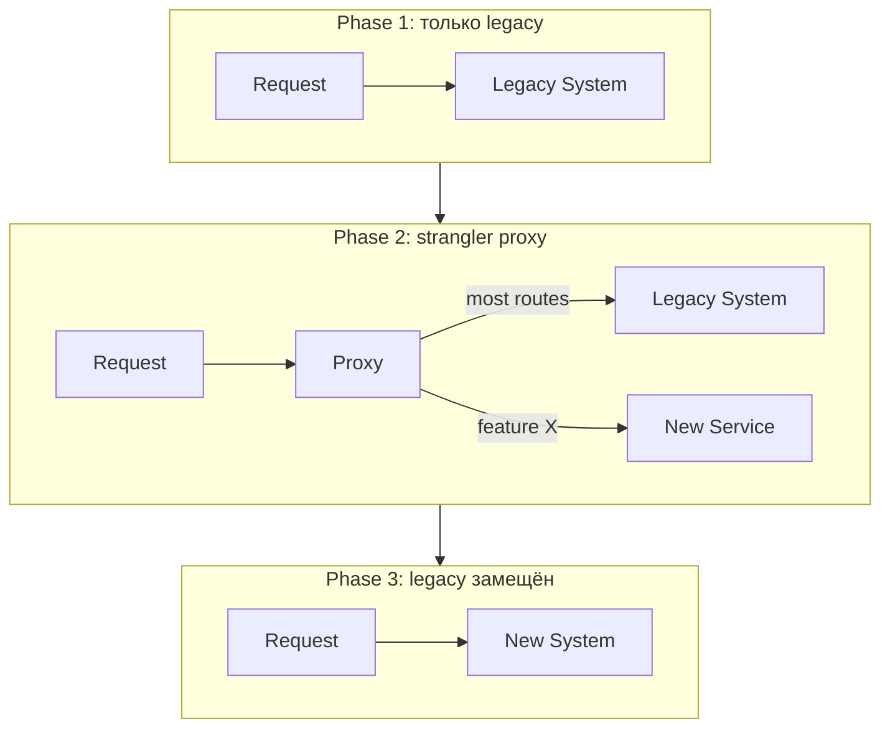
```mermaid
flowchart TB
    subgraph Phase1["Phase 1: только legacy"]
        R1[Request] --> L1[Legacy System]
    end

    subgraph Phase2["Phase 2: strangler proxy"]
        R2[Request] --> P2[Proxy]
        P2 -->|most routes| L2[Legacy System]
        P2 -->|feature X| N2[New Service]
    end

    subgraph Phase3["Phase 3: legacy замещён"]
        R3[Request] --> N3[New System]
    end

    Phase1 --> Phase2 --> Phase3
```

**Ключевые шаги:**
1. Поставить proxy перед legacy
2. Выделять функциональность по маршрутам/событиям/модулям
3. Синхронизировать данные bidirectionally во время переходного периода
4. Удалить legacy когда весь трафик переключён

---

## Как выбирать паттерн

| Проблема | Паттерн | Главный trade-off |
|---|---|---|
| Бизнес-логика смешалась с HTTP/DB | Layered / Hexagonal | Больше структуры, но чище границы |
| Внешний SDK протек в домен | Adapter / ACL | Mapping code вместо прямого вызова |
| Несколько входов в один use case | Hexagonal | Интерфейсы для каждого порта |
| Надёжно публиковать события | Outbox | Publisher процесс + cleanup |
| Длинный процесс между сервисами | Saga | Compensation logic + state machine |
| Повторы создают дубли | Idempotency | Хранение ключей + состояния |
| Состояние разъезжается при сбоях | Reconciliation | Eventual consistency + loop |
| Разные access patterns read/write | CQRS | Eventual consistency + 2 модели |
| Монолит растёт, микросервисы рано | Modular monolith | Дисциплина модульных границ |
| Legacy нельзя переписать сразу | Strangler fig | Временная двойная система |

---

## Типичные ошибки

- **Паттерн по названию, а не по проблеме.** «Нам нужен hexagonal» без ответа на вопрос, что именно сейчас болит.
- **Clean architecture для CRUD.** Пять слоёв ради `GET /users` — это церемония, а не архитектура.
- **Папка `domain` без доменной логики.** Перенос структур в отдельный пакет сам по себе не делает модель доменной.
- **Repository как обёртка над таблицей.** `GetAll`, `UpdateById` — это DAO: интерфейс повторяет операции хранилища, а не язык домена.
- **CQRS без разных access patterns.** Eventual consistency оплачена, выигрыш не получен.
- **Saga без явного state machine и идемпотентности.** После частичного отказа состояние процесса невосстановимо: неизвестно, какой шаг успел выполниться.
- **Outbox как exactly-once.** Outbox даёт at-least-once, дубликаты снимает уже потребитель.
- **Reconciler, написанный как обработчик события.** Действие выполняется без сверки с фактическим состоянием, и повторный цикл делает работу второй раз.
- **Микросервисы раньше понятых границ.** Склеить обратно дороже, чем разделить позже.

---

## Interview-ready answer

**1. Как выбирать архитектурный паттерн?**

- Главное — выбор идёт от проблемы, а не от списка known patterns: сначала называется боль, потом паттерн, который её снимает.
- Простой сервис — достаточно слоёв с однонаправленными зависимостями.
- Сложная доменная логика или несколько входных каналов в один сценарий — hexagonal с портами в домене.
- Изменение в базе должно надёжно превратиться в событие — outbox.
- Процесс идёт через несколько сервисов — saga с явным state machine и идемпотентными шагами.

**2. Какие паттерны чаще всего недооценивают?**

- Level-triggered reconciliation — система сверяет желаемое состояние с фактическим вместо реакции на каждое событие, поэтому переживает потерю события и частичный отказ.
- Strangler fig — legacy заменяется по маршруту за раз, и откат стоит одного правила в прокси вместо отката всей миграции.

**3. Какой главный критерий, что паттерн выбран правильно?**

- Критерий — стоимость: паттерн снижает цену изменения и эксплуатации, а не добавляет слои ради узнаваемого названия.
- Проверка — назвать сценарий изменения, который стал дешевле; если такого сценария нет, паттерн не нужен.
