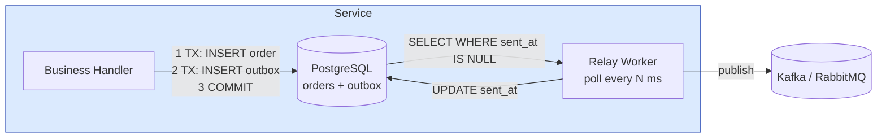
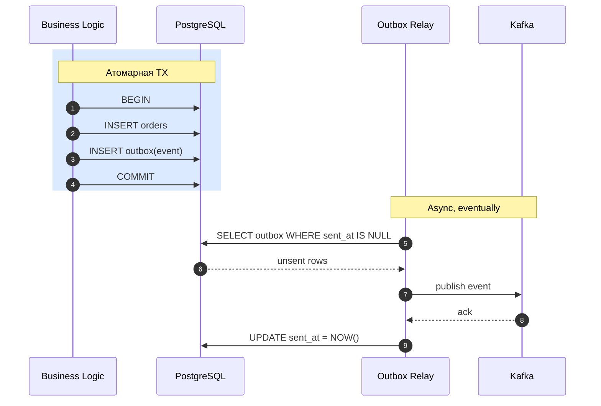
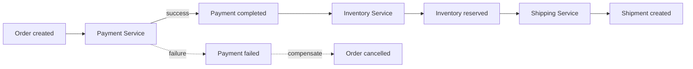
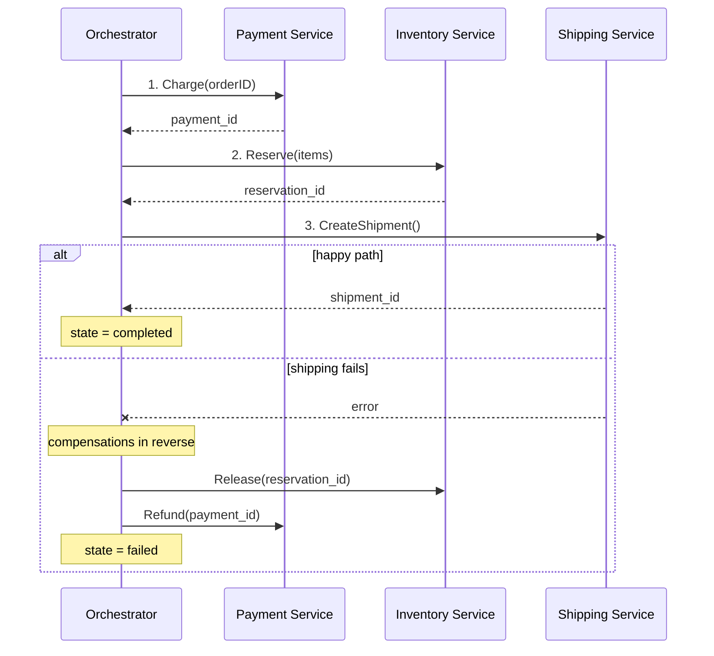
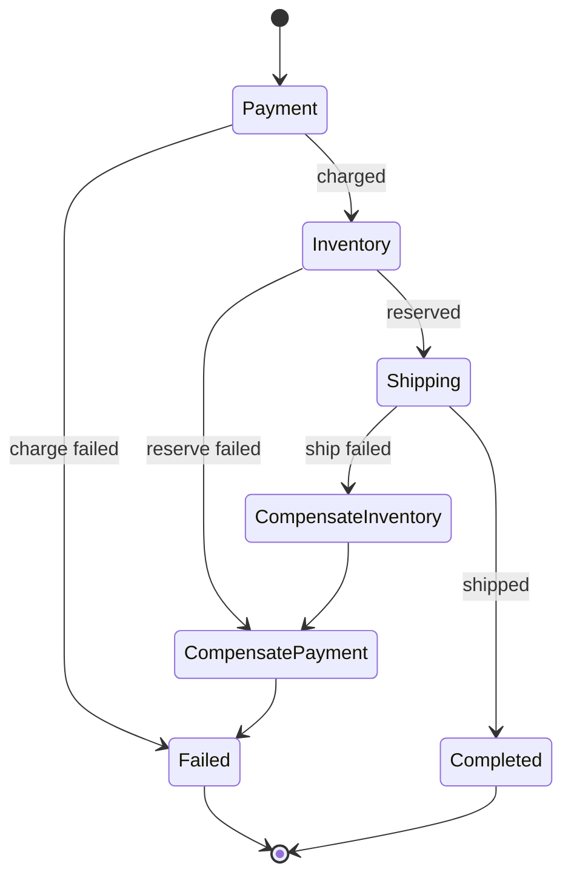

# Saga и Outbox: distributed transactions

## Содержание

- [Простая аналогия](#простая-аналогия)
- [Проблема: dual write](#проблема-dual-write)
- [Почему 2PC обычно не работает](#почему-2pc-обычно-не-работает)
- [Outbox pattern: идея](#outbox-pattern-идея)
- [Outbox: полная реализация в Go](#outbox-полная-реализация-в-go)
- [At-least-once: дубликаты неизбежны](#at-least-once-дубликаты-неизбежны)
- [Inbox pattern: consumer-side дедупликация](#inbox-pattern-consumer-side-дедупликация)
- [CDC как альтернатива polling](#cdc-как-альтернатива-polling)
- [Saga pattern: идея](#saga-pattern-идея)
- [Choreography saga](#choreography-saga)
- [Orchestration saga](#orchestration-saga)
- [Compensation logic](#compensation-logic)
- [Saga + Outbox: как они комбинируются](#saga--outbox-как-они-комбинируются)
- [Temporal.io: готовое решение](#temporalio-готовое-решение)
- [Подводные камни](#подводные-камни)
- [Когда что выбирать](#когда-что-выбирать)
- [Interview-ready answer](#interview-ready-answer)
- [Полезные ссылки](#полезные-ссылки)

В монолите с одной базой транзакция атомарна: либо применились все изменения, либо ни одного. В системе из нескольких сервисов такой гарантии нет. Сервис A списал деньги и должен сообщить сервису B, что товар пора отправлять. Если A списал, а событие до B не дошло, деньги ушли, а товар не отправлен — и восстановить это автоматически нечем.

Задачу решают два паттерна, которые обычно работают вместе:

- **Outbox** — надёжная доставка событий наружу. Обещание: если изменение записано в базу, событие о нём будет опубликовано.
- **Saga** — координация логической транзакции через несколько сервисов. Обещание: если пятый шаг не удался, предыдущие четыре компенсируются.

Это не альтернативы, а разные слои. Saga отвечает за логику процесса, Outbox — за транспорт, по которому идут её шаги.

См. также: [PostgreSQL: outbox и идемпотентность](../../06-databases/database-systems-catalog/postgresql/14-outbox-and-idempotency.md) — короткая шпаргалка по outbox в контексте платежей.

---

## Простая аналогия

Онлайн-заказ еды состоит из четырёх шагов:

1. Со счёта клиента списывается 30 долларов.
2. Ресторан получает заказ.
3. Назначается курьер.
4. Клиенту приходит уведомление со временем доставки.

Каждый шаг обслуживает отдельный сервис. Если на третьем шаге свободных курьеров не нашлось, деньги уже списаны, а еда уже готовится — доставить её некому.

**Без специального механизма** деньги останутся списанными, еда — приготовленной, а клиент пойдёт в поддержку.

**С saga** неудача на третьем шаге запускает компенсации в обратном порядке: отменить заказ в ресторане, вернуть деньги. Процесс либо доходит до конца, либо возвращается к исходной точке.

**С outbox** события между шагами не теряются. Если первый шаг зафиксировал списание в своей базе, событие о списании дойдёт до сервиса заказов независимо от сетевых сбоев и перезапусков.

Saga — это логика распределённой транзакции. Outbox — транспорт, на котором она держится.

---

## Проблема: dual write

Двойная запись (`dual write`) — это попытка изменить две независимые системы подряд и считать результат согласованным:

```go
// Антипаттерн: dual write
func chargePayment(orderID string, amount float64) error {
    // 1. Записать в БД
    if err := db.Exec("INSERT INTO payments ...", ...); err != nil {
        return err
    }

    // 2. Опубликовать событие в Kafka
    if err := kafka.Publish("payment-completed", event); err != nil {
        // Что делать?? БД уже записала, а Kafka — нет
        return err
    }

    return nil
}
```

**Что может пойти не так:**

| Сценарий | Что происходит |
|---|---|
| Сервис упал между шагом 1 и 2 | БД записала, событие не опубликовано → downstream сервисы не знают о платеже |
| Kafka недоступна | Шаг 2 fails, шаг 1 уже committed → данные расходятся |
| Сеть нестабильна | Шаг 2 может частично доставиться, retry дублирует |
| БД rollback после publish | Событие опубликовано, но платежа нет → downstream обрабатывает несуществующий платёж |

Сценарии эти не теоретические. При тысяче запросов в секунду окно между двумя записями открывается тысячу раз в секунду, и любой перезапуск пода, сетевой сбой или недоступность брокера попадает в него неизбежно.

**Корень проблемы:** база и брокер не имеют общей транзакции. Между шагом 1 и шагом 2 есть промежуток, в котором сервис может исчезнуть, и никакая обработка ошибок этого не меняет — упасть можно и внутри блока обработки ошибки.

### Очевидное решение, которое не работает

```go
// А может сначала publish, потом commit?
func chargePayment(orderID string, amount float64) error {
    if err := kafka.Publish("payment-completed", event); err != nil {
        return err
    }
    return db.Exec("INSERT INTO payments ...", ...)
}
```

Этот вариант хуже исходного. Событие `payment-completed` опубликовано, а запись в базу могла не пройти — и получатели событий начинают работать с платежом, которого не существует. В первом варианте терялось уведомление о реальном факте; здесь рассылается уведомление о факте, которого не было.

---

## Почему 2PC обычно не работает

**2PC (Two-Phase Commit, двухфазный коммит)** — классическое решение распределённых транзакций. Координатор на первой фазе спрашивает всех участников, готовы ли они зафиксировать изменения, и, если согласны все, на второй фазе командует фиксацию. Результат атомарен.

В современных сервисах его почти не встретить, и причин несколько.

**1. Протокол блокирующий.** Если координатор исчез между фазами, участники удерживают блокировки до его возвращения. Они не могут ни зафиксировать изменения, ни откатить их: решение принимает координатор, а его нет.

**2. Брокеры сообщений его не поддерживают.** 2PC требует XA-совместимых участников, а Kafka, RabbitMQ, Redis и SQS такого интерфейса не предоставляют. Именно поэтому паттерн неприменим к самому частому случаю — «база плюс брокер».

**3. Низкая пропускная способность.** Каждая транзакция — это два сетевых обхода всех участников, и время удержания блокировок растёт вместе с их числом.

**4. Жёсткая связанность по доступности.** Все участники должны быть доступны одновременно; замедление одного останавливает всю транзакцию.

**5. Единая точка отказа.** Координатор знает исход транзакции, и его потеря оставляет участников в неопределённости.

В банковских системах с двумя базами одного поставщика (например, Oracle XA) 2PC ещё встречается: там участники однородны и находятся под общим управлением. В сервисной архитектуре с разнородными хранилищами — практически нет.

**Практический вывод:** атомарной транзакции между сервисами не будет, и систему проектируют согласованной в конечном счёте (`eventual consistency`) — через saga и outbox.

---

## Outbox pattern: идея

**Цель:** если изменение записано в базу, событие о нём будет опубликовано — независимо от падения сервиса, недоступности брокера или потери сети.

**Идея:**

1. Событие не публикуется напрямую в брокер.
2. Оно записывается в таблицу `outbox` в той же базе, что и бизнес-данные.
3. Запись в `outbox` и бизнес-данные фиксируются одной транзакцией.
4. Отдельный процесс (`relay worker`) периодически читает неотправленные записи и публикует их в брокер.
5. После успешной публикации запись помечается как отправленная.

Ключевая подмена здесь такая: вместо двух систем без общей транзакции остаётся одна система с транзакцией плюс задача доставки, которую можно безопасно повторять.





**Главное свойство:** транзакция базы атомарна. Либо записаны и заказ, и событие — тогда событие рано или поздно уйдёт; либо не записано ничего — тогда и заказа не существует. Состояния «заказ есть, события нет» больше не существует.

Промежуток между записью и публикацией никуда не делся, но изменил свойства: он переживает перезапуск. После восстановления relay найдёт неотправленные записи и опубликует их. Ценой стала задержка — событие уходит не мгновенно, а в пределах интервала опроса.

---

## Outbox: полная реализация в Go

### Схема таблицы

```sql
CREATE TABLE outbox (
    id UUID PRIMARY KEY DEFAULT gen_random_uuid(),
    aggregate_type TEXT NOT NULL,       -- "order", "payment", и т.д.
    aggregate_id TEXT NOT NULL,         -- ID сущности
    event_type TEXT NOT NULL,           -- "OrderCreated", "PaymentCompleted"
    payload JSONB NOT NULL,             -- сам event
    created_at TIMESTAMPTZ NOT NULL DEFAULT NOW(),
    sent_at TIMESTAMPTZ,                -- NULL = не отправлено
    attempts INT NOT NULL DEFAULT 0,
    last_error TEXT
);

-- Индекс для быстрого поиска неотправленных
CREATE INDEX outbox_unsent_idx ON outbox (created_at) WHERE sent_at IS NULL;
```

### Saver — запись в outbox в той же транзакции

```go
package outbox

import (
    "context"
    "encoding/json"
    "github.com/jackc/pgx/v5"
)

type Event struct {
    AggregateType string
    AggregateID   string
    EventType     string
    Payload       any
}

// SaveInTx добавляет событие в outbox в рамках уже открытой транзакции
func SaveInTx(ctx context.Context, tx pgx.Tx, event Event) error {
    payload, err := json.Marshal(event.Payload)
    if err != nil {
        return err
    }

    _, err = tx.Exec(ctx, `
        INSERT INTO outbox (aggregate_type, aggregate_id, event_type, payload)
        VALUES ($1, $2, $3, $4)
    `, event.AggregateType, event.AggregateID, event.EventType, payload)

    return err
}
```

### Использование в business logic

```go
func (s *OrderService) CreateOrder(ctx context.Context, req CreateOrderRequest) (*Order, error) {
    tx, err := s.db.Begin(ctx)
    if err != nil {
        return nil, err
    }
    defer tx.Rollback(ctx)

    // 1. Business write
    order := &Order{
        ID:        uuid.New().String(),
        UserID:    req.UserID,
        Total:     req.Total,
        Status:    "pending",
        CreatedAt: time.Now(),
    }
    if _, err := tx.Exec(ctx, `
        INSERT INTO orders (id, user_id, total, status, created_at)
        VALUES ($1, $2, $3, $4, $5)
    `, order.ID, order.UserID, order.Total, order.Status, order.CreatedAt); err != nil {
        return nil, err
    }

    // 2. Outbox write в той же транзакции
    if err := outbox.SaveInTx(ctx, tx, outbox.Event{
        AggregateType: "order",
        AggregateID:   order.ID,
        EventType:     "OrderCreated",
        Payload: map[string]any{
            "order_id": order.ID,
            "user_id":  order.UserID,
            "total":    order.Total,
        },
    }); err != nil {
        return nil, err
    }

    // 3. Commit обоих изменений атомарно
    if err := tx.Commit(ctx); err != nil {
        return nil, err
    }

    return order, nil
}
```

После фиксации транзакции возможны ровно два исхода: заказ создан и событие лежит в outbox, либо не произошло ничего.

### Relay worker — polling и publish

```go
package outbox

import (
    "context"
    "log/slog"
    "time"

    "github.com/jackc/pgx/v5/pgxpool"
)

type Publisher interface {
    Publish(ctx context.Context, topic, key string, payload []byte) error
}

type Relay struct {
    db        *pgxpool.Pool
    publisher Publisher
    interval  time.Duration
    batchSize int
}

func NewRelay(db *pgxpool.Pool, pub Publisher) *Relay {
    return &Relay{
        db:        db,
        publisher: pub,
        interval:  1 * time.Second,
        batchSize: 100,
    }
}

func (r *Relay) Run(ctx context.Context) {
    ticker := time.NewTicker(r.interval)
    defer ticker.Stop()

    for {
        select {
        case <-ctx.Done():
            return
        case <-ticker.C:
            if err := r.processBatch(ctx); err != nil {
                slog.Error("outbox: process batch", "err", err)
            }
        }
    }
}

func (r *Relay) processBatch(ctx context.Context) error {
    // Вся пачка обрабатывается в одной транзакции. Это принципиально:
    // блокировки FOR UPDATE живут ровно до конца транзакции, и без
    // явного Begin они снялись бы сразу после чтения строк.
    tx, err := r.db.Begin(ctx)
    if err != nil {
        return fmt.Errorf("begin: %w", err)
    }
    defer tx.Rollback(ctx) //nolint:errcheck // no-op после Commit

    rows, err := tx.Query(ctx, `
        SELECT id, aggregate_type, aggregate_id, event_type, payload
        FROM outbox
        WHERE sent_at IS NULL
        ORDER BY created_at
        LIMIT $1
        FOR UPDATE SKIP LOCKED
    `, r.batchSize)
    if err != nil {
        return fmt.Errorf("select outbox: %w", err)
    }

    type pending struct {
        id          string
        topic       string
        aggregateID string
        payload     []byte
    }

    var batch []pending
    for rows.Next() {
        var p pending
        var aggregateType, eventType string
        if err := rows.Scan(&p.id, &aggregateType, &p.aggregateID, &eventType, &p.payload); err != nil {
            rows.Close()
            return fmt.Errorf("scan outbox row: %w", err)
        }
        // Тема для брокера, например "order.order_created"
        p.topic = aggregateType + "." + snake(eventType)
        batch = append(batch, p)
    }
    rows.Close()
    if err := rows.Err(); err != nil {
        return fmt.Errorf("iterate outbox rows: %w", err)
    }

    if len(batch) == 0 {
        return tx.Commit(ctx)
    }

    sentIDs := make([]string, 0, len(batch))
    failed := make(map[string]string) // id -> текст ошибки

    for _, p := range batch {
        // Ключ сообщения — идентификатор агрегата: события одного
        // заказа попадут в одну партицию и сохранят порядок.
        if err := r.publisher.Publish(ctx, p.topic, p.aggregateID, p.payload); err != nil {
            failed[p.id] = err.Error()
            slog.Warn("outbox: publish failed", "id", p.id, "err", err)
            continue
        }
        sentIDs = append(sentIDs, p.id)
    }

    if len(sentIDs) > 0 {
        if _, err := tx.Exec(ctx, `
            UPDATE outbox SET sent_at = NOW()
            WHERE id = ANY($1::uuid[])
        `, sentIDs); err != nil {
            return fmt.Errorf("mark sent: %w", err)
        }
    }

    for id, errMsg := range failed {
        if _, err := tx.Exec(ctx, `
            UPDATE outbox
               SET attempts = attempts + 1, last_error = $1
             WHERE id = $2
        `, errMsg, id); err != nil {
            return fmt.Errorf("mark failed: %w", err)
        }
    }

    return tx.Commit(ctx)
}

func snake(s string) string {
    // OrderCreated -> order_created; реализация опущена
    return s
}
```

**Почему `SELECT ... FOR UPDATE SKIP LOCKED` обязан быть внутри явной транзакции.** Блокировки строк в PostgreSQL живут до конца транзакции. Если тот же запрос выполнить прямо на пуле (`pool.Query`), каждая команда становится собственной неявной транзакцией, которая завершается вместе с запросом, — и блокировки снимаются раньше, чем relay успеет что-либо опубликовать. Внешне код выглядит защищённым, а на деле два экземпляра relay читают один и тот же набор строк и публикуют каждое событие дважды. Ошибка не воспроизводится на одном экземпляре и проявляется только после масштабирования.

`SKIP LOCKED` при этом отвечает за второе: вместо ожидания заблокированных строк запрос их пропускает. Без него параллельные relay выстроились бы в очередь на одних и тех же записях, и от нескольких экземпляров не было бы пользы.

**Обратная сторона решения** — транзакция остаётся открытой на время публикации в брокер. Медленный или недоступный брокер удерживает её вместе с блокировками, а длинные транзакции в PostgreSQL мешают очистке старых версий строк. Отсюда два практических требования: жёсткий таймаут на публикацию и умеренный размер пачки. Если этого мало, вместо блокировок применяют аренду: `UPDATE outbox SET locked_by = $1, locked_until = NOW() + INTERVAL '30 seconds' WHERE ... RETURNING *` — транзакция закрывается сразу, а запись остаётся закреплённой за конкретным экземпляром до истечения срока.

**Остальные решения в коде:**

1. **Пачка по 100 записей.** Один запрос вместо ста уменьшает накладные расходы, а размер ограничен сверху длительностью транзакции.
2. **Отметка `sent_at` вместо удаления.** Строка остаётся для разбора инцидентов; чистит её отдельная задача.
3. **Повтор без отдельного механизма.** Неопубликованная запись просто не получает `sent_at` и попадает в следующую выборку.
4. **Счётчик `attempts` и `last_error`.** Событие, застрявшее на сотне попыток, — это уже эксплуатационная проблема, и её видно по метрике, а не по жалобе.
5. **Периодическая очистка.** Отдельная задача удаляет отправленное старше срока хранения:
   ```sql
   DELETE FROM outbox WHERE sent_at < NOW() - INTERVAL '7 days';
   ```

### Запуск

```go
func main() {
    db := connectDB()
    publisher := kafka.NewPublisher(...)

    relay := outbox.NewRelay(db, publisher)

    ctx, cancel := signal.NotifyContext(context.Background(), os.Interrupt, syscall.SIGTERM)
    defer cancel()

    go relay.Run(ctx)

    // ... HTTP server, etc.
    <-ctx.Done()
}
```

В эксплуатации relay обычно выносят в отдельный deployment с несколькими репликами — рядом с сервисом или самостоятельно. Работать в несколько экземпляров он может именно благодаря `SKIP LOCKED`.

---

## At-least-once: дубликаты неизбежны

После публикации relay помечает запись как отправленную. Между этими двумя действиями есть промежуток, и он воспроизводит ту же проблему двойной записи, только на другом уровне:

1. Публикация прошла успешно.
2. Процесс упал раньше, чем выполнился `UPDATE outbox`.

Следующий цикл найдёт ту же запись без отметки и опубликует её повторно. Получатель увидит дубликат.

Устранить этот промежуток нельзя: брокер и база по-прежнему не имеют общей транзакции — outbox лишь перенёс проблему туда, где повтор безопасен. Поэтому outbox даёт доставку не реже одного раза (`at-least-once`), а не ровно один раз, и получатель обязан уметь отбрасывать дубликаты.

Условие для этого — стабильный идентификатор события: он генерируется один раз при записи в outbox и остаётся тем же при всех повторных публикациях.

```go
event := outbox.Event{
    Payload: map[string]any{
        "event_id": uuid.New().String(),  // ← получателю для дедупликации
        // ... остальные поля
    },
}
```

---

## Inbox pattern: consumer-side дедупликация

Inbox — зеркало outbox на стороне получателя. Идентификатор пришедшего события записывается в базу той же транзакцией, что и результат обработки. Если такая запись уже есть, событие обрабатывалось раньше и повтор пропускается.

### Схема таблицы

```sql
CREATE TABLE inbox (
    event_id UUID PRIMARY KEY,
    received_at TIMESTAMPTZ NOT NULL DEFAULT NOW()
);
```

### Consumer

```go
func (h *OrderHandler) HandleOrderCreated(ctx context.Context, msg Message) error {
    var event OrderCreatedEvent
    if err := json.Unmarshal(msg.Payload, &event); err != nil {
        return err
    }

    tx, err := h.db.Begin(ctx)
    if err != nil {
        return fmt.Errorf("begin: %w", err)
    }
    defer tx.Rollback(ctx) //nolint:errcheck // no-op после Commit

    // 1. Заявка на обработку. ON CONFLICT DO NOTHING превращает
    //    повторное событие в ноль изменённых строк вместо ошибки.
    tag, err := tx.Exec(ctx, `
        INSERT INTO inbox (event_id) VALUES ($1)
        ON CONFLICT (event_id) DO NOTHING
    `, event.EventID)
    if err != nil {
        return fmt.Errorf("claim event %s: %w", event.EventID, err)
    }

    // 2. Ноль вставленных строк означает, что событие уже обработано.
    //    Ответ даёт сам INSERT — отдельный SELECT не нужен и был бы гонкой.
    if tag.RowsAffected() == 0 {
        return tx.Commit(ctx)
    }

    // 3. Обработка события — в той же транзакции, что и отметка.
    if _, err := tx.Exec(ctx, `
        INSERT INTO order_replica (id, user_id, total, status)
        VALUES ($1, $2, $3, $4)
    `, event.OrderID, event.UserID, event.Total, event.Status); err != nil {
        return fmt.Errorf("apply event %s: %w", event.EventID, err)
    }

    return tx.Commit(ctx)
}
```

**Почему признак дубликата — результат `INSERT`, а не отдельный `SELECT`.** Проверка «сначала посмотреть, есть ли запись, потом вставить» — классическая гонка: два обработчика одного события одновременно видят пустоту и оба идут выполнять работу. `INSERT ... ON CONFLICT DO NOTHING` совмещает проверку и захват в одной атомарной операции, а число изменённых строк прямо отвечает на вопрос «мы первые?». Второй обработчик получит ноль и на этом остановится.

**Почему отметка и работа обязаны быть одной транзакцией.** Порядок «зафиксировать inbox, затем обработать» ломается при падении между операциями: повторная доставка упрётся в существующую запись, обработчик решит, что всё сделано, и событие потеряется навсегда. Общая транзакция делает оба факта одним: либо событие отмечено и применено, либо не произошло ничего и брокер доставит его снова.

**Что остаётся за пределами транзакции.** Всё, что не является записью в ту же базу: вызов внешнего API, отправка письма, публикация в другой топик. Откатить их нельзя, и здесь inbox не помогает — нужна идемпотентность на стороне получателя, то есть ключ идемпотентности в запросе.

### Альтернативный вариант: ключ идемпотентности в бизнес-таблице

Отдельную таблицу `inbox` заводят не всегда — иногда достаточно уникального ограничения в самой бизнес-таблице:

```sql
CREATE TABLE order_replica (
    id UUID PRIMARY KEY,
    source_event_id UUID UNIQUE,  -- ← дедупликация по event ID
    ...
);

INSERT INTO order_replica (id, source_event_id, ...)
VALUES (...)
ON CONFLICT (source_event_id) DO NOTHING;
```

Вариант проще: нет второй таблицы и не нужно её чистить. Но он работает только тогда, когда обработка события сводится к вставке одной строки. Как только появляются несколько изменений или обновление существующих записей, уникальное ограничение перестаёт покрывать всю обработку целиком, и нужен явный inbox.

---

## CDC как альтернатива polling

Опрос таблицы `outbox` раз в секунду прост в реализации, но у него три следствия:

- **Задержка.** Событие ждёт до следующего тика: в среднем половина интервала, в худшем — весь интервал.
- **Постоянная нагрузка на базу.** Запрос выполняется даже тогда, когда отправлять нечего.
- **Плохая масштабируемость по задержке.** Уменьшение интервала до десятков миллисекунд линейно увеличивает число холостых запросов.

**Альтернатива — CDC (Change Data Capture, захват изменений):** читать журнал предзаписи PostgreSQL (`WAL`, write-ahead log) и превращать сами изменения строк в события, не опрашивая таблицу.

### Debezium

[Debezium](https://debezium.io/) — самое распространённое решение для CDC. Подписывается на логическую репликацию PostgreSQL, читает вставки, обновления и удаления и публикует их в Kafka.

**Как это работает:**

1. В PostgreSQL создаётся слот логической репликации.
2. Debezium читает изменения из этого слота — тем же механизмом, которым пользуются реплики.
3. Каждая вставка в таблицу `outbox` превращается в сообщение в Kafka без задержки на опрос.

```yaml
# Debezium config для outbox таблицы
{
  "connector.class": "io.debezium.connector.postgresql.PostgresConnector",
  "database.hostname": "postgres",
  "database.dbname": "myapp",
  "table.include.list": "public.outbox",
  "transforms": "outbox",
  "transforms.outbox.type": "io.debezium.transforms.outbox.EventRouter",
  "transforms.outbox.route.by.field": "aggregate_type",
  "transforms.outbox.table.field.event.payload": "payload",
  "transforms.outbox.table.field.event.id": "id"
}
```

У Debezium есть готовое преобразование именно под outbox (`EventRouter`): оно направляет запись в тему по значению поля `aggregate_type` и делает телом сообщения содержимое поля `payload`, а не всю строку таблицы.

**Что даёт CDC:**
- Задержка порядка миллисекунд вместо интервала опроса.
- Нет постоянных холостых запросов к базе.
- Relay не нужно писать и сопровождать.

**Чем приходится платить:**
- **Эксплуатация.** Появляется кластер Kafka Connect с Debezium, который нужно обновлять, наблюдать и чинить.
- **Слот репликации.** Если потребитель отстал или остановлен, слот удерживает сегменты WAL, и они накапливаются на диске базы. Заброшенный слот — известный способ исчерпать место на сервере PostgreSQL и остановить запись.
- **Привязка к возможностям конкретной СУБД.** Настройка логической репликации и её ограничения у каждой базы свои.

**CDC уместен, когда** задержка меньше секунды действительно нужна, поток событий измеряется тысячами в секунду, а инфраструктура Kafka Connect уже есть и кем-то поддерживается.

**Опрос уместен, когда** задержка в несколько секунд приемлема, а команда небольшая: relay на сотню строк понятен целиком и не добавляет отдельной системы в эксплуатацию.

---

## Saga pattern: идея

Outbox отвечает за надёжную доставку одного события. Saga отвечает за другое: что делать, когда события выстраиваются в цепочку действий и один из шагов не удаётся.

**Пример:** оформление заказа.

```
1. PaymentService: списать деньги
2. InventoryService: зарезервировать товар
3. ShippingService: создать доставку
4. NotificationService: отправить SMS
```

Если на втором шаге товара не оказалось, деньги уже списаны, и просто вернуть ошибку клиенту недостаточно — нужно отменить первый шаг.

Saga — это последовательность шагов, у каждого из которых есть два действия:

- **Прямое действие** — то, ради чего шаг существует: списать деньги.
- **Компенсирующее действие** — отмена его последствий: вернуть деньги.

Если шаг N не удался, компенсации шагов с первого по N-1 выполняются в обратном порядке. Порядок обратный не для симметрии: поздние шаги обычно опираются на результат ранних, и отменять нужно с того конца, где зависимостей нет.

### Eventual consistency

Saga не атомарна, и это её определяющее свойство, а не недостаток реализации. В середине процесса система наблюдаема в промежуточном состоянии: деньги уже списаны, товар ещё не зарезервирован, и запрос в этот момент увидит именно такую картину.

Следствие практическое: промежуточные состояния нужно предусмотреть в модели и в интерфейсе. Заказ получает статус вроде «оплачивается», а не выбирает между «оплачен» и «не оплачен»; отчёт, суммирующий деньги и резервы, обязан учитывать, что часть процессов сейчас в пути.

UI должен это учитывать: показывать "обработка", не давать сделать действие дважды, и т.д.

### Два подхода: choreography vs orchestration

**Choreography** — сервисы общаются **через события**, никто не "управляет" процессом. Каждый знает что делать на свои события.

**Orchestration** — центральный координатор задаёт, кому и что делать, и в каком порядке.

Оба варианта рабочие; разница не в правильности, а в том, где живёт знание о процессе — размазано по подписчикам или собрано в одном месте.

---

## Choreography saga

Каждый сервис подписан на чужие события и реагирует на них своим действием и своим событием. Знание о том, что за чем следует, нигде не записано целиком — оно существует только как сумма подписок.



### Реализация

Каждый сервис:

**PaymentService:**
```go
func (s *PaymentService) HandleOrderCreated(ctx context.Context, event OrderCreated) error {
    return s.db.Tx(ctx, func(tx pgx.Tx) error {
        if err := s.charge(ctx, tx, event.OrderID, event.Amount); err != nil {
            // Опубликовать compensating event
            return outbox.SaveInTx(ctx, tx, outbox.Event{
                EventType: "PaymentFailed",
                Payload:   PaymentFailed{OrderID: event.OrderID, Reason: err.Error()},
            })
        }

        return outbox.SaveInTx(ctx, tx, outbox.Event{
            EventType: "PaymentCompleted",
            Payload:   PaymentCompleted{OrderID: event.OrderID, Amount: event.Amount},
        })
    })
}
```

**InventoryService:**
```go
func (s *InventoryService) HandlePaymentCompleted(ctx context.Context, event PaymentCompleted) error {
    return s.db.Tx(ctx, func(tx pgx.Tx) error {
        if err := s.reserve(ctx, tx, event.OrderID, event.Items); err != nil {
            return outbox.SaveInTx(ctx, tx, outbox.Event{
                EventType: "InventoryReservationFailed",
                Payload:   InventoryReservationFailed{OrderID: event.OrderID, Reason: err.Error()},
            })
        }

        return outbox.SaveInTx(ctx, tx, outbox.Event{
            EventType: "InventoryReserved",
            Payload:   InventoryReserved{OrderID: event.OrderID},
        })
    })
}

// Compensation: если payment failed после inventory reserved
func (s *InventoryService) HandlePaymentFailed(ctx context.Context, event PaymentFailed) error {
    // Освободить резерв (если был)
    return s.release(ctx, event.OrderID)
}
```

**PaymentService** также подписан на InventoryReservationFailed — чтобы вернуть деньги:
```go
func (s *PaymentService) HandleInventoryReservationFailed(ctx context.Context, event InventoryReservationFailed) error {
    return s.refund(ctx, event.OrderID)
}
```

### Сильные стороны

- **Слабая связанность.** Сервисы не знают друг о друге — только о типах событий. Добавить нового подписчика можно, не трогая существующие сервисы.
- **Нет единой точки отказа.** Координатора, чья недоступность остановила бы все процессы, просто не существует.
- **Естественно ложится на событийную архитектуру.** Если брокер и так есть, дополнительной инфраструктуры не нужно.

### Слабые стороны

- **Процесс не описан нигде целиком.** Чтобы понять последовательность шагов, приходится прочитать обработчики во всех участвующих сервисах и собрать схему в голове.
- **Трудно ответить на вопрос «где застрял заказ».** Состояния процесса как сущности нет, есть только состояния отдельных сервисов; диагностика превращается в сопоставление логов.
- **Компенсации создают обратные связи.** Сервис оплаты обязан знать про событие «резерв не удался», то есть про шаг, к которому он отношения не имеет.
- **Изменение процесса затрагивает несколько сервисов.** Вставка шага между вторым и третьим — это правки и релизы в обоих соседях.

Хореография хорошо работает на двух-трёх шагах и на процессах, которые меняются редко. С ростом числа шагов стоимость понимания растёт быстрее, чем сам процесс.

---

## Orchestration saga

Процессом управляет отдельный компонент — координатор. Участники при этом упрощаются: каждый умеет выполнить своё действие и отменить его, но ничего не знает ни о соседях, ни о порядке шагов.



Также можно представить orchestration как state machine:



### Реализация

Координатор хранит состояние каждого запущенного процесса в своей таблице — именно это и отличает его от хореографии, где такого состояния нет:

```sql
CREATE TABLE order_saga (
    id UUID PRIMARY KEY,
    order_id TEXT NOT NULL UNIQUE,
    current_step TEXT NOT NULL,        -- "payment", "inventory", "shipping", "completed", "compensating", "failed"
    state JSONB NOT NULL,              -- persisted state машины
    created_at TIMESTAMPTZ DEFAULT NOW(),
    updated_at TIMESTAMPTZ DEFAULT NOW()
);
```

Orchestrator-код:

```go
type OrderSaga struct {
    db       *pgxpool.Pool
    payment  PaymentClient
    inventory InventoryClient
    shipping ShippingClient
}

type SagaState struct {
    OrderID     string
    Amount      float64
    Items       []Item
    PaymentID   string  // заполняется после payment
    Reserved    bool    // заполняется после inventory
    ShipmentID  string  // после shipping
}

func (s *OrderSaga) Start(ctx context.Context, orderID string, amount float64, items []Item) error {
    state := SagaState{OrderID: orderID, Amount: amount, Items: items}
    stateJSON, _ := json.Marshal(state)

    _, err := s.db.Exec(ctx, `
        INSERT INTO order_saga (id, order_id, current_step, state)
        VALUES (gen_random_uuid(), $1, 'payment', $2)
    `, orderID, stateJSON)
    if err != nil {
        return err
    }

    // Запустить async обработку
    go s.process(ctx, orderID)
    return nil
}

func (s *OrderSaga) process(ctx context.Context, orderID string) {
    for {
        // Загрузить текущее состояние
        var step string
        var stateJSON []byte
        err := s.db.QueryRow(ctx, `
            SELECT current_step, state FROM order_saga WHERE order_id = $1
        `, orderID).Scan(&step, &stateJSON)
        if err != nil {
            slog.Error("saga: load state", "err", err)
            return
        }

        var state SagaState
        json.Unmarshal(stateJSON, &state)

        switch step {
        case "payment":
            s.doPayment(ctx, &state)
        case "inventory":
            s.doInventory(ctx, &state)
        case "shipping":
            s.doShipping(ctx, &state)
        case "completed":
            return  // success
        case "compensating_inventory":
            s.compensateInventory(ctx, &state)
        case "compensating_payment":
            s.compensatePayment(ctx, &state)
        case "failed":
            return  // конечное состояние
        }
    }
}

func (s *OrderSaga) doPayment(ctx context.Context, state *SagaState) {
    paymentID, err := s.payment.Charge(ctx, state.OrderID, state.Amount)
    if err != nil {
        s.transition(ctx, state.OrderID, "failed", state, err.Error())
        return
    }

    state.PaymentID = paymentID
    s.transition(ctx, state.OrderID, "inventory", state, "")
}

func (s *OrderSaga) doInventory(ctx context.Context, state *SagaState) {
    err := s.inventory.Reserve(ctx, state.OrderID, state.Items)
    if err != nil {
        // Compensation: вернуть деньги
        s.transition(ctx, state.OrderID, "compensating_payment", state, err.Error())
        return
    }

    state.Reserved = true
    s.transition(ctx, state.OrderID, "shipping", state, "")
}

func (s *OrderSaga) doShipping(ctx context.Context, state *SagaState) {
    shipmentID, err := s.shipping.CreateShipment(ctx, state.OrderID)
    if err != nil {
        // Compensation: освободить inventory + вернуть деньги
        s.transition(ctx, state.OrderID, "compensating_inventory", state, err.Error())
        return
    }

    state.ShipmentID = shipmentID
    s.transition(ctx, state.OrderID, "completed", state, "")
}

// Compensations
func (s *OrderSaga) compensateInventory(ctx context.Context, state *SagaState) {
    if state.Reserved {
        s.inventory.Release(ctx, state.OrderID)
        state.Reserved = false
    }
    s.transition(ctx, state.OrderID, "compensating_payment", state, "")
}

func (s *OrderSaga) compensatePayment(ctx context.Context, state *SagaState) {
    if state.PaymentID != "" {
        s.payment.Refund(ctx, state.PaymentID)
        state.PaymentID = ""
    }
    s.transition(ctx, state.OrderID, "failed", state, "")
}

func (s *OrderSaga) transition(ctx context.Context, orderID, newStep string, state *SagaState, errMsg string) {
    stateJSON, _ := json.Marshal(state)
    s.db.Exec(ctx, `
        UPDATE order_saga
        SET current_step = $1, state = $2, updated_at = NOW()
        WHERE order_id = $3
    `, newStep, stateJSON, orderID)
}
```

### Recovery после рестарта

После рестарта сервиса — найди все saga в "in-progress" состоянии и продолжи:

```go
func (s *OrderSaga) RecoverPending(ctx context.Context) error {
    rows, err := s.db.Query(ctx, `
        SELECT order_id FROM order_saga
        WHERE current_step NOT IN ('completed', 'failed')
    `)
    if err != nil {
        return err
    }
    defer rows.Close()

    for rows.Next() {
        var orderID string
        rows.Scan(&orderID)
        go s.process(ctx, orderID)
    }
    return nil
}
```

При старте сервиса — `RecoverPending` поднимает все недозавершённые saga.

### Сильные стороны

- **Процесс описан в одном месте.** Порядок шагов и условия переходов читаются как обычный код, а не собираются из подписок.
- **Изменение процесса локально.** Новый шаг добавляется правкой одного файла и одной таблицы состояний.
- **Состояние наблюдаемо.** Обычный `SELECT` по таблице процессов отвечает, сколько заказов застряло и на каком шаге.
- **Единая политика повторов и таймаутов.** Она задаётся координатором, а не повторяется в каждом сервисе по-своему.

### Слабые стороны

- **Координатор знает всех.** Он вызывает API каждого участника, и изменение чужого контракта затрагивает его.
- **Он же — точка отказа.** Смягчается тем, что состояние лежит в базе: несколько реплик координатора подхватывают незавершённые процессы после перезапуска.
- **Хуже ложится на событийную архитектуру.** Координатор вызывает сервисы, а не подписывается на события, поэтому его связи синхронные.

Выбор чаще склоняется к координатору именно из-за наблюдаемости: вопрос «почему заказ висит третий час» в оркестрации решается одним запросом, а в хореографии — расследованием.

---

## Compensation logic

Компенсация — это не откат транзакции, а новое действие, которое устраняет последствия предыдущего. Разница существенная: откат делает вид, что операции не было, компенсация признаёт, что операция была, и добавляет к ней противодействующую.

**Симметричный случай:** списание денег компенсируется возвратом. Внешне похоже на откат, но в выписке клиента останутся обе операции.

**Несимметричный случай:** отправленное письмо вернуть нельзя. Компенсация — второе письмо с извинением и сообщением об отмене заказа. Исходное действие остаётся в мире навсегда, и это нормально: задача компенсации — привести бизнес-состояние в приемлемый вид, а не переписать историю.

### Правила хорошей compensation

**1. Идемпотентность.**
Компенсация выполняется в момент, когда что-то уже пошло не так, поэтому повторы здесь особенно вероятны. Двойной возврат денег — худший исход, чем исходная ошибка.

```go
func refund(paymentID string) error {
    // Сначала проверить — уже refunded?
    if payment, _ := getPayment(paymentID); payment.Refunded {
        return nil  // idempotent
    }
    return processRefund(paymentID)
}
```

**2. Устойчивость к отказу бизнес-правил.**
Компенсация не должна отклоняться бизнес-логикой. Если возврат не проходит из-за истёкшей карты, процесс застревает в состоянии компенсации: вперёд идти нельзя, назад — тоже.

Автоматически такая ситуация не решается, поэтому для неё заводят отдельную очередь неудавшихся компенсаций и разбирают вручную. Само наличие этой очереди и алерта на её длину — часть проектирования saga, а не признак недоделанной системы.

**3. Видимость для пользователя.**
Компенсация меняет то, что человек уже увидел, поэтому она обязана быть отражена в интерфейсе: заказ отменён, средства возвращены. Молчаливый возврат денег порождает обращение в поддержку почти так же надёжно, как их потеря.

### Backwards recovery vs Forwards recovery

**Восстановление назад (классическая saga):** шаг не удался — отменяем всё сделанное и возвращаемся к исходному состоянию.

**Восстановление вперёд:** шаг не удался — ищем другой путь к цели. Не прошла оплата картой — предлагаем другую карту или способ оплаты.

Разница в том, что считать нормальным исходом. Для пользовательских сценариев предпочтительнее движение вперёд: клиент хотел купить, и предложение выбрать другую карту ближе к его цели, чем отмена заказа. Для технических процессов обычно проще откат — альтернативного пути часто просто нет.

На практике их совмещают: несколько попыток вперёд с ограничением по числу и времени, и только затем откат.

---

## Saga + Outbox: как они комбинируются

Saga и outbox отвечают за разные вопросы:

- **Outbox** гарантирует, что событие, порождённое шагом saga, дойдёт до получателя.
- **Saga** гарантирует, что последовательность таких событий приводит систему в согласованное состояние.

Одно без другого не работает. Saga без outbox теряет шаги на той же двойной записи, с которой начиналась статья. Outbox без saga надёжно доставляет события, но ничего не знает о том, что делать при отказе на середине процесса.

В работающей системе они складываются так:

```
Orchestrator делает шаг:
   1. Begin TX
   2. Call payment service (RPC)
   3. Update saga state в БД
   4. Outbox INSERT "PaymentCompleted" (если нужно нотифицировать downstream)
   5. Commit TX

Outbox relay worker отдельно публикует событие.
```

В хореографии через outbox проходит вся цепочка целиком:

```
PaymentService:
   1. Begin TX
   2. Charge payment (update local DB)
   3. Outbox INSERT "PaymentCompleted"
   4. Commit

InventoryService (отдельно):
   1. Consume event PaymentCompleted
   2. Begin TX
   3. Reserve inventory + Inbox check
   4. Outbox INSERT "InventoryReserved"
   5. Commit

И так далее.
```

Каждое событие здесь проходит через outbox у отправителя и inbox у получателя: первое исключает потерю, второй — повторную обработку. Логика процесса при этом остаётся цепочкой событий, ничего дополнительного для неё не требуется.

---

## Temporal.io: готовое решение

Собственный координатор — это машина состояний, её хранение, восстановление после перезапуска, повторы и таймауты. Всё это уже реализовано в движках workflow.

**[Temporal.io](https://temporal.io/)** — один из самых распространённых, вырос из внутренней разработки Uber, открытый исходный код.

Идея: процесс описывается обычным последовательным кодом, а движок берёт на себя устойчивость этого кода к перезапускам.

```go
// workflow.go
func OrderWorkflow(ctx workflow.Context, orderID string, amount float64) error {
    // Шаг 1: payment
    var paymentID string
    err := workflow.ExecuteActivity(ctx, ChargePayment, orderID, amount).Get(ctx, &paymentID)
    if err != nil {
        return fmt.Errorf("payment failed: %w", err)
    }

    // Шаг 2: inventory
    err = workflow.ExecuteActivity(ctx, ReserveInventory, orderID).Get(ctx, nil)
    if err != nil {
        // Compensate
        workflow.ExecuteActivity(ctx, RefundPayment, paymentID)
        return fmt.Errorf("inventory failed: %w", err)
    }

    // Шаг 3: shipping
    var shipmentID string
    err = workflow.ExecuteActivity(ctx, CreateShipment, orderID).Get(ctx, &shipmentID)
    if err != nil {
        // Compensate
        workflow.ExecuteActivity(ctx, ReleaseInventory, orderID)
        workflow.ExecuteActivity(ctx, RefundPayment, paymentID)
        return fmt.Errorf("shipping failed: %w", err)
    }

    return nil
}

// activities.go
func ChargePayment(ctx context.Context, orderID string, amount float64) (string, error) {
    // Обычная функция — Temporal сам обеспечит retry, persistence, recovery
    return paymentClient.Charge(ctx, orderID, amount)
}
```

**Что берёт на себя движок:**
- **Хранение состояния** — машину состояний писать не нужно, её роль играет позиция в коде.
- **Повторы шагов** — с настраиваемой политикой, без ручных циклов.
- **Восстановление после падения** — процесс продолжается с того места, где остановился.
- **Наблюдаемость** — интерфейс, показывающий ход каждого запущенного процесса.
- **Таймауты** — и на отдельный шаг, и на процесс целиком.
- **Внешние сигналы** — например, отмена пользователем, на которую процесс реагирует по ходу.

**Чем приходится платить:**
- **Эксплуатация.** Появляется отдельный сервер Temporal со своей базой, который нужно поддерживать.
- **Ограничение детерминированности.** Код процесса выглядит обычным, но обязан быть воспроизводимым: движок восстанавливает состояние, проигрывая историю заново. Поэтому в нём нельзя вызывать `time.Now()`, `rand`, обращаться к сети напрямую — вместо этого используются `workflow.Now()` и шаги-активности. Ошибку такого рода компилятор не находит, она проявляется при восстановлении.
- **Привязка к модели движка.** Логика процесса записана в его терминах, и переход на другой инструмент означает переписывание.

**Альтернативы:** Cadence (предшественник Temporal), Zeebe, AWS Step Functions, Conductor.

**Движок оправдан, когда** процессов много, они долгие (часы и дни), нужна наглядная картина хода выполнения и в них участвует человек — например, ожидание согласования.

**Своего координатора достаточно, когда** процессов один-два, они короткие, а ресурсов на сопровождение ещё одной системы нет.

---

## Подводные камни

**1. Порядок компенсаций.**
Компенсации выполняются в обратном порядке, потому что поздние шаги опираются на результат ранних. Освободить резерв раньше, чем отменена доставка, значит отдать товар другому заказу, который уже нельзя выполнить.

**2. Компенсация внешнего эффекта.**
Отправленное письмо или push-уведомление отменить нельзя. Компенсация здесь всегда смысловая, а не техническая: второе сообщение об отмене вместо попытки стереть первое.

**3. Одновременные экземпляры saga.**
Два процесса одновременно бронируют последнее место: оба читают «свободно», оба резервируют, оба считают шаг успешным. Saga сама по себе от этого не защищает — нужна блокировка или проверка версии на самом ресурсе.

**4. Таймаут процесса.**
Процесс, застрявший на шаге, без таймаута висит бесконечно и не попадает ни в успешные, ни в неудавшиеся. Нужен предельный срок и явное решение — компенсировать или поднять тревогу.

**5. Идемпотентность каждого шага.**
Любой шаг может быть повторён после сетевой ошибки. Неидемпотентный шаг превращает повтор во второе списание.

**6. Рост таблицы outbox.**
Без регулярной очистки таблица набирает миллионы строк, а вместе с ними растут индексы и время выборки — в той же базе, что обслуживает основной трафик.

**7. Интервал опроса.**
Опрос раз в 100 мс даёт хорошую задержку и постоянную нагрузку, раз в 5 секунд — наоборот. Значение подбирается по требованию к задержке, а не берётся по умолчанию.

**8. Конкуренция за строки outbox.**
Без `SKIP LOCKED` параллельные relay встают в очередь на одних и тех же записях, и от нескольких экземпляров нет выигрыша. Без явной транзакции блокировки не работают вовсе — см. разбор выше.

**9. Порядок доставки.**
Параллельные relay могут опубликовать события в порядке, отличном от порядка записи. Если порядок важен, его удерживают ключом партиционирования: события одного агрегата идут с одним ключом и попадают в одну партицию Kafka.

**10. Промежуточные состояния видны пользователю.**
Интерфейс нельзя строить на предположении, что после списания заказ сразу готов. Правильный ответ на этом промежутке — «обрабатывается», а не «успешно».

**11. Рост таблицы inbox.**
Та же проблема, что с outbox: записи старше срока, за который дубликат ещё может прийти, удаляются регулярной задачей.

**12. Неудавшаяся компенсация требует человека.**
Если компенсация не проходит после всех повторов, её отправляют в очередь ручного разбора. Молчаливое проглатывание такой ошибки означает потерянные деньги без единого следа в системе.

---

## Когда что выбирать

| Механизм | Когда выбирать | Что обязательно рядом |
|---|---|---|
| Outbox | Сервис публикует события в брокер, и их потеря недопустима | Идемпотентные получатели, очистка таблицы |
| CDC (Debezium) | Нужна задержка меньше секунды при высоком потоке событий | Наблюдение за слотом репликации, сопровождение Kafka Connect |
| Inbox | Получатель не идемпотентен сам по себе, а повторы возможны | Общая транзакция отметки и обработки, очистка таблицы |
| Choreography saga | Два-три шага, событийная архитектура уже есть, процесс стабилен | Сквозная трассировка: иначе непонятно, где застрял процесс |
| Orchestration saga | Четыре шага и больше, процесс меняется, нужна наглядность | Хранение состояния и восстановление незавершённых процессов |
| Движок workflow | Много долгих процессов, участие человека, ожидание согласований | Готовность содержать отдельный сервер и соблюдать детерминированность кода |

Ряд читается сверху вниз как усиление: outbox нужен почти всегда, inbox — как только появляются повторы, saga — как только шагов становится больше одного, движок — когда своя оркестрация перестаёт помещаться в голову.

---

## Interview-ready answer

**1. В чём состоит проблема dual write?**

- Суть — база и брокер не имеют общей транзакции, поэтому запись и публикация события не могут быть одним фактом.
- Промежуток между ними — момент, в который сервис может исчезнуть; обработка ошибок его не закрывает.
- Обратный порядок хуже — событие уходит о факте, которого может не оказаться в базе.
- Масштаб — при тысяче запросов в секунду окно открывается тысячу раз в секунду, то есть срабатывает регулярно.

**2. Как outbox решает эту проблему?**

- Механизм — событие пишется в таблицу той же базы и той же транзакцией, что и бизнес-данные.
- Доставку берёт на себя отдельный процесс, который читает неотправленные записи и публикует их.
- Что изменилось — вместо двух систем без общей транзакции остаётся одна транзакция плюс задача, которую безопасно повторять.
- Цена — задержка в пределах интервала опроса и таблица, которую нужно чистить.

**3. Почему outbox даёт at-least-once, а не exactly-once?**

- Причина — между успешной публикацией и отметкой `sent_at` есть тот же промежуток, что и в исходной проблеме.
- Следствие — после падения в этом промежутке событие публикуется повторно.
- Что нужно получателю — стабильный идентификатор события и дедупликация, то есть inbox или уникальное ограничение.
- Признак дубликата в inbox — ноль изменённых строк у `INSERT ... ON CONFLICT DO NOTHING`, а не отдельный `SELECT`: иначе гонка.

**4. Как relay работает в несколько экземпляров?**

- Основа — `SELECT ... FOR UPDATE SKIP LOCKED`: каждый экземпляр забирает свою пачку и не ждёт чужие строки.
- Обязательное условие — явная транзакция: на пуле блокировки снимаются сразу после запроса, и защиты нет.
- Обратная сторона — транзакция открыта во время публикации, поэтому нужны таймаут на брокер и умеренная пачка.
- Альтернатива — аренда через `UPDATE ... RETURNING` с полем срока, если держать транзакцию нежелательно.

**5. Чем saga отличается от outbox и когда какая нужна?**

- Слои разные — outbox отвечает за доставку одного события, saga за исход последовательности шагов.
- Saga — набор шагов, у каждого прямое действие и компенсация; при отказе компенсации идут в обратном порядке.
- Компенсация — не откат, а новое действие: отправленное письмо отменяется вторым письмом.
- Вместе — saga без outbox теряет шаги, outbox без saga не знает, что делать при отказе на середине.

**6. Choreography или orchestration?**

- Хореография — сервисы реагируют на события друг друга, координатора нет, связанность слабая.
- Её цена — процесс не описан нигде целиком, и вопрос «где застрял заказ» решается разбором логов.
- Оркестрация — координатор хранит состояние процесса, поэтому ход выполнения виден обычным запросом.
- Её цена — координатор знает API всех участников и сам требует восстановления после перезапуска.
- Ориентир — до трёх стабильных шагов хореография, дальше оркестрация или готовый движок workflow.

---

## Полезные ссылки

- ["Pattern: Saga"](https://microservices.io/patterns/data/saga.html) — Chris Richardson, классическое описание
- ["Pattern: Transactional Outbox"](https://microservices.io/patterns/data/transactional-outbox.html) — там же
- [Debezium docs](https://debezium.io/documentation/) — CDC implementation
- [Temporal docs](https://docs.temporal.io/) — workflow engine
- [Designing Data-Intensive Applications](https://www.oreilly.com/library/view/designing-data-intensive-applications/9781491903063/) — Martin Kleppmann, глубокий разбор distributed systems
- [Microservices Patterns](https://microservices.io/book) — Chris Richardson, полный обзор
- [eventuate.io](https://eventuate.io/) — Java framework для transactional messaging
