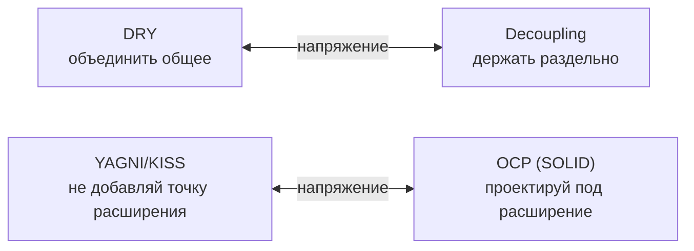

# DRY, KISS, YAGNI

## Содержание

- [Обзор](#обзор)
- [DRY — Don't Repeat Yourself](#dry--dont-repeat-yourself)
  - [Когда DRY вредит](#когда-dry-вредит)
- [KISS — Keep It Simple, Stupid](#kiss--keep-it-simple-stupid)
  - [Когда KISS обманывает](#когда-kiss-обманывает)
- [YAGNI — You Aren't Gonna Need It](#yagni--you-arent-gonna-need-it)
  - [Где YAGNI не применяют](#где-yagni-не-применяют)
- [Как принципы конфликтуют](#как-принципы-конфликтуют)
- [Типичные ошибки](#типичные-ошибки)
- [Interview-ready answer](#interview-ready-answer)

Три принципа дизайна, которые обычно разбирают в паре с [SOLID](./06-solid-in-go.md). В виде лозунгов они звучат безобидно: не повторяйся, делай проще, не пиши лишнего. Интересны они не формулировками, а границами применимости — тем, где каждый начинает вредить.

Итог слепого применения предсказуем в каждом случае: DRY без разбора связывает независимые части, KISS без разбора скатывается в примитивизм, YAGNI без разбора оставляет долг в решениях, которые потом не переиграть.

---

## Обзор

| Принцип | Суть | Что лечит | Главная опасность |
|---------|------|-----------|-------------------|
| DRY | Каждое знание — в одном месте | Рассинхронизацию дублей: поправили в одном месте, забыли в другом | Ложная абстракция: связывает код, который лишь выглядит одинаковым |
| KISS | Минимум когнитивной нагрузки | Избыточное проектирование и «умный» код | Подмена «просто» на «мало строк», а дальше примитивизм |
| YAGNI | Не строить того, что не нужно сейчас | Обобщения под несуществующие требования | Применение к необратимым решениям — схеме данных, контракту API |

Общее у них одно: все три говорят о стоимости изменения, а не об эстетике кода. И все три ломаются, когда применяются как правило без вопроса «что здесь меняется и как часто».

---

## DRY — Don't Repeat Yourself

> Каждый кусок знания должен иметь единственное, однозначное представление в системе.

Ключевое слово здесь — знание, а не строки кода. DRY требует, чтобы одно бизнес-правило, формула или константа не размазывались по кодовой базе так, что при изменении нужно править пять мест и одно из них легко пропустить.

```go
// ❌ Одно правило — ставка НДС — записано дважды и по-разному.
// При смене ставки правки нужны в обоих местах, и второе легко не заметить.
func priceWithTax(netMinor int64) int64 { return netMinor * 120 / 100 }
func invoiceTotal(netMinor int64) int64 { return netMinor + netMinor*20/100 }
```

```go
// ✅ Знание про ставку — в одном месте.
const VATRatePercent = 20

func withVAT(netMinor int64) int64 {
    return netMinor + netMinor*VATRatePercent/100
}
```

Суммы здесь в минорных единицах (`int64`), а не в числах с плавающей точкой: у денег своя причина так делать, разобранная в [проектировании REST API](./07-rest-api-design.md).

### Когда DRY вредит

Ошибка — применять DRY к совпадению формы вместо совпадения знания. Два фрагмента могут выглядеть одинаково сегодня и меняться по разным причинам завтра. Слияние их в одну функцию связывает независимые части: изменение, нужное одной, ломает другую.

```go
// ❌ Мнимое DRY: форматирование пользователя и товара объединили,
//    потому что код совпал по форме.
func formatLabel(name string, id int) string {
    return fmt.Sprintf("%s #%d", name, id)
}
// используется и для User, и для Product
```

Проблема вскрывается на первом же расхождении: товару понадобился артикул вместо идентификатора, пользователю — префикс `@`. В общую функцию приходят флаги и ветвление `if isProduct`, и она перестаёт выражать хоть какое-то одно правило. Правильным решением был дубль: `formatUserLabel` и `formatProductLabel` меняются независимо и не знают друг о друге.

Практические ориентиры:

- **Rule of three.** Абстракция вводится не на втором вхождении, а на третьем: к этому моменту видно, что действительно общее, а что совпало случайно.
- **AHA (Avoid Hasty Abstractions).** Дублирование обходится дешевле неправильной абстракции. Убрать дубль позже легко, расплести неверную абстракцию — дорого, потому что к ней уже привязаны все её потребители.
- **Отдельная осторожность на границах сервисов.** Общая библиотека, вынесенная между двумя bounded context, превращает их в [распределённый монолит](../service-topologies/02-typical-problems-and-how-to-mitigate-them.md): выпуск одного сервиса тянет за собой другой. Здесь дублирование обычно дешевле общей зависимости.

---

## KISS — Keep It Simple, Stupid

> Из двух решений, одинаково решающих задачу, предпочтительнее то, которое проще понять.

«Просто» здесь означает низкую нагрузку на читателя, а не меньшее число строк или файлов. Самый короткий код — с рефлексией, обобщениями ради обобщений, плотной однострочной записью — регулярно оказывается самым трудным для понимания и изменения.

```go
// ❌ «Гибкий» загрузчик настроек через рефлексию и теги — ради трёх полей.
type Loader struct{ /* ... reflection, custom tag parser, plugin hooks ... */ }
cfg := loader.Load(&Config{}, WithEnv(), WithDefaults(), WithValidator(v))
```

```go
// ✅ для 3 полей — плоско и очевидно
type Config struct {
    Port int
    DSN  string
    Env  string
}

func LoadConfig() (Config, error) {
    port, err := strconv.Atoi(os.Getenv("PORT"))
    if err != nil {
        return Config{}, fmt.Errorf("bad PORT: %w", err)
    }
    return Config{Port: port, DSN: os.Getenv("DSN"), Env: os.Getenv("ENV")}, nil
}
```

### Когда KISS обманывает

KISS не означает выбор самого примитивного варианта. Иногда чуть больше структуры даёт код, который проще изменить, — а значит, более простой по сути принципа:

- Настоящая граница — интерфейс на стыке домена и внешнего мира — снижает нагрузку при тестировании и замене. Это проще, чем конкретные вызовы, размазанные по всему коду.
- То, что просто в момент написания, перестаёт быть простым через полгода: обработчик, начавшийся с двадцати строк, доходит до четырёхсот. KISS оценивается по стоимости всего срока жизни кода, а не по первому впечатлению.

Рабочий критерий — не число строк, а объём того, что нужно удерживать в голове, чтобы безопасно изменить фрагмент. Чем меньше этот объём, тем проще код.

---

## YAGNI — You Aren't Gonna Need It

> Функциональность не реализуется, пока она действительно не понадобилась.

Принцип направлен против обобщений под несуществующие требования: параметров «на будущее», системы расширений под единственное расширение, абстрактной фабрики под одну реализацию, настраиваемости того, что никто не настраивает.

```go
// ❌ «На вырост»: интерфейс хранилища под другие базы, которых нет и не планируется.
type Storage interface { Save(User) error; Load(id int) (User, error) /* +8 методов */ }
type PostgresStorage struct{}  // единственная реализация — навсегда

// ✅ пока одна реализация — конкретный тип; интерфейс введём, когда появится вторая (или нужен мок)
type UserRepo struct{ db *pgxpool.Pool }
func (r *UserRepo) Save(ctx context.Context, u User) error { /* ... */ }
```

YAGNI экономит не столько время написания, сколько стоимость чтения. Написать лишний слой — работа на час; но дальше каждый, кто открывает этот код, обязан разобраться в слое и убедиться, что тот ничего не делает. Эта плата взимается с каждого читателя и каждый раз.

### Где YAGNI не применяют

YAGNI относится к обратимым решениям и не относится к решениям «в одну дверь» (`one-way door`). Критерий здесь — цена исправления позже. Если она мала, решение откладывается. Если позже придётся ломать чужие контракты или мигрировать данные, запас закладывается сразу:

| Решай сейчас (несмотря на YAGNI) | Отложи (YAGNI) |
|----------------------------------|----------------|
| Версионирование API/событий (поле `version`, [API versioning](./03-api-versioning.md)) | Второй транспорт, которого не просили |
| Схема БД, ключи, форматы идентификаторов | Обобщённый query-builder «на всякий» |
| Идемпотентность/дедуп там, где будут retries | Конфигурируемость констант, которые не меняют |
| Границы безопасности, аудит | Плагинная система под один плагин |

Короткая формула: YAGNI применяется к реализации, но не к необратимым решениям о контрактах и данных. Добавить поле `version` в событие сегодня — одна строка. Добавить его в схему, которую уже читают два десятка потребителей, — это согласование с каждым из них и период сосуществования двух форматов.

---

## Как принципы конфликтуют

Принципы противоречат друг другу и SOLID, и практическая ценность в том, чтобы уметь эти противоречия разрешать, а не применять все три сразу:



- **DRY против слабой связанности.** DRY тянет объединять, слабая связанность — разделять. Приоритет у связанности: если объединение свяжет части, которые должны развиваться порознь, — особенно через границу сервиса, — выигрывает дублирование.
- **YAGNI и KISS против OCP.** OCP требует проектировать под расширение, YAGNI запрещает закладывать расширяемость заранее. Разрешение даёт rule of three: точка расширения вводится на втором-третьем реальном случае, а не на предположении о нём. До этого остаётся конкретный код.
- **DRY против KISS.** Устранение дубля иногда добавляет слой косвенности — общий пакет, обобщённый тип, — который усложняет чтение. Если абстракция обходится дороже дубля по нагрузке на читателя, дубль и есть более простое решение.

Общее правило разрешения — вопрос «что здесь меняется и как часто». Части, которые меняются вместе, объединяются: DRY оправдан. Части, которые меняются по разным причинам, разделяются даже ценой дублирования.

---

## Типичные ошибки

- **DRY по форме, а не по знанию.** Похожий код объединили, независимые модули связали; на первом же расхождении общая функция обрастает флагами.
- **Абстракция на втором вхождении.** Rule of three не дождались, вынесли «общее», которое оказалось совпадением.
- **KISS как меньшее число строк.** Плотную однострочную запись или рефлексию приняли за простоту.
- **KISS как примитивизм.** Отказались от нужной границы, и связанность размазалась по всему коду вместо одного интерфейса.
- **YAGNI применён к необратимому.** Сэкономили на версионировании контракта или на схеме данных — получили ломающее изменение и миграцию.
- **Обратная крайность — задел на вырост.** Интерфейсы, расширения и настройки под будущее, которое не наступило.
- **Общая библиотека между сервисами ради DRY.** Результат — [распределённый монолит](../service-topologies/02-typical-problems-and-how-to-mitigate-them.md): связанные выпуски и согласование версий на каждый релиз.

---

## Interview-ready answer

**1. Что такое DRY и в чём частая ошибка?**

- Суть — каждое знание (правило, формула, константа) существует в одном месте, чтобы дубли не рассинхронизировались.
- Ошибка — применять принцип к совпадению формы, а не знания.
- Последствие — объединение связывает части, которые меняются по разным причинам, и абстракция обрастает флагами.
- Проверка — если два фрагмента меняются в разных задачах и разными людьми, знание в них разное.

**2. Когда дублирование лучше DRY?**

- Главный случай — фрагменты выглядят одинаково, но развиваются независимо.
- Формулировка принципа — дублирование дешевле неправильной абстракции: дубль убирается легко, абстракция расплетается тяжело.
- Отдельно про сервисы — общая библиотека между ними даёт распределённый монолит со связанными выпусками.
- Ориентир по времени — rule of three: абстракция на третьем вхождении, не на втором.

**3. KISS — это про количество строк?**

- Нет — про объём того, что нужно удерживать в голове, чтобы безопасно изменить код.
- Контрпример — рефлексия и плотная однострочная запись: строк меньше, понять труднее.
- Обратная крайность — примитивизм: отказ от нужной границы размазывает связанность по всему коду.
- Горизонт оценки — весь срок жизни кода, а не момент написания.

**4. YAGNI — не строить лишнего. Всегда?**

- Область применения — обратимые решения: то, что дёшево исправить позже, откладывается.
- Исключение — решения «в одну дверь»: версионирование контрактов и событий, схема данных, идемпотентность, границы безопасности.
- Причина исключения — цена не в написании кода, а в согласовании изменения с уже существующими потребителями.
- Пример разницы — поле `version` в событии сегодня стоит одну строку, завтра — период сосуществования двух форматов.

**5. Как принципы конфликтуют между собой?**

- DRY против слабой связанности — приоритет у связанности: объединять то, что должно развиваться порознь, нельзя.
- YAGNI и KISS против OCP — точка расширения вводится на втором-третьем реальном случае, а не на предположении.
- DRY против KISS — если слой косвенности дороже дубля по нагрузке на читателя, дубль проще.
- Критерий во всех спорах — что здесь меняется и как часто: меняющееся вместе объединяется, остальное разделяется.
