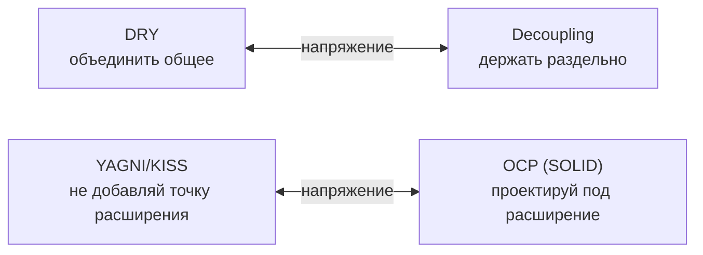

# DRY, KISS, YAGNI

Три «здравых» принципа дизайна, которые часто спрашивают в паре с [SOLID](./06-solid-in-go.md). Junior запоминает их как лозунги («не повторяйся», «делай проще», «не пиши лишнего»). Senior-угол — обратный: понимать, **где каждый принцип вредит** и как они конфликтуют между собой и с расширяемостью. Слепое применение DRY порождает связность, слепой KISS — примитивизм, слепой YAGNI — технический долг в необратимых решениях.

## Содержание

- [Обзор](#обзор)
- [DRY — Don't Repeat Yourself](#dry--dont-repeat-yourself)
  - [Когда DRY вредит](#когда-dry-вредит)
- [KISS — Keep It Simple, Stupid](#kiss--keep-it-simple-stupid)
  - [Когда KISS обманывает](#когда-kiss-обманывает)
- [YAGNI — You Aren't Gonna Need It](#yagni--you-arent-gonna-need-it)
  - [Где YAGNI не применяют](#где-yagni-не-применяют)
- [Как принципы конфликтуют](#как-принципы-конфликтуют)
- [Типичные ошибки](#типичные-ошибки)
- [Interview-ready answer](#interview-ready-answer)

---

## Обзор

| Принцип | Суть | Что лечит | Главная опасность |
|---------|------|-----------|-------------------|
| **DRY** | Каждое **знание** — в одном месте | рассинхрон дублей (поправил в одном, забыл в другом) | ложная абстракция: связывает код, который лишь *выглядит* одинаково |
| **KISS** | Минимум когнитивной нагрузки | over-engineering, «умный» код | путают «просто» с «мало строк» → примитивизм |
| **YAGNI** | Не строить того, что не нужно **сейчас** | спекулятивная обобщённость | применяют к необратимым решениям (схема, API) → долг |

Общая нить: все три — про **стоимость изменения**, а не про эстетику. И все три ломаются, когда их применяют как догму, без вопроса «а что здесь меняется и как часто».

---

## DRY — Don't Repeat Yourself

> Каждый кусок **знания** должен иметь единственное, однозначное представление в системе.

Ключевое слово — **знание**, а не «строки кода». DRY про то, чтобы одно бизнес-правило/формула/константа не размазывались по кодовой базе так, что при изменении нужно править в пяти местах и легко забыть одно.

```go
// ❌ одно правило (ставка НДС) продублировано — при смене ставки правим везде
func priceWithTax(net float64) float64   { return net * 1.20 }
func invoiceTotal(net float64) float64   { return net + net*0.20 }   // та же 20%, иначе записана
```

```go
// ✅ знание про НДС — в одном месте
const VATRate = 0.20

func withVAT(net float64) float64 { return net * (1 + VATRate) }
```

### Когда DRY вредит

Ошибка — применять DRY к **совпадению формы**, а не знания. Два фрагмента могут выглядеть одинаково **сейчас**, но меняться по разным причинам. Слияние в одну абстракцию **связывает** независимые части: изменение в одной ломает другую.

```go
// ❌ "DRY": объединили форматирование юзера и товара, потому что код похож
func formatLabel(name string, id int) string {
    return fmt.Sprintf("%s #%d", name, id)
}
// используется и для User, и для Product
```

Проблема вскрывается на первом же расхождении: товару понадобился SKU вместо id, юзеру — префикс `@`. В «общую» функцию начинают лезть флаги и `if isProduct` — абстракция гниёт, а связность растёт. Правильно было бы **оставить дубль**: `formatUserLabel` и `formatProductLabel` меняются независимо.

Практические ориентиры:
- **Rule of three** — не абстрагируй на втором вхождении, дождись третьего: к нему видно, что́ действительно общее, а что случайно совпало.
- **AHA (Avoid Hasty Abstractions)** — «дублирование дешевле неправильной абстракции» (Sandi Metz). Убрать дубль позже легко; расплести неверную абстракцию — дорого.
- **Особо осторожно на границах модулей/сервисов**: общая библиотека, вытащенная «чтобы не дублировать» между bounded context'ами, превращает их в [распределённый монолит](../service-topologies/02-typical-problems-and-how-to-mitigate-them.md) — деплой одного тянет за собой другой. Между сервисами дублирование часто **дешевле** общей зависимости.

---

## KISS — Keep It Simple, Stupid

> Из двух решений, одинаково решающих задачу, выбирай то, которое проще понять.

«Просто» здесь = **низкая когнитивная нагрузка на читателя**, а не «меньше строк» и не «поменьше файлов». Часто самый короткий код (рефлексия, generics ради generics, хитрый one-liner) — самый *сложный* для понимания и изменения.

```go
// ❌ "гибкий" загрузчик конфига через рефлексию и теги ради 3 полей
type Loader struct{ /* ... reflection, custom tag parser, plugin hooks ... */ }
cfg := loader.Load(&Config{}, WithEnv(), WithDefaults(), WithValidator(v))
```

```go
// ✅ для 3 полей — плоско и очевидно
type Config struct {
    Port int
    DSN  string
    Env  string
}

func LoadConfig() (Config, error) {
    port, err := strconv.Atoi(os.Getenv("PORT"))
    if err != nil {
        return Config{}, fmt.Errorf("bad PORT: %w", err)
    }
    return Config{Port: port, DSN: os.Getenv("DSN"), Env: os.Getenv("ENV")}, nil
}
```

### Когда KISS обманывает

KISS не значит «всегда самый примитивный вариант». Иногда чуть больше структуры — это **проще в изменении**, то есть более KISS по сути:

- Реальная граница (интерфейс на стыке домена и внешнего мира) снижает нагрузку при тестировании и замене — это проще, чем сквозные конкретные вызовы, размазанные по коду.
- «Простое» в моменте (всё в одном handler'е) становится «сложным» через полгода, когда там 400 строк. KISS оценивают по *стоимости жизненного цикла*, а не по первому впечатлению.

Критерий: считай не строки, а **сколько нужно держать в голове, чтобы безопасно изменить кусок**. Меньше держать — проще.

---

## YAGNI — You Aren't Gonna Need It

> Не реализуй функциональность, пока она реально не понадобилась.

Против **спекулятивной обобщённости**: параметры «на будущее», плагинные системы под один плагин, абстрактные фабрики под одну реализацию, конфигурируемость того, что никто не конфигурирует.

```go
// ❌ "на вырост": интерфейс хранилища под будущие БД, которых нет и не планируется
type Storage interface { Save(User) error; Load(id int) (User, error) /* +8 методов */ }
type PostgresStorage struct{}  // единственная реализация — навсегда

// ✅ пока одна реализация — конкретный тип; интерфейс введём, когда появится вторая (или нужен мок)
type UserRepo struct{ db *pgxpool.Pool }
func (r *UserRepo) Save(ctx context.Context, u User) error { /* ... */ }
```

YAGNI экономит не только время написания, но и стоимость **чтения и сопровождения**: каждый неиспользуемый слой абстракции читатель обязан понять и мысленно исключить.

### Где YAGNI не применяют

YAGNI — про **обратимый код**, а не про решения «в одну дверь» (one-way door). Если исправить позже дёшево — не делай сейчас. Если позже дорого/ломающе — заложи запас теперь:

| Решай сейчас (несмотря на YAGNI) | Отложи (YAGNI) |
|----------------------------------|----------------|
| Версионирование API/событий (поле `version`, [API versioning](./03-api-versioning.md)) | Второй транспорт, которого не просили |
| Схема БД, ключи, форматы идентификаторов | Обобщённый query-builder «на всякий» |
| Идемпотентность/дедуп там, где будут retries | Конфигурируемость констант, которые не меняют |
| Границы безопасности, аудит | Плагинная система под один плагин |

Формула: **YAGNI применяют к реализации, но не к необратимым архитектурным решениям.** Добавить `version` в событие сейчас — одна строка; ретрофитить его в схему, которую уже читают 20 consumer'ов, — недели.

---

## Как принципы конфликтуют

Senior-уровень — это не «применять все три», а разрешать их **противоречия друг с другом и с SOLID**:



- **DRY ↔ decoupling.** DRY тянет объединять, low coupling — разделять. Побеждает связность: если объединение свяжет части, которые должны эволюционировать порознь (особенно через границу сервиса), выбирай дублирование. «Prefer duplication over the wrong abstraction».
- **YAGNI/KISS ↔ OCP.** OCP говорит «проектируй под расширение», YAGNI — «не добавляй расширяемость впрок». Разрешение — **rule of three**: точку расширения (интерфейс, strategy) вводят, когда пришёл *второй-третий* реальный случай, а не заранее. До этого — конкретный код.
- **DRY ↔ KISS.** Порой устранение дубля добавляет слой косвенности (общий модуль, generics), который усложняет чтение. Если абстракция дороже дубля по когнитивной нагрузке — дубль проще (тот же AHA).

Общее правило разрешения: спрашивай **«что здесь меняется и как часто»**. Часто меняющееся вместе — объединять (DRY оправдан); меняющееся по разным причинам — разделять (даже ценой дубля).

---

## Типичные ошибки

- **DRY по форме, а не по знанию** — объединили похожий код, связали независимые модули; на первом расхождении абстракция обрастает флагами.
- **Абстракция на втором вхождении** — не дождались rule of three, вытащили «общее», которое оказалось совпадением.
- **KISS = меньше строк** — приняли хитрый нечитаемый one-liner/рефлексию за «простоту».
- **KISS → примитивизм** — отказались от нужной границы (интерфейс на стыке), получили размазанную по коду связность.
- **YAGNI применён к необратимому** — сэкономили на версионировании API/схеме → дорогой ретрофит и ломающие изменения.
- **Анти-YAGNI («на вырост»)** — интерфейсы/плагины/конфиги под гипотетическое будущее, которое не наступило.
- **Общая библиотека между сервисами ради DRY** — [распределённый монолит](../service-topologies/02-typical-problems-and-how-to-mitigate-them.md): связанные деплои, версионный ад.

---

## Interview-ready answer

**1. Что такое DRY и в чём частая ошибка?**

- DRY = каждое **знание** (правило, формула, константа) в одном месте, чтобы не рассинхронить дубли; ошибка — применять к совпадению *формы*, а не знания: объединение похожего кода связывает части, которые меняются по разным причинам.

**2. Когда дублирование лучше DRY?**

- Когда фрагменты лишь выглядят одинаково, но эволюционируют независимо — «prefer duplication over the wrong abstraction» (AHA); особенно через границу сервисов, где общая либа = распределённый монолит. Ориентир — rule of three.

**3. KISS — это про количество строк?**

- Нет, про когнитивную нагрузку: самый короткий код (рефлексия, умный one-liner) часто самый сложный для изменения; «просто» = мало держать в голове, чтобы безопасно поменять, оценивая по стоимости жизненного цикла, а не по первому впечатлению.

**4. YAGNI — не строить лишнего. Всегда?**

- YAGNI — про обратимый код: не добавляй абстракции/расширяемость впрок. Но к необратимым решениям (версионирование API/событий, схема БД, идемпотентность, безопасность) он не применяется — там дешевле заложить запас сейчас, чем ретрофитить.

**5. Как принципы конфликтуют между собой?**

- DRY тянет объединять — low coupling разделять (побеждает связность); YAGNI/KISS против точек расширения — OCP за них (разрешаем rule of three: seam вводим на 2–3-м реальном случае, не заранее); критерий во всех спорах — «что меняется вместе и как часто».
