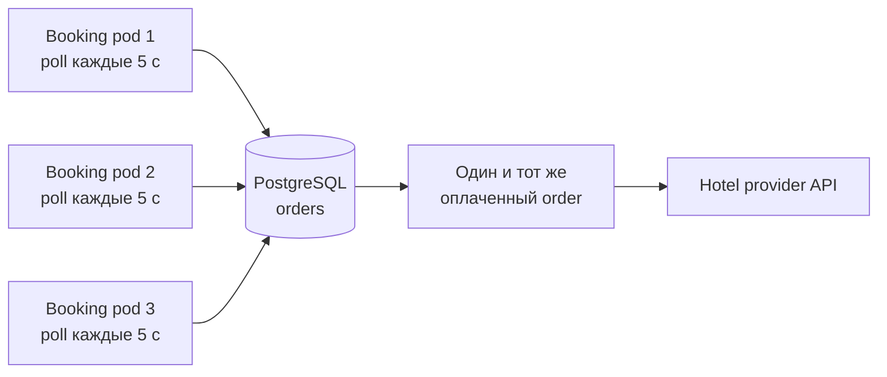
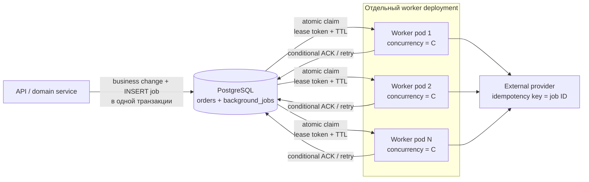

# DB-backed jobs: безопасные воркеры в нескольких pod

## Содержание

- [Какую проблему решаем](#какую-проблему-решаем)
- [Production-модель](#production-модель)
- [Таблица jobs](#таблица-jobs)
- [Атомарный claim](#атомарный-claim)
- [Цикл воркера на Go](#цикл-воркера-на-go)
- [ACK, retry и heartbeat](#ack-retry-и-heartbeat)
- [Как выбирать idle backoff, batch и concurrency](#как-выбирать-idle-backoff-batch-и-concurrency)
- [Когда PostgreSQL уже недостаточно](#когда-postgresql-уже-недостаточно)
- [Типичные ошибки](#типичные-ошибки)
- [Interview-ready answer](#interview-ready-answer)

Этот материал — про распространённую схему: несколько реплик сервиса каждые
несколько секунд находят в PostgreSQL заказы, которые пора обработать, забирают
batch и вызывают внешний API.

`time.Ticker` здесь не нужен: это не задача «запуститься каждые пять минут», а
очередь, которую нужно разбирать, пока в ней есть работа. Production-воркер ниже
работает как draining loop: сразу делает следующий claim после найденного batch
и включает отменяемую паузу только после пустого ответа БД.

---

## Какую проблему решаем

На одной реплике следующий код часто работает годами:

```text
каждые 5 секунд:
    SELECT 5 оплаченных заказов
    параллельно завершить бронирование
```

После масштабирования до трёх pod каждый выполняет тот же запрос:



Одинаковый interval не распределяет работу. Pod могут выбрать одну строку,
одновременно вызвать провайдера и затем попытаться сохранить разные результаты.
На малой нагрузке гонка редко заметна: запросы стартуют не идеально одновременно,
обработка быстрая, а внешний провайдер иногда сам дедуплицирует повтор.

Нужны две разные гарантии:

1. **Claim** — живые воркеры обычно получают разные задачи.
2. **Idempotency** — повтор после crash или timeout не создаёт второй внешний
   эффект.

Claim уменьшает число дублей, но не заменяет idempotency.

---

## Production-модель

Для таких задач удобна отдельная таблица `background_jobs`. Она хранит не
бизнес-состояние заказа, а протокол доставки: когда запускать, кто сейчас
владеет задачей, сколько было попыток и когда разрешён следующий retry.



API и воркер могут собираться из одного Go-бинарника, но в Kubernetes их удобнее
запускать отдельными `Deployment`: HTTP и фоновые задачи тогда независимо
масштабируются и не конкурируют за один connection pool.

Если задача создаётся вследствие изменения заказа, запись заказа и `INSERT job`
делают в одной транзакции. Иначе crash между двумя запросами оставит заказ без
задачи. Это тот же принцип, что у [transactional outbox](./09-saga-and-outbox.md),
только payload предназначен не брокеру, а локальному обработчику.

---

## Таблица jobs

Минимальная схема для PostgreSQL:

```sql
CREATE TABLE background_jobs (
    id              uuid PRIMARY KEY,
    kind            text        NOT NULL,
    aggregate_id    uuid        NOT NULL,
    dedupe_key      text,
    payload          jsonb       NOT NULL,

    status           text        NOT NULL DEFAULT 'pending'
        CHECK (status IN ('pending', 'running', 'retry', 'done', 'dead')),
    next_attempt_at  timestamptz NOT NULL DEFAULT now(),
    attempts         integer     NOT NULL DEFAULT 0,
    max_attempts     integer     NOT NULL DEFAULT 10,

    lease_owner      text,
    lease_token      uuid,
    lease_until      timestamptz,
    last_error       text,

    created_at       timestamptz NOT NULL DEFAULT now(),
    updated_at       timestamptz NOT NULL DEFAULT now(),

    UNIQUE (kind, dedupe_key)
);

CREATE INDEX background_jobs_ready_idx
    ON background_jobs (next_attempt_at, created_at)
    WHERE status IN ('pending', 'retry');

CREATE INDEX background_jobs_expired_lease_idx
    ON background_jobs (lease_until)
    WHERE status = 'running';
```

Назначение ключевых полей:

| Поле | Зачем |
|---|---|
| `next_attempt_at` | delayed job и retry без постоянного немедленного повтора |
| `attempts` / `max_attempts` | ограничение повторов и перевод poison job в `dead` |
| `lease_owner` | диагностика: какой pod забрал задачу |
| `lease_token` | защита от позднего ACK старого владельца |
| `lease_until` | после crash задача автоматически снова становится доступной |
| `dedupe_key` | повторная команда не создаёт вторую логическую задачу |

`dedupe_key` задаёт бизнес, например `finish-order:<order-id>:v1`. `NULL`
разрешён для задач, которым дедупликация при enqueue не нужна.

---

## Атомарный claim

Claim должен одновременно выбрать и пометить строки. В PostgreSQL это удобно
сделать одним statement:

```sql
WITH candidates AS (
    SELECT id
    FROM background_jobs
    WHERE next_attempt_at <= now()
      AND (
          status IN ('pending', 'retry')
          OR (status = 'running' AND lease_until < now())
      )
    ORDER BY next_attempt_at, created_at
    FOR UPDATE SKIP LOCKED
    LIMIT $1
)
UPDATE background_jobs AS j
SET status      = 'running',
    lease_owner = $2,
    lease_token = $3,
    lease_until = now() + make_interval(secs => $4),
    attempts    = attempts + 1,
    updated_at  = now()
FROM candidates AS c
WHERE j.id = c.id
RETURNING j.id, j.kind, j.aggregate_id, j.payload,
          j.attempts, j.max_attempts, j.lease_token;
```

Здесь:

- `FOR UPDATE SKIP LOCKED` не заставляет pod ждать строки, уже выбранные другим
  pod;
- `UPDATE ... RETURNING` фиксирует владельца до того, как задача попадёт в Go;
- транзакция заканчивается сразу после claim — внешний API вызывается **без**
  открытой транзакции;
- время аренды вычисляет PostgreSQL, поэтому решение не зависит от расхождения
  часов между pod.

Один statement атомарен и без ручного `BEGIN`. Если сначала сделать отдельный
`SELECT ... FOR UPDATE`, а затем `UPDATE`, оба запроса обязаны выполняться в одной
явной транзакции: row lock снимается на `COMMIT` или `ROLLBACK`.

---

## Цикл воркера на Go

Ниже сокращённый каркас. Детали подключения к PostgreSQL и парсинга payload
опущены, но границы claim и обработки показаны полностью.

```go
type Job struct {
    ID          uuid.UUID
    Kind        string
    AggregateID uuid.UUID
    Payload     []byte
    Attempts    int
    MaxAttempts int
    LeaseToken  uuid.UUID
}

type Repository interface {
    Claim(ctx context.Context, limit int, owner string, token uuid.UUID,
        leaseTTL time.Duration) ([]Job, error)
    Ack(ctx context.Context, id, token uuid.UUID) error
    Fail(ctx context.Context, id, token uuid.UUID,
        delay time.Duration, cause error, permanent bool) error
}

type Handler interface {
    // idempotencyKey нужно передать во внешний API или использовать
    // в собственной таблице дедупликации.
    Handle(ctx context.Context, job Job, idempotencyKey string) error
}

type Worker struct {
    repo           Repository
    handler        Handler
    log            *slog.Logger
    owner          string
    batchSize      int
    concurrency    int
    leaseTTL       time.Duration
    handlerTimeout time.Duration
    persistTimeout time.Duration
    minIdleBackoff time.Duration
    maxIdleBackoff time.Duration
}

func (w *Worker) Run(ctx context.Context) error {
    idleBackoff := w.minIdleBackoff

    for ctx.Err() == nil {
        token := uuid.New()
        jobs, err := w.repo.Claim(
            ctx, w.batchSize, w.owner, token, w.leaseTTL,
        )
        if err != nil {
            if !wait(ctx, withJitter(time.Second)) {
                break
            }
            continue
        }

        if len(jobs) == 0 {
            if !wait(ctx, withJitter(idleBackoff)) {
                break
            }
            idleBackoff = min(idleBackoff*2, w.maxIdleBackoff)
            continue
        }

        idleBackoff = w.minIdleBackoff
        w.processBatch(ctx, jobs)

        // Полный batch означает, что backlog, вероятно, ещё есть.
        // Забираем следующую пачку сразу, без фиксированной паузы.
        if len(jobs) == w.batchSize {
            continue
        }
    }
    return ctx.Err()
}

func (w *Worker) processBatch(ctx context.Context, jobs []Job) {
    sem := make(chan struct{}, w.concurrency)
    var wg sync.WaitGroup

    for _, job := range jobs {
        select {
        case sem <- struct{}{}:
        case <-ctx.Done():
            wg.Wait()
            return // незапущенные jobs вернутся после lease_until
        }

        wg.Add(1)
        go func(job Job) {
            defer wg.Done()
            defer func() { <-sem }()
            w.processOne(ctx, job)
        }(job)
    }
    wg.Wait()
}

func (w *Worker) processOne(parent context.Context, job Job) {
    ctx, cancel := context.WithTimeout(parent, w.handlerTimeout)
    defer cancel()

    err := w.handler.Handle(ctx, job, job.ID.String())
    if err == nil {
        ackCtx, ackCancel := context.WithTimeout(
            context.WithoutCancel(parent), w.persistTimeout,
        )
        defer ackCancel()
        if ackErr := w.repo.Ack(ackCtx, job.ID, job.LeaseToken); ackErr != nil {
            w.log.Error("ack job", "job_id", job.ID, "err", ackErr)
        }
        return
    }

    delay := retryDelay(job.Attempts)
    permanent := isPermanent(err)
    retryCtx, retryCancel := context.WithTimeout(
        context.WithoutCancel(parent), w.persistTimeout,
    )
    defer retryCancel()
    if retryErr := w.repo.Fail(
        retryCtx, job.ID, job.LeaseToken, delay, err, permanent,
    ); retryErr != nil {
        w.log.Error("persist job failure", "job_id", job.ID, "err", retryErr)
    }
}

func wait(ctx context.Context, delay time.Duration) bool {
    timer := time.NewTimer(delay)
    defer timer.Stop()
    select {
    case <-timer.C:
        return true
    case <-ctx.Done():
        return false
    }
}

func withJitter(delay time.Duration) time.Duration {
    if delay <= 0 {
        return 0
    }
    spread := delay / 5 // итоговый диапазон: примерно ±10%
    if spread == 0 {
        return delay
    }
    return delay - spread/2 +
        time.Duration(rand.Int64N(int64(spread)+1))
}
```

Это не расписание и не `ticker`: следующий claim зависит от состояния очереди.
Пока задачи находятся, цикл работает без искусственной паузы. Когда таблица
пуста, idle backoff растёт, например от `50 мс` до `2 с`, и сбрасывается после
первой найденной задачи.

Для `Ack` и `Fail` используется короткий отдельный timeout.
`context.WithoutCancel` позволяет попытаться записать уже выполненный результат
даже во время shutdown, а `persistTimeout` не даёт ждать БД бесконечно. Ошибки
этих операций обязательно логируются и считаются в метриках. `isPermanent` —
доменная классификация ошибки: например, невалидный payload повторять бессмысленно,
а timeout провайдера обычно считается временной ошибкой.

`batchSize` обычно делают не больше `concurrency`: иначе часть уже claimed задач
ждёт в памяти, а её lease продолжает истекать.

---

## ACK, retry и heartbeat

ACK разрешён только текущему владельцу с ещё действующей арендой:

```sql
UPDATE background_jobs
SET status = 'done',
    lease_owner = NULL,
    lease_token = NULL,
    lease_until = NULL,
    updated_at = now()
WHERE id = $1
  AND status = 'running'
  AND lease_token = $2
  AND lease_until > now();
```

Если изменено `0` строк, воркер потерял lease и не имеет права перетирать более
новое состояние.

Временная ошибка планирует повтор с exponential backoff и jitter; постоянная
ошибка или исчерпание попыток переводит задачу в `dead`:

```sql
UPDATE background_jobs
SET status = CASE
        WHEN $5 OR attempts >= max_attempts THEN 'dead'
        ELSE 'retry'
    END,
    next_attempt_at = CASE
        WHEN $5 OR attempts >= max_attempts THEN next_attempt_at
        ELSE now() + make_interval(secs => $3)
    END,
    lease_owner = NULL,
    lease_token = NULL,
    lease_until = NULL,
    last_error = left($4, 2000),
    updated_at = now()
WHERE id = $1
  AND status = 'running'
  AND lease_token = $2
  AND lease_until > now();
```

Пример расчёта delay на Go:

```go
func retryDelay(attempt int) time.Duration {
    const (
        base     = 5 * time.Second
        maxDelay = 15 * time.Minute
    )

    exponent := max(attempt-1, 0)
    exponent = min(exponent, 10) // защита от переполнения shift
    delay := min(base*time.Duration(1<<exponent), maxDelay)

    // ±10%; глобальные функции math/rand/v2 безопасны конкурентно.
    jitter := time.Duration(rand.Int64N(int64(delay/5)+1)) - delay/10
    return delay + jitter
}
```

Для короткой операции проще выбрать `handlerTimeout < leaseTTL`. Например,
timeout обработчика `20 с`, lease `30 с`. Если работа легитимно длится дольше,
воркер раз в `leaseTTL / 3` продлевает аренду:

```sql
UPDATE background_jobs
SET lease_until = now() + make_interval(secs => $3),
    updated_at = now()
WHERE id = $1
  AND status = 'running'
  AND lease_token = $2
  AND lease_until > now();
```

Ноль изменённых строк означает потерю lease: локальный handler отменяется. Но
даже heartbeat не даёт exactly-once. Возможен crash после успешного вызова
провайдера, но до ACK:

```text
external effect succeeded → worker crashed → lease expired → retry
```

Поэтому во внешний запрос передаётся стабильный idempotency key, например ID
job. Если провайдер его не поддерживает, нужна сверка результата по стабильному
business ID или отдельный [reconciliation](./02-architecture-patterns.md), а не
надежда на lease.

---

## Как выбирать idle backoff, batch и concurrency

У параметров разные задачи:

| Параметр | На что влияет | Практическое правило |
|---|---|---|
| `idle backoff` | задержка пустой очереди и число пустых запросов к БД | увеличивать между пустыми claim, сбрасывать при появлении работы, добавлять jitter |
| `batchSize` | цена одного claim и число заранее арендованных задач | начать с `batchSize = concurrency` |
| `concurrency` | реальная нагрузка на БД и внешний сервис | ограничивать connection pool и rate limit провайдера |
| replicas | общая пропускная способность и отказоустойчивость | масштабировать по backlog и возрасту старейшей задачи |
| `leaseTTL` | когда задачу разрешено забрать после crash | больше нормального runtime либо heartbeat |

Фиксированная пауза не регулирует throughput надёжно. Если после каждого batch
спать пять секунд, backlog растёт даже при свободных ресурсах. Правильнее
разбирать доступные batch подряд и включать adaptive backoff только после пустой
выборки. Неполный batch быстро приведёт к следующей пустой выборке.

Грубая оценка capacity следует из закона Литтла:

```text
capacity одного pod ≈ concurrency / средняя длительность job
общая capacity      ≈ replicas × concurrency / средняя длительность job
```

Например, `concurrency = 5`, средняя длительность `10 с`:

```text
1 pod  ≈ 5 / 10 = 0.5 job/s
4 pod  ≈ 4 × 5 / 10 = 2 job/s
```

Это оценка по среднему для устойчивого потока. Пиковую ёмкость проверяют
нагрузочным тестом с реальными лимитами PostgreSQL и провайдера. Условие
устойчивости простое: средняя скорость выполнения должна быть выше скорости
поступления, иначе очередь растёт без границы.

Для autoscaling полезны:

- `jobs_ready` — сколько задач готовы к запуску;
- `oldest_ready_job_age_seconds` — сколько ждёт самая старая готовая задача;
- `jobs_in_flight`, `job_duration_seconds`, success/retry/dead rate;
- saturation connection pool и число `429`/timeout внешнего провайдера.

Возраст старейшей задачи обычно лучше одной глубины очереди: он напрямую
показывает, нарушается ли обещанное время обработки.

---

## Когда PostgreSQL уже недостаточно

DB-backed queue — нормальный production-вариант, когда:

- поток умеренный, а PostgreSQL уже является source of truth;
- важна транзакционная запись бизнес-состояния и job;
- команда не хочет вводить брокер только ради одной очереди;
- допустима polling latency в десятки или сотни миллисекунд.

Переход к SQS, RabbitMQ, Redis Streams или Kafka оправдан, когда polling и claim
заметно конкурируют с продуктовым трафиком, нужен очень большой поток, много
независимых consumers или broker-specific возможности. Выбор вариантов разобран
в [Distributed Task Queue](../../05-system-design/interview-cases/05-task-queue.md)
и [сравнении брокеров](../../07-message-brokers-and-streaming/00-comparison.md).

Брокер меняет механизм доставки, но не отменяет timeout, bounded concurrency,
retry/DLQ, observability и idempotency внешних эффектов.

---

## Типичные ошибки

1. **Каждый pod делает обычный `SELECT`.** Все реплики могут взять один order.
2. **`FOR UPDATE SKIP LOCKED` выполняется отдельно от изменения статуса.** После
   окончания statement или транзакции lock исчезает, а задача снова доступна.
3. **Транзакция держится во время внешнего HTTP-вызова.** Долгие row locks и
   занятые соединения начинают тормозить основной сервис.
4. **Статус изменяется после claim неусловным `UPDATE`.** Старый воркер после
   истечения lease может затереть результат нового.
5. **Lease короче нормальной работы и не продлевается.** Два воркера легально
   выполняют одну задачу одновременно.
6. **Retry происходит сразу.** Постоянная ошибка создаёт retry storm.
7. **Pod забирает batch намного больше concurrency.** Задачи стареют уже после
   claim, ожидая локальную goroutine.
8. **Worker живёт только внутри API deployment.** Его нельзя независимо
   масштабировать, а фоновые запросы отбирают ресурсы у HTTP.
9. **Нет idempotency у внешнего эффекта.** Crash между effect и ACK приводит к
   повтору даже при идеальном claim.
10. **Есть только логи.** Без queue age, retries и dead jobs проблема становится
    видна по зависшим заказам пользователей.

---

## Interview-ready answer

> Для небольшой очереди я могу использовать PostgreSQL и несколько stateless
> worker pod. Задачи хранятся отдельно от бизнес-статуса. Каждый pod одним
> `UPDATE ... FROM (SELECT ... FOR UPDATE SKIP LOCKED) RETURNING` атомарно
> забирает ограниченный batch и записывает lease token. Транзакция завершается до
> внешнего вызова. ACK, retry и heartbeat делают условным по token, поэтому
> просроченный воркер не перезапишет нового владельца.
>
> Доставка остаётся at-least-once: crash после внешнего эффекта и до ACK даст
> повтор. Поэтому внешний вызов получает стабильный idempotency key, а для
> неизвестного результата есть reconciliation. Concurrency ограничивается
> лимитами БД и провайдера, полный batch разбирается без паузы, а autoscaling
> смотрит на backlog и возраст самой старой задачи.
