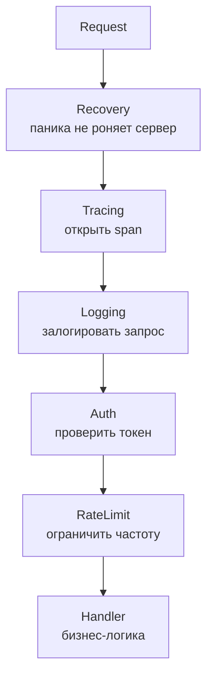
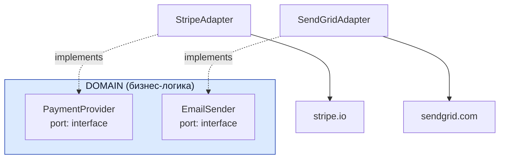
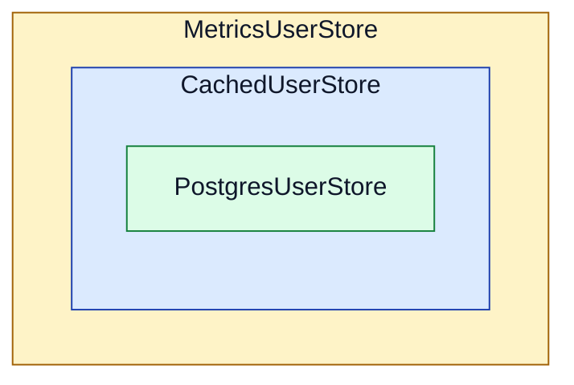

# Обёртки поведения

## Содержание

- [Middleware](#middleware)
- [Adapter](#adapter)
- [Decorator](#decorator)
- [Middleware vs Adapter vs Decorator](#middleware-vs-adapter-vs-decorator)
- [Антипаттерны](#антипаттерны)
- [Чек-лист](#чек-лист)

Три паттерна с общей идеей: обернуть существующий код дополнительным поведением, не меняя его реализацию. Все три опираются на интерфейсы или функциональные типы.

- **Middleware** — цепочка обёрток вокруг обработчика HTTP или gRPC.
- **Adapter** — изоляция внешнего SDK за интерфейсом домена.
- **Decorator** — расширение поведения через тот же интерфейс, что и у обёрнутого объекта.

Структурно они выглядят одинаково — везде объект держит ссылку на следующий и что-то делает до и после вызова, — но отвечают на разные вопросы. Middleware добавляет техническую обвязку к обработке запроса. Adapter переводит чужой интерфейс на язык домена. Decorator наращивает поведение поверх одного и того же интерфейса.

---

## Middleware

Идея: обернуть обработчик общей технической логикой без изменения кода handler'а.

```go
// Тип middleware
type Middleware func(http.Handler) http.Handler

// Logging
func Logging(log *slog.Logger) Middleware {
    return func(next http.Handler) http.Handler {
        return http.HandlerFunc(func(w http.ResponseWriter, r *http.Request) {
            start := time.Now()
            rw := &responseWriter{ResponseWriter: w}
            next.ServeHTTP(rw, r)
            log.Info("request",
                "method", r.Method,
                "path", r.URL.Path,
                "status", rw.status,
                "duration", time.Since(start),
            )
        })
    }
}

// Auth
func Auth(verifier TokenVerifier) Middleware {
    return func(next http.Handler) http.Handler {
        return http.HandlerFunc(func(w http.ResponseWriter, r *http.Request) {
            token := r.Header.Get("Authorization")
            claims, err := verifier.Verify(token)
            if err != nil {
                http.Error(w, "unauthorized", http.StatusUnauthorized)
                return
            }
            ctx := context.WithValue(r.Context(), claimsKey, claims)
            next.ServeHTTP(w, r.WithContext(ctx))
        })
    }
}
```

### Цепочка middleware



### Порядок middleware важен

```go
// Правильный порядок
chain := Alice(
    Recovery(),       // 1. ловить любые паники
    Tracing(),        // 2. трассировать запрос (включая Auth ошибки)
    Logging(log),     // 3. логировать запрос
    Auth(verifier),   // 4. проверить auth
    RateLimit(limiter), // 5. лимит per user (после auth — знаем кто)
)
http.Handle("/api/orders", chain(ordersHandler))
```

**Почему такой порядок:**
- `Recovery` — внешний, чтобы поймать panic из любого внутреннего middleware
- `Tracing/Logging` — раньше Auth, чтобы видеть auth failures в логах
- `Auth` — раньше Rate limit, чтобы лимитировать per-user, не per-IP
- `Rate limit` — последний из middleware, ближе всего к handler

### Что middleware делает хорошо

- **Cross-cutting concerns:** logging, tracing, metrics, auth, rate limit, request ID
- **Recovery:** panic не должна валить сервер
- **Response normalization:** добавить headers (CORS, security)
- **Compression:** gzip перед отправкой

### Чего middleware делать не должно

- **Бизнес-логика.** Скидка для постоянных клиентов — работа обработчика, а не обвязки вокруг него.
- **Проверка доменных правил.** Она принадлежит слою сценариев, где известен контекст операции.
- **Обращения к хранилищу и брокеру.** Их место в репозитории и публикаторе.

Причина запрета не в чистоте слоёв. Middleware применяется ко всем маршрутам цепочки сразу, и бизнес-правило внутри него оказывается спрятано от того, кто читает обработчик: в коде сценария его не видно, а срабатывает оно всё равно.

### gRPC interceptors

В gRPC та же идея называется перехватчиками (`interceptors`):

```go
func LoggingInterceptor(log *slog.Logger) grpc.UnaryServerInterceptor {
    return func(ctx context.Context, req any, info *grpc.UnaryServerInfo, handler grpc.UnaryHandler) (any, error) {
        start := time.Now()
        resp, err := handler(ctx, req)
        log.Info("grpc request",
            "method", info.FullMethod,
            "duration", time.Since(start),
            "error", err,
        )
        return resp, err
    }
}

// Применение
server := grpc.NewServer(
    grpc.ChainUnaryInterceptor(LoggingInterceptor(log), AuthInterceptor(verifier)),
)
```

Тот же паттерн, разные сигнатуры.

---

## Adapter

Идея: привести внешний API к внутреннему интерфейсу, чтобы внешний SDK не проникал в домен.

```
Внешний мир          Adapter               Домен
─────────────────    ──────────────────    ─────────────────
stripe.Client   →    StripeAdapter    →    PaymentProvider
sendgrid.Client →    SendGridAdapter  →    EmailSender
s3.Client       →    S3Adapter        →    FileStorage
```

```go
// Интерфейс домена (не знает о Stripe)
type PaymentProvider interface {
    Charge(ctx context.Context, req ChargeRequest) (ChargeResult, error)
}

// Адаптер (знает о Stripe, изолирует детали)
type StripeAdapter struct {
    client *stripe.Client
}

func (a *StripeAdapter) Charge(ctx context.Context, req ChargeRequest) (ChargeResult, error) {
    params := &stripe.ChargeParams{
        Amount:   stripe.Int64(req.Amount.Cents()),
        Currency: stripe.String(string(req.Currency)),
        Source:   &stripe.SourceParams{Token: stripe.String(req.Token)},
    }
    ch, err := a.client.Charges.New(params)
    if err != nil {
        return ChargeResult{}, mapStripeError(err)  // нормализация ошибок
    }
    return ChargeResult{ID: ch.ID, Status: mapStripeStatus(ch.Status)}, nil
}
```

### Что адаптер делает обязательно

**1. Конвертирует типы** (domain model ↔ external model).

Stripe оперирует своими типами: `*stripe.ChargeParams`, `*stripe.Charge`. Domain имеет свои: `ChargeRequest`, `ChargeResult`. Адаптер mappит между ними.

**2. Нормализует ошибки** (stripe.Error → domain.PaymentError).

Внешний SDK возвращает свои error types. Адаптер mappит на стандартные domain errors:

```go
func mapStripeError(err error) error {
    var stripeErr *stripe.Error
    if errors.As(err, &stripeErr) {
        switch stripeErr.Code {
        case "card_declined":
            return domain.ErrPaymentDeclined
        case "insufficient_funds":
            return domain.ErrInsufficientFunds
        }
    }
    return fmt.Errorf("stripe: %w", err)
}
```

**3. Изолирует изменения внешнего API в одном месте.**

Если Stripe выпустит v2 SDK или понадобится смена на PayPal — изменения только в адаптере. Domain и use cases не знают.

### Когда adapter оправдан

- **Внешний платный сервис** (Stripe, SendGrid, Twilio) — его контракт меняется не по вашему графику, а в тестах его нужно подменять.
- **Риск привязки к поставщику** — смена провайдера должна оставаться локальной правкой.
- **SDK со своими типами** — домен обязан говорить на своём языке, а не на языке чужой библиотеки.

### Когда adapter лишний

- **Тонкая обёртка над стандартной библиотекой.** Использовать `net/http` напрямую обычно нормально: этот контракт стабилен.
- **Внутренний сервис своей же команды** с контролируемым контрактом.
- **Разовая интеграция**, которая не меняется и не требует изоляции в тестах.

### Hexagonal architecture

Adapter — центральный паттерн гексагональной архитектуры (`ports and adapters`). Домен объявляет порты — интерфейсы, описывающие его потребности, — а адаптеры соединяют эти порты с внешним миром. Подробнее — в [Architecture Patterns](../02-architecture-patterns.md).



---

## Decorator

Идея: добавить поведение к существующей реализации без изменения её кода, оборачивая через тот же интерфейс.



```go
// Кеш-декоратор
type CachedUserStore struct {
    next  UserStore
    cache Cache
    ttl   time.Duration
}

func (s *CachedUserStore) GetByID(ctx context.Context, id int64) (User, error) {
    key := fmt.Sprintf("user:%d", id)
    if user, ok := s.cache.Get(key); ok {
        return user.(User), nil
    }
    user, err := s.next.GetByID(ctx, id)
    if err != nil {
        return User{}, err
    }
    s.cache.Set(key, user, s.ttl)
    return user, nil
}

// Метрики-декоратор
type InstrumentedUserStore struct {
    next    UserStore
    metrics Metrics
}

func (s *InstrumentedUserStore) GetByID(ctx context.Context, id int64) (User, error) {
    start := time.Now()
    user, err := s.next.GetByID(ctx, id)
    s.metrics.RecordDuration("user_store.get_by_id", time.Since(start), err != nil)
    return user, err
}

// Сборка в main.go
var store UserStore = postgres.NewUserStore(db)
store = &CachedUserStore{next: store, cache: redisCache, ttl: 5 * time.Minute}
store = &InstrumentedUserStore{next: store, metrics: metrics}
```

### Типичные применения decorator

| Поведение | Описание |
|---|---|
| Cache | Кешировать результат в Redis/memory |
| Retry | Повторить при transient ошибке |
| Circuit breaker | Не вызывать при высоком error rate |
| Tracing | Добавить span вокруг вызова |
| Metrics | Замерить latency и error rate |
| Logging | Залогировать входные/выходные данные |

### Полный пример — decorator stack

```go
// main.go

// 1. Базовая реализация
var store UserStore = postgres.NewUserStore(db)

// 2. Inner decorators первыми, outer — потом
// Tracing — внутри (логирует только реальные DB calls, не cache hits)
store = &TracedUserStore{next: store, tracer: tracer}

// Retry — следующий слой (ретраит только при DB ошибке, не при cache miss)
store = &RetryingUserStore{next: store, maxRetries: 3}

// Cache — следующий (если есть в cache — не вызывает retry/trace)
store = &CachedUserStore{next: store, cache: redisCache, ttl: 5 * time.Minute}

// Metrics — outer (мерит total time, включая cache hit)
store = &InstrumentedUserStore{next: store, metrics: metrics}

// Теперь store обладает всеми поведениями
```

**Порядок важен:** что снаружи — то выполняется первым. Cache outside retry — cache hit не вызывает retry. Cache inside retry — retry будет включать cache lookup.

### Когда decorator оправдан

- **Одно поведение нужно нескольким реализациям интерфейса.** Кеш для `UserStore`, `OrderStore` и `ProductStore` пишется по одной схеме.
- **Набор поведений различается по окружениям.** В тестах достаточно базовой реализации с метриками, в эксплуатации к ней добавляются кеш, повторы и трассировка — состав меняется одной строкой сборки.
- **Расширение не трогает базовый код.** Прерыватель цепи добавляется новым типом, а не правкой репозитория.

### Когда decorator избыточен

- **Поведение нужно ровно в одном месте.** Оно пишется прямо там, где нужно.
- **Декоратор без собственной логики.** Обёртка, которая только печатает строку в лог, добавляет уровень вложенности и ничего не даёт взамен.

### Decorator vs Middleware

Разница между ними одна, и она в интерфейсе:

- **Middleware** работает с фиксированной сигнатурой обработчика запроса (`http.Handler` или его аналог в gRPC), поэтому любая обёртка совместима с любой другой и они складываются в цепочку произвольной длины.
- **Decorator** работает с любым интерфейсом домена, у которого могут быть какие угодно методы, и обёртка обязана реализовать их все.

По сути middleware — это decorator, специализированный под один конкретный интерфейс.

---

## Middleware vs Adapter vs Decorator

Все три — обёртки, но задачи у них разные:

| | Middleware | Adapter | Decorator |
|---|---|---|---|
| Цель | Сквозная обвязка обработки запроса | Перевод чужого контракта на язык домена | Наращивание поведения |
| Интерфейс | `http.Handler` или обработчик gRPC | Интерфейс домена, который объявляем мы | Существующий интерфейс домена |
| Композиция | Цепочка произвольной длины | Один слой между внешним и внутренним | Стек вложенных обёрток |
| Где находится | Транспортный слой | Между транспортом и доменом | Любой слой |
| Примеры | Логирование, аутентификация, лимит частоты | `StripeAdapter`, `S3Adapter` | Кеширующий и измеряющий репозиторий |

**Как выбирать:**
- Обвязка вокруг обработки HTTP-запроса — middleware.
- Изоляция внешнего SDK — adapter.
- Кеш, повторы или метрики вокруг репозитория — decorator.

В работающем коде они не конкурируют, а стоят на разных участках пути запроса:
```
Request → [Middleware: auth, log] → Handler → Service → [Decorator: cache, metrics] → Repository → [Adapter: pg, redis] → External
```

---

## Антипаттерны

**1. Бизнес-логика в middleware.**
```go
// ❌ Скидка для VIP в middleware
func VIPDiscount(next http.Handler) http.Handler {
    return http.HandlerFunc(func(w http.ResponseWriter, r *http.Request) {
        if isVIP(r) { ... apply discount ... }
        next.ServeHTTP(w, r)
    })
}
```
Правило принадлежит сценарию использования: там оно видно тому, кто читает код операции, и там его можно проверить модульным тестом без поднятия HTTP-сервера.

**2. Decorator без поведения.**
```go
// ❌ Декоратор который просто прокидывает вызов
type LoggingRepo struct { next Repo }
func (r *LoggingRepo) Get(id int) (User, error) {
    log.Println("Get called")  // ← это единственная польза?
    return r.next.Get(id)
}
```
Такой декоратор добавляет уровень вложенности при отладке и не добавляет информации: то же самое даёт middleware логирования уровнем выше.

**3. Adapter без нормализации ошибок.**
```go
// ❌ Возвращает stripe.Error напрямую
func (a *StripeAdapter) Charge(...) (Result, error) {
    return ..., err  // вот этот err — *stripe.Error, протекает в domain
}
```
Домен не должен знать о типах ошибок Stripe. Если `*stripe.Error` доходит до сценария, вся изоляция бесполезна: смена провайдера потребует правок в обработке ошибок по всему коду. Преобразование ошибок — обязательная часть адаптера, а не необязательное улучшение.

**4. Глубокий decorator stack.**
```go
store := base
store = decorator1(store)
store = decorator2(store)
// ... 8 декораторов
```
Стек трассировки при этом состоит преимущественно из обёрток, а поиск слоя, изменившего поведение, идёт перебором. От четырёх декораторов и больше обычно выгоднее явный сервис с переданными зависимостями: порядок вызовов написан в коде, а не собирается из порядка обёртывания.

**5. Middleware, читающий тело запроса.**
```go
// ❌ Прочитал body, не вернул назад
func ParseJSON(next http.Handler) http.Handler { ... }
```
`http.Request.Body` — поток, читаемый один раз. Если middleware его вычитал, обработчик получит пустое тело и вернёт ошибку разбора, причём причина будет не в его коде. Прочитанное тело нужно вернуть на место: `r.Body = io.NopCloser(bytes.NewReader(body))`. Отдельно стоит помнить о размере — тело произвольной длины полностью попадает в память, поэтому чтение ограничивают через `http.MaxBytesReader`.

**6. Adapter скрывающий критичные ошибки.**
```go
// ❌ Маппит все Stripe errors на одно "PaymentFailed"
func mapStripeError(err error) error {
    return errors.New("payment failed")  // потеряли тип, нельзя retry vs decline
}
```
Разные ошибки требуют разных действий: отказ банка означает «показать пользователю и не повторять», а сетевой сбой — «повторить через несколько секунд». Схлопнув их в одну ошибку, адаптер лишает вызывающий код возможности выбрать правильную реакцию.

---

## Чек-лист

```
□ Middleware занимается только технической логикой?
□ Middleware chain в правильном порядке (Recovery first)?
□ Adapter нормализует ошибки внешнего API на domain types?
□ Adapter изолирует все обращения к внешнему SDK в одном файле?
□ Decorator stack меньше 4 уровней?
□ Каждый decorator имеет реальное поведение, не только pass-through?
□ Порядок decorator'ов осмысленный (cache outside / inside retry в зависимости от семантики)?
```

---

См. также:
- [01-dependencies-and-composition.md](./01-dependencies-and-composition.md) — small interfaces, DI
- [03-domain-and-data-access.md](./03-domain-and-data-access.md) — repository, на которое часто навешиваются decorator'ы
- [../02-architecture-patterns.md](../02-architecture-patterns.md) — hexagonal architecture (где adapter'ы — центральная концепция)
