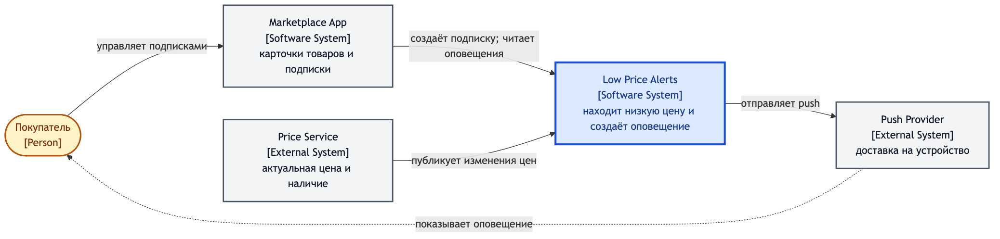
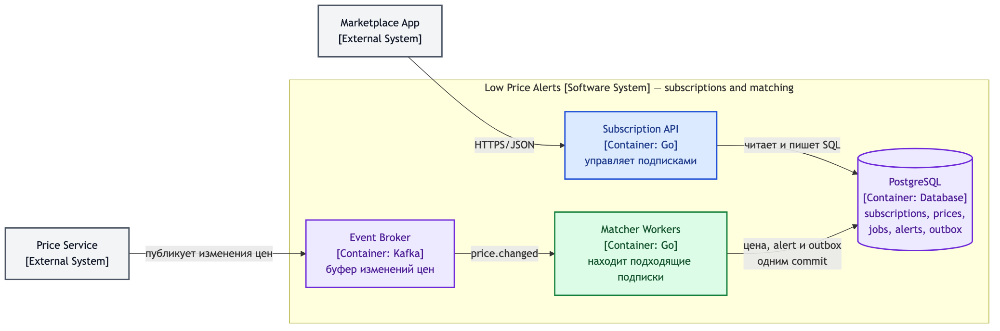
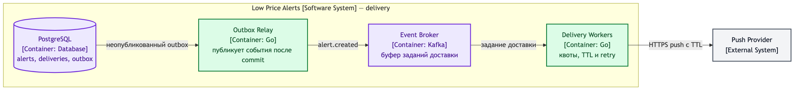
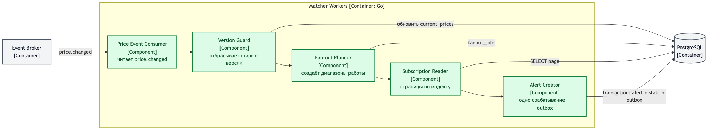
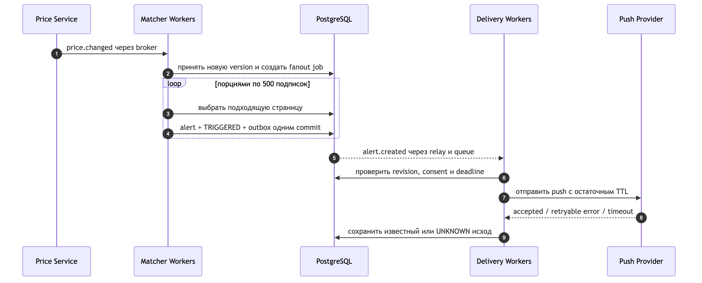
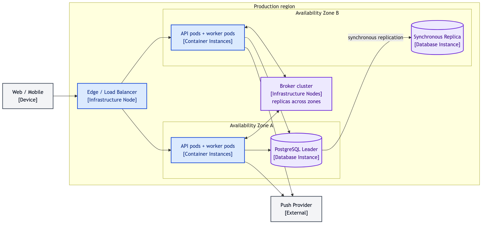

# Сквозной C4-пример: оповещения о низких ценах

## Содержание

- [Условие и scope](#условие-и-scope)
- [Уровень 1: System Context](#уровень-1-system-context)
- [Уровень 2: Container](#уровень-2-container)
- [Уровень 3: Component](#уровень-3-component)
- [Dynamic diagram: одно изменение цены](#dynamic-diagram-одно-изменение-цены)
- [Deployment diagram: production](#deployment-diagram-production)
- [Что кандидат объясняет](#что-кандидат-объясняет)
- [Самопроверка](#самопроверка)

Пример основан на кейсе [«Оповещения о низких ценах»](../interview-cases/33-low-price-alerts.md).
Здесь важны не все продуктовые детали, а переход между уровнями: одна и та же
архитектура приближается без появления необъяснённых элементов.

---

## Условие и scope

Пользователь подписывается на конкретное предложение продавца и указывает порог.
Когда доступная цена становится не выше порога, система создаёт одно оповещение
и пытается отправить push.

Зафиксируем границу:

- проектируем Low Price Alerts;
- Marketplace App, Price Service и Push Provider уже существуют;
- каталог, вычисление цены и покупка находятся вне scope;
- внутри нашей системы — подписки, сопоставление и доставка.

---

## Уровень 1: System Context



[Mermaid-источник](./diagram-sources/01-system-context.mmd)

Диаграмма отвечает только на вопрос о месте системы в окружении:

- покупатель управляет подпиской через Marketplace App;
- Price Service сообщает изменения цены;
- Low Price Alerts принимает решение о срабатывании;
- Push Provider доставляет сообщение на устройство.

Здесь намеренно нет базы и брокера. Они являются деталями внутреннего устройства
Low Price Alerts и появятся после приближения. `Marketplace App` показан отдельной
software system: в выбранном scope мы не отвечаем за весь маркетплейс.

Фраза кандидата при переходе:

> «Контекст согласован: наша система находится между приложением, источником цены
> и каналом доставки. Теперь приближу Low Price Alerts и распределю эти три
> ответственности по containers».

---

## Уровень 2: Container

Одна Container diagram со всеми потоками получилась бы широкой и заставила бы
читать пересекающиеся стрелки. Поэтому ниже две проекции одного уровня и одной
границы системы: первая оставляет подписки и matching, вторая — доставку. Это
не две разные архитектуры; повторяющиеся PostgreSQL и Event Broker обозначают
те же containers.

### Подписки и сопоставление



[Mermaid-источник](./diagram-sources/02a-container-subscriptions-and-matching.mmd)

### Доставка созданного оповещения



[Mermaid-источник](./diagram-sources/02b-container-delivery.mmd)

Каждый внутренний элемент является приложением или хранилищем:

| Container | Ответственность, которую он забирает |
| --- | --- |
| Subscription API | Команды и чтение подписок, аутентизация через контекст приложения |
| Matcher Workers | Приём новой версии цены, поиск подходящих подписок и создание alert |
| Delivery Workers | Проверка согласия/deadline, квоты, внешний вызов и retry |
| Outbox Relay | Чтение зафиксированного outbox и публикация `alert.created` после commit |
| PostgreSQL | Источник истины для subscriptions, current prices, jobs, alerts и outbox |
| Event Broker | Буфер изменений цены и созданных заданий доставки |

На схеме нет отдельных `API pod 1`, `API pod 2` и PostgreSQL replica — это
экземпляры и deployment. Нет `SubscriptionRepository` — это component внутри API.

Схема показывает две границы надёжности:

1. Price Service публикует изменение через свой outbox, поэтому падение после
   изменения цены не теряет событие.
2. Matcher создаёт alert и outbox одной DB-транзакцией, поэтому broker outage
   задерживает доставку, но не отменяет уже принятое срабатывание.

Слово «одной транзакцией» на стрелке важнее логотипа PostgreSQL: оно объясняет
инвариант. Конкретный брокер можно выбрать позже по требованиям к порядку,
повторному чтению и эксплуатации.

---

## Уровень 3: Component

Интервьюер просит раскрыть Matcher, потому что изменение популярного предложения
может затронуть миллион подписок. Приближаем только этот container.



[Mermaid-источник](./diagram-sources/03-component.mmd)

Компоненты имеют разные роли:

1. `Price Event Consumer` декодирует событие и передаёт его в прикладной flow.
2. `Version Guard` принимает только новую монотонную версию предложения,
   поэтому запоздавший дубль не откатывает цену.
3. `Fan-out Planner` создаёт небольшие независимые диапазоны работы вместо
   одной задачи на миллион получателей.
4. `Subscription Reader` читает кандидатов keyset-страницами по индексу
   `(offer_id, target_price, subscription_id)`.
5. `Alert Creator` под блокировкой перепроверяет revision и состояние подписки,
   затем атомарно создаёт alert, `TRIGGERED` и outbox.

PostgreSQL и Event Broker остаются containers из предыдущего уровня. Они не стали
components Matcher только потому, что компонент с ними взаимодействует.

Такая схема ещё не доказывает capacity. Рядом кандидат приводит расчёт и план
нагрузочного теста: порции уменьшают длительность транзакций, но один DB writer
и квота Push Provider остаются общими ограничениями.

---

## Dynamic diagram: одно изменение цены

Статические уровни показывают, что существует. Dynamic diagram показывает один
runtime-сценарий на тех же элементах.



[Mermaid-источник](./diagram-sources/04-dynamic.mmd)

Ключевые моменты flow:

- событие сначала превращается в устойчивое состояние цены и fan-out job;
- кандидаты обрабатываются ограниченными порциями;
- alert, смена состояния и outbox коммитятся вместе;
- внешний push вызывается после commit;
- таймаут провайдера записывается как неизвестный исход, а не как доказанный отказ.

Dynamic diagram не дублирует все связи системы и не вводит новый уровень C4.
Она нужна, чтобы обсудить порядок, транзакционные границы и восстановление.

---

## Deployment diagram: production

При требовании пережить потерю одной availability zone логические containers
нужно сопоставить с экземплярами и инфраструктурой.



[Mermaid-источник](./diagram-sources/05-deployment.mmd)

На этой схеме впервые появляются:

- load balancer;
- экземпляры API и workers в двух зонах;
- PostgreSQL leader и synchronous replica;
- broker nodes, распределённые между зонами.

Диаграмма показывает размещение, но не определяет безопасный failover сама по себе.
Нужно дополнительно проговорить health checks, fencing прежнего leader, выбор только
полной реплики и поведение сервиса, когда безопасный writer недоступен. Backup
тоже остаётся обязательным: replica повторит логическую ошибку и удаление данных.

Если отказ зоны не обсуждается, эту диаграмму не рисуют заранее. На основной
Container diagram достаточно пометки `multi-AZ deployment`.

---

## Что кандидат объясняет

Переход между схемами можно провести так:

> «На Context я зафиксировал границу: приложение, источник цены и push — внешние
> системы. Приближаю Low Price Alerts. API отвечает за короткие пользовательские
> запросы, Matcher — за неравномерный fan-out, Delivery Workers — за квоты и
> медленный внешний вызов. PostgreSQL хранит состояние, broker развязывает темпы.
>
> Главный hotspot — одно изменение с миллионом подписчиков. Поэтому раскрываю
> Matcher: сначала принимаю только свежую версию, затем режу обход на диапазоны,
> читаю индекс страницами и создаю каждое логическое оповещение с outbox одной
> транзакцией. Увеличение workers не расширит DB capacity и квоту push, их проверю
> отдельно числами.
>
> На Dynamic diagram показываю момент устойчивой записи и неизвестный исход
> внешнего push. Если требуется 99.99%, следующим шагом нарисую Deployment:
> экземпляры по зонам, synchronous replica и fencing при failover».

Здесь кандидат ведёт обсуждение: сам называет риск и предлагает следующий zoom,
но даёт интервьюеру изменить приоритет deep dive.

---

## Самопроверка

Закрой изображения и нарисуй пример заново за 12 минут. Затем проверь:

```text
Context:
□ Low Price Alerts — одна система, Price/Push — внешние
□ нет внутренних технологий

Containers:
□ видны API, Matcher, Delivery, source of truth и broker
□ каждое отношение подписано действием или данными
□ можно пройти create subscription и price changed

Component:
□ раскрыт только Matcher
□ показаны version guard, порции и атомарное создание alert
□ соседние containers не переименованы в components

Dynamic/Deployment:
□ runtime-flow использует уже определённые элементы
□ экземпляры и zones не смешаны с логической архитектурой
```

После этого измени условие: Price Service не публикует события, а предоставляет
только API с лимитом 50 RPS. Context почти не изменится, но Container diagram
потребует Scheduler/Fetcher, объединение одинаковых запросов и rate limiter.
Именно такое изменение проверяет понимание модели, а не запоминание картинки.
