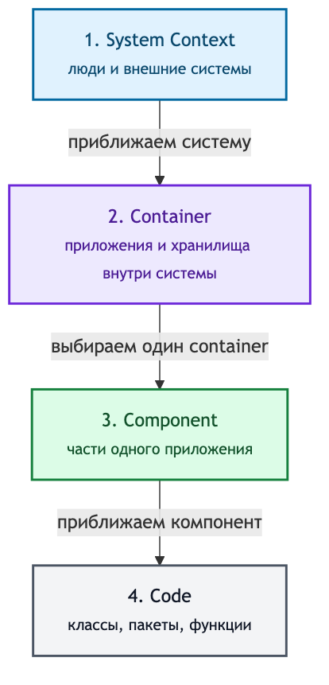

# C4-диаграммы для System Design Interview

## Содержание

- [Зачем нужен этот раздел](#зачем-нужен-этот-раздел)
- [Ментальная модель](#ментальная-модель)
- [Материалы](#материалы)
- [Как читать](#как-читать)
- [Что достаточно для собеседования](#что-достаточно-для-собеседования)
- [Источники](#источники)

Практический раздел о том, как превратить «коробки и стрелки» в понятную карту
архитектуры. Здесь C4 используется как язык разговора на собеседовании, а не как
обязательная формальная нотация.

---

## Зачем нужен этот раздел

На System Design Interview диаграмма должна отвечать на три вопроса:

1. Где проходит граница проектируемой системы?
2. Какие крупные приложения и хранилища находятся внутри неё?
3. Как проходит выбранный запрос или событие?

Без уровней масштаба легко поместить на одну схему пользователя, Kubernetes pod,
таблицу PostgreSQL и функцию Go. Все элементы могут быть правильными, но схема
становится нечитаемой. C4 разделяет эти ответы по масштабу и позволяет приближать
только тот участок, который сейчас обсуждается.

---

## Ментальная модель



Это похоже на карту:

- System Context — город и связи с соседними городами;
- Container — районы и крупные объекты внутри города;
- Component — устройство одного объекта;
- Code — комнаты и детали внутри выбранной части.

Слово `container` в C4 не означает Docker-контейнер. Это отдельно запускаемое
приложение или хранилище данных: backend, worker, мобильное приложение, база,
бакет объектного хранилища. Один C4-container в production может иметь десятки
реплик в Kubernetes.

---

## Материалы

- [01. Уровни, элементы и правила читаемой схемы](./01-levels-and-notation.md) —
  что показывает каждый уровень, как подписывать элементы и отношения, когда
  использовать Dynamic и Deployment diagrams.
- [02. Что рисовать на собеседовании](./02-interview-playbook.md) —
  порядок рисования, тайминг, фразы для ведения обсуждения и критерии готовой схемы.
- [03. Сквозной пример: Low Price Alerts](./03-low-price-alerts-example.md) —
  одна система на уровнях Context, Container и Component плюс runtime-flow
  и production-развёртывание.
- [Исходники диаграмм](./diagram-sources/README.md) — Mermaid-файлы, из которых собраны
  изображения. Их можно копировать и адаптировать для собственных прогонов.

---

## Как читать

1. Прочитать правила уровней и научиться отличать software system от container.
2. Пройти playbook и выписать минимальный набор элементов для доски.
3. Открыть пример: сначала попробовать нарисовать каждый уровень самому, затем
   сравнить с готовым вариантом.
4. Взять любой [interview-case](../interview-cases/README.md) и за 10–12 минут
   нарисовать Context и Container diagrams без подсказки.

Изображения закреплены в репозитории, чтобы материал одинаково читался в Markdown
preview. Рядом лежит редактируемый Mermaid-источник; изменение диаграммы требует
перегенерации PNG и визуальной проверки.

---

## Что достаточно для собеседования

Для большинства задач достаточно двух статических уровней и одного потока:

```text
1–2 минуты: System Context — граница, пользователи, внешние зависимости
7–10 минут: Container — сервисы, хранилища, брокеры и основные отношения
2–5 минут: Dynamic flow — один важный сценарий по уже нарисованным элементам
по запросу: Component или Deployment — только выбранный deep dive
```

Code diagram обычно не нужен: он слишком быстро уводит разговор от системных
границ к структурам и интерфейсам. Component diagram полезна, если интервьюер
просит раскрыть конкретный worker, gateway, matcher или payment orchestrator.

---

## Источники

- [C4 model: introduction](https://c4model.com/introduction) — официальная
  ментальная модель и уровни приближения.
- [C4 model: diagrams](https://c4model.com/diagrams) — статические уровни и
  дополнительные виды диаграмм.
- [C4 model: notation](https://c4model.com/diagrams/notation) — рекомендации по
  названиям, типам, описаниям, технологиям и отношениям.
