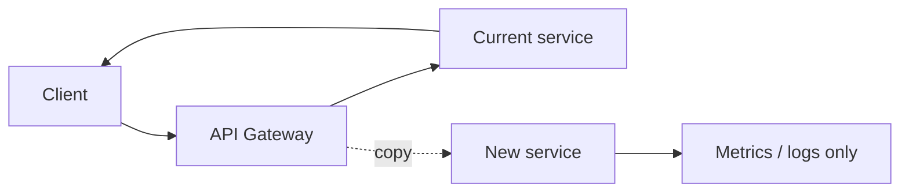

# Виды экспериментов и rollout-подходов

Эта заметка помогает различать A/B test, A/A test, feature flag, canary, dark launch, shadow traffic и другие подходы. Они похожи тем, что включают поведение не всем сразу, но отвечают на разные вопросы.

## Содержание

- [Главное различие](#главное-различие)
- [Feature flag](#feature-flag)
- [Gradual rollout](#gradual-rollout)
- [Canary rollout](#canary-rollout)
- [A/B test](#ab-test)
- [A/A test](#aa-test)
- [Multivariate test](#multivariate-test)
- [Split URL test](#split-url-test)
- [Holdout group](#holdout-group)
- [Beta cohort](#beta-cohort)
- [Dark launch](#dark-launch)
- [Shadow traffic](#shadow-traffic)
- [Comparison table](#comparison-table)
- [Как выбирать подход](#как-выбирать-подход)
- [Типичные ошибки](#типичные-ошибки)
- [Interview-ready answer](#interview-ready-answer)

## Главное различие

Есть два разных класса задач:

1. Безопасно включить изменение.
2. Понять, улучшило ли изменение продуктовую или бизнес-метрику.

Для первого нужны rollout-подходы:
- feature flag;
- gradual rollout;
- canary;
- dark launch;
- shadow traffic.

Для второго нужны experimentation-подходы:
- A/B test;
- A/A test;
- multivariate test;
- holdout group.

Путаница начинается, когда `canary` называют A/B тестом. Canary может показать, что новая версия не падает и не увеличивает latency. Но он почти никогда не доказывает, что новая продуктовая логика улучшила conversion rate, retention или revenue.

## Feature flag

`Feature flag` - это переключатель поведения в коде.

Пример:

```go
if flags.Enabled(ctx, "new_checkout", user.ID) {
    return newCheckoutHandler(ctx, req)
}
return oldCheckoutHandler(ctx, req)
```

Где используется:
- включить фичу только сотрудникам;
- быстро откатить проблемное поведение без redeploy;
- раздать фичу 1%, 10%, 50%, 100% пользователей;
- держать несколько вариантов для A/B теста.

Сильные стороны:
- быстрый rollback;
- независимость deploy и release;
- можно тестировать в production на маленькой аудитории;
- удобно для backend и frontend.

Слабые стороны:
- старые flags засоряют код;
- сложно контролировать комбинации flags;
- нужна дисциплина удаления;
- ошибки в targeting могут включить фичу не той аудитории.

Когда выбирать:
- почти всегда для рискованных изменений;
- когда нужен быстрый kill switch;
- когда deploy pipeline медленнее, чем желаемый rollback.

Когда не выбирать:
- для маленького internal refactoring без изменения поведения;
- если команда не готова удалять flags после завершения rollout.

Подробный разбор практической реализации:
- [Feature flags на практике](./02-feature-flags-in-practice.md)

## Gradual rollout

`Gradual rollout` - постепенное включение фичи на часть аудитории.

Типичный план:

```text
internal users -> 1% -> 5% -> 25% -> 50% -> 100%
```

Цель:
- снизить blast radius;
- поймать ошибки на малом трафике;
- проверить latency, error rate, saturation, business regressions.

Тонкость:
- если rollout распределяет по request, пользователь может видеть разное поведение между запросами;
- для user-facing фич чаще нужен sticky assignment по `user_id`, `account_id` или `device_id`.

## Canary rollout

`Canary` - это выкладка новой версии сервиса или конфигурации на маленькую часть production traffic.

Обычно canary сравнивает:
- error rate;
- latency;
- CPU/memory;
- saturation;
- dependency failures;
- business guardrails.

Canary хорош для:
- новой версии backend-сервиса;
- изменения схемы взаимодействия с dependency;
- новой инфраструктурной конфигурации;
- проверки operational safety.

Canary хуже для:
- продуктовых выводов;
- долгих behavioral metrics;
- сегментов, где важно честное randomization.

Почему:
- canary часто раскатывается по pod, zone, node, region или traffic slice, а не по случайно выбранным пользователям;
- аудитория canary может быть не репрезентативна;
- sample size обычно маленький и короткий по времени.

## A/B test

`A/B test` - controlled experiment, где пользователи случайно и стабильно разделяются на группы.

Пример:
- `control`: старый checkout;
- `treatment`: новый checkout.

Цель:
- проверить гипотезу по заранее выбранной метрике.

Примеры гипотез:
- новый checkout увеличит `purchase_conversion`;
- новая ranking model увеличит `search_success_rate`;
- новый onboarding увеличит `activation_rate`;
- новая pricing page увеличит `trial_start_rate`.

Что важно:
- группы должны быть сравнимыми;
- assignment должен быть стабильным;
- exposure нужно логировать отдельно от просто попадания пользователя в bucket;
- primary metric и guardrail metrics нужно выбрать до запуска.

## A/A test

`A/A test` - эксперимент, где обе группы получают одинаковое поведение.

Зачем нужен:
- проверить корректность randomization;
- проверить analytics pipeline;
- оценить false positive rate;
- убедиться, что exposure events и метрики собираются одинаково.

Когда использовать:
- перед запуском новой experimentation platform;
- после крупного изменения event pipeline;
- если A/B тесты часто показывают странные результаты.

Тонкость:
- A/A может иногда показывать "значимый" результат случайно. Это нормально, если такое происходит примерно с ожидаемой частотой для выбранного уровня значимости.

## Multivariate test

`Multivariate test` проверяет несколько параметров одновременно.

Пример:
- цвет кнопки: blue, green;
- текст: "Buy now", "Start trial";
- layout: compact, expanded.

Сильные стороны:
- можно увидеть interaction effects;
- полезно для UI/marketing experiments.

Слабые стороны:
- быстро растет количество вариантов;
- нужен большой traffic;
- сложнее анализировать и объяснять результат.

Практическое правило:
- если traffic небольшой, лучше начать с простого A/B или A/B/n;
- multivariate имеет смысл, когда есть аналитическая зрелость и много пользователей.

## Split URL test

`Split URL test` отправляет пользователей на разные URL или разные версии page/app.

Пример:
- `/pricing` - старая страница;
- `/pricing-v2` - новая страница.

Где удобно:
- landing pages;
- marketing funnels;
- большие frontend changes;
- проверки нового rendering stack.

Риски:
- SEO и canonical URLs;
- cache behavior;
- tracking consistency;
- разная скорость страниц может сама стать причиной результата.

## Holdout group

`Holdout` - группа пользователей, которой долго не включают новую систему или набор изменений.

Зачем:
- измерять долгосрочный эффект;
- понимать cumulative impact большого набора фич;
- отделить сезонность от влияния продукта.

Пример:
- 95% пользователей получают personalization;
- 5% остаются без personalization как long-term control.

Слабые стороны:
- часть пользователей намеренно не получает улучшения;
- могут быть ethical/product concerns;
- нужна строгая защита от случайного включения.

## Beta cohort

`Beta cohort` - заранее выбранная группа пользователей, которая получает фичу раньше остальных.

Примеры:
- internal users;
- friendly customers;
- paid beta;
- power users.

Сильные стороны:
- качественный feedback;
- легче общаться с пользователями;
- меньше репутационный риск.

Слабые стороны:
- это не случайная выборка;
- нельзя напрямую обобщать результат на всех пользователей;
- power users часто ведут себя иначе.

## Dark launch

`Dark launch` включает backend-логику без видимого изменения для пользователя.

Пример:
- новый recommendation service считает рекомендации;
- UI продолжает показывать старые;
- backend пишет latency, errors, quality signals.

Зачем:
- прогреть cache;
- проверить нагрузку;
- протестировать dependency;
- собрать технические метрики до публичного включения.

Риск:
- если dark path делает реальные side effects, можно незаметно повредить данные.

Правило:
- dark launch должен быть read-only или иметь надежную защиту от side effects.

## Shadow traffic

`Shadow traffic` копирует production requests в новую систему, но ответ пользователю отдает старая система.

Пример:



Где полезно:
- переписывание сервиса;
- проверка новой базы;
- новая ML/ranking система;
- миграция на другой protocol/storage.

Тонкости:
- нельзя повторять платежи, email, push, mutations;
- нужно уметь анонимизировать sensitive data;
- latency shadow path не должна влиять на production response;
- сравнение ответов требует tolerant diff, потому что timestamps, ids и ordering могут отличаться.

## Comparison table

| Подход | Главная цель | Единица распределения | Что измеряем | Подходит для product decision |
|---|---|---:|---|---|
| Feature flag | Управлять включением | user/account/request | зависит от фичи | только как механизм |
| Gradual rollout | Снизить blast radius | user/account/traffic % | errors, latency, business guardrails | частично |
| Canary | Проверить production safety | pod/region/traffic slice | SLI/SLO, ресурсы | обычно нет |
| A/B test | Проверить гипотезу | user/account/device | primary metric, guardrails | да |
| A/A test | Проверить платформу | user/account/device | ожидаемое отсутствие эффекта | нет |
| Multivariate | Проверить комбинации | user/account/device | conversion, engagement | да, если есть traffic |
| Holdout | Измерить long-term impact | user/account | retention, revenue, behavior | да |
| Dark launch | Проверить backend path | request/entity | latency, errors, load | нет |
| Shadow traffic | Сравнить новую систему | request copy | diff, latency, errors | нет |

## Как выбирать подход

Выбирай A/B test, если:
- есть продуктовая гипотеза;
- можно случайно и стабильно разделить аудиторию;
- есть measurable outcome;
- можно подождать до достаточного sample size.

Выбирай canary/gradual rollout, если:
- главная угроза - outage, latency или bad deploy;
- нужно ограничить blast radius;
- решение скорее техническое, чем продуктовое.

Выбирай dark launch или shadow traffic, если:
- нужно проверить новую backend-систему на real traffic;
- нельзя показывать результат пользователю;
- нужно сравнить поведение старого и нового сервиса.

Выбирай beta cohort, если:
- нужен qualitative feedback;
- аудитория маленькая;
- фича еще не готова для честного массового эксперимента.

## Типичные ошибки

- Называть canary A/B тестом и делать продуктовые выводы.
- Распределять пользователей по request, когда нужен стабильный user-level experience.
- Менять метрику успеха после просмотра результатов.
- Игнорировать guardrail metrics вроде latency, error rate, refund rate, support tickets.
- Запускать много пересекающихся экспериментов без контроля конфликтов.
- Считать, что beta cohort доказывает эффект на всей аудитории.
- Забывать удалять feature flags после завершения rollout.

## Interview-ready answer

Я бы разделял rollout и experimentation. Feature flag, canary, dark launch и shadow traffic помогают безопасно включать изменения и снижать operational risk. A/B, A/A, multivariate и holdout нужны для проверки гипотез и измерения эффекта. Canary может сказать "новая версия не ломает сервис", но не доказывает рост conversion. Для продуктового решения нужен стабильный random assignment, exposure logging, заранее выбранные метрики и достаточный объем данных.
