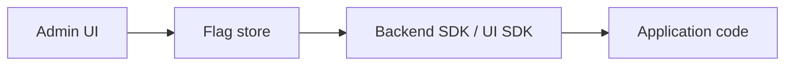
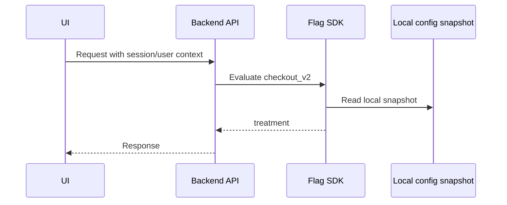

# Feature flags на практике

`Feature flag` - это управляемое условие в системе, которое позволяет включать, выключать или менять поведение без нового deploy. В работе это встречается постоянно: rollout новой фичи, kill switch, включение функциональности конкретному клиенту, A/B тест, миграция backend path, временное отключение дорогой dependency.

## Содержание

- [Зачем нужны feature flags](#зачем-нужны-feature-flags)
- [Какие бывают flags](#какие-бывают-flags)
- [Из чего состоит flag](#из-чего-состоит-flag)
- [Как система получает flags](#как-система-получает-flags)
- [Polling, streaming и bootstrap](#polling-streaming-и-bootstrap)
- [Server-side evaluation](#server-side-evaluation)
- [Client-side и backend-provided flags](#client-side-и-backend-provided-flags)
- [Как включать и выключать flags](#как-включать-и-выключать-flags)
- [Targeting rules](#targeting-rules)
- [Percentage rollout](#percentage-rollout)
- [Fallback и отказоустойчивость](#fallback-и-отказоустойчивость)
- [Метрики и observability](#метрики-и-observability)
- [Безопасность и privacy](#безопасность-и-privacy)
- [Cleanup и technical debt](#cleanup-и-technical-debt)
- [Типичные ошибки](#типичные-ошибки)
- [Go implementation](#go-implementation)
- [Interview-ready answer](#interview-ready-answer)

## Зачем нужны feature flags

Главная идея:

```text
Deploy != Release
```

`Deploy` - код попал в production.

`Release` - пользователи начали видеть новое поведение.

Feature flag разделяет эти события. Это дает несколько практических преимуществ:

- можно выкатить код заранее, но не включать фичу;
- можно включить фичу только сотрудникам или beta users;
- можно раскатывать 1% -> 5% -> 25% -> 100%;
- можно быстро выключить проблемный path без rollback deploy;
- можно безопаснее делать database migrations и backend rewrites;
- можно использовать один механизм и для rollout, и для A/B tests.

Простой пример:

```go
if flags.Enabled(ctx, "checkout_v2", subject) {
    return h.newCheckout(ctx, req)
}
return h.oldCheckout(ctx, req)
```

Но production-ready feature flags - это не только `if`. Это config, targeting, stable evaluation, cache, audit log, UI state, metrics, ownership и cleanup.

## Какие бывают flags

| Тип flag | Для чего | Пример | Сколько живет |
|---|---|---|---|
| Release flag | постепенный rollout фичи | `checkout_v2` | дни/недели |
| Experiment flag | A/B или A/B/n test | `pricing_copy_test` | до конца теста |
| Ops flag / kill switch | быстро отключить рискованный path | `disable_recommendations` | постоянно или долго |
| Permission / entitlement | доступ к функции по plan/account | `advanced_reports_enabled` | долго |
| Migration flag | переключить старую/новую реализацию | `read_from_new_index` | до завершения миграции |
| Config flag | поменять параметр без deploy | `max_items_per_page` | долго, если это реально config |

Важно различать:
- temporary flags - должны быть удалены;
- permanent flags - становятся частью business rules или configuration model.

Проблема начинается, когда temporary release flag живет годами и превращается в непонятную ветку кода.

## Из чего состоит flag

Минимальная модель:

```yaml
key: checkout_v2
enabled: true
type: release
default_variant: control
variants:
  control:
    weight: 90
  treatment:
    weight: 10
targeting:
  environments: ["production"]
  countries: ["GE", "US"]
  platforms: ["web"]
  min_app_version: "2.14.0"
owners:
  - checkout-team
expires_at: "2026-05-20"
```

Частые поля:
- `key` - стабильное имя flag;
- `enabled` - глобальный switch;
- `variants` - варианты поведения;
- `rules` / `targeting` - кому включать;
- `default` - что делать, если rule не сработала;
- `rollout percentage` - процент аудитории;
- `environment` - dev/staging/prod;
- `owner` - кто отвечает;
- `created_at`, `expires_at` - для cleanup;
- `audit log` - кто и когда менял.

## Как система получает flags

Есть несколько популярных моделей.

### 1. Remote flag service

Сервис или SaaS хранит flags, а приложения используют SDK.

Примеры по смыслу:
- external feature flag provider;
- internal experimentation service;
- internal config service.

Flow:



Плюсы:
- удобно менять flags без deploy;
- есть UI для product/ops команд;
- audit log;
- targeting;
- percentage rollout;
- быстрый kill switch.

Минусы:
- новая dependency;
- нужно думать про latency и fallback;
- sensitive targeting нельзя бездумно отдавать на client;
- vendor/platform lock-in.

### 2. Config in repository

Flags лежат в YAML/JSON/TOML в репозитории и применяются через deploy.

Плюсы:
- code review;
- history в Git;
- просто для маленькой команды;
- нет runtime dependency.

Минусы:
- нельзя быстро выключить без deploy;
- product/ops команде сложнее менять;
- плохо подходит для emergency kill switch.

### 3. Database/config table

Flags хранятся в DB или admin service.

Плюсы:
- быстро менять;
- можно сделать internal admin UI;
- легко связать с account/customer model.

Минусы:
- нельзя дергать DB на каждый request;
- нужен cache;
- нужны audit log и access control;
- DB outage не должен ломать critical path.

### 4. Environment variables

Подходит только для coarse-grained ops/config flags.

Пример:

```text
FEATURE_NEW_CHECKOUT=false
```

Плюсы:
- просто;
- понятно в infrastructure;
- удобно для environment-level switches.

Минусы:
- обычно требует restart/redeploy;
- нет user-level targeting;
- нет percentage rollout;
- не подходит для A/B tests.

Практическое правило:
- env var подходит для "включить модуль в этом окружении";
- не подходит для "включить 10% пользователей из US на web".

## Polling, streaming и bootstrap

SDK должен как-то получать свежую конфигурацию.

| Модель | Как работает | Плюсы | Минусы |
|---|---|---|---|
| Polling | приложение раз в N секунд забирает config | просто, надежно | изменение применяется не мгновенно |
| Streaming | provider пушит изменения через long connection | быстро для kill switch | сложнее сеть/fallback |
| Bootstrap | приложение стартует с локальным snapshot | работает при недоступном provider | snapshot может устареть |
| Request-time fetch | каждый request идет в flag service | всегда свежо | часто плохая latency и reliability |

Для backend хороший pattern:

```text
Background sync -> atomic in-memory snapshot -> local evaluation in request path
```

Плохо:

```text
Every request -> network call to flag provider -> response
```

Почему плохо:
- latency provider становится частью latency API;
- outage provider может положить приложение;
- под нагрузкой flag service становится bottleneck.

## Server-side evaluation

`Server-side evaluation` означает, что backend сам решает, включен flag или нет, до того как ответить клиенту.



Когда выбирать server-side:
- pricing, billing, checkout;
- permissions и entitlements;
- recommendation payload;
- backend side effects (запись в DB, вызов внешнего API);
- DB migration path;
- security-sensitive rules.

Плюсы:
- client не может подделать business decision;
- sensitive targeting rules остаются на server;
- единая логика для web/mobile/API clients.

Пример:

```go
subject := flags.Subject{
    UserID:    user.ID,
    AccountID: user.AccountID,
    Country:   req.Country,
    Platform:  "web",
}

decision := h.flags.Evaluate(ctx, "checkout_v2", subject)
if decision.Variant == "treatment" {
    return h.checkoutV2(ctx, req)
}
return h.checkoutV1(ctx, req)
```

Что важно:
- `Evaluate` не должна ходить в сеть на каждый request;
- `Subject` не должен содержать лишний PII;
- decision полезно добавлять в structured logs/traces.

## Client-side и backend-provided flags

`Client-side evaluation` подходит для UI-only решений: текст кнопки, порядок блоков, onboarding, показ/скрытие non-sensitive widget. UI SDK сам получает flags и считает variant.

Правило без исключений: client-side flag может менять presentation, но backend всегда проверяет access, pricing, limits и permissions независимо от того, что UI-флаг говорит.

Частый production pattern — backend оценивает flags и возвращает safe UI config:

```json
{
  "user": { "id": "user_123" },
  "features": {
    "checkoutV2": true,
    "newPricingCopy": "treatment"
  }
}
```

UI не знает targeting rules, один decision source, SSR и client используют одинаковые данные.

Подробно про UI patterns, SSR/hydration, mobile и bootstrap endpoint — в [04-ui-backend-implementation.md](./04-ui-backend-implementation.md).

## Как включать и выключать flags

Типичный lifecycle:

```text
create -> off in prod -> internal users -> beta cohort -> 1% -> 10% -> 50% -> 100% -> cleanup
```

Для risky фичи:

1. Создать flag в `off` состоянии.
2. Задеплоить код, который умеет оба пути.
3. Включить только в dev/staging.
4. Включить internal users.
5. Включить маленький процент production.
6. Смотреть guardrails.
7. Увеличивать rollout.
8. На 100% удалить старый path и сам flag.

Тонкость:
- `enabled=false` должен иметь четкую семантику;
- если flag используется в нескольких сервисах, все должны одинаково понимать default.

Плохой пример — один flag управляет двумя разными смыслами:

```go
// сервис A
if flags.Enabled("new_payment") {
    useNewPayment()
}

// сервис B
if !flags.Enabled("new_payment") {
    skipPaymentValidation()
}
```

Лучше:
- один flag - одно решение;
- имена описывают поведение, а не желание команды;
- для аварийного выключения внешней системы использовать отдельный ops flag.

## Targeting rules

Targeting отвечает на вопрос "кому включить".

Примеры rules:
- `user_id in allowlist`;
- `account_id in beta_accounts`;
- `country in ["GE", "US"]`;
- `platform == "web"`;
- `app_version >= "2.14.0"`;
- `account_plan == "enterprise"`;
- `email domain == company domain` для internal users.

Порядок rules важен:

```text
1. If user is in denylist -> control
2. If user is employee -> treatment
3. If account is beta -> treatment
4. If country is GE/US and platform is web -> percentage rollout
5. Default -> control
```

Тонкости:
- denylist обычно должен иметь приоритет выше allowlist;
- targeting должен быть deterministic;
- targeting rules должны логироваться как `reason`, чтобы debug был возможен;
- app version comparison должна учитывать semantic versioning, а не строковое сравнение.

## Percentage rollout

Percentage rollout включает фичу части аудитории.

Важно:
- процент должен быть стабильным;
- один и тот же user/account должен попадать в ту же группу;
- rollout лучше считать по `user_id` или `account_id`, а не по request.

Упрощенный алгоритм:

```go
func enabledForPercentage(flagKey string, subjectID string, percentage int) bool {
    bucket := stableHash(flagKey + ":" + subjectID) % 100
    return bucket < percentage
}
```

Если `percentage=10`, пользователь попадает в treatment, если его bucket от 0 до 9.

Почему не `rand.Intn(100)`:
- пользователь будет прыгать между состояниями;
- metrics смешаются;
- UI может менять поведение на каждом refresh.

Для B2B:
- часто лучше rollout по `account_id`, а не `user_id`;
- иначе в одной компании часть пользователей увидит новую billing/settings фичу, а часть нет.

## Fallback и отказоустойчивость

Feature flag system не должна становиться single point of failure.

Если provider недоступен:
- использовать последний хороший snapshot;
- если snapshot отсутствует, использовать fallback;
- для risky release flags fallback обычно `off`;
- для permanent entitlement flags fallback зависит от бизнес-риска;
- логировать degraded mode.

Пример:

```go
enabled := flags.Bool(ctx, "new_recommendations", subject, false)
```

Здесь `false` - явный fallback.

Но для permission flag может быть наоборот:

```go
allowed := flags.Bool(ctx, "enforce_new_limit", subject, true)
```

Такой fallback нужно выбирать осознанно. В security-sensitive местах лучше fail closed, но в user-facing availability-sensitive местах иногда лучше fail open. Это trade-off.

## Метрики и observability

Для feature flag platform полезны operational metrics:

- `feature_flag_evaluations_total`;
- `feature_flag_evaluation_duration_seconds`;
- `feature_flag_config_refresh_total`;
- `feature_flag_config_refresh_errors_total`;
- `feature_flag_stale_config_seconds`;
- `feature_flag_fallback_total`.

Labels должны быть low-cardinality:
- `service`;
- `flag_key`, если flags немного и это контролируется;
- `result`;
- `provider`;
- `environment`.

Не добавлять:
- `user_id`;
- `account_id`;
- email;
- request_id;
- raw targeting rule.

Для debug в logs/traces полезно:

```json
{
  "flag.key": "checkout_v2",
  "flag.variant": "treatment",
  "flag.reason": "percentage_rollout",
  "flag.config_version": "2026-04-20.3"
}
```

Для business/product результата нужны analytics events, а не только Prometheus.

## Безопасность и privacy

Правила:
- не раскрывать sensitive targeting на client;
- не считать client flag источником правды для permissions;
- не класть PII в flag evaluation events без необходимости;
- ограничивать доступ к admin UI;
- требовать audit log для production changes;
- для dangerous flags использовать approval или two-person review.

Особенно опасные flags:
- скидки и pricing;
- лимиты;
- права доступа;
- fraud checks;
- payment provider routing;
- data deletion;
- security enforcement.

Для таких flags лучше:
- server-side evaluation;
- строгий access control;
- alerts при изменении;
- runbook rollback;
- понятный owner.

## Cleanup и technical debt

Feature flags создают долг.

После успешного rollout:

1. Зафиксировать решение: keep treatment.
2. Удалить старую ветку кода.
3. Удалить flag из config/provider.
4. Удалить tests для старого path или переписать.
5. Удалить dashboard/alerts, если они были временными.
6. Обновить документацию.

Почему cleanup важен:
- уменьшается количество комбинаций поведения;
- проще тестировать;
- меньше cognitive load;
- меньше риск случайно выключить давно обязательную фичу.

Хорошая практика:
- у каждого temporary flag есть `expires_at`;
- stale flags попадают в weekly cleanup report;
- PR с фичей содержит ticket на удаление flag.

## Типичные ошибки

- Дергать remote flag service на каждый request.
- Использовать `rand()` вместо stable hashing.
- Доверять client-side flag для permissions или pricing.
- Отдавать все internal flags на UI.
- Делать flag без owner и expiration date.
- Не иметь fallback при недоступном provider.
- Логировать exposure при загрузке config, а не при реальном показе.
- Ломать CDN cache, не учитывая variant/cache key.
- Использовать один flag для нескольких разных смыслов.
- Оставлять release flags навсегда.
- Держать background goroutine без `Close()` — goroutine leak при shutdown сервиса.
- Читать config snapshot под полным `sync.Mutex` на каждый request — при высоком RPS это contention; правильно использовать `atomic.Value`.

## Go implementation

Для production-ready клиента на Go нужно продумать:

- interface design для testability (`Bool`, `Variant`, `Close`);
- thread-safe in-memory snapshot через `atomic.Value`;
- background goroutine с `context.Context` и `time.Ticker`;
- graceful shutdown через `context.CancelFunc` + `sync.WaitGroup`;
- deterministic bucketing с FNV-32a из стандартной библиотеки;
- evaluation loop: denylist → allowlist → attribute rules → percentage → default;
- pre-built `map[string]struct{}` для targeting lists при загрузке config;
- интеграция с OpenTelemetry span и structured logs.

Детальная реализация с примерами кода — в [02a-feature-flags-golang-client.md](./02a-feature-flags-golang-client.md).

## Interview-ready answer

Feature flag - это механизм отделения deploy от release. В production я бы получал flags через SDK или internal config service, но evaluation держал бы локальной: background sync загружает config в `atomic.Value` snapshot, а request path читает его без lock. Для backend-critical решений вроде pricing, permissions, checkout и side effects variant должен считаться на server, а UI получает только безопасный bootstrap config. Включение идет постепенно: internal users, beta, 1%, 10%, 50%, 100%, с guardrail metrics и kill switch. После rollout temporary flag нужно удалить, иначе он превращается в technical debt. Детальная реализация клиента на Go — в `02a`.
