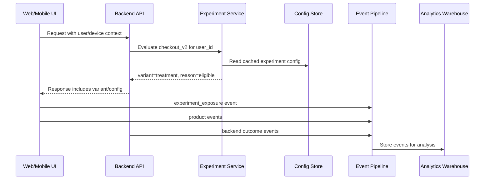

# Дизайн A/B теста и assignment

Эта заметка про то, как спроектировать A/B тест так, чтобы результату можно было доверять. Основные темы: гипотеза, unit of randomization, sticky assignment, exposure event, конфликт экспериментов и rollback.

## Содержание

- [Что такое хороший A/B тест](#что-такое-хороший-ab-тест)
- [Минимальный checklist перед запуском](#минимальный-checklist-перед-запуском)
- [Unit of randomization](#unit-of-randomization)
- [Sticky assignment](#sticky-assignment)
- [Bucketing через hash](#bucketing-через-hash)
- [Exposure event](#exposure-event)
- [Assignment vs exposure](#assignment-vs-exposure)
- [Где хранить configuration](#где-хранить-configuration)
- [Конфликты экспериментов](#конфликты-экспериментов)
- [Segmentation и targeting](#segmentation-и-targeting)
- [Rollout и rollback](#rollout-и-rollback)
- [System design flow](#system-design-flow)
- [Типичные ошибки](#типичные-ошибки)
- [Interview-ready answer](#interview-ready-answer)

## Что такое хороший A/B тест

Хороший A/B test начинается не с кода, а с решения:

```text
Если мы изменим X для аудитории Y,
то метрика M должна измениться в сторону Z,
и мы не должны ухудшить guardrails G.
```

Пример:

```text
Если мы покажем новый checkout flow новым пользователям из web,
то purchase_conversion вырастет,
при этом p95 checkout latency, payment_error_rate и refund_rate не ухудшатся.
```

Что должно быть заранее:
- hypothesis;
- target audience;
- variants;
- primary metric;
- guardrail metrics;
- expected duration или stopping rule;
- owner;
- rollback plan.

## Минимальный checklist перед запуском

- Что является success metric?
- Какая минимальная величина эффекта важна бизнесу?
- Кто входит в аудиторию?
- По чему делим пользователей: `user_id`, `account_id`, `device_id`, `session_id`?
- Может ли пользователь попасть в обе группы?
- Где логируется exposure?
- Какие guardrails останавливают тест?
- Что делаем, если вариант ломает latency или error rate?
- Какие эксперименты конфликтуют с этим?
- Как удаляем flag после завершения?

## Unit of randomization

`Unit of randomization` - объект, который попадает в control или treatment.

Варианты:

| Unit | Когда подходит | Риск |
|---|---|---|
| `user_id` | login-based products, персональный UI | анонимные пользователи до логина |
| `account_id` | B2B SaaS, team settings, billing | меньше sample size |
| `device_id` | mobile/web до логина | пользователь с несколькими устройствами |
| `session_id` | short-lived UI experiments | нестабильный experience |
| `request_id` | backend load test, non-user-facing path | нельзя делать продуктовый вывод |

Практические правила:
- если изменение видит человек, чаще нужен `user_id` или `account_id`;
- если изменение влияет на команду или billing, лучше `account_id`;
- если пользователь не залогинен, нужен anonymous/device id и стратегия merge после login;
- `request_id` почти никогда не подходит для продуктового A/B теста.

## Sticky assignment

`Sticky assignment` означает, что один и тот же пользователь стабильно получает один и тот же variant.

Зачем:
- пользователь не видит прыгающий UI;
- метрики не смешиваются;
- backend может делать idempotent decisions;
- проще debug через logs/traces.

Плохо:

```text
request 1 -> treatment
request 2 -> control
request 3 -> treatment
```

Хорошо:

```text
user_123 + experiment_checkout_v2 -> treatment всегда
```

Sticky assignment обычно делают:
- deterministic hash;
- assignment table;
- external experimentation platform.

## Bucketing через hash

Один из простых вариантов - deterministic hash от `experiment_key + unit_id`.

Псевдокод:

```go
func bucket(experimentKey string, unitID string) int {
    h := stableHash(experimentKey + ":" + unitID)
    return h % 10000 // 0..9999
}

func variant(bucket int) string {
    switch {
    case bucket < 5000:
        return "control"
    default:
        return "treatment"
    }
}
```

Плюсы:
- быстро;
- не нужна запись в DB на каждый assignment;
- легко масштабировать;
- одинаковый вход дает одинаковый variant.

Минусы:
- сложно менять веса без rebucketing части пользователей;
- трудно делать аудит "кто был в какой группе" без отдельного logging;
- нужно аккуратно версионировать experiment keys.

Тонкость про изменение веса:
- если было 50/50 и стало 10/90, часть пользователей сменит variant, если алгоритм не защищает sticky assignment;
- для критичных экспериментов лучше хранить assignment после первого exposure.

## Exposure event

`Exposure event` - событие "пользователь реально увидел или получил экспериментальное поведение".

Пример payload:

```json
{
  "event": "experiment_exposure",
  "experiment_key": "checkout_v2",
  "variant": "treatment",
  "unit_type": "user",
  "unit_id": "user_123",
  "request_id": "req_abc",
  "occurred_at": "2026-04-20T10:30:00Z",
  "surface": "web_checkout"
}
```

Почему exposure важен:
- assignment мог быть рассчитан, но пользователь не дошел до UI;
- backend мог проверить flag для prefetch, но не показать фичу;
- без exposure можно получить biased denominator.

Правило:
- анализировать experiment effect нужно по тем, кто был exposed, а не по всем, кому теоретически назначен variant.

## Assignment vs exposure

`Assignment` - система решила, какой variant положен пользователю.

`Exposure` - пользователь реально столкнулся с variant.

Пример:

```text
User opened homepage.
Backend calculated assignment for checkout_v2.
User never opened checkout.
Exposure to checkout_v2 did not happen.
```

Если считать такого пользователя в анализе checkout conversion, результат может исказиться.

Тонкость:
- иногда используют intention-to-treat analysis, где анализируют всех assigned users;
- это может быть полезно, если exposure сложно определить;
- но для UI/product experiments обычно нужен явный exposure event.

## Где хранить configuration

Типичная config model:

```yaml
key: checkout_v2
status: running
unit: user_id
variants:
  control: 50
  treatment: 50
targeting:
  country: ["GE", "US"]
  platform: ["web"]
guardrails:
  max_payment_error_rate: 0.02
  max_p95_latency_ms: 700
owners:
  - growth-team
```

Где может жить config:
- SaaS feature flag platform;
- internal experimentation service;
- config service;
- repository + deploy, если изменения редкие.

Trade-off:
- SaaS быстрее внедрить, но есть vendor dependency и data/privacy вопросы;
- internal service дороже, но лучше контролирует domain-specific rules;
- config in repo прост, но медленнее для emergency changes.

## Конфликты экспериментов

Эксперименты конфликтуют, если один влияет на метрики другого.

Пример:
- experiment A меняет pricing page;
- experiment B меняет discount logic;
- оба измеряют purchase conversion.

Подходы:
- mutual exclusion groups;
- experiment layers;
- holdout traffic;
- запускать последовательно;
- заранее разрешать независимые experiments на разных surfaces.

Простая модель:

```text
Layer: checkout
  - checkout_v2
  - payment_form_copy

Layer: search
  - search_ranking_v3
  - search_filters_layout
```

Пользователь может участвовать в одном эксперименте из checkout layer и одном из search layer, но не в двух checkout experiments одновременно.

## Segmentation и targeting

Targeting ограничивает аудиторию.

Примеры:
- country;
- platform;
- app version;
- account tier;
- new vs returning users;
- logged-in users.

Тонкости:
- чем больше фильтров, тем меньше sample size;
- если фильтр связан с метрикой, результат нельзя обобщать на всех;
- targeting rules должны быть одинаковыми для control и treatment;
- нельзя менять аудиторию на середине теста без явной пометки в анализе.

## Rollout и rollback

Даже A/B test должен иметь operational control.

Минимальный набор:
- `status: draft/running/paused/stopped`;
- percentage allocation;
- kill switch;
- guardrail alerts;
- owner and on-call escalation;
- audit log changes.

Rollback должен:
- быстро выключать treatment;
- не ломать пользователей, уже попавших в variant;
- учитывать DB migrations и backward compatibility;
- не оставлять inconsistent client/backend state.

## System design flow



Варианты:
- assignment может быть на backend;
- assignment может быть на frontend SDK;
- exposure может логировать UI или backend;
- config может кэшироваться на edge, gateway или app instance.

Главное:
- один источник истины по variant;
- единый event schema;
- понятные rules для sticky assignment.

## Типичные ошибки

- Делать random assignment через `rand()` на каждый request.
- Не логировать exposure event.
- Смешивать assignment по `device_id` и метрики по `user_id` без stitching.
- Менять primary metric после старта.
- Останавливать тест сразу после первого "красивого" результата.
- Держать конфликтующие experiments на одной аудитории.
- Не иметь rollback plan для treatment.
- Использовать user_id как Prometheus label.

## Interview-ready answer

Для A/B теста я сначала определяю гипотезу, аудиторию, unit of randomization, primary metric и guardrails. Потом делаю стабильный assignment, обычно через hash или assignment storage, и логирую отдельный exposure event только когда пользователь реально получил вариант. Важно не путать assignment и exposure, не менять метрики после запуска, контролировать конфликтующие эксперименты и иметь feature flag rollback, потому что эксперимент остается production change.
