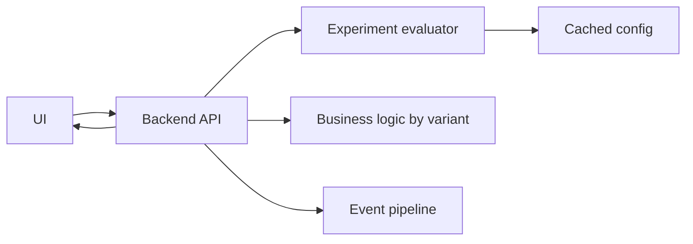

# Реализация на UI и backend

Эта заметка про практическую архитектуру: где считать variant, как передавать его на UI, как логировать exposure, как не сломать кэширование, SSR, мобильные клиенты и backend side effects.

## Содержание

- [Основные варианты архитектуры](#основные-варианты-архитектуры)
- [Backend-side assignment](#backend-side-assignment)
- [Frontend-side assignment](#frontend-side-assignment)
- [Edge-side assignment](#edge-side-assignment)
- [Как передавать variant](#как-передавать-variant)
- [UI implementation](#ui-implementation)
- [Backend implementation](#backend-implementation)
- [Caching и CDN](#caching-и-cdn)
- [Mobile clients](#mobile-clients)
- [SSR и hydration](#ssr-и-hydration)
- [Side effects](#side-effects)
- [Privacy и security](#privacy-и-security)
- [Операционные требования](#операционные-требования)
- [Типичные ошибки](#типичные-ошибки)
- [Interview-ready answer](#interview-ready-answer)

## Основные варианты архитектуры

Три частых места, где можно выбрать variant:

1. Backend API.
2. Frontend SDK.
3. Edge/gateway.

Выбор зависит от того, где находится поведение.

| Где считать variant | Когда удобно | Главный риск |
|---|---|---|
| Backend | business logic, pricing, checkout, permissions | дополнительная latency или dependency |
| Frontend | copy, layout, UI-only changes | flicker, inconsistent backend behavior |
| Edge | landing pages, CDN routing, geo/device rules | ограниченный context, сложный debug |

Практическое правило:
- если эксперимент влияет на деньги, права доступа, запись в DB или API response, считай variant на backend;
- если меняется только layout или текст, frontend-side может быть достаточно;
- если нужно маршрутизировать трафик между страницами или origins, edge-side может быть удобнее.

## Backend-side assignment

Backend-side assignment:
- API получает user/account/device context;
- вызывает experiment evaluator;
- получает variant;
- применяет бизнес-логику;
- возвращает UI нужную config часть;
- пишет exposure/outcome events.

Пример flow:



Плюсы:
- один источник истины;
- проще защищать sensitive rules;
- лучше для server-side business logic;
- можно связать outcome events с request/trace.

Минусы:
- API начинает зависеть от experimentation service;
- нужно думать про cache/fallback;
- если variant нужен очень рано на UI, может быть extra round trip.

Fallback:
- если experiment service недоступен, чаще возвращают `control`;
- для kill switch лучше держать local cached config;
- evaluator не должен блокировать critical path дольше короткого timeout.

## Frontend-side assignment

Frontend-side assignment:
- UI SDK получает config;
- определяет user/device;
- считает variant;
- рендерит нужный вариант;
- отправляет exposure event.

Плюсы:
- быстро для UI-only experiments;
- меньше backend изменений;
- удобно для copy/layout tests.

Минусы:
- flicker, если config пришел после initial render;
- можно раскрыть experiment rules в client bundle;
- сложнее синхронизировать с backend;
- ad blockers/privacy tools могут ломать analytics.

Когда нормально:
- текст кнопки;
- порядок блоков;
- цвет/визуальный акцент;
- onboarding screens без backend side effects.

Когда опасно:
- pricing;
- discount eligibility;
- permissions;
- recommendations, если backend должен отдавать разные данные.

## Edge-side assignment

Edge-side assignment происходит на CDN, reverse proxy или API gateway.

Примеры:
- split URL test для landing pages;
- route 5% traffic на новый origin;
- добавить header `X-Experiment-Variant`;
- выбрать HTML variant на edge.

Плюсы:
- очень рано в request path;
- удобно для CDN cached pages;
- можно не будить application backend для простых tests.

Минусы:
- меньше user context;
- сложнее local debug;
- rules могут отличаться от app rules;
- edge cache легко случайно смешивает variants.

## Как передавать variant

Варианты:

```http
X-Experiment-checkout-v2: treatment
```

```json
{
  "experiments": {
    "checkout_v2": "treatment",
    "pricing_copy": "control"
  }
}
```

```html
<script>
  window.__EXPERIMENTS__ = {
    checkout_v2: "treatment"
  };
</script>
```

Правила:
- не передавать лишние internal rules;
- не доверять client-provided variant для security/business decisions;
- включать experiment key и variant в logs/traces как attributes, но не как high-cardinality metrics labels;
- версия config должна быть видна в debug logs.

## UI implementation

UI должен:
- получить variant до рендера критичного участка;
- не показывать сначала control, потом treatment через секунду;
- отправить exposure только когда variant реально отрисован;
- отправлять product events с experiment context;
- корректно работать при offline/slow network.

Плохо:

```text
Render old checkout.
Fetch experiment config.
Replace checkout with new UI.
Log exposure.
```

Так появляется flicker и пользователь мог уже начать взаимодействие со старым UI.

Лучше:
- получить config вместе с initial API response;
- использовать SSR bootstrap config;
- показать neutral skeleton до выбора variant;
- для некритичных UI tests логировать exposure при появлении блока в viewport.

Пример UI event:

```json
{
  "event": "cta_click",
  "user_id": "user_123",
  "surface": "pricing_page",
  "experiments": {
    "pricing_copy_v3": "treatment"
  }
}
```

## Backend implementation

Backend обычно содержит:
- evaluator;
- config cache;
- targeting rules;
- deterministic bucketing;
- audit logs;
- event publisher;
- admin API или integration с flag platform.

Упрощенный интерфейс:

```go
type Evaluator interface {
    Evaluate(ctx context.Context, key string, subject Subject) Decision
}

type Subject struct {
    UserID    string
    AccountID string
    DeviceID  string
    Country   string
    Platform  string
}

type Decision struct {
    Variant string
    Reason  string
}
```

Что важно в Go/backend:
- evaluator должен быть быстрым и thread-safe;
- config cache должен обновляться атомарно;
- fallback должен быть явным;
- context timeout должен быть коротким;
- не делать network call к flag service на каждый request, если можно кэшировать config locally.

Плохой pattern:

```text
Every request -> remote flag service -> DB -> response
```

Лучше:

```text
Config sync in background -> local in-memory evaluator -> request path
```

## Caching и CDN

Эксперименты легко ломают cache.

Проблема:
- CDN закэшировал HTML для treatment;
- потом отдал его control пользователю.

Что учитывать:
- `Vary` headers;
- cache key;
- cookies;
- user-specific pages;
- edge assignment before cache lookup;
- public vs private cache.

Варианты:
- не кэшировать user-specific experimental responses публично;
- включать variant в cache key;
- делать assignment на edge до выбора cached object;
- разделять static assets и dynamic bootstrap config.

Тонкость:
- добавлять `user_id` в cache key почти всегда плохо, потому что cache hit rate рухнет;
- добавлять small variant key может быть нормально, если variants мало.

## Mobile clients

Mobile добавляет constraints:
- старые версии приложения живут долго;
- config может прийти позже initial screen;
- offline режим;
- app store release нельзя быстро заменить;
- backend должен поддерживать старые clients.

Практические правила:
- targeting по `app_version`;
- default behavior должен быть безопасным;
- удалять backend support только после deprecation window;
- не отправлять mobile client unknown required config без fallback;
- exposure логировать с `app_version` и `platform`.

## SSR и hydration

В SSR важно, чтобы server-rendered HTML и client hydration использовали один variant.

Плохо:

```text
Server rendered control.
Client SDK calculated treatment.
Hydration mismatch.
```

Лучше:
- считать variant на server;
- встроить bootstrap config в HTML;
- client SDK читает уже выбранный variant;
- exposure логируется один раз.

## Side effects

Если variant влияет на запись, платеж, email, notification или external call, нужна особая осторожность.

Правила:
- client не должен сам решать discount/business eligibility;
- backend должен валидировать variant и условия;
- idempotency keys должны учитывать operation, но не создавать дубли из-за retry;
- dark launch не должен выполнять реальные side effects;
- shadow traffic не должен писать в production DB или отправлять внешние сообщения.

Пример риска:

```text
Shadow request duplicated payment authorization.
```

Это не эксперимент, а production incident.

## Privacy и security

Что не стоит делать:
- класть PII в experiment event без необходимости;
- раскрывать sensitive targeting rules на client;
- использовать email/user_id как metric label;
- логировать raw payload с персональными данными;
- отправлять experiment context в third-party tools без privacy review.

Лучше:
- использовать internal stable ids;
- минимизировать event payload;
- явно описывать data retention;
- отделять product analytics от operational metrics;
- контролировать доступ к experiment results.

## Операционные требования

Production-ready experimentation требует:
- audit log для изменения flags;
- ownership у каждого experiment;
- kill switch;
- config versioning;
- alerts по guardrails;
- dashboards для rollout health;
- cleanup process после завершения;
- runbook для rollback.

Минимальные observability атрибуты в logs/traces:
- `experiment.key`;
- `experiment.variant`;
- `experiment.reason`;
- `experiment.config_version`;
- `user.segment` без PII.

## Типичные ошибки

- Считать variant и на frontend, и на backend разными алгоритмами.
- Доверять variant, присланному client, для pricing или permissions.
- Логировать exposure при assignment, а не при реальном показе.
- Не учитывать cache key и отдавать variant не той группе.
- Создавать high-cardinality Prometheus labels по user_id или experiment instance.
- Не иметь fallback, если flag provider недоступен.
- Оставлять старые flags в коде на месяцы.

## Interview-ready answer

Я бы считал variant там, где находится риск. Для business logic, pricing и side effects - на backend, с local cached config и быстрым fallback в control. Для простых UI-only тестов можно использовать frontend SDK, но нужно избежать flicker и логировать exposure только после реального показа. Variant нужно передавать в response/bootstrap config, добавлять в analytics events и traces, но не доверять client-provided variant для критичных решений. Отдельно нужно продумать cache key, SSR hydration, mobile app versions и kill switch.
