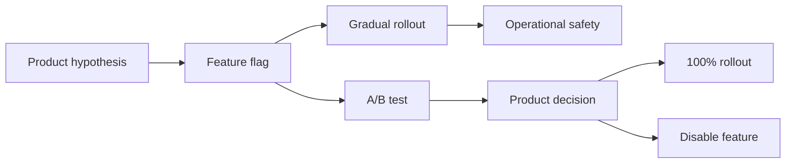

# Experimentation And Feature Rollouts

Этот раздел про A/B testing, feature flags, canary rollout, dark launch и похожие подходы, которые помогают менять продукт без "релиза вслепую".

Материалы полезны для backend/system design интервью, потому что эксперименты почти всегда затрагивают несколько слоев: UI, backend, assignment service, метрики, аналитику, privacy, observability и rollback.

## Как читать

1. Начни с видов экспериментов и rollout-подходов.
2. Затем отдельно разберись с feature flags (`02`). Если готовишься к Go system design interview — прочитай также `02a` с примерами реализации клиента.
3. После этого посмотри, как проектировать корректный A/B test.
4. Затем изучи общую реализацию experimentation на UI и backend.
5. В конце прочитай про метрики, анализ и типичные ловушки.

## Материалы

- [01. Виды экспериментов и rollout-подходов](./01-experimentation-and-rollout-types.md)
- [02. Feature flags на практике](./02-feature-flags-in-practice.md)
- [02a. Go implementation: feature flag client](./02a-feature-flags-golang-client.md)
- [03. Дизайн A/B теста и assignment](./03-ab-test-design-and-assignment.md)
- [04. Реализация на UI и backend](./04-ui-backend-implementation.md)
- [05. Метрики, анализ и типичные ошибки](./05-metrics-analysis-and-pitfalls.md)

## Короткая карта понятий

Главная мысль:
- `feature flag` отвечает на вопрос "кому включить поведение";
- `rollout` отвечает на вопрос "как безопасно раскатывать";
- `A/B test` отвечает на вопрос "стало ли лучше по метрикам";
- `observability` отвечает на вопрос "не сломали ли мы систему";
- `analytics` отвечает на вопрос "что изменилось для пользователя и бизнеса".

## Interview-ready answer

A/B testing - это не просто `if user in group A show old UI else show new UI`. В хорошей системе есть стабильное распределение пользователей по группам, контроль конфликтов между экспериментами, единое логирование exposure events, заранее выбранные primary/guardrail метрики и быстрый rollback через feature flag. Canary и gradual rollout больше про operational risk, а A/B test - про проверку продуктовой гипотезы статистически корректным способом.
