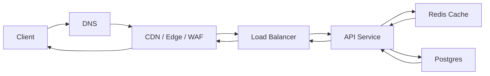

# Basic Public API Request Flow

Это базовая схема для большинства backend систем: клиент отправляет внешний запрос, тот проходит edge слой и доходит до приложения и базы данных.

## Схема

## Как читать эту схему

1. Клиент резолвит домен и приходит на edge слой
2. Edge фильтрует, ограничивает или просто проксирует трафик
3. Load balancer выбирает конкретный instance сервиса
4. API service выполняет business logic
5. Сервис читает или пишет данные в cache и DB
6. Ответ идет обратно тем же путем

## Что обычно делает каждый слой

`CDN / Edge / WAF`:
- TLS termination;
- DDoS protection;
- basic filtering;
- иногда cache статических или публичных ответов.

Под `edge` здесь обычно имеют в виду внешний периметр системы, например:
- Cloudflare;
- CloudFront;
- Fastly;
- Akamai;
- managed cloud WAF или внешний ingress edge.

`Load Balancer`:
- распределяет запросы между instances;
- убирает unhealthy nodes из rotation.

`API Service`:
- auth, validation, business logic;
- orchestration внутренних вызовов.

`Redis Cache`:
- быстрый lookup для hot data;
- разгрузка primary DB.

`Postgres`:
- источник истины для транзакционных данных.

## Где тут возникают bottlenecks

- LB шлет трафик в перегруженный instance;
- сервис ждет DB connection;
- cache miss превращает read path в дорогой SQL;
- внешний ответ упирается в slow query.

## Когда эта схема уже недостаточна

- если write path слишком дорогой и нужен async queue;
- если read traffic огромный и нужен CDN/cache-first path;
- если auth и routing сложные и нужен API gateway;
- если есть upload или media processing flow.
