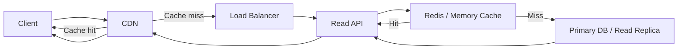

# Read Heavy Request With CDN And Cache

Когда система читает сильно чаще, чем пишет, маршрут запроса стараются сократить за счет cache layers.

## Схема

## Что меняется относительно базового flow

Здесь цель простая:
- как можно реже доходить до базы;
- а иногда вообще не доходить до origin.

Получается несколько cache layers:
- browser cache;
- CDN cache;
- service-side cache;
- DB page cache уже глубже в стеке.

## Типичный read path

1. Клиент приходит на CDN
2. Если есть CDN cache hit, origin вообще не трогается
3. Если CDN не помог, запрос идет в API
4. API проверяет Redis или in-memory cache
5. Только если cache miss, сервис идет в DB
6. Результат записывается в cache и возвращается наружу

## Что важно в design discussion

- что именно можно кэшировать;
- как устроен TTL;
- нужен ли cache invalidation;
- допускается ли stale response;
- есть ли personalized content, который ломает shared cache.

## Типичные trade-offs

Плюсы:
- ниже latency;
- меньше load на DB;
- дешевле масштабировать reads.

Минусы:
- stale data;
- invalidation complexity;
- hot keys;
- риск cache stampede.

## Что обычно спрашивают

- где поставить cache first;
- когда cache на CDN бесполезен;
- чем read replica отличается от Redis cache;
- как защититься от thundering herd на cache miss.
