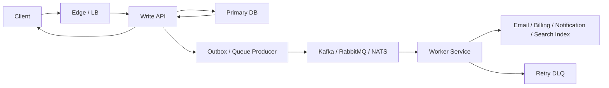

# Write Request With Queue And Async Processing

Когда после внешнего запроса нужно сделать тяжелую или медленную работу, write path часто делят на synchronous acknowledgement и asynchronous processing.

## Схема

## Что здесь происходит

Клиент ждет только критическую часть:
- валидацию;
- основную запись;
- подтверждение, что запрос принят.

Тяжелая работа выносится в фон:
- отправка email;
- обновление search index;
- fan-out notifications;
- expensive integration calls.

## Зачем это нужно

- уменьшить latency внешнего API;
- не держать клиент на длинном synchronous path;
- переживать spikes по трафику;
- отделить user-facing SLO от background processing.

## Важная architectural мысль

`200 OK` или `202 Accepted` не всегда означает, что вся работа уже завершена.

Иногда это значит только:
- запрос записан;
- событие гарантированно поставлено в очередь;
- дальше job обработается worker-ом.

## Где здесь риски

- запись в DB прошла, а сообщение в очередь потерялось;
- очередь жива, но worker отстает;
- downstream интеграция flaky;
- повторная обработка ломает idempotency.

Поэтому рядом почти всегда обсуждают:
- transactional outbox;
- idempotency keys;
- retry policy;
- dead letter queue.

## Что спрашивают на интервью

- когда отвечать `200`, а когда `202`;
- как не потерять событие между DB и broker;
- где обеспечивать idempotency;
- как видеть lag и backlog в очереди.
