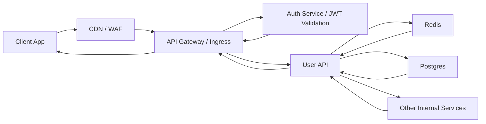

# Authenticated Request Through API Gateway

Во многих системах внешний запрос не идет напрямую в service. Сначала он проходит gateway и auth checks.

## Схема

## Что делает gateway

Gateway часто берет на себя:
- TLS termination;
- routing по path и host;
- authn pre-check;
- rate limiting;
- request size limits;
- tenant-level policies;
- observability headers.

## Что делает auth layer

Есть два частых варианта:

JWT validation на gateway:
- gateway сам проверяет подпись и claims;
- backend получает уже trusted identity context.

Session or token introspection:
- gateway или backend ходит в auth service;
- это дороже по latency, но иногда нужно для revocation и central policy.

## Зачем разделять gateway и backend

- меньше дублирования auth logic во всех сервисах;
- единая точка для external policies;
- проще вводить quotas, WAF rules и consistent headers.

## Где бывают проблемы

- gateway timeout меньше, чем timeout backend;
- auth service становится SPOF;
- слишком много логики у gateway;
- потеря реального client context между proxy hops.

## Что спрашивают на интервью

- где валидировать JWT;
- когда нужен API gateway, а когда достаточно LB;
- как прокидывать user identity во внутренние сервисы;
- что делать, если auth service деградирует.
