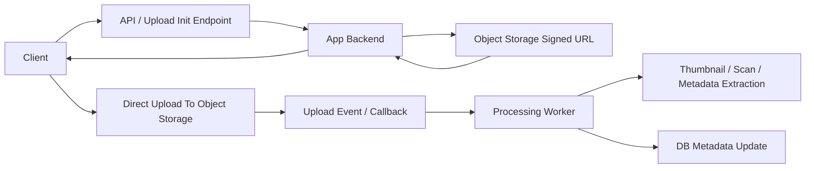

# File Upload And Background Processing Flow

Upload path часто выглядит иначе, чем обычный JSON API request. Большой файл не всегда должен проходить через backend целиком.

## Схема

## Почему не стоит тянуть весь upload через app server

Если файл большой:
- API service тратит bandwidth и CPU;
- сложнее масштабировать;
- растет стоимость и latency;
- app instances начинают быть bottleneck без пользы.

Поэтому часто делают так:
- backend выдает signed URL;
- клиент грузит файл напрямую в object storage;
- дальше событие запускает background processing.

## Что остается синхронным

Синхронно обычно происходит:
- auth;
- проверка права на upload;
- создание upload session;
- выдача signed URL.

А вот это уже async:
- virus scan;
- transcoding;
- thumbnail generation;
- metadata extraction.

## Где здесь риски

- signed URL живет слишком долго;
- клиент загрузил файл, но callback потерялся;
- processing worker не обновил статус;
- большой upload прерывается и нужен resumable protocol.

## Что спрашивают на интервью

- зачем signed URL;
- почему upload стоит выносить напрямую в object storage;
- где хранить статус обработки;
- как делать resumable upload и retry.
