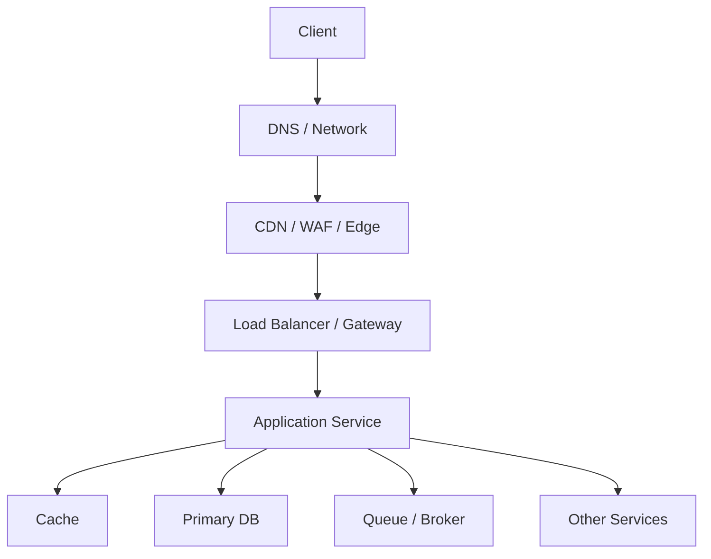

# Where Latency And Failures Appear

Сами схемы полезны только если ты умеешь на них показывать latency, failure domains и monitoring points.

## Универсальная схема слоев

Под `CDN / WAF / Edge` в такой схеме обычно понимают:
- Cloudflare;
- CloudFront;
- Fastly;
- Akamai;
- cloud perimeter services;
- внешний reverse proxy или ingress edge.

## Где копится latency

Снаружи приложения:
- DNS lookup;
- TLS handshake;
- edge queueing;
- WAF inspection;
- LB routing.

Внутри приложения:
- auth;
- middleware chain;
- slow serialization;
- waiting on connection pools;
- SQL;
- downstream fan-out.

После ответа:
- CDN behavior;
- browser parsing;
- frontend asset loading.

## Где обычно ломается система

Edge:
- misconfigured WAF;
- proxy timeout;
- bad route rule.

Application:
- panic;
- exhausted goroutines;
- pool starvation;
- cache outage.

Storage:
- slow query;
- lock contention;
- replica lag;
- unavailable broker.

Async path:
- backlog;
- retry storm;
- DLQ growth.

## Что надо показывать на схеме на интервью

На хорошей system design схеме надо явно показывать:
- synchronous path;
- asynchronous path;
- source of truth;
- cache layers;
- failure boundaries;
- observability points.

## Минимальный набор метрик по пути запроса

Edge:
- request rate;
- 4xx/5xx;
- TLS errors;
- p95 latency.

Gateway and app:
- RPS;
- p50, p95, p99;
- timeout rate;
- saturation по CPU, memory, connections.

DB and cache:
- query latency;
- hit ratio;
- pool wait;
- replication lag.

Queue:
- lag;
- retries;
- DLQ size;
- processing latency.

## Practical rule

Если схема не показывает:
- где sync path;
- где async path;
- где state;
- где cache;
- где система может упасть,

то это еще не system design схема, а просто набор коробок.
