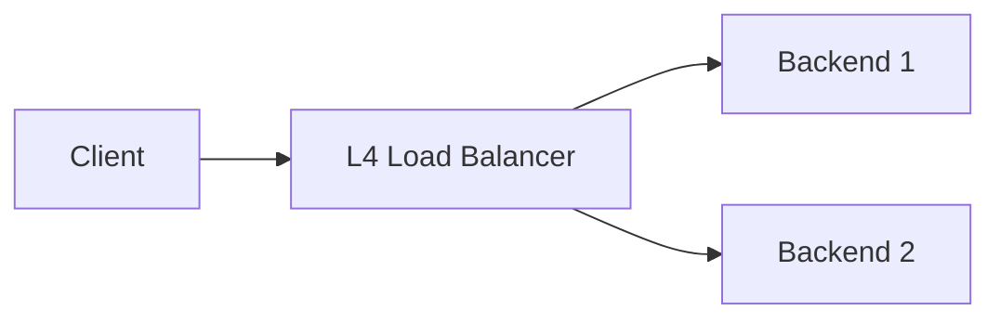
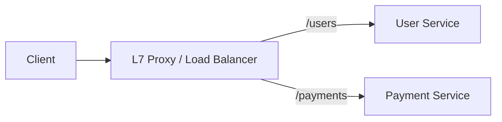

# Edge Roles And Terms

В system design люди часто говорят "edge", "proxy", "gateway", "LB", но смешивают разные роли.

## Содержание

- [Что такое `edge`](#что-такое-edge)
- [Зачем edge-функции нужны на практике](#зачем-edge-функции-нужны-на-практике)
- [Что такое `reverse proxy`](#что-такое-reverse-proxy)
- [Зачем эти reverse proxy функции нужны на практике](#зачем-эти-reverse-proxy-функции-нужны-на-практике)
- [How API Gateway overlaps with proxy and edge](#how-api-gateway-overlaps-with-proxy-and-edge)
- [Что такое `load balancer`](#что-такое-load-balancer)
- [Что такое `API gateway`](#что-такое-api-gateway)
- [Что такое `ingress`](#что-такое-ingress)
- [Важная мысль](#важная-мысль)
- [Быстрый mental model](#быстрый-mental-model)

## Что такое `edge`

`edge` это внешний периметр системы, который первым принимает трафик из интернета.

Он может делать:
- TLS termination;
- DDoS protection;
- WAF filtering;
- rate limiting;
- bot protection;
- caching;
- routing к origin.

Типичные примеры:
- Cloudflare;
- CloudFront;
- Fastly;
- Akamai;
- cloud perimeter services.

## Зачем edge-функции нужны на практике

Когда говорят `edge`, обычно имеют в виду не просто “еще один proxy”, а самый внешний слой, который встречает трафик раньше всех остальных.

Главная идея:
- чем раньше ты останавливаешь плохой, дорогой или нерелевантный traffic, тем дешевле и безопаснее система.

### TLS termination

Это означает, что `HTTPS` заканчивается на edge:
- клиент устанавливает TLS-сессию с edge;
- edge расшифровывает трафик;
- дальше внутрь сети запрос может пойти уже как `HTTP` или как новый внутренний `TLS`.

Когда это полезно:
- не хочется, чтобы каждый backend сам занимался сертификатами;
- нужен единый контроль за cipher suites, renewal, certificate rotation;
- нужен централизованный perimeter для внешнего `HTTPS`.

Какую проблему это решает:
- снимает TLS-операции с приложений;
- упрощает certificate management;
- позволяет централизованно enforce security policy;
- делает внешний вход единообразным.

Но важно:
- это не всегда значит “внутри можно без шифрования”, потому что в zero-trust или cloud-средах часто делают re-encryption и дальше.

### DDoS protection

Это защита от volumetric или protocol-level атак, где цель:
- залить сервис огромным трафиком;
- занять соединения;
- выбить доступность до того, как запрос вообще дойдет до приложения.

Когда это нужно:
- у сервиса публичный интернет-вход;
- сервис может стать целью массового мусорного traffic;
- backend и app-серверы не рассчитаны на прямую встречу с таким объемом.

Какую проблему это решает:
- edge отсекает атаку раньше, чем она доходит до origin;
- backend не тратит CPU, память и connection slots на мусор;
- снижается риск полного outage из-за перегрузки сети или L7.

Полезно понимать:
- DDoS protection — это не бизнес rate limit;
- это perimeter defense против аномального трафика на уровне объема/паттерна.

### WAF

`WAF` = `Web Application Firewall`.

Он пытается обнаружить и отфильтровать типовые вредоносные запросы:
- SQL injection patterns;
- XSS-like payloads;
- path traversal;
- suspicious headers;
- known attack signatures.

Когда это полезно:
- публичный web/API perimeter;
- не хочешь, чтобы backend был первой линией защиты;
- есть типовые attack classes, которые можно ловить сигнатурно.

Какую проблему это решает:
- часть массовых и тупых атак отсекается до приложения;
- уменьшается шум в backend logs;
- есть еще один защитный слой кроме app validation.

Но важно:
- WAF не заменяет безопасный код;
- он ловит только часть проблем;
- если бизнес-логика уязвима, WAF сам по себе это не исправит.

### Bot protection

Это уже не про volumetric DDoS, а про нежелательный automation traffic:
- скрейперы;
- credential stuffing;
- brute force;
- abuse bots;
- mass signup/reservation attempts.

Когда это полезно:
- есть публичная форма логина;
- есть sensitive endpoints;
- сервис страдает от automated abuse, а не просто от большого объема трафика.

Какую проблему это решает:
- edge может раньше отличить человеческий и машинный паттерн;
- часть вредного automation traffic блокируется без нагрузки на backend;
- уменьшается злоупотребление ресурсами и API.

Обычно это включает:
- behavioral checks;
- reputation signals;
- CAPTCHA / challenge pages;
- browser fingerprint / device risk signals.

### CDN / cache

На edge можно отдавать:
- static assets;
- cacheable API responses;
- public content, который редко меняется.

Когда это полезно:
- контент читается намного чаще, чем обновляется;
- хочется уменьшить latency для пользователей из разных регионов;
- не хочется тащить каждый запрос до origin.

Какую проблему это решает:
- часть запросов вообще не доходит до backend;
- уменьшается нагрузка на origin;
- пользователи получают ответ быстрее за счет cache ближе к ним;
- растет resilience при всплесках read traffic.

Но важно:
- cache хорош только там, где допустима cache semantics;
- для highly dynamic/private data это уже сложнее.

### Coarse traffic filtering

Это грубая фильтрация трафика на границе:
- блок по geo;
- блок по IP reputation;
- блок по ASN/network;
- allow/deny rules;
- простые path/method restrictions;
- early reject по malformed request.

Когда это полезно:
- нужно быстро отсечь заведомо нежелательный traffic;
- не хочется тратить backend ресурсы на очевидно бесполезные запросы;
- нужны perimeter-level policy controls.

Какую проблему это решает:
- снижает шум и нагрузку на внутренние сервисы;
- уменьшает blast radius плохого трафика;
- позволяет держать более строгий perimeter без загрязнения app-кода.

Ключевое слово здесь — `coarse`.

Это не место для сложной доменной логики.  
Это место для правил вида:
- “этот traffic вообще не должен пройти внутрь”.

## Что такое `reverse proxy`

Reverse proxy принимает запрос от клиента и пересылает его дальше во внутренний сервис.

Он может:
- завершать TLS;
- добавлять или переписывать headers;
- буферизовать тело;
- ограничивать размер запроса;
- маршрутизировать по host и path;
- логировать.

Типичные инструменты:
- Nginx;
- Envoy;
- HAProxy.

## Зачем эти reverse proxy функции нужны на практике

Вот здесь чаще всего и возникает путаница: список возможностей понятен, а зачем держать это на proxy-слое, а не в приложении, неочевидно.

Полезная эвристика такая:
- если проблема относится к внешнему HTTP traffic и одинаково повторяется для многих сервисов, это хороший кандидат для edge/proxy уровня;
- если это уже зависит от бизнес-правил конкретного сервиса, это обычно задача приложения.

### Добавлять или переписывать headers

Это нужно, когда backend-сервису не хватает нормального контекста о запросе или когда этому контексту нельзя доверять в том виде, в котором он пришел от клиента.

Типичные примеры:
- добавить `X-Forwarded-For`, чтобы backend видел реальный client IP, а не IP самого proxy;
- добавить `X-Forwarded-Proto: https`, чтобы backend понимал, что снаружи был `HTTPS`, даже если внутри сеть уже `HTTP`;
- добавить `X-Request-Id` или `traceparent`, чтобы дальше было проще коррелировать логи и traces;
- вычистить опасные клиентские headers, которые пользователь мог подделать.

Какую проблему это решает:
- backend получает единый и предсказуемый request context;
- не нужно в каждом сервисе отдельно разбираться с цепочкой прокси;
- проще логирование, tracing и audit;
- уменьшается риск spoofed headers.

Идея в том, что proxy — это доверенный слой на границе, а клиент — нет.

### Буферизовать тело

Буферизация означает, что proxy сначала принимает request body к себе, а уже потом отправляет его в upstream.

Когда это полезно:
- клиент медленный;
- upload большой;
- backend не должен держать соединение с интернетом слишком долго;
- нужно сначала проверить request, а только потом пускать его глубже.

Какую проблему это решает:
- защищает backend от slow client / slowloris-подобных сценариев;
- позволяет раньше отбросить плохой запрос;
- уменьшает давление на приложение, которое иначе само долго читало бы body из внешней сети;
- делает трафик до backend более ровным и управляемым.

Но тут есть tradeoff:
- buffering расходует память и/или диск на самом proxy;
- для streaming use case это уже не всегда хорошо.

### Ограничивать размер запроса

Proxy может заранее сказать:
- body больше `N MB` не принимаем;
- слишком большие headers не принимаем;
- multipart upload вне лимита сразу отклоняем.

Когда это полезно:
- API ожидает небольшой JSON, а не гигантский payload;
- надо защититься от случайного или злонамеренного oversized request;
- backend не должен тратить CPU/память на заведомо неподходящий запрос.

Какую проблему это решает:
- защита от resource exhaustion;
- отказ происходит раньше и дешевле;
- backend-код не обязан быть первой линией защиты от мусорного трафика.

Это особенно полезно для публичных API, где нельзя предполагать “добросовестного клиента”.

### Маршрутизировать по host и path

Proxy может решить, куда отправить запрос, глядя на:
- `Host`;
- URL path;
- иногда method, headers или cookies.

Примеры:
- `api.example.com` -> backend API;
- `admin.example.com` -> admin service;
- `/api/*` -> application backend;
- `/static/*` -> CDN или static server;
- `/payments/*` -> отдельный payment service.

Какую проблему это решает:
- клиенту не нужно знать внутреннюю topology;
- можно держать один внешний вход и много внутренних сервисов;
- проще развивать архитектуру без изменения внешнего контракта;
- проще делать versioning, migration и rollout.

Именно поэтому reverse proxy или ingress часто становится первой точкой L7 routing.

### Логировать

Proxy видит весь входящий трафик раньше приложений, поэтому это очень сильная точка наблюдения.

Что он обычно может логировать:
- method;
- host;
- path;
- status code;
- request size;
- response size;
- latency;
- client IP;
- user-agent;
- upstream target.

Какую проблему это решает:
- можно видеть весь входящий traffic даже если backend не ответил или упал;
- можно быстро понять, проблема на edge, в upstream или у клиента;
- это базовый access log слой для расследования инцидентов;
- удобно искать spikes по `4xx`, `5xx`, path, IP, user-agent.

Но важно:
- proxy logs не заменяют application logs;
- proxy знает transport и routing, но не знает бизнес-смысл операции.

### Что обычно стоит делать на proxy, а что нет

Хорошо выносить на proxy:
- transport-level headers;
- базовые request size limits;
- routing;
- TLS termination;
- access logging;
- coarse-grained rate limiting;
- общие WAF/security policies.

Не стоит выносить туда то, что уже зависит от доменной логики:
- бизнес-валидацию;
- сложную авторизацию уровня предметной области;
- правила конкретного use case;
- domain-specific error mapping.

То есть proxy решает проблемы границы системы, а не проблемы бизнес-логики.

## How API Gateway overlaps with proxy and edge

Вот тут как раз многие начинают путаться, потому что `API gateway` действительно пересекается с функциями и `reverse proxy`, и `edge`.

Правильнее думать не “что это за коробка по названию”, а “какой слой какую проблему решает”.

### Где overlap с reverse proxy

`API gateway` почти всегда умеет то, что умеет обычный L7 proxy:
- routing по host/path;
- header rewrite;
- request/response transformation;
- TLS termination;
- access logging;
- rate limiting.

То есть технически gateway очень часто построен на тех же механизмах, что и reverse proxy.

Разница обычно в фокусе:
- `reverse proxy` — transport/routing component;
- `API gateway` — transport plus API policy layer.

То есть gateway — это часто “proxy + centralized API policies”.

### Где overlap с edge

Если gateway стоит на самом внешнем входе, он может частично делать и edge-функции:
- TLS termination;
- coarse rate limiting;
- basic request filtering;
- иногда auth challenge;
- иногда caching.

Но чаще сильные perimeter-задачи все же живут раньше gateway:
- DDoS protection;
- WAF;
- bot protection;
- CDN edge cache.

Почему:
- эти функции должны сработать как можно раньше;
- чем ближе к интернет-периметру стоит защита, тем лучше.

### Что обычно логично оставлять gateway

На gateway хорошо живут API-aware задачи:
- API keys;
- quotas;
- tenant policies;
- auth at API boundary;
- centralized routing;
- request transformation;
- common API logging/metrics.

Почему:
- gateway уже понимает API shape лучше, чем просто edge;
- но еще не должен знать доменную бизнес-логику конкретного сервиса.

### Что не стоит тащить в gateway

Плохая идея:
- сложная бизнес-валидация;
- доменные правила use case;
- orchestration нескольких внутренних сервисов ради бизнес-смысла;
- тяжелая предметная авторизация.

Почему:
- gateway быстро становится god-service;
- логика дублируется между gateway и backend;
- система становится хрупкой и трудно развиваемой.

### Полезная practical модель

Если грубо:

- `edge` защищает внешний периметр;
- `reverse proxy` проксирует и маршрутизирует HTTP traffic;
- `API gateway` управляет API traffic и общими политиками;
- `app` решает доменную задачу.

На практике один и тот же продукт может сочетать несколько ролей, но мыслить полезно именно по problem boundaries, а не по маркетинговому названию компонента.

## Что такое `load balancer`

Load balancer выбирает, на какой instance, VM, pod или service отправить запрос.

Он может работать:
- на L4 уровне;
- на L7 уровне.

Часто делает:
- health checks;
- balancing algorithm;
- failover;
- connection draining.

### Что такое `L4` простыми словами

`L4` значит, что балансировщик смотрит только на сетевое соединение:
- IP-адрес;
- порт;
- TCP или UDP.

Он не понимает смысл HTTP-запроса.

То есть для него нет разницы между:
- `GET /users`
- `POST /payments`

Он видит примерно только это:
- пришло соединение на порт `443`;
- его надо отправить на один из backend servers.

Упрощенная схема:

Когда это уместно:
- нужен быстрый и простой балансировщик;
- не нужна маршрутизация по URL, headers или cookies;
- важно просто распределить TCP или UDP трафик.

### Что такое `L7` простыми словами

`L7` значит, что балансировщик или proxy уже понимает application protocol, чаще всего HTTP.

Он видит не только "есть соединение", но и сам запрос:
- host;
- path;
- method;
- headers;
- cookies.

То есть он может понять разницу между:
- `GET /users`
- `POST /payments`
- `api.example.com`
- `admin.example.com`

И на основе этого отправить запрос в разные сервисы.

Упрощенная схема:

Когда это уместно:
- нужен routing по path или host;
- нужен API gateway;
- нужен ingress в Kubernetes;
- нужно делать auth, rate limit, rewrite headers или другие HTTP policies.

### Самая короткая разница

`L4`:
- понимает соединение;
- не понимает содержание HTTP-запроса.

`L7`:
- понимает HTTP-запрос;
- может принимать решения по его содержимому.

## Что такое `API gateway`

API gateway это слой управления внешними API.

Обычно берет на себя:
- auth;
- quota;
- API keys;
- tenant policies;
- request transformation;
- centralized routing.

## Что такое `ingress`

Ingress в Kubernetes это входная точка в cluster для HTTP и HTTPS traffic.

Обычно в k8s path такой:
- внешний cloud LB;
- ingress controller;
- service;
- pod.

## Важная мысль

Один и тот же компонент может выполнять несколько ролей.

Например `nginx` может быть:
- reverse proxy;
- ingress controller;
- простой L7 load balancer;
- static file server.

А `Cloudflare` может одновременно быть:
- edge;
- CDN;
- WAF;
- TLS termination layer.

## Быстрый mental model

Если упростить:
- `edge` это внешняя граница;
- `reverse proxy` это посредник перед приложением;
- `load balancer` это слой распределения трафика;
- `gateway` это policy и API control plane;
- `ingress` это Kubernetes entrypoint.
